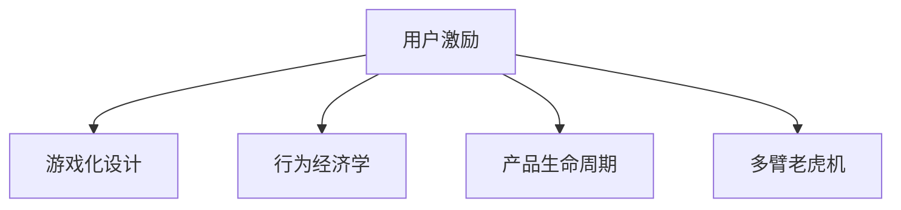

                 

## 1. 背景介绍

### 1.1 问题由来
在互联网和移动互联网时代，用户激励机制已成为提高产品粘性、促进用户增长的关键手段。无论是社交平台、电商网站还是内容应用，无处不在的用户激励策略都在扮演着至关重要的角色。然而，如何设计有效的用户激励机制，是一个复杂且多维的问题。它不仅需要考虑用户的心理需求、行为动机，还需兼顾业务的商业目标。

### 1.2 问题核心关键点
用户激励的核心在于如何通过合理的设计和使用策略，激发用户参与度、提高用户满意度，进而实现业务的增长和用户留存。核心关键点包括：
- 设计用户友好的激励机制，确保用户体验。
- 精准定位用户需求，制定有针对性的激励措施。
- 保证激励策略的可持续性，避免过度激励导致的用户流失。
- 持续监测和评估激励效果，及时调整激励策略。
- 结合数据挖掘和机器学习技术，实现个性化激励。

### 1.3 问题研究意义
深入研究用户激励机制，对提升产品粘性、增加用户参与度具有重要意义：

1. **提高用户留存率**：有效的激励措施能够显著提高用户留存率，延长用户生命周期。
2. **促进用户转化**：通过激励策略可以鼓励用户完成目标行为，如注册、购买、推荐等。
3. **增强用户粘性**：适度的激励能够提升用户对产品的依赖性和忠诚度，增加日活和月活。
4. **提升用户价值**：通过精准定位激励对象，可以提升用户活跃度和消费水平。
5. **优化业务收益**：合理的激励策略可以降低获客成本，提升用户终身价值。

## 2. 核心概念与联系

### 2.1 核心概念概述

为更好地理解用户激励机制，本节将介绍几个密切相关的核心概念：

- **用户激励(User Incentive)**：通过设计各种奖励机制，激励用户完成特定行为，提高用户参与度和满意度。
- **游戏化设计(Game Design)**：借鉴游戏设计元素，如成就、关卡、积分等，提升用户体验和粘性。
- **行为经济学(Behavioral Economics)**：研究用户在经济决策中的心理和行为特征，为设计有效激励策略提供理论依据。
- **产品生命周期(Product Lifecycle)**：分析用户行为在不同产品生命周期阶段的特点，制定有针对性的激励措施。
- **多臂老虎机(Multi-Armed Bandit)**：一种机器学习模型，用于优化激励策略，最大化用户收益。

这些核心概念之间的逻辑关系可以通过以下Mermaid流程图来展示：



这个流程图展示了几者之间的关系：

1. **用户激励**是核心，通过游戏化设计、行为经济学、产品生命周期分析等手段进行具体实施。
2. **游戏化设计**提供了激励方式的多样性和趣味性。
3. **行为经济学**揭示了用户行为背后的心理特征和决策机制。
4. **产品生命周期分析**考虑了用户在不同阶段的激励需求变化。
5. **多臂老虎机**提供了激励策略的优化算法，以最大化用户收益。

## 3. 核心算法原理 & 具体操作步骤
### 3.1 算法原理概述

用户激励机制的核心是设计一系列的奖励和惩罚措施，以引导用户完成特定的行为。从算法原理上讲，用户激励机制可以看作是一个强化学习过程，目标是通过不断迭代，优化奖励和惩罚措施，以达到最优的激励效果。

设用户集为 $U$，行为集为 $A$，状态集为 $S$，奖励函数为 $R(S, A)$，则用户激励的目标是最大化长期累积奖励 $E$，即：

$$
E = \max_{\pi} \mathbb{E}\left[\sum_{t=0}^{\infty} \gamma^t R(S_t, A_t)\right]
$$

其中 $\pi$ 为用户的行为策略，$S_t$ 为用户在时间 $t$ 的状态，$A_t$ 为用户在时间 $t$ 的行为，$\gamma$ 为折扣因子。

### 3.2 算法步骤详解

用户激励机制的设计和实施一般包括以下几个关键步骤：

**Step 1: 需求分析与用户细分**
- 进行用户调研和数据分析，了解不同用户群体的需求和偏好。
- 根据用户的行为数据和心理特征，将用户进行细分，制定有针对性的激励策略。

**Step 2: 设计激励措施**
- 确定激励措施的类型和强度，如积分、优惠券、奖励金等。
- 设计用户完成特定行为后的奖励和惩罚规则，例如积分兑换规则、折扣力度等。

**Step 3: 实施激励策略**
- 选择适合的实施渠道，如移动应用、邮件通知、短信推送等。
- 在产品中进行相应的界面和流程设计，确保用户能够方便地完成激励行为。

**Step 4: 监测和评估效果**
- 通过用户行为数据，实时监测激励措施的实施效果。
- 收集用户的反馈和评价，评估激励策略的用户满意度。

**Step 5: 调整和优化激励策略**
- 根据监测和评估结果，调整激励措施的参数和实施方式。
- 利用多臂老虎机等优化算法，优化奖励和惩罚策略。

### 3.3 算法优缺点

用户激励机制的优点在于：
1. **提高用户参与度**：通过激励措施，能够显著提高用户对产品的使用频率和活跃度。
2. **优化业务指标**：合理的激励策略可以提升转化率、留存率、消费额等关键业务指标。
3. **增加用户粘性**：适度的激励能够增强用户对产品的忠诚度和依赖性。
4. **数据驱动决策**：通过数据挖掘和机器学习，可以实时优化激励策略，提升效果。

然而，用户激励机制也存在一定的局限性：
1. **成本高昂**：高强度的激励措施可能导致公司成本大幅增加。
2. **用户依赖性**：过度依赖激励的用户可能会在激励减少或停止后失去兴趣。
3. **效果短期**：激励措施的效果往往具有时效性，难以长期维持。
4. **数据隐私**：收集用户数据进行激励策略优化时，可能涉及用户隐私和数据安全问题。

尽管如此，用户激励机制仍是大数据时代提升产品竞争力的重要手段，合理运用可以显著增强用户体验和业务收益。

### 3.4 算法应用领域

用户激励机制在多个领域都有广泛应用，包括但不限于：

- **电商应用**：如折扣促销、积分奖励、购物返现等，提升用户购买转化和复购率。
- **社交平台**：如好友邀请、点赞分享、会员积分等，增加用户活跃度和互动。
- **内容应用**：如阅读打卡、观看奖励、订阅优惠等，鼓励用户创建和分享内容。
- **游戏应用**：如关卡挑战、成就系统、装备强化等，提升用户的游戏体验和留存率。
- **教育应用**：如学习奖励、任务完成、考试竞赛等，激励用户学习和参与。
- **金融应用**：如贷款利率优惠、理财收益奖励等，促进用户使用金融产品。

除了上述这些常见领域，用户激励机制在健康、娱乐、公益等众多领域也有重要应用，助力各行业的数字化转型和智能化升级。

## 4. 数学模型和公式 & 详细讲解
### 4.1 数学模型构建

用户激励机制的设计和优化可以通过数学模型进行建模和求解。以下是一个简单的马尔可夫决策过程（MDP）模型，用于描述用户在不同状态下的行为选择和奖励累积：

设用户状态集合为 $S = \{s_1, s_2, ..., s_n\}$，行为集合为 $A = \{a_1, a_2, ..., a_m\}$，奖励函数为 $R: S \times A \rightarrow [0, 1]$，状态转移概率为 $P: S \times A \rightarrow [0, 1]$，则MDP模型的状态转移和奖励函数可表示为：

$$
P(s_{i+1} | s_i, a_i) = P(s_i, a_i) \times R(s_i, a_i)
$$

其中 $P(s_i, a_i)$ 表示在状态 $s_i$ 下，用户执行行为 $a_i$ 的概率。

### 4.2 公式推导过程

在MDP模型中，用户激励的目标是最大化长期累积奖励。设用户在某状态下采取某行为后的奖励为 $R(s_i, a_i)$，状态转移概率为 $P(s_{i+1} | s_i, a_i)$，则用户在时间 $t$ 的状态为 $S_t$，行为为 $A_t$，长期累积奖励 $E$ 可表示为：

$$
E = \sum_{t=0}^{\infty} \gamma^t R(S_t, A_t)
$$

其中 $\gamma$ 为折扣因子，通常取值范围为 $0 < \gamma < 1$。

通过动态规划算法，可以求解上述最优化问题，得到最优策略 $\pi$，使得长期累积奖励 $E$ 最大化。

### 4.3 案例分析与讲解

考虑一个简单的电商平台的激励策略案例。平台希望通过优惠券吸引新用户注册，并通过积分制度鼓励老用户复购。

1. **需求分析与用户细分**
   - 分析平台新用户和老用户的行为数据，发现新用户对价格敏感，老用户对积分奖励更为关注。
   - 将用户细分为新用户和老用户两个群体，分别制定激励策略。

2. **设计激励措施**
   - 对于新用户，设计优惠券奖励机制，首单优惠20%。
   - 对于老用户，设计积分兑换奖励，每消费100元积1分，积分可用于兑换优惠券或折扣。

3. **实施激励策略**
   - 在平台APP中设置优惠券领取入口，并在注册页面展示。
   - 在订单结算页显示积分余额，并提示积分兑换规则。

4. **监测和评估效果**
   - 通过APP用户行为数据，实时监测优惠券领取和使用情况。
   - 收集用户反馈，评估积分兑换制度的满意度和使用率。

5. **调整和优化激励策略**
   - 根据监测数据，调整优惠券发放策略，优化积分兑换比例。
   - 利用多臂老虎机算法，优化积分和优惠券的发放时机和数量。

通过上述案例，可以看到，用户激励机制的设计和优化需要基于数据和用户行为分析，通过动态调整和优化策略，最大化激励效果。

## 5. 项目实践：代码实例和详细解释说明
### 5.1 开发环境搭建

在进行用户激励机制开发前，我们需要准备好开发环境。以下是使用Python进行Flask开发的环境配置流程：

1. 安装Anaconda：从官网下载并安装Anaconda，用于创建独立的Python环境。

2. 创建并激活虚拟环境：
```bash
conda create -n user_incentive_env python=3.8 
conda activate user_incentive_env
```

3. 安装Flask：
```bash
pip install flask
```

4. 安装数据库：
```bash
pip install flask_sqlalchemy
```

5. 安装其它工具包：
```bash
pip install numpy pandas scikit-learn sklearn pyspark requests
```

完成上述步骤后，即可在`user_incentive_env`环境中开始激励机制的开发和实现。

### 5.2 源代码详细实现

接下来，我们以一个简单的电商平台的激励策略开发为例，给出Flask应用的完整代码实现。

首先，定义激励策略的模型类：

```python
from flask_sqlalchemy import SQLAlchemy

db = SQLAlchemy()

class UserIncentive(db.Model):
    id = db.Column(db.Integer, primary_key=True)
    user_id = db.Column(db.String(100), unique=True)
    coupon_id = db.Column(db.String(100))
    reward_type = db.Column(db.String(100))
    redeemed = db.Column(db.Boolean, default=False)
```

然后，定义激励策略的视图和控制器：

```python
from flask import Flask, render_template, request, redirect, url_for
from flask_sqlalchemy import SQLAlchemy

app = Flask(__name__)
app.config['SQLALCHEMY_DATABASE_URI'] = 'sqlite:///users.db'
db = SQLAlchemy(app)

@app.route('/')
def index():
    return render_template('index.html')

@app.route('/coupon', methods=['POST'])
def apply_coupon():
    user_id = request.form['user_id']
    coupon_id = request.form['coupon_id']
    reward_type = request.form['reward_type']
    incentive = UserIncentive(user_id=user_id, coupon_id=coupon_id, reward_type=reward_type)
    db.session.add(incentive)
    db.session.commit()
    return redirect(url_for('index'))

@app.route('/redeem', methods=['POST'])
def redeem_coupon():
    user_id = request.form['user_id']
    coupon_id = request.form['coupon_id']
    incentive = UserIncentive.query.filter_by(user_id=user_id, coupon_id=coupon_id).first()
    if incentive:
        incentive.redeemed = True
        db.session.commit()
    return redirect(url_for('index'))
```

最后，定义数据库迁移和运行服务：

```python
if __name__ == '__main__':
    db.create_all()
    app.run(debug=True)
```

在上述代码中，我们定义了一个`UserIncentive`模型，用于存储用户的激励信息和兑换状态。通过Flask应用，用户可以通过网页提交申请优惠券的请求，并查询已申请的优惠券是否可用。

### 5.3 代码解读与分析

让我们再详细解读一下关键代码的实现细节：

**UserIncentive模型**：
- `id` 字段为模型的主键。
- `user_id` 字段用于存储用户的唯一标识。
- `coupon_id` 字段用于存储优惠券的唯一标识。
- `reward_type` 字段用于存储激励类型的名称。
- `redeemed` 字段用于标记优惠券是否已经兑换。

**Flask应用**：
- 通过`@app.route`装饰器，将视图函数与URL路径绑定。
- 在`index`函数中，展示激励策略的使用界面。
- 在`apply_coupon`函数中，用户可以提交优惠券申请，系统会将其保存到数据库中。
- 在`redeem_coupon`函数中，用户可以查询已申请的优惠券并兑换。

可以看出，通过Flask应用，我们实现了一个简单的电商激励策略系统。开发者可以根据具体需求，进一步扩展和优化激励策略的功能，如积分管理、积分兑换、用户评分等。

### 5.4 运行结果展示

运行上述代码，启动Flask应用，并通过浏览器访问`http://localhost:5000`，即可以看到激励策略的使用界面。用户可以通过该界面申请优惠券、查询已申请的优惠券等，实现基本的激励策略功能。

## 6. 实际应用场景
### 6.1 智能客服系统

智能客服系统通过用户激励机制，能够显著提升用户满意度和系统响应速度。用户在使用智能客服时，可以通过完成任务获得积分奖励，增加用户的参与度和忠诚度。

在技术实现上，可以设计如下激励策略：
- **任务完成奖励**：用户每完成一个任务，获得一定积分。
- **回复质量奖励**：系统自动评估用户回复的质量，根据评分发放不同积分。
- **知识库学习奖励**：用户学习新知识，完成指定课程，获得积分奖励。

通过这些激励机制，智能客服系统能够更好地吸引用户，提升系统性能和用户粘性。

### 6.2 游戏应用

游戏应用通过丰富的用户激励措施，能够增强用户的游戏体验和留存率。游戏内的激励措施通常包括以下几个方面：

- **成就系统**：玩家完成特定任务，获得成就称号，解锁新的游戏内容。
- **装备强化**：玩家在游戏中获得的装备可以进行强化，提升属性和能力。
- **道具奖励**：玩家完成任务、挑战，获得稀有道具，增加游戏乐趣。
- **社交互动**：玩家通过好友赠送、团队合作等方式获得奖励，增强社交粘性。

这些激励措施通过游戏化的设计，能够持续吸引玩家，增加游戏的趣味性和可玩性。

### 6.3 金融应用

金融应用通过激励策略，能够提升用户的活跃度和使用频率。具体激励措施包括：
- **推荐奖励**：用户推荐新用户注册，获得一定比例的奖励金。
- **理财奖励**：用户完成理财任务，获得积分奖励，积分可用于兑换其他理财产品。
- **借款优惠**：用户借款后按时还款，获得积分奖励，积分可用于免息再借款。

通过这些激励措施，金融应用能够促进用户的使用和消费，增加用户粘性和收益。

### 6.4 未来应用展望

随着用户激励机制的不断发展，其在更多领域的应用前景将更加广阔：

- **医疗健康**：通过激励措施，鼓励用户进行健康监测和运动，提升用户健康水平。
- **教育培训**：通过任务奖励和知识竞赛，激励学生学习和进步，提升教育质量。
- **公共服务**：通过积分和奖励，鼓励市民参与环保、公益等活动，提升社会责任感。
- **智能家居**：通过任务和奖励，引导用户使用智能设备，提升家庭智能水平。
- **农业管理**：通过激励措施，鼓励农民使用现代化农具和技术，提升农业生产效率。

## 7. 工具和资源推荐
### 7.1 学习资源推荐

为了帮助开发者系统掌握用户激励机制的理论基础和实践技巧，这里推荐一些优质的学习资源：

1. **《行为经济学》**：《行为经济学》课程，由斯坦福大学教授讲授，深入浅出地介绍了行为经济学原理及其在激励设计中的应用。
2. **《多臂老虎机：强化的学习》**：深入讲解了多臂老虎机模型的原理和应用，适合有数学基础的读者深入学习。
3. **《游戏设计基础》**：《游戏设计基础》课程，介绍了游戏设计的基本原理和常用设计元素。
4. **《用户激励的心理学》**：《用户激励的心理学》书籍，全面介绍了用户心理特征和激励策略的心理学原理。
5. **《数据驱动的用户行为分析》**：深入讲解了数据驱动的用户行为分析方法和工具，适合实际应用开发。

通过这些资源的学习实践，相信你一定能够快速掌握用户激励机制的精髓，并用于解决实际的业务问题。

### 7.2 开发工具推荐

高效的开发离不开优秀的工具支持。以下是几款用于用户激励机制开发的常用工具：

1. **Flask**：轻量级的Web框架，适合快速开发用户激励系统的后端服务。
2. **MySQL/PostgreSQL**：常用的关系型数据库，适合存储和管理用户激励数据。
3. **Redis**：高并发的键值数据库，适合存储用户激励状态的实时更新。
4. **Kafka**：分布式消息队列，适合处理高并发的事务通知和消息推送。
5. **Prometheus/Grafana**：实时监控和可视化工具，适合监测和评估用户激励策略的效果。

合理利用这些工具，可以显著提升用户激励系统的开发效率，加快创新迭代的步伐。

### 7.3 相关论文推荐

用户激励机制的研究源于学界的持续研究。以下是几篇奠基性的相关论文，推荐阅读：

1. **《用户激励机制设计》**：详细介绍了用户激励机制的基本原理和设计方法，适合入门读者学习。
2. **《基于游戏化设计的激励策略》**：通过游戏化设计元素，探讨了提高用户参与度的激励策略。
3. **《多臂老虎机算法在激励策略中的应用》**：通过多臂老虎机算法，优化了激励策略的参数和实施方式。
4. **《行为经济学在激励策略中的应用》**：结合行为经济学原理，探讨了激励策略的设计和优化方法。
5. **《数据驱动的用户行为分析》**：通过数据挖掘和机器学习，优化了激励策略的参数和实施方式。

这些论文代表了大用户激励机制的发展脉络。通过学习这些前沿成果，可以帮助研究者把握学科前进方向，激发更多的创新灵感。

## 8. 总结：未来发展趋势与挑战
### 8.1 总结

本文对用户激励机制进行了全面系统的介绍。首先阐述了用户激励机制的研究背景和意义，明确了激励在提高用户粘性和业务增长方面的独特价值。其次，从原理到实践，详细讲解了用户激励的数学模型和关键步骤，给出了用户激励任务开发的完整代码实例。同时，本文还广泛探讨了激励机制在智能客服、游戏应用、金融应用等多个行业领域的应用前景，展示了激励范式的巨大潜力。此外，本文精选了激励机制的各种学习资源，力求为读者提供全方位的技术指引。

通过本文的系统梳理，可以看到，用户激励机制正在成为提升产品竞争力的重要手段，极大地增强了用户体验和业务收益。未来，伴随用户数据的积累和机器学习技术的进步，用户激励机制将更加智能化、个性化，更好地服务于用户和业务。

### 8.2 未来发展趋势

展望未来，用户激励机制将呈现以下几个发展趋势：

1. **数据驱动**：用户激励机制将更多地基于数据驱动，通过实时监测和分析用户行为，动态调整激励策略。
2. **个性化**：通过大数据和机器学习技术，实现个性化激励，根据用户特征和偏好，制定有针对性的激励措施。
3. **自动化**：通过自动化流程和智能算法，实现激励策略的优化和实施，减少人工干预和成本。
4. **多渠道**：用户激励机制将跨越多种渠道，如社交平台、移动应用、短信推送等，提供全方位的服务体验。
5. **智能化**：通过智能推荐和动态调整，提升激励策略的有效性和可持续性，增强用户粘性和满意度。
6. **安全性**：随着用户隐私和数据安全的关注，激励机制的设计将更加注重数据隐私和安全性，保障用户数据安全。

以上趋势凸显了用户激励机制的广阔前景。这些方向的探索发展，必将进一步提升用户体验和业务收益，为产品发展注入新的动力。

### 8.3 面临的挑战

尽管用户激励机制已经取得了显著成效，但在迈向更加智能化、普适化应用的过程中，它仍面临诸多挑战：

1. **数据隐私**：用户激励机制需要收集大量用户数据，如何在保护用户隐私的同时实现激励策略的优化，是一个重大挑战。
2. **成本控制**：高强度的激励措施可能导致公司成本大幅增加，如何平衡成本和效果，是一个亟待解决的问题。
3. **用户依赖**：过度依赖激励的用户可能会在激励减少或停止后失去兴趣，如何提升激励的长期效果，是一个重要课题。
4. **策略优化**：如何动态优化激励策略，提升激励效果，避免策略失效和用户流失，是一个复杂的优化问题。
5. **技术实现**：如何高效实现激励策略的自动化和实时化，保障系统的稳定性和可靠性，是一个技术挑战。

### 8.4 研究展望

面对用户激励机制所面临的挑战，未来的研究需要在以下几个方面寻求新的突破：

1. **数据隐私保护**：开发数据隐私保护技术，如差分隐私、联邦学习等，确保用户数据的安全和隐私。
2. **成本优化**：研究成本控制策略，如动态定价、多用户激励等，降低激励措施的实施成本。
3. **用户行为分析**：通过深度学习和数据挖掘，精准预测用户行为，优化激励策略的设计和实施。
4. **多用户激励**：研究多用户激励模型，提高激励策略的公平性和透明性，增加用户信任和满意度。
5. **自动化优化**：开发自动化优化算法，如多臂老虎机、强化学习等，提升激励策略的优化效率和效果。
6. **技术集成**：将激励机制与产品功能进行深度集成，提升用户体验和业务收益，实现更紧密的用户连接。

这些研究方向的探索，必将引领用户激励机制走向更加智能化、普适化，为产品发展注入新的动力，提升用户体验和业务收益。面向未来，用户激励机制还需要与其他人工智能技术进行更深入的融合，如知识表示、因果推理、强化学习等，多路径协同发力，共同推动产品的发展和进步。

## 9. 附录：常见问题与解答

**Q1：用户激励机制如何设计才能让用户更满意？**

A: 设计用户激励机制时，需要考虑以下几个关键因素：
1. **需求满足**：了解用户的需求和痛点，制定有针对性的激励措施。
2. **奖励多样性**：提供多样化的激励方式，如积分、折扣、奖励金等，满足不同用户的需求。
3. **即时反馈**：及时给予用户反馈，让用户感受到激励的效果和价值。
4. **公平公正**：保证激励机制的公平性和透明性，增加用户的信任和满意度。
5. **持续优化**：持续监测和评估激励策略的效果，及时进行调整和优化。

**Q2：激励策略如何保证用户长期参与？**

A: 激励策略的长期效果需要综合考虑以下几个方面：
1. **多样化激励**：提供多种类型的激励措施，避免用户对某一种激励方式产生依赖。
2. **公平性**：保证激励策略的公平性和透明性，增强用户对平台的信任。
3. **个性化设计**：根据用户的行为数据和偏好，制定个性化的激励策略，提升用户的粘性和满意度。
4. **持续优化**：通过数据分析和机器学习技术，实时优化激励策略，提高激励效果。
5. **情感投入**：增加平台与用户的情感互动，如个性化的欢迎语、生日祝福等，增加用户粘性。

**Q3：如何设计有效的游戏化激励机制？**

A: 设计有效的游戏化激励机制，需要考虑以下几个关键因素：
1. **游戏化元素**：引入成就、关卡、积分等游戏化元素，提升用户的参与度和粘性。
2. **奖励多样性**：提供多样化的奖励方式，如虚拟道具、皮肤、徽章等，满足不同用户的需求。
3. **任务设计**：设计有趣且富有挑战性的任务，增加用户的参与度和成就感。
4. **实时反馈**：及时给予用户反馈，让用户感受到激励的效果和价值。
5. **持续优化**：通过数据分析和机器学习技术，实时优化任务和奖励设计，提高用户满意度。

通过这些因素的综合考虑，可以设计出更有效的游戏化激励机制，提升用户的参与度和满意度。

---

作者：禅与计算机程序设计艺术 / Zen and the Art of Computer Programming

