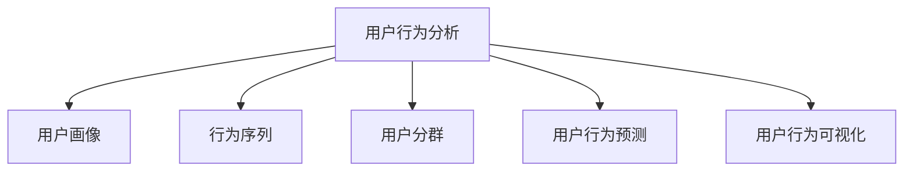

                 

# 如何进行有效的用户行为分析

## 1. 背景介绍

### 1.1 问题由来

在当今数字化时代，用户行为分析（User Behavior Analysis, UBA）成为企业理解和优化用户体验、提升业务效率的关键工具。然而，尽管用户行为分析技术在不断进步，但如何在海量的用户行为数据中高效、准确地提取有用信息，始终是一个挑战。

企业希望通过用户行为分析，了解用户如何与产品或服务互动，以及这些互动背后的动机和偏好，从而优化产品设计、提升客户满意度、增加业务收益。例如，电商平台希望了解用户对商品类别的偏好，推荐系统希望预测用户可能感兴趣的下一个产品，社交媒体平台希望提升用户的活跃度和留存率。

然而，面对复杂多变的用户行为，传统的数据挖掘技术往往无法全面、精准地捕捉用户真实意图。尤其是当用户行为模式呈现出动态变化、不确定性和多样性时，如何高效、精准地进行用户行为分析，成为了企业亟需解决的难题。

### 1.2 问题核心关键点

进行有效的用户行为分析，需要解决以下核心问题：

1. **数据采集与处理**：如何高效采集和处理用户行为数据，保证数据的完整性和实时性。
2. **特征提取与选择**：如何从用户行为数据中提取有意义的特征，用于建模和分析。
3. **模型训练与优化**：如何选择合适的模型和算法，对用户行为进行建模和预测。
4. **结果解释与应用**：如何解释模型结果，将分析结果转化为可操作的业务决策。
5. **隐私保护与安全**：如何在用户行为分析中保护用户隐私，避免数据滥用和安全风险。

### 1.3 问题研究意义

深入研究用户行为分析技术，对于提升用户体验、优化业务运营、增强企业竞争力和市场影响力具有重要意义：

1. **用户体验优化**：通过分析用户行为，企业可以发现用户体验中的痛点，及时调整产品设计，提升用户满意度。
2. **业务效率提升**：用户行为分析可以揭示业务运营中的瓶颈，帮助企业优化资源配置，提升运营效率。
3. **客户关系管理**：了解用户行为，有助于企业更好地理解客户需求，增强客户粘性和忠诚度。
4. **市场洞察与决策**：通过用户行为分析，企业可以获取市场趋势和用户偏好，辅助高层决策。
5. **合规与隐私保护**：在用户行为分析中加强隐私保护，避免法律风险，保障用户权益。

## 2. 核心概念与联系

### 2.1 核心概念概述

为更好地理解如何进行有效的用户行为分析，本节将介绍几个关键概念及其相互联系：

- **用户行为分析**（User Behavior Analysis, UBA）：通过分析用户在数字产品或服务上的行为，挖掘用户行为背后的动机、意图和偏好。
- **用户画像**（User Profile）：基于用户行为数据构建的个性化描述，用于精细化营销和个性化推荐。
- **行为序列**（Behavior Sequences）：用户在数字产品或服务上的交互序列，反映了用户的长期行为模式和偏好。
- **用户分群**（User Segmentation）：将用户按照某种行为特征划分为不同的群组，便于更精确地进行用户行为分析。
- **用户行为预测**（User Behavior Prediction）：利用历史行为数据，预测用户未来的行为，用于个性化推荐、营销活动等。
- **用户行为可视化**（User Behavior Visualization）：通过图表、仪表盘等方式，直观展示用户行为数据，便于分析和决策。

这些概念之间的逻辑关系可以通过以下Mermaid流程图来展示：



这个流程图展示了几大核心概念及其之间的联系：

1. **用户行为分析**是基础，通过对用户行为数据的分析和建模，生成有价值的用户画像和行为序列。
2. **用户画像**和**行为序列**用于精细化营销和个性化推荐。
3. **用户分群**用于提高分析的精度和效率，便于针对不同群体的分析。
4. **用户行为预测**基于历史行为数据，预测未来行为，用于推荐系统和广告投放。
5. **用户行为可视化**使分析结果更加直观，便于决策。

## 3. 核心算法原理 & 具体操作步骤

### 3.1 算法原理概述

用户行为分析的核心算法原理，主要基于机器学习和数据挖掘技术。通过对用户行为数据进行特征提取和建模，利用算法预测用户未来的行为。

核心算法包括但不限于：

- 时间序列分析：利用时间序列数据建模，预测用户行为趋势。
- 聚类分析：将用户按照行为特征聚成不同的群组，便于更精确地进行用户行为分析。
- 分类与回归分析：通过历史行为数据，预测用户行为（如购买、点击等）。
- 关联规则挖掘：发现用户行为之间的关联关系，用于推荐系统。
- 深度学习：利用深度神经网络对复杂行为进行建模和预测。

### 3.2 算法步骤详解

用户行为分析的典型步骤包括以下几个关键环节：

**Step 1: 数据采集与预处理**
- 利用日志文件、事件记录、点击流等手段，采集用户行为数据。
- 对数据进行清洗、去重、缺失值处理等预处理操作，保证数据质量。

**Step 2: 特征提取与选择**
- 从用户行为数据中提取特征，如访问时间、浏览页面、点击次数等。
- 使用特征选择技术，选择最相关的特征进行建模。

**Step 3: 建模与训练**
- 选择合适的算法模型，如决策树、随机森林、神经网络等。
- 使用历史行为数据训练模型，并进行参数优化。

**Step 4: 模型评估与优化**
- 使用交叉验证等方法评估模型性能，确保模型泛化能力。
- 根据评估结果，调整模型参数和特征选择策略。

**Step 5: 结果应用与解释**
- 将模型应用于实际场景，如个性化推荐、用户分群等。
- 对模型结果进行解释，帮助业务决策。

**Step 6: 隐私保护与安全**
- 对用户数据进行匿名化处理，保护用户隐私。
- 建立数据安全机制，避免数据泄露和滥用。

### 3.3 算法优缺点

用户行为分析算法的主要优点包括：

1. **高效性**：能够高效处理大量用户行为数据，提供实时分析结果。
2. **准确性**：通过精确的建模和预测，提高决策的准确性。
3. **灵活性**：支持多种分析场景，如用户画像、行为序列、预测等。
4. **可解释性**：部分算法（如决策树、线性回归）提供解释性较强的模型结果。

同时，这些算法也存在一些缺点：

1. **数据依赖性**：算法效果高度依赖数据质量，数据不完整或不准确会影响结果。
2. **模型复杂性**：一些复杂算法（如深度学习）需要大量计算资源和时间。
3. **解释性差**：部分复杂模型（如神经网络）输出结果难以解释。
4. **隐私风险**：用户行为数据敏感，泄露风险较高。

### 3.4 算法应用领域

用户行为分析算法在多个领域都有广泛应用，例如：

1. **电商推荐系统**：通过分析用户浏览、购买历史，为用户推荐可能感兴趣的商品。
2. **广告投放优化**：根据用户行为数据，优化广告定向和投放策略，提升广告效果。
3. **客户关系管理**：分析用户互动行为，识别高价值客户，提升客户满意度。
4. **内容推荐与优化**：分析用户内容消费行为，优化内容推荐策略，提升用户粘性。
5. **个性化营销**：基于用户画像和行为数据，进行个性化营销活动，提升营销效果。

## 4. 数学模型和公式 & 详细讲解

### 4.1 数学模型构建

用户行为分析的数学模型构建，通常包括以下几个关键步骤：

1. **数据表示**：将用户行为数据表示为时间序列、向量等形式，便于建模。
2. **特征提取**：从用户行为数据中提取有意义的特征，如访问时间、浏览次数等。
3. **模型选择**：选择适当的算法模型，如时间序列模型、聚类模型、分类模型等。
4. **参数优化**：通过算法优化，寻找最优模型参数。
5. **结果评估**：评估模型性能，确保模型泛化能力。

### 4.2 公式推导过程

以时间序列分析为例，介绍核心公式的推导过程。

假设用户行为数据 $x_t$ 表示在时间 $t$ 的行为，如浏览页面、点击次数等。我们假设 $x_t$ 服从自回归模型，即：

$$
x_t = \alpha + \beta x_{t-1} + \epsilon_t
$$

其中 $\alpha$ 和 $\beta$ 为模型参数，$\epsilon_t$ 为随机误差项。

通过对数据进行平稳性检验和差分处理，可以将时间序列转换为平稳序列，使用ARIMA模型进行建模：

$$
ARIMA(p, d, q) = ARIMA(x_t, p, d, q)
$$

其中 $p$ 和 $q$ 为模型的阶数，$d$ 为差分次数。

通过最小化残差平方和，可以得到模型参数 $\alpha, \beta$ 的估计值，进而预测未来行为 $x_{t+h}$。

### 4.3 案例分析与讲解

以电商推荐系统为例，展示用户行为分析的具体应用。

假设电商平台有数百万用户，每个用户会访问数千个商品页面。通过对用户行为数据进行分析和建模，可以得到每个用户的兴趣偏好和行为序列，从而为每个用户推荐可能感兴趣的商品。

具体步骤如下：

1. **数据采集**：利用日志文件记录每个用户的访问行为，包括页面访问、商品浏览、购买历史等。
2. **特征提取**：提取每个用户的访问频率、停留时间、浏览商品类别等特征。
3. **聚类分析**：将用户按照行为特征聚成不同的群组，如购物频率高、品牌忠诚度高的群组。
4. **模型训练**：使用历史行为数据训练推荐模型，如协同过滤、内容推荐等。
5. **推荐结果**：根据每个用户的行为特征和模型预测，为用户推荐可能感兴趣的商品。
6. **效果评估**：通过A/B测试等方法评估推荐效果，优化模型参数。

通过以上步骤，电商平台可以显著提升用户购买转化率和用户满意度，实现业务增长。

## 5. 项目实践：代码实例和详细解释说明

### 5.1 开发环境搭建

进行用户行为分析的开发环境搭建，通常需要以下工具：

1. **Python**：作为主要开发语言，Python提供了丰富的数据处理和机器学习库。
2. **Pandas**：用于数据处理和清洗，支持大规模数据处理。
3. **Scikit-Learn**：提供了多种机器学习算法和工具，如分类、回归、聚类等。
4. **TensorFlow**：用于深度学习模型的构建和训练。
5. **PyTorch**：另一种深度学习框架，提供了更灵活的模型构建方式。
6. **Jupyter Notebook**：用于编写和运行Python代码，支持代码解释和共享。

### 5.2 源代码详细实现

以下是一个使用Python和Scikit-Learn库进行用户行为分析的示例代码：

```python
import pandas as pd
from sklearn.model_selection import train_test_split
from sklearn.linear_model import LogisticRegression
from sklearn.metrics import accuracy_score

# 加载数据
data = pd.read_csv('user_behavior.csv')

# 数据预处理
# 删除缺失值
data.dropna(inplace=True)

# 特征选择
# 提取访问时间、停留时间、浏览页面等特征
features = ['visit_time', 'stay_time', 'visited_pages']
X = data[features]
y = data['purchase']

# 分割数据集
X_train, X_test, y_train, y_test = train_test_split(X, y, test_size=0.2, random_state=42)

# 模型训练
model = LogisticRegression()
model.fit(X_train, y_train)

# 模型评估
y_pred = model.predict(X_test)
accuracy = accuracy_score(y_test, y_pred)
print(f"Accuracy: {accuracy:.2f}")
```

### 5.3 代码解读与分析

代码中，我们使用了Pandas库进行数据处理和清洗，提取了访问时间、停留时间、浏览页面等特征，使用Logistic回归模型进行分类预测。

- `data.dropna(inplace=True)`：删除缺失值，保证数据完整性。
- `train_test_split(X, y, test_size=0.2, random_state=42)`：将数据集分割为训练集和测试集。
- `model.fit(X_train, y_train)`：使用训练集训练模型。
- `y_pred = model.predict(X_test)`：使用测试集预测用户购买行为。
- `accuracy_score(y_test, y_pred)`：计算模型准确率。

### 5.4 运行结果展示

运行上述代码，可以得到模型的准确率结果。例如，如果使用测试集预测准确率为0.85，说明模型对用户购买行为的预测能力较强。

## 6. 实际应用场景

### 6.1 电商平台推荐系统

电商平台通过用户行为分析，能够为用户推荐可能感兴趣的商品，提升用户购买转化率和满意度。例如，亚马逊通过分析用户的浏览和购买历史，为用户推荐相关商品，实现了显著的销售增长。

### 6.2 在线广告投放

在线广告平台通过用户行为分析，可以优化广告定向和投放策略，提高广告效果。例如，Facebook通过分析用户的行为和兴趣，进行精准广告投放，提升了广告点击率和转化率。

### 6.3 移动应用用户分析

移动应用通过用户行为分析，可以优化用户体验，提升应用活跃度和留存率。例如，Spotify通过分析用户的听歌行为，推荐可能喜欢的音乐，提升了用户粘性。

## 7. 工具和资源推荐

### 7.1 学习资源推荐

为了帮助开发者系统掌握用户行为分析的理论基础和实践技巧，这里推荐一些优质的学习资源：

1. **《机器学习》（周志华著）**：经典机器学习教材，详细介绍了机器学习的基本原理和算法。
2. **《Python数据科学手册》（Jake VanderPlas著）**：Python数据科学入门书籍，涵盖了数据处理、可视化、机器学习等内容。
3. **Coursera《机器学习》课程**：斯坦福大学开设的机器学习课程，提供了丰富的视频和编程练习。
4. **Kaggle竞赛**：参加Kaggle机器学习竞赛，通过实战学习机器学习技术。
5. **Deep Learning Specialization by Andrew Ng**：由Coursera联合斯坦福大学推出的深度学习课程，涵盖深度学习的基本原理和实践。

### 7.2 开发工具推荐

进行用户行为分析的开发，通常需要使用以下工具：

1. **Python**：作为主要开发语言，Python提供了丰富的数据处理和机器学习库。
2. **Pandas**：用于数据处理和清洗，支持大规模数据处理。
3. **Scikit-Learn**：提供了多种机器学习算法和工具，如分类、回归、聚类等。
4. **TensorFlow**：用于深度学习模型的构建和训练。
5. **PyTorch**：另一种深度学习框架，提供了更灵活的模型构建方式。
6. **Jupyter Notebook**：用于编写和运行Python代码，支持代码解释和共享。

### 7.3 相关论文推荐

用户行为分析领域的研究持续活跃，以下是几篇具有代表性的论文，推荐阅读：

1. **《A Comprehensive Survey on User Behavior Analysis in Online Retailing》**：该论文详细综述了在线零售领域用户行为分析的最新进展。
2. **《User Behavior Analysis in Mobile Applications: A Review》**：该论文介绍了移动应用领域用户行为分析的多种方法和技术。
3. **《Predicting User Behavior in E-commerce with Collaborative Filtering》**：该论文探讨了使用协同过滤算法预测用户行为的方法。
4. **《User Behavior Prediction in Recommendation Systems》**：该论文讨论了推荐系统中用户行为预测的多种技术。

## 8. 总结：未来发展趋势与挑战

### 8.1 研究成果总结

用户行为分析技术已经取得了显著的进展，在电商推荐、广告投放、移动应用等多个领域得到了广泛应用。通过精确的建模和预测，帮助企业提升了业务效率和用户满意度。

### 8.2 未来发展趋势

展望未来，用户行为分析技术将呈现以下几个发展趋势：

1. **多模态融合**：结合用户行为数据、社交网络数据、地理位置数据等多种数据源，进行更全面的行为分析。
2. **实时分析**：通过流数据处理技术，实现实时行为分析，提升决策的时效性。
3. **深度学习**：利用深度神经网络对复杂行为进行建模和预测，提高分析精度。
4. **联邦学习**：在保护用户隐私的前提下，进行跨设备、跨平台的行为分析。
5. **AIoT（人工智能+物联网）**：通过物联网设备收集用户行为数据，进行更精准的行为分析。

### 8.3 面临的挑战

尽管用户行为分析技术已经取得了显著进展，但在实际应用中仍面临以下挑战：

1. **数据质量和隐私保护**：如何确保数据完整性和用户隐私，避免数据泄露和滥用。
2. **算法复杂性和解释性**：复杂算法（如深度学习）的模型解释性较差，难以解释输出结果。
3. **实时性和稳定性**：如何实现实时行为分析，同时保证系统的稳定性和可靠性。
4. **跨平台一致性**：不同平台和设备的数据格式和接口不一致，如何实现跨平台的统一分析。
5. **模型泛化能力**：如何确保模型在不同场景和数据分布下的泛化能力。

### 8.4 研究展望

面对用户行为分析中的挑战，未来的研究方向包括：

1. **数据治理和隐私保护**：建立数据治理体系，确保数据完整性和隐私保护。
2. **模型解释性和透明性**：开发可解释性强的模型，增强模型输出的透明性和可信度。
3. **实时流处理技术**：探索实时流处理技术，实现实时行为分析。
4. **跨平台数据集成**：开发跨平台数据集成工具，实现统一的数据分析和处理。
5. **通用AIoT平台**：开发通用的AIoT平台，实现不同设备和平台的数据采集和分析。

这些研究方向将进一步推动用户行为分析技术的进步，提升其在实际应用中的效果和价值。

## 9. 附录：常见问题与解答

**Q1：如何进行用户行为分析？**

A: 用户行为分析的基本步骤包括数据采集与处理、特征提取与选择、建模与训练、模型评估与优化、结果应用与解释等。具体实现中，需要选择合适的算法和工具，如时间序列分析、聚类分析、深度学习等。

**Q2：如何提升用户行为分析的准确性？**

A: 提升用户行为分析准确性的方法包括：

1. 数据清洗和预处理，确保数据完整性和质量。
2. 选择合适的特征和算法模型，如时间序列分析、随机森林等。
3. 进行交叉验证和参数优化，确保模型泛化能力。
4. 引入外部知识，如领域知识、规则库等，增强模型预测准确性。

**Q3：用户行为分析中需要注意哪些隐私问题？**

A: 在用户行为分析中，需要注意以下几个隐私问题：

1. 数据匿名化处理，保护用户隐私。
2. 数据访问控制，确保数据仅用于授权分析。
3. 数据存储安全，避免数据泄露和滥用。
4. 透明度和可解释性，确保用户知情权和选择权。

**Q4：用户行为分析如何结合多模态数据？**

A: 用户行为分析可以结合多模态数据，通过数据融合技术提升分析效果。例如，结合用户行为数据、社交网络数据、地理位置数据等多种数据源，进行更全面的行为分析。可以使用深度学习模型（如多模态神经网络），对不同数据源进行联合建模和预测。

**Q5：用户行为分析中有哪些实际应用场景？**

A: 用户行为分析在电商推荐、在线广告、移动应用等多个领域都有广泛应用，例如：

1. 电商平台推荐系统：通过分析用户浏览和购买历史，为用户推荐可能感兴趣的商品。
2. 在线广告投放：通过分析用户行为和兴趣，优化广告定向和投放策略，提高广告效果。
3. 移动应用用户分析：通过分析用户行为数据，优化用户体验，提升应用活跃度和留存率。

综上所述，用户行为分析技术在当今数字化时代具有重要应用价值，能够帮助企业优化产品设计、提升业务效率、增强用户满意度。面对未来更加复杂多变的数据环境和应用需求，需要在数据治理、算法优化、隐私保护等多个方面进行不断创新和探索。

