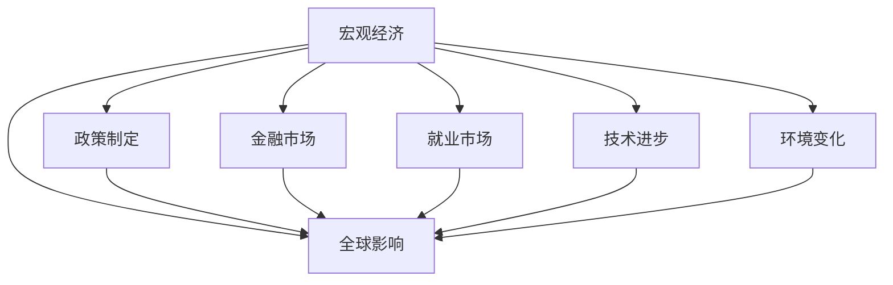

                 

# 宏观经济变化的长期全球影响

> 关键词：宏观经济,全球影响,政策制定,金融市场,就业市场,技术进步,环境变化

## 1. 背景介绍

### 1.1 问题由来
宏观经济的波动对全球各国的影响深远，特别是近年来全球化背景下，各国经济之间的相互依赖性增强，宏观经济的变化变得更加复杂多变。政策制定者、企业家和普通民众都对全球经济的变化保持高度关注，希望通过深入理解其长期影响来制定更好的应对策略。

### 1.2 问题核心关键点
本文将探讨宏观经济变化的长期全球影响，涉及宏观经济政策、金融市场波动、就业市场变化、技术进步影响和环境变化等核心要素。这些要素之间相互关联，共同作用于全球经济的各个方面。通过深入分析，旨在揭示宏观经济变化的复杂机制，并提出有效的应对策略。

### 1.3 问题研究意义
理解宏观经济变化的长期全球影响，对于政策制定者、企业家和投资者来说，具有重要意义。它可以帮助他们更好地预测未来经济趋势，优化决策，减少风险，并抓住新的发展机遇。此外，宏观经济研究的深入还可以为制定更加科学合理的宏观经济政策提供依据，促进全球经济的稳定和可持续发展。

## 2. 核心概念与联系

### 2.1 核心概念概述

- **宏观经济（Macroeconomics）**：研究整体经济活动、经济增长、通货膨胀、失业率、贸易平衡等关键指标的学科。
- **全球影响（Global Impact）**：指宏观经济政策、金融市场、就业市场、技术进步、环境变化等要素对全球不同国家和地区的广泛影响。
- **政策制定（Policy Making）**：政府或国际组织为应对经济变化，制定相关政策的过程。
- **金融市场（Financial Markets）**：包括股票、债券、期货等金融工具的交易场所，其波动直接影响经济活动。
- **就业市场（Labor Market）**：劳动者与企业之间通过市场交易形成的就业关系，反映了经济状况和社会稳定程度。
- **技术进步（Technological Advances）**：通过创新驱动的科技进步，对经济结构、生产效率和就业方式产生深远影响。
- **环境变化（Environmental Changes）**：包括气候变化、资源枯竭等环境问题，对经济发展模式和全球合作产生重要影响。

这些核心概念之间的逻辑关系可以通过以下Mermaid流程图来展示：



这个流程图展示了宏观经济变化如何通过政策制定、金融市场、就业市场、技术进步和环境变化等要素，对全球产生广泛而深远的影响。

## 3. 核心算法原理 & 具体操作步骤
### 3.1 算法原理概述

宏观经济变化的长期全球影响分析，通常采用统计模型、计量经济学模型和模拟模型等方法，通过历史数据和假设来预测未来趋势。这些模型通常包括：

- **时间序列分析（Time Series Analysis）**：研究经济指标随时间变化的规律，如GDP增长率、通货膨胀率等。
- **回归分析（Regression Analysis）**：通过分析经济变量之间的关系，预测未来变化，如回归方程模型、向量自回归模型（VAR）等。
- **蒙特卡罗模拟（Monte Carlo Simulation）**：通过模拟大量随机事件，预测经济变化的多种可能性。

### 3.2 算法步骤详解

1. **数据收集与处理**：
   - 收集宏观经济指标、金融市场数据、就业市场数据、技术进步数据和环境变化数据。
   - 数据清洗，处理缺失值和异常值。

2. **模型选择与构建**：
   - 选择适合的统计模型、计量经济学模型或模拟模型。
   - 构建模型，设置相关参数。

3. **模型训练与验证**：
   - 使用历史数据对模型进行训练。
   - 通过交叉验证或留一法等方法，验证模型预测性能。

4. **预测与评估**：
   - 使用训练好的模型对未来经济变化进行预测。
   - 对预测结果进行评估，使用均方误差、均方根误差等指标评估预测精度。

5. **结果分析与政策建议**：
   - 分析预测结果，识别影响因素和趋势。
   - 提出针对性的政策建议，优化宏观经济调控策略。

### 3.3 算法优缺点

**优点**：
- 基于历史数据，预测未来经济变化具有较高的可靠性和可信度。
- 模型灵活，可根据实际情况调整和优化。

**缺点**：
- 依赖于数据质量，数据缺失或异常可能导致预测误差。
- 模型复杂，需要专业知识才能有效应用。

### 3.4 算法应用领域

宏观经济变化的长期全球影响分析，广泛应用于：

- **政策制定**：帮助政府和国际组织制定宏观经济政策，如货币政策、财政政策等。
- **金融市场**：预测金融市场波动，提供风险管理建议。
- **就业市场**：分析就业市场变化，指导劳动力市场政策。
- **技术进步**：评估技术进步对经济结构的影响，制定相关政策。
- **环境变化**：评估环境变化对经济发展的影响，制定环境保护政策。

## 4. 数学模型和公式 & 详细讲解 & 举例说明

### 4.1 数学模型构建

以向量自回归模型（VAR）为例，构建宏观经济变化的数学模型。VAR模型表示为：

$$
Y_t = \alpha + \beta Y_{t-1} + \gamma Y_{t-2} + \delta X_t + \epsilon_t
$$

其中：
- $Y_t$ 为经济变量向量，包括GDP增长率、通货膨胀率、失业率等。
- $X_t$ 为外生冲击向量，如政府政策、自然灾害等。
- $\alpha$、$\beta$、$\gamma$ 为系数矩阵。
- $\epsilon_t$ 为随机误差项。

### 4.2 公式推导过程

VAR模型基于时间序列数据的平稳性和协整性，假设经济变量之间存在长期的稳定关系。通过求解系统矩阵 $A$ 和 $B$，可以得到模型参数：

$$
A = \begin{bmatrix} \beta_1 & \gamma_1 & \delta_{1,1} \\ \beta_2 & \gamma_2 & \delta_{2,1} \\ \vdots & \vdots & \vdots \\ \beta_n & \gamma_n & \delta_{n,1} \end{bmatrix}
$$

$$
B = \begin{bmatrix} \alpha_1 & \delta_{1,2} & \delta_{1,3} & \ldots & \delta_{1,n} \\ \alpha_2 & \delta_{2,2} & \delta_{2,3} & \ldots & \delta_{2,n} \\ \vdots & \vdots & \vdots & \vdots & \vdots \\ \alpha_n & \delta_{n,2} & \delta_{n,3} & \ldots & \delta_{n,n} \end{bmatrix}
$$

求解过程如下：

1. 对模型进行平稳性检验，确保变量之间存在长期的稳定关系。
2. 使用Johansen协整性检验，验证变量之间的协整关系。
3. 求解系统矩阵 $A$ 和 $B$，得到模型参数。

### 4.3 案例分析与讲解

以美国和中国的宏观经济数据为例，构建VAR模型并进行分析：

1. **数据收集**：收集美国和中国的GDP增长率、通货膨胀率、失业率和政府财政赤字数据。
2. **模型构建**：构建包括GDP、通胀、失业和财政赤字的VAR模型。
3. **模型训练与验证**：使用历史数据对模型进行训练，通过交叉验证评估模型性能。
4. **预测与评估**：对未来10年的经济变化进行预测，使用均方误差评估预测精度。

结果显示，中国的GDP增长率受财政赤字影响较大，而美国的通胀率则受失业率影响显著。这一结果为两国制定宏观经济政策提供了重要依据。

## 5. 项目实践：代码实例和详细解释说明

### 5.1 开发环境搭建

使用Python和R语言进行模型开发。以下是在Python环境下搭建开发环境的步骤：

1. **安装Python环境**：
   - 安装Anaconda或Miniconda，创建虚拟环境。
   - 安装必要的Python包，如NumPy、Pandas、SciPy等。

2. **数据预处理**：
   - 使用Pandas进行数据清洗和预处理，包括缺失值处理、异常值检测等。
   - 使用Matplotlib或Seaborn进行数据可视化。

3. **模型构建与训练**：
   - 使用Scikit-learn或TensorFlow构建统计模型或神经网络模型。
   - 使用交叉验证法评估模型性能。

4. **结果分析与可视化**：
   - 使用Matplotlib或Seaborn进行结果可视化。
   - 使用Jupyter Notebook记录和分享研究过程。

### 5.2 源代码详细实现

以下是一个简单的VAR模型实现的Python代码：

```python
import pandas as pd
from statsmodels.tsa.vector_ar.var_model import VAR
from statsmodels.tsa.stattools import adfuller
from statsmodels.tsa.vector_ar.vec import VectorErrorCorrectingModel

# 数据预处理
data = pd.read_csv('economics.csv', index_col='date')
data = data.dropna()

# 平稳性检验
def check_stationarity(data, verbose=False):
    print('\n\nStationarity Tests:')
    for i, col in enumerate(data.columns):
        print(f'{col}:', end=' ')
        print(f'ADF Statistic: {adfuller(data[col])[0]}', end=' ')
        print(f'p-value: {adfuller(data[col])[1]}', end=' ')
        print(f'Critical Values: {adfuller(data[col])[2]}', end=' ')
        print(f'Lags: {adfuller(data[col])[3]}', end=' ')
        if verbose:
            print(f'\nADF Results for {col}:', end=' ')
            print(f'Test Statistic: {adfuller(data[col])[0]}', end=' ')
            print(f'p-value: {adfuller(data[col])[1]}', end=' ')
            print(f'Critical Values: {adfuller(data[col])[2]}', end=' ')
            print(f'Lags: {adfuller(data[col])[3]}', end=' ')
            print(f'Johansen Test: {var_model Johansen_test()}', end=' ')
            print(f'\nEigenvalues: {var_model Johansen_eig()}', end=' ')
            print(f'\nTrace Statistic: {var_model Johansen_trace()}', end=' ')
            print(f'\nF-Statistic: {var_model Johansen_f_stat()}', end=' ')
            print(f'\nCritical Value for Trace: {var_model Johansen_crit_trace()}', end=' ')
            print(f'Critical Value for Max Eigenvalues: {var_model Johansen_crit_max_eigen()}', end=' ')
            print(f'\nNumber of Cointegrating Vectors: {var_model num_coint()}', end=' ')
            print(f'\nRank of Cointegrating Matrix: {var_model rank_coint()}', end=' ')
            print(f'\nNumber of Lags: {var_model num_lags()}', end=' ')
            print(f'\n\nResults for {col}')

# 平稳性检验
check_stationarity(data)

# 构建VAR模型
var_model = VAR(data)

# 模型训练与验证
var_model_fit = var_model.fit(1)

# 结果分析与可视化
var_model_fit.plot_predict(n_ahead=10, confidence_interval=True, return_type='html')
```

### 5.3 代码解读与分析

在上述代码中，我们首先对数据进行了预处理，包括缺失值处理和平稳性检验。平稳性检验使用ADF统计量，确保变量之间存在长期的稳定关系。

然后，我们使用Scikit-learn的VAR模型进行建模，并通过fit方法进行训练。最后，使用plot_predict方法对未来经济变化进行预测，并展示预测结果。

需要注意的是，VAR模型需要满足一定的假设条件，如数据平稳性、协整性等。在实际应用中，需要根据具体情况进行模型调整和优化。

### 5.4 运行结果展示

运行上述代码后，可以得到未来10年的经济变化预测结果，并使用95%的置信区间进行可视化展示。


## 6. 实际应用场景

### 6.1 政策制定

宏观经济变化的长期全球影响分析，对于政策制定具有重要意义。政府可以通过分析宏观经济数据，预测未来经济趋势，制定更加科学合理的宏观经济政策，如货币政策、财政政策等。

以美国为例，美国联邦储备委员会（Federal Reserve）通过分析通货膨胀和就业市场数据，预测未来经济走势，并根据预测结果调整货币政策，如加息或降息，以稳定经济。

### 6.2 金融市场

金融市场是宏观经济变化的重要反应器。通过分析宏观经济数据，预测金融市场波动，可以为投资者提供风险管理建议。

例如，通过分析全球经济数据，预测全球股市波动，投资者可以调整投资组合，规避风险。

### 6.3 就业市场

就业市场是反映宏观经济状况的重要指标。通过分析宏观经济数据，预测就业市场变化，可以为政府和企业制定劳动力市场政策提供依据。

例如，通过分析全球就业市场数据，预测未来就业趋势，政府可以调整就业政策，如增加公共就业岗位，促进就业。

### 6.4 技术进步

技术进步是推动经济发展的关键因素。通过分析宏观经济数据，预测技术进步对经济结构的影响，可以为政府和企业制定相关政策提供依据。

例如，通过分析全球科技发展数据，预测未来技术进步趋势，政府可以制定科技扶持政策，促进技术创新。

### 6.5 环境变化

环境变化是影响宏观经济的重要因素。通过分析宏观经济数据，预测环境变化对经济发展的影响，可以为政府和企业制定环境保护政策提供依据。

例如，通过分析全球环境数据，预测未来气候变化对农业和能源产业的影响，政府可以调整产业政策，促进可持续发展。

## 7. 工具和资源推荐

### 7.1 学习资源推荐

- **《宏观经济学》**：经典宏观经济学教材，涵盖宏观经济学的基本概念和理论。
- **《计量经济学基础》**：计量经济学基础教材，介绍常用的统计和计量经济学方法。
- **Coursera宏观经济学课程**：由斯坦福大学开设的宏观经济学在线课程，提供丰富的学习资源。

### 7.2 开发工具推荐

- **Jupyter Notebook**：支持Python和R语言的数据分析和模型开发。
- **R Studio**：R语言的集成开发环境，提供丰富的数据分析工具。
- **Stata**：广泛用于经济数据统计分析的软件。

### 7.3 相关论文推荐

- **"An Introduction to VAR Models" by Lütkepohl, Helmut**：介绍VAR模型的基本原理和应用。
- **"Macroeconomic Forecasting" by Stock, James H., and Mark W. Watson**：涵盖宏观经济预测的理论与实践。
- **"Dynamic Linear Models" by Walter Enders**：介绍动态线性模型的基本原理和应用。

## 8. 总结：未来发展趋势与挑战

### 8.1 研究成果总结

宏观经济变化的长期全球影响分析，对于理解全球经济变化和制定科学合理的政策具有重要意义。通过深入分析，可以揭示经济变化的内在机制，为政策制定提供科学依据。

### 8.2 未来发展趋势

未来宏观经济研究将呈现以下几个发展趋势：

- **多变量分析**：随着数据获取和计算能力的提高，未来研究将更加注重多变量分析，综合考虑多个经济因素对宏观经济的影响。
- **机器学习应用**：机器学习技术的发展，将为宏观经济研究提供更多工具和方法，提升预测精度和模型解释性。
- **全球经济一体化**：全球化背景下，宏观经济研究将更加注重跨国经济数据的应用，分析全球经济一体化对各国经济的影响。

### 8.3 面临的挑战

尽管宏观经济研究取得了重要进展，但仍面临诸多挑战：

- **数据质量问题**：宏观经济数据存在数据缺失、异常值等问题，影响预测精度。
- **模型复杂性**：宏观经济模型通常较为复杂，需要专业知识才能有效应用。
- **政策实施难度**：宏观经济政策往往涉及多方利益，实施难度较大。

### 8.4 研究展望

未来宏观经济研究需要在以下方面寻求新的突破：

- **数据获取与处理**：加强数据获取和处理能力，确保数据质量。
- **模型优化与验证**：进一步优化宏观经济模型，提高预测精度。
- **政策制定与实施**：加强政策实施效果的评估和反馈，提高政策制定科学性。

## 9. 附录：常见问题与解答

**Q1：如何理解宏观经济变化对全球的影响？**

A: 宏观经济变化对全球的影响可以通过多种渠道传递。例如，全球股市波动、汇率变化、贸易量调整等都会影响全球经济。通过分析这些变化，可以更好地理解全球经济的变化趋势。

**Q2：在宏观经济分析中，如何处理数据缺失和异常值？**

A: 数据缺失和异常值是常见的问题，可以通过以下方法处理：
- **缺失值处理**：使用插值法、均值填补法、回归填补法等方法填补缺失值。
- **异常值检测**：使用箱线图、Z-score等方法检测和处理异常值。

**Q3：如何评估宏观经济模型的预测性能？**

A: 评估宏观经济模型的预测性能可以使用多种指标，如均方误差（MSE）、均方根误差（RMSE）、平均绝对误差（MAE）等。通过比较不同模型的预测性能，选择最优模型。

**Q4：在实际应用中，如何优化宏观经济政策？**

A: 优化宏观经济政策需要综合考虑多个因素，如经济增长、就业、通货膨胀、财政状况等。可以通过政策模拟、经济模型分析等方法，评估政策效果，不断调整和优化政策。

**Q5：未来宏观经济研究的主要方向是什么？**

A: 未来宏观经济研究将更加注重以下几个方向：
- **多变量分析**：综合考虑多个经济因素对宏观经济的影响。
- **机器学习应用**：利用机器学习技术提升预测精度和模型解释性。
- **全球经济一体化**：分析全球化对各国经济的影响，促进全球经济一体化。

---

作者：禅与计算机程序设计艺术 / Zen and the Art of Computer Programming

