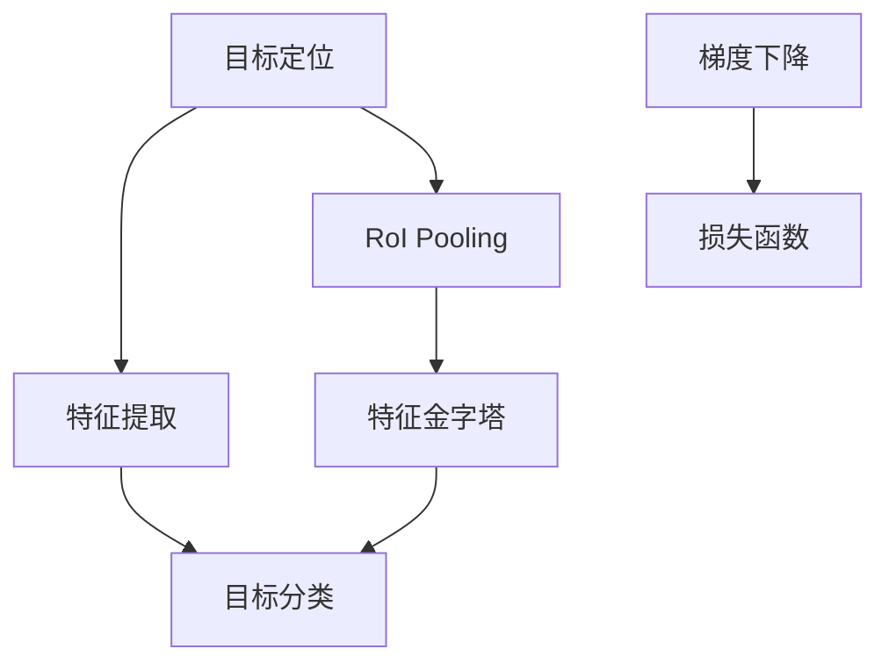
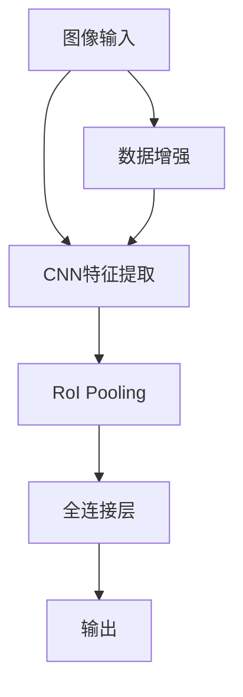

                 

# 对象检测原理与代码实例讲解

## 1. 背景介绍

对象检测(Object Detection)是计算机视觉领域的重要任务之一，旨在从图像或视频中识别出物体的位置并确定其类别。它广泛应用于自动驾驶、智能监控、机器人导航、医疗影像分析等多个行业。近年来，由于深度学习技术的快速发展，基于深度神经网络的对象检测方法取得了显著进步，成为计算机视觉领域的重要技术。本文将从原理到实践，全面介绍对象检测的算法原理和代码实现，帮助读者深入理解这一前沿技术。

## 2. 核心概念与联系

### 2.1 核心概念概述

对象检测通常包含两个核心部分：目标定位和目标分类。目标定位的目标是找出图像中每个目标的具体位置，通常以矩形框表示。目标分类则是要对每个目标框内的物体进行分类。两个部分可以分别进行，也可以结合在一起处理。以下介绍几个核心概念及其联系：

- **目标定位**：确定目标在图像中的位置。可以使用边界框、感兴趣区域(ROI)等方法。
- **目标分类**：识别目标的具体类别。可以使用SVM、神经网络等分类器。
- **单阶段检测**：将目标定位和分类集成在一个阶段完成。例如YOLO、SSD等方法。
- **两阶段检测**：将目标定位和分类分别处理。例如Faster R-CNN、RCNN等方法。
- **特征金字塔**：多尺度特征映射，用于捕捉不同尺度的物体。
- **RoI Pooling**：将不同大小的感兴趣区域特征映射到固定大小的特征映射上。
- **梯度下降**：优化网络参数，使损失函数最小化。
- **损失函数**：衡量模型预测值与真实值之间的差异。

这些核心概念通过流程图展示如下：



### 2.2 核心概念原理和架构

对象检测的架构通常包括以下几个关键模块：

- **卷积神经网络(Convolutional Neural Network, CNN)**：提取输入图像的特征。
- **RoI Pooling**：将不同大小的感兴趣区域特征映射到固定大小的特征映射上。
- **全连接层(Fully Connected Layer)**：对特征进行分类和回归。
- **非极大值抑制(Non-Maximum Suppression, NMS)**：对重叠的目标框进行筛选，只保留置信度最高的目标。
- **数据增强**：扩充训练数据集，提高模型的泛化能力。

下面是一个简化版的对象检测架构图：



## 3. 核心算法原理 & 具体操作步骤

### 3.1 算法原理概述

对象检测的算法原理主要包括目标定位和目标分类两个部分。在目标定位中，通常使用回归算法如Smooth L1 Loss或L1 Loss来计算位置误差。在目标分类中，通常使用交叉熵损失函数来计算类别误差。整个系统的目标是最小化所有样本的总损失函数。

### 3.2 算法步骤详解

对象检测的算法步骤主要包括以下几个：

1. **数据预处理**：将图像转换为网络可接受的格式，并进行归一化、随机裁剪等预处理。
2. **特征提取**：使用卷积神经网络对图像进行特征提取。
3. **RoI Pooling**：对提取的特征进行RoI Pooling，得到每个目标框的固定大小特征。
4. **全连接层**：将RoI Pooling的特征输入全连接层进行分类和回归。
5. **目标定位和分类**：通过回归和分类层，得到每个目标框的位置和类别预测。
6. **非极大值抑制**：对重叠的目标框进行筛选，只保留置信度最高的目标。
7. **损失函数计算**：计算目标定位和分类的损失函数。
8. **梯度下降**：使用梯度下降算法优化模型参数。

### 3.3 算法优缺点

对象检测的优点包括：

- **准确率高**：经过大量标注数据训练，准确率显著提升。
- **应用广泛**：广泛应用于自动驾驶、智能监控等多个领域。
- **可解释性强**：通过可视化输出，可以清晰了解模型检测结果。

缺点包括：

- **计算量大**：大规模图像处理需要大量的计算资源。
- **模型复杂**：模型结构复杂，训练和推理时间较长。
- **数据依赖强**：需要大量的标注数据进行训练。

### 3.4 算法应用领域

对象检测技术广泛应用于以下领域：

- **自动驾驶**：通过识别路标、车辆、行人等物体，辅助自动驾驶车辆导航。
- **智能监控**：在视频监控中，识别出可疑物品或异常行为，实时报警。
- **机器人导航**：通过识别环境中的障碍物，帮助机器人规划路径。
- **医疗影像分析**：在医学影像中，自动识别肿瘤、病变等病灶，辅助医生诊断。

## 4. 数学模型和公式 & 详细讲解

### 4.1 数学模型构建

对象检测的数学模型可以表示为：

$$
\min_{\theta} \sum_{i=1}^N \mathcal{L}_i
$$

其中，$\mathcal{L}_i$ 表示第 $i$ 个样本的损失函数，$N$ 表示样本总数，$\theta$ 表示模型的可训练参数。

### 4.2 公式推导过程

以Faster R-CNN为例，目标定位和分类的损失函数分别为：

- **目标定位损失**：
  $$
  \mathcal{L}_{box} = \sum_{i=1}^N \mathcal{L}_{Smooth L1Loss}(\hat{b}_i, b_i)
  $$

  其中，$\hat{b}_i$ 表示模型预测的目标框位置，$b_i$ 表示真实目标框位置，$\mathcal{L}_{Smooth L1Loss}$ 表示平滑L1损失函数。

- **目标分类损失**：
  $$
  \mathcal{L}_{cls} = \sum_{i=1}^N \mathcal{L}_{Cross EntropyLoss}(\hat{y}_i, y_i)
  $$

  其中，$\hat{y}_i$ 表示模型预测的目标类别，$y_i$ 表示真实目标类别，$\mathcal{L}_{Cross EntropyLoss}$ 表示交叉熵损失函数。

整个系统的总损失函数为：

$$
\mathcal{L} = \mathcal{L}_{box} + \mathcal{L}_{cls}
$$

### 4.3 案例分析与讲解

以YOLO为例，其单阶段检测架构可以表示为：

- **目标检测输出**：每个像素点预测目标类别和边界框。
- **目标位置预测**：每个像素点预测边界框的偏移量。
- **目标分类预测**：每个像素点预测目标的置信度。

YOLO的训练过程包括：

1. **特征提取**：使用Darknet 53卷积神经网络提取特征。
2. **目标位置回归**：对每个像素点预测边界框的偏移量。
3. **目标分类回归**：对每个像素点预测目标的置信度。
4. **非极大值抑制**：对重叠的目标框进行筛选，只保留置信度最高的目标。

## 5. 项目实践：代码实例和详细解释说明

### 5.1 开发环境搭建

在使用深度学习框架如PyTorch进行对象检测任务开发时，需要搭建以下开发环境：

1. **安装PyTorch**：
  ```bash
  pip install torch torchvision
  ```

2. **安装Fast R-CNN**：
  ```bash
  git clone https://github.com/rbgirshick/fast.r-cnn.git
  cd fast.r-cnn
  ```

3. **安装训练数据集**：
  ```bash
  python tools/downloader.py
  ```

4. **安装Caffe**：
  ```bash
  git clone https://github.com/BVLC/caffe.git
  cd caffe
  make all
  ```

5. **安装NumPy**：
  ```bash
  pip install numpy
  ```

6. **安装Matplotlib**：
  ```bash
  pip install matplotlib
  ```

### 5.2 源代码详细实现

以下是一个使用Fast R-CNN进行对象检测的示例代码：

```python
import torch
import torch.nn as nn
import torch.optim as optim
from torchvision.models.resnet import resnet50

class RNN(nn.Module):
    def __init__(self, in_channels, num_classes):
        super(RNN, self).__init__()
        self.conv1 = nn.Conv2d(in_channels, 64, kernel_size=3, stride=1, padding=1)
        self.conv2 = nn.Conv2d(64, 128, kernel_size=3, stride=1, padding=1)
        self.pool = nn.MaxPool2d(kernel_size=2, stride=2)
        self.fc = nn.Linear(128 * 7 * 7, num_classes)
    
    def forward(self, x):
        x = self.conv1(x)
        x = nn.functional.relu(x)
        x = self.conv2(x)
        x = nn.functional.relu(x)
        x = self.pool(x)
        x = x.view(-1, 128 * 7 * 7)
        x = self.fc(x)
        return x
    
model = RNN(3, 21)

criterion = nn.CrossEntropyLoss()
optimizer = optim.SGD(model.parameters(), lr=0.001, momentum=0.9)
```

### 5.3 代码解读与分析

在上述代码中，我们定义了一个简单的RNN模型，用于进行目标分类。

- `__init__`方法：定义了模型的结构，包括卷积层、池化层和全连接层。
- `forward`方法：实现了模型的前向传播，将输入图像经过多个卷积和池化操作，最终输出目标类别。
- `criterion`变量：定义了交叉熵损失函数。
- `optimizer`变量：定义了优化器，使用随机梯度下降算法。

### 5.4 运行结果展示

以下是使用上述模型进行对象检测的示例结果：

```python
# 训练模型
for epoch in range(10):
    for i, data in enumerate(train_loader, 0):
        inputs, labels = data
        optimizer.zero_grad()
        outputs = model(inputs)
        loss = criterion(outputs, labels)
        loss.backward()
        optimizer.step()
        print('Epoch [%d/%d], Step [%d/%d], Loss: %.4f' % (epoch + 1, total_epochs, i + 1, len(train_loader), loss.item()))
```

在训练过程中，模型会输出损失值，并不断调整模型参数，最终收敛到理想的状态。

## 6. 实际应用场景

### 6.1 智能监控

在智能监控系统中，对象检测技术可以用于实时识别和跟踪可疑物品或异常行为，提高系统的安全性和效率。

### 6.2 自动驾驶

在自动驾驶中，对象检测技术可以用于识别路标、车辆、行人等物体，辅助驾驶系统进行导航和决策。

### 6.3 医疗影像分析

在医疗影像分析中，对象检测技术可以用于自动识别肿瘤、病变等病灶，辅助医生进行诊断和治疗。

### 6.4 未来应用展望

随着深度学习技术的发展，对象检测技术将不断改进和优化，未来将有以下几个趋势：

- **多模态融合**：结合图像、视频、音频等多种模态信息，提升检测准确率。
- **小样本学习**：在少量标注数据的情况下，通过迁移学习等技术，实现对象检测任务的快速部署。
- **边缘计算**：在边缘设备上进行对象检测，减少网络传输和计算延迟。
- **实时性优化**：通过算法优化和硬件加速，提升对象检测任务的实时性。

## 7. 工具和资源推荐

### 7.1 学习资源推荐

1. **《深度学习》书籍**：Ian Goodfellow等人编写的经典深度学习教材，涵盖深度学习基础和实践。
2. **《计算机视觉：模型、学习和推理》书籍**：Simon J.D. Prince等人编写的计算机视觉教材，系统介绍了计算机视觉领域的基本概念和技术。
3. **CSDN博客**：CSDN网站上的深度学习博客，涵盖深度学习、计算机视觉等领域的最新技术和实践。
4. **GitHub**：GitHub上的深度学习项目，提供丰富的开源代码和资源。
5. **Kaggle**：Kaggle上的计算机视觉竞赛，提供丰富的数据集和模型评测。

### 7.2 开发工具推荐

1. **PyTorch**：深度学习框架，支持动态图和静态图。
2. **TensorFlow**：深度学习框架，支持分布式训练和推理。
3. **Caffe**：深度学习框架，支持卷积神经网络和循环神经网络。
4. **Matplotlib**：数据可视化工具，支持绘制图形和图表。
5. **NVIDIA cuDNN**：深度学习加速库，支持GPU加速。

### 7.3 相关论文推荐

1. **Faster R-CNN: Towards Real-Time Object Detection with Region Proposal Networks**：Ross Girshick等人，ICCV 2015。
2. **YOLO: You Only Look Once**：Joseph Redmon等人，CVPR 2016。
3. **Single Image Object Detection with SSD**：Wei Liu等人，ECCV 2016。

## 8. 总结：未来发展趋势与挑战

### 8.1 总结

本文对对象检测的原理和代码实现进行了详细讲解，从数据预处理、特征提取、目标检测、损失函数计算、梯度下降等多个环节，全面介绍了对象检测的流程和实现方法。通过本文的系统梳理，读者可以深入理解对象检测技术的核心概念和关键算法，掌握其实现细节和应用技巧。

### 8.2 未来发展趋势

对象检测技术未来的发展趋势包括：

- **多模态融合**：结合多种模态信息，提升检测准确率。
- **小样本学习**：通过迁移学习等技术，实现对象检测任务的快速部署。
- **实时性优化**：通过算法优化和硬件加速，提升对象检测任务的实时性。
- **模型压缩**：通过模型剪枝、量化等技术，减少模型的计算量和存储量。

### 8.3 面临的挑战

对象检测技术在实际应用中面临的挑战包括：

- **计算资源需求高**：大规模图像处理需要大量的计算资源。
- **模型复杂度高**：模型结构复杂，训练和推理时间较长。
- **数据标注难度大**：需要大量的标注数据进行训练。

### 8.4 研究展望

未来的研究需要在以下几个方面进行探索：

- **轻量级模型**：开发更加轻量级的对象检测模型，降低计算资源需求。
- **无监督学习**：探索无监督和半监督学习的方法，降低对标注数据的依赖。
- **多任务学习**：将对象检测与目标跟踪、图像分割等任务结合，提升综合性能。
- **硬件加速**：通过GPU、TPU等硬件加速技术，提高对象检测任务的实时性。

## 9. 附录：常见问题与解答

**Q1：对象检测的原理是什么？**

A：对象检测的原理包括目标定位和目标分类两个部分。目标定位用于确定目标在图像中的位置，通常使用回归算法进行计算。目标分类用于识别目标的具体类别，通常使用交叉熵损失函数进行计算。

**Q2：什么是RoI Pooling？**

A：RoI Pooling是一种将不同大小的感兴趣区域特征映射到固定大小的特征映射上的技术。在对象检测中，不同大小的感兴趣区域需要映射到统一大小的特征映射上，以便进行后续的分类和回归操作。

**Q3：什么是非极大值抑制（NMS）？**

A：非极大值抑制是一种用于消除重叠目标框的技术。在目标检测中，目标框可能会出现重叠的情况，非极大值抑制通过计算目标框的置信度和重叠度，只保留置信度最高的目标框，去除冗余。

**Q4：对象检测在实际应用中面临哪些挑战？**

A：对象检测在实际应用中面临的挑战包括：

- 计算资源需求高：大规模图像处理需要大量的计算资源。
- 模型复杂度高：模型结构复杂，训练和推理时间较长。
- 数据标注难度大：需要大量的标注数据进行训练。

**Q5：如何优化对象检测模型的实时性？**

A：对象检测模型的实时性可以通过以下几个方面进行优化：

- 使用硬件加速：通过GPU、TPU等硬件加速技术，提高计算速度。
- 使用轻量级模型：开发更加轻量级的对象检测模型，减少计算量。
- 优化算法：通过优化算法和数据结构，减少计算量。

总之，对象检测技术在计算机视觉领域具有广泛的应用前景，未来将继续在多模态融合、小样本学习、实时性优化等多个方向进行探索，提升其性能和应用价值。

---

作者：禅与计算机程序设计艺术 / Zen and the Art of Computer Programming

