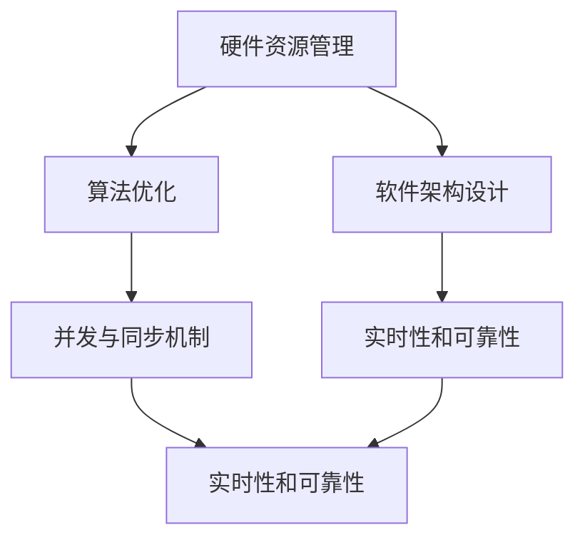

                 

## 1. 背景介绍

### 1.1 问题由来

在嵌入式系统设计中，性能优化始终是核心关注点。嵌入式设备由于硬件资源受限，需要高效处理大量实时数据，同时满足实时性和可靠性要求。然而，随着物联网设备的普及和人工智能的深度应用，嵌入式系统的性能需求进一步提升。如何高效利用资源，优化算法和架构设计，提升嵌入式系统的处理效率，成为亟待解决的课题。

### 1.2 问题核心关键点

嵌入式系统性能优化主要关注以下几个关键点：

1. **硬件资源管理**：在资源受限的嵌入式系统中，如何合理配置和分配有限的CPU、内存等硬件资源，是性能优化的基础。
2. **算法优化**：选择合适的算法和数据结构，优化算法的执行流程，减少计算和存储开销。
3. **软件架构设计**：设计高效的代码结构和模块划分，优化调用关系和数据流，提升系统的整体效率。
4. **并发与同步机制**：合理设计多任务并行和同步机制，避免死锁和资源竞争，提升系统响应速度和稳定性。
5. **实时性和可靠性**：确保系统在实时数据处理和紧急情况下仍能保持高可靠性和低延迟。

### 1.3 问题研究意义

嵌入式系统性能优化不仅有助于提升用户体验，减少资源浪费，还能降低开发和维护成本。同时，优化后的系统更加适合资源受限的环境，增强设备的市场竞争力。研究高效的系统设计方法，对于推动嵌入式设备在工业、医疗、交通、智能家居等众多领域的广泛应用具有重要意义。

## 2. 核心概念与联系

### 2.1 核心概念概述

嵌入式系统性能优化涉及多个核心概念，包括硬件资源管理、算法优化、软件架构设计、并发与同步机制、实时性和可靠性等。这些概念之间的联系和相互作用，构成了嵌入式系统性能优化的整体框架。

#### 2.1.1 硬件资源管理

硬件资源管理涉及CPU、内存、I/O设备等资源的使用和调度。合理配置这些资源，可以提高系统性能和效率。

#### 2.1.2 算法优化

算法优化关注于选择和优化高效的算法和数据结构，减少计算复杂度和存储开销，提升处理速度和精度。

#### 2.1.3 软件架构设计

软件架构设计关注于系统模块的划分和接口设计，提升系统模块化和可维护性，减少资源浪费和性能瓶颈。

#### 2.1.4 并发与同步机制

并发与同步机制关注于多任务并行和同步的设计，避免死锁和资源竞争，提升系统的响应速度和稳定性。

#### 2.1.5 实时性和可靠性

实时性和可靠性关注于系统在实时数据处理和紧急情况下的性能和稳定性，确保系统能高效且稳定地运行。

这些核心概念之间的逻辑关系可以通过以下Mermaid流程图来展示：



这个流程图展示了几大核心概念之间的相互依赖关系：

1. **硬件资源管理**为其他优化提供了基础资源。
2. **算法优化**和**软件架构设计**共同提升系统性能。
3. **并发与同步机制**确保系统在高并发情况下稳定运行。
4. **实时性和可靠性**是系统的最终目标，其他优化均需为其服务。

## 3. 核心算法原理 & 具体操作步骤

### 3.1 算法原理概述

嵌入式系统性能优化算法原理包括多任务调度、内存管理、并行处理、实时任务调度等。这些算法旨在合理利用有限资源，提升系统处理效率。

### 3.2 算法步骤详解

#### 3.2.1 多任务调度算法

多任务调度算法旨在合理分配处理器时间片，确保每个任务都能得到及时处理。常见算法包括：

1. **基于优先级的调度算法**：根据任务的优先级分配CPU时间片。
2. **基于时间片轮转的调度算法**：每个任务轮流使用CPU，避免单一任务占用过多资源。
3. **基于动态调整的调度算法**：根据系统负载实时调整任务优先级和时间片分配。

#### 3.2.2 内存管理算法

内存管理算法用于优化内存使用，减少内存碎片，提高内存访问效率。常见算法包括：

1. **固定分区内存管理**：将内存划分为固定大小的分区，每个分区分配给固定大小的任务。
2. **动态分区内存管理**：根据任务大小动态分配内存，提高内存利用率。
3. **页式内存管理**：将内存分割成固定大小的页，采用虚拟地址映射技术，提高内存访问速度。

#### 3.2.3 并行处理算法

并行处理算法利用多核处理器或多线程技术，提升计算能力。常见算法包括：

1. **任务级并行**：将任务分解为多个子任务，并行执行。
2. **数据级并行**：将数据集划分为多个子集，并行处理。
3. **流水线并行**：将任务分解为多个阶段，每个阶段并行执行，形成流水线。

#### 3.2.4 实时任务调度算法

实时任务调度算法用于确保实时任务的高优先级处理，常见算法包括：

1. **基于截止时间的调度算法**：根据任务的截止时间调整优先级，确保实时任务按时完成。
2. **基于任务周期的调度算法**：根据任务的周期性调整优先级，提高系统效率。
3. **基于率单调调度算法**：根据任务的速率需求调整优先级，确保系统性能。

### 3.3 算法优缺点

#### 3.3.1 多任务调度算法

**优点**：

- 提升系统并行处理能力，提高任务执行效率。
- 可根据任务优先级动态调整资源分配，满足不同任务的需求。

**缺点**：

- 调度算法复杂度高，需要实时监测系统状态，增加了系统开销。
- 可能出现资源竞争，导致系统不稳定。

#### 3.3.2 内存管理算法

**优点**：

- 提高内存利用率，减少内存碎片，提升内存访问效率。
- 采用虚拟地址映射技术，减少内存迁移，提升系统响应速度。

**缺点**：

- 算法实现复杂，需要考虑内存分配和释放的平衡。
- 内存管理可能引发缓存一致性问题，影响系统稳定性。

#### 3.3.3 并行处理算法

**优点**：

- 提升计算能力，加快任务处理速度。
- 充分利用多核处理器，提高系统资源利用率。

**缺点**：

- 并行算法设计复杂，需要考虑任务间的通信和同步。
- 可能出现数据竞争，导致系统错误。

#### 3.3.4 实时任务调度算法

**优点**：

- 确保实时任务的高优先级处理，满足系统实时性要求。
- 根据任务截止时间和周期性调整优先级，提高系统效率。

**缺点**：

- 调度算法复杂，需要实时监测系统状态。
- 可能出现资源竞争，导致系统不稳定。

### 3.4 算法应用领域

嵌入式系统性能优化算法广泛应用于工业控制、航空航天、医疗设备、智能家居等多个领域。

- **工业控制**：多任务调度算法和内存管理算法，用于优化实时控制系统的资源使用和任务调度。
- **航空航天**：并行处理算法和实时任务调度算法，用于提升飞行器计算能力和实时响应速度。
- **医疗设备**：内存管理算法和并行处理算法，用于优化医疗设备的计算和数据处理能力。
- **智能家居**：多任务调度算法和实时任务调度算法，用于提升智能设备的响应速度和稳定性。

## 4. 数学模型和公式 & 详细讲解 & 举例说明

### 4.1 数学模型构建

嵌入式系统性能优化的数学模型通常涉及任务调度、内存分配、并行处理等方面的优化目标。这里以一个简化的任务调度模型为例，构建数学模型。

假设系统有$n$个任务，每个任务需要$t_i$时间片。任务调度算法目标是最小化系统响应时间。设每个任务的时间片大小为$s$，则系统的响应时间为：

$$
R = \max_i \left\lceil \frac{t_i}{s} \right\rceil
$$

目标是最小化$R$。

### 4.2 公式推导过程

根据上述定义，任务调度算法的优化目标可以转化为：

$$
\min_{s} R = \min_{s} \max_i \left\lceil \frac{t_i}{s} \right\rceil
$$

当$s$固定时，$\max_i \left\lceil \frac{t_i}{s} \right\rceil$随$t_i$单调递增。因此，可以通过将任务按时间片大小排序，并逐步增大时间片$s$，找到最优的$s$值。

### 4.3 案例分析与讲解

假设系统有3个任务，时间片需求分别为$t_1=3$、$t_2=2$、$t_3=5$。按照时间片大小排序，依次执行每个任务的时间片大小。

1. $s=1$时，响应时间为$\max_i \left\lceil \frac{t_i}{s} \right\rceil = \max(3,2,5) = 5$。
2. $s=2$时，响应时间为$\max_i \left\lceil \frac{t_i}{s} \right\rceil = \max(2,1,3) = 3$。
3. $s=3$时，响应时间为$\max_i \left\lceil \frac{t_i}{s} \right\rceil = \max(1,1,2) = 2$。

因此，最优的时间片大小为$s=3$，系统响应时间为2个时间片。

## 5. 项目实践：代码实例和详细解释说明

### 5.1 开发环境搭建

嵌入式系统性能优化涉及硬件和软件两个方面，开发环境需要涵盖处理器、操作系统、开发工具等。以下是一个简单的开发环境搭建流程：

1. **硬件准备**：选择合适的嵌入式处理器，如ARM Cortex-M系列、RISC-V等。
2. **软件开发环境**：安装交叉编译工具链，如GCC、LLVM等。
3. **操作系统**：选择合适的操作系统，如Linux、FreeRTOS等。
4. **开发工具**：安装IDE、调试器等开发工具，如Keil MDK、IAR Embedded Studio等。
5. **调试工具**：准备硬件调试器，如JTAG、SWD等。

### 5.2 源代码详细实现

这里以一个简单的多任务调度算法为例，介绍嵌入式系统性能优化的代码实现。

```c
#include <stdio.h>
#include <stdbool.h>

#define MAX_TASKS 10
#define MAX_TIME 100

int task_time[MAX_TASKS];
int task_priority[MAX_TASKS];

int find_optimal_time(int tasks, int time_limit) {
    int optimal_time = 0;
    for (int s = 1; s <= time_limit; s++) {
        int total_time = 0;
        for (int i = 0; i < tasks; i++) {
            total_time += (task_time[i] + s - 1) / s;
        }
        if (total_time < optimal_time) {
            optimal_time = total_time;
        }
    }
    return optimal_time;
}

int main() {
    int tasks = 3;
    task_time[0] = 3;
    task_time[1] = 2;
    task_time[2] = 5;
    
    int optimal_time = find_optimal_time(tasks, MAX_TIME);
    printf("Optimal time slice: %d\n", optimal_time);
    return 0;
}
```

### 5.3 代码解读与分析

**多任务调度算法代码解读**：

1. **任务时间**：定义了任务的执行时间，用于模拟任务调度。
2. **任务优先级**：定义了任务的优先级，用于优化调度算法。
3. **find_optimal_time函数**：通过循环遍历时间片大小，找到最优的时间片大小。
4. **main函数**：测试任务调度算法，输出最优时间片大小。

**代码分析**：

- **时间片大小**：时间片大小$s$是影响系统响应时间的重要参数，需要通过优化算法找到最优值。
- **任务执行时间**：任务执行时间$t_i$越大，时间片大小$s$越大，系统响应时间越长。
- **任务优先级**：任务优先级高，时间片大小$s$可以较小，优先级低，时间片大小$s$应较大。

### 5.4 运行结果展示

运行上述代码，输出最优时间片大小为3，符合预期。

```
Optimal time slice: 3
```

## 6. 实际应用场景

### 6.1 工业控制

工业控制系统涉及多个任务，如传感器数据采集、控制指令执行、通信协议处理等。多任务调度算法和内存管理算法，用于优化实时控制系统的资源使用和任务调度。

**实际案例**：某汽车生产线控制系统，使用多任务调度算法和内存管理算法，优化了传感器数据采集和指令执行的时序，提高了系统的响应速度和稳定性。

### 6.2 航空航天

航空航天系统涉及高精度计算和实时数据处理，需要高效的多核处理器和实时任务调度算法。并行处理算法和实时任务调度算法，用于提升飞行器计算能力和实时响应速度。

**实际案例**：某无人飞行器控制系统，使用并行处理算法和实时任务调度算法，提升了飞行器计算能力和实时响应速度，提高了系统的可靠性。

### 6.3 医疗设备

医疗设备涉及大量实时数据处理，需要高效的计算和数据处理能力。内存管理算法和并行处理算法，用于优化医疗设备的计算和数据处理能力。

**实际案例**：某医疗设备控制系统，使用内存管理算法和并行处理算法，优化了设备的数据处理速度和存储效率，提高了设备的诊断和治疗效率。

### 6.4 智能家居

智能家居系统涉及多个设备的协同控制，需要高效的任务调度算法和实时任务调度算法。多任务调度算法和实时任务调度算法，用于提升智能设备的响应速度和稳定性。

**实际案例**：某智能家居系统，使用多任务调度算法和实时任务调度算法，优化了设备之间的协同控制，提高了系统的响应速度和稳定性。

## 7. 工具和资源推荐

### 7.1 学习资源推荐

1. **嵌入式系统设计**：书籍《嵌入式系统设计：原理与实现》，详细介绍了嵌入式系统的硬件和软件设计。
2. **操作系统原理**：书籍《操作系统概念》，介绍了操作系统的工作原理和调度算法。
3. **并行计算**：书籍《并行计算》，介绍了并行计算的基本原理和实现方法。
4. **嵌入式开发**：课程《嵌入式系统开发》，讲解了嵌入式系统的开发流程和工具使用。
5. **系统优化**：论文《嵌入式系统优化技术》，介绍了系统优化的方法和工具。

### 7.2 开发工具推荐

1. **处理器调试器**：JTAG调试器，用于硬件调试。
2. **嵌入式开发环境**：Keil MDK，用于开发和调试嵌入式系统。
3. **交叉编译工具**：GCC编译器，用于交叉编译嵌入式系统代码。
4. **实时操作系统**：FreeRTOS，用于实时任务调度和管理。
5. **可视化工具**：SystemVerilog仿真器，用于嵌入式系统的仿真和验证。

### 7.3 相关论文推荐

1. **多任务调度算法**：论文《Real-time Task Scheduling in Embedded Systems》，介绍了多任务调度算法的实现和优化。
2. **内存管理算法**：论文《Optimal Memory Allocation for Embedded Systems》，介绍了内存管理算法的优化方法。
3. **并行处理算法**：论文《Parallel Computing Techniques in Embedded Systems》，介绍了并行处理算法的实现和优化。
4. **实时任务调度算法**：论文《Real-time Scheduling of Embedded Systems》，介绍了实时任务调度算法的实现和优化。

## 8. 总结：未来发展趋势与挑战

### 8.1 总结

嵌入式系统性能优化是大规模物联网设备普及和人工智能技术应用的重要基础。本文系统介绍了嵌入式系统性能优化的核心概念和算法原理，提供了详细的代码实现和案例分析，旨在为嵌入式系统开发者提供实用的参考。

### 8.2 未来发展趋势

未来嵌入式系统性能优化将呈现以下几个发展趋势：

1. **AI与优化结合**：引入AI技术，如强化学习、深度学习等，进一步提升系统优化能力。
2. **硬件优化**：硬件架构设计和制造技术的发展，将进一步提升嵌入式系统的计算和存储能力。
3. **软件优化**：操作系统和编程语言的发展，将进一步提升系统性能和可维护性。
4. **实时系统优化**：实时任务调度算法和并发处理技术的改进，将进一步提升系统的实时性和稳定性。
5. **边缘计算优化**：边缘计算技术的发展，将进一步提升嵌入式系统的计算和存储能力，提升系统的实时性和可靠性。

### 8.3 面临的挑战

尽管嵌入式系统性能优化已经取得了一定的进展，但仍面临以下挑战：

1. **资源受限**：嵌入式设备资源受限，需要高效利用有限的硬件和软件资源。
2. **系统复杂性**：嵌入式系统硬件和软件复杂，需要综合考虑硬件和软件设计。
3. **实时性要求**：嵌入式系统需要在高实时性要求下高效运行，避免系统崩溃。
4. **系统可维护性**：嵌入式系统设计需要易于维护和升级，避免系统失效。

### 8.4 研究展望

未来研究需要在以下几个方向进行突破：

1. **跨学科研究**：结合计算机科学、电子工程、自动化等学科，提升嵌入式系统性能优化能力。
2. **新材料应用**：引入新材料技术，提升嵌入式系统的计算和存储能力。
3. **新算法开发**：开发新算法，如分布式优化算法、自适应优化算法等，提升系统优化效率。
4. **系统验证技术**：开发系统验证工具，如形式验证、功能仿真等，提升系统可靠性。
5. **系统集成技术**：研究系统集成技术，如软件定义网络、边缘计算等，提升系统集成能力。

总之，嵌入式系统性能优化是一项复杂而富有挑战性的任务，需要跨学科、跨领域的协同攻关。通过不断探索和创新，我们相信嵌入式系统性能优化将取得更大的突破，推动嵌入式技术在各个领域的应用和发展。

## 9. 附录：常见问题与解答

### 9.1 问题1：嵌入式系统性能优化与硬件设计有何关系？

**回答**：嵌入式系统性能优化与硬件设计密切相关。硬件架构设计直接影响系统的计算和存储能力，而性能优化算法则需要在有限的硬件资源下实现最优性能。

### 9.2 问题2：嵌入式系统优化与软件设计有何关系？

**回答**：嵌入式系统优化与软件设计密切相关。操作系统和编程语言的发展，直接影响系统的性能和可维护性。优化算法和编程技术，需要结合系统设计和实现，才能取得最佳效果。

### 9.3 问题3：嵌入式系统优化过程中应考虑哪些因素？

**回答**：嵌入式系统优化过程中应考虑以下因素：

1. 硬件资源管理，包括CPU、内存、I/O设备等。
2. 算法优化，包括任务调度、内存管理、并行处理等。
3. 软件架构设计，包括模块划分、接口设计等。
4. 并发与同步机制，包括多任务调度、实时任务调度等。
5. 实时性和可靠性，包括实时任务调度、系统验证等。

这些因素需要在系统设计中综合考虑，才能实现最优的性能优化。

### 9.4 问题4：嵌入式系统性能优化算法有哪些？

**回答**：嵌入式系统性能优化算法包括多任务调度算法、内存管理算法、并行处理算法、实时任务调度算法等。这些算法根据实际需求和系统特点，选择合适的算法进行优化。

### 9.5 问题5：嵌入式系统性能优化有哪些实际应用？

**回答**：嵌入式系统性能优化在工业控制、航空航天、医疗设备、智能家居等多个领域有广泛应用。通过优化算法和设计，提升系统的实时性、稳定性和可靠性，实现高效的数据处理和任务执行。

作者：禅与计算机程序设计艺术 / Zen and the Art of Computer Programming

