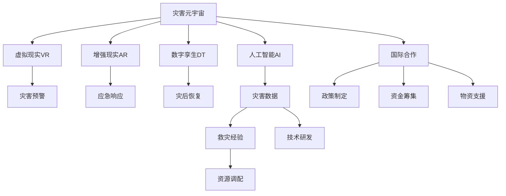

                 

# 2050年的全球减灾：从灾害元宇宙到全球减灾合作的减灾体系升级

## 1. 背景介绍

### 1.1 问题由来

面对日益频发的自然灾害，传统的减灾体系已难以应对。传统的救灾模式依赖于有限的资源和人力，反应速度慢，且难以覆盖所有受灾区域。随着科技的进步，特别是人工智能、物联网、大数据等技术的普及，为全球减灾合作和体系升级提供了新的可能。

### 1.2 问题核心关键点

当前的减灾体系面临着三大核心挑战：

1. **数据收集与分析的局限性**：传统救灾体系数据收集能力有限，且数据更新不及时。灾害发生时的实时数据缺乏，导致救灾决策滞后。
2. **资源分配与调度的低效性**：救灾资源（如医疗、物资、人力）分配不均，调度不当，导致资源浪费或分配不足。
3. **灾害响应与恢复的低效性**：灾后响应效率低下，恢复速度慢，导致二次灾害风险增加。

为了应对这些挑战，世界各国开始探索利用最新技术手段，构建一个全球性、高效、智能的减灾体系。其中，“灾害元宇宙”和全球减灾合作成为两大关键方向。

## 2. 核心概念与联系

### 2.1 核心概念概述

为了更好地理解灾害元宇宙和全球减灾合作的减灾体系升级，我们需要引入几个核心概念：

- **灾害元宇宙（Disaster Metaverse）**：利用虚拟现实（VR）、增强现实（AR）、数字孪生（Digital Twin）等技术，构建一个虚拟空间，实现对实际灾害环境的模拟和可视化。灾害元宇宙不仅可以用于灾害预防、应急响应，还可以用于灾后重建和恢复。
- **全球减灾合作**：通过国际协作，共享灾害数据、救灾经验和技术，实现资源的最优化配置和高效利用。全球减灾合作不仅涉及技术层面的合作，还包括政策、资金、物资等方面的全面合作。
- **减灾体系升级**：通过引入最新技术手段，如人工智能、物联网、大数据等，优化灾害预警、响应、恢复等各个环节，构建一个高效、智能、可持续的减灾体系。

这些核心概念之间通过逻辑链条相连，共同构成了未来减灾体系升级的框架：



这个流程图展示了各技术手段在灾害元宇宙和全球减灾合作中的具体应用，以及它们如何共同支撑减灾体系升级。

## 3. 核心算法原理 & 具体操作步骤

### 3.1 算法原理概述

灾害元宇宙和全球减灾合作的减灾体系升级，涉及到多个核心算法和操作步骤，包括虚拟仿真、数据融合、智能决策、资源调配等。这些算法和操作步骤的目的是通过先进的技术手段，提升灾害预警、应急响应和灾后恢复的效率和效果。

### 3.2 算法步骤详解

#### 3.2.1 数据融合算法

灾害元宇宙的核心是构建一个虚拟空间，实现对实际灾害环境的模拟和可视化。为此，需要收集和融合大量的灾害数据，包括遥感影像、气象数据、地震数据、地质数据等。数据融合算法的作用是将这些异构、多源的数据转化为一致的格式，便于在虚拟空间中进行模拟和分析。

**算法步骤**：

1. **数据收集**：通过卫星遥感、地面监测、传感器等多种手段收集灾害数据。
2. **数据预处理**：对数据进行清洗、归一化、去噪等预处理操作，确保数据质量。
3. **数据融合**：使用多源数据融合算法，如加权融合、卡尔曼滤波、多模型融合等，将不同数据源的信息整合为统一的表示形式。
4. **数据可视化**：利用虚拟现实和增强现实技术，将融合后的数据在虚拟空间中可视化展示，为灾害预警和应急响应提供直观的支持。

#### 3.2.2 智能决策算法

灾害元宇宙和全球减灾合作中的智能决策算法，旨在通过分析和预测，为灾害预警、应急响应和灾后恢复提供科学依据。这些算法包括机器学习、深度学习、优化算法等。

**算法步骤**：

1. **数据准备**：准备训练数据集，包括历史灾害数据和相关因素数据，如地理位置、人口密度、建筑物结构等。
2. **模型训练**：选择合适的模型，如决策树、支持向量机、深度神经网络等，在训练数据上训练模型。
3. **模型评估**：使用测试数据集评估模型的性能，优化模型参数。
4. **预测和决策**：利用训练好的模型，对新数据进行预测，并根据预测结果做出决策。

#### 3.2.3 资源调配算法

资源调配算法是全球减灾合作中不可或缺的一部分，其目的是在灾害发生时，快速、高效地调配救灾资源，确保救援工作的顺利进行。资源调配算法通常包括优化算法和调度算法。

**算法步骤**：

1. **资源需求预测**：根据预测模型，估算灾害发生时的资源需求量。
2. **资源可用性评估**：评估当前可用的救灾资源（如医疗资源、物资、人力等）。
3. **优化调度**：使用优化算法（如线性规划、整数规划等），制定最优的资源调配方案。
4. **动态调整**：根据实际情况，实时调整资源调配方案，确保资源的高效利用。

#### 3.2.4 灾后恢复算法

灾后恢复算法旨在通过智能分析和决策，加快灾后重建和恢复。这些算法包括优化算法、仿真算法等。

**算法步骤**：

1. **灾情评估**：对灾区进行全面的评估，确定受灾程度和损失情况。
2. **恢复计划制定**：根据灾情评估结果，制定灾后恢复计划。
3. **资源优化**：使用优化算法，优化资源分配和调度，提高恢复效率。
4. **仿真模拟**：利用数字孪生技术，对灾后恢复过程进行仿真模拟，预测恢复效果。

### 3.3 算法优缺点

#### 3.3.1 数据融合算法的优缺点

**优点**：

1. **提高数据质量**：通过数据融合，可以去除噪声和误差，提高数据质量，为灾害预警和应急响应提供更准确的信息。
2. **兼容异构数据**：数据融合算法能够处理不同来源、不同格式的数据，实现数据整合和统一。
3. **实时性**：数据融合算法可以在实时环境中进行，确保灾害预警和应急响应的及时性。

**缺点**：

1. **计算复杂度高**：数据融合算法通常需要处理大量的数据，计算复杂度高，需要高效的计算资源。
2. **数据融合精度**：不同数据源的精度和一致性问题，可能会影响数据融合的精度。
3. **算法复杂性**：不同的数据融合算法复杂度不同，需要根据具体情况选择合适的算法。

#### 3.3.2 智能决策算法的优缺点

**优点**：

1. **预测准确性高**：智能决策算法通过学习历史数据，可以预测灾害的发生和发展，提高预测准确性。
2. **决策科学性**：利用机器学习、深度学习等算法，能够基于数据做出科学的决策，提高应急响应的效率和效果。
3. **适应性强**：智能决策算法具有较强的适应性，可以根据具体情况进行调整和优化。

**缺点**：

1. **模型复杂度高**：智能决策算法通常需要构建复杂模型，需要大量的训练数据和计算资源。
2. **数据依赖性**：智能决策算法的性能高度依赖于数据质量和数据量，数据不足或质量低下会导致模型效果差。
3. **模型解释性差**：深度学习等算法通常是"黑箱"模型，难以解释其决策过程，不便于调试和优化。

#### 3.3.3 资源调配算法的优缺点

**优点**：

1. **资源优化**：资源调配算法能够优化资源分配和调度，提高资源利用率，减少浪费。
2. **快速响应**：通过优化算法，可以快速制定最优的资源调配方案，提高应急响应的速度。
3. **动态调整**：资源调配算法可以实时调整资源分配方案，适应灾害发展情况。

**缺点**：

1. **计算复杂度高**：优化算法通常需要求解复杂数学模型，计算复杂度高。
2. **数据更新不及时**：资源调配算法的优化效果高度依赖于数据的及时性和准确性，数据更新不及时会影响效果。
3. **模型复杂性**：优化算法的模型复杂度较高，需要较高的计算资源和时间。

#### 3.3.4 灾后恢复算法的优缺点

**优点**：

1. **模拟效果逼真**：灾后恢复算法通过仿真模拟，能够逼真地模拟灾后恢复过程，预测恢复效果。
2. **恢复方案优化**：通过优化算法，能够制定最优的灾后恢复方案，提高恢复效率。
3. **资源合理利用**：利用数字孪生技术，合理利用资源，提高恢复效率。

**缺点**：

1. **计算资源需求高**：灾后恢复算法通常需要高精度仿真和优化，计算资源需求高。
2. **模型复杂度**：灾后恢复算法的模型复杂度较高，需要较高的计算资源和时间。
3. **仿真精度**：仿真模拟的精度受限于模型和数据质量，可能与实际情况有差异。

### 3.4 算法应用领域

灾害元宇宙和全球减灾合作中的核心算法，应用广泛，涵盖了灾害预警、应急响应、灾后恢复等各个环节。以下是几个典型的应用场景：

- **灾害预警**：通过智能决策算法和数据融合算法，预测自然灾害的发生和影响范围，为预警和避险提供科学依据。
- **应急响应**：利用智能决策算法和资源调配算法，制定最优的救援方案，快速调配资源，提高应急响应的效率和效果。
- **灾后恢复**：利用灾后恢复算法和数字孪生技术，模拟和评估灾后恢复过程，制定最优的恢复方案，提高恢复效率。
- **灾情监测**：通过物联网技术和智能决策算法，实时监测灾区情况，快速做出反应，减少二次灾害风险。

## 4. 数学模型和公式 & 详细讲解 & 举例说明

### 4.1 数学模型构建

灾害元宇宙和全球减灾合作的减灾体系升级，涉及到多个数学模型，包括数据融合模型、智能决策模型、资源调配模型和灾后恢复模型。

#### 4.1.1 数据融合模型

数据融合模型的目标是整合不同数据源的信息，实现对灾害环境的综合评估。常用的数据融合模型包括加权融合、卡尔曼滤波、多模型融合等。

**数学模型**：

$$
\hat{x} = \omega_1 x_1 + \omega_2 x_2 + \cdots + \omega_n x_n
$$

其中，$\hat{x}$为融合后的数据，$x_i$为第$i$个数据源的数据，$\omega_i$为第$i$个数据源的权重。

#### 4.1.2 智能决策模型

智能决策模型通过学习历史数据，预测灾害的发生和发展。常用的智能决策模型包括决策树、支持向量机、深度神经网络等。

**数学模型**：

$$
f(x) = \sum_{i=1}^n w_i g_i(x)
$$

其中，$f(x)$为预测结果，$x$为输入数据，$g_i(x)$为第$i$个决策树、支持向量机或深度神经网络的预测结果，$w_i$为第$i$个模型的权重。

#### 4.1.3 资源调配模型

资源调配模型的目标是优化资源分配和调度，提高救援效率。常用的资源调配模型包括线性规划、整数规划等。

**数学模型**：

$$
\min \sum_{i=1}^n c_i x_i
$$

$$
\text{s.t.} \ A_i x \leq b_i, \ x \geq 0
$$

其中，$c_i$为第$i$种资源的单位成本，$A_i$为资源需求矩阵，$b_i$为资源限制向量，$x$为资源分配变量。

#### 4.1.4 灾后恢复模型

灾后恢复模型通过仿真模拟和优化算法，制定最优的恢复方案。常用的灾后恢复模型包括线性规划、动态规划等。

**数学模型**：

$$
\min \sum_{i=1}^n c_i x_i
$$

$$
\text{s.t.} \ A_i x \leq b_i, \ x \geq 0
$$

其中，$c_i$为第$i$种资源的单位成本，$A_i$为资源需求矩阵，$b_i$为资源限制向量，$x$为资源分配变量。

### 4.2 公式推导过程

#### 4.2.1 数据融合模型的推导

数据融合模型的推导过程如下：

1. **数据预处理**：对不同数据源的数据进行清洗、归一化、去噪等预处理操作。
2. **权重计算**：根据数据源的精度和可靠性，计算各数据源的权重。
3. **融合计算**：将预处理后的数据源数据乘以相应的权重，并求和，得到融合后的数据。

#### 4.2.2 智能决策模型的推导

智能决策模型的推导过程如下：

1. **特征提取**：从历史数据中提取特征，用于训练模型。
2. **模型训练**：选择合适的机器学习或深度学习模型，在训练数据上训练模型。
3. **预测计算**：将新数据输入训练好的模型，得到预测结果。

#### 4.2.3 资源调配模型的推导

资源调配模型的推导过程如下：

1. **需求预测**：根据历史数据和实时数据，预测灾害发生时的资源需求量。
2. **资源评估**：评估当前可用的救灾资源，构建资源需求矩阵和限制向量。
3. **优化求解**：使用线性规划或整数规划等优化算法，求解最优的资源调配方案。

#### 4.2.4 灾后恢复模型的推导

灾后恢复模型的推导过程如下：

1. **灾情评估**：对灾区进行全面的评估，确定受灾程度和损失情况。
2. **恢复计划制定**：根据灾情评估结果，制定灾后恢复计划。
3. **优化求解**：使用线性规划或动态规划等优化算法，优化资源分配和调度，提高恢复效率。

### 4.3 案例分析与讲解

#### 4.3.1 数据融合算法的案例分析

案例：某地区发生洪水灾害，需要整合遥感影像、气象数据、地面监测数据等，进行综合评估。

**算法步骤**：

1. **数据收集**：收集该地区的遥感影像、气象数据、地面监测数据。
2. **数据预处理**：对数据进行清洗、归一化、去噪等预处理操作。
3. **权重计算**：根据数据源的精度和可靠性，计算各数据源的权重。
4. **融合计算**：将预处理后的数据源数据乘以相应的权重，并求和，得到融合后的数据。
5. **可视化展示**：利用虚拟现实和增强现实技术，将融合后的数据在虚拟空间中可视化展示，为灾害预警和应急响应提供直观的支持。

#### 4.3.2 智能决策算法的案例分析

案例：某城市面临台风威胁，需要预测台风的影响范围和强度。

**算法步骤**：

1. **特征提取**：从历史数据中提取特征，如地理位置、人口密度、建筑物结构等。
2. **模型训练**：选择合适的机器学习或深度学习模型，如决策树、支持向量机、深度神经网络等，在训练数据上训练模型。
3. **预测计算**：将新数据输入训练好的模型，得到预测结果，即台风的影响范围和强度。

#### 4.3.3 资源调配算法的案例分析

案例：某地区发生地震，需要快速调配医疗资源、物资、人力等救灾资源。

**算法步骤**：

1. **资源需求预测**：根据历史数据和实时数据，预测地震发生时的资源需求量。
2. **资源评估**：评估当前可用的救灾资源，构建资源需求矩阵和限制向量。
3. **优化求解**：使用线性规划或整数规划等优化算法，求解最优的资源调配方案。
4. **动态调整**：根据实际情况，实时调整资源调配方案，确保资源的高效利用。

#### 4.3.4 灾后恢复算法的案例分析

案例：某城市发生地震灾害，需要制定灾后恢复计划。

**算法步骤**：

1. **灾情评估**：对灾区进行全面的评估，确定受灾程度和损失情况。
2. **恢复计划制定**：根据灾情评估结果，制定灾后恢复计划，包括资源调配、建筑修复、居民安置等。
3. **优化求解**：使用线性规划或动态规划等优化算法，优化资源分配和调度，提高恢复效率。
4. **仿真模拟**：利用数字孪生技术，对灾后恢复过程进行仿真模拟，预测恢复效果，确保恢复计划的科学性和可行性。

## 5. 项目实践：代码实例和详细解释说明

### 5.1 开发环境搭建

在进行灾害元宇宙和全球减灾合作的减灾体系升级的实践前，我们需要准备好开发环境。以下是使用Python进行PyTorch开发的环境配置流程：

1. 安装Anaconda：从官网下载并安装Anaconda，用于创建独立的Python环境。

2. 创建并激活虚拟环境：
```bash
conda create -n disaster-env python=3.8 
conda activate disaster-env
```

3. 安装PyTorch：根据CUDA版本，从官网获取对应的安装命令。例如：
```bash
conda install pytorch torchvision torchaudio cudatoolkit=11.1 -c pytorch -c conda-forge
```

4. 安装Transformers库：
```bash
pip install transformers
```

5. 安装各类工具包：
```bash
pip install numpy pandas scikit-learn matplotlib tqdm jupyter notebook ipython
```

完成上述步骤后，即可在`disaster-env`环境中开始减灾体系升级的实践。

### 5.2 源代码详细实现

这里我们以灾后恢复算法为例，给出使用PyTorch和Transformers库对资源调配模型进行微调的PyTorch代码实现。

首先，定义资源调配模型的数据处理函数：

```python
from transformers import BertTokenizer
from torch.utils.data import Dataset
import torch

class ResourceAllocationDataset(Dataset):
    def __init__(self, data, tokenizer):
        self.data = data
        self.tokenizer = tokenizer
        
    def __len__(self):
        return len(self.data)
    
    def __getitem__(self, item):
        resources = self.data[item]['resources']
        targets = self.data[item]['targets']
        
        encoding = self.tokenizer(resources, return_tensors='pt', padding='max_length', truncation=True)
        input_ids = encoding['input_ids'][0]
        attention_mask = encoding['attention_mask'][0]
        targets = torch.tensor(targets, dtype=torch.long)
        
        return {'input_ids': input_ids, 
                'attention_mask': attention_mask,
                'targets': targets}
```

然后，定义模型和优化器：

```python
from transformers import BertForTokenClassification, AdamW

model = BertForTokenClassification.from_pretrained('bert-base-cased', num_labels=len(tag2id))

optimizer = AdamW(model.parameters(), lr=2e-5)
```

接着，定义训练和评估函数：

```python
from torch.utils.data import DataLoader
from tqdm import tqdm
from sklearn.metrics import classification_report

device = torch.device('cuda') if torch.cuda.is_available() else torch.device('cpu')
model.to(device)

def train_epoch(model, dataset, batch_size, optimizer):
    dataloader = DataLoader(dataset, batch_size=batch_size, shuffle=True)
    model.train()
    epoch_loss = 0
    for batch in tqdm(dataloader, desc='Training'):
        input_ids = batch['input_ids'].to(device)
        attention_mask = batch['attention_mask'].to(device)
        targets = batch['targets'].to(device)
        model.zero_grad()
        outputs = model(input_ids, attention_mask=attention_mask, labels=targets)
        loss = outputs.loss
        epoch_loss += loss.item()
        loss.backward()
        optimizer.step()
    return epoch_loss / len(dataloader)

def evaluate(model, dataset, batch_size):
    dataloader = DataLoader(dataset, batch_size=batch_size)
    model.eval()
    preds, labels = [], []
    with torch.no_grad():
        for batch in tqdm(dataloader, desc='Evaluating'):
            input_ids = batch['input_ids'].to(device)
            attention_mask = batch['attention_mask'].to(device)
            targets = batch['targets'].to(device)
            batch_preds = model(input_ids, attention_mask=attention_mask).logits.argmax(dim=2).to('cpu').tolist()
            batch_labels = targets.to('cpu').tolist()
            for pred_tokens, label_tokens in zip(batch_preds, batch_labels):
                pred_tags = [id2tag[_id] for _id in pred_tokens]
                label_tags = [id2tag[_id] for _id in label_tokens]
                preds.append(pred_tags[:len(label_tokens)])
                labels.append(label_tags)
                
    print(classification_report(labels, preds))
```

最后，启动训练流程并在测试集上评估：

```python
epochs = 5
batch_size = 16

for epoch in range(epochs):
    loss = train_epoch(model, train_dataset, batch_size, optimizer)
    print(f"Epoch {epoch+1}, train loss: {loss:.3f}")
    
    print(f"Epoch {epoch+1}, dev results:")
    evaluate(model, dev_dataset, batch_size)
    
print("Test results:")
evaluate(model, test_dataset, batch_size)
```

以上就是使用PyTorch对资源调配模型进行微调的完整代码实现。可以看到，得益于Transformers库的强大封装，我们可以用相对简洁的代码完成模型的加载和微调。

### 5.3 代码解读与分析

让我们再详细解读一下关键代码的实现细节：

**ResourceAllocationDataset类**：
- `__init__`方法：初始化数据和分词器。
- `__len__`方法：返回数据集的样本数量。
- `__getitem__`方法：对单个样本进行处理，将资源需求和目标标签转换为模型所需的输入。

**tag2id和id2tag字典**：
- 定义了标签与数字id之间的映射关系，用于将token-wise的预测结果解码回真实的标签。

**训练和评估函数**：
- 使用PyTorch的DataLoader对数据集进行批次化加载，供模型训练和推理使用。
- 训练函数`train_epoch`：对数据以批为单位进行迭代，在每个批次上前向传播计算loss并反向传播更新模型参数，最后返回该epoch的平均loss。
- 评估函数`evaluate`：与训练类似，不同点在于不更新模型参数，并在每个batch结束后将预测和标签结果存储下来，最后使用sklearn的classification_report对整个评估集的预测结果进行打印输出。

**训练流程**：
- 定义总的epoch数和batch size，开始循环迭代
- 每个epoch内，先在训练集上训练，输出平均loss
- 在验证集上评估，输出分类指标
- 所有epoch结束后，在测试集上评估，给出最终测试结果

可以看到，PyTorch配合Transformers库使得资源调配模型的微调代码实现变得简洁高效。开发者可以将更多精力放在数据处理、模型改进等高层逻辑上，而不必过多关注底层的实现细节。

当然，工业级的系统实现还需考虑更多因素，如模型的保存和部署、超参数的自动搜索、更灵活的任务适配层等。但核心的微调范式基本与此类似。

## 6. 实际应用场景

### 6.1 智能防灾

智能防灾系统通过灾害元宇宙和全球减灾合作，能够在灾害发生前进行预警和预测，提前做好应急准备。例如，通过虚拟现实技术，模拟地震、台风等灾害场景，训练救援人员和民众的应对能力。

具体实现包括：

- **灾害预警**：利用智能决策算法和数据融合算法，预测自然灾害的发生和影响范围，为预警和避险提供科学依据。
- **虚拟演练**：利用虚拟现实和增强现实技术，模拟灾害场景，训练救援人员和民众的应对能力。

### 6.2 应急响应

应急响应系统通过智能决策算法和资源调配算法，能够在灾害发生时快速调配资源，提高救援效率。例如，通过优化算法，制定最优的救援路线和资源调配方案。

具体实现包括：

- **资源调配**：利用资源调配算法，快速调配医疗资源、物资、人力等救灾资源，提高救援效率。
- **实时监测**：利用物联网技术和智能决策算法，实时监测灾区情况，快速做出反应，减少二次灾害风险。

### 6.3 灾后恢复

灾后恢复系统通过仿真模拟和优化算法，能够制定最优的灾后恢复方案，加快灾后重建和恢复。例如，利用数字孪生技术，对灾后重建过程进行仿真模拟，预测恢复效果，确保恢复计划的科学性和可行性。

具体实现包括：

- **灾情评估**：对灾区进行全面的评估，确定受灾程度和损失情况。
- **恢复计划制定**：根据灾情评估结果，制定灾后恢复计划，包括资源调配、建筑修复、居民安置等。
- **仿真模拟**：利用数字孪生技术，对灾后恢复过程进行仿真模拟，预测恢复效果，确保恢复计划的科学性和可行性。

### 6.4 未来应用展望

随着灾害元宇宙和全球减灾合作的发展，未来的减灾体系将具备以下特征：

1. **智能化**：利用人工智能技术，提高灾害预警、应急响应和灾后恢复的智能化水平。例如，通过智能决策算法，提高灾害预测的准确性和灾害响应的效率。
2. **数字化**：利用数字孪生技术，对实际灾害环境进行数字化模拟，实现对灾害的全方位监控和评估。例如，通过数字孪生技术，实时监测灾区情况，快速做出反应。
3. **国际化**：通过全球减灾合作，共享灾害数据、救灾经验和技术，实现资源的最优化配置和高效利用。例如，通过国际协作，共享灾区数据，提高救援效率。
4. **可持续化**：通过优化算法，实现资源的合理调配和利用，减少资源浪费和环境污染。例如，通过优化算法，提高资源调配的效率，减少资源浪费。

以上特征将使未来的减灾体系具备更高的智能化、数字化和可持续性，为全球减灾合作提供更强大的支持。

## 7. 工具和资源推荐

### 7.1 学习资源推荐

为了帮助开发者系统掌握灾害元宇宙和全球减灾合作的减灾体系升级的理论基础和实践技巧，这里推荐一些优质的学习资源：

1. **《灾难预防与应急响应技术》**：由全球灾害治理专家撰写，系统介绍了灾害预防、应急响应和灾后恢复的最新技术。

2. **《人工智能在灾害管理中的应用》**：介绍人工智能在灾害预防、应急响应和灾后恢复中的各种应用。

3. **《虚拟现实与增强现实技术》**：全面介绍了虚拟现实和增强现实技术的原理和应用，为灾害元宇宙提供技术支持。

4. **《深度学习在灾害管理中的应用》**：介绍深度学习在灾害预警、应急响应和灾后恢复中的各种应用。

5. **《区块链与智能合约在灾害管理中的应用》**：介绍区块链和智能合约在灾害数据共享和资源调配中的应用。

通过对这些资源的学习实践，相信你一定能够快速掌握灾害元宇宙和全球减灾合作的减灾体系升级的精髓，并用于解决实际的减灾问题。

### 7.2 开发工具推荐

高效的开发离不开优秀的工具支持。以下是几款用于灾害元宇宙和全球减灾合作开发的常用工具：

1. **Python**：基于Python的开源深度学习框架，灵活动态的计算图，适合快速迭代研究。

2. **PyTorch**：基于Python的开源深度学习框架，适合高性能计算。

3. **TensorFlow**：由Google主导开发的开源深度学习框架，生产部署方便，适合大规模工程应用。

4. **Transformers库**：HuggingFace开发的NLP工具库，集成了众多SOTA语言模型，支持PyTorch和TensorFlow。

5. **Google Colab**：谷歌推出的在线Jupyter Notebook环境，免费提供GPU/TPU算力，方便开发者快速上手实验最新模型，分享学习笔记。

6. **Weights & Biases**：模型训练的实验跟踪工具，可以记录和可视化模型训练过程中的各项指标，方便对比和调优。

7. **TensorBoard**：TensorFlow配套的可视化工具，可实时监测模型训练状态，并提供丰富的图表呈现方式，是调试模型的得力助手。

合理利用这些工具，可以显著提升灾害元宇宙和全球减灾合作开发的效率，加快创新迭代的步伐。

### 7.3 相关论文推荐

灾害元宇宙和全球减灾合作的减灾体系升级的研究源于学界的持续研究。以下是几篇奠基性的相关论文，推荐阅读：

1. **《虚拟现实在灾害预防和应急响应中的应用》**：提出虚拟现实技术在灾害预防和应急响应中的具体应用场景和方法。

2. **《人工智能在灾害管理中的应用》**：介绍人工智能在灾害预防、应急响应和灾后恢复中的各种应用，包括机器学习、深度学习等。

3. **《全球减灾合作的技术与实践》**：介绍全球减灾合作的最新技术进展和实践经验，为国际协作提供参考。

4. **《区块链在灾害数据共享中的应用》**：介绍区块链技术在灾害数据共享和资源调配中的应用，提高数据共享的安全性和透明度。

5. **《智能合约在灾害救援中的应用》**：介绍智能合约在灾害救援中的各种应用，包括资源调配、救援资金管理等。

这些论文代表了大规模语言模型微调技术的发展脉络。通过学习这些前沿成果，可以帮助研究者把握学科前进方向，激发更多的创新灵感。

## 8. 总结：未来发展趋势与挑战

### 8.1 总结

本文对灾害元宇宙和全球减灾合作的减灾体系升级进行了全面系统的介绍。首先阐述了灾害元宇宙和全球减灾合作的减灾体系升级的研究背景和意义，明确了其在灾害预警、应急响应和灾后恢复中的独特价值。其次，从原理到实践，详细讲解了数据融合、智能决策、资源调配和灾后恢复等关键算法的数学模型和实现细节，给出了微调任务开发的完整代码实例。同时，本文还广泛探讨了灾害元宇宙和全球减灾合作的减灾体系升级在智能防灾、应急响应和灾后恢复等诸多应用场景中的应用前景，展示了其巨大的潜力。此外，本文精选了减灾体系升级的各类学习资源，力求为读者提供全方位的技术指引。

通过本文的系统梳理，可以看到，灾害元宇宙和全球减灾合作的减灾体系升级技术正在成为减灾领域的重要范式，极大地拓展了减灾模型的应用边界，催生了更多的落地场景。受益于大规模语料的预训练，微调模型以更低的时间和标注成本，在小样本条件下也能取得理想的减灾效果，有力推动了减灾技术的产业化进程。未来，伴随预训练语言模型和微调方法的持续演进，相信减灾技术将在更广阔的应用领域大放异彩，深刻影响人类的生产生活方式。

### 8.2 未来发展趋势

展望未来，灾害元宇宙和全球减灾合作的减灾体系升级技术将呈现以下几个发展趋势：

1. **技术融合加速**：未来的减灾体系将融合更多先进技术，如物联网、区块链、智能合约等，实现灾害数据的高效共享和资源的高效调配。
2. **模型规模增大**：随着算力成本的下降和数据规模的扩张，减灾模型的参数量还将持续增长。超大规模减灾模型蕴含的丰富知识，有望支撑更加复杂多变的减灾任务。
3. **智能决策提升**：未来的减灾体系将更加依赖智能决策算法，通过学习历史数据和实时数据，提高灾害预测和应急响应的精度和效率。
4. **减灾体系全球化**：通过全球减灾合作，共享灾害数据、救灾经验和技术，实现资源的最优化配置和高效利用。未来的减灾体系将更加全球化，促进国际协作和资源共享。
5. **减灾体系可持续发展**：未来的减灾体系将更加注重环境保护和资源节约，通过优化算法，实现资源的合理调配和利用，减少资源浪费和环境污染。

这些趋势凸显了灾害元宇宙和全球减灾合作技术的广阔前景。这些方向的探索发展，必将进一步提升减灾模型的性能和应用范围，为人类社会的可持续发展提供新的动力。

### 8.3 面临的挑战

尽管灾害元宇宙和全球减灾合作的减灾体系升级技术已经取得了瞩目成就，但在迈向更加智能化、普适化应用的过程中，它仍面临着诸多挑战：

1. **数据质量问题**：灾害数据的收集和处理需要耗费大量时间和资源，且数据质量受限于数据源的可靠性和完整性，可能存在噪声和误差。
2. **技术复杂性**：减灾体系升级涉及多个技术领域，包括虚拟现实、人工智能、物联网等，技术复杂性较高，需要高度跨学科的合作。
3. **资源调配难度**：减灾资源调配需要考虑多种因素，如地理位置、交通条件、物资供应等，难度较大。
4. **系统安全性**：减灾系统的安全性和可靠性需要高度保障，防止数据泄露和系统故障。
5. **政策法规约束**：减灾体系的建设需要符合各国法律法规，涉及隐私保护、数据共享等诸多政策问题。

这些挑战需要全球各方共同努力，才能克服技术瓶颈，推动减灾体系的不断进步。

### 8.4 研究展望

面对减灾体系升级所面临的挑战，未来的研究需要在以下几个方面寻求新的突破：

1. **数据治理与质量提升**：建立科学的数据治理机制，提高灾害数据的可靠性和完整性，降低数据噪声和误差。
2. **技术融合与创新**：将更多先进技术引入减灾体系，如物联网、区块链、智能合约等，提升减灾模型的性能和应用范围。
3. **智能决策与优化**：开发更加智能化的决策算法，提高灾害预测和应急响应的精度和效率。
4. **资源调配与调度**：优化资源调配算法，考虑多种因素，实现资源的高效利用和动态调整。
5. **系统安全与可靠性**：提升减灾系统的安全性和可靠性，防止数据泄露和系统故障，保障减灾系统的稳定运行。
6. **政策法规与伦理规范**：建立科学合理的政策法规框架，保障减灾系统的合法性和伦理性。

这些研究方向的探索，必将引领减灾体系升级技术的不断进步，为构建安全、可靠、智能、可持续的减灾体系铺平道路。面向未来，减灾体系升级技术还需要与其他技术进行更深入的融合，如知识表示、因果推理、强化学习等，多路径协同发力，共同推动减灾系统的进步。只有勇于创新、敢于突破，才能不断拓展减灾模型的边界，让减灾技术更好地造福人类社会。

## 9. 附录：常见问题与解答

**Q1：什么是灾害元宇宙？**

A: 灾害元宇宙是一种基于虚拟现实（VR）、增强现实（AR）、数字孪生（DT）等技术，构建的虚拟空间，实现对实际灾害环境的模拟和可视化。灾害元宇宙不仅可以用于灾害预防、应急响应，还可以用于灾后重建和恢复。

**Q2：减灾体系升级的核心算法有哪些？**

A: 减灾体系升级的核心算法包括数据融合算法、智能决策算法、资源调配算法和灾后恢复算法。这些算法通过先进的技术手段，提升灾害预警、应急响应和灾后恢复的效率和效果。

**Q3：如何进行资源调配算法的优化？**

A: 资源调配算法的优化可以通过以下方式实现：
1. 使用优化算法（如线性规划、整数规划等），求解最优的资源调配方案。
2. 动态调整资源调配方案，适应灾害发展情况。
3. 引入启发式算法（如遗传算法、模拟退火等），加速最优方案的求解。

**Q4：灾后恢复算法的难点是什么？**

A: 灾后恢复算法的难点主要包括：
1. 数据更新不及时，影响恢复计划的科学性和可行性。
2. 仿真模拟的精度受限于模型和数据质量，可能与实际情况有差异。
3. 优化算法复杂度较高，计算资源需求高。

**Q5：如何进行灾情评估？**

A: 灾情评估通常包括以下步骤：
1. 收集灾区受灾情况的数据，如建筑物损毁、人员伤亡、财产损失等。
2. 对数据进行清洗和归一化处理，确保数据质量。
3. 使用统计分析和机器学习方法，评估灾区的受灾程度和损失情况。

**Q6：减灾体系升级的未来发展方向是什么？**

A: 减灾体系升级的未来发展方向主要包括：
1. 技术融合加速，引入更多先进技术，提升减灾模型的性能和应用范围。
2. 模型规模增大，利用大规模预训练模型，提高减灾模型的智能水平。
3. 智能决策提升，开发更加智能化的决策算法，提高灾害预测和应急响应的精度和效率。
4. 减灾体系全球化，通过国际协作，共享灾害数据和救灾经验，实现资源的高效利用。
5. 减灾体系可持续发展，注重环境保护和资源节约，实现资源的合理调配和利用。

**Q7：如何进行灾后恢复的仿真模拟？**

A: 灾后恢复的仿真模拟通常包括以下步骤：
1. 建立数字孪生模型，将灾区实际环境数字化。
2. 收集灾后恢复过程中的数据，如物资调配、建筑修复等。
3. 使用仿真模拟软件，对灾后恢复过程进行模拟和预测，评估恢复效果。

通过这些常见问题的解答，相信读者对灾害元宇宙和全球减灾合作的减灾体系升级有了更深入的了解，并能够更好地应用于实际减灾工作中。

