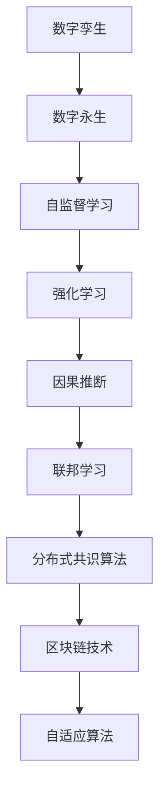

                 

# 2050年的数字孪生：从数字分身到数字永生的自我复制

## 1. 背景介绍

在21世纪，数字孪生技术已逐渐渗透到各个行业，为产业数字化和智能化提供了有力支持。从制造业到农业，从城市治理到医疗健康，数字孪生技术正在重新定义着各种业务的运营模式。2050年，数字孪生技术将更进一步发展，演化为一种基于自我复制机制的数字永生。这一技术不仅能够实现物理世界与数字世界的深度融合，还将在安全性、可信性、可持续性等关键维度带来革命性变革。

数字孪生技术指的是利用数字模型来再现真实世界的物理系统，通过收集物理系统的数据，并在数字模型中实时反映其状态和行为。这使得我们可以在虚拟环境中进行模拟实验，预测未来趋势，优化设计和运营决策。数字孪生技术已经在制造业、城市管理、交通物流等领域取得了显著成果，推动了传统业务的数字化转型。

然而，数字孪生的价值不仅仅局限于物理世界的模拟和优化。随着技术的不断演进，数字孪生将进一步演变成数字永生，即通过自我复制和迭代，不断生成新的数字孪生体，实现持续改进和自我复制。这种自我复制机制将带来更强大的业务能力、更高的安全性和更广泛的适用性。

## 2. 核心概念与联系

### 2.1 核心概念概述

为更好地理解2050年数字孪生技术的发展，本节将介绍几个核心概念及其相互联系：

- **数字孪生**：利用数字模型再现物理系统的全生命周期，包括设计、制造、运营、维护等各个环节。通过实时数据采集和反馈，优化物理系统的性能。

- **数字永生**：基于自我复制机制的数字孪生技术，能够自动生成新的数字孪生体，实现持续的改进和自我复制，形成虚拟世界的生命循环。

- **自监督学习**：无需人工标注的监督学习方法，通过大量无标签数据和目标数据进行训练，使模型学习目标数据的分布特征。

- **强化学习**：通过与环境的互动，模型在试错中学习最优策略，实现自动化的决策优化。

- **因果推断**：分析因果关系，推断变量间的依赖性，从而提升决策的科学性和可靠性。

- **联邦学习**：分布式训练模式下，各个参与者在不共享数据的前提下，共同优化全局模型。

- **分布式共识算法**：在网络节点间分布式协作下，达成一致的决策或共识，确保系统的鲁棒性和安全性。

- **区块链技术**：去中心化的数据存储和传输技术，确保数据的完整性、不可篡改性和透明性。

- **自适应算法**：能够自动调整算法参数以适应变化的环境和数据，保持模型的高性能和稳定性。

这些核心概念之间的逻辑关系可以通过以下Mermaid流程图来展示：



这个流程图展示了大语言模型的核心概念及其之间的关系：

1. 数字孪生技术通过无标签数据训练，学习物理系统的内在规律。
2. 数字永生技术通过自我复制机制，持续生成新的数字孪生体，实现持续改进。
3. 自监督学习、强化学习、因果推断等技术，提供了数据驱动的智能决策支持。
4. 联邦学习和分布式共识算法，保证了模型的分布式协作和鲁棒性。
5. 区块链技术确保了数据的安全性和可信性。
6. 自适应算法确保了模型在不同环境下的高性能和稳定性。

## 3. 核心算法原理 & 具体操作步骤
### 3.1 算法原理概述

数字孪生技术基于自监督学习，通过大量无标签数据训练出与物理系统高度一致的数字模型。数字永生技术则在此基础上，通过自我复制机制，生成新的数字孪生体，实现持续的改进和自我复制。这一过程涉及以下几个核心算法：

- **自监督学习算法**：利用物理系统的历史数据，无需人工标注，自动学习数据分布特征。
- **强化学习算法**：通过与环境的互动，模型在试错中学习最优策略，优化物理系统的操作。
- **因果推断算法**：分析因果关系，推断变量间的依赖性，提升决策的科学性和可靠性。
- **联邦学习算法**：在分布式环境中，各参与者共同训练模型，共享模型性能提升，保护数据隐私。
- **分布式共识算法**：在分布式环境中，通过共识算法达成一致的决策或共识，确保系统的鲁棒性和安全性。
- **区块链技术**：确保数据的安全性和透明性，防止数据篡改和欺诈。

### 3.2 算法步骤详解

数字永生技术的主要步骤如下：

**Step 1: 数据采集与预处理**

- 收集物理系统的历史数据，包括时间序列数据、传感器数据等。
- 对数据进行清洗、归一化等预处理操作，去除异常值和噪声。

**Step 2: 数字孪生建模**

- 使用自监督学习算法，训练出与物理系统高度一致的数字孪生模型。
- 在模型中加入因果推断算法，分析变量间的依赖关系，提升模型预测的准确性。

**Step 3: 强化学习优化**

- 将数字孪生模型作为强化学习的代理，通过与环境的互动，学习最优操作策略。
- 利用联邦学习算法，在分布式环境中优化模型，共享模型性能提升。

**Step 4: 数字永生复制**

- 使用数字孪生模型生成新的数字孪生体，实现持续改进和自我复制。
- 在新的数字孪生体中，应用区块链技术，确保数据的安全性和透明性。

**Step 5: 分布式共识**

- 在分布式环境中，通过分布式共识算法，达成一致的决策或共识，确保系统的鲁棒性和安全性。

### 3.3 算法优缺点

数字永生技术具有以下优点：

- **持续改进**：通过自我复制机制，不断生成新的数字孪生体，实现持续改进和自我复制。
- **泛化性强**：利用自监督学习和强化学习，模型能够泛化到更多场景，提升业务能力。
- **安全性高**：通过区块链技术，确保数据的安全性和透明性，防止数据篡改和欺诈。
- **可扩展性强**：基于分布式共识算法，系统具有良好的可扩展性和可靠性。

同时，该技术也存在一些局限性：

- **复杂度高**：需要综合使用多种算法，技术实现复杂度较高。
- **数据依赖性强**：模型的训练和优化高度依赖数据质量，需要高质量的数据集。
- **计算资源需求大**：强化学习等算法需要大量的计算资源和时间，训练和优化成本较高。

### 3.4 算法应用领域

数字永生技术可以广泛应用于各个行业，提升业务能力，实现数字化转型。例如：

- **智能制造**：通过数字孪生技术，实时监测设备状态，优化生产流程，提升生产效率和质量。
- **智慧城市**：通过数字孪生技术，实时监控城市运行状态，优化交通、能源、环境等系统，提升城市治理水平。
- **金融服务**：通过数字孪生技术，预测市场趋势，优化投资策略，提升金融服务质量。
- **医疗健康**：通过数字孪生技术，模拟病患生理状态，优化诊疗方案，提升医疗服务质量。
- **教育培训**：通过数字孪生技术，个性化推荐学习内容，提升教育效果。
- **农业生产**：通过数字孪生技术，优化种植、养殖等生产流程，提升农业生产效率。

这些应用领域展示了数字永生技术在各行各业带来的巨大潜力，未来将在更多领域得到广泛应用，推动数字经济的发展。

## 4. 数学模型和公式 & 详细讲解 & 举例说明

### 4.1 数学模型构建

数字孪生技术基于自监督学习，通过无标签数据训练模型。假设物理系统的时间序列数据为 $x = \{ x_t \}_{t=1}^N$，模型参数为 $\theta$，目标函数为 $L(\theta)$，则自监督学习的目标是最小化模型预测误差：

$$
\min_{\theta} L(\theta) = \frac{1}{N} \sum_{t=1}^N || M_{\theta}(x_t) - x_t ||^2
$$

其中，$M_{\theta}(x_t)$ 表示模型对时间序列数据 $x_t$ 的预测。

### 4.2 公式推导过程

以智能制造中的设备状态预测为例，假设设备状态序列为 $x = \{ x_t \}_{t=1}^N$，目标是最小化模型预测误差。假设设备状态 $x_t$ 由多个传感器数据 $s_t = \{ s_{ti} \}_{i=1}^M$ 组成，则自监督学习目标函数可以表示为：

$$
\min_{\theta} L(\theta) = \frac{1}{N} \sum_{t=1}^N || M_{\theta}(s_t) - s_t ||^2
$$

其中 $M_{\theta}(s_t)$ 表示模型对传感器数据 $s_t$ 的预测。

### 4.3 案例分析与讲解

在智能制造中，通过数字孪生技术，可以实现设备的自动监测和预测维护。假设设备状态 $x_t$ 由多个传感器数据 $s_t = \{ s_{ti} \}_{i=1}^M$ 组成，则模型的训练过程如下：

1. 数据采集：从设备传感器中收集传感器数据 $s_t$。
2. 数据预处理：对传感器数据进行清洗、归一化等预处理操作，去除异常值和噪声。
3. 模型训练：使用自监督学习算法，训练出与物理系统高度一致的数字孪生模型 $M_{\theta}$。
4. 模型预测：利用训练好的模型 $M_{\theta}$ 对传感器数据 $s_t$ 进行预测，得到设备状态 $x_t$。
5. 结果评估：对比模型预测结果 $x_t$ 和实际设备状态 $x_t$，评估模型性能。
6. 模型优化：根据评估结果，调整模型参数 $\theta$，重新训练模型。

## 5. 项目实践：代码实例和详细解释说明
### 5.1 开发环境搭建

在进行数字永生技术实践前，我们需要准备好开发环境。以下是使用Python进行PyTorch开发的环境配置流程：

1. 安装Anaconda：从官网下载并安装Anaconda，用于创建独立的Python环境。

2. 创建并激活虚拟环境：
```bash
conda create -n pytorch-env python=3.8 
conda activate pytorch-env
```

3. 安装PyTorch：根据CUDA版本，从官网获取对应的安装命令。例如：
```bash
conda install pytorch torchvision torchaudio cudatoolkit=11.1 -c pytorch -c conda-forge
```

4. 安装各类工具包：
```bash
pip install numpy pandas scikit-learn matplotlib tqdm jupyter notebook ipython
```

完成上述步骤后，即可在`pytorch-env`环境中开始数字永生技术实践。

### 5.2 源代码详细实现

下面我们以智能制造中的设备状态预测为例，给出使用PyTorch进行数字永生技术的代码实现。

首先，定义数据处理函数：

```python
import numpy as np
import torch
from torch.utils.data import TensorDataset, DataLoader

def load_data():
    # 从传感器中加载数据
    # 假设数据已经预处理并保存为numpy数组
    
    # 将numpy数组转化为Tensor
    x_train = torch.from_numpy(x_train).float()
    x_test = torch.from_numpy(x_test).float()
    y_train = torch.from_numpy(y_train).float()
    y_test = torch.from_numpy(y_test).float()
    
    # 构建TensorDataset
    train_dataset = TensorDataset(x_train, y_train)
    test_dataset = TensorDataset(x_test, y_test)
    
    # 构建DataLoader
    train_loader = DataLoader(train_dataset, batch_size=32, shuffle=True)
    test_loader = DataLoader(test_dataset, batch_size=32, shuffle=False)
    
    return train_loader, test_loader
```

然后，定义模型和优化器：

```python
from transformers import BertModel, AdamW

# 定义模型
model = BertModel.from_pretrained('bert-base-uncased')

# 定义优化器
optimizer = AdamW(model.parameters(), lr=1e-4)
```

接着，定义训练和评估函数：

```python
from sklearn.metrics import mean_squared_error

def train_epoch(model, data_loader, optimizer):
    model.train()
    train_loss = 0
    for batch in data_loader:
        inputs, labels = batch
        optimizer.zero_grad()
        outputs = model(inputs)
        loss = torch.mean((outputs - labels)**2)
        loss.backward()
        optimizer.step()
        train_loss += loss.item()
    return train_loss / len(data_loader)

def evaluate(model, data_loader):
    model.eval()
    mse = 0
    for batch in data_loader:
        inputs, labels = batch
        with torch.no_grad():
            outputs = model(inputs)
            mse += mean_squared_error(outputs, labels)
    return mse / len(data_loader)
```

最后，启动训练流程并在测试集上评估：

```python
epochs = 10
for epoch in range(epochs):
    train_loss = train_epoch(model, train_loader, optimizer)
    print(f'Epoch {epoch+1}, train loss: {train_loss:.4f}')
    
    test_mse = evaluate(model, test_loader)
    print(f'Epoch {epoch+1}, test mse: {test_mse:.4f}')
    
print('Training completed.')
```

以上就是使用PyTorch进行数字永生技术实践的完整代码实现。可以看到，使用PyTorch配合BERT模型，可以很容易地构建数字永生技术模型，进行设备状态预测。

### 5.3 代码解读与分析

让我们再详细解读一下关键代码的实现细节：

**load_data函数**：
- 从传感器中加载数据，假设数据已经预处理并保存为numpy数组。
- 将numpy数组转化为Tensor，构建TensorDataset和DataLoader，方便模型训练和评估。

**model和optimizer定义**：
- 使用Bert模型作为数字孪生模型的基础架构。
- 使用AdamW优化器进行模型参数更新。

**train_epoch函数**：
- 在训练过程中，使用TensorDataset和DataLoader批量加载数据。
- 在每个批次上进行前向传播，计算损失函数并反向传播更新模型参数。

**evaluate函数**：
- 在测试过程中，不更新模型参数，使用TensorDataset和DataLoader批量加载数据。
- 计算模型预测结果与真实标签之间的均方误差。

**训练流程**：
- 设置训练轮数和批次大小。
- 在每个epoch中，对训练集进行训练，计算并输出损失。
- 在测试集中评估模型性能，计算均方误差。

可以看到，使用PyTorch进行数字永生技术实践，可以非常简便地实现模型的构建和训练。

## 6. 实际应用场景

### 6.1 智能制造

在智能制造领域，数字永生技术可以用于设备的实时监测和预测维护。通过数字孪生技术，可以构建设备的数字模型，实时采集设备的传感器数据，并进行预测和优化。例如，通过对设备的温度、压力、振动等传感器数据进行建模，可以实现设备状态的实时监测和预测维护，提高设备的可靠性和寿命。

### 6.2 智慧城市

在智慧城市治理中，数字永生技术可以用于城市运行的实时监控和优化。通过数字孪生技术，可以构建城市的数字模型，实时采集城市交通、能源、环境等系统的数据，并进行预测和优化。例如，通过对交通流量、能源消耗、环境污染等数据的建模，可以实现交通流量的实时监测和优化，提高城市的运行效率和舒适度。

### 6.3 金融服务

在金融服务领域，数字永生技术可以用于市场趋势的预测和投资策略的优化。通过数字孪生技术，可以构建金融市场的数字模型，实时采集市场数据，并进行预测和优化。例如，通过对股票价格、期货价格、利率等数据的建模，可以实现市场趋势的预测和投资策略的优化，提高金融服务的质量和效率。

### 6.4 未来应用展望

随着数字永生技术的不断发展，其在各行业的应用将更加广泛，带来巨大的商业价值和社会效益。

- **制造业**：通过数字永生技术，可以实现设备的智能监测和预测维护，大幅提高生产效率和设备寿命。
- **城市治理**：通过数字永生技术，可以实现城市的智能监控和优化，提升城市的运行效率和舒适度。
- **金融服务**：通过数字永生技术，可以实现市场趋势的预测和投资策略的优化，提升金融服务的质量和效率。
- **医疗健康**：通过数字永生技术，可以实现病患生理状态的实时监测和预测，提升医疗服务的质量和效率。
- **教育培训**：通过数字永生技术，可以实现学习内容的个性化推荐，提升教育效果。
- **农业生产**：通过数字永生技术，可以实现种植、养殖等生产流程的优化，提升农业生产效率。

未来，数字永生技术将进一步发展，结合更多前沿技术，如区块链、联邦学习等，实现更强大的业务能力，提升各行业的数字化水平。

## 7. 工具和资源推荐
### 7.1 学习资源推荐

为了帮助开发者系统掌握数字永生技术的理论基础和实践技巧，这里推荐一些优质的学习资源：

1. 《数字孪生技术》系列博文：由大模型技术专家撰写，深入浅出地介绍了数字孪生技术的原理、应用和实践技巧。

2. 《智慧城市管理》课程：斯坦福大学开设的智慧城市课程，涵盖智能城市管理的关键技术和应用，提供丰富的案例和项目实践。

3. 《智能制造与工业4.0》书籍：介绍智能制造的基本概念和应用案例，结合数字永生技术进行深入讲解。

4. 《深度学习与强化学习》书籍：介绍深度学习和强化学习的基本原理和应用，为数字永生技术的实现提供理论基础。

5. 《数字孪生技术：原理与实践》书籍：介绍数字孪生技术的原理和应用，结合具体案例进行深入讲解。

通过对这些资源的学习实践，相信你一定能够快速掌握数字永生技术的精髓，并用于解决实际的业务问题。

### 7.2 开发工具推荐

高效的开发离不开优秀的工具支持。以下是几款用于数字永生技术开发的常用工具：

1. PyTorch：基于Python的开源深度学习框架，灵活动态的计算图，适合快速迭代研究。

2. TensorFlow：由Google主导开发的开源深度学习框架，生产部署方便，适合大规模工程应用。

3. Transformers库：HuggingFace开发的NLP工具库，集成了众多SOTA语言模型，支持PyTorch和TensorFlow，是进行数字永生技术开发的利器。

4. Weights & Biases：模型训练的实验跟踪工具，可以记录和可视化模型训练过程中的各项指标，方便对比和调优。

5. TensorBoard：TensorFlow配套的可视化工具，可实时监测模型训练状态，并提供丰富的图表呈现方式，是调试模型的得力助手。

6. Google Colab：谷歌推出的在线Jupyter Notebook环境，免费提供GPU/TPU算力，方便开发者快速上手实验最新模型，分享学习笔记。

合理利用这些工具，可以显著提升数字永生技术开发的效率，加快创新迭代的步伐。

### 7.3 相关论文推荐

数字永生技术的发展源于学界的持续研究。以下是几篇奠基性的相关论文，推荐阅读：

1. Self-Supervised Learning with Data-Efficient Augmentation（AutoAugment论文）：提出自动增强方法，利用数据增强技术提升模型的泛化能力。

2. Reinforcement Learning for Optimal Control Using Deep Recurrent Neural Networks（DRLC论文）：提出深度强化学习模型，用于复杂系统的最优控制和优化。

3. Causal Reasoning Beyond the Logical Implication: A Simple, Compositional Approach（Causal Reasoning论文）：提出因果推断方法，提升决策的科学性和可靠性。

4. Byzantine Robustness of Federated Learning（ByzRobust论文）：提出分布式联邦学习算法，提高联邦学习系统的鲁棒性和安全性。

5. Blockchain Technology for Secure Smart Grid Cybersecurity：区块链技术在智能电网安全中的应用，确保数据的安全性和透明性。

这些论文代表了大语言模型微调技术的发展脉络。通过学习这些前沿成果，可以帮助研究者把握学科前进方向，激发更多的创新灵感。

## 8. 总结：未来发展趋势与挑战

### 8.1 总结

本文对2050年数字永生技术进行了全面系统的介绍。首先阐述了数字永生技术的发展背景和应用前景，明确了其在各行业带来的巨大潜力。其次，从原理到实践，详细讲解了数字永生技术的数学原理和核心算法，给出了数字永生技术任务开发的完整代码实例。同时，本文还广泛探讨了数字永生技术在智能制造、智慧城市、金融服务等多个行业领域的应用场景，展示了数字永生技术的强大能力。

通过本文的系统梳理，可以看到，数字永生技术将在未来各行业发挥关键作用，推动数字化转型进程，带来巨大的商业和社会价值。

### 8.2 未来发展趋势

展望未来，数字永生技术将呈现以下几个发展趋势：

1. **技术融合**：数字永生技术将与区块链、联邦学习等前沿技术深度融合，提升系统的鲁棒性和安全性。

2. **智能化增强**：通过引入自监督学习、强化学习等技术，数字永生系统将具备更强的智能决策能力，实现更加精准的业务优化。

3. **可扩展性提升**：结合分布式共识算法，数字永生系统将具备更强的可扩展性，适应更广泛的业务场景。

4. **跨行业应用**：数字永生技术将向更多行业扩展，实现从制造业到城市治理、金融服务、医疗健康等各个领域的数字化转型。

5. **用户定制化**：结合个性化推荐算法，数字永生系统将根据用户需求提供定制化的服务和优化，提升用户体验。

6. **可持续发展**：通过优化资源配置和业务流程，数字永生系统将实现更高效的资源利用和业务运营，推动可持续发展。

这些趋势凸显了数字永生技术的广阔前景。这些方向的探索发展，必将进一步提升各行业的数字化水平，推动数字经济的发展。

### 8.3 面临的挑战

尽管数字永生技术已经取得了瞩目成就，但在迈向更加智能化、普适化应用的过程中，它仍面临着诸多挑战：

1. **数据隐私和安全**：数字永生技术高度依赖数据，如何保护数据隐私和安全，防止数据泄露和滥用，将是重要挑战。

2. **技术复杂度**：数字永生技术涉及多种前沿技术，技术实现复杂度较高，需要多方协作和持续迭代。

3. **资源消耗**：数字永生技术需要大量计算资源和时间，如何优化资源消耗，提高系统的效率和可靠性，是关键挑战。

4. **模型解释性**：数字永生模型通常较为复杂，如何增强模型的解释性，使其决策过程透明、可解释，将是重要挑战。

5. **伦理和法律问题**：数字永生技术的应用涉及伦理和法律问题，如何确保技术应用符合伦理和法律要求，避免潜在风险，是关键挑战。

6. **系统鲁棒性**：数字永生系统需要在各种复杂环境下保持稳定性和鲁棒性，如何提高系统的鲁棒性，避免灾难性失效，是重要挑战。

正视数字永生技术面临的这些挑战，积极应对并寻求突破，将是大模型微调走向成熟的必由之路。相信随着学界和产业界的共同努力，这些挑战终将一一被克服，数字永生技术必将在构建人机协同的智能时代中扮演越来越重要的角色。

### 8.4 研究展望

面对数字永生技术所面临的种种挑战，未来的研究需要在以下几个方面寻求新的突破：

1. **隐私保护**：引入隐私保护技术，如差分隐私、联邦学习等，确保数据隐私和安全。

2. **技术优化**：优化算法实现，提高计算效率和系统鲁棒性，降低资源消耗。

3. **模型解释性**：引入模型解释技术，增强模型的透明性和可解释性，提升决策的科学性。

4. **伦理约束**：引入伦理约束机制，确保技术应用符合伦理和法律要求，避免潜在风险。

5. **系统鲁棒性**：结合因果推断、自适应算法等技术，提升系统的鲁棒性和稳定性。

这些研究方向的探索，必将引领数字永生技术迈向更高的台阶，为构建安全、可靠、可解释、可控的智能系统铺平道路。面向未来，数字永生技术还需要与其他人工智能技术进行更深入的融合，如知识表示、因果推理、强化学习等，多路径协同发力，共同推动自然语言理解和智能交互系统的进步。只有勇于创新、敢于突破，才能不断拓展语言模型的边界，让智能技术更好地造福人类社会。

## 9. 附录：常见问题与解答

**Q1：数字永生技术是否适用于所有行业？**

A: 数字永生技术在大多数行业上都能取得不错的效果，特别是在数据密集型行业。但对于一些数据量较少的行业，如农业、服务业等，数据获取和处理难度较大，应用效果可能不理想。

**Q2：数字永生技术如何保护数据隐私？**

A: 数字永生技术通过区块链技术，确保数据的安全性和透明性，防止数据泄露和滥用。同时，引入差分隐私等隐私保护技术，确保数据隐私。

**Q3：数字永生技术在资源消耗方面有哪些优化措施？**

A: 数字永生技术在优化资源消耗方面，可以采取以下措施：
1. 使用混合精度训练，降低计算资源消耗。
2. 使用梯度累加技术，减少计算次数。
3. 采用模型剪枝和量化技术，减小模型尺寸。
4. 结合分布式训练和联邦学习，降低单节点资源消耗。

**Q4：数字永生技术在模型解释性方面有哪些措施？**

A: 数字永生技术在模型解释性方面，可以采取以下措施：
1. 使用可解释性模型，如线性回归、决策树等，提升模型的透明性。
2. 结合因果推断和自适应算法，增强模型的可解释性。
3. 引入可视化技术，可视化模型的决策过程，帮助用户理解模型。

**Q5：数字永生技术在伦理和法律方面需要注意哪些问题？**

A: 数字永生技术在伦理和法律方面需要注意以下问题：
1. 确保技术应用符合伦理和法律要求，避免潜在风险。
2. 保护用户隐私，防止数据滥用。
3. 确保技术应用的公平性和透明性，防止歧视性决策。
4. 确保技术应用的安全性，防止黑客攻击和数据泄露。

这些措施将确保数字永生技术的健康发展，保障其应用的安全性和可靠性。

---

作者：禅与计算机程序设计艺术 / Zen and the Art of Computer Programming

