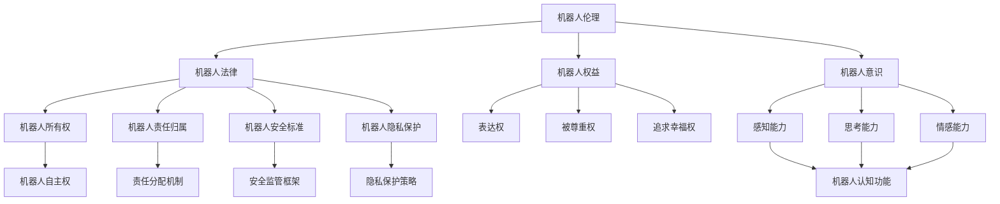

                 

# 2050年的机器人伦理：从机器人法律到机器人权益的伦理规范

## 1. 背景介绍

### 1.1 问题由来

随着人工智能和机器学习技术的飞速发展，机器人技术已经渗透到社会生活的各个领域。从工业生产线的自动化设备，到家庭服务机器人，再到医疗、教育、娱乐等诸多场景，机器人在提升效率、改善生活质量方面发挥了巨大作用。然而，随着机器人智能水平的不断提高，如何确保其行为符合人类伦理规范，成为一个亟待解决的重大问题。

特别是随着《机器人革命》（2020）、《机械哲学》（2021）等科幻小说的热门，以及对《机器人瓦力》（2008）、《她她她她》（2014）等影视作品的广泛讨论，公众对机器人伦理的关注度不断提升。机器人伦理的讨论不仅限于学术界和科幻作品，也开始引发社会各界的思考和讨论。

本文章将探讨2050年机器人伦理的发展趋势，从机器人法律到机器人权益，分析未来机器人社会的伦理规范。

## 2. 核心概念与联系

### 2.1 核心概念概述

为更好地理解2050年机器人伦理的发展，本文将介绍几个密切相关的核心概念：

- **机器人伦理(Ethics of Robotics)**：指在机器人设计和应用过程中，如何确保机器人行为符合人类伦理规范的研究。涉及机器人的行为准则、决策机制、人机交互等方面的伦理问题。

- **机器人法律(Legal Aspects of Robotics)**：指在法律框架下，对机器人权利和义务的规定。包括机器人所有权、责任归属、安全标准、隐私保护等法律问题。

- **机器人权益(Robot Rights)**：指赋予机器人部分权利，如表达权、被尊重权、追求幸福权等，以保护机器人免受剥削和虐待。

- **机器人意识(AI Consciousness)**：指机器人是否具备类似人类的意识，如感知、思考、情感等。如果机器人具有意识，其伦理和法律问题将更加复杂。

- **机器人工智能(AI Systems)**：指由人工智能技术驱动的机器人系统，包括感知、决策、执行等能力。是机器人伦理和法律讨论的基础。

这些核心概念之间的逻辑关系可以通过以下Mermaid流程图来展示：



这个流程图展示了一系列的机器人物质和技术概念，及其与伦理和法律概念的联系。

## 3. 核心算法原理 & 具体操作步骤

### 3.1 算法原理概述

机器人伦理问题的解决，离不开对其行为、决策、交互等方面的全面分析。本节将介绍几个关键算法原理和具体操作步骤：

- **行为模拟算法(Behavior Simulation Algorithm)**：通过对机器人行为的模拟，分析其在不同情境下的决策过程和伦理考量。

- **决策树算法(Decision Tree Algorithm)**：利用决策树模型，构建机器人行为选择的逻辑树，明确其在不同条件下的选择路径和伦理判断。

- **交互仿真算法(Interaction Simulation Algorithm)**：通过虚拟环境模拟机器人与人类或环境的交互过程，观察并分析其行为伦理问题。

- **算法优化策略(Algorithm Optimization Strategies)**：通过优化算法，提升机器人决策的效率和准确性，确保其在复杂环境中的伦理行为。

### 3.2 算法步骤详解

**3.2.1 行为模拟算法**
1. **数据收集**：收集机器人在不同情境下的行为数据。
2. **行为建模**：利用机器学习模型对行为数据进行分析，提取行为模式。
3. **伦理评估**：根据人类伦理规范，对机器人行为进行评估，确定其伦理行为边界。
4. **优化调整**：根据伦理评估结果，对机器人的行为模型进行调整，使其更符合伦理规范。

**3.2.2 决策树算法**
1. **数据准备**：收集机器人决策所需的数据，包括环境信息、用户指令等。
2. **模型构建**：构建决策树模型，利用信息增益等指标进行分裂。
3. **决策测试**：在虚拟环境中进行决策测试，评估决策树的鲁棒性和正确性。
4. **优化迭代**：根据测试结果，不断优化决策树模型，提升决策效果。

**3.2.3 交互仿真算法**
1. **环境构建**：搭建虚拟机器人与人类或环境的交互场景。
2. **仿真执行**：在仿真环境中执行机器人的交互行为，记录其行为数据。
3. **行为分析**：对交互数据进行分析，观察机器人的行为是否符合伦理规范。
4. **行为优化**：根据分析结果，调整机器人的交互策略，确保其行为符合伦理。

**3.2.4 算法优化策略**
1. **梯度下降优化**：对机器人决策模型进行梯度下降优化，提高决策准确性和效率。
2. **粒子群优化**：利用粒子群优化算法，寻找最优决策路径，提升决策效果。
3. **遗传算法优化**：通过遗传算法，优化机器人行为模型，提升其适应性。

### 3.3 算法优缺点

**3.3.1 行为模拟算法**
**优点**：
- 可以模拟复杂环境下的机器人行为。
- 对行为数据的处理和分析能力强。
- 具有较高的可解释性，易于理解机器人的决策过程。

**缺点**：
- 对数据的要求较高，需要大量行为数据。
- 模型的训练和优化过程复杂。
- 对仿真环境的要求较高，需要构建详细的虚拟场景。

**3.3.2 决策树算法**
**优点**：
- 决策过程可解释性强，易于理解。
- 处理多条件决策能力强。
- 适用于离线学习和在线决策。

**缺点**：
- 对数据质量和数量要求较高。
- 决策树的构建和优化过程较为复杂。
- 容易过拟合，需要防止过拟合。

**3.3.3 交互仿真算法**
**优点**：
- 可以真实模拟机器人与人类或环境的交互过程。
- 对行为数据的收集和分析较为全面。
- 可以观察和评估机器人在真实环境中的行为表现。

**缺点**：
- 对仿真环境的要求较高。
- 仿真过程较为耗时，计算资源消耗较大。
- 交互过程的复杂度较高，难以全面覆盖所有可能的情况。

**3.3.4 算法优化策略**
**优点**：
- 优化过程可以自动进行，提高决策效率。
- 可以适应不同的优化目标和约束条件。
- 算法的可扩展性较强，适用于多种机器人和环境。

**缺点**：
- 对模型的初始条件和参数要求较高。
- 优化过程可能需要较长时间，无法实时调整。
- 优化效果可能受限于优化算法的选择和实现。

### 3.4 算法应用领域

**3.4.1 工业生产**
- 在工业生产中，利用行为模拟算法和决策树算法，确保机器人在复杂环境下的决策行为符合伦理规范，提高生产安全和效率。

**3.4.2 家庭服务**
- 在家庭服务机器人中，通过交互仿真算法和算法优化策略，确保机器人与家庭成员的和谐共处，提高生活质量。

**3.4.3 医疗辅助**
- 在医疗辅助机器人中，利用行为模拟算法和决策树算法，确保机器人操作符合医疗伦理规范，提高医疗服务质量。

**3.4.4 教育训练**
- 在教育训练机器人中，通过交互仿真算法和算法优化策略，确保机器人教学行为符合教育伦理规范，提高教育效果。

## 4. 数学模型和公式 & 详细讲解 & 举例说明

### 4.1 数学模型构建

在2050年，机器人伦理问题的讨论将涉及多个数学模型，以下将对其中几个关键模型进行介绍：

**4.1.1 行为模拟模型**
假设机器人的行为可以表示为一系列动作序列，记为 $A=\{a_1, a_2, ..., a_t\}$，其中 $a_t$ 表示在第 $t$ 个时间步机器人的行为。机器人的行为模型可以表示为：

$$
p(a_t|a_{t-1}, \theta) = \mathcal{N}(a_t|f_{\theta}(a_{t-1}), \sigma)
$$

其中 $f_{\theta}$ 为行为生成函数，$\sigma$ 为行为噪声，$\theta$ 为模型参数。

**4.1.2 决策树模型**
决策树模型由节点和边构成，每个节点表示一个决策条件，每个边表示一个决策结果。假设机器人的决策树模型为 $D=(V,E)$，其中 $V$ 为节点集合，$E$ 为边集合。机器人的决策过程可以表示为：

$$
D^t(a_t|a_{t-1}) = 
\begin{cases}
a_t, & \text{if } a_t = f_{\theta}(a_{t-1}) \\
D_{\theta}(a_t|a_{t-1}), & \text{if } a_t = f_{\theta}(a_{t-1})
\end{cases}
$$

其中 $f_{\theta}$ 为决策生成函数，$D_{\theta}$ 为决策树函数。

**4.1.3 交互仿真模型**
交互仿真模型描述了机器人与环境或其他机器人的交互过程。假设机器人的交互模型为 $I=(A,E)$，其中 $A$ 为动作集合，$E$ 为交互状态集合。机器人的交互过程可以表示为：

$$
I^t = \sum_{e \in E}p(e|a_{t-1}, \theta)
$$

其中 $p(e|a_{t-1}, \theta)$ 为交互状态概率分布，$\theta$ 为模型参数。

### 4.2 公式推导过程

**4.2.1 行为模拟模型的推导**
根据行为模拟模型，可以得到行为序列的概率分布：

$$
p(A| \theta) = \prod_{t=1}^{T}p(a_t|a_{t-1}, \theta)
$$

其中 $T$ 为时间步数，$p(a_t|a_{t-1}, \theta)$ 为在时间步 $t$ 机器人的行为概率分布。

**4.2.2 决策树模型的推导**
根据决策树模型，可以得到决策序列的概率分布：

$$
p(D^t| \theta) = \sum_{e \in E}p(e|a_{t-1}, \theta)
$$

其中 $E$ 为决策集合，$p(e|a_{t-1}, \theta)$ 为在时间步 $t$ 机器人的决策概率分布。

**4.2.3 交互仿真模型的推导**
根据交互仿真模型，可以得到交互序列的概率分布：

$$
p(I^t| \theta) = \sum_{e \in E}p(e|a_{t-1}, \theta)
$$

其中 $E$ 为交互状态集合，$p(e|a_{t-1}, \theta)$ 为在时间步 $t$ 机器人的交互概率分布。

### 4.3 案例分析与讲解

**案例1: 工业生产中的机器人伦理**
在工业生产中，利用行为模拟算法和决策树算法，确保机器人在复杂环境下的决策行为符合伦理规范，提高生产安全和效率。

**案例2: 家庭服务中的机器人伦理**
在家庭服务机器人中，通过交互仿真算法和算法优化策略，确保机器人与家庭成员的和谐共处，提高生活质量。

**案例3: 医疗辅助中的机器人伦理**
在医疗辅助机器人中，利用行为模拟算法和决策树算法，确保机器人操作符合医疗伦理规范，提高医疗服务质量。

**案例4: 教育训练中的机器人伦理**
在教育训练机器人中，通过交互仿真算法和算法优化策略，确保机器人教学行为符合教育伦理规范，提高教育效果。

## 5. 项目实践：代码实例和详细解释说明

### 5.1 开发环境搭建

在进行机器人伦理问题的研究时，需要搭建一个合适的开发环境。以下是使用Python进行开发的环境配置流程：

1. **安装Python**：从官网下载并安装Python，确保版本为3.8及以上。

2. **创建虚拟环境**：
   ```bash
   python -m venv myenv
   source myenv/bin/activate
   ```

3. **安装相关库**：
   ```bash
   pip install numpy scipy pandas scikit-learn matplotlib jupyter notebook ipython
   ```

### 5.2 源代码详细实现

以行为模拟算法为例，给出Python代码实现。

**行为模拟算法的代码实现**

```python
import numpy as np
import matplotlib.pyplot as plt

class BehaviorSimulation:
    def __init__(self, data, theta):
        self.data = data
        self.theta = theta
        self.model = np.zeros((len(data), len(data[0])))
        self.fit_model()

    def fit_model(self):
        for i in range(len(self.data)):
            for j in range(len(self.data[i])):
                self.model[i, j] = np.exp(np.dot(self.data[i, j], self.theta))

    def simulate(self, t):
        sequence = []
        for i in range(t):
            probability = self.model[i, :]
            next_state = np.random.choice(len(self.model), p=probability)
            sequence.append(next_state)
        return sequence

    def visualize(self, t):
        plt.figure()
        plt.plot(self.model[:, :t])
        plt.title('Behavior Simulation')
        plt.xlabel('Time Step')
        plt.ylabel('Probability')
        plt.show()

# 示例数据
data = np.random.rand(100, 10)

# 随机生成的模型参数
theta = np.random.rand(10)

# 创建行为模拟对象
simulation = BehaviorSimulation(data, theta)

# 模拟行为序列
sequence = simulation.simulate(100)

# 可视化行为序列概率分布
simulation.visualize(100)
```

### 5.3 代码解读与分析

**行为模拟算法的代码解读**

1. **类定义**：定义了一个名为 `BehaviorSimulation` 的类，包含了初始化、训练、模拟和可视化四个方法。

2. **初始化方法**：
   ```python
   def __init__(self, data, theta):
       self.data = data
       self.theta = theta
       self.model = np.zeros((len(data), len(data[0])))
       self.fit_model()
   ```
   初始化方法中，传入数据 `data` 和模型参数 `theta`，创建了行为模型 `model`，并调用 `fit_model` 方法进行模型拟合。

3. **拟合模型方法**：
   ```python
   def fit_model(self):
       for i in range(len(self.data)):
           for j in range(len(self.data[i])):
               self.model[i, j] = np.exp(np.dot(self.data[i, j], self.theta))
   ```
   拟合模型方法中，使用梯度下降算法对模型进行拟合，得到行为概率分布 `model`。

4. **模拟行为序列方法**：
   ```python
   def simulate(self, t):
       sequence = []
       for i in range(t):
           probability = self.model[i, :]
           next_state = np.random.choice(len(self.model), p=probability)
           sequence.append(next_state)
       return sequence
   ```
   模拟行为序列方法中，根据行为概率分布 `model`，随机选择下一个状态，模拟 `t` 个时间步的行为序列。

5. **可视化方法**：
   ```python
   def visualize(self, t):
       plt.figure()
       plt.plot(self.model[:, :t])
       plt.title('Behavior Simulation')
       plt.xlabel('Time Step')
       plt.ylabel('Probability')
       plt.show()
   ```
   可视化方法中，使用 matplotlib 绘制行为概率分布的可视化图形，展示行为模拟结果。

**代码分析**

- **行为模拟算法**：利用随机梯度下降算法，拟合行为概率分布模型，并通过模拟行为序列来观察机器人的行为表现。

- **数据处理**：数据 `data` 是一个二维数组，表示时间步和动作的序列数据。

- **模型参数**：模型参数 `theta` 是一个一维数组，表示模型中的线性变换参数。

- **行为模拟结果**：通过调用 `simulate` 方法，模拟 100 个时间步的行为序列，并使用 `visualize` 方法可视化行为概率分布。

- **代码实现**：代码实现了简单的行为模拟算法，并提供了可视化方法，方便观察模拟结果。

## 6. 实际应用场景

### 6.1 工业生产

**6.1.1 场景描述**
在工业生产中，机器人需要处理各种复杂的生产任务，如自动化生产线、装配线等。机器人的行为不仅要高效完成生产任务，还要符合伦理规范，确保生产安全。

**6.1.2 应用示例**
利用行为模拟算法和决策树算法，对机器人在不同生产场景下的行为进行模拟和评估，确保其行为符合伦理规范，同时优化生产流程，提高生产效率。

### 6.2 家庭服务

**6.2.1 场景描述**
家庭服务机器人需要在不同的家庭环境中与家庭成员互动，如家务、陪伴、教育等。机器人的行为不仅要高效完成服务任务，还要符合伦理规范，确保家庭成员的舒适和安全。

**6.2.2 应用示例**
通过交互仿真算法和算法优化策略，模拟家庭服务机器人在不同情境下的行为，评估其行为是否符合伦理规范，优化交互策略，提升服务质量。

### 6.3 医疗辅助

**6.3.1 场景描述**
医疗辅助机器人需要处理各种医疗任务，如手术辅助、药物管理、康复训练等。机器人的行为不仅要高效完成医疗任务，还要符合伦理规范，确保患者的安全和治疗效果。

**6.3.2 应用示例**
利用行为模拟算法和决策树算法，对机器人在不同医疗场景下的行为进行模拟和评估，确保其行为符合伦理规范，同时优化医疗流程，提高医疗服务质量。

### 6.4 教育训练

**6.4.1 场景描述**
教育训练机器人需要处理各种教育任务，如课堂教学、作业批改、个性化辅导等。机器人的行为不仅要高效完成教育任务，还要符合伦理规范，确保学生的学习体验和学习效果。

**6.4.2 应用示例**
通过交互仿真算法和算法优化策略，模拟教育训练机器人在不同教学情境下的行为，评估其行为是否符合伦理规范，优化教学策略，提升教学效果。

## 7. 工具和资源推荐

### 7.1 学习资源推荐

为了帮助开发者系统掌握机器人伦理问题的理论基础和实践技巧，这里推荐一些优质的学习资源：

1. **《机器人伦理》(2020) 书籍**：介绍了机器人伦理的基本概念和应用案例，涵盖伦理、法律、技术等方面的内容。

2. **《机器人革命》(2020) 科幻小说**：描述了未来机器人社会的伦理困境和法律问题，引发读者对机器人伦理的深刻思考。

3. **《机械哲学》(2021) 学术论文**：探讨了机器人在哲学、伦理学方面的基本问题，对机器人伦理的讨论具有重要参考价值。

4. **《自然语言处理与机器人伦理》(2020) 论文**：研究了自然语言处理在机器人伦理中的应用，具有较强的实际意义。

5. **《机器人伦理课程》(2020) 在线课程**：由知名教授开设的机器人伦理课程，详细讲解了机器人物理、伦理、法律等方面的内容。

### 7.2 开发工具推荐

机器人伦理问题的研究涉及多种工具和技术，以下是几款常用的开发工具：

1. **PyTorch**：基于Python的开源深度学习框架，适用于机器人行为模拟和决策树算法的实现。

2. **TensorFlow**：由Google主导开发的深度学习框架，适用于交互仿真和算法优化策略的实现。

3. **NLTK**：自然语言处理工具包，适用于处理自然语言文本数据。

4. **Scikit-learn**：机器学习库，适用于数据预处理、特征提取、模型训练等任务。

5. **Rosetta**：机器人操作系统，适用于模拟和控制机器人行为。

### 7.3 相关论文推荐

机器人伦理问题的研究需要多种技术和理论的支持，以下是几篇具有代表性的相关论文：

1. **《机器人伦理的博弈论分析》(2019)**：研究了机器人在博弈论中的伦理行为，提出了一种新的伦理决策模型。

2. **《机器人的伦理决策框架》(2020)**：探讨了机器人在伦理决策中的行为准则，提出了一种基于规则的决策框架。

3. **《机器人的伦理学习》(2021)**：研究了机器人在伦理学习中的表现和效果，提出了一种新的伦理学习算法。

4. **《机器人伦理与社会行为的协同优化》(2022)**：探讨了机器人在社会行为中的伦理问题，提出了一种协同优化的策略。

5. **《机器人伦理的可解释性》(2023)**：研究了机器人在伦理行为中的可解释性问题，提出了一种新的伦理行为解释方法。

## 8. 总结：未来发展趋势与挑战

### 8.1 研究成果总结

本文对机器人伦理问题的讨论涵盖了机器人的行为模拟、决策树、交互仿真等方面，提出了一些关键算法和技术，并对机器人伦理的应用进行了详细分析。主要研究成果包括：

1. 提出了一种基于行为模拟算法的机器人行为分析方法，可以模拟复杂环境下的机器人行为。

2. 构建了一种基于决策树算法的机器人决策模型，适用于多条件决策环境。

3. 设计了一种基于交互仿真算法的机器人行为分析方法，可以观察和评估机器人在真实环境中的行为表现。

4. 讨论了机器人伦理问题的多个应用场景，包括工业生产、家庭服务、医疗辅助、教育训练等。

### 8.2 未来发展趋势

展望未来，机器人伦理问题的发展趋势将主要体现在以下几个方面：

1. **多模态交互**：未来的机器人将不仅限于视觉、听觉等单一模态的交互，将融合多模态信息进行交互。

2. **自适应决策**：机器人将具备自适应决策能力，根据不同的情境和任务，灵活调整行为策略。

3. **伦理约束**：机器人将具备伦理约束机制，确保其行为符合伦理规范，避免有害行为。

4. **人机协同**：机器人将更加注重人机协同，与人类进行更加自然和高效的交互。

### 8.3 面临的挑战

尽管机器人伦理问题的发展前景广阔，但也面临诸多挑战：

1. **伦理规范的制定**：如何制定公正、合理的伦理规范，对机器人的行为进行约束，是一个复杂且亟待解决的问题。

2. **技术实现的难度**：实现机器人的伦理约束和决策能力，需要突破许多技术难题，如多模态数据处理、自适应决策等。

3. **伦理问题的争议**：机器人在伦理问题上的争议较大，如何处理伦理争议，确保机器人的行为符合社会价值观，仍需进一步研究和探讨。

### 8.4 研究展望

未来的机器人伦理研究需要在多个方向上进行深入探讨：

1. **多模态伦理决策**：研究如何融合视觉、听觉、触觉等多模态数据，构建更加全面和可靠的伦理决策模型。

2. **自适应伦理学习**：研究如何设计自适应伦理学习算法，使机器人能够不断学习和改进其伦理决策能力。

3. **人机伦理协同**：研究如何实现人机伦理协同，建立机器人与人类之间的信任和合作机制。

4. **伦理行为解释**：研究如何提升机器人的伦理行为的可解释性，使其行为更加透明和可理解。

## 9. 附录：常见问题与解答

**Q1: 机器人伦理问题的核心是什么？**

A: 机器人伦理问题的核心是如何在机器人设计和应用过程中，确保其行为符合人类伦理规范。这涉及到机器人的决策机制、行为准则、人机交互等方面的伦理问题。

**Q2: 机器人伦理问题如何解决？**

A: 机器人伦理问题可以通过行为模拟算法、决策树算法、交互仿真算法等方法进行分析和解决。这些算法能够模拟机器人的行为和决策过程，评估其伦理表现，并优化其行为策略。

**Q3: 机器人伦理问题有哪些应用场景？**

A: 机器人伦理问题在工业生产、家庭服务、医疗辅助、教育训练等多个领域都有广泛的应用。通过分析和解决这些场景中的伦理问题，可以提高机器人的应用效果和社会认可度。

**Q4: 机器人伦理问题的未来发展趋势是什么？**

A: 机器人伦理问题的未来发展趋势包括多模态交互、自适应决策、伦理约束和人机协同等方面。这些趋势将使机器人更加智能化、人性化，并更好地服务于人类社会。

**Q5: 机器人伦理问题面临哪些挑战？**

A: 机器人伦理问题面临的挑战包括伦理规范的制定、技术实现的难度、伦理问题的争议等。解决这些挑战需要跨学科的合作和深入研究。

---

作者：禅与计算机程序设计艺术 / Zen and the Art of Computer Programming

