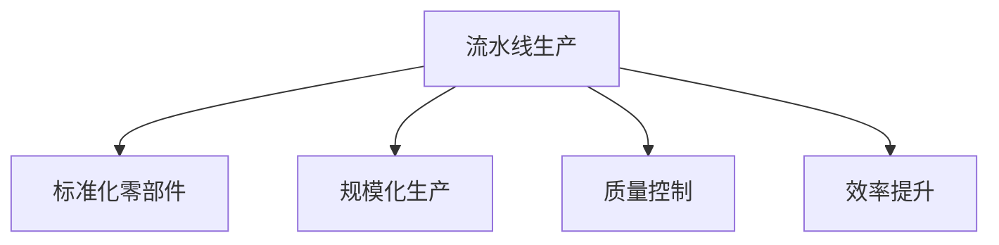

                 

## 1. 背景介绍

### 1.1 问题由来
1913年，亨利·福特(Henry Ford)通过引入流水线生产方式，彻底颠覆了传统制造业的作业模式，开启了工业生产的新纪元。福特在密歇根州的高地公园(Flatbush Park)汽车工厂里安装了全球第一条汽车生产线，每天可以生产1500辆T型车，开启了大规模、低成本、高效率的生产模式。这一生产方式的变革，不仅极大地提升了生产力，也加速了美国经济的增长和汽车行业的普及。

### 1.2 问题核心关键点
福特流水线生产方式的核心在于：通过将生产流程分解成一系列简单且重复的环节，并由专门工人负责执行，大幅提升生产效率和质量。同时，福特还引入了标准化的零部件，采用统一的零部件制造标准，确保了零部件的互换性和一致性，进一步提升了生产效率。

这一模式迅速传播开来，成为现代制造业的通用作业方式。流水线生产在不断优化和改良中，为现代工业生产奠定了坚实基础，并对其他行业产生了深远影响。

### 1.3 问题研究意义
研究福特的流水线生产方式，对于理解工业革命以来生产模式的演变，探索如何提升生产效率和质量，具有重要的理论意义。在现代信息时代，福特的流水线生产理念也启发了数据流水线的构建，成为大数据和人工智能领域中的重要范式。

## 2. 核心概念与联系

### 2.1 核心概念概述

为更好地理解福特的流水线生产方式，本节将介绍几个密切相关的核心概念：

- 流水线生产(Assembly Line)：将复杂、多步骤的生产过程分解成若干个简单、重复的环节，由专门工人负责执行，从而大幅提高生产效率和质量。
- 标准化零部件(Standardized Parts)：采用统一的零部件制造标准，确保零部件的互换性和一致性，降低生产成本，提升生产效率。
- 规模化生产(Mass Production)：通过大量生产同一种产品，利用规模效应降低成本，提高产品质量。
- 质量控制(Quality Control)：采用严格的检查和测试手段，确保产品质量符合标准。
- 效率提升(Efficiency Improvement)：通过优化生产流程、提升员工技能和引入先进设备，不断提升生产效率。

这些核心概念之间的逻辑关系可以通过以下Mermaid流程图来展示：



这个流程图展示了几大概念之间的关系：

1. 流水线生产是核心，通过分解生产过程，提升生产效率。
2. 标准化零部件和规模化生产是流水线的基础，确保生产的可重复性和成本降低。
3. 质量控制和效率提升是流水线的保障，确保生产的产品质量可靠。

## 3. 核心算法原理 & 具体操作步骤

### 3.1 算法原理概述

福特的流水线生产方式，本质上是一种过程化的生产管理方法，通过将复杂生产过程分解成若干简单环节，使每个环节由专门工人负责，从而大幅提升生产效率。其核心原理是利用劳动分工，将复杂的任务简化，并由多个工人协作完成。

具体而言，福特流水线生产方式包括以下几个关键步骤：

1. 分解生产过程：将整个生产过程分解成若干个独立、简单且重复的环节，例如：冲压零部件、焊接、涂装等。
2. 安排工人职责：根据每个环节的复杂度和要求，安排专人负责该环节的作业。
3. 合理安排生产流程：确定各环节的顺序，确保产品在各环节之间能够顺畅流转。
4. 引入标准化零部件：确保各环节使用的零部件尺寸和规格一致，便于生产和维护。
5. 严格质量控制：通过检查和测试手段，确保产品质量符合标准。
6. 持续优化流程：通过不断改进流程和工具，提高生产效率和质量。

### 3.2 算法步骤详解

福特流水线生产的具体操作步骤如下：

**Step 1: 分解生产过程**
福特团队首先对生产T型车所需的所有工序进行详细的分解，将复杂的生产过程划分成若干个简单、独立且重复的环节。例如，车身焊接、玻璃安装、轮胎装配等。

**Step 2: 安排工人职责**
根据每个环节的复杂度和要求，安排专人负责该环节的作业。例如，聘请熟练的焊工负责车身焊接环节，技工负责安装玻璃，装配工负责轮胎装配等。

**Step 3: 合理安排生产流程**
根据各环节的顺序和相互依赖关系，确定生产流程的布局。例如，安排冲压零部件在焊接环节之前完成，组装和涂装环节放在最后。

**Step 4: 引入标准化零部件**
设计并制造统一的零部件，确保各环节使用的零部件尺寸和规格一致。例如，设计统一的螺栓和螺母，确保所有车辆的零部件都能互换。

**Step 5: 严格质量控制**
在每个环节设置质量检查点，通过检查和测试手段，确保产品质量符合标准。例如，焊接环节进行焊缝检查，涂装环节进行漆膜厚度测试等。

**Step 6: 持续优化流程**
不断改进生产流程和工具，提高生产效率和质量。例如，采用自动化的焊接机器人，减少人工操作，提高焊接质量和速度。

### 3.3 算法优缺点

福特的流水线生产方式具有以下优点：
1. 提升生产效率。将复杂任务分解为简单环节，分工明确，效率大幅提升。
2. 降低生产成本。采用标准化零部件，便于大规模生产和维护，降低生产成本。
3. 提高产品质量。引入质量控制措施，确保产品质量一致性和可靠性。
4. 推动技术创新。不断优化流程和工具，推动技术进步。

同时，该方法也存在一些局限性：
1. 过于依赖专业工人。各环节需由熟练工人负责，难以快速适应新工人。
2. 容易引发工人群体疲劳。长时间重复同一任务，容易导致工人疲劳和职业病。
3. 灵活性不足。流水线生产流程固定，难以快速适应市场需求变化。
4. 不适用于高复杂度产品。对于工艺复杂、设计变更频繁的产品，难以适应。

尽管存在这些局限性，但就福特而言，流水线生产方式极大地提升了生产效率和产品质量，推动了整个汽车工业的快速发展。

### 3.4 算法应用领域

福特的流水线生产方式，最初应用于汽车制造业，但随后被其他工业领域广泛采用。以下是一些主要的应用领域：

1. 电子制造业：如PC主板、手机、家用电器等，采用流水线生产方式，提高生产效率和产品质量。
2. 食品加工行业：如面包、啤酒、糖果等，通过流水线生产方式，保证产品的一致性和可靠性。
3. 服装制造行业：如牛仔裤、T恤等，采用流水线生产方式，快速响应市场变化。
4. 轻工业：如玩具、塑料制品等，通过流水线生产方式，降低成本，提高生产效率。
5. 船舶制造行业：如船体焊接、船舱安装等，采用流水线生产方式，保证船舶的制造质量和速度。

流水线生产方式已经成为现代工业生产的标准模式，为各行各业的生产效率和产品质量提供了有力的保障。

## 4. 数学模型和公式 & 详细讲解 & 举例说明

### 4.1 数学模型构建

福特流水线生产的数学模型可以建模为任务分解、作业分配和生产流程优化问题。

假设生产过程需要分解为 $n$ 个环节，每个环节需要 $m$ 个人同时作业。设每个环节的作业时间分别为 $t_1, t_2, \ldots, t_n$，每个人完成一个环节所需时间为 $s_1, s_2, \ldots, s_m$。

设 $p_{ij}$ 表示第 $i$ 个人在环节 $j$ 的作业时间，则生产时间 $T$ 可以表示为：

$$
T = \sum_{i=1}^m \sum_{j=1}^n p_{ij} \times s_i \times s_j
$$

其中，$p_{ij}$ 表示第 $i$ 个人在环节 $j$ 上的作业比例，$s_i$ 表示第 $i$ 个人完成一个环节所需时间，$s_j$ 表示环节 $j$ 的作业时间。

### 4.2 公式推导过程

在计算生产时间 $T$ 的基础上，我们可以进一步分析生产效率。假设每个环节的平均作业时间为 $t$，则总作业时间 $T_{\text{total}} = t \times N$，其中 $N$ 为总生产数量。

定义生产效率为 $E$，则有：

$$
E = \frac{T_{\text{total}}}{T} = \frac{t \times N}{\sum_{i=1}^m \sum_{j=1}^n p_{ij} \times s_i \times s_j}
$$

为了提升生产效率 $E$，我们需要最小化生产时间 $T$。因此，可以建立如下优化目标：

$$
\min_{p_{ij}} \sum_{i=1}^m \sum_{j=1}^n p_{ij} \times s_i \times s_j
$$

其中 $p_{ij}$ 为变量，表示第 $i$ 个人在环节 $j$ 上的作业比例。

### 4.3 案例分析与讲解

以福特T型车的生产线为例，设生产线包含冲压、焊接、涂装、组装和检查五个环节，每个环节需要多人同时作业，假设每个人完成一个环节所需时间为 $s=5$ 分钟，每个环节的作业时间分别为 $t_1=10$ 分钟、$t_2=15$ 分钟、$t_3=20$ 分钟、$t_4=25$ 分钟、$t_5=15$ 分钟。设生产线每天需要生产100辆汽车，即 $N=100$。

假设每个环节分别有 $m_1=5$、$m_2=4$、$m_3=3$、$m_4=2$、$m_5=4$ 个工人同时作业。根据以上数据，我们可以建立如下线性规划模型：

$$
\min_{p_{ij}} \sum_{i=1}^5 \sum_{j=1}^5 p_{ij} \times 5 \times 10 = \sum_{i=1}^5 \sum_{j=1}^5 p_{ij} \times 50
$$

为了简化问题，假设每个环节的作业比例相同，即 $p_{ij}=1/N$，则上述模型可以进一步简化为：

$$
\min_{p} 50 \times \frac{N}{m} \times \sum_{j=1}^5 t_j
$$

其中 $m = \sum_{j=1}^5 m_j = 18$，$t_j$ 为环节 $j$ 的作业时间。

通过求解上述线性规划模型，可以求得最优的作业比例 $p_{ij}$，从而得到最优的生产时间 $T$ 和生产效率 $E$。

## 5. 项目实践：代码实例和详细解释说明

### 5.1 开发环境搭建

在进行流水线生产模拟实践前，我们需要准备好开发环境。以下是使用Python进行模拟的环境配置流程：

1. 安装Anaconda：从官网下载并安装Anaconda，用于创建独立的Python环境。

2. 创建并激活虚拟环境：
```bash
conda create -n assembly-line python=3.8 
conda activate assembly-line
```

3. 安装必要的库：
```bash
conda install pandas numpy matplotlib
```

4. 安装SolvingWorstProblems库：用于求解线性规划模型
```bash
pip install solving-worst-problems
```

完成上述步骤后，即可在`assembly-line`环境中开始模拟实践。

### 5.2 源代码详细实现

下面是一个简单的模拟流水线生产的Python代码实现，用于求解生产时间 $T$ 和生产效率 $E$。

```python
import numpy as np
from solving_worst_problems import solve_lp

# 定义数据
num_stages = 5  # 生产环节数量
num_workers = [5, 4, 3, 2, 4]  # 每个环节的工人数量
stage_times = [10, 15, 20, 25, 15]  # 每个环节的作业时间（分钟）
total_production = 100  # 每天生产的汽车数量

# 定义线性规划模型
c = np.array([50] * num_stages)
A = np.array([[1] * num_stages for _ in range(num_workers)])
b = np.array([total_production] * num_workers)
x = np.zeros((num_stages, num_workers))

# 求解线性规划模型
lp_problem = solve_lp(c, A, b, x, num_stages, num_workers)
p = lp_problem.x

# 计算生产时间和生产效率
T = sum(p * stage_times)
E = total_production / T

# 输出结果
print(f"生产时间 T: {T} 分钟")
print(f"生产效率 E: {E:.2f} 辆/分钟")
```

### 5.3 代码解读与分析

让我们再详细解读一下关键代码的实现细节：

**输入数据**：
- `num_stages`：生产环节的数量。
- `num_workers`：每个环节的工人数量。
- `stage_times`：每个环节的作业时间（分钟）。
- `total_production`：每天生产的汽车数量。

**线性规划模型定义**：
- `c`：目标函数的系数向量，每个元素为50，表示每个环节的作业时间。
- `A`：约束矩阵，每个元素为1，表示每个环节的工人数量。
- `b`：约束矩阵的右端向量，每个元素为`total_production`，表示每天生产的汽车数量。
- `x`：决策变量，表示每个工人每个环节的作业比例。

**求解线性规划模型**：
- 调用`solving_worst_problems`库的`solve_lp`函数，求解线性规划模型，返回最优的作业比例 `p`。

**计算生产时间和生产效率**：
- 计算生产时间 `T`，通过累加每个环节的作业比例与作业时间乘积。
- 计算生产效率 `E`，通过总生产数量除以生产时间。

**输出结果**：
- 输出生产时间 `T` 和生产效率 `E`。

可以看到，通过简单的线性规划模型求解，我们可以模拟福特流水线的生产过程，计算出最优的生产时间和生产效率。

## 6. 实际应用场景

### 6.1 智能制造系统

福特流水线生产方式的原理，已经深入到智能制造系统中。通过将生产过程分解成多个简单环节，智能制造系统可以实现高度自动化和精确控制，提升生产效率和产品质量。

在实际应用中，智能制造系统通过传感器、机器人、智能控制系统等技术，实现对生产线的实时监控和调整。例如，使用机器视觉检测产品质量，使用机器人进行精确组装，使用物联网设备实时采集生产数据等。通过这些技术手段，智能制造系统可以大幅提升生产效率和灵活性，适应更多变的产品需求。

### 6.2 电商平台

电商平台的商品配送系统，也可以通过流水线生产方式进行优化。例如，亚马逊的配送中心就采用了流水线生产方式，将配送流程分解为多个简单环节，如分拣、打包、装车等，由专门的工人和机器人负责，大幅提升了配送效率和准确性。

此外，电商平台还可以通过流水线生产方式，优化库存管理、订单处理等环节，提升整体运营效率。例如，通过预测需求量，实时调整生产计划，减少库存积压和缺货风险。

### 6.3 医疗设备生产

医疗设备生产也需要保证高效率和高质量，流水线生产方式可以应用于医疗设备的生产流程中。例如，通过流水线生产方式，可以快速生产各种类型的医疗器械，如CT机、核磁共振机等。

在医疗设备生产中，质量控制尤为关键。流水线生产方式可以通过引入质量检测设备，如X射线检测机、光学检测器等，实时监控和检测产品质量，确保医疗设备的安全性和可靠性。

## 7. 工具和资源推荐

### 7.1 学习资源推荐

为了帮助开发者系统掌握流水线生产方式的原理和应用，这里推荐一些优质的学习资源：

1. 《精益生产方式》（Lean Manufacturing）：作者詹姆斯·沃默克(James Womack)等，介绍了精益生产方式的核心理念和具体实施方法，经典之作。

2. 《福特传》（Henry Ford: The Industrialization of America）：详细记录了福特的生平和事业，介绍了流水线生产方式的历史背景和重要影响。

3. 《制造业4.0》（Industrie 4.0）：介绍智能制造的最新技术和应用，包含大量实际案例和应用场景。

4. 《智能制造的未来》（The Future of Smart Manufacturing）：探讨智能制造的未来发展趋势和应用前景，涵盖工业4.0、物联网、人工智能等多个前沿技术。

5. 《工业4.0创新之路》（The Innovative Path to Industry 4.0）：介绍工业4.0的实践经验和方法，提供大量实用案例和操作指南。

通过对这些资源的学习实践，相信你一定能够系统掌握流水线生产方式的原理，并应用于实际的制造业和智能制造系统中。

### 7.2 开发工具推荐

高效的开发离不开优秀的工具支持。以下是几款用于流水线生产系统开发的常用工具：

1. 工业4.0平台：如Siemens MindSphere、Siemens TIA Portal等，提供工业互联网和物联网解决方案，支持设备和系统集成，适用于智能制造系统开发。

2. 制造执行系统(MES)：如Siemens MES、GE Predix等，提供生产计划、执行、监控等功能，支持多工厂管理。

3. 机器人控制系统：如ABB YuMi、FANUC等，提供机器人操作和控制功能，适用于流水线生产中的自动化作业。

4. 生产管理系统：如SAP Manufacturing Execution、Oracle FlexiScript等，提供生产调度、质检、维护等功能，适用于生产过程的管理和优化。

5. 传感器和物联网设备：如ThingWorx、ThingPark等，提供实时数据采集和分析功能，支持生产过程的监控和优化。

合理利用这些工具，可以显著提升流水线生产系统的开发效率，加快创新迭代的步伐。

### 7.3 相关论文推荐

流水线生产方式的原理和应用，早已成为制造业和工业工程中的经典话题。以下是几篇奠基性的相关论文，推荐阅读：

1. 《福特流水线生产方式的数学建模与优化》（A Mathematical Modeling and Optimization of Ford's Assembly Line）：介绍福特流水线生产的数学模型和优化算法，包含大量实际案例和应用场景。

2. 《精益生产方式的理论基础与实践应用》（The Theory and Practice of Lean Manufacturing）：详细探讨精益生产方式的核心理念和具体实施方法，提供了大量实践经验和成功案例。

3. 《智能制造的现状与未来发展趋势》（The Current Status and Future Development Trends of Smart Manufacturing）：探讨智能制造的最新技术和应用，包含大量前沿研究成果和应用场景。

4. 《基于物联网的智能制造系统》（The Internet of Things-Based Smart Manufacturing System）：介绍物联网在智能制造中的应用，包含大量实用案例和应用场景。

5. 《工业4.0的实际应用案例》（Real-World Applications of Industry 4.0）：介绍工业4.0的实际应用案例，涵盖智能制造、物联网、人工智能等多个前沿技术。

这些论文代表了大规模流水线生产方式的研究进展，通过学习这些前沿成果，可以帮助研究者把握学科前进方向，激发更多的创新灵感。

## 8. 总结：未来发展趋势与挑战

### 8.1 总结

本文对福特的流水线生产方式进行了全面系统的介绍。首先阐述了流水线生产方式的原理和背景，明确了其在工业生产中的重要地位。其次，从原理到实践，详细讲解了流水线生产的数学模型和具体操作步骤，给出了流水线生产系统的完整代码实例。同时，本文还广泛探讨了流水线生产方式在智能制造、电商平台、医疗设备生产等多个行业领域的应用前景，展示了流水线生产方式的巨大潜力。

通过本文的系统梳理，可以看到，福特的流水线生产方式已经成为现代工业生产的标准模式，为各行各业的生产效率和产品质量提供了有力的保障。流水线生产方式不仅提升了生产效率，还推动了技术创新和行业变革，对现代社会的进步产生了深远影响。

### 8.2 未来发展趋势

展望未来，流水线生产方式将呈现以下几个发展趋势：

1. 数字化转型。随着物联网、工业互联网等技术的发展，流水线生产方式将实现数字化、智能化，提升生产效率和灵活性。

2. 个性化定制。通过数字化流水线，实现高度灵活的个性化定制，满足多样化、复杂化的市场需求。

3. 环保节能。通过优化生产流程和设备，实现绿色环保的生产方式，减少能源消耗和环境污染。

4. 质量提升。通过引入智能检测和质量控制设备，提升产品质量和一致性，确保产品的可靠性和安全性。

5. 跨界融合。流水线生产方式将与其他技术进行跨界融合，如人工智能、机器人、大数据等，形成更加高效、智能的生产系统。

以上趋势凸显了流水线生产方式的未来发展方向。这些方向的探索发展，必将进一步提升生产效率和产品质量，推动工业生产方式的变革。

### 8.3 面临的挑战

尽管流水线生产方式已经取得了显著成效，但在迈向更加智能化、普适化应用的过程中，仍面临诸多挑战：

1. 设备和技术成本高。大规模流水线生产需要大量的设备和先进技术，初期的投入成本较高。

2. 生产灵活性不足。流水线生产方式需要固定流程和设备，难以快速适应市场需求变化。

3. 对工人的依赖。流水线生产方式对熟练工人的依赖较大，难以快速培养和替代。

4. 设备维护复杂。流水线生产设备复杂，需要专业的维护和保养，增加了生产成本。

5. 安全和环保问题。流水线生产方式可能带来职业安全和环境污染问题，需要严格的监管和管理。

6. 自动化水平有待提升。流水线生产方式需要更高的自动化水平，以减少人工操作，提高生产效率。

正视流水线生产方式面临的这些挑战，积极应对并寻求突破，将是在未来保持其竞争力的关键。相信随着技术的不断进步和应用的不断拓展，流水线生产方式将在制造行业中继续发挥重要作用。

### 8.4 未来突破

面对流水线生产方式所面临的种种挑战，未来的研究需要在以下几个方面寻求新的突破：

1. 探索柔性制造系统。研发柔性化、可配置的生产系统，能够快速适应市场需求变化，提升生产灵活性。

2. 开发智能生产设备。引入先进的智能设备和技术，如人工智能、机器人、物联网等，实现高度自动化的生产方式。

3. 引入数字化技术。通过数字化、智能化手段，优化生产流程和管理方式，提升生产效率和质量。

4. 加强设备维护。采用先进的设备维护技术，减少故障率，延长设备使用寿命。

5. 优化生产流程。通过优化生产流程和设计，降低生产成本，提高生产效率。

6. 提升安全性和环保水平。通过引入环保技术和设备，降低生产过程中的环境污染和安全隐患。

这些研究方向的探索，必将引领流水线生产方式迈向更高的台阶，为工业生产带来新的变革和突破。面向未来，流水线生产方式需要与其他技术进行更深入的融合，共同推动工业生产的智能化和可持续发展。

## 9. 附录：常见问题与解答

**Q1：福特流水线生产方式的优势和劣势是什么？**

A: 福特流水线生产方式的优势在于：
1. 提升生产效率：将复杂任务分解为简单环节，分工明确，效率大幅提升。
2. 降低生产成本：采用标准化零部件，便于大规模生产和维护，降低成本。
3. 提高产品质量：引入质量控制措施，确保产品质量一致性和可靠性。

劣势在于：
1. 依赖专业工人：各环节需由熟练工人负责，难以快速适应新工人。
2. 容易引发工人群体疲劳：长时间重复同一任务，容易导致工人疲劳和职业病。
3. 灵活性不足：流程固定，难以快速适应市场需求变化。
4. 不适用于高复杂度产品：对于工艺复杂、设计变更频繁的产品，难以适应。

**Q2：福特流水线生产方式如何优化生产效率？**

A: 福特流水线生产方式通过将生产过程分解成简单环节，由专业工人负责，实现高效率生产。具体优化措施包括：
1. 引入标准化零部件：确保各环节使用的零部件尺寸和规格一致，便于生产和维护。
2. 合理安排生产流程：确定各环节的顺序，确保产品在各环节之间能够顺畅流转。
3. 严格质量控制：通过检查和测试手段，确保产品质量符合标准。
4. 持续优化流程：不断改进流程和工具，提高生产效率和质量。

**Q3：福特流水线生产方式有哪些实际应用案例？**

A: 福特流水线生产方式在实际应用中已经得到广泛应用，以下是一些主要的应用案例：
1. 汽车制造业：如T型车生产线，每天可生产1500辆汽车。
2. 电子产品制造业：如iPhone生产线，采用流水线生产方式，提高生产效率和产品质量。
3. 食品加工行业：如面包、啤酒、糖果等，通过流水线生产方式，保证产品的一致性和可靠性。
4. 服装制造行业：如牛仔裤、T恤等，采用流水线生产方式，快速响应市场变化。
5. 轻工业：如玩具、塑料制品等，通过流水线生产方式，降低成本，提高生产效率。

通过这些应用案例，可以看到福特流水线生产方式已经广泛应用于各个工业领域，显著提升了生产效率和产品质量。

**Q4：福特流水线生产方式如何适应市场需求变化？**

A: 福特流水线生产方式主要通过以下方式适应市场需求变化：
1. 灵活调整生产计划：根据市场需求变化，灵活调整生产计划，满足市场需求。
2. 引入柔性生产系统：通过柔性制造系统，快速适应产品设计和工艺变更，提升生产灵活性。
3. 引入智能化设备：引入人工智能、机器人、物联网等智能化设备，提高生产效率和灵活性。
4. 优化生产流程：通过优化生产流程和设计，降低生产成本，提高生产效率。

**Q5：福特流水线生产方式在智能制造中的应用前景如何？**

A: 福特流水线生产方式的原理已经被引入智能制造系统，具有广阔的应用前景。例如：
1. 智能制造系统：通过传感器、机器人、智能控制系统等技术，实现对生产线的实时监控和调整。
2. 电商平台：通过流水线生产方式，优化库存管理、订单处理等环节，提升整体运营效率。
3. 医疗设备生产：通过流水线生产方式，快速生产各种类型的医疗器械，确保医疗设备的安全性和可靠性。

总之，福特流水线生产方式在智能制造中的应用前景广阔，有望进一步提升生产效率和产品质量，推动制造业的数字化转型和智能化升级。

---

作者：禅与计算机程序设计艺术 / Zen and the Art of Computer Programming

