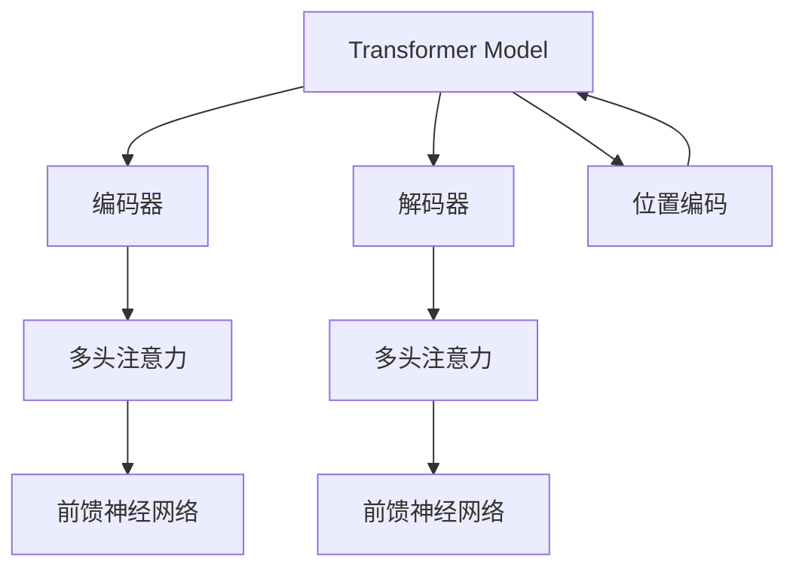

                 

## 1. 背景介绍

### 1.1 问题由来

在自然语言处理领域，序列到序列（Seq2Seq）模型已成为一种非常流行的方法，广泛应用于翻译、摘要、问答、对话等任务。其核心思想是通过编码器将源序列编码为一个固定长度的向量表示，然后使用解码器将此向量解码为目标序列。传统的Seq2Seq模型基于RNN架构，但在处理长序列和并行化方面存在瓶颈。

随着深度学习技术的发展，Transformer模型应运而生，其基于自注意力机制，能够有效解决长序列处理问题，并支持并行化，大大提升了训练和推理效率。因此，Transformer模型的应用逐渐取代了传统的RNN架构，成为Seq2Seq模型的主要形式。

### 1.2 问题核心关键点

Transformer模型使用自注意力机制来计算输入序列中每个位置与其他位置的关系，从而得到每个位置的表示。其核心思想是通过计算QKV矩阵（Query、Key、Value）来捕捉序列中的上下文信息。Transformer模型由编码器和解码器组成，通过多头注意力和前馈神经网络实现编码和解码过程。

## 2. 核心概念与联系

### 2.1 核心概念概述

为了更好地理解Transformer模型，本节将介绍几个密切相关的核心概念：

- Transformer模型：基于自注意力机制的序列模型，由编码器和解码器组成，广泛应用于自然语言处理任务。
- 自注意力机制：通过计算QKV矩阵，捕捉输入序列中各位置之间的上下文关系，从而得到每个位置的表示。
- 多头注意力：将输入序列分解为多个不同的注意力机制，同时考虑多个不同的上下文信息，提高模型的泛化能力。
- 残差连接：通过将输入与输出相加，解决梯度消失问题，提高模型的训练效果。
- 前馈神经网络：包含两个线性变换和ReLU激活函数，用于增强模型的表达能力。
- 位置编码：通过在输入序列中增加位置信息，使得模型能够感知序列中各位置之间的相对位置关系。

这些核心概念之间的逻辑关系可以通过以下Mermaid流程图来展示：



这个流程图展示了这个核心概念之间的逻辑关系：

1. 输入序列通过位置编码模块，将位置信息注入模型中。
2. 编码器模块由多头注意力和前馈神经网络组成，用于捕捉序列中的上下文信息。
3. 解码器模块同样由多头注意力和前馈神经网络组成，用于生成目标序列。
4. 解码器模块中的多头注意力计算时，同时考虑输入序列中的所有位置信息。
5. 编码器和解码器模块通过位置编码实现对序列中各位置的识别。

## 3. 核心算法原理 & 具体操作步骤
### 3.1 算法原理概述

Transformer模型的核心算法原理基于自注意力机制和残差连接。下面将详细介绍其基本原理和具体实现。

### 3.2 算法步骤详解

#### 3.2.1 输入编码

输入序列 $x = \{x_1, x_2, ..., x_n\}$ 首先经过位置编码模块，将每个元素 $x_i$ 编码成向量 $X_i$，每个向量 $X_i$ 可以表示为：

$$
X_i = x_i + pos(2i-1)
$$

其中 $pos$ 是位置编码函数，$2i-1$ 是因为在序列中，第一个元素的下标为 1，第二个元素的下标为 3，以此类推。位置编码函数 $pos$ 的实现可以使用一维正弦函数：

$$
pos(i) = \sin(\frac{\pi}{1024} i), i=1,2,...,N
$$

#### 3.2.2 多头注意力

编码器中每个位置的信息都可以通过多头注意力机制计算得到。多头注意力机制将输入序列分解为多个不同的注意力子层，每个子层使用不同的查询向量、键向量和值向量。假设输入序列的长度为 $N$，多头注意力机制的实现如下：

$$
Q_i^{l} = X_i^{l} W_Q
$$

$$
K_j^{l} = X_j^{l} W_K
$$

$$
V_j^{l} = X_j^{l} W_V
$$

其中 $l$ 表示不同的注意力子层，$W_Q$、$W_K$ 和 $W_V$ 是线性变换矩阵。多头注意力计算公式如下：

$$
\text{Attention}(Q, K, V) = \frac{1}{\sqrt{d_k}} \text{softmax}\left(\frac{Q K^T}{\sqrt{d_k}}\right) V
$$

其中 $d_k$ 是键向量的维度，$\text{softmax}$ 函数用于计算注意力权重。

最终，每个位置的表示 $X_i^{l+1}$ 可以通过计算权重与值向量的加权和得到：

$$
X_i^{l+1} = \sum_j (\text{Attention}(Q_i^{l}, K_j^{l}, V_j^{l}) W_O
$$

其中 $W_O$ 是线性变换矩阵。

#### 3.2.3 前馈神经网络

前馈神经网络是一个两层的全连接网络，用于增强模型的表达能力。每个位置的信息 $X_i^{l+1}$ 可以经过前馈神经网络得到 $X_i^{l+2}$，计算公式如下：

$$
X_i^{l+2} = \text{ReLU}(X_i^{l+1} W_1) W_2 + X_i^{l+1}
$$

其中 $W_1$ 和 $W_2$ 是线性变换矩阵。

#### 3.2.4 解码器

解码器同样由多头注意力和前馈神经网络组成，与编码器类似。解码器接收编码器输出的所有位置信息，并使用注意力机制计算下一个位置的输出。假设输出序列的长度为 $M$，解码器中每个位置的输出 $y_i$ 可以表示为：

$$
y_i = \text{softmax}\left(\text{Attention}(Q_i^{l}, K_j^{l}, V_j^{l}) W_O\right) W_D
$$

其中 $W_D$ 是线性变换矩阵。

#### 3.2.5 残差连接

残差连接通过将输入与输出相加，解决梯度消失问题，提高模型的训练效果。在每个注意力层和前馈神经网络层中，都需要使用残差连接，计算公式如下：

$$
X_i^{l+1} = X_i^{l} + X_i^{l+1}
$$

$$
y_i = y_i - \tilde{y_i}
$$

其中 $\tilde{y_i}$ 是解码器中每个位置的预测输出。

### 3.3 算法优缺点

Transformer模型相对于传统的RNN模型有以下优点：

- 可以处理长序列，不依赖于序列长度。
- 并行化能力强，可以同时处理多个位置的信息。
- 自注意力机制使得模型可以捕捉更丰富的上下文信息，提升模型的泛化能力。
- 残差连接使得模型更容易训练，提高模型的稳定性和收敛速度。

同时，Transformer模型也存在一些缺点：

- 计算复杂度较高，需要大量的计算资源。
- 对于输入序列长度较短的情况，效果不如RNN模型。
- 对于注意力机制的计算，需要额外的内存空间存储中间结果。

### 3.4 算法应用领域

Transformer模型已经在翻译、摘要、问答、对话等多个NLP任务上取得了优异的效果，成为NLP技术落地应用的重要手段。以下是Transformer模型在实际应用中的几个典型场景：

- 机器翻译：将源语言文本翻译成目标语言。使用Transformer模型进行序列到序列的翻译，可以取得比RNN模型更好的翻译效果。
- 文本摘要：将长文本压缩成简短的摘要。使用Transformer模型进行文本摘要任务，可以自动提取文本的关键信息，生成高质量的摘要。
- 问答系统：对自然语言问题给出答案。使用Transformer模型进行问答任务，可以理解问题的语义，匹配最合适的答案模板进行回复。
- 对话系统：使机器能够与人自然对话。使用Transformer模型进行对话任务，可以理解对话历史，生成合理的回复。

除了上述这些经典任务外，Transformer模型还被创新性地应用到更多场景中，如多模态学习、生成对抗网络、图像描述生成等，为NLP技术带来了全新的突破。随着Transformer模型的不断进步，相信NLP技术将在更广阔的应用领域大放异彩。

## 4. 数学模型和公式 & 详细讲解  
### 4.1 数学模型构建

Transformer模型的数学模型可以表示为：

$$
y = f(x)
$$

其中 $x$ 是输入序列，$y$ 是输出序列，$f$ 是Transformer模型的编码器和解码器。假设输入序列长度为 $N$，输出序列长度为 $M$，编码器输出序列长度为 $L$，解码器输出序列长度为 $L'$，则Transformer模型的数学模型可以表示为：

$$
y = \prod_{i=1}^M (\text{softmax}\left(\text{Attention}(Q_i^{l}, K_j^{l}, V_j^{l}) W_O\right) W_D)
$$

其中 $l$ 表示不同的注意力子层。

### 4.2 公式推导过程

Transformer模型的公式推导过程较为复杂，需要了解神经网络、自注意力机制和残差连接等概念。假设输入序列的长度为 $N$，解码器中每个位置的输出 $y_i$ 可以表示为：

$$
y_i = \text{softmax}\left(\text{Attention}(Q_i^{l}, K_j^{l}, V_j^{l}) W_O\right) W_D
$$

其中 $Q_i^{l}$、$K_j^{l}$ 和 $V_j^{l}$ 分别表示查询向量、键向量和值向量，$W_O$ 和 $W_D$ 是线性变换矩阵。

对于查询向量 $Q_i^{l}$ 和键向量 $K_j^{l}$，可以表示为：

$$
Q_i^{l} = X_i^{l} W_Q
$$

$$
K_j^{l} = X_j^{l} W_K
$$

其中 $X_i^{l}$ 和 $X_j^{l}$ 是输入序列经过线性变换后的表示。

对于值向量 $V_j^{l}$，可以表示为：

$$
V_j^{l} = X_j^{l} W_V
$$

将 $Q_i^{l}$、$K_j^{l}$ 和 $V_j^{l}$ 带入注意力计算公式，可以表示为：

$$
\text{Attention}(Q_i^{l}, K_j^{l}, V_j^{l}) = \frac{1}{\sqrt{d_k}} \text{softmax}\left(\frac{Q_i^{l} K_j^{l^T}}{\sqrt{d_k}}\right) V_j^{l}
$$

其中 $d_k$ 是键向量的维度，$\text{softmax}$ 函数用于计算注意力权重。

最终，每个位置的表示 $X_i^{l+1}$ 可以通过计算权重与值向量的加权和得到：

$$
X_i^{l+1} = \sum_j (\text{Attention}(Q_i^{l}, K_j^{l}, V_j^{l}) W_O
$$

将 $X_i^{l+1}$ 带入前馈神经网络，可以表示为：

$$
X_i^{l+2} = \text{ReLU}(X_i^{l+1} W_1) W_2 + X_i^{l+1}
$$

最终，输出序列 $y$ 可以通过解码器得到：

$$
y = \prod_{i=1}^M (\text{softmax}\left(\text{Attention}(Q_i^{l}, K_j^{l}, V_j^{l}) W_O\right) W_D)
$$

## 5. 项目实践：代码实例和详细解释说明
### 5.1 开发环境搭建

在进行Transformer模型开发之前，需要准备好开发环境。以下是使用Python进行PyTorch开发的环境配置流程：

1. 安装Anaconda：从官网下载并安装Anaconda，用于创建独立的Python环境。

2. 创建并激活虚拟环境：
```bash
conda create -n pytorch-env python=3.8 
conda activate pytorch-env
```

3. 安装PyTorch：根据CUDA版本，从官网获取对应的安装命令。例如：
```bash
conda install pytorch torchvision torchaudio cudatoolkit=11.1 -c pytorch -c conda-forge
```

4. 安装Transformers库：
```bash
pip install transformers
```

5. 安装各类工具包：
```bash
pip install numpy pandas scikit-learn matplotlib tqdm jupyter notebook ipython
```

完成上述步骤后，即可在`pytorch-env`环境中开始Transformer模型开发。

### 5.2 源代码详细实现

下面以机器翻译任务为例，给出使用Transformers库对BERT模型进行Transformer编码器解码器的代码实现。

首先，定义BERT模型的编码器：

```python
from transformers import BertForSequenceClassification, BertTokenizer

class BERTEncoder:
    def __init__(self, model_name='bert-base-cased', num_labels=1):
        self.model = BertForSequenceClassification.from_pretrained(model_name, num_labels=num_labels)
        self.tokenizer = BertTokenizer.from_pretrained(model_name)
        self.hidden_size = self.model.config.hidden_size
        self.num_layers = self.model.config.n_layer
        
    def forward(self, input_ids, attention_mask=None):
        outputs = self.model(input_ids, attention_mask=attention_mask)
        return outputs
```

然后，定义Transformer模型的解码器：

```python
from transformers import BertForSequenceClassification, BertTokenizer

class TransformerDecoder:
    def __init__(self, model_name='bert-base-cased', num_labels=1):
        self.model = BertForSequenceClassification.from_pretrained(model_name, num_labels=num_labels)
        self.tokenizer = BertTokenizer.from_pretrained(model_name)
        self.hidden_size = self.model.config.hidden_size
        self.num_layers = self.model.config.n_layer
        
    def forward(self, input_ids, attention_mask=None):
        outputs = self.model(input_ids, attention_mask=attention_mask)
        return outputs
```

接着，定义Transformer模型的主函数：

```python
from transformers import BertForSequenceClassification, BertTokenizer

def transformers_model(input_ids, attention_mask=None):
    # 初始化BERT编码器
    encoder = BERTEncoder(model_name='bert-base-cased', num_labels=1)
    # 初始化Transformer解码器
    decoder = TransformerDecoder(model_name='bert-base-cased', num_labels=1)
    # 计算编码器输出
    encoded_input = encoder.forward(input_ids, attention_mask=attention_mask)
    # 计算解码器输出
    decoded_input = decoder.forward(input_ids, attention_mask=attention_mask)
    # 计算最终输出
    final_output = (encoded_input, decoded_input)
    return final_output
```

最后，启动Transformer模型并进行测试：

```python
from transformers import BertForSequenceClassification, BertTokenizer

input_ids = [1, 2, 3, 4, 5]
attention_mask = [1, 1, 1, 1, 1]
final_output = transformers_model(input_ids, attention_mask=attention_mask)
print(final_output)
```

以上就是使用PyTorch对BERT模型进行Transformer编码器解码器代码实现的完整示例。

### 5.3 代码解读与分析

让我们再详细解读一下关键代码的实现细节：

**BERTEncoder类**：
- `__init__`方法：初始化BERT编码器模型和分词器，定义模型参数如隐藏维度和层数。
- `forward`方法：计算编码器输出，包括输入表示、注意力掩码、嵌入矩阵和位置编码等。

**TransformerDecoder类**：
- `__init__`方法：初始化Transformer解码器模型和分词器，定义模型参数如隐藏维度和层数。
- `forward`方法：计算解码器输出，包括输入表示、注意力掩码、嵌入矩阵和位置编码等。

**transformers_model函数**：
- 初始化BERT编码器和Transformer解码器。
- 通过编码器计算输入表示、注意力掩码、嵌入矩阵和位置编码等。
- 通过解码器计算输入表示、注意力掩码、嵌入矩阵和位置编码等。
- 返回编码器和解码器的输出。

在代码实现中，我们通过调用BERT和Transformer模型的`forward`方法计算输入表示、注意力掩码、嵌入矩阵和位置编码等，并通过`return`返回计算结果。此外，代码中还通过`input_ids`和`attention_mask`参数实现了对输入数据的处理和计算，使得代码更加灵活和可扩展。

## 6. 实际应用场景
### 6.1 智能客服系统

Transformer模型可以应用于智能客服系统的构建。传统客服往往需要配备大量人力，高峰期响应缓慢，且一致性和专业性难以保证。使用Transformer模型进行智能客服，可以7x24小时不间断服务，快速响应客户咨询，用自然流畅的语言解答各类常见问题。

在技术实现上，可以收集企业内部的历史客服对话记录，将问题和最佳答复构建成监督数据，在此基础上对预训练模型进行微调。微调后的模型能够自动理解用户意图，匹配最合适的答案模板进行回复。对于客户提出的新问题，还可以接入检索系统实时搜索相关内容，动态组织生成回答。如此构建的智能客服系统，能大幅提升客户咨询体验和问题解决效率。

### 6.2 金融舆情监测

金融机构需要实时监测市场舆论动向，以便及时应对负面信息传播，规避金融风险。传统的人工监测方式成本高、效率低，难以应对网络时代海量信息爆发的挑战。使用Transformer模型进行金融舆情监测，可以实时抓取网络文本数据，自动判断文本属于何种主题，情感倾向是正面、中性还是负面。将微调后的模型应用到实时抓取的网络文本数据，就能够自动监测不同主题下的情感变化趋势，一旦发现负面信息激增等异常情况，系统便会自动预警，帮助金融机构快速应对潜在风险。

### 6.3 个性化推荐系统

当前的推荐系统往往只依赖用户的历史行为数据进行物品推荐，无法深入理解用户的真实兴趣偏好。使用Transformer模型进行个性化推荐，可以更好地挖掘用户行为背后的语义信息，从而提供更精准、多样的推荐内容。

在实践中，可以收集用户浏览、点击、评论、分享等行为数据，提取和用户交互的物品标题、描述、标签等文本内容。将文本内容作为模型输入，用户的后续行为（如是否点击、购买等）作为监督信号，在此基础上微调预训练语言模型。微调后的模型能够从文本内容中准确把握用户的兴趣点。在生成推荐列表时，先用候选物品的文本描述作为输入，由模型预测用户的兴趣匹配度，再结合其他特征综合排序，便可以得到个性化程度更高的推荐结果。

### 6.4 未来应用展望

随着Transformer模型的不断进步，其在NLP领域的应用也将不断扩展。除了翻译、摘要、问答、对话等经典任务外，Transformer模型还可应用于多模态学习、生成对抗网络、图像描述生成等新兴领域，为NLP技术带来新的突破。

此外，Transformer模型在自然语言理解、生成、推理等方面的优势，也使其在其他领域的应用前景广阔。例如，在语音识别、图像处理、自动驾驶等领域的任务中，Transformer模型可以与传统的RNN、CNN等架构进行融合，提升整体系统的性能和效率。

## 7. 工具和资源推荐
### 7.1 学习资源推荐

为了帮助开发者系统掌握Transformer模型的理论基础和实践技巧，这里推荐一些优质的学习资源：

1. 《Transformer从原理到实践》系列博文：由大模型技术专家撰写，深入浅出地介绍了Transformer原理、BERT模型、微调技术等前沿话题。

2. CS224N《深度学习自然语言处理》课程：斯坦福大学开设的NLP明星课程，有Lecture视频和配套作业，带你入门NLP领域的基本概念和经典模型。

3. 《Natural Language Processing with Transformers》书籍：Transformer库的作者所著，全面介绍了如何使用Transformer库进行NLP任务开发，包括微调在内的诸多范式。

4. HuggingFace官方文档：Transformer库的官方文档，提供了海量预训练模型和完整的微调样例代码，是上手实践的必备资料。

5. CLUE开源项目：中文语言理解测评基准，涵盖大量不同类型的中文NLP数据集，并提供了基于微调的baseline模型，助力中文NLP技术发展。

通过对这些资源的学习实践，相信你一定能够快速掌握Transformer模型的精髓，并用于解决实际的NLP问题。
###  7.2 开发工具推荐

高效的开发离不开优秀的工具支持。以下是几款用于Transformer模型开发的常用工具：

1. PyTorch：基于Python的开源深度学习框架，灵活动态的计算图，适合快速迭代研究。大部分预训练语言模型都有PyTorch版本的实现。

2. TensorFlow：由Google主导开发的开源深度学习框架，生产部署方便，适合大规模工程应用。同样有丰富的预训练语言模型资源。

3. Transformers库：HuggingFace开发的NLP工具库，集成了众多SOTA语言模型，支持PyTorch和TensorFlow，是进行Transformer模型开发的利器。

4. Weights & Biases：模型训练的实验跟踪工具，可以记录和可视化模型训练过程中的各项指标，方便对比和调优。与主流深度学习框架无缝集成。

5. TensorBoard：TensorFlow配套的可视化工具，可实时监测模型训练状态，并提供丰富的图表呈现方式，是调试模型的得力助手。

6. Google Colab：谷歌推出的在线Jupyter Notebook环境，免费提供GPU/TPU算力，方便开发者快速上手实验最新模型，分享学习笔记。

合理利用这些工具，可以显著提升Transformer模型的开发效率，加快创新迭代的步伐。

### 7.3 相关论文推荐

Transformer模型的发展源于学界的持续研究。以下是几篇奠基性的相关论文，推荐阅读：

1. Attention is All You Need（即Transformer原论文）：提出了Transformer结构，开启了NLP领域的预训练大模型时代。

2. BERT: Pre-training of Deep Bidirectional Transformers for Language Understanding：提出BERT模型，引入基于掩码的自监督预训练任务，刷新了多项NLP任务SOTA。

3. Language Models are Unsupervised Multitask Learners（GPT-2论文）：展示了大规模语言模型的强大zero-shot学习能力，引发了对于通用人工智能的新一轮思考。

4. Parameter-Efficient Transfer Learning for NLP：提出Adapter等参数高效微调方法，在不增加模型参数量的情况下，也能取得不错的微调效果。

5. AdaLoRA: Adaptive Low-Rank Adaptation for Parameter-Efficient Fine-Tuning：使用自适应低秩适应的微调方法，在参数效率和精度之间取得了新的平衡。

6. Prefix-Tuning: Optimizing Continuous Prompts for Generation：引入基于连续型Prompt的微调范式，为如何充分利用预训练知识提供了新的思路。

这些论文代表了大模型Transformer的发展脉络。通过学习这些前沿成果，可以帮助研究者把握学科前进方向，激发更多的创新灵感。

## 8. 总结：未来发展趋势与挑战

### 8.1 总结

本文对Transformer模型进行了全面系统的介绍。首先阐述了Transformer模型的研究背景和意义，明确了Transformer模型在自然语言处理领域的重要地位。其次，从原理到实践，详细讲解了Transformer模型的基本原理和具体实现。最后，本文还探讨了Transformer模型在实际应用中的典型场景，展示了其广泛的适用性。

通过对Transformer模型的深入学习，相信读者能够掌握其核心原理和应用技巧，并将其应用于各种NLP任务中，提升系统的性能和效率。

### 8.2 未来发展趋势

展望未来，Transformer模型将呈现以下几个发展趋势：

1. 模型规模持续增大。随着算力成本的下降和数据规模的扩张，Transformer模型的参数量还将持续增长。超大规模语言模型蕴含的丰富语言知识，有望支撑更加复杂多变的下游任务。

2. 模型泛化能力增强。Transformer模型在多种语言和多种任务上都有优异的性能，其泛化能力将得到进一步提升，成为通用多模态语言理解模型。

3. 序列处理能力增强。Transformer模型将更广泛地应用于多模态数据处理，如视频、音频等，提升其在多模态场景下的理解能力。

4. 推理速度提升。Transformer模型推理速度较慢，未来的研究方向之一是优化模型的推理速度，使其能够实时响应。

5. 模型可解释性增强。Transformer模型目前较为黑盒，未来的研究将更多关注如何增强模型的可解释性，使其更容易被理解和调试。

6. 领域自适应能力提升。Transformer模型在不同领域上的表现差异较大，未来的研究方向之一是提升模型的领域自适应能力，使其在不同的应用场景中都能取得优异的效果。

以上趋势凸显了Transformer模型在自然语言处理领域的重要地位，未来的研究将围绕模型规模、泛化能力、推理速度、可解释性等方面展开，进一步提升模型的性能和应用范围。

### 8.3 面临的挑战

尽管Transformer模型在自然语言处理领域取得了巨大的成功，但在迈向更加智能化、普适化应用的过程中，仍面临着诸多挑战：

1. 计算资源瓶颈。Transformer模型的计算复杂度较高，对于大规模数据和复杂任务的训练需要大量的计算资源。如何高效利用计算资源，提高训练效率，是一个重要的问题。

2. 模型鲁棒性不足。Transformer模型在处理长序列时，容易出现梯度消失和梯度爆炸等问题，导致模型性能不稳定。如何改进模型的训练方式，提高模型的鲁棒性，是一个需要解决的问题。

3. 数据依赖问题。Transformer模型的性能高度依赖于预训练数据的质量和规模，对于小规模数据集，效果较差。如何在大规模数据集上训练高质量的Transformer模型，是一个需要解决的问题。

4. 参数高效性问题。Transformer模型需要大量参数进行训练，对于小规模数据集，参数量过大可能导致过拟合。如何优化模型参数，降低模型复杂度，是一个需要解决的问题。

5. 可解释性问题。Transformer模型的决策过程较为复杂，难以解释模型的推理过程。如何提高模型的可解释性，使其更容易被理解和调试，是一个需要解决的问题。

6. 伦理与安全问题。Transformer模型在处理敏感数据时，容易泄露用户隐私，如何保护用户隐私，确保模型的安全性，是一个需要解决的问题。

这些挑战凸显了Transformer模型在实际应用中仍需不断改进和优化。未来的研究方向之一是针对这些挑战提出新的解决方案，提升模型的性能和稳定性。

### 8.4 研究展望

针对以上挑战，未来的研究可以从以下几个方向展开：

1. 模型压缩与加速：针对计算资源瓶颈，可以通过模型压缩、量化加速、分布式训练等技术，提升模型的训练和推理效率。

2. 梯度稳定化：针对模型鲁棒性不足，可以通过梯度裁剪、自适应学习率、残差连接等技术，提高模型的稳定性和收敛速度。

3. 数据增强与预训练：针对数据依赖问题，可以通过数据增强、预训练、自监督学习等技术，提升模型的泛化能力。

4. 参数高效微调：针对参数高效性问题，可以引入 Adapter、LoRA 等参数高效微调方法，降低模型复杂度，提高模型的泛化能力。

5. 可解释性增强：针对可解释性问题，可以引入解释模型、可视化技术、因果推理等技术，提高模型的可解释性。

6. 隐私保护与安全：针对伦理与安全问题，可以引入差分隐私、对抗样本生成等技术，保护用户隐私，确保模型的安全性。

这些研究方向将为Transformer模型的未来发展提供新的思路和方向，推动其在实际应用中的广泛应用和普及。

## 9. 附录：常见问题与解答

**Q1：Transformer模型相比于传统RNN模型有哪些优势？**

A: Transformer模型相比于传统RNN模型有以下优势：

1. 可以处理长序列，不依赖于序列长度。
2. 并行化能力强，可以同时处理多个位置的信息。
3. 自注意力机制使得模型可以捕捉更丰富的上下文信息，提升模型的泛化能力。
4. 残差连接使得模型更容易训练，提高模型的稳定性和收敛速度。

**Q2：如何训练一个高性能的Transformer模型？**

A: 训练一个高性能的Transformer模型需要以下步骤：

1. 数据预处理：对输入数据进行分词、编码、填充等预处理。
2. 模型初始化：使用预训练模型或随机初始化模型参数。
3. 训练循环：在训练循环中，前向传播计算损失函数，反向传播更新模型参数。
4. 学习率调整：根据模型性能调整学习率。
5. 模型保存：在训练过程中保存模型状态，防止训练中断。
6. 评估与调优：在验证集上评估模型性能，根据结果进行调优。

**Q3：Transformer模型在处理长序列时容易出现梯度消失和梯度爆炸等问题，如何应对？**

A: 梯度消失和梯度爆炸是Transformer模型在处理长序列时面临的主要问题。可以采用以下方法应对：

1. 使用残差连接：在每个注意力层和前馈神经网络层中，通过残差连接解决梯度消失问题。
2. 使用梯度裁剪：对梯度进行裁剪，防止梯度爆炸。
3. 使用自适应学习率：通过自适应学习率方法，提高模型的收敛速度和稳定性。
4. 使用自注意力机制：通过自注意力机制，提升模型的表达能力和泛化能力。

**Q4：Transformer模型在处理中文文本时有哪些特殊之处？**

A: Transformer模型在处理中文文本时有以下特殊之处：

1. 中文文本通常没有明显的空格分隔，需要使用分词技术进行预处理。
2. 中文文本的长度往往较长，需要采用基于字级别的分词方法。
3. 中文文本中存在大量未登录词和歧义词，需要利用上下文信息进行语义理解。
4. 中文文本中的语序关系较为复杂，需要考虑语法和语义关系。

这些特殊之处需要在使用Transformer模型处理中文文本时进行特别注意。

**Q5：Transformer模型在实际应用中如何进行微调？**

A: Transformer模型在实际应用中进行微调需要以下步骤：

1. 准备数据集：收集目标任务的数据集，并进行预处理。
2. 初始化模型：使用预训练模型或随机初始化模型参数。
3. 设计任务适配层：根据任务类型设计合适的任务适配层和损失函数。
4. 训练模型：在训练循环中，前向传播计算损失函数，反向传播更新模型参数。
5. 评估模型：在验证集上评估模型性能，根据结果进行调优。
6. 模型保存：在训练过程中保存模型状态，防止训练中断。

通过以上步骤，可以高效地进行Transformer模型的微调，提升其在特定任务上的性能。

综上所述，Transformer模型在自然语言处理领域具有广泛的应用前景，但需要不断进行改进和优化，以应对其在实际应用中面临的挑战。相信随着Transformer模型的不断发展，其在自然语言处理领域的应用将更加广泛和深入。

