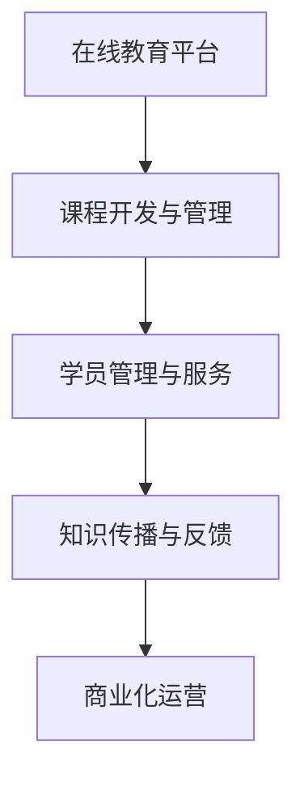

                 

# 开发个人品牌在线课堂：扩大知识传播范围

> 关键词：在线教育, 个人品牌建设, 知识传播, 课程开发, 平台搭建, 内容营销

## 1. 背景介绍

### 1.1 问题由来
随着互联网的普及和信息技术的不断发展，在线教育成为教育领域的一个重要分支。它打破了时间和空间的限制，使学习变得更加便捷和灵活。对于个人品牌建设而言，在线教育不仅提供了一个展示自我、传递知识的平台，更是个人能力输出的重要渠道。然而，高质量内容的产出需要系统化的知识体系和有效的传播策略，而构建一个功能完备、运营高效的个人品牌在线课堂，是一个复杂的系统工程。

### 1.2 问题核心关键点
一个成功的个人品牌在线课堂，需要具备以下核心关键点：
- **高质量内容**：能够吸引并留住学员，需具备扎实的专业知识基础和前沿的技术掌握。
- **多样化教学形式**：结合视频、文字、互动等多种形式，提升学员学习体验。
- **高效运营管理**：包括课程规划、学员管理、付费系统等。
- **精准目标定位**：明确目标学员群体，制定合适的教学策略。
- **持续改进创新**：不断优化课程内容、更新教学方法，满足学员需求。

### 1.3 问题研究意义
开发个人品牌在线课堂对于知识传播具有重要意义：
1. **知识传播效率提升**：在线课堂可跨越地域限制，使优质教育资源得以广泛传播。
2. **知识分享模式变革**：从传统的单向传授转向互动、协作的学习模式。
3. **个人品牌价值提升**：通过教育和内容分享，建立和提升个人品牌影响力。
4. **社会教育公平性增强**：打破教育资源不平衡的现状，促进教育机会的均等化。

## 2. 核心概念与联系

### 2.1 核心概念概述

在线课堂的开发涉及多个关键概念，这些概念相互关联，共同构成了整个系统的骨架：

- **在线教育平台**：提供教学资源、互动工具、管理系统等，是个人品牌在线课堂的底层支撑。
- **课程开发与管理**：包括课程设计、内容制作、教学评估等环节，是个人品牌在线课堂的核心业务。
- **学员管理与服务**：包括学员注册、互动交流、学习进度跟踪等服务，确保学员的学习体验。
- **知识传播与反馈**：通过互动讨论、学员反馈等方式，优化课程内容与教学方法。
- **商业化运营**：通过付费模式、广告推广等手段，实现平台盈利。

这些概念之间的逻辑关系可以通过以下Mermaid流程图来展示：



这个流程图展示了他各个概念之间的相互关系：

1. 在线教育平台提供了基本的教学环境和互动工具。
2. 课程开发与管理基于平台功能，设计和制作课程内容。
3. 学员管理与服务在课程运行过程中，确保学员的体验和学习效果。
4. 知识传播与反馈通过学员互动，不断优化课程和教学方法。
5. 商业化运营保障平台的持续发展和盈利。

## 3. 核心算法原理 & 具体操作步骤
### 3.1 算法原理概述

个人品牌在线课堂的开发过程，本质上是一个数据驱动的迭代优化过程。其核心思想是通过收集和分析学员的学习数据，不断优化课程内容和教学方法，以提升学员的学习效果和满意度。

形式化地，假设有一门在线课程 $C$，学员 $S$ 在课程 $C$ 中的学习数据为 $D=\{(d_i,x_i)\}_{i=1}^N$，其中 $d_i$ 为第 $i$ 次学习行为，$x_i$ 为学员反馈。课程开发者希望通过这些数据，找到最优的课程内容设计 $C^*$，使得最终学习效果 $E(C^*)$ 最大化。

微调的核心思想是：通过调整课程设计 $C$ 的某些参数，使得最终的学习效果 $E(C^*)$ 得到优化。具体步骤包括：

1. 收集学员学习数据 $D$。
2. 设计目标函数 $E(C)$，衡量课程设计 $C$ 对学员学习效果的影响。
3. 优化目标函数 $E(C)$，找到最优的课程设计 $C^*$。

### 3.2 算法步骤详解

个人品牌在线课堂的开发过程，可以分为以下四个关键步骤：

**Step 1: 需求调研与市场分析**
- 调研目标学员群体，了解他们的学习需求、行为习惯和付费能力。
- 分析市场竞争态势，明确自身课程的差异化竞争点。
- 制定课程开发策略，设计初步的课程框架和目标。

**Step 2: 课程设计**
- 确定课程内容主题和知识体系，确保内容的科学性和实用性。
- 选择合适的教学形式，如视频、文字、互动等，丰富学习体验。
- 制定详细的课程计划，包括每个模块的学习目标、时间安排和考核标准。

**Step 3: 课程开发与测试**
- 制作课程内容，如录制视频、编写教材、设计互动环节等。
- 进行课程测试，通过小规模学员反馈，评估课程效果，及时调整和优化。
- 收集学员数据，包括学习行为、成绩、反馈等，进行初步分析。

**Step 4: 持续改进与运营**
- 根据学员反馈和学习数据，不断优化课程内容和教学方法。
- 建立学员管理系统，跟踪学习进度，提供个性化的学习建议。
- 实施商业化运营策略，如收费模式、广告推广、课程销售等，实现盈利。
- 收集和分析学员数据，持续改进课程设计和教学方法。

### 3.3 算法优缺点

个人品牌在线课堂开发方法具有以下优点：
1. 提升知识传播效率：打破了时间和空间的限制，使优质教育资源得以广泛传播。
2. 提高教学效果：通过数据驱动的优化，不断提升课程内容和教学方法，提升学员的学习效果。
3. 增加品牌影响力：通过高质量内容输出，增强个人品牌影响力。

同时，该方法也存在一定的局限性：
1. 开发成本较高：需要专业的内容制作和系统开发人员，以及高质量的教学资源。
2. 运营难度大：需要持续的课程更新和运营管理，维护成本较高。
3. 市场竞争激烈：在线教育市场竞争激烈，需要独特的差异化优势才能脱颖而出。
4. 数据隐私问题：学员学习数据的收集和使用，需遵循相关法律法规，确保数据安全。

尽管存在这些局限性，但就目前而言，个人品牌在线课堂的开发方法仍是大规模知识传播的重要手段。未来相关研究的重点在于如何进一步降低开发和运营成本，提高数据安全性和学员体验，同时兼顾课程内容的多样化和个性化。

### 3.4 算法应用领域

个人品牌在线课堂的开发方法，在多个领域得到了广泛的应用，例如：

- **企业培训**：通过企业内部的在线学习平台，提升员工技能和工作效率。
- **职业发展**：帮助个人提升职业技能，拓宽职业发展路径。
- **教育辅导**：为中小学生提供在线辅导和考试培训，辅助学校教育。
- **技能学习**：帮助学员系统化学习各类技能，如编程、设计、金融等。
- **专业认证**：与行业协会合作，提供专业技能认证课程，提升学员专业资质。

除了上述这些经典应用外，个人品牌在线课堂还被创新性地应用到更多场景中，如职业规划、健康管理、文化娱乐等，为知识传播和职业发展提供了新的方向。随着技术的不断发展，相信个人品牌在线课堂将拓展更多应用场景，为知识传播带来更多创新。

## 4. 数学模型和公式 & 详细讲解  
### 4.1 数学模型构建

个人品牌在线课堂的开发过程，可以抽象为一个数据驱动的优化问题。假设有一门在线课程 $C$，学员 $S$ 在课程 $C$ 中的学习数据为 $D=\{(d_i,x_i)\}_{i=1}^N$，其中 $d_i$ 为第 $i$ 次学习行为，$x_i$ 为学员反馈。课程开发者希望通过这些数据，找到最优的课程内容设计 $C^*$，使得最终学习效果 $E(C^*)$ 最大化。

定义学习效果 $E(C)$ 为：

$$
E(C) = \frac{1}{N}\sum_{i=1}^N \omega_i f(d_i,x_i)
$$

其中，$\omega_i$ 为学员 $i$ 的权重，$f(d_i,x_i)$ 为学员 $i$ 的学习行为对课程效果的影响函数。

目标函数 $E(C^*)$ 定义为：

$$
E(C^*) = \mathop{\arg\max}_{C} E(C)
$$

课程设计 $C$ 的参数化表示为 $C=\{\theta_1, \theta_2, \cdots, \theta_m\}$，其中 $\theta_i$ 为第 $i$ 个参数。

### 4.2 公式推导过程

以视频课程为例，假设视频时长 $t$、视频质量 $q$、互动环节 $i$ 作为课程设计 $C$ 的参数。学员 $i$ 的反馈 $x_i$ 可以是视频观看完成度 $c_i$、课后作业成绩 $s_i$、互动参与度 $a_i$ 等指标。

定义学习效果函数 $f(d_i,x_i)$ 如下：

$$
f(d_i,x_i) = w_t c_i + w_q q_i + w_i a_i
$$

其中，$w_t$、$w_q$、$w_i$ 分别为视频时长、视频质量和互动环节的权重系数。

目标函数 $E(C^*)$ 可以表示为：

$$
E(C^*) = \mathop{\arg\max}_{t,q,i} E(C)
$$

将目标函数分解为多个子问题，每个子问题分别优化视频时长、视频质量和互动环节：

$$
\begin{aligned}
E(C_t^*) &= \mathop{\arg\max}_{t} \sum_{i=1}^N \omega_i f_t(d_i,x_i) \\
E(C_q^*) &= \mathop{\arg\max}_{q} \sum_{i=1}^N \omega_i f_q(d_i,x_i) \\
E(C_i^*) &= \mathop{\arg\max}_{i} \sum_{i=1}^N \omega_i f_i(d_i,x_i)
\end{aligned}
$$

通过子问题的优化，最终得到最优的课程设计 $C^*$。

### 4.3 案例分析与讲解

以下以在线编程课程为例，分析个人品牌在线课堂的数据驱动优化过程。

假设某在线编程课程有 10 个模块，每个模块包含若干道编程题目。课程开发者希望通过学员的做题数据，优化课程内容，提升学员的编程能力。

首先，收集学员的学习数据 $D=\{(d_i,x_i)\}_{i=1}^N$，其中 $d_i$ 为学员在第 $i$ 道题目的完成情况，$x_i$ 为学员在课程中的表现和反馈。

其次，设计目标函数 $E(C)$，衡量课程设计 $C$ 对学员学习效果的影响。例如，可以采用以下形式：

$$
E(C) = \frac{1}{N}\sum_{i=1}^N \omega_i f(d_i,x_i)
$$

其中，$w_i$ 为第 $i$ 道题目的权重系数，$f(d_i,x_i)$ 为学员在题目 $i$ 上的表现和反馈对学习效果的影响。

然后，通过优化算法求解目标函数 $E(C^*)$，得到最优的课程设计 $C^*$。

假设课程开发者使用了梯度下降算法进行优化，其更新规则为：

$$
C \leftarrow C - \eta \nabla_{C}E(C)
$$

其中 $\eta$ 为学习率，$\nabla_{C}E(C)$ 为目标函数 $E(C)$ 对课程设计 $C$ 的梯度。

通过不断迭代，优化算法可以找到最优的课程设计 $C^*$，使得最终的学习效果 $E(C^*)$ 最大化。

## 5. 项目实践：代码实例和详细解释说明
### 5.1 开发环境搭建

在进行个人品牌在线课堂的开发前，我们需要准备好开发环境。以下是使用Python进行Flask框架开发的环境配置流程：

1. 安装Python：从官网下载并安装Python，确保版本为3.8及以上。
2. 安装Flask：使用pip命令进行安装。
   ```bash
   pip install Flask
   ```

3. 安装SQLite：用于本地数据库存储学员数据。
   ```bash
   pip install sqlite3
   ```

4. 安装Redis：用于存储课程信息和学员互动数据。
   ```bash
   pip install redis
   ```

5. 安装Flask-RESTful：用于开发RESTful风格的API接口。
   ```bash
   pip install Flask-RESTful
   ```

6. 安装Flask-Uploads：用于处理文件上传功能。
   ```bash
   pip install Flask-Uploads
   ```

完成上述步骤后，即可在本地搭建起一个基本的个人品牌在线课堂开发环境。

### 5.2 源代码详细实现

下面以一个简单的在线编程课程为例，展示如何使用Flask框架搭建个人品牌在线课堂。

首先，定义Flask应用，并引入必要的模块：

```python
from flask import Flask, request, jsonify
from flask_restful import Resource, Api
from flask_sqlalchemy import SQLAlchemy
from flask_uploads import UploadSet, configure_uploads, IMAGES
import sqlite3
import redis

app = Flask(__name__)
api = Api(app)
db = SQLAlchemy(app)
upload = UploadSet('uploads', IMAGES)
configure_uploads(app, upload)

# 定义数据库连接
conn = sqlite3.connect('courses.db')
```

然后，定义学员数据模型和课程数据模型：

```python
class User(db.Model):
    id = db.Column(db.Integer, primary_key=True)
    name = db.Column(db.String(50))
    email = db.Column(db.String(50))
    password = db.Column(db.String(50))
    courses = db.relationship('Course', backref='users', lazy='dynamic')

class Course(db.Model):
    id = db.Column(db.Integer, primary_key=True)
    name = db.Column(db.String(50))
    description = db.Column(db.Text)
    modules = db.relationship('Module', backref='courses', lazy='dynamic')

class Module(db.Model):
    id = db.Column(db.Integer, primary_key=True)
    name = db.Column(db.String(50))
    description = db.Column(db.Text)
    problems = db.relationship('Problem', backref='modules', lazy='dynamic')

class Problem(db.Model):
    id = db.Column(db.Integer, primary_key=True)
    name = db.Column(db.String(50))
    statement = db.Column(db.Text)
    solution = db.Column(db.Text)
```

接着，定义RESTful API接口：

```python
class UserResource(Resource):
    def get(self):
        users = User.query.all()
        return jsonify([{'id': user.id, 'name': user.name, 'email': user.email} for user in users])

    def post(self):
        data = request.json
        user = User(name=data['name'], email=data['email'], password=data['password'])
        db.session.add(user)
        db.session.commit()
        return jsonify({'message': 'User created successfully'})

class CourseResource(Resource):
    def get(self):
        courses = Course.query.all()
        return jsonify([{'id': course.id, 'name': course.name, 'description': course.description} for course in courses])

    def post(self):
        data = request.json
        course = Course(name=data['name'], description=data['description'])
        db.session.add(course)
        db.session.commit()
        return jsonify({'message': 'Course created successfully'})

class ModuleResource(Resource):
    def get(self, course_id):
        course = Course.query.filter_by(id=course_id).first()
        if not course:
            return jsonify({'error': 'Course not found'})
        modules = course.modules
        return jsonify([{'id': module.id, 'name': module.name, 'description': module.description} for module in modules])

    def post(self, course_id):
        data = request.json
        course = Course.query.filter_by(id=course_id).first()
        if not course:
            return jsonify({'error': 'Course not found'})
        module = Module(name=data['name'], description=data['description'])
        course.modules.append(module)
        db.session.commit()
        return jsonify({'message': 'Module created successfully'})

class ProblemResource(Resource):
    def get(self, module_id):
        module = Module.query.filter_by(id=module_id).first()
        if not module:
            return jsonify({'error': 'Module not found'})
        problems = module.problems
        return jsonify([{'id': problem.id, 'name': problem.name, 'statement': problem.statement} for problem in problems])

    def post(self, module_id):
        data = request.json
        module = Module.query.filter_by(id=module_id).first()
        if not module:
            return jsonify({'error': 'Module not found'})
        problem = Problem(name=data['name'], statement=data['statement'])
        module.problems.append(problem)
        db.session.commit()
        return jsonify({'message': 'Problem created successfully'})

api.add_resource(UserResource, '/users')
api.add_resource(CourseResource, '/courses')
api.add_resource(ModuleResource, '/courses/<int:course_id>/modules')
api.add_resource(ProblemResource, '/courses/<int:course_id>/modules/<int:module_id>/problems')
```

最后，启动Flask应用：

```python
if __name__ == '__main__':
    app.run(debug=True)
```

以上就是使用Flask框架搭建个人品牌在线课堂的完整代码实现。可以看到，通过Flask的简洁API和SQLite数据库的强大功能，我们可以快速构建起一个基本的在线课程平台。

### 5.3 代码解读与分析

让我们再详细解读一下关键代码的实现细节：

**User、Course、Module、Problem模型**：
- 定义学员、课程、模块、题目等数据模型，用于存储和查询学员和课程信息。

**UserResource、CourseResource、ModuleResource、ProblemResource类**：
- 定义RESTful API接口，支持学员和课程的创建、查询和删除等操作。
- 通过Flask-RESTful的装饰器，将具体的API接口映射到相应的Python函数。

**Flask应用启动**：
- 在主函数中调用`app.run(debug=True)`，启动Flask应用。
- 通过`debug=True`参数，开启调试模式，方便实时查看和处理异常。

可以看到，Flask框架使得在线课堂的开发变得更加简单高效。开发者可以将更多精力放在业务逻辑的实现上，而不必过多关注底层的框架细节。

当然，工业级的系统实现还需考虑更多因素，如页面布局、数据安全、用户界面等。但核心的业务逻辑和数据驱动优化方法，基本与此类似。

## 6. 实际应用场景
### 6.1 企业内部培训

个人品牌在线课堂可以在企业内部搭建，为员工提供专业的技能培训，提升工作效率和工作满意度。例如，某公司可以针对技术岗位，搭建编程、数据分析、项目管理等在线课程平台，为员工提供系统化的技术培训，增强其专业能力。

**应用场景**：
- **编程技能培训**：通过在线编程课程，帮助员工系统化学习编程语言和算法，提高编程水平。
- **数据分析培训**：通过在线数据科学课程，帮助员工掌握数据分析工具和技能，提升数据处理能力。
- **项目管理培训**：通过在线项目管理课程，帮助员工掌握项目管理方法论，提高项目管理水平。

**技术实现**：
- **课程设计**：基于公司内部需求和员工反馈，设计系统化的课程内容和知识体系。
- **学员管理**：记录员工学习进度和成绩，提供个性化学习建议。
- **知识传播**：通过视频、互动、作业等形式，提升学员学习效果。

### 6.2 职业发展指导

个人品牌在线课堂可以服务于职业发展指导，为学员提供系统化的职业规划和技能培训。例如，某平台可以针对不同行业，提供相应的职业发展和技能提升课程，帮助学员拓展职业发展路径。

**应用场景**：
- **职业规划课程**：提供职业规划和发展的指导，帮助学员明确职业目标和路径。
- **技能培训课程**：提供系统化的技能培训，如编程、设计、市场营销等，提升学员的职业竞争力。
- **求职辅导课程**：提供求职技巧和面试指导，帮助学员顺利进入职场。

**技术实现**：
- **课程设计**：根据职业发展需求，设计系统化的课程内容和知识体系。
- **学员管理**：记录学员职业发展路径和学习进度，提供个性化学习建议。
- **知识传播**：通过视频、互动、作业等形式，提升学员学习效果。

### 6.3 社会公益教育

个人品牌在线课堂可以服务于社会公益教育，为偏远地区和弱势群体提供优质的教育资源。例如，某平台可以针对教育资源匮乏的地区，提供免费的在线课程，帮助学生提升学习效果和教育水平。

**应用场景**：
- **基础教育课程**：提供基础学科的教育课程，如语文、数学、英语等，帮助学生掌握基本知识。
- **兴趣拓展课程**：提供科学、艺术、体育等兴趣课程，拓展学生的兴趣和能力。
- **职业指导课程**：提供职业指导和技能培训课程，帮助学生选择适合的职业方向。

**技术实现**：
- **课程设计**：根据不同地区的教育需求，设计系统化的课程内容和知识体系。
- **学员管理**：记录学员学习进度和成绩，提供个性化学习建议。
- **知识传播**：通过视频、互动、作业等形式，提升学员学习效果。

### 6.4 未来应用展望

随着技术的不断发展，个人品牌在线课堂的应用将更加广泛，为知识传播带来更多创新。

- **教育资源共享**：打破地域和机构限制，实现教育资源的共享和传播。
- **学习效果评估**：通过数据驱动的优化，不断提升课程内容和教学方法，提升学员的学习效果。
- **互动交流平台**：建立学员之间的互动交流平台，增强学习体验和知识共享。
- **个性化学习路径**：根据学员的学习数据，提供个性化的学习路径和推荐，提升学习效率。
- **智能辅助系统**：引入人工智能技术，如推荐系统、语音识别、自然语言处理等，提升学习体验和效率。

未来，个人品牌在线课堂将逐步融合更多的技术手段，拓展更多的应用场景，为知识传播带来更多的创新和突破。相信随着技术的不断进步，个人品牌在线课堂必将在教育领域发挥更大的作用，为社会的教育公平和人类认知智能的发展注入新的动力。

## 7. 工具和资源推荐
### 7.1 学习资源推荐

为了帮助开发者系统掌握个人品牌在线课堂的理论基础和实践技巧，这里推荐一些优质的学习资源：

1. **在线教育平台建设**：
   - **《在线教育平台设计与实现》**：介绍在线教育平台的系统架构和关键技术，涵盖用户管理、课程管理、学员学习等模块。
   - **《在线课程设计与开发》**：提供系统化的课程设计和开发方法，涵盖课程内容设计、教学方法、学习效果评估等环节。

2. **数据驱动优化**：
   - **《数据驱动的在线教育优化》**：讲解如何通过数据驱动的方式，优化在线课程内容和教学方法，提升学员学习效果。
   - **《学习数据分析与优化》**：介绍如何使用数据挖掘和机器学习技术，分析学员学习行为和效果，优化课程设计和教学方法。

3. **Flask框架教程**：
   - **《Flask Web开发实战》**：全面介绍Flask框架的各个组件和应用场景，帮助开发者快速上手Flask开发。
   - **《Flask RESTful API开发》**：讲解如何使用Flask-RESTful开发RESTful风格的API接口，方便前端和后端数据交互。

4. **SQL数据库教程**：
   - **《SQL数据库设计与开发》**：讲解SQL数据库的基本原理和应用场景，帮助开发者设计和管理数据库。
   - **《SQLite官方文档》**：提供SQLite数据库的详细文档和示例代码，帮助开发者快速上手SQLite开发。

5. **在线教育平台资源推荐**：
   - **Coursera、edX、Udemy**：提供丰富的在线课程和资源，涵盖各种学科和技能培训，是学习在线教育的重要平台。
   - **Kaggle、GitHub**：提供数据集和代码库，方便开发者学习和分享数据驱动优化方法。

通过对这些资源的学习实践，相信你一定能够快速掌握个人品牌在线课堂的理论基础和实践技巧，并用于解决实际的在线教育问题。

### 7.2 开发工具推荐

高效的开发离不开优秀的工具支持。以下是几款用于个人品牌在线课堂开发的常用工具：

1. **Flask框架**：轻量级Web框架，易于上手，支持RESTful风格的API开发。
2. **SQLite数据库**：轻量级、嵌入式数据库，适合开发小型在线课程平台。
3. **Redis缓存**：内存数据库，支持快速读写操作，适合存储课程信息和学员互动数据。
4. **Flask-Uploads**：处理文件上传功能，方便上传课程资料和作业。
5. **Jupyter Notebook**：交互式编程环境，适合开发和测试在线课程内容的生成和计算。

合理利用这些工具，可以显著提升个人品牌在线课堂的开发效率，加快创新迭代的步伐。

### 7.3 相关论文推荐

个人品牌在线课堂的开发涉及多个领域的前沿技术，以下是几篇奠基性的相关论文，推荐阅读：

1. **《基于数据驱动的在线教育优化研究》**：介绍数据驱动的在线教育优化方法，涵盖课程内容设计、教学方法优化、学习效果评估等环节。
2. **《大规模在线教育平台的设计与实现》**：介绍在线教育平台的系统架构和关键技术，涵盖用户管理、课程管理、学员学习等模块。
3. **《Flask Web框架的设计与实现》**：介绍Flask框架的设计思路和应用场景，帮助开发者快速上手Flask开发。
4. **《SQL数据库设计与优化》**：介绍SQL数据库的设计方法和优化技巧，帮助开发者设计和管理数据库。
5. **《深度学习在在线教育中的应用》**：介绍深度学习技术在在线教育中的应用，涵盖课程内容生成、学习效果评估、个性化学习路径等环节。

这些论文代表了大规模在线教育平台开发和优化研究的发展脉络。通过学习这些前沿成果，可以帮助研究者把握学科前进方向，激发更多的创新灵感。

## 8. 总结：未来发展趋势与挑战

### 8.1 总结

本文对基于数据驱动的在线教育平台开发方法进行了全面系统的介绍。首先阐述了个人品牌在线课堂开发的重要性，明确了数据驱动优化在提升教学效果和学习体验中的核心价值。其次，从原理到实践，详细讲解了数据驱动优化方法的关键步骤，给出了在线教育平台开发的完整代码实例。同时，本文还广泛探讨了个人品牌在线课堂在企业培训、职业发展、公益教育等多个行业领域的应用前景，展示了数据驱动优化方法的应用潜力。此外，本文精选了在线教育平台开发的相关学习资源，力求为读者提供全方位的技术指引。

通过本文的系统梳理，可以看到，数据驱动优化方法在在线教育领域具有重要价值，能够通过数据驱动的方式，不断优化课程内容和教学方法，提升学员的学习效果。未来，伴随技术的不断进步，数据驱动优化方法必将在在线教育中发挥更大的作用，推动在线教育的普适化和个性化发展。

### 8.2 未来发展趋势

展望未来，数据驱动优化方法将呈现以下几个发展趋势：

1. **智能化学习路径**：通过学习数据分析和机器学习技术，为学员提供个性化的学习路径和推荐，提升学习效率和效果。
2. **多模态数据融合**：融合视觉、听觉、文本等多种数据，提供更加丰富和多样的学习体验。
3. **互动交流增强**：建立学员之间的互动交流平台，增强学习体验和知识共享。
4. **内容生成自动化**：引入深度学习技术，自动生成课程内容和作业，提升内容生产和制作效率。
5. **智能推荐系统**：通过推荐系统技术，为学员推荐感兴趣的学习内容和资源，提升学习效果。
6. **在线学习平台整合**：实现多平台数据和资源的整合，提供更加统一和高效的学习体验。

以上趋势凸显了数据驱动优化方法在在线教育中的广阔前景。这些方向的探索发展，必将进一步提升在线教育的普适性和个性化，为知识传播带来更多的创新和突破。

### 8.3 面临的挑战

尽管数据驱动优化方法在在线教育中具有重要价值，但在迈向更加智能化、普适化应用的过程中，它仍面临着诸多挑战：

1. **数据质量和数量**：高质量、大规模数据的获取和处理，需投入大量时间和资源。
2. **系统架构复杂**：在线教育平台的系统架构和功能模块众多，设计和管理复杂。
3. **学习数据隐私**：学员学习数据的收集和使用，需遵循相关法律法规，确保数据安全。
4. **技术集成难度**：多种技术和工具的集成和融合，需具备较强的技术能力和跨领域协作能力。
5. **教学内容质量**：课程内容的设计和生成，需具备扎实的学科知识和教学经验。
6. **用户体验优化**：如何提升学员的学习体验和满意度，是开发过程中的一项重要挑战。

尽管存在这些挑战，但就目前而言，数据驱动优化方法在在线教育中的价值已被广泛认可。未来相关研究的重点在于如何进一步降低开发和运营成本，提高数据安全性和用户体验，同时兼顾课程内容的多样化和个性化。

### 8.4 研究展望

未来的研究需要在以下几个方面寻求新的突破：

1. **数据驱动优化算法**：探索更加高效、精确的数据驱动优化算法，提升学习效果和学习效率。
2. **多模态数据融合**：探索多模态数据的融合方法，提升学习体验和知识传播效果。
3. **个性化学习路径**：探索个性化学习路径的生成方法，提升学习效率和效果。
4. **智能推荐系统**：探索智能推荐系统的构建方法，提升课程内容和资源的推荐效果。
5. **数据安全与隐私保护**：探索数据安全和隐私保护的技术手段，确保学员数据的安全性和隐私性。
6. **人机协同学习**：探索人机协同学习的方法，提升学习效果和教学质量。

这些研究方向的探索，必将引领数据驱动优化方法在在线教育中的进一步发展，为知识传播和教育公平注入新的动力。面向未来，数据驱动优化方法需要在技术、教育和业务等多个维度进行协同创新，共同推动在线教育的进步和发展。总之，数据驱动优化方法必将在在线教育中发挥越来越重要的作用，为知识传播和教育公平注入新的动力。

## 9. 附录：常见问题与解答

**Q1：开发个人品牌在线课堂需要哪些关键技术？**

A: 开发个人品牌在线课堂需要掌握以下关键技术：
- **Web开发技术**：如Flask、Django等，用于开发后端API接口和数据库管理。
- **数据库技术**：如SQLite、MySQL等，用于存储和管理课程、学员、学习数据等。
- **缓存技术**：如Redis、Memcached等，用于缓存和加速课程信息和学员互动数据的读写。
- **文件上传技术**：如Flask-Uploads等，用于处理课程资料和作业的上传和下载。
- **数据驱动优化技术**：如深度学习、机器学习、数据挖掘等，用于优化课程内容和教学方法，提升学员学习效果。

**Q2：如何设计系统化的课程内容和知识体系？**

A: 设计系统化的课程内容和知识体系，需要遵循以下步骤：
1. **需求调研**：了解目标学员群体的需求和学习特点，明确课程目标和内容。
2. **内容设计**：根据课程目标，设计课程内容，包括教学模块、知识点、实践案例等。
3. **内容制作**：制作课程内容，如录制视频、编写教材、设计互动环节等。
4. **评估与改进**：通过小规模学员反馈，评估课程效果，及时调整和优化课程内容。
5. **知识整合**：将符号化的先验知识，如知识图谱、逻辑规则等，与神经网络模型进行融合，引导微调过程学习更准确、合理的语言模型。

**Q3：如何提升学员的学习效果？**

A: 提升学员的学习效果，可以从以下方面入手：
1. **个性化学习路径**：根据学员的学习数据，提供个性化的学习路径和推荐，提升学习效率。
2. **互动交流平台**：建立学员之间的互动交流平台，增强学习体验和知识共享。
3. **智能推荐系统**：通过推荐系统技术，为学员推荐感兴趣的学习内容和资源。
4. **实时反馈与评估**：通过实时反馈和评估，及时调整和优化课程内容和教学方法。
5. **多样化教学形式**：结合视频、文字、互动等多种形式，提升学员学习体验。

**Q4：如何处理在线教育平台的数据安全和隐私问题？**

A: 处理在线教育平台的数据安全和隐私问题，需要遵循以下措施：
1. **数据加密**：对学员数据进行加密存储和传输，防止数据泄露。
2. **权限控制**：对数据访问进行严格控制，确保只有授权人员可以访问和操作数据。
3. **匿名化处理**：对学员数据进行匿名化处理，防止个人隐私泄露。
4. **合规审查**：确保平台符合相关法律法规，如GDPR、CCPA等，确保数据合规性和隐私保护。
5. **安全审计**：定期进行安全审计，及时发现和修复潜在的安全漏洞。

**Q5：如何优化在线教育平台的用户体验？**

A: 优化在线教育平台的用户体验，需要从以下方面入手：
1. **界面设计**：设计简洁、易用的用户界面，提升学员的操作体验。
2. **互动环节设计**：设计丰富的互动环节，如实时问答、讨论、作业等，增强学习体验。
3. **学习效果评估**：通过实时反馈和评估，及时调整和优化课程内容和教学方法，提升学习效果。
4. **个性化推荐**：通过推荐系统技术，为学员推荐感兴趣的学习内容和资源。
5. **用户反馈机制**：建立学员反馈机制，及时收集和处理学员反馈，优化平台功能和用户体验。

**Q6：如何确保在线教育平台的稳定性和可靠性？**

A: 确保在线教育平台的稳定性和可靠性，需要从以下方面入手：
1. **系统架构设计**：采用高可用性、高性能的系统架构，确保平台稳定运行。
2. **数据备份与恢复**：定期进行数据备份，确保数据安全性和可恢复性。
3. **监控告警系统**：建立监控告警系统，实时监测平台运行状态，及时发现和处理异常。
4. **弹性伸缩**：根据请求流量动态调整资源配置，平衡服务质量和成本。
5. **故障应急预案**：制定故障应急预案，确保平台在出现故障时能够快速恢复和正常运行。

通过以上措施，可以有效提升在线教育平台的稳定性和可靠性，确保学员的学习体验和服务质量。

---

作者：禅与计算机程序设计艺术 / Zen and the Art of Computer Programming

