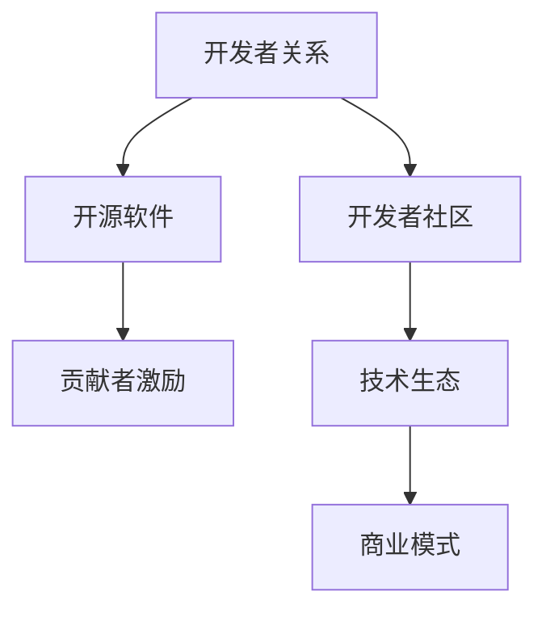

                 

# 开发者关系：将社区影响力转化为商业机会

> 关键词：开发者关系,社区影响力,商业机会,开源软件,生态系统,贡献者激励,开发者社区,商业模式,软件工程

## 1. 背景介绍

### 1.1 问题由来
在当今数字化时代，软件开发者不再仅仅是技术实现的执行者，更成为了产品创新、技术演进和社会变革的重要推动者。开发者关系（Developer Relations, DR）作为一种新型的商业策略，正逐渐成为各大企业提升产品竞争力、构建技术生态和培养用户粘性的重要手段。

开发者关系不仅关注开发者的技术能力和贡献，更着眼于通过建立稳定的开发者社区、提升社区参与度、激发开发者热情等方式，将社区影响力转化为实实在在的商业价值。在这一过程中，开发者成为企业与用户、市场、技术前沿之间的桥梁，推动了产品的快速迭代与创新，促进了技术生态的繁荣。

### 1.2 问题核心关键点
- **社区建设**：如何构建一个活跃、开放、多元的开发者社区，吸引技术精英和普通开发者共同参与。
- **贡献者激励**：如何通过合理的激励机制，调动开发者积极贡献代码、分享知识和经验。
- **商业转化**：如何将开发者社区中的活跃参与、技术讨论和创新成果转化为企业的商业机会和用户价值。

### 1.3 问题研究意义
研究开发者关系及其商业转化模式，对于提升企业的市场竞争力、推动技术进步、构建良好的生态系统具有重要意义：

- 提升产品竞争力：通过聚集高质量的开发者资源，加速产品的技术创新和迭代。
- 构建技术生态：营造一个健康、活跃、包容的开发者社区，增强企业的市场号召力。
- 增强用户粘性：利用开发者社区的影响力，提升用户对产品的认同感和忠诚度。
- 加速商业模式转型：探索新的商业机会，如开源软件订阅、技术培训、生态合作等，拓宽收入来源。

## 2. 核心概念与联系

### 2.1 核心概念概述

为更好地理解开发者关系及其商业转化的过程，本节将介绍几个核心概念：

- **开发者关系（Developer Relations, DR）**：指企业与开发者之间建立的关系管理策略，通过建立、维护和发展开发者社区，提升开发者参与度，促进技术交流和产品创新。
- **开发者社区（Developer Community）**：指围绕特定技术或产品形成的开发者群体，包括开源项目、技术论坛、技术博客、开发者会议等。
- **开源软件（Open Source Software）**：指公开源码、许可协议自由的软件项目，开发者可以自由地贡献代码、修改和分发。
- **贡献者激励（Contributor Incentive）**：指企业通过物质、精神和职业发展等手段，鼓励开发者积极参与开源项目和社区活动。
- **技术生态（Technology Ecosystem）**：指围绕技术产品形成的整个价值链体系，包括硬件、软件、服务、工具等。
- **商业模式（Business Model）**：指企业通过特定策略实现产品和服务价值的模式，包括订阅、广告、产品销售等。

这些核心概念之间的逻辑关系可以通过以下Mermaid流程图来展示：



这个流程图展示了一些关键概念及其之间的联系：

1. 开发者关系通过构建开发者社区，吸引开发者参与。
2. 开源软件为开发者社区提供了丰富的技术资源和协作平台。
3. 贡献者激励提升了开发者在开源项目和社区中的积极性和贡献度。
4. 技术生态的形成和发展依赖于开发者社区的活跃和多样性。
5. 商业模式通过技术生态的丰富和稳定，转化为企业的商业价值。

## 3. 核心算法原理 & 具体操作步骤
### 3.1 算法原理概述

开发者关系及其商业转化的核心在于如何高效地构建、维护和发展一个活跃的开发者社区，并将社区中的资源和影响力转化为商业价值。其基本原理可概括为以下几个步骤：

1. **社区建设**：通过社交媒体、技术论坛、开发者会议等渠道，构建一个开放、活跃的开发者社区。
2. **贡献者激励**：制定合理的激励政策，如技术奖励、荣誉证书、职业发展机会等，鼓励开发者积极参与。
3. **商业转化**：利用社区中的开源项目、技术讨论和创新成果，为企业产品和服务提供技术支持和用户反馈，促进商业模式的创新和转型。

### 3.2 算法步骤详解

以下是开发者关系及其商业转化的详细步骤：

**Step 1: 社区建设**
- **社交媒体推广**：利用Twitter、GitHub、Discord等社交平台，推广技术项目和开发者活动。
- **技术论坛运营**：创建或参与技术论坛，如Stack Overflow、Reddit等，提供技术支持、解决问题。
- **开发者会议举办**：组织或参与开发者会议，如Google I/O、Microsoft Build等，进行技术分享、交流。
- **技术博客维护**：开设技术博客，分享企业技术动态、开发心得和案例分析，吸引开发者关注。

**Step 2: 贡献者激励**
- **技术奖励**：为贡献显著的开发者提供技术奖项、现金奖励等。
- **荣誉证书**：颁发技术认证、开源贡献证书，增强开发者认同感。
- **职业发展**：提供实习机会、技术培训、晋升通道，提升开发者职业前景。
- **社区活动**：组织线上线下技术交流、技术分享、技术比赛等活动，增强社区凝聚力。

**Step 3: 商业转化**
- **产品技术支持**：将社区中的开源项目和技术成果整合到企业产品中，提升产品竞争力。
- **用户反馈获取**：通过社区平台收集用户反馈，进行产品迭代和优化。
- **生态合作**：与其他企业、机构、开发者合作，形成良性互动的技术生态。
- **商业模式创新**：探索开源软件订阅、技术培训、生态合作等新模式，拓宽收入来源。

### 3.3 算法优缺点

开发者关系及其商业转化的主要优点包括：
1. **提升产品竞争力**：通过聚集高质量的开发者资源，加速产品的技术创新和迭代。
2. **构建技术生态**：营造一个健康、活跃、包容的开发者社区，增强企业的市场号召力。
3. **增强用户粘性**：利用开发者社区的影响力，提升用户对产品的认同感和忠诚度。
4. **加速商业模式转型**：探索新的商业机会，如开源软件订阅、技术培训、生态合作等，拓宽收入来源。

同时，该方法也存在一些局限性：
1. **成本投入高**：社区建设、活动举办、激励政策等都需要较高的资金和资源投入。
2. **效果难以量化**：开发者关系的商业转化效果不易量化，难以用传统财务指标衡量。
3. **依赖技术精英**：依赖部分技术精英的持续贡献和影响力，社区活跃度可能受限。
4. **法律风险**：开源项目和社区活动的版权、法律风险需要妥善管理。

尽管存在这些局限性，但开发者关系及其商业转化对于提升企业市场竞争力、推动技术进步、构建良好的生态系统具有重要意义。未来相关研究的重点在于如何进一步优化社区激励机制，降低成本投入，提高商业转化效率，同时兼顾社区的公平性和多样性。

### 3.4 算法应用领域

开发者关系及其商业转化方法已经广泛应用于众多领域，例如：

- **互联网企业**：如Google、Microsoft、Facebook等，通过开发者社区建设和技术支持，推动产品创新和生态发展。
- **开源软件公司**：如Red Hat、SUSE、Oracle等，利用开源社区的力量，提升企业品牌的市场认可度和影响力。
- **云服务提供商**：如AWS、Azure、Google Cloud等，通过开源项目和技术生态，增强云服务产品和市场的竞争力。
- **技术咨询和培训机构**：如Udacity、Coursera、Pluralsight等，利用开发者社区的影响力，提供高质量的技术培训和咨询服务。
- **硬件制造商**：如Intel、NVIDIA、Apple等，通过开发者关系和技术合作，推动硬件产品的技术创新和市场推广。

除了这些主流应用外，开发者关系还广泛渗透到教育、医疗、金融、能源等众多领域，成为推动技术进步和社会创新的重要力量。

## 4. 数学模型和公式 & 详细讲解 & 举例说明

### 4.1 数学模型构建

本节将使用数学语言对开发者关系及其商业转化的过程进行更加严格的刻画。

设开发者社区中的活跃用户数为 $U$，社区贡献者数为 $C$，企业产品市场份额为 $M$，技术生态中的合作伙伴数为 $E$，商业模式的收入为 $I$。社区建设、贡献者激励和商业转化的过程可以用以下公式表示：

$$
U = f_{社区}(Soc) \\
C = f_{激励}(Inc) \\
M = g_{产品}(C, U) \\
E = h_{生态}(M) \\
I = m_{商业}(M, E)
$$

其中，$f_{社区}$、$f_{激励}$、$g_{产品}$、$h_{生态}$ 和 $m_{商业}$ 分别表示社区建设、贡献者激励、产品技术支持、生态合作和商业模式创新的数学模型。

### 4.2 公式推导过程

以下我们以一个简单的案例来推导社区建设、贡献者激励和商业转化的关系：

假设一个开源软件项目开始时，社区活跃用户数为 $U_0$，贡献者数为 $C_0$，市场份额为 $M_0$，合作伙伴数为 $E_0$，商业模式的收入为 $I_0$。通过社区建设、贡献者激励和商业转化，社区活跃用户数增加至 $U_1$，贡献者数增加至 $C_1$，市场份额增加至 $M_1$，合作伙伴数增加至 $E_1$，商业模式的收入增加至 $I_1$。

根据上述数学模型，我们可以推导出以下关系：

$$
U_1 = U_0 + \Delta U \\
C_1 = C_0 + \Delta C \\
M_1 = M_0 + \Delta M \\
E_1 = E_0 + \Delta E \\
I_1 = I_0 + \Delta I
$$

其中，$\Delta U$、$\Delta C$、$\Delta M$、$\Delta E$ 和 $\Delta I$ 分别表示社区建设、贡献者激励和商业转化带来的新增效果。

### 4.3 案例分析与讲解

我们以一个企业推动其开源社区发展为例，来具体分析社区建设、贡献者激励和商业转化的关系。

假设一家企业决定投入一定资源进行社区建设，包括技术支持、活动举办、平台维护等。经过一段时间的努力，社区活跃用户数从 $U_0$ 增加至 $U_1$，贡献者数从 $C_0$ 增加至 $C_1$，市场份额从 $M_0$ 增加至 $M_1$，合作伙伴数从 $E_0$ 增加至 $E_1$，商业模式的收入从 $I_0$ 增加至 $I_1$。

以 $U_1 - U_0$ 为例，社区建设带来的新增活跃用户数主要受以下因素影响：
- **技术支持**：企业通过技术论坛、博客等渠道，提供优质的技术支持和解决方案，吸引了更多开发者关注和参与。
- **活动举办**：企业举办开发者大会、黑客松等活动，增强社区的凝聚力和活跃度。
- **平台维护**：企业维护和优化社区平台，提升用户体验和社区粘性。

类似地，贡献者激励和商业转化的新增效果也有其特定的影响因素：
- **贡献者激励**：通过技术奖励、荣誉证书、职业发展机会等，调动开发者积极贡献代码、分享知识和经验。
- **商业转化**：企业利用社区中的开源项目和技术成果，推动产品创新和市场推广，提升市场份额和收入。

通过这些数学模型和案例分析，可以看出开发者关系及其商业转化的过程是一个动态、复杂的多因素影响系统。企业需要综合考虑社区建设、贡献者激励和商业转化之间的相互作用，制定有效的策略，最大化其商业价值。

## 5. 项目实践：代码实例和详细解释说明
### 5.1 开发环境搭建

在进行开发者关系及其商业转化的实践前，我们需要准备好开发环境。以下是使用Python进行社区平台开发的简要环境配置流程：

1. 安装Anaconda：从官网下载并安装Anaconda，用于创建独立的Python环境。

2. 创建并激活虚拟环境：
```bash
conda create -n dr-env python=3.8 
conda activate dr-env
```

3. 安装Python和相关库：
```bash
pip install pandas numpy scikit-learn matplotlib seaborn
```

4. 安装社区平台相关的库和框架：
```bash
pip install django flask social-auth-app-django
```

5. 创建和配置数据库：
```bash
python manage.py makemigrations
python manage.py migrate
```

完成上述步骤后，即可在`dr-env`环境中开始社区平台的开发和部署。

### 5.2 源代码详细实现

这里我们以构建一个开源项目社区为例，详细讲解如何实现社区建设、贡献者激励和商业转化。

首先，定义社区用户模型和贡献者模型：

```python
from django.contrib.auth.models import AbstractUser

class Contributor(AbstractUser):
    # 贡献者模型，继承自Django的AbstractUser模型，添加贡献相关的字段
    is_contributor = models.BooleanField(default=False)

class CommunityUser(AbstractUser):
    # 社区用户模型，继承自Django的AbstractUser模型，添加社区活动相关的字段
    has participation = models.BooleanField(default=False)
```

然后，定义社区活动和贡献记录模型：

```python
class Contribution(models.Model):
    # 贡献记录模型，记录开发者对开源项目的贡献
    user = models.ForeignKey(Contributor, on_delete=models.CASCADE)
    project = models.ForeignKey(OpenSourceProject, on_delete=models.CASCADE)
    contribution_type = models.CharField(max_length=50)
    contribution_date = models.DateTimeField(auto_now_add=True)

class CommunityEvent(models.Model):
    # 社区活动模型，记录开发者社区的活动信息
    title = models.CharField(max_length=200)
    description = models.TextField()
    date = models.DateField()
```

接着，定义社区建设的视图和控制器：

```python
def community_build(request):
    # 社区建设视图，处理社区建设相关的请求
    pass

def community_events(request):
    # 社区活动视图，列出社区中所有的活动信息
    pass
```

最后，定义贡献者激励和商业转化的逻辑：

```python
def contribution_incentive(request, user):
    # 贡献者激励逻辑，根据用户贡献度发放奖励和荣誉
    pass

def commercial_conversion(request, project):
    # 商业转化逻辑，将开源项目和技术成果整合到企业产品中
    pass
```

### 5.3 代码解读与分析

让我们再详细解读一下关键代码的实现细节：

**User模型和Contribution模型**：
- 定义了开发者和贡献者的基本属性，如用户名、密码、角色等。
- 贡献者模型增加了`is_contributor`字段，标记是否为社区贡献者。
- 贡献记录模型记录了开发者对开源项目的贡献类型、时间等。

**CommunityEvent模型**：
- 定义了社区活动的标题、描述和日期等字段。

**社区建设的视图和控制器**：
- `community_build`视图处理社区建设相关的请求，例如社区平台搭建、技术支持等。
- `community_events`视图列出社区中所有的活动信息，供开发者查看和参与。

**贡献者激励和商业转化的逻辑**：
- `contribution_incentive`函数根据用户的贡献度发放奖励和荣誉，例如技术奖励、荣誉证书等。
- `commercial_conversion`函数将开源项目和技术成果整合到企业产品中，推动商业模式的创新和转型。

通过这些代码实现，可以清晰地看到开发者关系及其商业转化的关键逻辑：

1. **社区建设**：通过搭建社区平台，提供技术支持和活动举办，吸引开发者参与。
2. **贡献者激励**：通过技术奖励、荣誉证书等手段，调动开发者积极贡献代码和分享经验。
3. **商业转化**：利用开源项目和技术成果，推动产品创新和市场推广，提升市场份额和收入。

以上是一个简化的社区平台实现示例，实际应用中还需要考虑更多细节，如用户权限管理、活动报名、成果展示等。

## 6. 实际应用场景
### 6.1 智能客服系统

开发者关系及其商业转化方法在智能客服系统中有着广泛的应用。传统的客服系统往往依赖于人工客服，成本高、效率低，无法提供24/7不间断服务。通过开发者关系，企业可以构建一个活跃的开发者社区，引入大量的开源项目和技术资源，提升智能客服系统的智能化水平。

例如，企业可以引入开源聊天机器人项目，利用社区中的开源代码和技术成果，构建一个高质量的智能客服系统。通过社区活动和技术支持，企业可以持续优化和改进系统性能，提升用户体验和满意度。同时，企业还可以利用社区中的技术讨论和创新成果，推动智能客服系统的商业化应用。

### 6.2 智能家居系统

在智能家居领域，开发者关系及其商业转化方法同样具有重要的应用价值。智能家居系统需要集成多种传感器、智能设备和技术方案，依赖于开发者社区的广泛支持和创新。

企业可以通过开发者关系，吸引各类开发者和专家参与智能家居系统的开发和改进。例如，企业可以组织开发者大会、黑客松等活动，鼓励开发者贡献代码和技术方案。通过社区建设和技术支持，企业可以构建一个开放的智能家居技术生态，推动系统创新和产品迭代。同时，企业还可以利用社区中的开源项目和技术成果，提升智能家居系统的功能性和用户体验。

### 6.3 医疗健康系统

在医疗健康领域，开发者关系及其商业转化方法也具有广泛的应用前景。医疗健康系统需要集成多种医疗设备、数据和知识，依赖于开发者社区的广泛支持和创新。

企业可以通过开发者关系，吸引医疗领域的开发者和专家参与系统的开发和改进。例如，企业可以组织开发者大会、技术研讨等活动，鼓励开发者贡献代码和技术方案。通过社区建设和技术支持，企业可以构建一个开放的医疗健康技术生态，推动系统创新和产品迭代。同时，企业还可以利用社区中的开源项目和技术成果，提升医疗健康系统的功能性和用户体验。

### 6.4 未来应用展望

随着技术的不断发展和市场需求的不断变化，开发者关系及其商业转化的应用场景将更加丰富和多样化。未来，这一方法将在更多领域得到应用，为数字化转型和技术创新提供强大的动力。

在智慧城市、智慧农业、智能交通等领域，开发者关系及其商业转化方法将发挥重要作用。企业可以通过开发者关系，构建一个广泛、活跃、多元的开发者社区，推动相关技术的创新和应用。例如，在智慧城市领域，企业可以构建一个智能城市开发者社区，引入各类开源项目和技术方案，推动智能城市建设和发展。

同时，开发者关系及其商业转化方法也将推动技术生态的不断发展和完善。未来，企业将更加注重社区的公平性和多样性，吸引更多开发者和专家参与社区建设和技术创新。通过社区建设和技术支持，企业可以构建一个健康、活跃、包容的技术生态，推动技术的持续进步和创新。

## 7. 工具和资源推荐
### 7.1 学习资源推荐

为了帮助开发者系统掌握开发者关系及其商业转化的理论和实践，这里推荐一些优质的学习资源：

1. **《开发者关系管理》**：由知名开发者关系专家撰写的书籍，系统介绍了开发者关系的基本概念、实践技巧和商业价值。
2. **《开源软件工程》**：深入探讨开源软件项目的管理、贡献和运营的书籍，提供了丰富的开源项目开发和管理经验。
3. **《技术创业与创新》**：讲述了技术创业的基本原则和商业模式创新的书籍，为开发者提供了创业和商业转化的指导。
4. **Coursera、edX等在线课程**：提供了多门开发者关系和开源软件的在线课程，涵盖了社区建设、贡献者激励和商业转化等多个方面。
5. **GitHub、GitLab等社区平台**：提供了丰富的开源项目和技术资源，是开发者学习和交流的重要平台。

通过这些学习资源，相信你一定能够快速掌握开发者关系及其商业转化的精髓，并用于解决实际的业务问题。

### 7.2 开发工具推荐

高效的开发离不开优秀的工具支持。以下是几款用于开发者关系及其商业转化开发的常用工具：

1. **GitHub**：全球最大的开源社区平台，提供了丰富的开源项目和技术资源，支持代码管理和版本控制。
2. **GitLab**：开源社区平台，提供了持续集成、代码审查、问题跟踪等丰富的开发工具。
3. **Jira**：项目管理工具，支持任务分配、进度跟踪、报告生成等，适用于大型项目和团队协作。
4. **Slack**：即时通讯工具，支持创建频道、消息集成、文件共享等，适用于开发者社区的交流和沟通。
5. **Zoom、Microsoft Teams**：视频会议工具，支持远程沟通和协作，适用于开发者大会和在线活动。

合理利用这些工具，可以显著提升开发者关系及其商业转化的开发效率，加快创新迭代的步伐。

### 7.3 相关论文推荐

开发者关系及其商业转化的发展源于学界的持续研究。以下是几篇奠基性的相关论文，推荐阅读：

1. **《开发者关系管理：概念、实践和挑战》**：系统介绍了开发者关系的基本概念、实践技巧和挑战，提供了全面的开发者关系管理框架。
2. **《开源软件项目的社区参与度分析》**：利用数据挖掘技术，分析了开源软件项目的社区参与度及其影响因素，提供了社区建设的实证研究。
3. **《技术创业的商业模式创新》**：探讨了技术创业的基本原则和商业模式创新的方法，提供了技术创业的实战经验和案例分析。

这些论文代表了大开发者关系及其商业转化的发展脉络。通过学习这些前沿成果，可以帮助研究者把握学科前进方向，激发更多的创新灵感。

## 8. 总结：未来发展趋势与挑战
### 8.1 总结

本文对开发者关系及其商业转化的过程进行了全面系统的介绍。首先阐述了开发者关系及其商业转化的研究背景和意义，明确了其将社区影响力转化为商业价值的独特价值。其次，从原理到实践，详细讲解了开发者关系及其商业转化的数学模型和操作步骤，给出了社区平台开发的完整代码实现。同时，本文还广泛探讨了开发者关系及其商业转化方法在智能客服、智能家居、医疗健康等诸多行业领域的应用前景，展示了其巨大的应用潜力。此外，本文精选了开发者关系及其商业转化的各类学习资源，力求为读者提供全方位的技术指引。

通过本文的系统梳理，可以看到，开发者关系及其商业转化方法正在成为各大企业提升产品竞争力、构建技术生态和培养用户粘性的重要手段。它不仅能够推动技术的持续进步和创新，还能够带来商业模式的创新和转型，为企业的市场扩展和业务增长注入新的动力。未来，伴随开发者关系的不断优化和完善，必将在更多领域得到广泛应用，推动技术生态的不断发展和完善。

### 8.2 未来发展趋势

展望未来，开发者关系及其商业转化技术将呈现以下几个发展趋势：

1. **社区建设的多样化**：社区建设将更加注重公平性和多样性，吸引更多技术精英和普通开发者共同参与。未来，社区建设将更加灵活多样，涵盖线上线下、技术交流、社区活动等多种形式。
2. **贡献者激励的个性化**：贡献者激励将更加注重个性化和差异化，根据不同贡献者的需求和特点，制定灵活多样的激励政策。未来，贡献者激励将更加注重长期激励和职业发展，提升开发者的归属感和忠诚度。
3. **商业转化的智能化**：商业转化将更加注重智能化和自动化，通过人工智能技术对社区数据进行分析和预测，推动商业模式的创新和转型。未来，商业转化将更加依赖于机器学习和数据分析技术，提升商业转化的效率和精度。
4. **生态合作的开放化**：生态合作将更加注重开放性和透明度，推动开源项目和技术成果的广泛共享和应用。未来，生态合作将更加注重跨领域的合作和创新，推动技术生态的不断发展和完善。
5. **商业模式的多样化**：商业模式将更加注重多样化和灵活性，涵盖开源软件订阅、技术培训、生态合作等多种形式。未来，商业模式将更加注重多元化，推动企业的市场扩展和业务增长。

以上趋势凸显了开发者关系及其商业转化技术的广阔前景。这些方向的探索发展，必将进一步提升社区建设、贡献者激励和商业转化的效果，推动技术生态的不断发展和完善。

### 8.3 面临的挑战

尽管开发者关系及其商业转化技术已经取得了瞩目成就，但在迈向更加智能化、普适化应用的过程中，它仍面临着诸多挑战：

1. **社区建设成本高**：社区建设需要大量的资金和资源投入，如何降低成本、提高效率，仍然是一个重要课题。
2. **贡献者激励难**：如何制定合理的激励政策，调动开发者积极贡献代码和分享经验，仍然是一个难题。
3. **商业转化复杂**：如何将开源项目和技术成果整合到企业产品中，推动商业模式的创新和转型，需要多方面的协同努力。
4. **法律和伦理风险**：社区建设和技术合作需要面对诸多法律和伦理风险，如何妥善管理，仍然是一个挑战。
5. **技术和市场协同**：社区建设和技术创新需要技术的推动和市场的认可，如何实现技术和市场的协同发展，仍然是一个课题。

尽管存在这些挑战，但开发者关系及其商业转化对于提升企业市场竞争力、推动技术进步、构建良好的生态系统具有重要意义。未来相关研究的重点在于如何进一步优化社区建设、贡献者激励和商业转化策略，降低成本投入，提高转化效率，同时兼顾社区的公平性和多样性。

### 8.4 研究展望

面对开发者关系及其商业转化面临的挑战，未来的研究需要在以下几个方面寻求新的突破：

1. **社区建设机制优化**：探索更加灵活多样、公平公正的社区建设机制，吸引更多开发者参与。
2. **贡献者激励策略创新**：制定更加个性化、差异化的激励策略，调动开发者积极贡献代码和分享经验。
3. **商业转化技术优化**：利用人工智能、大数据等技术，推动商业模式的创新和转型，提升转化效率和精度。
4. **生态合作模式创新**：推动跨领域、跨行业的合作和创新，构建更加开放、透明的生态系统。
5. **法律和伦理保障**：建立健全的法律和伦理保障机制，妥善管理社区建设和技术合作中的法律和伦理风险。
6. **技术市场协同发展**：实现技术和市场的协同发展，推动技术生态的不断发展和完善。

这些研究方向的探索，必将引领开发者关系及其商业转化技术迈向更高的台阶，为构建安全、可靠、可解释、可控的智能系统铺平道路。面向未来，开发者关系及其商业转化技术还需要与其他人工智能技术进行更深入的融合，如知识表示、因果推理、强化学习等，多路径协同发力，共同推动自然语言理解和智能交互系统的进步。只有勇于创新、敢于突破，才能不断拓展开发者关系的边界，让智能技术更好地造福人类社会。

## 9. 附录：常见问题与解答

**Q1：开发者关系是如何构建和维护一个活跃、开放、多元的开发者社区？**

A: 构建和维护一个活跃、开放、多元的开发者社区，需要综合考虑以下几个方面：

1. **社区平台搭建**：通过社交媒体、技术论坛、开发者会议等渠道，搭建一个开放、活跃的社区平台。例如，创建GitHub、GitLab等代码托管平台，提供开源项目和技术资源。
2. **技术支持**：提供优质的技术支持和解决方案，解答开发者的技术问题，提升用户体验和社区粘性。
3. **活动举办**：定期举办开发者大会、黑客松等活动，增强社区的凝聚力和活跃度。
4. **平台维护**：维护和优化社区平台，提升用户体验和社区粘性。例如，优化代码托管平台的功能和性能，提升用户界面和交互体验。
5. **贡献者激励**：制定合理的激励政策，如技术奖励、荣誉证书、职业发展机会等，调动开发者积极贡献代码和分享经验。
6. **多样性包容**：营造一个公平、公正、多元的社区环境，吸引不同背景、不同技能水平的开发者共同参与。

通过这些措施，可以有效构建和维护一个活跃、开放、多元的开发者社区，吸引大量开发者共同参与，推动技术创新和生态发展。

**Q2：如何制定合理的贡献者激励政策，调动开发者积极贡献代码和分享经验？**

A: 制定合理的贡献者激励政策，调动开发者积极贡献代码和分享经验，需要综合考虑以下几个方面：

1. **技术奖励**：为贡献显著的开发者提供技术奖项、现金奖励等，增强其荣誉感和归属感。
2. **荣誉证书**：颁发技术认证、开源贡献证书，提升开发者的认同感和自豪感。
3. **职业发展**：提供实习机会、技术培训、晋升通道，提升开发者的职业前景和职业发展空间。
4. **社区活动**：组织线上线下技术交流、技术分享、技术比赛等活动，增强社区凝聚力和活跃度。
5. **开源社区**：在开源社区中为贡献者提供展示和认可的平台，增强其贡献的可见性和成就感。

通过这些激励机制，可以有效调动开发者积极贡献代码和分享经验，增强其参与感和归属感，推动社区建设和生态发展。

**Q3：如何通过开发者关系将社区影响力转化为商业价值？**

A: 通过开发者关系将社区影响力转化为商业价值，需要综合考虑以下几个方面：

1. **开源项目整合**：将社区中的开源项目和技术成果整合到企业产品中，提升产品性能和市场竞争力。
2. **用户反馈获取**：通过社区平台收集用户反馈，进行产品迭代和优化，提升用户体验和满意度。
3. **生态合作**：与其他企业、机构、开发者合作，形成良性互动的技术生态，推动技术和市场的发展。
4. **商业模式创新**：探索开源软件订阅、技术培训、生态合作等新模式，拓宽收入来源，推动商业模式的创新和转型。

通过这些措施，可以有效将社区影响力转化为商业价值，推动企业的市场扩展和业务增长。

**Q4：开发者关系及其商业转化过程中需要注意哪些风险和挑战？**

A: 开发者关系及其商业转化过程中需要注意以下几个风险和挑战：

1. **社区建设成本高**：社区建设需要大量的资金和资源投入，如何降低成本、提高效率，仍然是一个重要课题。
2. **贡献者激励难**：如何制定合理的激励政策，调动开发者积极贡献代码和分享经验，仍然是一个难题。
3. **商业转化复杂**：如何将开源项目和技术成果整合到企业产品中，推动商业模式的创新和转型，需要多方面的协同努力。
4. **法律和伦理风险**：社区建设和技术合作需要面对诸多法律和伦理风险，如何妥善管理，仍然是一个挑战。
5. **技术和市场协同**：社区建设和技术创新需要技术的推动和市场的认可，如何实现技术和市场的协同发展，仍然是一个课题。

尽管存在这些挑战，但开发者关系及其商业转化对于提升企业市场竞争力、推动技术进步、构建良好的生态系统具有重要意义。未来相关研究的重点在于如何进一步优化社区建设、贡献者激励和商业转化策略，降低成本投入，提高转化效率，同时兼顾社区的公平性和多样性。

---

作者：禅与计算机程序设计艺术 / Zen and the Art of Computer Programming

