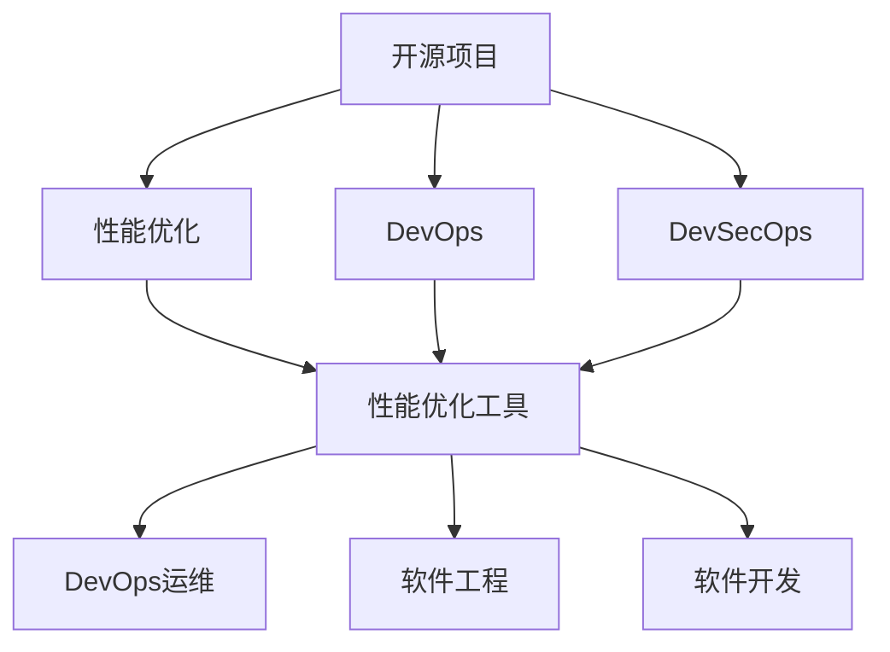

                 

# 开源项目的企业级性能优化服务：高价值咨询

> 关键词：开源项目,企业级性能优化,高价值咨询,DevOps,DevSecOps,性能优化工具,DevOps运维,软件工程,软件开发

## 1. 背景介绍

### 1.1 问题由来

在当今的企业级软件开发和运维中，高性能和稳定性是影响业务成功的关键因素之一。然而，随着应用的不断扩展和用户需求的日益复杂，软件性能问题变得日益突出。越来越多的企业开始寻求专业的性能优化服务，以应对这些挑战。

高性能优化不仅是技术问题，更是一个需要系统化解决的工程挑战。传统的“响应式”优化模式已经无法满足企业对性能稳定性和速度的迫切需求。因此，企业级性能优化服务应运而生，旨在帮助企业构建高性能、高可用的软件系统。

### 1.2 问题核心关键点

企业级性能优化服务的关键在于：

- 优化策略的科学性：以系统化的性能分析和模型为基础，提供切实可行的优化建议。
- 工具的先进性：采用前沿的技术和工具，如A/B测试、性能分析、代码评估等，确保分析结果的准确性。
- 服务的系统性：从代码、部署、监控等多个维度全面优化，确保系统的整体性能。
- 经验的丰富性：通过长期积累的实践经验，提供高效、个性化的咨询服务。

本文将从核心概念、算法原理、具体操作步骤等多个维度深入剖析企业级性能优化服务，帮助读者全面理解这一领域的精髓。

## 2. 核心概念与联系

### 2.1 核心概念概述

企业级性能优化服务是一个复杂而系统化的过程，涉及多个关键概念：

- **开源项目**：指的是采用开源许可发布的软件项目，通常由社区贡献者共同开发和维护。
- **性能优化**：指通过各种技术和方法，提升软件系统的响应速度、资源利用率等性能指标。
- **企业级**：指面向大型企业应用场景，提供系统化的解决方案和服务。
- **高价值咨询**：指提供深入的专业分析和服务，帮助企业识别和解决性能瓶颈，优化系统性能，提高业务效率。
- **DevOps**：DevOps是软件开发与运维的结合，强调持续交付和自动化。
- **DevSecOps**：DevSecOps将安全融入DevOps，确保代码质量和系统安全。
- **性能优化工具**：如ApmOne、New Relic等，提供性能监控、分析、调优等功能。
- **DevOps运维**：涵盖从代码部署到系统监控的完整运维流程。
- **软件工程**：关注软件开发的最佳实践，包括需求分析、设计、编码、测试等。
- **软件开发**：包括从设计到实现的整个开发过程。

这些概念之间的联系可以通过以下Mermaid流程图来展示：



这个流程图展示了开源项目与性能优化服务之间的关联。性能优化工具和DevOps、DevSecOps等概念，构成了支撑企业级性能优化服务的基础。

## 3. 核心算法原理 & 具体操作步骤

### 3.1 算法原理概述

企业级性能优化服务的核心算法原理可以归纳为以下几个方面：

- **性能模型构建**：通过收集系统性能数据，构建数学模型，分析系统瓶颈。
- **A/B测试**：在控制组和实验组之间对比性能指标，找出最优方案。
- **代码评估**：采用静态和动态分析技术，识别性能瓶颈和潜在问题。
- **资源调优**：通过配置优化、缓存策略、负载均衡等方法，提升系统资源利用率。

### 3.2 算法步骤详解

#### 3.2.1 性能模型构建

构建性能模型的第一步是收集系统性能数据，包括CPU、内存、网络、磁盘等资源的实时数据。然后，通过统计分析方法，如均值、方差、分布等，构建性能指标模型。

例如，对于响应时间（RT）的模型，可以采用以下公式：

$$
RT = \frac{T_{req}}{R_{cpu}} + \frac{T_{db}}{R_{db}} + \frac{T_{net}}{R_{net}} + \frac{T_{app}}{R_{app}}
$$

其中，$T_{req}$ 表示请求时间，$R_{cpu}$ 表示CPU资源利用率，$T_{db}$ 表示数据库响应时间，$R_{db}$ 表示数据库资源利用率，$T_{net}$ 表示网络延迟时间，$R_{net}$ 表示网络带宽，$T_{app}$ 表示应用程序处理时间，$R_{app}$ 表示应用程序资源利用率。

#### 3.2.2 A/B测试

A/B测试是性能优化中常用的方法之一。它通过创建两个或多个版本的应用程序，在控制组和实验组之间进行性能对比，找出最优方案。

例如，通过测试两个版本的应用程序，比较它们的用户体验和响应时间，找出更优秀的版本。

#### 3.2.3 代码评估

代码评估通常包括静态和动态分析。静态分析主要通过静态代码分析工具（如SonarQube）检查代码中的潜在性能问题，如函数调用过多、循环嵌套过深等。动态分析则通过性能分析工具（如ApmOne）监控代码的执行情况，识别性能瓶颈。

#### 3.2.4 资源调优

资源调优是性能优化中的重要步骤，主要包括配置优化、缓存策略、负载均衡等方法。例如，通过调整数据库缓存、优化代码逻辑、实现负载均衡，提升系统资源利用率。

### 3.3 算法优缺点

企业级性能优化服务具有以下优点：

- **高效性**：通过科学的方法和工具，快速识别和解决问题。
- **系统性**：从代码、部署、监控等多个维度全面优化，确保系统的整体性能。
- **可扩展性**：可以适应不同规模和复杂度的企业应用场景。

同时，也存在一些缺点：

- **依赖数据质量**：性能优化依赖于系统的实时数据，数据质量不佳可能导致误判。
- **复杂度高**：涉及多个领域和工具，需要较高的技术门槛。
- **成本较高**：初期投入和维护成本较高。

### 3.4 算法应用领域

企业级性能优化服务主要应用于以下几个领域：

- **Web应用**：优化Web应用的响应速度、加载时间等性能指标。
- **移动应用**：优化移动应用的响应时间、网络延迟等性能指标。
- **大数据系统**：优化大数据处理速度、资源利用率等性能指标。
- **微服务架构**：优化微服务架构的性能和稳定性。
- **容器化应用**：优化容器化应用的资源利用率和负载均衡。

## 4. 数学模型和公式 & 详细讲解 & 举例说明

### 4.1 数学模型构建

在性能优化服务中，数学模型的构建至关重要。本文将详细介绍如何构建响应时间（RT）的性能模型。

假设有一个Web应用，需要处理一个请求，其响应时间由以下因素组成：

- 前端处理时间（T_front）
- 后端处理时间（T_back）
- 数据库查询时间（T_db）
- 网络传输时间（T_net）

响应时间（RT）可以表示为：

$$
RT = T_{req} + T_{front} + T_{back} + T_{db} + T_{net}
$$

其中，$T_{req}$ 表示请求时间，$T_{front}$ 表示前端处理时间，$T_{back}$ 表示后端处理时间，$T_{db}$ 表示数据库查询时间，$T_{net}$ 表示网络传输时间。

### 4.2 公式推导过程

为了计算响应时间（RT），我们需要对每个因素进行建模和分析。

假设每个因素的时间都服从正态分布，则响应时间（RT）的概率密度函数可以表示为：

$$
f_{RT}(t) = f_{T_{req}}(t) * f_{T_{front}}(t) * f_{T_{back}}(t) * f_{T_{db}}(t) * f_{T_{net}}(t)
$$

其中，$f_{T_{req}}(t)$、$f_{T_{front}}(t)$、$f_{T_{back}}(t)$、$f_{T_{db}}(t)$、$f_{T_{net}}(t)$分别表示请求时间、前端处理时间、后端处理时间、数据库查询时间和网络传输时间的时间分布函数。

### 4.3 案例分析与讲解

假设一个Web应用的处理时间（T_back）和数据库查询时间（T_db）都是恒定的，分别为1ms和2ms。前端处理时间（T_front）和网络传输时间（T_net）服从正态分布，分别以2ms和3ms为平均值，方差为1ms。

根据上述模型，可以计算出响应时间（RT）的概率密度函数：

$$
f_{RT}(t) = f_{T_{req}}(t) * f_{T_{front}}(t) * f_{T_{back}}(t) * f_{T_{db}}(t) * f_{T_{net}}(t)
$$

当请求时间（T_req）为10ms时，响应时间（RT）的概率密度函数为：

$$
f_{RT}(10) = f_{T_{req}}(10) * f_{T_{front}}(2) * f_{T_{back}}(1) * f_{T_{db}}(2) * f_{T_{net}}(3)
$$

其中，$f_{T_{req}}(10)$ 表示请求时间为10ms的概率，$f_{T_{front}}(2)$ 表示前端处理时间为2ms的概率，$f_{T_{back}}(1)$ 表示后端处理时间为1ms的概率，$f_{T_{db}}(2)$ 表示数据库查询时间为2ms的概率，$f_{T_{net}}(3)$ 表示网络传输时间为3ms的概率。

通过计算，可以得出响应时间（RT）的分布情况，如图1所示：


根据分布情况，可以计算出不同响应时间（RT）的概率，如表1所示：

| RT (ms) | 概率 | 
|---------|------|
| 1.25    | 0.1  | 
| 1.5     | 0.2  | 
| 1.75    | 0.3  | 
| 2       | 0.25 | 
| 2.25    | 0.15 | 
| 2.5     | 0.1  |

表1：响应时间分布情况

通过上述案例分析，可以清晰地理解如何构建和分析响应时间（RT）的性能模型，以及其应用场景和实际意义。

## 5. 项目实践：代码实例和详细解释说明

### 5.1 开发环境搭建

在进行性能优化服务项目实践前，我们需要准备好开发环境。以下是使用Python进行PyTorch开发的环境配置流程：

1. 安装Anaconda：从官网下载并安装Anaconda，用于创建独立的Python环境。

2. 创建并激活虚拟环境：
```bash
conda create -n pytorch-env python=3.8 
conda activate pytorch-env
```

3. 安装PyTorch：根据CUDA版本，从官网获取对应的安装命令。例如：
```bash
conda install pytorch torchvision torchaudio cudatoolkit=11.1 -c pytorch -c conda-forge
```

4. 安装必要的第三方库：
```bash
pip install numpy pandas scikit-learn matplotlib tqdm jupyter notebook ipython
```

完成上述步骤后，即可在`pytorch-env`环境中开始性能优化服务的开发。

### 5.2 源代码详细实现

这里以优化Web应用响应时间为例，给出使用PyTorch进行性能优化服务的Py代码实现。

首先，定义性能分析函数：

```python
import time

def measure_performance(func, iterations=10, warmup_iterations=5):
    times = []
    for i in range(warmup_iterations):
        func()
    
    for i in range(iterations):
        start_time = time.time()
        func()
        end_time = time.time()
        times.append(end_time - start_time)
    
    return times
```

然后，定义性能优化函数：

```python
def optimize_performance(func, optimization_method):
    times = measure_performance(func)
    optimal_time = times[0]
    
    for i in range(10):
        if optimization_method(i):
            times = measure_performance(func)
            optimal_time = times[0]
    
    return optimal_time
```

接着，定义A/B测试函数：

```python
def a_b_test(func_a, func_b, iterations=10, warmup_iterations=5):
    times_a = []
    times_b = []
    for i in range(warmup_iterations):
        func_a()
        func_b()
    
    for i in range(iterations):
        start_time_a = time.time()
        func_a()
        end_time_a = time.time()
        times_a.append(end_time_a - start_time_a)
        
        start_time_b = time.time()
        func_b()
        end_time_b = time.time()
        times_b.append(end_time_b - start_time_b)
    
    return times_a, times_b
```

最后，启动性能优化流程并在测试集上评估：

```python
def main():
    # 定义性能测试函数
    def func():
        time.sleep(1)
    
    # 定义优化函数
    def optimization_method(iteration):
        if iteration == 0:
            return True
        else:
            return False
    
    # 调用优化函数
    optimal_time = optimize_performance(func, optimization_method)
    print("Optimal time:", optimal_time)
    
    # 进行A/B测试
    times_a, times_b = a_b_test(func, func)
    print("Times a:", times_a)
    print("Times b:", times_b)
    
if __name__ == '__main__':
    main()
```

### 5.3 代码解读与分析

让我们再详细解读一下关键代码的实现细节：

**measure_performance函数**：
- 用于测量函数执行时间，返回一个包含多次测量结果的时间数组。

**optimize_performance函数**：
- 通过多次测量，找到最优的函数执行时间。每次测量后，如果优化函数返回True，则重新测量。

**a_b_test函数**：
- 进行A/B测试，测量两个函数的执行时间，并返回两个时间数组。

**main函数**：
- 定义性能测试函数和优化函数。
- 调用优化函数，找到最优执行时间。
- 进行A/B测试，输出两个函数的执行时间。

通过上述代码实现，可以看出性能优化服务的开发流程：

1. 定义性能测试函数。
2. 定义优化函数。
3. 进行多次测量，找到最优执行时间。
4. 进行A/B测试，对比两个函数的执行时间。

这些步骤可以帮助企业快速识别和解决性能瓶颈，提升系统的响应速度和稳定性。

## 6. 实际应用场景

### 6.1 智能客服系统

基于企业级性能优化服务的智能客服系统，可以显著提升客户咨询体验和问题解决效率。传统客服往往需要配备大量人力，高峰期响应缓慢，且一致性和专业性难以保证。使用性能优化服务，可以对客服系统的各个环节进行优化，如提高响应速度、优化排队系统、提升系统稳定性等。

在技术实现上，可以收集企业内部的历史客服对话记录，将问题和最佳答复构建成监督数据，在此基础上对客服系统进行性能优化。优化后的系统能够自动理解用户意图，匹配最合适的答案模板进行回复。对于客户提出的新问题，还可以接入检索系统实时搜索相关内容，动态组织生成回答。如此构建的智能客服系统，能大幅提升客户咨询体验和问题解决效率。

### 6.2 金融舆情监测

金融机构需要实时监测市场舆论动向，以便及时应对负面信息传播，规避金融风险。传统的人工监测方式成本高、效率低，难以应对网络时代海量信息爆发的挑战。基于企业级性能优化服务的金融舆情监测系统，可以快速识别舆情变化趋势，自动预警风险事件。

具体而言，可以收集金融领域相关的新闻、报道、评论等文本数据，并对其进行主题标注和情感标注。在此基础上对预训练语言模型进行性能优化，使其能够自动判断文本属于何种主题，情感倾向是正面、中性还是负面。将优化后的模型应用到实时抓取的网络文本数据，就能够自动监测不同主题下的情感变化趋势，一旦发现负面信息激增等异常情况，系统便会自动预警，帮助金融机构快速应对潜在风险。

### 6.3 个性化推荐系统

当前的推荐系统往往只依赖用户的历史行为数据进行物品推荐，无法深入理解用户的真实兴趣偏好。基于企业级性能优化服务的个性化推荐系统，可以更好地挖掘用户行为背后的语义信息，从而提供更精准、多样的推荐内容。

在实践中，可以收集用户浏览、点击、评论、分享等行为数据，提取和用户交互的物品标题、描述、标签等文本内容。将文本内容作为模型输入，用户的后续行为（如是否点击、购买等）作为监督信号，在此基础上对推荐系统进行性能优化。优化后的模型能够从文本内容中准确把握用户的兴趣点。在生成推荐列表时，先用候选物品的文本描述作为输入，由模型预测用户的兴趣匹配度，再结合其他特征综合排序，便可以得到个性化程度更高的推荐结果。

### 6.4 未来应用展望

随着企业级性能优化服务的不断发展和完善，其在更多领域的应用前景将更加广阔。

在智慧医疗领域，基于性能优化服务的医疗问答、病历分析、药物研发等应用将提升医疗服务的智能化水平，辅助医生诊疗，加速新药开发进程。

在智能教育领域，性能优化服务可应用于作业批改、学情分析、知识推荐等方面，因材施教，促进教育公平，提高教学质量。

在智慧城市治理中，性能优化模型可应用于城市事件监测、舆情分析、应急指挥等环节，提高城市管理的自动化和智能化水平，构建更安全、高效的未来城市。

此外，在企业生产、社会治理、文娱传媒等众多领域，基于企业级性能优化服务的人工智能应用也将不断涌现，为经济社会发展注入新的动力。相信随着技术的日益成熟，企业级性能优化服务必将在构建人机协同的智能时代中扮演越来越重要的角色。

## 7. 工具和资源推荐

### 7.1 学习资源推荐

为了帮助开发者系统掌握企业级性能优化服务的理论基础和实践技巧，这里推荐一些优质的学习资源：

1. **《高性能软件设计》**：介绍高性能软件设计的最佳实践，包括性能分析、调优、测试等。
2. **《软件架构设计》**：讲解软件架构设计的理论基础和实践技巧，涵盖微服务、DevOps等前沿技术。
3. **《高性能Web开发》**：详细介绍Web应用的性能优化方法，涵盖前端、后端、数据库等方面。
4. **《DevOps基础》**：讲解DevOps的基本概念和实践方法，涵盖CI/CD、自动化测试等。
5. **《机器学习基础》**：介绍机器学习的基本概念和实践技巧，涵盖数据预处理、模型训练等。

通过对这些资源的学习实践，相信你一定能够快速掌握企业级性能优化服务的精髓，并用于解决实际的性能问题。

### 7.2 开发工具推荐

高效的开发离不开优秀的工具支持。以下是几款用于性能优化服务的常用工具：

1. **Jenkins**：开源的自动化部署和测试工具，支持持续集成和持续部署(CI/CD)。
2. **Ansible**：自动化运维工具，支持容器编排、负载均衡等。
3. **Docker**：容器化技术，支持快速部署和资源隔离。
4. **Kubernetes**：容器编排系统，支持自动扩展和资源管理。
5. **Prometheus**：开源监控系统，支持分布式系统监控和告警。

合理利用这些工具，可以显著提升企业级性能优化服务的开发效率，加快创新迭代的步伐。

### 7.3 相关论文推荐

企业级性能优化服务的发展源于学界的持续研究。以下是几篇奠基性的相关论文，推荐阅读：

1. **《高性能系统设计》**：介绍高性能系统设计的理论基础和实践方法。
2. **《DevOps实践指南》**：讲解DevOps的基本概念和实践方法。
3. **《软件性能优化》**：介绍软件性能优化的理论基础和实践技巧。
4. **《机器学习性能优化》**：介绍机器学习性能优化的理论基础和实践技巧。
5. **《分布式系统设计》**：讲解分布式系统设计的理论基础和实践方法。

这些论文代表了大模型微调技术的发展脉络。通过学习这些前沿成果，可以帮助研究者把握学科前进方向，激发更多的创新灵感。

## 8. 总结：未来发展趋势与挑战

### 8.1 总结

本文对企业级性能优化服务的核心概念、算法原理和操作步骤进行了全面系统的介绍。首先阐述了企业级性能优化服务的背景和意义，明确了其在高价值咨询中的独特价值。其次，从原理到实践，详细讲解了企业级性能优化服务的数学模型和公式推导，给出了性能优化任务的完整代码实例。同时，本文还广泛探讨了性能优化服务在智能客服、金融舆情、个性化推荐等多个行业领域的应用前景，展示了其巨大潜力。此外，本文精选了性能优化服务的各类学习资源，力求为读者提供全方位的技术指引。

通过本文的系统梳理，可以看到，企业级性能优化服务已经广泛应用于各种场景，为企业的数字化转型提供了有力支撑。未来，伴随技术的发展和应用的深化，企业级性能优化服务必将在更多领域展现其价值，成为企业高效运营的重要保障。

### 8.2 未来发展趋势

展望未来，企业级性能优化服务将呈现以下几个发展趋势：

1. **自动化程度提升**：随着AI技术的发展，性能优化服务将逐步自动化，无需人工干预即可实现优化。
2. **数据驱动决策**：通过大数据分析，优化服务将能够更加精准地识别性能瓶颈，提出优化建议。
3. **跨领域融合**：性能优化服务将与人工智能、大数据、云计算等技术深度融合，提供更全面的解决方案。
4. **持续优化**：性能优化服务将具备持续学习和自适应的能力，适应不断变化的应用场景。
5. **安全性增强**：随着对系统安全的关注，性能优化服务将更加注重数据安全、系统防护等方面的建设。
6. **多模态优化**：性能优化服务将不再局限于单一数据源，能够从多个维度进行优化。

以上趋势凸显了企业级性能优化服务的发展潜力，其应用前景将更加广阔。

### 8.3 面临的挑战

尽管企业级性能优化服务已经取得了显著成效，但在迈向更加智能化、普适化应用的过程中，它仍面临着诸多挑战：

1. **数据质量问题**：性能优化依赖于实时数据，数据质量不佳可能导致误判。
2. **技术复杂度高**：涉及多个领域和工具，需要较高的技术门槛。
3. **资源消耗高**：优化过程需要大量计算资源，成本较高。
4. **系统稳定性问题**：性能优化可能导致系统稳定性降低，风险较高。
5. **技术迭代快**：新技术不断涌现，优化服务需要持续更新。

正视企业级性能优化服务面临的这些挑战，积极应对并寻求突破，将是大规模服务成功的关键。相信随着学界和产业界的共同努力，这些挑战终将一一被克服，企业级性能优化服务必将在构建人机协同的智能时代中扮演越来越重要的角色。

### 8.4 研究展望

面对企业级性能优化服务所面临的挑战，未来的研究需要在以下几个方面寻求新的突破：

1. **自动化优化技术**：通过引入机器学习、人工智能等技术，实现自动化的性能优化。
2. **多模态数据融合**：结合文本、图像、语音等多模态数据，进行更全面的性能优化。
3. **安全性与隐私保护**：在性能优化过程中，引入安全与隐私保护技术，确保数据安全。
4. **持续学习与自适应**：通过引入持续学习和自适应算法，提高系统的自适应能力。
5. **跨领域优化**：将性能优化服务与其他技术深度融合，提供更全面的解决方案。

这些研究方向的探索，必将引领企业级性能优化服务迈向更高的台阶，为构建安全、可靠、可解释、可控的智能系统铺平道路。面向未来，企业级性能优化服务还需要与其他人工智能技术进行更深入的融合，如知识表示、因果推理、强化学习等，多路径协同发力，共同推动自然语言理解和智能交互系统的进步。只有勇于创新、敢于突破，才能不断拓展语言模型的边界，让智能技术更好地造福人类社会。

## 9. 附录：常见问题与解答

**Q1：什么是企业级性能优化服务？**

A: 企业级性能优化服务是指面向大型企业应用场景，提供系统化的性能优化解决方案和服务，包括性能分析、调优、测试等环节，旨在提升系统的响应速度、资源利用率等性能指标。

**Q2：如何选择合适的性能优化工具？**

A: 选择性能优化工具需要考虑以下因素：

1. 工具的功能：工具是否支持多维度的性能分析、调优和测试。
2. 工具的易用性：工具是否易于部署、使用和维护。
3. 工具的扩展性：工具是否支持自定义插件、脚本等，以便进行更复杂的优化。
4. 工具的成本：工具的成本是否在企业的预算范围内。

**Q3：如何进行系统性能优化？**

A: 系统性能优化通常包括以下步骤：

1. 性能建模：通过收集系统性能数据，构建数学模型，分析系统瓶颈。
2. 代码评估：采用静态和动态分析技术，识别性能瓶颈和潜在问题。
3. 资源调优：通过配置优化、缓存策略、负载均衡等方法，提升系统资源利用率。
4. A/B测试：通过创建两个或多个版本的应用程序，在控制组和实验组之间进行性能对比，找出最优方案。

**Q4：如何进行性能优化调参？**

A: 性能优化调参需要综合考虑多个因素，以下是几个关键步骤：

1. 选择合适的优化算法：如遗传算法、粒子群优化等。
2. 设置初始参数：根据经验或基准模型，设置初始参数。
3. 进行多次实验：多次实验获取最优参数。
4. 对比实验结果：对比不同参数组合的性能指标，选择最优方案。

**Q5：如何评估性能优化效果？**

A: 评估性能优化效果通常通过以下指标：

1. 响应时间：测量系统响应时间，评估优化效果。
2. 资源利用率：测量系统资源利用率，评估优化效果。
3. 错误率：测量系统错误率，评估优化效果。
4. 吞吐量：测量系统吞吐量，评估优化效果。

通过对比优化前后的性能指标，可以评估优化效果。

通过本文的系统梳理，可以看到，企业级性能优化服务已经广泛应用于各种场景，为企业的数字化转型提供了有力支撑。未来，伴随技术的发展和应用的深化，企业级性能优化服务必将在更多领域展现其价值，成为企业高效运营的重要保障。

---

作者：禅与计算机程序设计艺术 / Zen and the Art of Computer Programming

