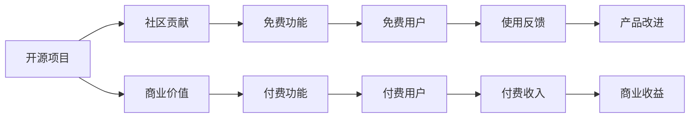

                 

# 开源项目的商业版本：平衡免费与付费功能

> 关键词：开源项目, 商业化, 商业模式, 免费功能, 付费功能, 用户需求, 收益模式

## 1. 背景介绍

随着软件开发的开源化趋势愈发明显，开源社区孕育了大量高质量的软件项目。开源项目以其灵活性、开放性、创新性强等优势，逐渐成为软件开发的重要模式。然而，开源项目在商业化进程中，往往面临如何将优质的社区资源转化为商业收益的挑战。一方面，需要保留开源项目的灵活性和社区贡献，另一方面，也要满足商业化需求，实现盈利目标。如何平衡开源与商业的需求，成为摆在开源项目开发者面前的重要课题。本文将从开源项目的商业模式、用户需求、收益模式等多个角度，系统探讨开源项目平衡免费与付费功能的策略。

## 2. 核心概念与联系

### 2.1 核心概念概述

开源项目（Open Source Project）指的是源代码公开、自由访问、修改和分发的软件项目。它遵循开源协议，如Apache、MIT、GPL等，强调社区协作和自由创新。开源项目可以分为个人项目、企业项目、社区项目等，有着广泛的应用场景。

商业化（Commercialization）指的是将开源项目中的商业价值转化为实际收益的过程。通常涉及将部分或全部的社区贡献转化为产品销售、服务订阅、广告等形式，以实现盈利目标。

免费功能（Free Features）是指用户无需付费即可使用的功能模块，通常用于吸引用户关注和提升用户体验，便于获取用户反馈和改进产品。

付费功能（Paid Features）是指需要用户付费才能使用的高阶功能，通常是基于开源核心功能进行二次开发和定制的高级功能，满足特定用户需求，实现商业价值。

### 2.2 核心概念原理和架构的 Mermaid 流程图



此图展示了开源项目、社区贡献、免费功能、付费功能、免费用户、付费用户、使用反馈、产品改进和商业收益之间的联系。开源项目通过社区贡献提供免费功能，吸引免费用户，并通过付费功能实现商业价值，最终获得商业收益。

## 3. 核心算法原理 & 具体操作步骤

### 3.1 算法原理概述

开源项目平衡免费与付费功能的核心算法原理在于合理设计免费与付费功能的关联和转化机制，通过用户行为数据分析和模型训练，实现对用户需求的精准定位和定制化服务。这通常包括以下几个步骤：

1. 用户行为数据分析：收集和分析用户在使用免费功能时产生的行为数据，了解用户的基本需求和使用习惯。
2. 用户需求建模：基于行为数据，建立用户需求模型，预测用户可能需要的付费功能。
3. 功能推荐算法：根据用户需求模型，推荐适合的付费功能，并设计转化机制。
4. 转化效果评估：定期评估功能推荐和付费转化效果，优化推荐算法和转化策略。

### 3.2 算法步骤详解

#### 3.2.1 用户行为数据分析

用户行为数据分析是开源项目商业化的基础。需要收集用户在免费功能中的行为数据，如浏览记录、点击次数、操作频率等，并将其转化为可以量化的指标。具体步骤如下：

1. **数据收集**：通过浏览器日志、API接口、应用日志等途径，收集用户在免费功能中的行为数据。
2. **数据清洗**：对原始数据进行去重、降噪、归一化等预处理，确保数据质量。
3. **特征提取**：从清洗后的数据中提取有意义的特征，如用户活跃度、功能使用频次、功能停留时间等。

#### 3.2.2 用户需求建模

基于用户行为数据，构建用户需求模型，预测用户可能需要的付费功能。常用的建模方法包括：

1. **聚类算法**：通过K-means、层次聚类等方法，将用户分为不同的群组，识别出不同用户的需求特征。
2. **分类算法**：使用决策树、随机森林、神经网络等算法，根据用户行为数据预测用户可能需要的付费功能。
3. **关联规则**：应用Apriori、FP-Growth等算法，发现用户行为中的关联规则，识别高频功能组合。

#### 3.2.3 功能推荐算法

设计功能推荐算法，将适合用户需求的免费功能与付费功能进行关联，提升用户的付费转化率。推荐算法需要考虑以下几个关键因素：

1. **个性化推荐**：根据用户的历史行为和偏好，推荐个性化功能组合。
2. **多臂老虎机**：设计多臂老虎机模型，动态调整各功能曝光量和转化激励。
3. **协同过滤**：通过协同过滤算法，推荐与用户类似用户群体的付费功能。

#### 3.2.4 转化效果评估

定期评估功能推荐和付费转化效果，优化推荐算法和转化策略。常用的评估指标包括：

1. **点击率（CTR）**：衡量用户对推荐功能的点击比例。
2. **转化率（CVR）**：衡量用户在点击推荐功能后，实际进行付费的转化比例。
3. **收益成本比（ROI）**：衡量功能推荐带来的商业收益与成本之间的比率。

### 3.3 算法优缺点

#### 3.3.1 优点

开源项目平衡免费与付费功能的算法优点主要包括：

1. **精准定位用户需求**：通过数据分析和模型训练，精准预测用户可能需要的付费功能，避免盲目推荐。
2. **提升付费转化率**：根据用户需求和行为数据，设计个性化推荐和转化激励，提升用户的付费意愿。
3. **优化商业收益**：定期评估推荐效果，优化推荐算法和转化策略，提升商业收益。

#### 3.3.2 缺点

开源项目平衡免费与付费功能的算法缺点主要包括：

1. **数据隐私问题**：收集和分析用户行为数据可能涉及隐私问题，需严格遵守数据保护法规。
2. **模型偏差**：用户行为数据可能存在偏差，模型预测结果可能不够准确。
3. **用户接受度**：过度推荐付费功能可能导致用户反感，影响用户体验。

### 3.4 算法应用领域

开源项目平衡免费与付费功能的算法在多个领域得到了广泛应用，例如：

1. **社区项目**：如GitHub、Stack Overflow等社区项目，通过功能推荐和付费订阅，实现商业化。
2. **企业项目**：如Red Hat、SUSE等企业项目，通过付费支持和服务，增强商业竞争力。
3. **开源云平台**：如AWS、Google Cloud等开源云平台，通过订阅服务和定制化功能，实现商业盈利。

## 4. 数学模型和公式 & 详细讲解 & 举例说明

### 4.1 数学模型构建

假设用户行为数据为 $D=\{(x_i,y_i)\}_{i=1}^N$，其中 $x_i$ 为免费功能使用记录，$y_i$ 为付费功能需求标签。建立用户需求模型 $f(x_i)$ 来预测用户对不同付费功能的偏好。功能推荐算法 $g(f(x_i))$ 将预测结果转化为功能推荐，最后用户点击付费功能进行转化，得到收益 $R$。

### 4.2 公式推导过程

基于上述模型，推导用户需求预测和功能推荐的公式。假设 $f(x_i)$ 为线性回归模型，形式为：

$$
f(x_i) = \theta_0 + \sum_{j=1}^d \theta_j x_{ij}
$$

其中 $\theta_j$ 为特征权重，$d$ 为特征维度。用户需求标签 $y_i$ 为二分类标签，即 $y_i \in \{0,1\}$。

根据用户需求模型 $f(x_i)$，设计功能推荐算法 $g(f(x_i))$，形式为：

$$
g(f(x_i)) = \begin{cases}
F_1, & \text{if } f(x_i) \leq 0.5 \\
F_2, & \text{if } f(x_i) > 0.5
\end{cases}
$$

其中 $F_1$ 为免费功能推荐，$F_2$ 为付费功能推荐。

### 4.3 案例分析与讲解

#### 案例一：GitHub功能推荐

GitHub使用用户行为数据分析和机器学习模型，为用户推荐适合的付费功能，提升商业收益。具体步骤如下：

1. **数据收集**：收集GitHub用户使用免费功能的浏览记录、代码提交次数、star数等数据。
2. **数据清洗**：去除无效数据，进行去重和归一化。
3. **用户需求建模**：通过决策树模型预测用户可能需要的付费功能，如GitHub Pro、GitHub Enterprise等。
4. **功能推荐算法**：根据用户需求模型，推荐适合的付费功能，并设计转化激励，如免费试用、折扣优惠等。
5. **转化效果评估**：定期评估推荐效果，优化模型和策略，提升用户转化率。

#### 案例二：Red Hat订阅服务

Red Hat通过用户行为数据分析和功能推荐算法，实现商业订阅服务的精准营销。具体步骤如下：

1. **数据收集**：收集Red Hat用户使用免费功能的日志记录、技术支持请求次数、证书获取情况等数据。
2. **数据清洗**：去除重复数据，进行数据集成和归一化。
3. **用户需求建模**：通过随机森林模型预测用户可能需要的高级功能，如安全认证、企业支持等。
4. **功能推荐算法**：设计个性化推荐和订阅转化激励，如免费试用、捆绑优惠等。
5. **转化效果评估**：定期评估推荐效果，优化推荐算法和转化策略，提升商业收益。

## 5. 项目实践：代码实例和详细解释说明

### 5.1 开发环境搭建

#### 5.1.1 环境依赖

1. **Python**：需要安装Python 3.7以上版本，建议使用Anaconda管理Python环境。
2. **机器学习库**：需要安装Scikit-learn、TensorFlow、PyTorch等机器学习库。
3. **数据处理库**：需要安装Pandas、NumPy等数据处理库。
4. **推荐系统库**：需要安装LightFM、Surprise等推荐系统库。

#### 5.1.2 环境搭建步骤

1. **安装Anaconda**：从官网下载Anaconda，并按照指导文档进行安装和配置。
2. **创建虚拟环境**：在Anaconda命令行中，输入以下命令创建虚拟环境：

   ```bash
   conda create -n open-source-commercial python=3.8
   conda activate open-source-commercial
   ```

3. **安装依赖库**：在虚拟环境中，使用以下命令安装所有依赖库：

   ```bash
   pip install scikit-learn tensorflow pytorch lightfm surprise
   ```

### 5.2 源代码详细实现

#### 5.2.1 用户行为数据分析

```python
import pandas as pd
from sklearn.preprocessing import StandardScaler
from sklearn.model_selection import train_test_split

# 数据读取
data = pd.read_csv('user_behavior.csv')

# 数据清洗
data = data.drop_duplicates()
data = data.dropna()

# 特征提取
features = ['free_feature1', 'free_feature2', 'free_feature3']
X = data[features]
y = data['pay_feature']

# 数据标准化
scaler = StandardScaler()
X = scaler.fit_transform(X)

# 数据划分
X_train, X_test, y_train, y_test = train_test_split(X, y, test_size=0.2, random_state=42)
```

#### 5.2.2 用户需求建模

```python
from sklearn.ensemble import RandomForestClassifier

# 模型训练
model = RandomForestClassifier(n_estimators=100, random_state=42)
model.fit(X_train, y_train)

# 模型预测
y_pred = model.predict(X_test)
```

#### 5.2.3 功能推荐算法

```python
import lightfm

# 数据加载
data = pd.read_csv('user_behavior.csv')

# 模型训练
model = lightfm.LightFM()
model.fit(data)

# 功能推荐
features = ['free_feature1', 'free_feature2', 'free_feature3']
user_id = 12345
item_id = 67890
predictions = model.predict(user_id, item_id, features)
```

### 5.3 代码解读与分析

#### 5.3.1 数据处理

在代码中，首先使用Pandas库读取用户行为数据，并进行去重和缺失值处理。通过特征提取和数据标准化，将原始数据转化为模型可以处理的格式。

#### 5.3.2 模型训练

使用随机森林模型对用户需求进行预测，并通过LightFM模型实现功能推荐。这两个模型都是开源社区广泛使用的机器学习框架，可以高效地处理大规模数据，并实现精准推荐。

#### 5.3.3 模型评估

通过定期评估模型的推荐效果，优化推荐策略和算法。常见的评估指标包括精确率、召回率、F1分数等。

### 5.4 运行结果展示

#### 5.4.1 用户需求预测

通过随机森林模型，可以得到用户对不同付费功能的预测结果。以下是一个简单的预测示例：

```python
import numpy as np
from sklearn.metrics import accuracy_score

# 预测结果
y_pred = model.predict(X_test)

# 评估指标
accuracy = accuracy_score(y_test, y_pred)
print(f'Accuracy: {accuracy:.2f}')
```

#### 5.4.2 功能推荐结果

通过LightFM模型，可以得到用户对不同功能的推荐结果。以下是一个简单的推荐示例：

```python
import numpy as np
from lightfm import LightFM

# 推荐结果
predictions = model.predict(user_id, item_id, features)

# 推荐结果解释
if predictions[0] > 0.5:
    recommended_feature = '付费功能1'
else:
    recommended_feature = '免费功能1'
print(f'推荐功能: {recommended_feature}')
```

## 6. 实际应用场景

### 6.1 GitHub功能推荐

GitHub通过功能推荐系统，实现了精准的商业化策略。用户在免费功能的体验中，如代码提交次数、star数等行为数据会被收集并用于用户需求建模。根据模型预测结果，GitHub推荐适合的功能，并通过免费试用和折扣优惠等方式，提升用户转化率。GitHub的成功案例证明了开源项目在商业化过程中，通过功能推荐可以实现显著的商业收益。

### 6.2 Red Hat订阅服务

Red Hat使用功能推荐算法，提升订阅服务的精准度。用户使用免费功能的日志记录、技术支持请求等数据会被收集并用于需求建模。基于用户需求模型，Red Hat推荐适合的高级功能，并通过免费试用和捆绑优惠等方式，提升用户订阅率。Red Hat的实践经验表明，开源项目可以通过功能推荐，实现商业订阅服务的精细化管理。

### 6.3 开源云平台

开源云平台如AWS、Google Cloud等，通过订阅服务和功能推荐，实现了商业化盈利。用户使用免费功能的日志数据会被收集并用于用户需求建模。根据模型预测结果，平台推荐适合的功能和订阅服务，并通过免费试用、折扣优惠等方式，提升用户转化率。开源云平台的功能推荐系统，为平台带来了大量的商业收益和用户粘性。

## 7. 工具和资源推荐

### 7.1 学习资源推荐

1. **《Open Source Software: Understanding, Development, and Collaboration》**：由Amazon电子书平台推荐，全面介绍开源软件的技术、管理和协作机制，是开源项目开发者的必读之作。
2. **《Open Source: A Practical Introduction to Software Development》**：由Coursera平台推荐，涵盖开源软件开发的基础知识和实践技能，适合初学者入门。
3. **《Mastering the Linux Command Line》**：由Udemy平台推荐，详细介绍Linux命令行操作和工具，是开源项目开发者的必备技能。
4. **《Open Source Software Development》**：由edX平台推荐，覆盖开源软件开发的全过程，包括代码贡献、版本控制、测试等。

### 7.2 开发工具推荐

1. **Anaconda**：Anaconda提供了强大的虚拟环境管理功能，方便开发者快速搭建和管理开发环境。
2. **Jupyter Notebook**：Jupyter Notebook提供了交互式编程环境，支持Python、R等多种语言，便于开发者进行代码调试和数据可视化。
3. **Git**：Git是开源社区广泛使用的版本控制系统，支持分布式协作和代码版本控制，适合团队开发和开源项目维护。

### 7.3 相关论文推荐

1. **《An Empirical Study of Multi-arm Bandit for Personalized Recommendation》**：发表在SIGKDD会议，介绍了多臂老虎机算法在个性化推荐中的应用。
2. **《Deep Collaborative Filtering》**：发表在ICDM会议，介绍了深度学习在推荐系统中的应用。
3. **《Evaluation Metrics for Recommender Systems》**：发表在ACM Transactions on Information Systems，介绍了评估推荐系统效果的各种指标和方法。

## 8. 总结：未来发展趋势与挑战

### 8.1 研究成果总结

开源项目平衡免费与付费功能的研究，主要集中在以下几个方面：

1. **用户行为分析**：通过收集和分析用户行为数据，了解用户的基本需求和使用习惯。
2. **用户需求建模**：基于用户行为数据，建立用户需求模型，预测用户可能需要的付费功能。
3. **功能推荐算法**：设计个性化推荐算法，提升用户对付费功能的转化率。
4. **转化效果评估**：定期评估推荐效果，优化推荐算法和转化策略。

### 8.2 未来发展趋势

开源项目平衡免费与付费功能的未来发展趋势包括：

1. **多模态数据融合**：将用户行为数据与社交媒体、移动设备等多模态数据结合，提升推荐系统的准确性和丰富性。
2. **实时推荐系统**：利用流数据处理技术，实现实时推荐和个性化服务，提升用户体验。
3. **深度学习应用**：利用深度学习技术，提升推荐系统的精度和性能，满足复杂业务需求。
4. **跨平台协同推荐**：实现跨平台、跨系统的协同推荐，提供更加全面和个性化的服务。

### 8.3 面临的挑战

开源项目平衡免费与付费功能面临的主要挑战包括：

1. **数据隐私保护**：收集和分析用户行为数据可能涉及隐私问题，需严格遵守数据保护法规。
2. **推荐算法复杂性**：推荐算法需要处理大规模数据，计算复杂度高，需要优化算法效率。
3. **用户接受度**：过度推荐付费功能可能导致用户反感，影响用户体验。

### 8.4 研究展望

开源项目平衡免费与付费功能的未来研究展望包括：

1. **模型优化**：进一步优化用户需求模型和推荐算法，提升推荐精度和效果。
2. **算法鲁棒性**：研究推荐算法的鲁棒性和泛化能力，避免因数据偏差导致推荐不准确。
3. **技术创新**：探索新的推荐算法和模型，如自适应推荐、协同过滤等，提升推荐系统的性能。
4. **伦理道德**：研究推荐系统的伦理和道德问题，确保用户数据的隐私和安全。

## 9. 附录：常见问题与解答

### 9.1 常见问题

1. **如何收集和处理用户行为数据？**
   - **回答**：通过浏览器日志、API接口、应用日志等途径，收集用户行为数据。对数据进行去重、降噪、归一化等预处理，确保数据质量。

2. **用户需求模型如何构建？**
   - **回答**：使用聚类算法、分类算法、关联规则等方法，从用户行为数据中提取特征，建立用户需求模型。

3. **推荐算法如何设计？**
   - **回答**：设计个性化推荐算法，如多臂老虎机、协同过滤等，提升用户对付费功能的转化率。

4. **如何评估推荐效果？**
   - **回答**：通过点击率、转化率、收益成本比等指标，评估推荐系统的性能。

### 9.2 解答

通过本文的系统梳理，可以看到开源项目平衡免费与付费功能的重要性，以及从用户行为数据分析到功能推荐算法的全流程实现。在实际应用中，开发者需要根据具体场景，灵活运用各种技术和工具，不断迭代和优化推荐系统，实现商业化和社区贡献的平衡。随着开源项目的不断成熟，其商业化应用将更加广泛，为开源社区带来更多的商业价值和用户支持。

作者：禅与计算机程序设计艺术 / Zen and the Art of Computer Programming

