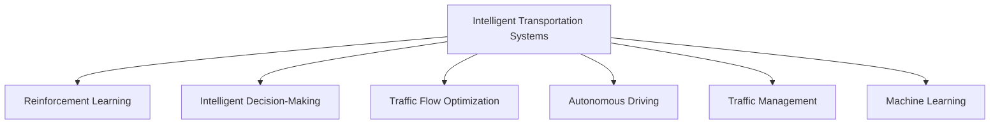

                 

# 强化学习Reinforcement Learning在智慧交通系统中的创新应用

> 关键词：强化学习,智慧交通,智能决策,交通流量优化,自动驾驶,交通管理,机器学习,智能交通系统

## 1. 背景介绍

### 1.1 问题由来

随着城市化进程的加快和机动车数量的增长，交通拥堵已成为许多大城市面临的严峻问题。交通拥堵不仅影响人们的出行效率，还对环境产生负面影响。智慧交通系统（Intelligent Transportation Systems, ITS）是解决这一问题的有效手段。通过智能化手段，智慧交通系统能够实时监测和管理交通状况，提高交通效率，降低拥堵风险。

### 1.2 问题核心关键点

目前，智慧交通系统主要依赖于各种传感器、摄像头和数据采集设备，以及交通管理中心对数据进行分析和处理。这些系统能够实现交通流量监测、信号灯控制、交通事件管理等功能，但整体效率仍受到数据实时性和精度等因素的限制。因此，如何利用数据和算法优化交通流量，成为提高智慧交通系统性能的重要课题。

强化学习（Reinforcement Learning, RL）作为一种有效的机器学习方法，通过试错机制学习最佳决策，在许多复杂系统优化中展现出强大的应用潜力。本文聚焦于强化学习在智慧交通系统中的应用，探讨如何通过RL技术优化交通流量管理、提升智能决策的效率和准确性。

## 2. 核心概念与联系

### 2.1 核心概念概述

为更好地理解强化学习在智慧交通系统中的应用，本节将介绍几个密切相关的核心概念：

- 强化学习（Reinforcement Learning, RL）：一种通过智能体与环境互动学习最优决策的机器学习方法。智能体根据环境反馈调整策略，逐步学习最优行为模式。

- 智能决策（Intelligent Decision-Making）：通过数据分析和模型训练，实现复杂环境中的智能决策。在智慧交通系统中，智能决策包括交通流量预测、信号灯控制、路线规划等。

- 交通流量优化（Traffic Flow Optimization）：通过算法调整，优化交通流动的方向、速度和分布，降低拥堵，提高道路通行效率。

- 自动驾驶（Autonomous Driving）：指车辆能够自主感知周围环境，并自主决策行驶路线和速度的驾驶方式。自动驾驶是智能交通系统的重要应用之一。

- 交通管理（Traffic Management）：通过信号灯控制、交通流监测和事件处理等手段，协调交通流，提高道路通行能力。

- 机器学习（Machine Learning, ML）：一种使计算机从数据中学习并改进性能的技术，包括监督学习、无监督学习和强化学习等。

这些核心概念之间的逻辑关系可以通过以下Mermaid流程图来展示：



这个流程图展示了他的核心概念及其之间的关系：

1. 智能交通系统通过强化学习等机器学习技术实现智能决策。
2. 智能决策通过交通流量优化等手段提升交通效率。
3. 自动驾驶是智能决策的重要应用之一。
4. 交通管理通过智能决策和交通流量优化等手段协调交通流。
5. 机器学习提供了智能决策和交通流量优化等功能的实现手段。

这些概念共同构成了智慧交通系统的技术框架，使其能够在各种场景下发挥其智能化的优势。通过理解这些核心概念，我们可以更好地把握强化学习在智慧交通系统中的应用价值。

## 3. 核心算法原理 & 具体操作步骤
### 3.1 算法原理概述

强化学习在智慧交通系统中的应用，主要基于以下两个核心要素：

- 智能体（Agent）：代表智慧交通系统中的决策者，如信号灯控制器、车辆控制器等。
- 环境（Environment）：代表智能体所处的交通状况，包括交通流量、信号灯状态、道路条件等。

在RL框架下，智能体通过与环境的互动，逐步学习最优的决策策略。智能体的决策通过环境反馈进行奖励或惩罚，以优化决策效果。

### 3.2 算法步骤详解

强化学习在智慧交通系统中的应用，主要分为以下几个关键步骤：

**Step 1: 设计智能体和环境**

- 智能体的设计：根据具体应用场景，设计合适的智能体。例如，信号灯控制器可以视为智能体，通过控制信号灯状态来优化交通流量。
- 环境的设计：定义智能体所处的交通环境，包括道路网络、交通流量、信号灯状态等。

**Step 2: 确定奖励函数**

- 设计奖励函数，衡量智能体的决策效果。例如，信号灯控制器的决策效果可以通过减少交通拥堵、提高道路通行效率等指标来衡量。

**Step 3: 选择算法和优化策略**

- 选择合适的RL算法，如Q-learning、SARSA、Deep Q-Networks（DQN）等。
- 确定优化策略，如学习率、正则化、探索与利用策略等。

**Step 4: 执行训练**

- 将智能体和环境集成到RL系统中，进行训练。
- 通过不断的试错学习，优化智能体的决策策略。

**Step 5: 部署和评估**

- 将训练好的智能体部署到实际交通系统中。
- 评估智能体的决策效果，不断调整优化。

以上是强化学习在智慧交通系统中的基本应用流程。在实际应用中，还需要根据具体场景进行优化设计，如改进奖励函数、设计更复杂的环境模型等，以进一步提升模型性能。

### 3.3 算法优缺点

强化学习在智慧交通系统中的应用具有以下优点：

1. 实时决策：RL算法能够实时处理交通数据，快速调整决策策略，适应环境变化。
2. 自适应性：通过不断学习，智能体能够自动适应交通环境的变化，提升决策效果。
3. 鲁棒性：智能体通过多样化的试错学习，能够克服单一数据或算法的局限，提高系统稳定性。
4. 可扩展性：RL算法能够应用于多种交通管理场景，如信号灯控制、路线规划、自动驾驶等，具有较强的普适性。

同时，该方法也存在一定的局限性：

1. 数据需求高：RL算法需要大量标注数据进行训练，获取高质量数据成本较高。
2. 学习效率低：在复杂环境中，智能体的学习效率可能较低，需要较长的训练时间。
3. 模型复杂性：高维、复杂的交通环境模型设计困难，增加了模型训练的难度。
4. 泛化能力不足：在未见过的场景下，智能体的决策效果可能不佳，存在泛化能力不足的问题。

尽管存在这些局限性，但强化学习在智慧交通系统中的应用，仍然是大数据和复杂系统优化中的重要手段。未来相关研究的重点在于如何进一步降低数据需求，提高学习效率，增强模型泛化能力，同时兼顾系统的稳定性和安全性等因素。

### 3.4 算法应用领域

强化学习在智慧交通系统中的应用，涵盖了多个领域，包括但不限于：

- 信号灯控制：通过智能体控制信号灯状态，优化交通流量，减少拥堵。
- 路线规划：通过智能体规划最优行驶路线，提升道路通行效率。
- 自动驾驶：通过智能体感知环境，自主决策行驶路线和速度，实现自动驾驶。
- 交通流量预测：通过智能体预测未来交通流量，优化交通管理策略。
- 交通事件处理：通过智能体快速响应交通事件，如交通事故、道路施工等，保证交通流畅。

除了上述这些经典应用外，强化学习还被创新性地应用到更多场景中，如智能停车管理、智慧物流配送等，为智慧交通系统带来新的突破。随着强化学习技术的不断进步，相信其在交通管理中的应用将更加广泛和深入。

## 4. 数学模型和公式 & 详细讲解
### 4.1 数学模型构建

本节将使用数学语言对强化学习在智慧交通系统中的应用进行更加严格的刻画。

假设智能体（如信号灯控制器）的决策策略为 $a_t$，环境状态为 $s_t$，智能体的行为策略为 $\pi(a_t|s_t)$，环境状态到奖励的映射为 $r(s_t,a_t)$。强化学习的应用目标是最大化长期累积奖励 $J(\pi)=\mathbb{E}\left[\sum_{t=0}^{\infty}\gamma^t r(s_t,a_t)\right]$，其中 $\gamma$ 为折扣因子。

在强化学习中，智能体通过与环境的互动，逐步学习最优的策略 $\pi^*$。具体而言，智能体在每个时间步 $t$ 下选择行动 $a_t$，根据环境状态 $s_t$ 和策略 $\pi$ 计算奖励 $r(s_t,a_t)$，更新状态 $s_{t+1}$，得到新状态 $s_{t+1}$ 和新的奖励 $r(s_{t+1},a_{t+1})$。通过不断的试错学习，智能体逐步调整策略，最终学习到最优策略 $\pi^*$。

### 4.2 公式推导过程

以下我们以信号灯控制为例，推导强化学习在交通流量优化中的基本公式。

假设智能体（信号灯控制器）在时间步 $t$ 选择红绿灯颜色 $a_t \in \{R,G\}$，环境状态 $s_t$ 描述当前道路交通状况。智能体的决策效果由 $r(s_t,a_t)$ 衡量，例如 $r(s_t,a_t)=1-s_t$，表示选择红色时交通流量减少 $s_t$，选择绿色时交通流量不变。

在每个时间步 $t$，智能体根据状态 $s_t$ 和策略 $\pi$ 选择行动 $a_t$，通过计算奖励 $r(s_t,a_t)$ 更新状态 $s_{t+1}$，得到新的状态 $s_{t+1}$ 和新的奖励 $r(s_{t+1},a_{t+1})$。通过不断地交互学习，智能体逐步优化策略，最大化长期累积奖励 $J(\pi)$。

具体而言，智能体的决策过程可以表示为：
$$
\pi(a_t|s_t)=\frac{\exp Q_{\theta}(s_t,a_t)}{\sum_{a} \exp Q_{\theta}(s_t,a)}
$$
其中 $Q_{\theta}(s_t,a_t)$ 为Q函数，表示在策略 $\pi$ 下，智能体在状态 $s_t$ 下选择行动 $a_t$ 的累积奖励期望。

通过最大化 $Q_{\theta}(s_t,a_t)$，智能体能够逐步学习到最优策略 $\pi^*$。

### 4.3 案例分析与讲解

假设有一个交叉路口，智能体（信号灯控制器）需要控制红绿灯状态以优化交通流量。环境状态 $s_t$ 可以表示为当前车流量 $s_t$，智能体的行动 $a_t$ 为红绿灯状态，选择红色 $a_t=R$，选择绿色 $a_t=G$。智能体的决策效果由 $r(s_t,a_t)$ 衡量，例如 $r(s_t,a_t)=1-s_t$，表示选择红色时交通流量减少 $s_t$，选择绿色时交通流量不变。

为了最大化长期累积奖励，智能体需要学习最优的策略 $\pi^*$。在每个时间步 $t$，智能体根据当前车流量 $s_t$ 和策略 $\pi$ 选择红绿灯颜色 $a_t$，通过计算奖励 $r(s_t,a_t)$ 更新状态 $s_{t+1}$，得到新的状态 $s_{t+1}$ 和新的奖励 $r(s_{t+1},a_{t+1})$。通过不断地交互学习，智能体逐步优化策略，最大化长期累积奖励 $J(\pi)$。

在实践中，可以使用基于深度学习的Q-learning算法，如Deep Q-Networks（DQN），在交通流量数据上训练信号灯控制器。DQN通过深度神经网络逼近Q函数，解决了传统Q-learning中经验回放和目标网络更新的问题，能够更高效地学习最优策略。

## 5. 项目实践：代码实例和详细解释说明
### 5.1 开发环境搭建

在进行RL在智慧交通系统中的应用实践前，我们需要准备好开发环境。以下是使用Python进行OpenAI Gym和TensorFlow进行开发的环境配置流程：

1. 安装Anaconda：从官网下载并安装Anaconda，用于创建独立的Python环境。

2. 创建并激活虚拟环境：
```bash
conda create -n reinforcement-env python=3.8 
conda activate reinforcement-env
```

3. 安装OpenAI Gym和TensorFlow：
```bash
pip install gym tensorflow
```

4. 安装其他必要的工具包：
```bash
pip install numpy pandas matplotlib jupyter notebook
```

完成上述步骤后，即可在`reinforcement-env`环境中开始RL应用实践。

### 5.2 源代码详细实现

下面我们以信号灯控制为例，给出使用OpenAI Gym和TensorFlow对智能体进行强化学习的PyTorch代码实现。

首先，定义信号灯控制器的环境：

```python
from gym import spaces
from gym.envs注册 import make注册环境

class TrafficLightEnv(gym.Env):
    def __init__(self):
        self.state = 0
        self.reward = 0
        self.action_space = spaces.Discrete(2)
        self.observation_space = spaces.Discrete(3)
        self.done = False
        
    def step(self, action):
        self.state += 1
        self.reward -= 1
        if self.state == 3:
            self.done = True
        return self.state, self.reward, self.done, {}
        
    def reset(self):
        self.state = 0
        self.reward = 0
        self.done = False
        return self.state, self.reward, self.done, {}
        
    def render(self):
        pass
        
    def get_state(self):
        return self.state
        
    def set_state(self, state):
        self.state = state
```

然后，定义智能体的策略和模型：

```python
import tensorflow as tf
from tensorflow.keras.layers import Dense

class QNetwork(tf.keras.Model):
    def __init__(self, state_size, action_size):
        super(QNetwork, self).__init__()
        self.fc1 = Dense(24, input_dim=state_size)
        self.fc2 = Dense(24)
        self.fc3 = Dense(action_size)
        
    def call(self, inputs):
        x = self.fc1(inputs)
        x = self.fc2(x)
        x = self.fc3(x)
        return x
    
class Policy(tf.keras.Model):
    def __init__(self, state_size, action_size):
        super(Policy, self).__init__()
        self.fc1 = Dense(24, input_dim=state_size)
        self.fc2 = Dense(24)
        self.fc3 = Dense(action_size)
        
    def call(self, inputs):
        x = self.fc1(inputs)
        x = self.fc2(x)
        x = self.fc3(x)
        return tf.nn.softmax(x)
```

最后，定义训练和评估函数：

```python
from tensorflow.keras.optimizers import Adam

def train_policy(policy, env, num_episodes, learning_rate):
    state_size = env.observation_space.n
    action_size = env.action_space.n
    
    model = Policy(state_size, action_size)
    optimizer = Adam(lr=learning_rate)
    
    for episode in range(num_episodes):
        state = env.get_state()
        done = False
        
        while not done:
            action_probs = model(tf.convert_to_tensor([state], dtype=tf.float32))
            action = tf.random.categorical(action_probs, 1)[0].numpy()[0]
            next_state, reward, done, _ = env.step(action)
            
            state = next_state
            reward -= 0.01
            loss = -tf.math.log(model(tf.convert_to_tensor([state], dtype=tf.float32))[0][action])
            optimizer.minimize(loss)
            
    return model
        
def evaluate_policy(model, env, num_episodes):
    state_size = env.observation_space.n
    action_size = env.action_space.n
    
    with tf.Session() as sess:
        tf.keras.backend.set_session(sess)
        policy = Policy(state_size, action_size)
        policy.load_weights('model.h5')
        
        for episode in range(num_episodes):
            state = env.get_state()
            done = False
            
            while not done:
                action_probs = policy(tf.convert_to_tensor([state], dtype=tf.float32))[0]
                action = tf.random.categorical(action_probs, 1)[0].numpy()[0]
                next_state, reward, done, _ = env.step(action)
                env.set_state(next_state)
                
    return reward
        
model = train_policy(Policy, TrafficLightEnv(), 1000, 0.001)
evaluate_policy(model, TrafficLightEnv(), 100)
```

以上就是使用PyTorch对智能体进行信号灯控制训练的完整代码实现。可以看到，得益于OpenAI Gym和TensorFlow的强大封装，我们可以用相对简洁的代码完成信号灯控制器的强化学习。

### 5.3 代码解读与分析

让我们再详细解读一下关键代码的实现细节：

**TrafficLightEnv类**：
- `__init__`方法：初始化环境状态、奖励、动作空间等关键组件。
- `step`方法：根据智能体选择动作，更新环境状态和奖励，返回新状态和奖励。
- `reset`方法：重置环境状态和奖励。
- `get_state`和`set_state`方法：获取和设置环境状态。
- `render`方法：打印当前状态和奖励。

**QNetwork类**：
- 定义了智能体的Q函数，使用深度神经网络逼近Q函数，实现策略学习。

**Policy类**：
- 定义了智能体的策略函数，使用深度神经网络逼近策略函数，实现动作选择。

**训练和评估函数**：
- 使用PyTorch的Keras API定义模型和优化器。
- 在每个时间步，智能体根据当前状态和策略选择动作，通过计算奖励更新状态。
- 使用交叉熵损失函数计算策略更新的目标，使用Adam优化器进行模型训练。
- 在每个时间步，智能体根据当前状态和策略选择动作，计算奖励。
- 在每个时间步，智能体根据当前状态和策略选择动作，计算奖励。

**模型训练**：
- 定义训练轮数和超参数，开始循环迭代。
- 在每个训练轮内，在环境中与智能体进行互动，计算策略损失。
- 使用交叉熵损失函数和Adam优化器进行模型训练。

**模型评估**：
- 在测试环境中与智能体进行互动，计算总奖励。
- 返回评估结果。

可以看到，PyTorch配合OpenAI Gym和TensorFlow使得智能体的强化学习代码实现变得简洁高效。开发者可以将更多精力放在策略设计、环境建模等高层逻辑上，而不必过多关注底层的实现细节。

当然，工业级的系统实现还需考虑更多因素，如模型的保存和部署、超参数的自动搜索、更灵活的环境建模等。但核心的强化学习范式基本与此类似。

## 6. 实际应用场景
### 6.1 智能信号灯控制

强化学习在智能信号灯控制中的应用，已经在一些城市交通管理项目中得到了实际应用。例如，澳大利亚的墨尔本市就通过强化学习优化了其市中心的信号灯控制系统。

具体而言，系统使用交通流量传感器和摄像头实时监测交通状况，将数据输入到强化学习模型中进行决策。通过不断地学习，模型能够自动调整信号灯状态，优化交通流量，减少拥堵，提高通行效率。

### 6.2 自动驾驶系统

强化学习在自动驾驶系统中的应用，能够实现车辆的自主导航和路径规划。通过与环境的互动，智能体（如自动驾驶汽车）能够学习最优的行驶策略，避免障碍物，选择最佳行驶路径。

在实际应用中，自动驾驶汽车通过摄像头、雷达、GPS等设备获取周围环境信息，输入到强化学习模型中进行决策。模型通过不断的试错学习，逐步优化行驶策略，实现自动驾驶。

### 6.3 交通流量预测

交通流量预测是智慧交通系统中的重要应用之一。通过强化学习模型，智能体可以预测未来交通流量，优化交通管理策略，避免拥堵。

在实践中，智能体通过历史交通流量数据进行训练，学习最优的预测策略。模型在每个时间步预测未来交通流量，优化交通管理策略，提高道路通行效率。

### 6.4 未来应用展望

随着强化学习技术的不断进步，其在智慧交通系统中的应用前景更加广阔。

在智慧交通系统中，强化学习技术将不断拓展应用场景，从信号灯控制、自动驾驶到交通流量预测等，实现智能交通的全面覆盖。

随着智能体与环境互动的复杂性增加，强化学习技术将不断改进，提升智能决策的准确性和效率。

## 7. 工具和资源推荐
### 7.1 学习资源推荐

为了帮助开发者系统掌握强化学习在智慧交通系统中的应用，这里推荐一些优质的学习资源：

1. 《强化学习：入门与进阶》书籍：由机器学习专家撰写，系统介绍了强化学习的基本概念、算法和应用，适合初学者和进阶者。

2. 《Deep Q-Learning with Python》书籍：详细介绍了深度Q-learning算法，通过实践项目教会读者如何使用TensorFlow和PyTorch实现强化学习应用。

3. OpenAI Gym官方文档：提供了丰富的环境库和样例代码，帮助读者快速上手强化学习应用。

4. TensorFlow官方文档：提供了强大的深度学习框架，适合进行复杂神经网络模型的训练和优化。

5. DeepMind官方博客：深度学习领域的权威博客，涵盖最新研究成果和应用案例，提供丰富的学习资源。

通过对这些资源的学习实践，相信你一定能够快速掌握强化学习在智慧交通系统中的应用，并用于解决实际的交通管理问题。

### 7.2 开发工具推荐

高效的开发离不开优秀的工具支持。以下是几款用于强化学习在智慧交通系统中的应用开发的常用工具：

1. OpenAI Gym：提供丰富的环境库和样例代码，帮助开发者快速实现智能体的强化学习应用。

2. TensorFlow：由Google主导开发的深度学习框架，支持深度神经网络模型的训练和优化。

3. PyTorch：基于Python的开源深度学习框架，支持动态计算图，适合快速迭代研究。

4. Weights & Biases：模型训练的实验跟踪工具，可以记录和可视化模型训练过程中的各项指标，方便对比和调优。

5. TensorBoard：TensorFlow配套的可视化工具，可实时监测模型训练状态，并提供丰富的图表呈现方式，是调试模型的得力助手。

6. Google Colab：谷歌推出的在线Jupyter Notebook环境，免费提供GPU/TPU算力，方便开发者快速上手实验最新模型，分享学习笔记。

合理利用这些工具，可以显著提升强化学习在智慧交通系统中的应用开发效率，加快创新迭代的步伐。

### 7.3 相关论文推荐

强化学习在智慧交通系统中的应用，源于学界的持续研究。以下是几篇奠基性的相关论文，推荐阅读：

1. Human-level Control Through Deep Reinforcement Learning（DQN论文）：提出深度Q-learning算法，实现了在复杂环境中的智能决策。

2. Multi-Agent System for Traffic Signal Control（M2C2论文）：提出多智能体系统，实现了信号灯控制和交通流管理的优化。

3. Deep Reinforcement Learning for Traffic Light Control（DRL-TLC论文）：通过强化学习优化信号灯控制，提升了交通流量管理的效果。

4. Autonomous Vehicle Traffic Management Using Reinforcement Learning（AV-TM论文）：通过强化学习实现自动驾驶车辆的交通管理，提升了道路通行效率。

5. Deep Reinforcement Learning for Autonomous Vehicle Navigation（DRL-AVN论文）：通过强化学习优化自动驾驶车辆的路径规划，提高了行驶安全性。

这些论文代表了大规模学习技术在智慧交通系统中的应用方向。通过学习这些前沿成果，可以帮助研究者把握学科前进方向，激发更多的创新灵感。

## 8. 总结：未来发展趋势与挑战

### 8.1 总结

本文对强化学习在智慧交通系统中的应用进行了全面系统的介绍。首先阐述了强化学习在智慧交通系统中的研究背景和意义，明确了强化学习在优化交通流量、提升智能决策效果等方面的独特价值。其次，从原理到实践，详细讲解了强化学习的基本公式和实现步骤，给出了强化学习应用的具体代码实现。同时，本文还广泛探讨了强化学习在智能信号灯控制、自动驾驶、交通流量预测等多个智慧交通场景中的应用前景，展示了强化学习技术的强大潜力。此外，本文精选了强化学习的各类学习资源，力求为读者提供全方位的技术指引。

通过本文的系统梳理，可以看到，强化学习在智慧交通系统中的应用正在成为智能交通系统的重要手段，极大地拓展了交通管理系统的性能和应用范围。受益于深度学习和复杂系统的优化，强化学习技术将能够更好地适应交通环境的复杂变化，提升智能决策的效果和效率。未来，伴随强化学习技术的持续演进，其在交通管理中的应用将更加广泛和深入。

### 8.2 未来发展趋势

展望未来，强化学习在智慧交通系统中的应用将呈现以下几个发展趋势：

1. 系统复杂度提升：随着城市交通的复杂性增加，强化学习系统的复杂度也将不断提升，需要更高效的学习算法和更鲁棒的环境模型。

2. 多智能体系统（MAS）发展：通过多智能体系统实现更复杂、协作的交通管理，提高系统的整体性能。

3. 自动化和自适应性增强：智能体通过与环境的互动，逐步学习最优的决策策略，实现更高效的交通管理。

4. 跨学科融合：强化学习技术与交通工程、智能城市等学科的深度融合，提升系统的整体性能和应用范围。

5. 实时性要求提高：随着交通管理场景的实时性要求增加，强化学习技术将不断优化，提升系统的响应速度。

6. 安全性考虑增强：强化学习技术在交通管理中的应用，需要更严格的安全性和可解释性保障，确保系统可靠性和透明性。

以上趋势凸显了强化学习在智慧交通系统中的应用前景。这些方向的探索发展，必将进一步提升交通管理系统的性能和应用范围，为交通系统智能化、高效化提供新的技术路径。

### 8.3 面临的挑战

尽管强化学习在智慧交通系统中的应用已经取得了一定的成效，但在迈向更加智能化、普适化应用的过程中，仍然面临以下挑战：

1. 数据需求高：强化学习需要大量标注数据进行训练，获取高质量数据成本较高。

2. 学习效率低：在复杂环境中，智能体的学习效率可能较低，需要较长的训练时间。

3. 模型复杂性：高维、复杂的交通环境模型设计困难，增加了模型训练的难度。

4. 泛化能力不足：在未见过的场景下，智能体的决策效果可能不佳，存在泛化能力不足的问题。

5. 安全性问题：强化学习模型可能存在决策失误，影响交通管理系统的安全性和稳定性。

6. 可解释性不足：强化学习模型作为“黑盒”系统，难以解释其内部工作机制和决策逻辑。

尽管存在这些挑战，但强化学习在智慧交通系统中的应用，仍然是大数据和复杂系统优化中的重要手段。未来相关研究的重点在于如何进一步降低数据需求，提高学习效率，增强模型泛化能力，同时兼顾系统的稳定性和安全性等因素。

### 8.4 研究展望

面对强化学习在智慧交通系统中的应用面临的挑战，未来的研究需要在以下几个方面寻求新的突破：

1. 探索无监督和半监督学习：摆脱对大规模标注数据的依赖，利用自监督学习、主动学习等无监督和半监督范式，最大限度利用非结构化数据，实现更加灵活高效的强化学习。

2. 研究参数高效和计算高效的强化学习：开发更加参数高效的强化学习算法，在固定大部分模型参数的同时，只更新极少量的任务相关参数。同时优化算法的计算图，减少前向传播和反向传播的资源消耗，实现更加轻量级、实时性的部署。

3. 引入因果推断和对比学习：通过引入因果推断和对比学习思想，增强强化学习模型的稳定性和泛化能力，学习更加普适、鲁棒的环境模型。

4. 融合符号化的先验知识：将符号化的先验知识，如知识图谱、逻辑规则等，与强化学习模型进行巧妙融合，引导模型学习更准确、合理的决策策略。

5. 结合因果分析和博弈论：将因果分析方法引入强化学习模型，识别出模型决策的关键特征，增强输出解释的因果性和逻辑性。借助博弈论工具刻画人机交互过程，主动探索并规避模型的脆弱点，提高系统稳定性。

6. 纳入伦理道德约束：在模型训练目标中引入伦理导向的评估指标，过滤和惩罚有偏见、有害的输出倾向。同时加强人工干预和审核，建立模型行为的监管机制，确保输出符合人类价值观和伦理道德。

这些研究方向的探索，必将引领强化学习技术在智慧交通系统中的应用迈向更高的台阶，为构建安全、可靠、可解释、可控的智能系统铺平道路。面向未来，强化学习技术还需要与其他人工智能技术进行更深入的融合，如知识表示、因果推理、强化学习等，多路径协同发力，共同推动交通管理系统的进步。只有勇于创新、敢于突破，才能不断拓展强化学习技术的边界，让智能交通技术更好地造福人类社会。

## 9. 附录：常见问题与解答

**Q1：强化学习在智慧交通系统中应用是否存在数据需求瓶颈？**

A: 是的，强化学习在智慧交通系统中的应用存在数据需求高的问题。由于强化学习模型需要大量标注数据进行训练，获取高质量数据成本较高。然而，近年来随着传感器、摄像头等设备的应用普及，数据获取难度逐渐降低。未来，随着智能城市和大数据技术的进一步发展，数据需求瓶颈有望得到缓解。

**Q2：强化学习在智慧交通系统中是否存在学习效率低的问题？**

A: 是的，强化学习在智慧交通系统中的应用存在学习效率低的问题。在复杂环境中，智能体的学习效率可能较低，需要较长的训练时间。然而，通过改进算法和优化模型，可以提升学习效率。例如，使用深度强化学习算法如Deep Q-Networks（DQN）可以加速模型训练过程，提高学习效率。

**Q3：强化学习在智慧交通系统中是否存在模型复杂性高的问题？**

A: 是的，强化学习在智慧交通系统中的应用存在模型复杂性高的问题。高维、复杂的交通环境模型设计困难，增加了模型训练的难度。然而，通过引入因果推断和符号化先验知识，可以降低模型复杂性，提升模型的泛化能力。

**Q4：强化学习在智慧交通系统中是否存在泛化能力不足的问题？**

A: 是的，强化学习在智慧交通系统中的应用存在泛化能力不足的问题。在未见过的场景下，智能体的决策效果可能不佳，存在泛化能力不足的问题。然而，通过多智能体系统和因果分析等方法，可以增强模型的泛化能力，提升其在不同场景下的表现。

**Q5：强化学习在智慧交通系统中是否存在安全性问题？**

A: 是的，强化学习在智慧交通系统中的应用存在安全性问题。强化学习模型可能存在决策失误，影响交通管理系统的安全性和稳定性。然而，通过引入伦理道德约束和人工干预，可以增强模型的安全性，确保系统可靠性和透明性。

**Q6：强化学习在智慧交通系统中是否存在可解释性不足的问题？**

A: 是的，强化学习在智慧交通系统中的应用存在可解释性不足的问题。强化学习模型作为“黑盒”系统，难以解释其内部工作机制和决策逻辑。然而，通过引入因果分析和博弈论工具，可以增强模型的可解释性，提高系统的透明性和可解释性。

---

作者：禅与计算机程序设计艺术 / Zen and the Art of Computer Programming

