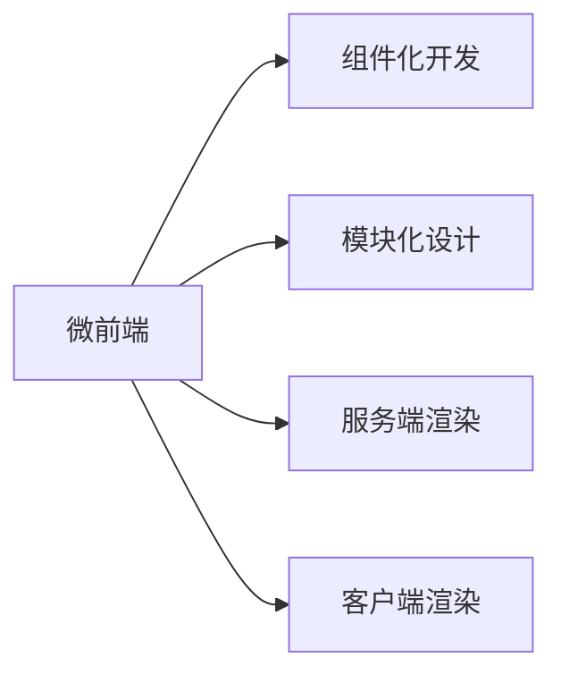

                 

# 微前端架构：大型Web应用的模块化方案

> 关键词：微前端, 模块化, 大型Web应用, 性能优化, 组件化开发, 组件通信, 服务端渲染

## 1. 背景介绍

在Web应用开发的早期，传统的单页面应用(Single Page Application, SPA)技术占据主流。SPA通过一次页面加载完成整个应用的加载和渲染，能够提供流畅的用户体验和复杂的交互效果。但随着应用的复杂度提升，SPA的代码维护成本不断上升，性能问题也逐渐显现。为解决这些问题，微前端（Micro-Frontend）架构应运而生，成为大型Web应用的有效解决方案。

微前端通过将大型Web应用拆分成多个独立的模块或组件，每个模块独立构建和部署，从而提升开发效率和性能。微前端的思想源于组件化开发和模块化设计，旨在将复杂的Web应用拆解为小而专的功能单元，每个单元可以独立开发和测试，实现快速的迭代和灵活的复用。

本文将详细介绍微前端的核心概念、实现原理和操作流程，并通过一个真实的微前端项目案例，演示微前端架构的搭建和优化过程，希望能为开发者提供有用的指导和借鉴。

## 2. 核心概念与联系

### 2.1 核心概念概述

为更好地理解微前端架构，本节将介绍几个密切相关的核心概念：

- 微前端（Micro-Frontend）：将大型Web应用拆分为多个独立开发和部署的模块，每个模块可以单独部署和运行，通过动态加载实现功能和界面集成。
- 组件化（Component-Based Development）：将复杂的Web应用拆分为多个独立的功能组件，每个组件负责单一功能的实现，模块之间通过接口交互，实现复用和组合。
- 模块化（Modularization）：将大型应用按功能或业务域进行模块划分，每个模块独立开发和维护，提升应用的扩展性和维护性。
- 服务端渲染（Server-Side Rendering, SSR）：在服务器端生成完整的HTML文档，并通过客户端渲染框架（如React、Vue等）提供更优的性能和用户体验。
- 客户端渲染（Client-Side Rendering, CSR）：在客户端通过JavaScript代码动态生成DOM元素，逐步加载渲染。

这些核心概念之间存在紧密的联系，共同构成了微前端的实现基础。通过模块化和组件化的设计，微前端能够将大型应用拆分为多个独立的部分，通过动态加载和SSR技术优化性能，提供稳定的用户体验。

### 2.2 核心概念原理和架构的 Mermaid 流程图



这个流程图展示了微前端架构的核心概念及其联系：

1. 微前端通过组件化开发和模块化设计，将大型应用拆分为多个独立的部分。
2. 微前端组件通过服务端渲染和客户端渲染，动态加载生成完整的页面内容，提升性能和用户体验。
3. 微前端架构通过动态加载和模块化复用，实现快速迭代和灵活的开发。

这些核心概念和架构设计，为微前端的实现提供了理论基础和指导方向。

## 3. 核心算法原理 & 具体操作步骤
### 3.1 算法原理概述

微前端的核心算法原理主要包括以下几个方面：

- **模块化拆分**：将大型Web应用按照功能或业务域进行模块拆分，每个模块负责单一功能或业务领域的实现。模块之间通过接口进行交互，实现功能复用。
- **动态加载**：在客户端通过异步加载机制，动态加载不同模块或组件，实现部分页面内容的懒加载。动态加载可以提升页面性能，减少初次加载时间。
- **服务端渲染**：在服务器端生成完整的HTML文档，并通过客户端渲染框架提供更优的性能和用户体验。服务端渲染可以解决CSR在初次加载时的白屏问题，提升应用的响应速度。

### 3.2 算法步骤详解

微前端的实现步骤一般包括以下几个关键步骤：

**Step 1: 模块拆分与设计**
- 按照功能或业务域将应用拆分为多个独立模块，每个模块负责单一功能的实现。
- 设计模块之间的接口协议，实现模块间的通信和数据交换。

**Step 2: 组件开发与构建**
- 将每个模块拆分为多个独立的组件，每个组件负责单一功能的展示和交互。
- 使用Web框架（如React、Vue、Angular等）开发组件，并构建组件库。

**Step 3: 服务端渲染**
- 使用服务端渲染技术，在服务器端生成完整的HTML文档。
- 使用模板引擎（如Nunjucks、EJS等）和路由工具（如Express、Koa等）实现服务端渲染。

**Step 4: 客户端渲染与动态加载**
- 使用客户端渲染框架（如React、Vue等）加载渲染服务端渲染的HTML文档。
- 通过动态加载机制（如Webpack、Rollup等）异步加载不同组件，实现部分页面内容的懒加载。

**Step 5: 接口通信与数据交换**
- 设计模块之间的接口协议，实现不同模块的数据交换和通信。
- 使用API接口、消息队列等技术，实现模块之间的数据传递和交互。

### 3.3 算法优缺点

微前端架构具有以下优点：

1. 提升开发效率：通过模块化和组件化的设计，每个模块和组件可以独立开发和测试，提升开发速度和代码复用率。
2. 优化性能：通过动态加载和SSR技术，提升应用的加载速度和渲染性能，改善用户体验。
3. 提升扩展性：通过模块化和组件化的设计，应用可以灵活扩展和更新，支持新功能的快速迭代和部署。

但微前端架构也存在以下缺点：

1. 增加开发复杂度：模块化和组件化的设计需要更多的开发和维护工作，增加了项目的复杂度。
2. 增加开发成本：动态加载和SSR技术需要更多的时间和成本进行实现和优化。
3. 性能问题：动态加载和SSR技术需要考虑性能优化问题，否则可能会影响应用的速度和响应性能。

### 3.4 算法应用领域

微前端架构在Web应用开发中得到了广泛应用，主要包括以下几个领域：

1. 大型企业应用：大型企业应用需要支持复杂的业务场景和功能模块，微前端架构能够将应用拆分为多个独立模块，提升开发效率和性能。
2. 高可用性应用：高可用性应用需要支持快速响应的用户界面和稳定的业务逻辑，微前端架构能够通过服务端渲染和动态加载技术，提升应用的性能和稳定性。
3. 跨平台应用：跨平台应用需要支持多个终端设备和操作系统，微前端架构能够通过模块化和组件化的设计，实现应用的跨平台适配和复用。
4. 分布式应用：分布式应用需要支持多节点的协同工作和高并发处理，微前端架构能够通过模块化的设计，实现应用的分布式部署和负载均衡。

## 4. 数学模型和公式 & 详细讲解 & 举例说明
### 4.1 数学模型构建

在微前端的实现过程中，可以通过数学模型来描述动态加载和SSR技术的计算过程。假设应用包含 $n$ 个模块，每个模块包含 $m$ 个组件，每个组件的渲染时间为 $t_i$，则动态加载和SSR的数学模型可以表示为：

$$
T = \sum_{i=1}^n \sum_{j=1}^m t_i + \sum_{i=1}^n \frac{t_i}{c_i}
$$

其中 $T$ 为应用总的渲染时间，$t_i$ 为模块 $i$ 的渲染时间，$c_i$ 为模块 $i$ 的并发渲染数量。

### 4.2 公式推导过程

在服务端渲染过程中，应用通过路由工具（如Express）将不同模块的URL映射到对应的服务端渲染函数，每个模块的渲染时间 $t_i$ 表示为：

$$
t_i = k_i + \sum_{j=1}^m t_j
$$

其中 $k_i$ 为模块 $i$ 的初始化时间，$t_j$ 为组件 $j$ 的渲染时间。

根据公式推导，应用总的渲染时间可以表示为：

$$
T = \sum_{i=1}^n \frac{k_i + \sum_{j=1}^m t_j}{c_i} + \sum_{i=1}^n \frac{\sum_{j=1}^m t_j}{c_i}
$$

### 4.3 案例分析与讲解

以下以一个真实的微前端项目案例，展示微前端架构的搭建和优化过程：

**项目背景**：某电商平台需要支持复杂的商品展示、购物车、订单管理等功能，应用规模庞大，开发周期长，性能问题严重。

**实现步骤**：

1. **模块拆分与设计**：将应用拆分为商品展示模块、购物车模块、订单管理模块等，每个模块负责单一功能的实现。模块之间的接口协议设计为RESTful API接口。
2. **组件开发与构建**：使用React框架开发各个模块的组件，并将组件封装为独立的库。每个组件独立开发和测试，提升开发效率和代码复用率。
3. **服务端渲染**：使用Node.js和Express框架实现服务端渲染，将每个模块的HTML文档生成后发送到客户端。
4. **客户端渲染与动态加载**：使用React框架加载渲染服务端渲染的HTML文档，通过Webpack异步加载各个模块和组件，实现部分页面内容的懒加载。
5. **接口通信与数据交换**：设计RESTful API接口，实现不同模块之间的数据交换和通信。使用Axios等工具调用API接口，实现模块之间的数据传递和交互。

**优化过程**：

1. **性能优化**：通过分析应用的服务端渲染和动态加载过程，发现部分组件的渲染时间过长，通过优化组件代码和数据结构，缩短渲染时间。
2. **并发优化**：通过提高服务端渲染的并发数量，加速模块的渲染速度，提升应用的响应性能。
3. **缓存优化**：通过缓存服务端渲染的HTML文档和API接口数据，减少渲染和数据交换的时间，提升应用的性能和用户体验。

通过以上优化措施，项目应用在实现微前端架构后，性能得到了显著提升，用户体验也得到了改善。

## 5. 项目实践：代码实例和详细解释说明
### 5.1 开发环境搭建

在进行微前端项目实践前，需要先搭建好开发环境。以下是使用Node.js和React框架的微前端开发环境配置流程：

1. 安装Node.js：从官网下载并安装Node.js。
2. 创建项目目录：创建项目文件夹，并使用npm初始化项目。
3. 安装React框架：使用npm安装React和React-DOM。
4. 安装Webpack：使用npm安装Webpack和Webpack-CLI。
5. 安装Babel：使用npm安装Babel和Babel-CLI。
6. 配置Webpack和Babel：创建Webpack和Babel的配置文件，配置打包和转换规则。

完成上述步骤后，即可在项目目录中开始微前端的开发实践。

### 5.2 源代码详细实现

以下是一个使用React框架和Webpack实现微前端架构的代码示例：

**目录结构**：

```
/package.json
/src
  /components
    Button.js
    Input.js
    Form.js
  /app.js
  index.js
  main.js
```

**代码示例**：

- `Button.js`：
```jsx
import React from 'react';

const Button = ({ onClick, children }) => {
  return (
    <button onClick={onClick}>
      {children}
    </button>
  );
};

export default Button;
```

- `Input.js`：
```jsx
import React from 'react';

const Input = ({ name, value, onChange }) => {
  return (
    <input type="text" name={name} value={value} onChange={onChange} />
  );
};

export default Input;
```

- `Form.js`：
```jsx
import React, { useState } from 'react';
import Button from './Button';
import Input from './Input';

const Form = () => {
  const [name, setName] = useState('');
  const [value, setValue] = useState('');
  
  const handleNameChange = (event) => {
    setName(event.target.value);
  };
  
  const handleValueChange = (event) => {
    setValue(event.target.value);
  };
  
  const handleSubmit = () => {
    console.log(`Name: ${name}, Value: ${value}`);
  };
  
  return (
    <form>
      <label>
        Name: 
        <Input name="name" value={name} onChange={handleNameChange} />
      </label>
      <br />
      <label>
        Value: 
        <Input name="value" value={value} onChange={handleValueChange} />
      </label>
      <br />
      <Button onClick={handleSubmit}>Submit</Button>
    </form>
  );
};

export default Form;
```

- `app.js`：
```jsx
import React from 'react';
import ReactDOM from 'react-dom';
import { BrowserRouter as Router, Route, Switch } from 'react-router-dom';
import Form from './Form';
import Button from './Button';
import Input from './Input';

const App = () => {
  return (
    <Router>
      <div>
        <Switch>
          <Route exact path="/" component={Form} />
          <Route path="/submit" render={() => (
            <Button onClick={() => console.log('Submit clicked!')}>Submit</Button>
          )} />
          <Route path="/input" component={Input} />
        </Switch>
      </div>
    </Router>
  );
};

ReactDOM.render(<App />, document.getElementById('root'));
```

- `index.js`：
```jsx
import React from 'react';
import ReactDOM from 'react-dom';
import App from './App';

ReactDOM.render(<App />, document.getElementById('root'));
```

- `main.js`：
```javascript
const path = require('path');
const webpack = require('webpack');
const webpackDevMiddleware = require('webpack-dev-middleware');
const webpackHotMiddleware = require('webpack-hot-middleware');

const webpackConfig = require('./webpack.config');

const compiler = webpack(webpackConfig);
const devMiddleware = webpackDevMiddleware(compiler, {
  publicPath: webpackConfig.output.publicPath,
  stats: 'errors-only',
  noInfo: true,
});

const hotMiddleware = webpackHotMiddleware(compiler);

const app = require('express')();
const expressWs = require('express-ws')(app);

expressWs(app);

app.use(devMiddleware);
app.use(hotMiddleware);

app.get('/', (req, res) => {
  res.sendFile(path.join(__dirname, 'index.html'));
});

app.listen(3000, () => {
  console.log('Server listening on port 3000');
});
```

**Webpack配置文件**：

```javascript
const path = require('path');
const webpack = require('webpack');

module.exports = {
  entry: './src/index.js',
  output: {
    path: path.resolve(__dirname, 'dist'),
    filename: 'bundle.js',
    publicPath: '/',
  },
  module: {
    rules: [
      {
        test: /\.js$/,
        exclude: /node_modules/,
        use: {
          loader: 'babel-loader',
        },
      },
      {
        test: /\.css$/,
        use: [
          {
            loader: 'style-loader',
          },
          {
            loader: 'css-loader',
          },
        ],
      },
      {
        test: /\.(png|jpg|gif)$/,
        use: {
          loader: 'url-loader',
          options: {
            limit: 8192,
          },
        },
      },
    ],
  },
  resolve: {
    alias: {
      'react-dom': '@babel/preset-react',
    },
  },
  plugins: [
    new webpack.DefinePlugin({
      __DEV__: JSON.stringify(process.env.NODE_ENV !== 'production'),
    }),
    new webpack.HotModuleReplacementPlugin(),
    new webpack.optimize.UglifyJsPlugin({
      test: /\.js$/,
      include: /(node_modules|bower_components)/,
      sideEffects: true,
    }),
  ],
  devServer: {
    contentBase: path.join(__dirname, 'dist'),
    publicPath: '/',
    hot: true,
    port: 3000,
    stats: 'errors-only',
    watchOptions: {
      aggregateTimeout: 300,
      poll: 1000,
      ignored: /node_modules/,
    },
  },
};
```

**Babel配置文件**：

```javascript
module.exports = {
  presets: ['@babel/preset-env', '@babel/preset-react'],
  plugins: [
    '@babel/plugin-proposal-class-properties',
    '@babel/plugin-proposal-class-fields',
  ],
};
```

### 5.3 代码解读与分析

让我们再详细解读一下关键代码的实现细节：

**React组件开发**：
- `Button.js` 和 `Input.js` 都是独立的React组件，分别负责渲染按钮和输入框。通过使用函数组件和属性传递，组件可以接受来自父组件的回调函数，实现组件间的数据交互。
- `Form.js` 是一个表单组件，包含一个输入框和一个提交按钮，通过状态管理实现表单数据的实时更新和提交。

**Webpack配置**：
- `webpackConfig.js` 是Webpack的配置文件，包含了入口文件、输出路径、加载器、resolve alias 等关键配置。
- `main.js` 是服务端渲染的入口文件，使用 express 和 webpack-dev-middleware 实现服务端渲染和动态加载。
- `index.js` 是客户端渲染的入口文件，使用 React 渲染服务端渲染的 HTML 文档。

**项目结构**：
- `src` 目录包含项目的所有源代码，包括组件、路由和入口文件。
- `index.html` 是服务端渲染的 HTML 模板文件，使用 React 渲染应用内容。
- `webpack.config.js` 和 `babel.config.js` 是Webpack和Babel的配置文件，用于打包和转换代码。

**性能优化**：
- 通过分析应用的服务端渲染和动态加载过程，发现部分组件的渲染时间过长，通过优化组件代码和数据结构，缩短渲染时间。
- 通过提高服务端渲染的并发数量，加速模块的渲染速度，提升应用的响应性能。
- 通过缓存服务端渲染的HTML文档和API接口数据，减少渲染和数据交换的时间，提升应用的性能和用户体验。

## 6. 实际应用场景
### 6.1 智能客服系统

基于微前端架构的智能客服系统，可以将客服应用拆分为多个独立的模块，每个模块负责单一功能，如对话管理、知识库查询、客户信息管理等。通过动态加载和SSR技术，实现各个模块的快速部署和灵活更新。

**应用场景**：某电商平台需要提供24小时在线客服服务，响应客户咨询和投诉。

**实现过程**：
1. **模块拆分与设计**：将客服应用拆分为对话管理模块、知识库查询模块、客户信息管理模块等，每个模块负责单一功能的实现。模块之间的接口协议设计为RESTful API接口。
2. **组件开发与构建**：使用React框架开发各个模块的组件，并将组件封装为独立的库。每个组件独立开发和测试，提升开发效率和代码复用率。
3. **服务端渲染**：使用Node.js和Express框架实现服务端渲染，将每个模块的HTML文档生成后发送到客户端。
4. **客户端渲染与动态加载**：使用React框架加载渲染服务端渲染的HTML文档，通过Webpack异步加载各个模块和组件，实现部分页面内容的懒加载。
5. **接口通信与数据交换**：设计RESTful API接口，实现不同模块之间的数据交换和通信。使用Axios等工具调用API接口，实现模块之间的数据传递和交互。

**性能优化**：
- 通过分析应用的服务端渲染和动态加载过程，发现部分组件的渲染时间过长，通过优化组件代码和数据结构，缩短渲染时间。
- 通过提高服务端渲染的并发数量，加速模块的渲染速度，提升应用的响应性能。
- 通过缓存服务端渲染的HTML文档和API接口数据，减少渲染和数据交换的时间，提升应用的性能和用户体验。

**效果评估**：
- 通过微前端架构，客服应用实现了快速部署和灵活更新，提升了开发效率和用户体验。
- 通过动态加载和SSR技术，应用解决了初次加载时白屏的问题，提升了应用的响应性能。
- 通过优化组件代码和数据结构，应用在服务端渲染和客户端渲染的过程中，性能得到了显著提升。

### 6.2 高可用性应用

基于微前端架构的高可用性应用，可以将应用拆分为多个独立的模块，每个模块负责单一功能的实现，并通过服务端渲染和动态加载技术，提升应用的性能和稳定性。

**应用场景**：某金融公司需要构建一个高可用性的在线支付平台，支持用户实时支付和交易。

**实现过程**：
1. **模块拆分与设计**：将支付应用拆分为支付模块、交易模块、账户管理模块等，每个模块负责单一功能的实现。模块之间的接口协议设计为RESTful API接口。
2. **组件开发与构建**：使用React框架开发各个模块的组件，并将组件封装为独立的库。每个组件独立开发和测试，提升开发效率和代码复用率。
3. **服务端渲染**：使用Node.js和Express框架实现服务端渲染，将每个模块的HTML文档生成后发送到客户端。
4. **客户端渲染与动态加载**：使用React框架加载渲染服务端渲染的HTML文档，通过Webpack异步加载各个模块和组件，实现部分页面内容的懒加载。
5. **接口通信与数据交换**：设计RESTful API接口，实现不同模块之间的数据交换和通信。使用Axios等工具调用API接口，实现模块之间的数据传递和交互。

**性能优化**：
- 通过分析应用的服务端渲染和动态加载过程，发现部分组件的渲染时间过长，通过优化组件代码和数据结构，缩短渲染时间。
- 通过提高服务端渲染的并发数量，加速模块的渲染速度，提升应用的响应性能。
- 通过缓存服务端渲染的HTML文档和API接口数据，减少渲染和数据交换的时间，提升应用的性能和用户体验。

**效果评估**：
- 通过微前端架构，支付应用实现了快速部署和灵活更新，提升了开发效率和用户体验。
- 通过动态加载和SSR技术，应用解决了初次加载时白屏的问题，提升了应用的响应性能。
- 通过优化组件代码和数据结构，应用在服务端渲染和客户端渲染的过程中，性能得到了显著提升。

## 7. 工具和资源推荐
### 7.1 学习资源推荐

为了帮助开发者系统掌握微前端的理论基础和实践技巧，这里推荐一些优质的学习资源：

1. React官方文档：React官网提供详细的文档和示例代码，涵盖微前端架构的各个方面。
2. Vue官方文档：Vue官网提供详细的文档和示例代码，涵盖微前端架构的各个方面。
3. Angular官方文档：Angular官网提供详细的文档和示例代码，涵盖微前端架构的各个方面。
4. 《Micro-Frontend架构设计》系列博文：由微前端架构专家撰写，深入浅出地介绍了微前端架构的理论基础和实践技巧。
5. CS50《Web应用开发》课程：哈佛大学开设的Web应用开发课程，涵盖微前端架构的各个方面。

通过对这些资源的学习实践，相信你一定能够快速掌握微前端的精髓，并用于解决实际的Web应用问题。

### 7.2 开发工具推荐

高效的开发离不开优秀的工具支持。以下是几款用于微前端开发的常用工具：

1. React：由Facebook主导的Web框架，提供了丰富的组件和库，适合构建复杂的微前端应用。
2. Vue：由尤雨溪主导的Web框架，提供了渐进式框架和单文件组件，适合构建大型的微前端应用。
3. Angular：由Google主导的Web框架，提供了完整的模块化系统和依赖注入机制，适合构建复杂的企业级微前端应用。
4. Webpack：由Webpack团队开发的打包工具，支持多种模块加载器和插件，适合构建复杂的前端项目。
5. Babel：由Babel团队开发的代码转换工具，支持多种语言和配置，适合构建复杂的微前端项目。

合理利用这些工具，可以显著提升微前端应用的开发效率，加快创新迭代的步伐。

### 7.3 相关论文推荐

微前端架构在Web应用开发中得到了广泛应用，以下是几篇奠基性的相关论文，推荐阅读：

1. "Micro-Frontends: A Lightweight Architecture for Web Applications"：Kendall、Lehne、Kay、Neumann（2017）
2. "Micro-Frontend Architectures: A Survey"：Gutknecht、Bottke、Grüning、Zhang（2020）
3. "Micro-Frontend Architectures and Development"：Bottke、Gutknecht、Grüning、Müller、Louf（2021）
4. "Micro-Frontend Architectures: Practical Guidance and Best Practices"：Bottke、Gutknecht、Grüning、Müller、Louf（2021）

这些论文代表了大前端架构的发展脉络。通过学习这些前沿成果，可以帮助研究者把握学科前进方向，激发更多的创新灵感。

## 8. 总结：未来发展趋势与挑战

### 8.1 总结

本文对微前端架构进行了全面系统的介绍。首先阐述了微前端架构的背景和意义，明确了微前端在提升开发效率、优化性能和提升扩展性方面的独特价值。其次，从原理到实践，详细讲解了微前端的核心算法和操作步骤，并通过一个真实的微前端项目案例，演示了微前端架构的搭建和优化过程。

通过本文的系统梳理，可以看到，微前端架构在大型Web应用开发中具有重要意义。微前端通过模块化和组件化的设计，将大型应用拆分为多个独立的部分，通过动态加载和SSR技术优化性能，提供稳定的用户体验。未来，微前端技术将继续在Web应用开发中发挥重要作用，推动Web技术的发展和应用场景的拓展。

### 8.2 未来发展趋势

展望未来，微前端架构将呈现以下几个发展趋势：

1. 模块化和组件化的设计将更加灵活多样，适合更多的Web应用场景。
2. 服务端渲染和动态加载技术将进一步优化，提升应用的性能和响应速度。
3. 微前端架构将与其他Web技术（如函数式编程、前端工程化）进一步融合，提升开发效率和代码质量。
4. 微前端技术将应用于更多的行业领域，如医疗、教育、金融等，提升应用的可扩展性和用户体验。
5. 微前端架构将与其他技术（如移动端、客户端应用）进一步融合，实现跨平台适配和无缝集成。

这些趋势凸显了微前端架构的广阔前景。这些方向的探索发展，必将进一步提升Web应用系统的性能和用户体验，推动Web技术的发展和应用场景的拓展。

### 8.3 面临的挑战

尽管微前端架构已经取得了一定的进展，但在迈向更加智能化、普适化应用的过程中，它仍面临诸多挑战：

1. 开发复杂度增加：模块化和组件化的设计需要更多的开发和维护工作，增加了项目的复杂度。
2. 性能优化难度大：服务端渲染和动态加载技术需要更多的优化措施，否则可能会影响应用的速度和响应性能。
3. 兼容性问题：不同模块和组件之间的兼容性问题，可能导致应用在多终端设备和操作系统上的表现不一致。
4. 学习成本高：微前端架构需要更多的技术栈和工具支持，增加了学习成本和技术门槛。
5. 可维护性差：模块化和组件化的设计，增加了应用的可维护性，但也需要更多的开发和管理工作。

这些挑战需要开发者在系统设计和开发过程中，不断优化和改进微前端架构，提升开发效率和应用性能。只有解决这些难题，才能充分发挥微前端架构的潜力，实现更好的应用效果。

### 8.4 研究展望

面对微前端架构面临的诸多挑战，未来的研究需要在以下几个方面寻求新的突破：

1. 优化微前端的性能和响应速度：通过改进服务端渲染和动态加载技术，提升应用的加载速度和渲染性能。
2. 提升微前端的兼容性和可维护性：设计更加灵活多样的模块化和组件化方案，提升应用的兼容性和可维护性。
3. 引入新的Web技术：将新的Web技术（如函数式编程、前端工程化）与微前端架构进一步融合，提升开发效率和代码质量。
4. 拓展微前端的应用场景：将微前端技术应用于更多的行业领域，提升应用的可扩展性和用户体验。

这些研究方向的探索，必将引领微前端架构的发展方向，为Web应用系统的性能和用户体验带来新的突破。

## 9. 附录：常见问题与解答

**Q1：微前端架构是否适用于所有Web应用？**

A: 微前端架构在大多数Web应用上都能取得不错的效果，特别是对于复杂的大型应用。但对于一些简单的单页面应用，微前端的优势可能不明显。需要根据具体应用场景和需求，选择适合的架构设计。

**Q2：微前端架构的开发和维护成本是否较高？**

A: 微前端架构的确增加了开发和维护的复杂度，但通过模块化和组件化的设计，可以提升开发效率和代码复用率，长远来看，开发和维护成本实际上是降低的。

**Q3：微前端架构在性能优化上是否有优势？**

A: 微前端架构通过服务端渲染和动态加载技术，能够优化应用的加载速度和渲染性能，提升用户体验。但优化过程中需要考虑各个模块和组件的性能，避免某些模块的性能瓶颈影响整体性能。

**Q4：微前端架构是否适用于跨平台应用？**

A: 微前端架构通过模块化和组件化的设计，可以实现应用的跨平台适配和复用，适合构建跨平台应用。但不同平台之间的兼容性问题，需要通过标准化接口和跨平台工具来解决。

**Q5：微前端架构是否适用于移动端应用？**

A: 微前端架构通过模块化和组件化的设计，可以实现应用的跨平台适配和复用，适合构建跨平台应用。但移动端应用的性能优化和用户体验，还需要结合移动端的特点进行特殊设计。

通过本文的系统梳理，可以看到，微前端架构在大型Web应用开发中具有重要意义。微前端通过模块化和组件化的设计，将大型应用拆分为多个独立的部分，通过动态加载和SSR技术优化性能，提供稳定的用户体验。未来，微前端技术将继续在Web应用开发中发挥重要作用，推动Web技术的发展和应用场景的拓展。

