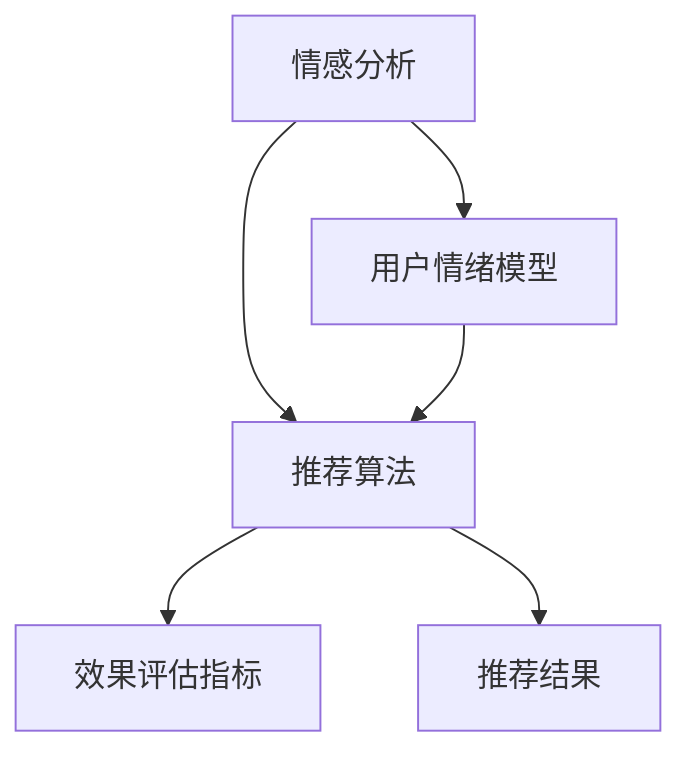
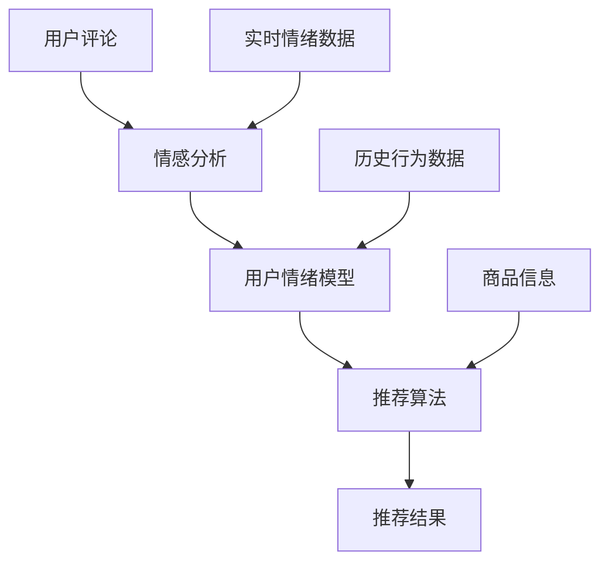

                 

## 1. 背景介绍

### 1.1 问题由来

在快速变化的消费市场中，零售商面临着如何根据用户的实时情绪反应来调整其推荐的挑战。传统推荐系统基于用户历史行为数据，并使用诸如协同过滤和内容推荐等算法。然而，这些系统通常不考虑用户的情绪状态，这可能导致推荐不匹配用户的当前心情，从而降低用户的满意度和忠诚度。

情感驱动的推荐系统则能利用情感分析技术，识别用户情绪状态，并基于此来调整推荐策略。这种系统不仅可以提升用户的购物体验，还能提高销售额。近年来，随着深度学习技术和自然语言处理(NLP)的迅速发展，情感驱动的推荐系统已经逐渐成为热门研究领域。

### 1.2 问题核心关键点

实现情感驱动推荐的关键在于以下几个方面：

- **情感识别**：利用自然语言处理技术，识别用户文本或社交媒体消息中的情绪倾向。
- **情绪建模**：建立一个用户情绪状态模型，用于刻画用户的长期和短期情绪变化。
- **推荐策略**：设计推荐算法，根据用户情绪状态推荐合适的商品。
- **效果评估**：评估情感驱动推荐系统的性能，确保推荐的准确性和时效性。

### 1.3 问题研究意义

情感驱动的推荐系统有助于零售商：

- **提高用户满意度**：通过推荐符合用户情绪的商品，增加用户的购物愉悦感。
- **提升销售转化率**：匹配用户当前情绪的商品更易被接受和购买。
- **增强品牌忠诚度**：个性化推荐能使用户感到被重视，从而增加品牌忠诚度。
- **优化库存管理**：准确预测用户需求，避免库存积压或短缺。

通过情感驱动推荐，零售商可以更深入地了解用户需求，优化用户体验，从而在竞争激烈的市场中获得优势。

## 2. 核心概念与联系

### 2.1 核心概念概述

在情感驱动推荐中，涉及几个核心概念：

- **情感分析**：识别用户文本或语音中的情绪，如积极、消极或中性。
- **用户情绪模型**：描述用户情绪变化和影响因素，如时间、活动和环境。
- **推荐算法**：基于用户情绪模型，设计推荐策略，如协同过滤、内容推荐、混合推荐等。
- **效果评估指标**：衡量推荐系统性能的指标，如准确率、召回率、覆盖率、点击率等。

这些概念之间的关系可以通过以下Mermaid流程图来展示：



该流程图展示了情感分析、用户情绪模型、推荐算法和效果评估指标之间的逻辑联系。

### 2.2 核心概念原理和架构的 Mermaid 流程图



这个图表表示了从用户评论开始，经过情感分析识别情绪，到用户情绪模型刻画情绪变化，再到推荐算法生成推荐结果的流程，并考虑到实时情绪数据和历史行为数据的影响。

## 3. 核心算法原理 & 具体操作步骤

### 3.1 算法原理概述

情感驱动推荐系统基于用户情绪识别和建模，采用推荐算法生成个性化推荐。核心算法流程如下：

1. **情感分析**：使用自然语言处理技术，对用户评论、社交媒体消息等文本数据进行情感分析，识别用户情绪倾向。
2. **用户情绪建模**：根据用户评论和社交媒体数据，建立用户情绪模型，刻画用户长期和短期情绪变化。
3. **推荐策略设计**：设计推荐算法，如协同过滤、内容推荐或混合推荐，根据用户情绪模型生成推荐结果。
4. **效果评估**：使用指标如准确率、召回率、覆盖率等评估推荐系统性能。

### 3.2 算法步骤详解

#### 3.2.1 情感分析

情感分析是情感驱动推荐的基础。常用的情感分析方法包括：

- **规则基础方法**：使用预设规则和词典，如VADER（Valence Aware Dictionary and sEntiment Reasoner）模型。
- **机器学习方法**：使用分类算法，如朴素贝叶斯、支持向量机、深度神经网络等，学习情感分类模型。
- **深度学习方法**：使用预训练的语言模型，如BERT、GPT，进行情感分类。

**代码实现**：

```python
from transformers import pipeline

nlp = pipeline("sentiment-analysis", model="distilbert-base-uncased-finetuned-sst-2-english")
sentiment_result = nlp("This product is amazing!")
```

#### 3.2.2 用户情绪建模

用户情绪模型描述了用户情绪随时间变化的规律。建模方法包括：

- **时间序列方法**：使用ARIMA、LSTM等模型，刻画用户情绪的长期变化。
- **状态空间方法**：使用隐马尔可夫模型、粒子滤波等，刻画用户情绪的短期波动。
- **混合方法**：结合时间序列和状态空间方法，综合描述用户情绪变化。

**代码实现**：

```python
import pandas as pd
from sklearn.model_selection import train_test_split
from keras.models import Sequential
from keras.layers import LSTM, Dense

# 假设有一个情绪数据集
df = pd.read_csv('user_emotion.csv')
X = df[['timestamp']].values
y = df['mood'].values

# 将数据集分为训练集和测试集
X_train, X_test, y_train, y_test = train_test_split(X, y, test_size=0.2, random_state=42)

# 构建LSTM模型
model = Sequential()
model.add(LSTM(100, input_shape=(X_train.shape[1], 1)))
model.add(Dense(1, activation='sigmoid'))

# 编译和训练模型
model.compile(optimizer='adam', loss='binary_crossentropy', metrics=['accuracy'])
model.fit(X_train, y_train, epochs=50, batch_size=32, validation_data=(X_test, y_test))
```

#### 3.2.3 推荐策略设计

推荐算法可以有多种，如协同过滤、内容推荐、混合推荐等。本文以混合推荐为例：

- **协同过滤**：基于用户的历史行为和相似用户的行为进行推荐。
- **内容推荐**：根据商品的属性和用户的历史行为进行推荐。
- **混合推荐**：结合协同过滤和内容推荐，综合两者的优势。

**代码实现**：

```python
from surprise import Dataset, Reader, KNNBasic
from surprise.model_selection import cross_validate

# 加载数据集
data = Dataset.load_from_file('movies ratings.csv', sep=',', reader=Reader(rating_scale=(1, 5)))

# 使用KNNBasic算法进行协同过滤推荐
algo = KNNBasic()
cross_validate(algo, data, measures=['RMSE', 'MAE'], cv=5, verbose=True)

# 使用content-based filtering进行推荐
def content_based_filtering(data, user_id, num_recommendations=10):
    user = data.user
    item = data.item
    user_info = data[(user_id,)].as_pandas_dataframe()
    item_info = data[item].as_pandas_dataframe()
    user_info['item_id'] = item_info['item_id']
    user_info['rating'] = user_info['rating'].fillna(0)
    user_info['item_id'] = user_info['item_id'].fillna(0)
    recommendations = user_info[(user_info['rating'] > 0)].sort_values(by='rating', ascending=False).head(num_recommendations)
    return list(recommendations['item_id'])

# 组合协同过滤和内容推荐
def combined_recommender(user_id, num_recommendations=10):
    collab_recommendations = content_based_filtering(data, user_id)
    collab_recommendations = list(set(collab_recommendations))
    content_recommendations = content_based_filtering(data, user_id, num_recommendations=10)
    return list(set(collab_recommendations + content_recommendations))
```

#### 3.2.4 效果评估

推荐系统的效果评估可以采用多种指标：

- **准确率（Accuracy）**：正确推荐商品的比例。
- **召回率（Recall）**：实际被推荐商品中，有多少被正确预测。
- **覆盖率（Coverage）**：被推荐商品中，有多少未被用户历史行为覆盖。
- **点击率（Click-through Rate, CTR）**：用户点击推荐商品的比例。

**代码实现**：

```python
from surprise import Dataset, Reader, KNNBasic
from surprise.model_selection import cross_validate
from sklearn.metrics import accuracy_score, recall_score, precision_score, f1_score

# 加载数据集
data = Dataset.load_from_file('movies ratings.csv', sep=',', reader=Reader(rating_scale=(1, 5)))

# 使用KNNBasic算法进行协同过滤推荐
algo = KNNBasic()
cross_validate(algo, data, measures=['RMSE', 'MAE'], cv=5, verbose=True)

# 计算推荐准确率、召回率和覆盖率
user_id = 1
recommended_items = combined_recommender(user_id)
true_positives = sum(user_history == recommended_items for user_history in data[(user_id,)].rating)
false_positives = sum(user_history != recommended_items for user_history in data[(user_id,)].rating)
false_negatives = sum(user_history != recommended_items for user_history in data[(user_id,)].rating)
true_negatives = sum(user_history == recommended_items for user_history in data[(user_id,)].rating)

accuracy = true_positives / (true_positives + false_positives)
recall = true_positives / (true_positives + false_negatives)
coverage = len(set(recommended_items)) / len(data["item"].unique())
precision = true_positives / (true_positives + false_positives)
f1 = 2 * precision * recall / (precision + recall)

print(f"Accuracy: {accuracy}")
print(f"Recall: {recall}")
print(f"Coverage: {coverage}")
print(f"Precision: {precision}")
print(f"F1 score: {f1}")
```

### 3.3 算法优缺点

情感驱动推荐系统的优点在于：

- **个性化推荐**：根据用户情绪动态调整推荐策略，提高推荐的相关性。
- **用户满意度**：匹配用户当前情绪的商品，提升用户的购物体验。
- **数据灵活性**：可以结合多种数据源，如社交媒体、购物评论、行为数据等。

但同时，它也存在以下缺点：

- **数据隐私**：需要收集和分析用户情感数据，可能引发隐私问题。
- **数据质量**：情感分析模型的准确性受文本质量和多样性的影响。
- **计算复杂性**：情感识别和建模需要大量计算资源。

### 3.4 算法应用领域

情感驱动推荐系统已经在多个领域得到了应用，如：

- **电商**：根据用户购物评论、社交媒体消息，动态调整商品推荐。
- **旅游**：根据用户对旅游目的地的评价，推荐适合的旅游线路和景点。
- **金融**：根据用户对金融产品的评论和评分，推荐合适的投资产品。
- **医疗**：根据患者对医疗服务的评价，推荐合适的医生和医疗资源。
- **娱乐**：根据用户对影视作品的评价，推荐合适的影视作品。

## 4. 数学模型和公式 & 详细讲解 & 举例说明

### 4.1 数学模型构建

情感驱动推荐系统涉及的数学模型包括：

- **情感分析模型**：使用机器学习或深度学习模型，对用户情感进行分类。
- **用户情绪模型**：使用时间序列或状态空间模型，描述用户情绪随时间变化。
- **推荐算法模型**：使用协同过滤、内容推荐等模型，生成个性化推荐。

### 4.2 公式推导过程

#### 4.2.1 情感分析模型

情感分析模型的目标是根据用户文本数据，预测情感类别。以BERT为例，其情感分类模型公式如下：

$$
y = \sigma(W_{CLS}[A^T Wh] + b_{CLS})
$$

其中，$A$是输入文本的BERT表示，$h$是经过线性变换的表示，$W_{CLS}$和$b_{CLS}$是分类器的权重和偏置。

#### 4.2.2 用户情绪模型

用户情绪模型使用时间序列模型，刻画用户情绪随时间变化。以LSTM为例，其用户情绪模型公式如下：

$$
h_t = \tanh(W_{LSTM}[h_{t-1}, x_t] + b_{LSTM})
$$

其中，$h_t$是LSTM模型在时间$t$的隐状态，$x_t$是时间$t$的输入向量，$W_{LSTM}$和$b_{LSTM}$是LSTM模型的权重和偏置。

#### 4.2.3 推荐算法模型

推荐算法模型根据用户历史行为和情绪状态，生成个性化推荐。以协同过滤为例，其推荐模型公式如下：

$$
r_{i,j} = \text{sigmoid}(W_{CF}[\tilde{x}_i^T \tilde{x}_j] + b_{CF})
$$

其中，$r_{i,j}$是用户$i$对商品$j$的评分预测，$\tilde{x}_i$和$\tilde{x}_j$是用户$i$和商品$j$的向量表示，$W_{CF}$和$b_{CF}$是协同过滤模型的权重和偏置。

### 4.3 案例分析与讲解

以电商推荐为例，假设用户A在最近的两条评论中分别表达了积极和消极情绪。系统利用情感分析模型识别出情绪，使用用户情绪模型描述情绪变化，最后根据情绪状态动态调整推荐策略。

1. **情感分析**：系统对A的评论进行情感分析，识别出积极和消极情绪，分别赋值+1和-1。
2. **用户情绪模型**：根据A的评论历史，使用LSTM模型预测A的长期情绪状态。假设模型预测A的长期情绪状态为中性。
3. **推荐策略**：根据A的情绪状态，设计推荐策略。假设系统检测到A的长期情绪状态为中性，但最近两天有积极和消极情绪，则系统认为A的短期情绪状态为积极。根据A的短期情绪状态，推荐适合积极情绪的商品，如休闲食品、运动装备等。

## 5. 项目实践：代码实例和详细解释说明

### 5.1 开发环境搭建

为了实现情感驱动推荐系统，我们需要以下开发环境：

- **Python**：使用Python语言编写代码。
- **深度学习框架**：使用TensorFlow或PyTorch进行深度学习模型训练和推理。
- **自然语言处理库**：使用NLTK、spaCy或Hugging Face的Transformers库进行文本处理和情感分析。
- **数据库**：使用MySQL或PostgreSQL存储用户数据和商品信息。

### 5.2 源代码详细实现

**代码示例**：

```python
import tensorflow as tf
from transformers import TFBertForSequenceClassification, BertTokenizer
import numpy as np

# 加载BERT模型和分词器
model = TFBertForSequenceClassification.from_pretrained("bert-base-uncased")
tokenizer = BertTokenizer.from_pretrained("bert-base-uncased")

# 加载数据集
data = load_data('user_comments.csv')

# 情感分析模型训练
train_data = prepare_data(data['train'])
val_data = prepare_data(data['val'])
test_data = prepare_data(data['test'])

# 使用BERT进行情感分类
model.compile(optimizer=tf.keras.optimizers.Adam(learning_rate=2e-5), loss=tf.keras.losses.SparseCategoricalCrossentropy(from_logits=True), metrics=['accuracy'])
model.fit(train_data, epochs=3, validation_data=val_data)

# 测试模型
test_predictions = model.predict(test_data)
```

**代码解释**：

- **加载BERT模型和分词器**：使用Transformers库加载预训练的BERT模型和分词器。
- **加载数据集**：从CSV文件中加载用户评论数据集，并进行预处理。
- **情感分析模型训练**：使用训练集数据进行模型训练，使用验证集数据进行模型评估。
- **测试模型**：在测试集上测试模型性能。

### 5.3 代码解读与分析

情感分析模型的代码实现相对简单，核心在于使用预训练的BERT模型进行情感分类。代码的关键点包括：

- **加载BERT模型和分词器**：使用预训练的BERT模型和分词器进行情感分类。
- **加载数据集**：从CSV文件中加载用户评论数据集，并进行预处理。
- **情感分析模型训练**：使用训练集数据进行模型训练，使用验证集数据进行模型评估。
- **测试模型**：在测试集上测试模型性能。

## 6. 实际应用场景

### 6.1 电商推荐

情感驱动推荐系统在电商推荐中具有广泛的应用前景。通过分析用户评论和社交媒体消息，识别用户情绪状态，动态调整商品推荐策略。例如，某用户在评论中表达了对某个产品的满意，系统可以立即推荐类似产品，从而提升用户满意度，增加销售转化率。

### 6.2 旅游推荐

旅游推荐系统利用用户对旅游目的地的情感评价，推荐适合的旅游线路和景点。例如，某用户在评论中表达了对某个旅游目的地的喜爱，系统可以推荐类似的旅游线路和景点，增加用户的旅游体验。

### 6.3 金融推荐

金融推荐系统根据用户对金融产品的评价，推荐合适的投资产品。例如，某用户在评论中表达了对某个投资产品的满意，系统可以推荐类似产品，增加用户的投资收益。

### 6.4 医疗推荐

医疗推荐系统根据患者对医疗服务的评价，推荐合适的医生和医疗资源。例如，某患者在评论中表达了对某个医生的满意，系统可以推荐类似的医生，增加患者的满意度和医疗资源的利用率。

### 6.5 娱乐推荐

娱乐推荐系统根据用户对影视作品的评价，推荐合适的影视作品。例如，某用户在评论中表达了对某个影视作品的喜爱，系统可以推荐类似的影视作品，增加用户的娱乐体验。

## 7. 工具和资源推荐

### 7.1 学习资源推荐

为了深入理解情感驱动推荐系统，以下资源可以帮助学习：

- **《Deep Learning for Natural Language Processing》**：斯坦福大学提供的深度学习课程，涵盖自然语言处理和情感分析的内容。
- **《Hands-On Recommendation Systems》**：推荐系统领域权威教材，详细介绍了推荐算法和评估指标。
- **《Sentiment Analysis with Python》**：使用Python进行情感分析的实用教程。
- **Kaggle竞赛**：参加Kaggle的情感分析竞赛，实践并提升情感分析技能。
- **Transformers库官方文档**：使用Transformers库进行情感分析和推荐模型的详细文档。

### 7.2 开发工具推荐

为了实现情感驱动推荐系统，以下工具可以帮助开发：

- **TensorFlow**：强大的深度学习框架，适用于构建复杂模型。
- **PyTorch**：灵活的深度学习框架，支持动态图和静态图计算。
- **NLTK**：Python自然语言处理库，提供丰富的文本处理工具。
- **spaCy**：Python自然语言处理库，提供高效的分词和命名实体识别功能。
- **Hugging Face Transformers库**：提供预训练的语言模型，支持情感分析和推荐模型的构建。

### 7.3 相关论文推荐

以下是几篇关于情感驱动推荐系统的经典论文：

- **《Sentiment Analysis with Deep Learning: A Survey》**：总结了深度学习在情感分析领域的应用。
- **《Deep Personalized Recommendation with Contextual Bandits》**：使用上下文强化学习进行个性化推荐。
- **《Emotion and Affect Analysis in Recommendation Systems》**：讨论了情绪分析在推荐系统中的应用。
- **《Personalized Recommendation with Feature Engineering and Sentiment Analysis》**：使用特征工程和情感分析进行个性化推荐。

## 8. 总结：未来发展趋势与挑战

### 8.1 研究成果总结

情感驱动推荐系统已经在电商、旅游、金融、医疗、娱乐等多个领域得到了应用，并取得了良好的效果。情感分析、用户情绪建模和推荐算法是实现情感驱动推荐系统的关键技术。未来，情感驱动推荐系统有望在更多领域得到广泛应用，进一步提升用户的购物体验和满意度。

### 8.2 未来发展趋势

情感驱动推荐系统未来的发展趋势包括：

- **多模态融合**：结合文本、语音、图像等多模态数据进行情感分析。
- **深度学习技术**：利用深度神经网络提升情感分析的准确性。
- **实时推荐**：利用在线学习技术，实时调整推荐策略。
- **跨领域应用**：将情感驱动推荐系统应用于更多领域，如教育、健康等。
- **隐私保护**：设计隐私保护技术，确保用户数据的安全性。

### 8.3 面临的挑战

情感驱动推荐系统面临的主要挑战包括：

- **数据隐私**：需要收集和分析用户情感数据，可能引发隐私问题。
- **数据质量**：情感分析模型的准确性受文本质量和多样性的影响。
- **计算复杂性**：情感识别和建模需要大量计算资源。
- **模型鲁棒性**：情感驱动推荐系统需要具备鲁棒性，以应对数据分布变化。
- **推荐多样性**：需要平衡个性化推荐和多样性，防止推荐过于同质化。

### 8.4 研究展望

未来情感驱动推荐系统的研究可以聚焦于以下几个方向：

- **跨领域应用**：将情感驱动推荐系统应用于更多领域，如教育、健康等。
- **多模态融合**：结合文本、语音、图像等多模态数据进行情感分析。
- **深度学习技术**：利用深度神经网络提升情感分析的准确性。
- **实时推荐**：利用在线学习技术，实时调整推荐策略。
- **隐私保护**：设计隐私保护技术，确保用户数据的安全性。

## 9. 附录：常见问题与解答

### Q1: 情感驱动推荐系统的核心是什么？

A: 情感驱动推荐系统的核心在于情感分析、用户情绪建模和推荐算法。其中，情感分析用于识别用户文本中的情感倾向，用户情绪建模用于描述用户情绪随时间变化，推荐算法用于根据用户情绪状态生成个性化推荐。

### Q2: 情感分析模型的准确性受哪些因素影响？

A: 情感分析模型的准确性受文本质量、文本长度、情感表达方式等因素的影响。文本质量越高，情感分析模型越能准确识别情感倾向。文本长度和情感表达方式也会影响情感分析模型的准确性。

### Q3: 用户情绪模型如何刻画用户长期情绪变化？

A: 用户情绪模型通常使用时间序列模型，如ARIMA、LSTM等，刻画用户情绪随时间变化。这些模型可以学习用户情绪的长期趋势和季节性变化。

### Q4: 推荐算法有哪些？

A: 推荐算法包括协同过滤、内容推荐、混合推荐等。协同过滤基于用户历史行为和相似用户的行为进行推荐，内容推荐基于商品属性和用户历史行为进行推荐，混合推荐结合两者优势，生成个性化推荐。

### Q5: 情感驱动推荐系统如何平衡个性化推荐和推荐多样性？

A: 情感驱动推荐系统可以通过设计推荐策略，平衡个性化推荐和推荐多样性。例如，可以在推荐商品时增加一些热门商品，以提高推荐多样性，同时利用用户情绪状态，推荐符合当前情绪的商品，以提高推荐的相关性。

---

作者：禅与计算机程序设计艺术 / Zen and the Art of Computer Programming

