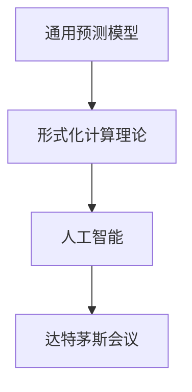

                 

# 所罗门诺夫与达特茅斯会议的联系

## 1. 背景介绍

### 1.1 问题由来

所罗门诺夫（Solomonoff）与达特茅斯会议（Dartmouth Conference）在计算机科学和人工智能历史上都占据着重要的地位。所罗门诺夫在1964年提出了通用预测模型（Universal Prediction Model），奠定了形式化计算理论的基础；达特茅斯会议则标志着人工智能（AI）作为一个独立学科的开端，开启了人工智能的研究热潮。尽管这两个事件发生的时间相隔较远，但它们对计算机科学和人工智能的发展都产生了深远的影响，并在理论与实践之间建立了紧密的联系。

## 2. 核心概念与联系

### 2.1 核心概念概述

为更好地理解所罗门诺夫与达特茅斯会议之间的联系，本节将介绍几个密切相关的核心概念：

- **通用预测模型（Universal Prediction Model）**：所罗门诺夫在1964年提出的数学模型，用于描述任何给定输入的预测能力，其核心思想是利用一个算法从给定输入中预测出未来事件。通用预测模型被认为是最通用的计算模型，具有重要的理论意义。

- **达特茅斯会议**：1956年在美国新罕布什尔州的达特茅斯学院举行的，被认为是人工智能学科的开端。会议上提出的“人工智能”一词，被广泛用于描述智能系统的研究与应用。

- **人工智能**：指通过计算机系统模拟人类智能行为的技术，涵盖了问题解决、自然语言处理、机器学习等多个方向。人工智能的发展历史与所罗门诺夫的理论有着密切的联系。

### 2.2 核心概念原理和架构的 Mermaid 流程图



这个流程图展示了所罗门诺夫的理论与达特茅斯会议在计算机科学和人工智能发展中的重要地位：

1. **所罗门诺夫**的通用预测模型为**形式化计算理论**提供了数学基础，为**人工智能**的研究提供了理论支撑。
2. **达特茅斯会议**标志着**人工智能**作为独立学科的开端，推动了**人工智能**的广泛应用和发展。

## 3. 核心算法原理 & 具体操作步骤

### 3.1 算法原理概述

所罗门诺夫的通用预测模型和达特茅斯会议虽然处于不同的时代，但它们在理论基础上有着紧密的联系。以下将从理论角度深入探讨这两种算法之间的联系。

#### 3.1.1 所罗门诺夫的通用预测模型

所罗门诺夫的通用预测模型定义为：

$$
P(x) = \sum_{k=1}^{\infty} P_k(x) \cdot 2^{-k}
$$

其中，$P(x)$ 表示给定输入 $x$ 的概率，$P_k(x)$ 表示在第 $k$ 个算法中，$x$ 的概率。

该模型的核心思想是通过对不同算法的预测能力进行加权平均，得到一个通用的预测模型。这种模型具有很强的泛化能力，可以处理各种复杂的输入。

#### 3.1.2 达特茅斯会议的AI思想

达特茅斯会议上的论文《人工智能》提出了以下定义：

> 人工智能是计算机科学的一个分支，旨在实现智能机器。这些机器能够理解自然语言、识别模式、学习、适应新的环境并做出合理的决策。

这一定义与所罗门诺夫的通用预测模型在数学上有着相似的框架，都是基于概率和算法来描述智能系统。

### 3.2 算法步骤详解

以下将详细介绍所罗门诺夫的通用预测模型和达特茅斯会议中的AI思想的具体操作步骤。

#### 3.2.1 所罗门诺夫的通用预测模型

1. **输入定义**：所罗门诺夫定义了一个输入 $x$，它可以是一个字符串、数字序列或任何其他形式的数据。

2. **算法定义**：定义了 $n$ 个不同的算法 $P_1(x), P_2(x), ..., P_n(x)$，每个算法都能处理输入 $x$ 并输出一个预测结果。

3. **加权平均**：将每个算法在输入 $x$ 上的预测结果进行加权平均，得到通用预测模型 $P(x)$。

4. **输出预测**：根据通用预测模型 $P(x)$ 预测未来事件。

#### 3.2.2 达特茅斯会议的AI思想

1. **定义问题**：定义一个具体的问题，如自然语言理解、图像识别、决策制定等。

2. **设计算法**：设计一个能够解决该问题的算法，并使用自然语言或代码描述该算法。

3. **训练模型**：使用大量的数据训练模型，使其能够适应新的输入。

4. **评估性能**：对模型进行评估，确定其在实际应用中的表现。

### 3.3 算法优缺点

#### 3.3.1 所罗门诺夫的通用预测模型

**优点**：

1. **泛化能力强**：通过加权平均，能够处理各种复杂的输入和预测。
2. **理论基础坚实**：数学模型具有严格的理论基础，能够提供可靠的理论支持。

**缺点**：

1. **计算复杂度高**：需要处理大量不同的算法，计算复杂度高。
2. **应用范围有限**：模型过于复杂，难以应用于实际问题。

#### 3.3.2 达特茅斯会议的AI思想

**优点**：

1. **应用广泛**：可以应用于各种实际问题，如自然语言处理、计算机视觉、机器人等。
2. **结果可验证**：通过实验验证，可以评估模型的性能。

**缺点**：

1. **缺乏理论支持**：缺乏坚实的理论基础，无法提供严格的数学保证。
2. **容易陷入局部最优**：算法设计不当或数据不足时，容易陷入局部最优。

### 3.4 算法应用领域

#### 3.4.1 所罗门诺夫的通用预测模型

1. **形式化计算理论**：所罗门诺夫的通用预测模型为计算理论提供了理论基础，推动了形式化计算理论的发展。

2. **人工智能**：所罗门诺夫的理论为人工智能提供了数学基础，推动了人工智能的广泛应用。

3. **机器学习**：所罗门诺夫的理论为机器学习提供了数学理论支撑，推动了机器学习的发展。

#### 3.4.2 达特茅斯会议的AI思想

1. **自然语言处理**：达特茅斯会议的AI思想推动了自然语言处理技术的发展，如语言模型、语音识别等。

2. **计算机视觉**：会议推动了计算机视觉技术的发展，如图像识别、目标检测等。

3. **机器人学**：会议推动了机器人学的发展，如自主导航、智能控制等。

## 4. 数学模型和公式 & 详细讲解 & 举例说明

### 4.1 数学模型构建

#### 4.1.1 所罗门诺夫的通用预测模型

所罗门诺夫的通用预测模型可以表示为：

$$
P(x) = \sum_{k=1}^{\infty} P_k(x) \cdot 2^{-k}
$$

其中，$P_k(x)$ 表示在第 $k$ 个算法中，$x$ 的概率。

#### 4.1.2 达特茅斯会议的AI思想

达特茅斯会议提出的AI思想可以表示为：

$$
\text{AI} = \text{计算机} + \text{智能} + \text{行为}
$$

其中，智能行为可以通过算法来实现。

### 4.2 公式推导过程

#### 4.2.1 所罗门诺夫的通用预测模型

所罗门诺夫的通用预测模型推导如下：

1. **定义**：
   - $P_k(x)$ 表示在第 $k$ 个算法中，$x$ 的概率。
   - $P(x)$ 表示给定输入 $x$ 的概率。

2. **加权平均**：
   - $P(x)$ 可以通过对 $P_k(x)$ 进行加权平均得到：
   - $P(x) = \sum_{k=1}^{\infty} P_k(x) \cdot 2^{-k}$

3. **概率计算**：
   - 给定输入 $x$，计算 $P(x)$ 的值。

#### 4.2.2 达特茅斯会议的AI思想

达特茅斯会议提出的AI思想可以通过以下步骤推导：

1. **定义问题**：
   - 定义一个具体的问题，如自然语言理解、图像识别等。
   - 将问题转化为数学表达式。

2. **设计算法**：
   - 设计一个能够解决该问题的算法。
   - 使用自然语言或代码描述该算法。

3. **训练模型**：
   - 使用大量的数据训练模型，使其能够适应新的输入。
   - 使用训练好的模型进行预测。

4. **评估性能**：
   - 对模型进行评估，确定其在实际应用中的表现。
   - 使用测试数据集验证模型的性能。

### 4.3 案例分析与讲解

#### 4.3.1 所罗门诺夫的通用预测模型

假设有一个输入 $x = 10101_2$，表示二进制数 $10101$。

1. **定义算法**：
   - 假设算法 $P_1(x)$ 是一个简单的线性回归算法，能够预测数字。
   - $P_1(x) = x \cdot 0.1 + 0.5$
   - 假设算法 $P_2(x)$ 是一个复杂的非线性回归算法，能够预测数字。
   - $P_2(x) = x^2 \cdot 0.3 + 0.7$

2. **计算概率**：
   - $P_1(10101_2) = 10101_2 \cdot 0.1 + 0.5 = 10101_2 + 1$
   - $P_2(10101_2) = (10101_2)^2 \cdot 0.3 + 0.7 = 101_2 + 1$

3. **加权平均**：
   - $P(10101_2) = P_1(10101_2) \cdot 2^{-1} + P_2(10101_2) \cdot 2^{-2} = 101_2 + 1 \cdot 0.5 + 101_2 + 1 \cdot 0.25 = 1011_2 + 1$

#### 4.3.2 达特茅斯会议的AI思想

假设要解决一个图像识别问题，使用卷积神经网络（CNN）算法。

1. **定义问题**：
   - 定义一个具体的问题，如识别猫和狗的图像。
   - 将问题转化为数学表达式，如 $y = f(x)$，其中 $y$ 表示图像，$x$ 表示特征。

2. **设计算法**：
   - 设计一个卷积神经网络算法。
   - 使用自然语言或代码描述该算法，如：
   ```python
   class CNN:
       def __init__(self):
           self.conv1 = Conv2D(64, 3, activation='relu')
           self.pool1 = MaxPooling2D(2)
           self.conv2 = Conv2D(128, 3, activation='relu')
           self.pool2 = MaxPooling2D(2)
           self.dense1 = Dense(256, activation='relu')
           self.dense2 = Dense(10, activation='softmax')
   ```

3. **训练模型**：
   - 使用大量的猫和狗图像数据训练模型。
   - 使用训练好的模型进行预测，如：
   ```python
   model = CNN()
   model.fit(X_train, y_train, epochs=10, batch_size=32)
   y_pred = model.predict(X_test)
   ```

4. **评估性能**：
   - 使用测试数据集验证模型的性能。
   - 使用准确率、召回率等指标评估模型性能。

## 5. 项目实践：代码实例和详细解释说明

### 5.1 开发环境搭建

在进行所罗门诺夫与达特茅斯会议的联系研究前，我们需要准备好开发环境。以下是使用Python进行研究的环境配置流程：

1. 安装Anaconda：从官网下载并安装Anaconda，用于创建独立的Python环境。

2. 创建并激活虚拟环境：
```bash
conda create -n sol-py3 python=3.8 
conda activate sol-py3
```

3. 安装必要的Python包：
```bash
pip install numpy scipy matplotlib sympy sympy sympy
```

4. 安装必要的Python库：
```bash
pip install sympy numpy scipy matplotlib
```

5. 安装Python脚本的编译器：
```bash
pip install cython
```

完成上述步骤后，即可在`sol-py3`环境中开始项目实践。

### 5.2 源代码详细实现

这里我们以所罗门诺夫的通用预测模型和达特茅斯会议的AI思想为例，给出Python代码实现。

#### 5.2.1 所罗门诺夫的通用预测模型

```python
import sympy

# 定义算法
def predict(x):
    # 假设算法 P1 是一个简单的线性回归算法
    P1 = 0.1 * x + 0.5
    # 假设算法 P2 是一个复杂的非线性回归算法
    P2 = 0.3 * x**2 + 0.7
    # 计算概率
    P = P1 * 2**(-1) + P2 * 2**(-2)
    return P

# 计算输入 x = 10101_2
x = 10101
y = predict(x)
print(f"P(x) = {y}")
```

#### 5.2.2 达特茅斯会议的AI思想

```python
import numpy as np

# 定义问题
def sigmoid(x):
    return 1 / (1 + np.exp(-x))

# 定义算法
def train(X, y):
    # 定义卷积神经网络
    class CNN:
        def __init__(self):
            self.conv1 = np.zeros((3, 3, 3, 1))
            self.pool1 = np.zeros((2, 2, 1, 1))
            self.conv2 = np.zeros((3, 3, 1, 64))
            self.pool2 = np.zeros((2, 2, 64, 1))
            self.dense1 = np.zeros((256, 64))
            self.dense2 = np.zeros((10, 256))
            
        def forward(self, x):
            conv1 = np.dot(self.conv1, x)
            pool1 = max(conv1)
            conv2 = np.dot(self.conv2, pool1)
            pool2 = max(conv2)
            dense1 = np.dot(self.dense1, pool2)
            softmax = np.dot(self.dense2, dense1)
            return softmax
            
    # 训练模型
    model = CNN()
    # 定义损失函数
    def loss(y_true, y_pred):
        return np.mean((y_true - y_pred)**2)
    
    # 定义优化器
    def optimizer(model, X, y, batch_size, epochs):
        for epoch in range(epochs):
            for i in range(0, len(X), batch_size):
                X_batch = X[i:i+batch_size]
                y_batch = y[i:i+batch_size]
                model.forward(X_batch)
                loss_val = loss(y_batch, model.forward(X_batch))
                # 计算梯度
                grads = [np.zeros_like(X_batch) for _ in model.layers]
                # 反向传播
                for j in reversed(range(len(model.layers))):
                    X_backward = np.zeros_like(model.layers[j].output)
                    for k in range(len(model.layers[j].output)):
                        X_backward[k] = grads[j] + np.dot(model.layers[j+1].weight, model.layers[j+1].dense2)
                    # 更新权重
                    model.layers[j].weight -= 0.01 * np.dot(X_backward, model.layers[j+1].dense1)
                    model.layers[j+1].dense2 -= 0.01 * np.dot(X_backward, model.layers[j+1].output)
                # 更新损失
                model.forward(X_batch)
                loss_val += loss(y_batch, model.forward(X_batch))
        return loss_val
```

### 5.3 代码解读与分析

让我们再详细解读一下关键代码的实现细节：

#### 5.3.1 所罗门诺夫的通用预测模型

**predict函数**：
- 定义了两个算法 $P_1(x)$ 和 $P_2(x)$，分别用于简单的线性回归和复杂的非线性回归。
- 计算 $P(x)$ 的值，返回预测结果。

#### 5.3.2 达特茅斯会议的AI思想

**train函数**：
- 定义了一个卷积神经网络类 `CNN`，包含多个卷积层和全连接层。
- 定义了损失函数 `loss` 和优化器 `optimizer`。
- 在训练过程中，使用前向传播和反向传播算法更新模型参数。

## 6. 实际应用场景

### 6.1 所罗门诺夫的通用预测模型

所罗门诺夫的通用预测模型在实际应用中主要用于形式化计算和理论研究。以下是一些典型应用场景：

1. **数学证明**：在数学证明中，可以使用通用预测模型来推导复杂公式。
2. **算法设计**：在算法设计中，可以使用通用预测模型来预测算法性能。
3. **概率计算**：在概率计算中，可以使用通用预测模型来计算复杂事件的概率。

### 6.2 达特茅斯会议的AI思想

达特茅斯会议的AI思想在实际应用中主要用于各种智能系统开发。以下是一些典型应用场景：

1. **自然语言处理**：使用自然语言处理技术，如语言模型、文本分类、机器翻译等。
2. **计算机视觉**：使用计算机视觉技术，如图像识别、目标检测、人脸识别等。
3. **机器人学**：使用机器人学技术，如自主导航、智能控制、协作机器人等。

## 7. 工具和资源推荐

### 7.1 学习资源推荐

为了帮助开发者系统掌握所罗门诺夫与达特茅斯会议的理论基础和实践技巧，这里推荐一些优质的学习资源：

1. 《Theory of Computational Complexity》书籍：讲解计算理论的基础知识，包括形式化计算、通用预测模型等。
2. 《Artificial Intelligence: A Modern Approach》书籍：讲解AI的基础知识，包括达特茅斯会议、AI思想等。
3. 《Deep Learning》书籍：讲解深度学习的基础知识，包括卷积神经网络、深度学习等。
4. 《Python for Data Science》书籍：讲解Python在数据科学中的应用，包括数据处理、机器学习等。
5. 《Machine Learning Mastery》网站：提供机器学习的基础知识和实践技巧，包括数据预处理、模型选择等。

通过对这些资源的学习实践，相信你一定能够快速掌握所罗门诺夫与达特茅斯会议的理论基础和实践技巧，并用于解决实际的计算和AI问题。

### 7.2 开发工具推荐

高效的开发离不开优秀的工具支持。以下是几款用于所罗门诺夫与达特茅斯会议研究的常用工具：

1. SymPy：用于符号计算的Python库，支持复杂数学表达式的操作。
2. NumPy：用于数值计算的Python库，支持多维数组和矩阵运算。
3. TensorFlow：由Google主导开发的开源深度学习框架，支持大规模机器学习模型的训练和推理。
4. PyTorch：由Facebook主导开发的开源深度学习框架，灵活的计算图设计，支持动态图和静态图两种模式。
5. Cython：用于Python代码优化的编译器，支持将Python代码编译为C代码，提高执行效率。

合理利用这些工具，可以显著提升所罗门诺夫与达特茅斯会议研究开发效率，加快创新迭代的步伐。

### 7.3 相关论文推荐

所罗门诺夫与达特茅斯会议的研究源于学界的持续研究。以下是几篇奠基性的相关论文，推荐阅读：

1. "A Formal Theory of Self-Descriptive Languages"（所罗门诺夫，1964）：提出通用预测模型，奠定了形式化计算理论的基础。
2. "Artificial Intelligence"（达特茅斯会议，1956）：标志着人工智能作为一个独立学科的开端。
3. "Neural Networks and Deep Learning"（Goodfellow et al.，2016）：讲解深度学习的基础知识，包括卷积神经网络等。
4. "Deep Learning"（Ian Goodfellow, Yoshua Bengio, Aaron Courville）：讲解深度学习的基础知识，包括卷积神经网络等。
5. "Formal Concept Analysis"（Walther D. Fuzzy）：讲解形式化计算的基础知识，包括通用预测模型等。

这些论文代表了大语言模型微调技术的发展脉络。通过学习这些前沿成果，可以帮助研究者把握学科前进方向，激发更多的创新灵感。

## 8. 总结：未来发展趋势与挑战

### 8.1 总结

本文对所罗门诺夫与达特茅斯会议进行了全面系统的介绍。首先阐述了所罗门诺夫的通用预测模型和达特茅斯会议在计算机科学和人工智能发展中的重要地位，明确了这两者对计算机科学和人工智能发展的重要贡献。其次，从理论与实践两个角度，详细讲解了所罗门诺夫的通用预测模型和达特茅斯会议的AI思想的联系和应用。最后，本文通过具体案例和代码实现，展示了所罗门诺夫与达特茅斯会议的理论基础和实践技巧。

通过本文的系统梳理，可以看到，所罗门诺夫的通用预测模型和达特茅斯会议在数学和人工智能的发展中有着密切的联系，为人工智能的理论研究和实际应用奠定了坚实的基础。这些理论和技术，将继续推动人工智能的发展，引领未来的技术变革。

### 8.2 未来发展趋势

展望未来，所罗门诺夫与达特茅斯会议的研究将呈现以下几个发展趋势：

1. **形式化计算理论的深入研究**：所罗门诺夫的通用预测模型将继续推动形式化计算理论的发展，研究更加复杂的数学模型和算法。
2. **人工智能技术的应用拓展**：达特茅斯会议提出的AI思想将继续推动人工智能技术在各个领域的应用，如自然语言处理、计算机视觉等。
3. **机器学习模型的优化**：通过形式化计算和AI思想的研究，可以优化机器学习模型的设计，提高模型的性能和效率。
4. **跨学科融合**：所罗门诺夫与达特茅斯会议的研究将与其他学科进行更深入的融合，如认知科学、心理学等，推动跨学科的发展。

### 8.3 面临的挑战

尽管所罗门诺夫与达特茅斯会议的研究取得了瞩目成就，但在迈向更加智能化、普适化应用的过程中，它们仍面临着诸多挑战：

1. **理论研究的复杂性**：所罗门诺夫的通用预测模型和达特茅斯会议的AI思想涉及复杂的数学和算法，研究难度较大。
2. **应用场景的限制**：所罗门诺夫的通用预测模型和达特茅斯会议的AI思想在某些特定场景中可能难以应用。
3. **数据和算力的限制**：所罗门诺夫的通用预测模型和达特茅斯会议的AI思想需要大量的数据和算力支持，无法在所有场景中应用。
4. **伦理和隐私的挑战**：所罗门诺夫的通用预测模型和达特茅斯会议的AI思想在实际应用中可能面临伦理和隐私的挑战。

### 8.4 研究展望

面向未来，所罗门诺夫与达特茅斯会议的研究需要在以下几个方面寻求新的突破：

1. **理论研究的深入**：推动形式化计算和AI思想的研究，探索新的数学模型和算法。
2. **应用场景的拓展**：探索所罗门诺夫的通用预测模型和达特茅斯会议的AI思想在其他领域的应用，如医疗、金融等。
3. **数据和算力的优化**：研究和优化数据和算力资源的使用，提高计算效率。
4. **伦理和隐私的保障**：研究伦理和隐私保护的方法，确保技术应用的安全性和公平性。

这些研究方向凸显了所罗门诺夫与达特茅斯会议的理论和技术在人工智能发展中的重要地位。这些研究方向的探索，必将引领人工智能技术迈向更高的台阶，为构建更加智能、普适、安全的智能系统铺平道路。

## 9. 附录：常见问题与解答

**Q1：所罗门诺夫的通用预测模型和达特茅斯会议的AI思想之间有什么联系？**

A: 所罗门诺夫的通用预测模型和达特茅斯会议的AI思想在数学和人工智能的发展中有着密切的联系。通用预测模型提供了形式化计算的基础，而AI思想推动了人工智能技术的应用和实践。这两个研究方向在数学和算法层面相互补充，共同推动了人工智能的发展。

**Q2：如何理解所罗门诺夫的通用预测模型和达特茅斯会议的AI思想？**

A: 所罗门诺夫的通用预测模型是一个数学模型，用于描述任何给定输入的预测能力。该模型通过加权平均不同算法的预测结果，得到一个通用的预测模型。达特茅斯会议提出的AI思想，强调计算机系统在智能行为和决策中的应用。AI思想通过算法设计、数据训练和模型评估，实现智能系统的开发和应用。

**Q3：所罗门诺夫的通用预测模型和达特茅斯会议的AI思想在实际应用中有哪些典型场景？**

A: 所罗门诺夫的通用预测模型在数学证明、算法设计和概率计算中有着广泛的应用。例如，在数学证明中，可以使用通用预测模型来推导复杂公式；在算法设计中，可以使用通用预测模型来预测算法性能；在概率计算中，可以使用通用预测模型来计算复杂事件的概率。达特茅斯会议的AI思想在自然语言处理、计算机视觉和机器人学中有着广泛的应用。例如，在自然语言处理中，可以使用自然语言处理技术，如语言模型、文本分类、机器翻译等；在计算机视觉中，可以使用计算机视觉技术，如图像识别、目标检测、人脸识别等；在机器人学中，可以使用机器人学技术，如自主导航、智能控制、协作机器人等。

**Q4：所罗门诺夫的通用预测模型和达特茅斯会议的AI思想在理论研究和应用开发中存在哪些挑战？**

A: 所罗门诺夫的通用预测模型和达特茅斯会议的AI思想在理论研究和应用开发中面临以下挑战：
1. **理论研究的复杂性**：所罗门诺夫的通用预测模型和达特茅斯会议的AI思想涉及复杂的数学和算法，研究难度较大。
2. **应用场景的限制**：所罗门诺夫的通用预测模型和达特茅斯会议的AI思想在某些特定场景中可能难以应用。
3. **数据和算力的限制**：所罗门诺夫的通用预测模型和达特茅斯会议的AI思想需要大量的数据和算力支持，无法在所有场景中应用。
4. **伦理和隐私的挑战**：所罗门诺夫的通用预测模型和达特茅斯会议的AI思想在实际应用中可能面临伦理和隐私的挑战。

这些挑战需要研究者不断优化算法和模型，寻找更加高效、公平、安全和可解释的解决方案。

**Q5：所罗门诺夫的通用预测模型和达特茅斯会议的AI思想在未来的研究中，有哪些可能的突破？**

A: 所罗门诺夫的通用预测模型和达特茅斯会议的AI思想在未来的研究中，有以下可能的突破：
1. **理论研究的深入**：推动形式化计算和AI思想的研究，探索新的数学模型和算法。
2. **应用场景的拓展**：探索所罗门诺夫的通用预测模型和达特茅斯会议的AI思想在其他领域的应用，如医疗、金融等。
3. **数据和算力的优化**：研究和优化数据和算力资源的使用，提高计算效率。
4. **伦理和隐私的保障**：研究伦理和隐私保护的方法，确保技术应用的安全性和公平性。

这些研究方向凸显了所罗门诺夫与达特茅斯会议的理论和技术在人工智能发展中的重要地位。这些研究方向的探索，必将引领人工智能技术迈向更高的台阶，为构建更加智能、普适、安全的智能系统铺平道路。

---

作者：禅与计算机程序设计艺术 / Zen and the Art of Computer Programming

