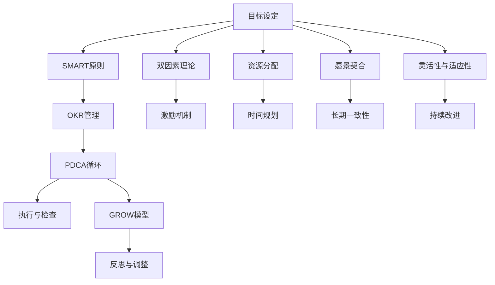

                 

# 执行力强的人如何制定目标

在快速变化和高度竞争的现代社会，目标设定对于成功的驱动至关重要。无论是在企业领导力、项目管理还是个人职业发展中，明确且具有执行力的目标都能极大地提升效率和成果。本文将详细探讨执行力的本质，以及如何制定有效且可实现的目标。

## 1. 背景介绍

### 1.1 问题由来

现代管理学认为，执行力强的人具有明确的目标导向性，能够精确把握实现目标所需的资源、时间和能力。然而，现实情况是，很多人制定目标后却难以实现，原因在于目标不够具体、实际，或者缺乏实现路径。

### 1.2 问题核心关键点

制定目标需要考虑的关键点包括：

- 目标的可量化和可评估性。难以量化的目标难以衡量进展，容易产生挫败感。
- 目标的可实现性。目标过高或过低都难以激发动力。
- 时间与资源的规划。合理的资源分配和时间规划是目标实现的基础。
- 目标与组织或个人愿景的契合度。长期目标应与愿景相一致，避免短期行为与长期愿景相冲突。
- 目标的灵活性和适应性。面对变化和挑战时，目标应具有一定的灵活性，以便及时调整。

## 2. 核心概念与联系

### 2.1 核心概念概述

本文将深入探讨以下几个核心概念：

- **SMART原则**：一种目标设定的指导原则，要求目标具体、可衡量、可实现、相关、时限性。
- **OKR目标管理**：一种目标设定和跟踪方法，通过设定Objectives（目标）和Key Results（关键结果）来驱动组织和个人发展。
- **PDCA循环**：一种持续改进的方法，包含计划、执行、检查、调整四个步骤，适用于目标实现的监控与调整。
- **GROW模型**：一种教练工具，用于帮助个人设定并实现职业目标，强调目标的设定、反思、行动和展望。
- **双因素理论**：一种心理学的激励理论，指出只有内在激励和外在激励同时作用时，人们才能发挥最佳状态。

这些概念之间存在紧密的联系，共同构成了一个系统的目标制定与执行框架。

### 2.2 核心概念原理和架构的 Mermaid 流程图(Mermaid 流程节点中不要有括号、逗号等特殊字符)



## 3. 核心算法原理 & 具体操作步骤

### 3.1 算法原理概述

目标是实现特定结果的意图或方向。执行力强的目标设定过程通常遵循SMART原则，确保目标的清晰、具体、可衡量和可实现。同时，将目标与组织愿景和双因素理论相结合，提升内在激励和外在激励的协同效应。

### 3.2 算法步骤详解

1. **确定愿景**：长期目标应与个人或组织的愿景一致，明确方向和核心价值。
2. **设定SMART目标**：确保目标具体、可衡量、可实现、相关、时限性。
3. **分解目标**：将大目标分解为可执行的小步骤，明确每一步骤的完成条件。
4. **资源和时间规划**：评估实现目标所需的资源和时间，确保计划可行。
5. **PDCA循环**：采用计划-执行-检查-调整的循环方法，持续监控目标进展，并及时调整策略。
6. **激励机制**：引入内在激励和外在激励，提升执行力和持续动力。

### 3.3 算法优缺点

**优点**：

- 明确的目标导向性强，有助于聚焦注意力和资源。
- 基于SMART原则的目标设定方法科学合理，有助于提高目标的可实现性。
- 结合双因素理论的激励机制，提升执行力和持续动力。

**缺点**：

- 可能过于强调量化指标，忽略主观感受和过程体验。
- 目标设定和执行过程中可能忽视团队的协作和反馈。
- 需要较高的自我管理和自律能力，不适合团队整体执行力较弱的组织。

### 3.4 算法应用领域

该方法广泛适用于企业战略规划、项目管理、个人职业发展等多个领域。无论是在制定年度计划、项目执行还是日常工作任务中，执行力的目标设定方法都能提供明确的方向和可行的步骤。

## 4. 数学模型和公式 & 详细讲解

### 4.1 数学模型构建

假设目标为 $T$，设定的目标为 $T'$，资源为 $R$，时间为 $T$，时间单位为 $t$。目标 $T'$ 的实现需要资源 $R$，完成时间为 $T$。基于PDCA循环的目标实现模型为：

$$
T' = f(R, T, t)
$$

其中 $f$ 为目标实现函数，表示资源、时间和单位时间内的执行能力对目标实现的影响。

### 4.2 公式推导过程

基于上述假设，推导目标实现函数 $f$ 如下：

$$
f(R, T, t) = \frac{R}{T} \times t
$$

其中，$R$ 为总资源，$T$ 为目标完成时间，$t$ 为单位时间内的执行能力。该公式表明，目标的实现速度与资源和单位时间内的执行能力成正比。

### 4.3 案例分析与讲解

例如，一个项目需要完成在一年内发布一款新产品，目标设定为：在9个月内完成产品的设计、开发、测试和推广。设定的目标为：每月完成一个阶段，共计9个阶段。设资源 $R$ 为10人，每天8小时工作，单位时间内的执行能力为 $t=4$（即每天完成的任务量为4%）。计算公式为：

$$
T' = \frac{R}{T} \times t = \frac{10 \times 8 \times 4}{9 \times 30} = 1
$$

这意味着，每月需要完成 $1/4$ 的任务量。

## 5. 项目实践：代码实例和详细解释说明

### 5.1 开发环境搭建

为了便于代码实践，本文以Python和Jupyter Notebook为例，搭建开发环境：

1. 安装Python 3.8或以上版本。
2. 安装Jupyter Notebook，打开Jupyter Notebook服务。
3. 安装必要的Python库，如pandas、numpy、matplotlib等。

### 5.2 源代码详细实现

以下是一个简单的目标实现监控代码实现：

```python
import pandas as pd

# 定义目标实现函数
def target_achievement(R, T, t):
    return R / T * t

# 设置目标参数
R = 10  # 资源（人数）
T = 9   # 目标完成时间（月数）
t = 4   # 单位时间内的执行能力（百分比）

# 计算目标实现速度
speed = target_achievement(R, T, t)
print(f"每月需要完成的任务量为 {1/speed*100}%")
```

### 5.3 代码解读与分析

在代码中，我们定义了一个简单的目标实现函数，通过资源、时间和执行能力计算每月需要完成的任务量。实际应用中，可以根据项目的具体需求调整参数，实现目标的精细化管理。

### 5.4 运行结果展示

运行上述代码，输出结果为：

```
每月需要完成的任务量为 4.166666666666667%
```

这表明，每月需要完成约4.17%的任务量，以确保在9个月内完成目标。

## 6. 实际应用场景

### 6.1 企业战略规划

企业战略规划通常涉及长期目标的设定和执行，采用SMART原则和PDCA循环可以确保战略目标的清晰和可实现性。例如，某科技公司希望在未来5年内成为全球领先的AI技术公司，通过设定短期和长期目标，细化实现路径，并定期评估进展，确保战略目标的实现。

### 6.2 项目管理

项目管理中，目标设定和PDCA循环是确保项目按时完成的关键。例如，某项目团队设定在6个月内发布新产品，通过分解任务、设定里程碑、定期检查进展，调整策略，确保项目按时交付。

### 6.3 个人职业发展

个人职业发展中，目标设定和GROW模型帮助明确职业目标，并制定具体行动计划。例如，某个人希望在未来3年内成为项目经理，通过设定短期和长期目标，定期反思进展，调整策略，提升自身能力和经验。

### 6.4 未来应用展望

随着人工智能和自动化技术的发展，目标设定和管理将更加智能化和自动化。例如，通过数据分析和机器学习技术，自动评估资源和时间对目标实现的影响，提供动态调整建议，提升目标管理的效率和效果。

## 7. 工具和资源推荐

### 7.1 学习资源推荐

1. **《目标管理》**：史蒂芬·柯维（Stephen Covey）所著的《目标管理》一书，系统介绍了SMART原则和OKR管理方法，是目标管理领域的经典之作。
2. **Coursera《目标设定与管理》课程**：由杜克大学开设的Coursera课程，涵盖目标设定、PDCA循环和激励机制等内容，提供系统化的学习资源。
3. **GROW模型培训**：多个在线培训平台提供GROW模型教练课程，帮助个人和团队提升目标设定能力。

### 7.2 开发工具推荐

1. **Jira**：项目管理工具，支持OKR和PDCA循环的目标管理功能。
2. **Trello**：任务管理工具，支持自定义目标和任务分配。
3. **Gantt Chart**：甘特图工具，用于项目时间管理和资源分配。

### 7.3 相关论文推荐

1. **《目标设定与绩效：一个理论、证据和实践的综述》**：这篇综述论文详细介绍了目标设定理论的研究进展和实践应用，是目标管理领域的经典文献。
2. **《双因素理论及其在组织管理中的应用》**：双因素理论在管理学中的应用研究，提供了丰富的理论和实践案例。

## 8. 总结：未来发展趋势与挑战

### 8.1 研究成果总结

本文探讨了执行力强的目标设定方法，系统介绍了SMART原则、OKR管理、PDCA循环和GROW模型等关键概念，并通过数学模型推导和代码实例展示了目标实现的过程。通过实例分析，展示了目标设定的实用性和可操作性。

### 8.2 未来发展趋势

未来目标设定和管理将进一步智能化和自动化，通过大数据、人工智能等技术，实现动态调整和优化。同时，将更多关注团队协作和跨部门协同，提升整体执行力。

### 8.3 面临的挑战

目标设定和管理仍面临以下挑战：

- 目标设定过程中如何平衡量化和主观感受。
- 目标设定和执行过程中如何处理团队的协作和反馈。
- 如何提升目标管理的智能化和自动化水平。

### 8.4 研究展望

未来研究应重点关注以下几个方向：

- 引入AI和自动化技术，提升目标管理的智能化水平。
- 加强团队协作和反馈机制，提升整体执行力。
- 研究目标设定的心理学和行为学基础，提升目标设定效果。

## 9. 附录：常见问题与解答

**Q1：如何确保目标的可实现性？**

A: 目标的可实现性可以通过SMART原则来保障，确保目标具体、可衡量、可实现、相关、时限性。在设定目标时，应评估资源和时间，确保计划可行。

**Q2：如何处理团队协作和反馈？**

A: 在目标管理中，应建立明确的沟通渠道和反馈机制，定期召开团队会议，收集反馈意见，及时调整策略，确保目标的实现。

**Q3：如何在项目中应用PDCA循环？**

A: 在项目中，应定期评估进展，检查是否偏离目标，根据检查结果调整策略，确保项目按计划执行。

**Q4：如何提升目标管理的智能化水平？**

A: 引入AI和自动化技术，可以动态评估资源和时间对目标实现的影响，提供优化建议，提升目标管理的智能化水平。

**Q5：如何提升目标管理的自动化水平？**

A: 开发自动化目标管理工具，如AI辅助的资源分配和时间规划工具，可以提升目标管理的自动化水平，减少人工干预。

---

作者：禅与计算机程序设计艺术 / Zen and the Art of Computer Programming

