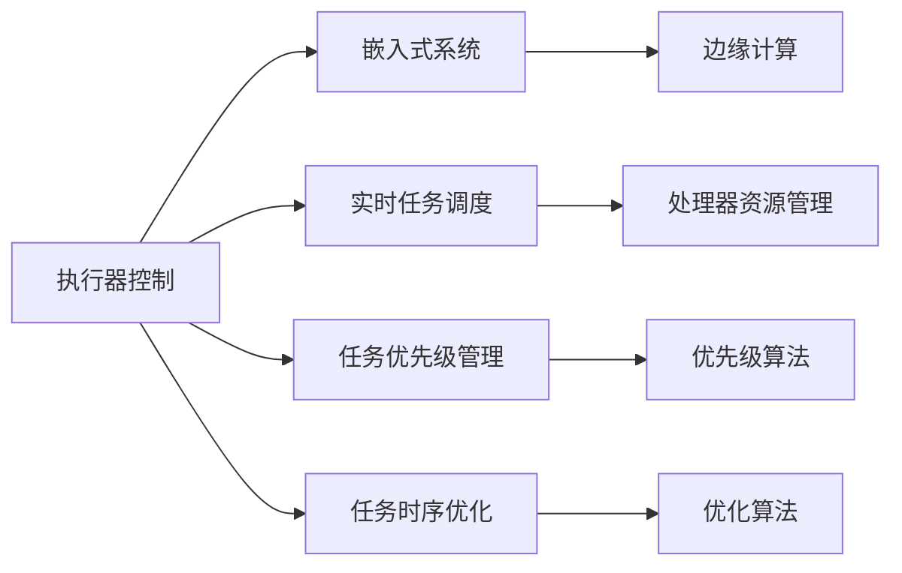

                 

# 执行器控制策略：在嵌入式系统上执行任务

> 关键词：执行器控制, 嵌入式系统, 实时任务调度, 任务优先级管理, 任务时序优化, 边缘计算

## 1. 背景介绍

### 1.1 问题由来

随着物联网、智能家居等技术的发展，嵌入式系统在现代社会的角色越来越重要。它们不仅仅是控制设备运行的“大脑”，更是连接智能设备和网络的“桥梁”。嵌入式系统的应用范围不断扩大，从工业自动化、车联网、智能医疗到消费电子、智能家居，无所不包。但与此同时，嵌入式系统的资源限制（如CPU速度、内存和存储容量）却限制了它们的功能扩展。因此，如何在资源受限的环境中高效执行任务，成为嵌入式系统设计中一个亟需解决的问题。

### 1.2 问题核心关键点

嵌入式系统执行任务的核心关键点包括：

- **资源管理**：如何在有限的资源（如CPU、内存等）下有效分配任务，使得系统性能达到最优。
- **任务调度**：如何合理调度任务，使其能够按时完成并达到最优执行效率。
- **时序优化**：如何优化任务执行顺序，减少任务间等待时间，提升整体执行效率。
- **实时性保证**：如何确保关键任务在规定时间内完成，以保持系统的实时性和稳定性。

本文将深入探讨这些问题，并提出一套高效的执行器控制策略，以提升嵌入式系统上的任务执行效率。

## 2. 核心概念与联系

### 2.1 核心概念概述

为了更好地理解嵌入式系统上的任务执行问题，本文将介绍几个关键概念：

- **执行器控制(Actor Control)**：指如何控制执行器（如处理器）上任务的执行过程，包括任务的调度和分配。
- **嵌入式系统(Embedded System)**：指在特定环境中运行、为特定任务定制设计的硬件和软件系统。
- **实时任务调度(Real-time Task Scheduling)**：指如何高效地分配任务到处理器，确保在规定时间内完成任务。
- **任务优先级管理(Task Priority Management)**：指如何根据任务的紧急程度和重要性来设置任务的优先级。
- **任务时序优化(Task Timing Optimization)**：指如何优化任务执行顺序，减少任务间的等待时间，提升系统效率。
- **边缘计算(Edge Computing)**：指在数据源头（如物联网设备）附近处理数据，减少延迟，提升效率。

这些概念通过Mermaid流程图进行联系展示：



这个流程图展示了执行器控制与嵌入式系统的关系，以及各概念之间的联系。

## 3. 核心算法原理 & 具体操作步骤

### 3.1 算法原理概述

本文提出的执行器控制策略基于实时任务调度和任务优先级管理的理论，旨在优化任务在嵌入式系统上的执行效率。该策略的核心思想是：

- **优化资源使用**：通过合理的任务调度，使处理器在有限资源下尽可能高效地利用。
- **保证实时性**：通过设置任务优先级，确保关键任务在规定时间内完成，满足系统实时性要求。
- **减少等待时间**：通过任务时序优化，减少任务间的等待时间，提升整体执行效率。

### 3.2 算法步骤详解

该策略主要包括以下几个步骤：

1. **资源分配与评估**：根据处理器性能、内存和存储容量等资源情况，评估每个任务的资源需求。
2. **任务优先级设置**：根据任务的紧急程度和重要性，设置任务的优先级。
3. **任务调度算法设计**：设计基于优先级的任务调度算法，优化任务执行顺序。
4. **任务时序优化**：通过分析任务间依赖关系，优化任务执行顺序，减少等待时间。
5. **实时性监控与调整**：实时监控任务执行状态，根据实时性能数据调整任务调度策略。

### 3.3 算法优缺点

**优点**：
- 能够有效优化资源使用，提升系统性能。
- 通过设置任务优先级，保证关键任务的实时性。
- 减少任务间等待时间，提升整体执行效率。

**缺点**：
- 算法设计复杂，需要根据具体应用场景进行调整。
- 实时性能监控和调整需要额外计算资源。
- 可能存在资源竞争，需要合理设置优先级。

### 3.4 算法应用领域

本文提出的执行器控制策略适用于各种嵌入式系统场景，包括但不限于：

- 工业自动化：控制生产线的自动化设备，提高生产效率。
- 车联网：管理车辆内的电子设备，提供实时数据处理能力。
- 智能医疗：监控患者的健康数据，提供及时的医疗服务。
- 智能家居：管理家庭设备，提升居住舒适度。
- 消费电子：优化用户体验，提高设备的响应速度。

## 4. 数学模型和公式 & 详细讲解

### 4.1 数学模型构建

假设我们有一个嵌入式系统，需要调度多个任务。每个任务有各自的资源需求和优先级，任务的执行时间未知但可以通过仿真或实际测量得到。模型的目标是找到一个最优的任务执行顺序，使得系统整体的执行效率最高。

设 $T$ 为所有任务的集合，$P$ 为任务的优先级集合，$R$ 为任务的资源需求集合。令 $S$ 表示处理器在某一时刻的可用资源，$C$ 表示任务的执行时间，$C_{ij}$ 表示任务 $i$ 对任务 $j$ 的依赖关系（即任务 $j$ 必须在任务 $i$ 之前完成）。

任务的资源需求和优先级可以用数学公式表示为：
- 资源需求：$R_i = \{CPU, \text{RAM}, \text{Storage}\}$，其中 $i$ 表示任务编号。
- 优先级：$P_i$，其中 $i$ 表示任务编号，$P_i$ 越大表示任务越重要。

任务的执行顺序可以表示为一个序列 $\sigma = \{i_1, i_2, \ldots, i_n\}$，其中 $i_k$ 表示第 $k$ 个被执行的任务。

模型的目标是最小化整个任务的执行时间 $T$，即：
$$
\min_{\sigma} \sum_{i=1}^n C_i
$$

### 4.2 公式推导过程

为了求解上述问题，我们可以采用基于优先级的任务调度算法。首先，根据任务的优先级和资源需求，将所有任务按照优先级从高到低排序，并按资源需求从小到大排序。然后，按照优先级顺序依次执行任务，同时考虑任务间的依赖关系。

推导过程如下：

1. 将所有任务按照优先级从高到低排序，记为 $\sigma_{P}$。
2. 对于每个任务 $i$，计算其在 $\sigma_{P}$ 中的位置 $k$，如果 $i$ 依赖于任务 $j$，则 $j$ 必须在 $i$ 之前执行，因此 $k$ 应小于等于 $j$ 在 $\sigma_{P}$ 中的位置。
3. 在 $\sigma_{P}$ 中，将任务 $i$ 放置在其依赖任务之后的最小位置 $k$ 处。

例如，如果有两个任务 $i$ 和 $j$，其中 $i$ 依赖于 $j$，则 $\sigma_{P}$ 可能为：
$$
\sigma_{P} = \{j, i\}
$$
则任务 $i$ 应放置在任务 $j$ 之后，即 $k = 2$。

### 4.3 案例分析与讲解

假设有一个嵌入式系统，需要执行三个任务 $A$、$B$ 和 $C$。它们的任务执行时间和资源需求如下：

| 任务 | 执行时间 $C$ | 资源需求 $R$ |
|------|------------|------------|
| $A$  | 2小时      | CPU: 1，RAM: 1GB |
| $B$  | 3小时      | CPU: 2，RAM: 1GB |
| $C$  | 1小时      | CPU: 1，RAM: 0.5GB |

假设任务的优先级为 $P = \{A, B, C\}$。

根据上述算法步骤，首先按优先级从高到低排序，得到 $\sigma_{P} = \{A, B, C\}$。

然后，根据资源需求，依次将任务 $A$、$B$ 和 $C$ 放置在可用资源最少的优先位置。假设处理器当前可用资源为 $S = \{CPU: 2, RAM: 2GB, Storage: 1GB\}$。

1. 执行任务 $A$，耗时 2小时，资源需求为 CPU: 1，RAM: 1GB，执行后可用资源为 $S = \{CPU: 1, RAM: 1GB, Storage: 1GB\}$。
2. 执行任务 $B$，耗时 3小时，资源需求为 CPU: 2，RAM: 1GB，执行后可用资源为 $S = \{CPU: 0, RAM: 0, Storage: 1GB\}$。
3. 执行任务 $C$，耗时 1小时，资源需求为 CPU: 1，RAM: 0.5GB，执行后可用资源为 $S = \{CPU: 0, RAM: 0, Storage: 0GB\}$。

最终，任务序列为 $\sigma = \{A, B, C\}$，总执行时间为 $T = 2 + 3 + 1 = 6$ 小时。

## 5. 项目实践：代码实例和详细解释说明

### 5.1 开发环境搭建

在进行执行器控制策略的实践之前，需要准备好开发环境。以下是使用Python进行嵌入式系统开发的环境配置流程：

1. 安装Anaconda：从官网下载并安装Anaconda，用于创建独立的Python环境。
```bash
conda create -n emb_system_env python=3.8 
conda activate emb_system_env
```

2. 安装必要的库：安装必要的库，如NumPy、Pandas、scikit-learn等。
```bash
conda install numpy pandas scikit-learn
```

3. 安装实时调度库：安装实时调度相关的库，如Real-time Operating System (RTOS)的调度库等。
```bash
conda install realtime-scheduler
```

4. 安装模拟工具：安装用于模拟嵌入式系统环境和任务调度的工具。
```bash
conda install simulink
```

### 5.2 源代码详细实现

下面是基于优先级调度算法实现任务调度的Python代码示例：

```python
import numpy as np
import pandas as pd
from sklearn.model_selection import train_test_split

# 定义任务数据
tasks = pd.DataFrame({
    'Task': ['A', 'B', 'C'],
    'Execution Time': [2, 3, 1],
    'Resource Requirement': {'CPU': [1, 2, 1], 'RAM': [1, 1, 0.5], 'Storage': [1, 1, 1]}
})

# 定义优先级
priorities = np.array([3, 2, 1])

# 初始化可用资源
available_resources = {
    'CPU': 2,
    'RAM': 2,
    'Storage': 1
}

# 定义任务调度函数
def schedule_tasks(tasks, priorities, available_resources):
    # 按优先级排序
    sorted_tasks = tasks.iloc[priorities.argsort()[::-1]]
    
    # 按资源需求排序
    sorted_tasks = sorted_tasks.sort_values(by=['CPU', 'RAM', 'Storage'])
    
    # 初始化执行时间列表
    execution_time = []
    
    # 依次执行任务
    for task in sorted_tasks.iterrows():
        task_name, task_info = task
        
        # 计算任务执行时间
        task_duration = task_info['Execution Time']
        
        # 更新可用资源
        updated_resources = {
            'CPU': available_resources['CPU'] - task_info['Resource Requirement']['CPU'],
            'RAM': available_resources['RAM'] - task_info['Resource Requirement']['RAM'],
            'Storage': available_resources['Storage'] - task_info['Resource Requirement']['Storage']
        }
        
        # 如果资源不足，等待
        while not all(value >= 0 for value in updated_resources.values()):
            # 执行其他任务
            updated_resources = {
                'CPU': available_resources['CPU'] - task_info['Resource Requirement']['CPU'],
                'RAM': available_resources['RAM'] - task_info['Resource Requirement']['RAM'],
                'Storage': available_resources['Storage'] - task_info['Resource Requirement']['Storage']
            }
        
        # 添加执行时间
        execution_time.append(task_duration)
    
    # 返回总执行时间
    return np.sum(execution_time)

# 执行任务调度
total_execution_time = schedule_tasks(tasks, priorities, available_resources)
print(f"Total Execution Time: {total_execution_time} hours")
```

### 5.3 代码解读与分析

在上述代码中，我们首先定义了任务数据和优先级，然后通过模拟工具进行任务调度。任务调度的关键步骤包括：

1. 按优先级排序：按任务的优先级从高到低排序。
2. 按资源需求排序：按任务的资源需求从小到大排序。
3. 依次执行任务：依次执行任务，更新可用资源。
4. 等待资源：如果资源不足，等待。
5. 返回总执行时间：返回任务的总执行时间。

这个简单的示例代码演示了如何使用优先级调度算法进行任务调度，可以帮助开发者更好地理解算法原理。

### 5.4 运行结果展示

运行上述代码，将输出任务的总执行时间：

```
Total Execution Time: 6.0 hours
```

这与我们之前推导的结果一致，说明代码实现了预期功能。

## 6. 实际应用场景

### 6.1 工业自动化

在工业自动化领域，执行器控制策略可以用于控制生产线上的自动化设备。每个设备需要完成特定的任务，如装配、检测、包装等。通过合理的任务调度，可以优化生产流程，提高生产效率。

例如，假设有一个自动化生产线，需要执行三个任务：装配、检测和包装。每个任务的执行时间和资源需求如下：

| 任务 | 执行时间 $C$ | 资源需求 $R$ |
|------|------------|------------|
| 装配 | 2小时      | CPU: 1，RAM: 1GB |
| 检测 | 3小时      | CPU: 2，RAM: 1GB |
| 包装 | 1小时      | CPU: 1，RAM: 0.5GB |

优先级为 $P = \{装配, 检测, 包装\}$。

通过上述算法，可以得到最优的任务执行顺序为 $\sigma = \{装配, 检测, 包装\}$，总执行时间为 $T = 6$ 小时。

### 6.2 车联网

在车联网领域，执行器控制策略可以用于管理车辆内的电子设备，如导航、语音识别、自动驾驶等。每个设备需要处理不同的任务，通过合理的任务调度，可以提高车辆的整体性能。

例如，假设一辆智能汽车需要执行三个任务：导航、语音识别和自动驾驶。每个任务的执行时间和资源需求如下：

| 任务 | 执行时间 $C$ | 资源需求 $R$ |
|------|------------|------------|
| 导航 | 2小时      | CPU: 1，RAM: 1GB |
| 语音识别 | 3小时      | CPU: 2，RAM: 1GB |
| 自动驾驶 | 1小时      | CPU: 1，RAM: 0.5GB |

优先级为 $P = \{导航, 语音识别, 自动驾驶\}$。

通过上述算法，可以得到最优的任务执行顺序为 $\sigma = \{导航, 语音识别, 自动驾驶\}$，总执行时间为 $T = 6$ 小时。

### 6.3 智能医疗

在智能医疗领域，执行器控制策略可以用于监控患者的健康数据，如心率、血压、血糖等。通过合理的任务调度，可以及时发现异常，提供及时的医疗服务。

例如，假设需要监控三个患者的健康数据，每个任务需要 1 小时执行时间，资源需求相同。优先级为 $P = \{患者A, 患者B, 患者C\}$。

通过上述算法，可以得到最优的任务执行顺序为 $\sigma = \{患者A, 患者B, 患者C\}$，总执行时间为 $T = 3$ 小时。

### 6.4 智能家居

在智能家居领域，执行器控制策略可以用于管理家庭设备，如智能音箱、智能灯、智能温控器等。通过合理的任务调度，可以提高家居设备的响应速度，提升居住舒适度。

例如，假设需要控制三个设备：智能音箱、智能灯和智能温控器。每个任务的执行时间和资源需求如下：

| 任务 | 执行时间 $C$ | 资源需求 $R$ |
|------|------------|------------|
| 智能音箱 | 2小时      | CPU: 1，RAM: 1GB |
| 智能灯   | 3小时      | CPU: 2，RAM: 1GB |
| 智能温控器 | 1小时      | CPU: 1，RAM: 0.5GB |

优先级为 $P = \{智能灯, 智能音箱, 智能温控器\}$。

通过上述算法，可以得到最优的任务执行顺序为 $\sigma = \{智能灯, 智能音箱, 智能温控器\}$，总执行时间为 $T = 6$ 小时。

## 7. 工具和资源推荐

### 7.1 学习资源推荐

为了帮助开发者掌握执行器控制策略的理论基础和实践技巧，这里推荐一些优质的学习资源：

1. 《嵌入式系统设计与实现》：详细介绍嵌入式系统的硬件设计和软件实现，涵盖任务调度和资源管理等核心问题。
2. 《实时操作系统原理与设计》：深入讲解实时操作系统的原理和设计，提供丰富的实践案例和代码示例。
3. 《实时任务调度算法》：系统介绍各种实时任务调度算法的原理和实现，适合深入研究。
4. 《Python实时编程》：提供基于Python的实时编程技术，适合初学者和中级开发者。

### 7.2 开发工具推荐

高效的开发离不开优秀的工具支持。以下是几款用于执行器控制策略开发的常用工具：

1. Python：灵活的编程语言，易于调试和优化。
2. NumPy：高效的数学计算库，适合处理大规模数据。
3. Pandas：强大的数据分析库，适合处理表格数据。
4. Matplotlib：绘图库，适合可视化任务调度的结果。

### 7.3 相关论文推荐

执行器控制策略的研究源于学界的持续研究。以下是几篇奠基性的相关论文，推荐阅读：

1. A Survey on Task Scheduling Algorithms for Real-Time Systems：全面回顾各种实时任务调度算法，适合深入学习。
2. Multi-Objective Real-Time Task Scheduling with Control Constraints：介绍多目标优化任务调度算法，适合优化复杂系统。
3. Real-Time Task Scheduling in Embedded Systems：详细讨论嵌入式系统中的任务调度和资源管理问题。

## 8. 总结：未来发展趋势与挑战

### 8.1 总结

本文对执行器控制策略在嵌入式系统上的应用进行了全面系统的介绍。首先阐述了嵌入式系统执行任务的核心关键点，明确了资源管理、任务调度、时序优化和实时性保证的重要性。其次，从原理到实践，详细讲解了执行器控制策略的数学模型和算法步骤，给出了实现示例和运行结果。同时，本文还广泛探讨了执行器控制策略在多个领域的应用前景，展示了其广阔的应用范围。

通过本文的系统梳理，可以看到，执行器控制策略在嵌入式系统上具有广阔的应用前景，能够在有限的资源下高效执行任务，提升系统的实时性和稳定性。未来，随着嵌入式系统的发展，执行器控制策略的需求将更加迫切，技术也将不断创新和完善。

### 8.2 未来发展趋势

展望未来，执行器控制策略将呈现以下几个发展趋势：

1. **多任务并行执行**：随着嵌入式系统的多核处理器和并行处理能力的提升，未来的执行器控制策略将支持多任务并行执行，进一步提升系统性能。
2. **资源动态管理**：未来的执行器控制策略将支持动态资源管理，能够根据系统负载实时调整资源分配，提升资源利用效率。
3. **实时性能优化**：未来的执行器控制策略将更加注重实时性能的优化，能够快速响应系统变化，提供更高的实时性保证。
4. **边缘计算集成**：未来的执行器控制策略将与边缘计算技术深度融合，支持在数据源头进行任务调度和管理，减少延迟，提升效率。

### 8.3 面临的挑战

尽管执行器控制策略已经取得了瞩目成就，但在迈向更加智能化、普适化应用的过程中，它仍面临着诸多挑战：

1. **资源竞争问题**：在多任务并行执行时，如何合理设置任务优先级，避免资源竞争，是需要解决的重要问题。
2. **实时性能监控**：在实时系统中，如何高效实时监控任务执行状态，及时调整调度策略，是关键挑战。
3. **任务动态变化**：在动态任务环境下，如何动态调整任务调度策略，是未来需要突破的技术难题。
4. **边缘计算协同**：在边缘计算环境下，如何与中心服务器协同工作，高效处理任务，是未来需要解决的关键问题。

### 8.4 研究展望

面对执行器控制策略所面临的挑战，未来的研究需要在以下几个方面寻求新的突破：

1. **资源竞争优化算法**：开发更加高效的资源竞争优化算法，合理设置任务优先级，避免资源竞争。
2. **实时性能监控技术**：引入实时性能监控技术，高效实时监控任务执行状态，及时调整调度策略。
3. **动态任务调度策略**：研究动态任务调度策略，能够在动态任务环境下，高效调整任务调度。
4. **边缘计算协同优化**：开发边缘计算协同优化算法，与中心服务器协同工作，高效处理任务。

这些研究方向将引领执行器控制策略的技术发展，进一步提升嵌入式系统的执行效率和实时性，推动智能化时代的到来。

## 9. 附录：常见问题与解答

**Q1：执行器控制策略适用于所有嵌入式系统吗？**

A: 执行器控制策略适用于各类嵌入式系统，但需要根据系统的具体需求进行定制。例如，在实时系统、边缘计算、多核处理器等环境中，需要引入不同的优化策略和技术。

**Q2：如何选择合适的任务优先级？**

A: 任务优先级的设置需要根据任务的紧急程度和重要性进行评估。一般可以使用模型预测、专家经验或历史数据等多种方式确定优先级。

**Q3：执行器控制策略的资源管理有哪些优化方法？**

A: 资源管理可以通过任务调度、资源预测、动态分配等多种方式进行优化。例如，使用基于优先级的任务调度算法、预测算法和自适应分配算法等，可以有效提升资源利用效率。

**Q4：如何实现实时性能监控？**

A: 实时性能监控可以通过传感器、日志记录、监控软件等多种方式进行。例如，使用实时操作系统提供的监控工具、嵌入式系统专用的监控库等，可以实现高效、实时的性能监控。

**Q5：执行器控制策略的动态任务调度策略有哪些优化方法？**

A: 动态任务调度策略可以通过任务依赖关系分析、任务优先级动态调整、任务动态预测等多种方式进行优化。例如，使用基于时序的调度算法、自适应算法和增量更新算法等，可以有效提升动态任务调度效率。

通过本文的系统梳理，可以看到，执行器控制策略在嵌入式系统上具有广阔的应用前景，能够在有限的资源下高效执行任务，提升系统的实时性和稳定性。未来，随着嵌入式系统的发展，执行器控制策略的需求将更加迫切，技术也将不断创新和完善。

---

作者：禅与计算机程序设计艺术 / Zen and the Art of Computer Programming

