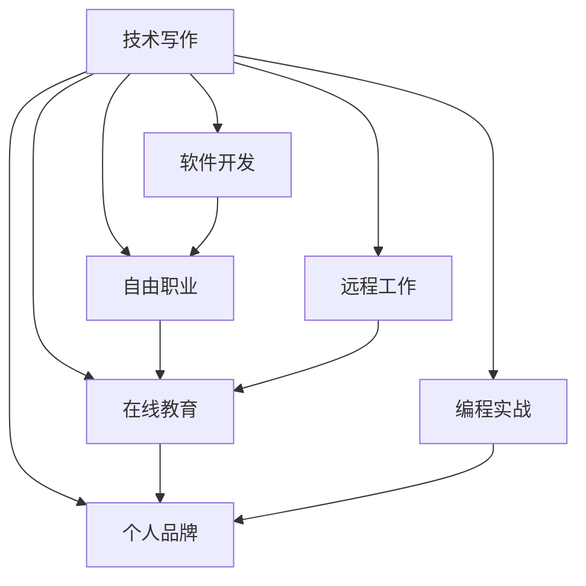

                 

# 技术写作：程序员的副业选择

> 关键词：技术写作, 软件开发, 自由职业, 副业, 远程工作, 在线教育, 编程实战, 个人品牌

## 1. 背景介绍

### 1.1 问题由来
在信息爆炸的时代，程序员不再局限于全职工作，利用技术写作作为副业，成为了越来越多人的选择。技术写作不仅能够为程序员提供额外收入来源，还能提升个人专业影响力，拓展职业发展空间。本文将详细探讨技术写作的现状与前景，以及如何充分利用技术写作，为程序员打造一条多渠道的职业发展之路。

### 1.2 问题核心关键点
技术写作的核心关键点包括：
- 技术写作的业务形式和市场需求
- 技术写作对个人技能提升和职业发展的助力
- 程序员副业成功案例分析
- 技术写作的挑战与应对策略
- 如何高效利用在线平台进行技术写作

## 2. 核心概念与联系

### 2.1 核心概念概述

技术写作作为程序员的副业，其核心概念主要包括：

- **技术写作**：编写和发布技术文章、教程、博客等，旨在通过传授技术知识，分享个人经验，提升个人影响力和职业价值。
- **软件开发**：利用编程技能，开发各种软件产品或解决方案。
- **自由职业**：不再受限于全职工作，通过接取不同项目，实现灵活的工作安排和收入来源。
- **远程工作**：通过互联网进行远程沟通和协作，摆脱传统职场束缚，实现更高效、更自由的工作方式。
- **在线教育**：借助互联网平台，开展在线课程、辅导或咨询，传授编程技巧和知识，帮助他人提升技能。
- **编程实战**：通过实际项目开发，积累实战经验，提升解决实际问题的能力。
- **个人品牌**：通过技术写作等手段，构建个人的技术影响力，提升在行业内的知名度和权威性。

这些概念之间通过技术写作这一核心桥梁，相互关联，共同构成了一个多样化的程序员副业生态系统。

### 2.2 核心概念原理和架构的 Mermaid 流程图



这个流程图展示了技术写作如何与软件开发、自由职业、远程工作、在线教育、编程实战和个人品牌等概念相互关联和互动，构成一个综合发展的职业生态。

## 3. 核心算法原理 & 具体操作步骤

### 3.1 算法原理概述

技术写作的算法原理，主要是通过内容创作和传播的循环反馈机制，不断提升个人的专业影响力和市场认可度。其核心在于：

- **内容创作**：程序员利用技术写作，生产高质量、有价值的内容，覆盖软件开发生命周期、技术趋势、编程技巧、实践案例等各个方面。
- **内容传播**：通过博客、技术论坛、社交媒体、在线教育平台等渠道，广泛传播创作内容，触及更多潜在读者和用户。
- **反馈机制**：读者和用户的反馈（如评论、点赞、分享等），为作者提供了持续改进和优化的动力，也帮助作者验证内容的真实价值。
- **品牌建设**：长期坚持高质量内容创作，逐渐建立起个人的技术专家形象，形成个人品牌，吸引更多商业合作机会。

### 3.2 算法步骤详解

技术写作的具体操作步骤如下：

1. **选择写作方向**：根据个人兴趣和擅长领域，选择技术写作方向，如编程语言、框架、开发工具、行业应用等。
2. **创建平台账号**：在博客、技术论坛、GitHub、Medium等平台上创建个人账号，开始撰写和发布内容。
3. **撰写高质量文章**：结合实际项目经验，撰写深入浅出的技术文章，注重原创性和实用性。
4. **参与社区互动**：在技术社区中积极参与讨论，回答问题，拓展人脉和影响力。
5. **多样化内容形式**：尝试不同形式的内容，如教程、案例研究、技术博客、视频教程等，提升内容的吸引力和传播力。
6. **商业合作**：通过技术写作积累的影响力，吸引商业合作机会，如技术咨询、培训课程、技术博客广告等。
7. **持续学习**：保持技术前沿的知识，不断提升写作质量，保持内容的时效性和相关性。

### 3.3 算法优缺点

技术写作的主要优点包括：
- **灵活性高**：自由职业和远程工作使得时间安排更加灵活，可以兼顾全职工作和技术写作。
- **收入稳定**：通过多种形式的变现方式，如广告收入、订阅费、赞助等，能够获得相对稳定的副业收入。
- **个人品牌**：技术写作有助于提升个人专业形象，增强职业竞争力，开拓更多发展机会。
- **传播效应**：高质量内容能够影响更多人，提升个人和团队的影响力。

同时，技术写作也存在一些缺点：
- **时间和精力投入**：高质量的内容创作和持续更新需要大量时间和精力。
- **市场竞争**：技术写作领域竞争激烈，如何脱颖而出需要不断努力和创新。
- **初期见效慢**：在积累足够影响力和粉丝基础前，收入可能较低，需要耐心和坚持。
- **知识更新**：需要不断学习新知识和技能，以保持内容的竞争力和时效性。

### 3.4 算法应用领域

技术写作在多个领域具有广泛的应用：

- **软件开发**：通过技术博客、教程、文档等形式，传播编程技巧和实践经验，帮助开发者提升技术水平。
- **在线教育**：开展在线编程课程、编程工作坊等，传授编程知识，帮助他人学习编程。
- **远程工作**：利用技术写作建立个人品牌和影响力，吸引远程工作机会，实现灵活工作安排。
- **自由职业**：通过技术写作拓展业务领域，接取不同项目，获得多样化收入来源。
- **职业发展**：通过技术写作提升个人专业影响力，获得更多职业发展机会，如技术顾问、培训讲师等。

## 4. 数学模型和公式 & 详细讲解 & 举例说明

### 4.1 数学模型构建

技术写作的效果可以通过以下数学模型来衡量：

设 $R$ 为技术写作的读者数，$I$ 为每次阅读的收入（如广告收入、订阅费等），$C$ 为每篇文章的创作成本（包括时间、精力等），$P$ 为每次传播的推广成本（如社交媒体推广费用），$V$ 为每次阅读的实际价值（如读者获取的新知识），则技术写作的总收益 $G$ 可以表示为：

$$
G = R \cdot I - C \cdot R - P \cdot R
$$

其中 $R$ 为读者数，$I$ 为每次阅读的收入，$C$ 为每篇文章的创作成本，$P$ 为每次阅读的推广成本，$V$ 为每次阅读的实际价值。

### 4.2 公式推导过程

假设每次阅读的平均收益为 $B$，则 $G$ 可以简化为：

$$
G = B \cdot R - C \cdot R - P \cdot R
$$

进一步简化得到：

$$
G = (B - C - P) \cdot R
$$

当 $B - C - P > 0$ 时，技术写作能够带来正收益。这意味着技术写作的关键在于提高阅读收益，降低创作和推广成本，提升阅读的实际价值。

### 4.3 案例分析与讲解

以某知名程序员TechWriter为例，他在GitHub上发布了一系列的编程教程和实战案例，每月吸引数万读者。通过在文章中插入广告，月收入达到数千美元。此外，他还定期举办编程直播课程，进一步提升读者互动和收入。虽然每次创作和推广的成本较高，但总体收益显著，形成了稳定的副业收入。

## 5. 项目实践：代码实例和详细解释说明

### 5.1 开发环境搭建

技术写作的开发环境搭建相对简单，主要依赖于以下工具和平台：

- **编辑器**：如Visual Studio Code、Atom等，提供代码编写、版本控制和语法高亮等功能。
- **版本控制**：如Git，便于协同开发和版本管理。
- **文档生成工具**：如Markdown、LaTeX等，用于编写和格式化技术文章。
- **博客平台**：如WordPress、Medium、GitHub Pages等，用于发布和维护技术文章。
- **社区平台**：如Stack Overflow、GitHub Issues、Reddit等，用于交流和互动。

### 5.2 源代码详细实现

以下是一个简单的技术博客发布流程的伪代码实现：

```python
class TechBlogger:
    def __init__(self, blog_platform):
        self.blog_platform = blog_platform
        self.content = []
    
    def write_article(self, title, content):
        self.content.append((title, content))
    
    def publish_articles(self):
        for title, content in self.content:
            self.blog_platform.publish(title, content)
    
    def update_articles(self, title, updated_content):
        for i, (published_title, published_content) in enumerate(self.content):
            if published_title == title:
                self.content[i] = (title, updated_content)
    
    def get_feedback(self, title):
        feedback = self.blog_platform.get_feedback(title)
        return feedback
    
    def analyze_feedback(self, title, feedback):
        # 对反馈进行分析和改进
        pass

tech_blogger = TechBlogger("Medium")
tech_blogger.write_article("Python编程实战", "详细的Python编程技巧分享")
tech_blogger.publish_articles()

tech_blogger.update_articles("Python编程实战", "增加Python 3.9新特性介绍")
tech_blogger.publish_articles()

feedback = tech_blogger.get_feedback("Python编程实战")
tech_blogger.analyze_feedback("Python编程实战", feedback)
```

### 5.3 代码解读与分析

该伪代码展示了一个简单的技术博客发布流程：

1. **创建博客平台实例**：实例化一个博客平台，例如Medium。
2. **写文章**：写一篇技术文章，并将其添加到博客内容的列表中。
3. **发布文章**：将博客内容中的所有文章发布到博客平台上。
4. **更新文章**：根据反馈更新文章内容，并重新发布。
5. **获取反馈**：从博客平台上获取读者对某篇文章的反馈。
6. **分析反馈**：对反馈进行分析，以便改进文章质量和提高读者满意度。

### 5.4 运行结果展示

运行上述代码后，博客平台上会展示出新发布的"Python编程实战"文章。读者可以对文章进行评论、点赞、分享，从而获取反馈。博客作者根据反馈分析，进一步优化文章内容和发布策略，持续提升文章的阅读量和影响力。

## 6. 实际应用场景

### 6.1 技术写作在软件开发中的应用

技术写作在软件开发中的应用场景包括：

- **技术博客**：分享编程技巧、最佳实践、技术趋势等，帮助开发者提高技术水平。
- **教程和指南**：提供详细的编程教程和实践指南，帮助新手快速上手新编程语言或框架。
- **文档编写**：编写软件文档，包括API文档、使用手册等，提升软件可读性和维护性。
- **案例研究**：展示实际项目开发中的关键技术和解决方案，提供实战经验和借鉴。

### 6.2 技术写作在在线教育中的应用

技术写作在在线教育中的应用场景包括：

- **在线课程**：通过视频、文字、代码等多种形式，提供系统化的编程课程和培训。
- **编程工作坊**：组织线上编程工作坊，实时解答学员疑问，提升互动和参与度。
- **技术培训**：提供定制化的技术培训课程，帮助企业提升员工编程能力。

### 6.3 技术写作在自由职业中的应用

技术写作在自由职业中的应用场景包括：

- **远程工作**：通过技术写作，接取各类远程编程项目和咨询任务，实现灵活工作安排。
- **自由职业平台**：在Upwork、Freelancer等自由职业平台上发布技术文章和课程，获取项目和收入。
- **技术咨询**：利用技术写作积累的专业知识，提供技术咨询和问题解答，拓展职业范围。

### 6.4 未来应用展望

未来技术写作将呈现出以下几个发展趋势：

- **多渠道发布**：技术写作不再局限于传统的博客和论坛，将拓展至短视频平台、播客等多种形式，提升内容的吸引力和传播力。
- **知识付费**：技术写作将更多地与知识付费结合，通过付费课程、订阅服务等，获取更高质量的读者群体和收入。
- **社区互动**：利用社区平台，增强技术写作的互动性，通过在线问答、代码评审等方式，提升用户参与度和满意度。
- **跨领域应用**：技术写作将更多地跨领域应用，如科技、金融、医疗等领域，提供跨学科的知识分享和行业解决方案。

## 7. 工具和资源推荐

### 7.1 学习资源推荐

为了帮助程序员系统掌握技术写作技能，推荐以下学习资源：

1. **技术写作书籍**：如《技术写作的艺术》、《程序员如何写作》等，深入讲解技术写作的核心方法和实践技巧。
2. **在线课程**：如Coursera、Udemy、edX等平台上的技术写作课程，系统学习技术写作的理论和实践。
3. **技术博客和论坛**：如Medium、Stack Overflow、GitHub等平台，阅读和学习优秀的技术文章，提升写作水平。
4. **技术写作社群**：如Tech Write Club、Dev.to等社区，与技术写作爱好者交流互动，获取写作灵感和反馈。

### 7.2 开发工具推荐

为了提升技术写作的效率和质量，推荐以下开发工具：

1. **Markdown编辑器**：如Typora、Dillinger、Atlassian Docs等，提供语法高亮、代码块、图表插入等功能。
2. **版本控制系统**：如Git、GitHub等，便于协作和版本管理。
3. **代码高亮工具**：如Prism.js、Highlight.js等，为技术文章提供代码高亮显示。
4. **图像处理工具**：如ImageMagick、GIMP等，用于处理和优化技术文章中的图片。
5. **代码生成工具**：如Jupyter Notebook、Google Colab等，快速生成和展示代码运行结果。

### 7.3 相关论文推荐

为了深入了解技术写作的理论和实践，推荐以下相关论文：

1. **"Automated Technical Writing: A Survey of the Field"**：回顾技术写作自动化研究现状，提出未来发展方向。
2. **"Programming for Programmers"**：介绍如何通过编程实现技术写作，提升写作质量和效率。
3. **"Technical Writing in the Age of Big Data"**：探讨大数据时代技术写作的新趋势和新方法。
4. **"Effective Technical Writing: A Guide for Programmers"**：提供技术写作技巧和实践案例，提升写作技能。

## 8. 总结：未来发展趋势与挑战

### 8.1 研究成果总结

技术写作作为一种副业形式，具有灵活性高、收入稳定、个人品牌价值高、传播效应显著等优点，同时面临时间和精力投入大、市场竞争激烈、初期见效慢等挑战。通过持续学习新知识和技能，不断提升写作质量和传播力，技术写作将成为程序员副业中的重要选择。

### 8.2 未来发展趋势

未来技术写作的发展趋势包括：

- **多渠道发布**：通过短视频、播客等多种形式，提升内容的吸引力和传播力。
- **知识付费**：技术写作与知识付费结合，获取更高质量的读者群体和收入。
- **社区互动**：增强技术写作的互动性，提升用户参与度和满意度。
- **跨领域应用**：技术写作跨领域应用，提供跨学科的知识分享和行业解决方案。

### 8.3 面临的挑战

技术写作面临的挑战包括：

- **时间和精力投入**：高质量内容创作和持续更新需要大量时间和精力。
- **市场竞争**：技术写作领域竞争激烈，如何脱颖而出需要不断努力和创新。
- **初期见效慢**：在积累足够影响力和粉丝基础前，收入可能较低，需要耐心和坚持。
- **知识更新**：需要不断学习新知识和技能，以保持内容的竞争力和时效性。

### 8.4 研究展望

未来技术写作的研究方向包括：

- **自动化工具**：开发自动化技术写作工具，提升写作效率和质量。
- **知识图谱融合**：将知识图谱与技术写作结合，提升内容的准确性和实用性。
- **情感分析**：利用情感分析技术，提升技术写作的互动性和用户满意度。
- **跨平台协作**：实现不同平台和技术栈的协作，提升技术写作的灵活性和多样性。

## 9. 附录：常见问题与解答

**Q1: 如何提高技术写作的质量和影响力？**

A: 提高技术写作的质量和影响力，需要关注以下几个方面：
1. **内容原创性**：确保文章内容原创，不抄袭或套用他人作品。
2. **内容实用性**：提供有价值、有实用的技术知识和实践经验，帮助读者解决实际问题。
3. **写作风格**：保持写作风格清晰、简洁、逻辑性强，避免冗长和繁琐的描述。
4. **读者互动**：积极与读者互动，回复评论和反馈，提升读者的参与度和满意度。
5. **持续更新**：不断更新内容，保持时效性和相关性，吸引更多读者。

**Q2: 技术写作如何获取收入？**

A: 技术写作获取收入的方式包括：
1. **广告收入**：在文章中插入广告，通过点击和展示获取收入。
2. **订阅费**：通过订阅平台，提供独家内容或文章，获得稳定的订阅收入。
3. **赞助和打赏**：接受企业和读者的赞助和打赏，提升文章的曝光度和收入。
4. **课程和培训**：开发在线课程或提供技术培训，通过付费课程获取收入。
5. **商业合作**：接取技术咨询、技术支持等商业项目，拓展业务领域和收入来源。

**Q3: 技术写作如何提高文章的阅读量和影响力？**

A: 提高文章的阅读量和影响力，需要关注以下几个方面：
1. **标题优化**：选择有吸引力的标题，提升文章的点击率。
2. **内容质量**：提供高质量、有价值的内容，满足读者的需求和期望。
3. **关键词优化**：使用SEO策略，优化文章的关键词和标签，提升搜索引擎排名。
4. **平台推广**：利用社交媒体、技术论坛等平台推广文章，增加曝光度。
5. **互动反馈**：积极与读者互动，回复评论和反馈，提升读者的参与度和满意度。

---

作者：禅与计算机程序设计艺术 / Zen and the Art of Computer Programming

