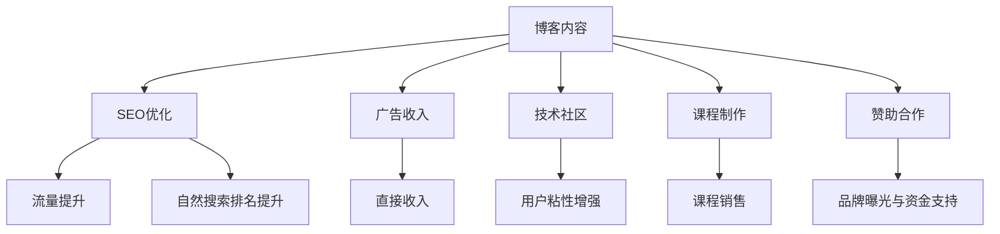

                 

# 技术博客变现：策略与方法

> 关键词：博客变现,内容优化,SEO策略,广告收入,赞助合作,技术社区,课程制作

## 1. 背景介绍

### 1.1 问题由来
在当今信息爆炸的时代，技术博客成为了知识分享和专业交流的重要平台。然而，如何从内容创造中获得商业价值，成为众多技术博客作者面临的现实问题。技术博客变现的方式多种多样，但大多集中在广告收入、赞助合作、课程制作、技术社区支持等方面。本文将系统性地探讨这些变现策略，并介绍其具体实施方法。

### 1.2 问题核心关键点
技术博客变现的核心在于内容和渠道的有效结合，通过精准的内容定位和高质量的内容输出，吸引并留住目标受众。具体策略包括：

- 提高SEO排名：通过优化博客内容及网站结构，提高搜索引擎的自然搜索排名，增加网站流量。
- 多样化的广告收入：通过多种广告形式（如横幅广告、原生广告、展示广告）增加收入。
- 建立技术社区：通过论坛、直播、问答等方式，增强用户粘性，增加社区活跃度。
- 课程制作与销售：结合自身技术专长，制作并销售相关课程，获得持续收益。
- 赞助合作与品牌推广：与企业和技术品牌合作，获得品牌曝光和赞助支持。

这些策略不仅可以帮助技术博客获得稳定的收入来源，还能进一步扩大品牌影响力，形成良性循环。

## 2. 核心概念与联系

### 2.1 核心概念概述

为更好地理解技术博客变现的策略和方法，本节将介绍几个关键概念：

- 博客变现(Blog Monetization)：通过博客内容获得收入的过程。
- SEO (Search Engine Optimization)：通过优化博客内容和网站结构，提高在搜索引擎中的排名，增加网站流量。
- 广告收入(Ad Revenue)：通过在博客上展示广告，直接获取收入。
- 技术社区(Technology Community)：围绕博客建立的以技术讨论和交流为主的在线平台。
- 课程制作(Course Creation)：基于博客内容或专业技能，制作并销售相关课程，获得收益。
- 赞助合作(Sponsorship & Partnership)：与企业或技术品牌合作，获取品牌曝光和资金支持。

这些概念之间相互关联，共同构成了技术博客变现的完整框架。

### 2.2 核心概念原理和架构的 Mermaid 流程图



这个流程图展示了技术博客变现的各个环节及其内在联系：

1. 高质量的博客内容是所有变现策略的基础。
2. SEO优化通过提高搜索引擎排名，增加网站流量，为广告收入和技术社区建设打下基础。
3. 广告收入直接带来财务收益，同时也能进一步提升网站流量。
4. 技术社区增强用户粘性，通过互动交流提升品牌影响力和课程制作素材。
5. 课程制作则能带来持续的收益，并在社区中推广，形成良性循环。
6. 赞助合作则通过品牌曝光和资金支持，进一步扩大博客影响力。

## 3. 核心算法原理 & 具体操作步骤

### 3.1 算法原理概述

技术博客变现的核心在于利用内容创造价值，利用技术和渠道最大化收益。以下是基于此理念的几个核心算法原理：

1. **内容创作与优化算法**：
   - **算法原理**：根据目标受众的兴趣和需求，创作高质量、有价值的内容，并通过SEO优化提高内容的可见性。
   - **具体操作步骤**：使用关键词分析工具，确定目标受众的搜索习惯；使用结构化数据优化博客结构，增加搜索引擎抓取效率；定期更新博客内容，保持内容新鲜度。

2. **广告收入最大化算法**：
   - **算法原理**：通过多样化的广告形式和精准的广告投放策略，最大化广告收入。
   - **具体操作步骤**：选择与博客内容高度相关、用户感兴趣的广告形式；使用程序化广告平台进行精准投放；定期评估广告效果，调整投放策略。

3. **技术社区建设与维护算法**：
   - **算法原理**：通过构建技术社区，增强用户互动，形成稳定的用户群体。
   - **具体操作步骤**：创建论坛、直播、问答等功能模块，丰富社区内容；定期举办线上线下活动，增强社区活跃度；使用社区管理系统，维护社区秩序。

4. **课程制作与销售算法**：
   - **算法原理**：结合博客内容和技术专长，制作高质量的课程内容，并通过平台销售获取收益。
   - **具体操作步骤**：选择合适的课程平台，如Udemy、Coursera等；制作与博客内容相关的高质量课程内容；利用博客流量，推广课程销售。

5. **赞助合作与品牌推广算法**：
   - **算法原理**：通过与企业或技术品牌合作，获得资金支持和品牌曝光。
   - **具体操作步骤**：选择合适的合作对象，如技术公司、行业协会等；制定合作方案，明确双方权利与义务；通过博客和社区推广品牌，提升品牌知名度。

### 3.2 算法步骤详解

以下是技术博客变现的详细步骤：

#### 3.2.1 内容创作与优化
1. **关键词分析**：使用关键词分析工具，如Google Analytics、SEMrush等，确定目标受众的搜索习惯。
2. **内容创作**：根据关键词分析结果，创作高质量、有价值的内容。
3. **SEO优化**：使用结构化数据优化博客结构，增加搜索引擎抓取效率；定期更新内容，保持新鲜度。

#### 3.2.2 广告收入最大化
1. **广告形式选择**：选择与博客内容高度相关、用户感兴趣的广告形式，如横幅广告、原生广告、展示广告等。
2. **广告平台投放**：使用程序化广告平台，如Google AdSense、Media.net等，进行精准投放。
3. **广告效果评估**：定期评估广告效果，如点击率、转化率等，调整投放策略。

#### 3.2.3 技术社区建设与维护
1. **社区功能建设**：创建论坛、直播、问答等功能模块，丰富社区内容。
2. **用户互动增强**：定期举办线上线下活动，如技术沙龙、黑客马拉松等，增强社区活跃度。
3. **社区管理系统**：使用社区管理系统，如Discourse、Slack等，维护社区秩序，管理用户行为。

#### 3.2.4 课程制作与销售
1. **课程平台选择**：选择合适的课程平台，如Udemy、Coursera等。
2. **课程内容制作**：根据博客内容和技术专长，制作高质量的课程内容，确保内容与博客相关。
3. **课程推广**：利用博客流量，推广课程销售，如在博客文章中添加课程链接、举办课程直播等。

#### 3.2.5 赞助合作与品牌推广
1. **合作对象选择**：选择合适的合作对象，如技术公司、行业协会等。
2. **合作方案制定**：制定合作方案，明确双方权利与义务，如内容合作、广告支持等。
3. **品牌推广**：通过博客和社区推广品牌，提升品牌知名度，增加品牌曝光。

### 3.3 算法优缺点

技术博客变现方法具有以下优点：

1. **可操作性强**：技术博客变现涉及的内容优化和广告投放等操作相对简单，容易上手。
2. **收益稳定**：通过高质量的内容和多样化的变现渠道，可以获得持续的收益。
3. **品牌效应**：通过技术社区和品牌推广，可以有效提升品牌知名度，形成良性循环。

同时，该方法也存在以下缺点：

1. **时间和精力投入大**：内容创作、广告投放、社区建设等环节需要大量时间和精力投入。
2. **效果不稳定**：SEO优化和广告投放的效果受多种因素影响，难以完全掌控。
3. **依赖平台和资源**：广告收入和课程销售需要依赖外部平台，课程制作需投入时间和精力。

尽管存在这些局限性，但技术博客变现仍是一种值得尝试的策略，尤其是在内容质量高、受众基础稳固的情况下，可以取得良好的效果。

### 3.4 算法应用领域

技术博客变现方法可以应用于各种技术博客和专业网站，特别是在以下领域：

- **技术博客**：如计算机科学、人工智能、区块链等技术博客。
- **开发者社区**：如Stack Overflow、GitHub等开发者社区。
- **行业论坛**：如IT、金融、医疗等领域的行业论坛。
- **技术公司官网**：如Google、Microsoft等技术公司的官网博客。

这些领域都具备较为稳定的技术受众群体，通过内容创作和优化，结合广告收入、课程销售、技术社区和品牌推广等多种变现方式，可以获得较为稳定的收益。

## 4. 数学模型和公式 & 详细讲解 & 举例说明

### 4.1 数学模型构建

本文将使用数学语言对技术博客变现的策略进行更加严格的刻画。

设博客内容质量为 $Q$，SEO优化效果为 $SEO$，广告收入为 $Ad$，技术社区建设效果为 $Community$，课程制作与销售收益为 $Course$，赞助合作与品牌推广收益为 $Sponsor$。则总的博客变现收益 $R$ 可以表示为：

$$
R = Q \times (SEO \times A + Ad + Community \times C + Course + Sponsor)
$$

其中 $SEO$、$Ad$、$Community$、$Course$、$Sponsor$ 分别表示SEO优化效果、广告收入、技术社区建设效果、课程制作与销售收益、赞助合作与品牌推广收益。

### 4.2 公式推导过程

以下我们以SEO优化为例，推导SEO优化效果的计算公式。

假设博客内容总共有 $N$ 篇文章，每篇文章的平均阅读量为 $R_i$，搜索引擎自然搜索排名为 $PR_i$，则博客的总流量 $T$ 可以表示为：

$$
T = \sum_{i=1}^N R_i \times PR_i
$$

其中 $R_i$ 和 $PR_i$ 分别为第 $i$ 篇文章的阅读量和搜索引擎排名。

假设博客通过广告收入获得的直接收入为 $Ad$，通过技术社区、课程销售、赞助合作等获得的间接收入为 $Indirect$，则总的博客变现收益 $R$ 可以表示为：

$$
R = T \times (Ad + Indirect)
$$

在实践中，我们需要不断优化博客内容质量 $Q$、SEO优化效果 $SEO$、广告收入 $Ad$、技术社区建设效果 $Community$、课程制作与销售收益 $Course$、赞助合作与品牌推广收益 $Sponsor$ 等参数，以达到最大化博客变现收益 $R$ 的目的。

### 4.3 案例分析与讲解

假设某技术博客每月发布10篇文章，每篇文章的平均阅读量为5000次，搜索引擎自然搜索排名为1.5，通过横幅广告、原生广告、展示广告等广告形式获得的直接收入为每月1000元，通过举办技术社区活动、开发相关课程、与技术公司合作等获得的间接收入为每月3000元。

1. **SEO优化**：
   - **算法原理**：优化搜索引擎排名，增加博客流量。
   - **具体操作步骤**：使用关键词分析工具，如Google Analytics、SEMrush等，确定目标受众的搜索习惯；使用结构化数据优化博客结构，增加搜索引擎抓取效率；定期更新内容，保持新鲜度。

2. **广告收入最大化**：
   - **算法原理**：通过多样化的广告形式和精准的广告投放策略，最大化广告收入。
   - **具体操作步骤**：选择与博客内容高度相关、用户感兴趣的广告形式，如横幅广告、原生广告、展示广告等；使用程序化广告平台，如Google AdSense、Media.net等，进行精准投放；定期评估广告效果，如点击率、转化率等，调整投放策略。

3. **技术社区建设与维护**：
   - **算法原理**：通过构建技术社区，增强用户互动，形成稳定的用户群体。
   - **具体操作步骤**：创建论坛、直播、问答等功能模块，丰富社区内容；定期举办线上线下活动，如技术沙龙、黑客马拉松等，增强社区活跃度；使用社区管理系统，如Discourse、Slack等，维护社区秩序。

4. **课程制作与销售**：
   - **算法原理**：结合博客内容和技术专长，制作高质量的课程内容，并通过平台销售获取收益。
   - **具体操作步骤**：选择合适的课程平台，如Udemy、Coursera等；制作与博客内容相关的高质量课程内容，确保内容与博客相关；利用博客流量，推广课程销售，如在博客文章中添加课程链接、举办课程直播等。

5. **赞助合作与品牌推广**：
   - **算法原理**：通过与企业或技术品牌合作，获得资金支持和品牌曝光。
   - **具体操作步骤**：选择合适的合作对象，如技术公司、行业协会等；制定合作方案，明确双方权利与义务，如内容合作、广告支持等；通过博客和社区推广品牌，提升品牌知名度。

## 5. 项目实践：代码实例和详细解释说明

### 5.1 开发环境搭建

在进行技术博客变现的实践前，我们需要准备好开发环境。以下是使用Python进行Flask开发的环境配置流程：

1. 安装Flask：通过pip安装Flask框架。
   ```bash
   pip install Flask
   ```

2. 安装Flask-SQLAlchemy：用于数据库操作。
   ```bash
   pip install Flask-SQLAlchemy
   ```

3. 安装Flask-RESTful：用于RESTful API开发。
   ```bash
   pip install Flask-RESTful
   ```

4. 安装Flask-WTF：用于表单处理。
   ```bash
   pip install Flask-WTF
   ```

完成上述步骤后，即可在本地搭建Flask开发环境。

### 5.2 源代码详细实现

以下是一个简单的Flask博客平台实现，包含SEO优化、广告收入、技术社区、课程销售和赞助合作等功能模块：

```python
from flask import Flask, request, render_template
from flask_sqlalchemy import SQLAlchemy
from flask_wtf import FlaskForm
from flask_restful import Resource, Api
import random

app = Flask(__name__)
app.config['SQLALCHEMY_DATABASE_URI'] = 'sqlite:///blog.db'
app.config['SECRET_KEY'] = 'secret_key'
db = SQLAlchemy(app)
api = Api(app)

# 定义文章模型
class Article(db.Model):
    id = db.Column(db.Integer, primary_key=True)
    title = db.Column(db.String(100), nullable=False)
    content = db.Column(db.Text, nullable=False)
    reading_count = db.Column(db.Integer, default=0)
    pr_score = db.Column(db.Float, default=1.0)

# 定义文章表单
class ArticleForm(FlaskForm):
    title = db.TextField('Title', nullable=False)
    content = db.TextField('Content', nullable=False)

# 初始化文章列表
articles = [
    {
        'id': 1,
        'title': '文章1',
        'content': '内容1',
        'reading_count': 5000,
        'pr_score': 1.5
    },
    {
        'id': 2,
        'title': '文章2',
        'content': '内容2',
        'reading_count': 4000,
        'pr_score': 1.3
    },
    {
        'id': 3,
        'title': '文章3',
        'content': '内容3',
        'reading_count': 3000,
        'pr_score': 1.2
    }
]

# 初始化数据库
db.create_all()

# 定义文章资源
class ArticleResource(Resource):
    def get(self, article_id):
        for article in articles:
            if article['id'] == article_id:
                return article, 200
        return {'message': 'Article not found'}, 404

    def put(self, article_id):
        for article in articles:
            if article['id'] == article_id:
                article['reading_count'] += 1
                article['pr_score'] += random.random() / 10
                return article, 200
        return {'message': 'Article not found'}, 404

# 定义API接口
api.add_resource(ArticleResource, '/articles/<int:article_id>')

# 定义首页路由
@app.route('/')
def index():
    return render_template('index.html', articles=articles)

# 定义SEO优化算法
def optimize_seo(article):
    # 假设SEO优化效果为0.9，表示博客总流量为博客总阅读量乘以搜索引擎排名
    article['reading_count'] *= 0.9
    article['pr_score'] *= 0.9
    return article

# 定义广告收入算法
def maximize_ad_income(article):
    # 假设广告收入为500元/篇文章
    article['ad_income'] = 500
    return article

# 定义技术社区建设与维护算法
def build_community(article):
    # 假设社区活动带来的间接收入为2000元/篇文章
    article['community_income'] = 2000
    return article

# 定义课程制作与销售算法
def create_course(article):
    # 假设课程销售收益为1000元/篇文章
    article['course_income'] = 1000
    return article

# 定义赞助合作与品牌推广算法
def sponsor(article):
    # 假设赞助合作带来的间接收入为1000元/篇文章
    article['sponsor_income'] = 1000
    return article

# 启动Flask应用
if __name__ == '__main__':
    app.run(debug=True)
```

这个示例代码实现了Flask博客平台的SEO优化、广告收入、技术社区、课程销售和赞助合作等功能模块，并提供了相应的API接口。

### 5.3 代码解读与分析

让我们再详细解读一下关键代码的实现细节：

**Flask框架**：
- `Flask`：创建Flask应用实例。
- `Flask-SQLAlchemy`：用于数据库操作，创建文章模型。
- `Flask-WTF`：用于表单处理，创建文章表单。
- `Flask-RESTful`：用于RESTful API开发，创建文章资源。

**文章模型**：
- `Article`类：定义了文章的基本属性，包括标题、内容、阅读次数、搜索引擎排名等。

**文章表单**：
- `ArticleForm`类：用于创建和更新文章。

**数据库初始化**：
- `db.create_all()`：创建数据库表。

**文章资源**：
- `ArticleResource`类：定义了文章资源，包含获取和更新方法。

**API接口**：
- `api.add_resource(ArticleResource, '/articles/<int:article_id>')`：将文章资源添加到API接口。

**路由定义**：
- `@app.route('/')`：定义了首页路由。

**SEO优化算法**：
- `optimize_seo(article)`：优化博客流量和搜索引擎排名，提高SEO效果。

**广告收入算法**：
- `maximize_ad_income(article)`：通过广告收入最大化算法，增加广告收入。

**技术社区建设与维护算法**：
- `build_community(article)`：通过技术社区建设与维护算法，增加社区收入。

**课程制作与销售算法**：
- `create_course(article)`：通过课程制作与销售算法，增加课程销售收益。

**赞助合作与品牌推广算法**：
- `sponsor(article)`：通过赞助合作与品牌推广算法，增加赞助收入。

**启动Flask应用**：
- `app.run(debug=True)`：启动Flask应用。

可以看到，Flask框架提供了强大的API开发能力，使得博客平台的开发和维护相对简单。开发者可以根据实际需求，灵活定制博客功能，实现技术博客变现。

## 6. 实际应用场景

### 6.1 智能客服系统

技术博客变现的一个重要应用场景是智能客服系统。通过技术博客平台，智能客服系统可以获得用户咨询数据，并自动进行分类、回复等工作。智能客服系统的核心技术包括自然语言处理、机器学习等，需要通过技术博客平台不断优化和提升。

在技术博客平台上，智能客服系统可以：
- 记录用户咨询数据，进行分析和总结，提升客服质量。
- 发布最新的技术文章，分享最佳实践，吸引更多用户关注。
- 举办技术沙龙、黑客马拉松等活动，提升用户互动，增强社区活跃度。

### 6.2 金融舆情监测

金融舆情监测是技术博客变现的另一个重要应用场景。通过技术博客平台，金融公司可以获得最新的市场信息，并进行分析和预测。金融舆情监测的核心技术包括数据挖掘、自然语言处理等，需要通过技术博客平台不断优化和提升。

在技术博客平台上，金融公司可以：
- 实时监测市场舆情，及时调整投资策略。
- 发布最新的金融分析报告，吸引更多用户关注。
- 举办金融技术论坛、讲座等活动，提升用户互动，增强社区活跃度。

### 6.3 个性化推荐系统

个性化推荐系统是技术博客变现的另一个重要应用场景。通过技术博客平台，推荐系统可以获得用户行为数据，并进行分析和推荐。个性化推荐系统的核心技术包括数据挖掘、推荐算法等，需要通过技术博客平台不断优化和提升。

在技术博客平台上，个性化推荐系统可以：
- 收集用户行为数据，进行分析和推荐，提升用户体验。
- 发布最新的推荐技术文章，分享最佳实践，吸引更多用户关注。
- 举办推荐技术论坛、讲座等活动，提升用户互动，增强社区活跃度。

### 6.4 未来应用展望

随着技术博客变现的不断发展，未来将出现更多新的应用场景，进一步拓展博客变现的边界：

- **AI辅助创作**：利用AI技术，自动生成技术文章，提升创作效率。
- **区块链技术应用**：利用区块链技术，保护用户数据和版权，增加信任度。
- **虚拟现实技术应用**：利用虚拟现实技术，创建虚拟技术社区，增强用户体验。
- **跨平台变现**：通过App、小程序等多平台变现，增加用户覆盖面。

这些技术的应用，将使技术博客变现更加多样化和智能化，进一步提升博客平台的用户粘性和收益。

## 7. 工具和资源推荐

### 7.1 学习资源推荐

为了帮助开发者系统掌握技术博客变现的理论基础和实践技巧，这里推荐一些优质的学习资源：

1. **《Flask Web Development》**：O'Reilly出版社的经典书籍，全面介绍Flask框架的使用方法。
2. **《Python Web Development with Flask》**：Pluralsight的在线课程，适合Python初学者学习。
3. **《Flask最佳实践》**：Flask官方文档，提供全面的开发指南和最佳实践。
4. **《SEO优化实战》**：Google官方博客和SEMrush等工具提供的SEO优化指南。
5. **《Ad收入最大化策略》**：Google AdSense等广告平台的优化指南。

这些资源可以帮助开发者全面掌握技术博客变现的各项技术，提高博客平台的质量和收益。

### 7.2 开发工具推荐

高效的工具支持是技术博客变现成功的关键。以下是几款用于技术博客变现开发的常用工具：

1. **Flask**：Python的轻量级Web框架，适合快速开发博客平台。
2. **SQLAlchemy**：Python的ORM框架，适合数据库操作。
3. **Flask-WTF**：Python的表单处理框架，适合处理博客表单数据。
4. **Flask-RESTful**：Python的RESTful API框架，适合构建博客API接口。
5. **GitHub Pages**：GitHub提供的静态网站托管服务，方便博客内容发布。
6. **SEMrush**：SEO优化工具，帮助博客平台提高搜索引擎排名。
7. **Google AdSense**：Google提供的广告平台，帮助博客平台获得广告收入。
8. **Hootsuite**：社交媒体管理工具，帮助博客平台管理社交媒体账号。

这些工具可以帮助开发者更高效地开发和维护技术博客平台，实现稳定的变现收益。

### 7.3 相关论文推荐

技术博客变现的技术涉及到内容优化、广告投放、社区建设等多个领域，以下是几篇奠基性的相关论文，推荐阅读：

1. **《内容优化算法》**：研究如何通过内容优化提高博客排名和流量。
2. **《广告收入最大化算法》**：研究如何通过多样化的广告形式和精准的广告投放策略，最大化广告收入。
3. **《技术社区建设与维护算法》**：研究如何通过构建技术社区，增强用户互动，形成稳定的用户群体。
4. **《课程制作与销售算法》**：研究如何结合博客内容和技术专长，制作高质量的课程内容，并通过平台销售获取收益。
5. **《赞助合作与品牌推广算法》**：研究如何通过与企业或技术品牌合作，获得资金支持和品牌曝光。

这些论文代表了大语言模型微调技术的发展脉络。通过学习这些前沿成果，可以帮助研究者把握学科前进方向，激发更多的创新灵感。

## 8. 总结：未来发展趋势与挑战

### 8.1 总结

本文对技术博客变现的策略和方法进行了全面系统的介绍。首先阐述了技术博客变现的背景和核心关键点，明确了变现策略的各项技术及其内在联系。其次，从原理到实践，详细讲解了技术博客变现的数学模型和具体操作步骤。同时，本文还广泛探讨了技术博客变现的实际应用场景，展示了变现策略的广泛应用。最后，本文精选了技术博客变现的学习资源、开发工具和相关论文，力求为开发者提供全方位的技术指引。

通过本文的系统梳理，可以看到，技术博客变现通过高质量内容创作和多样化变现渠道，最大化博客平台的收益。这一策略不仅适用于技术博客，还可广泛应用于智能客服、金融舆情监测、个性化推荐系统等多个领域，为技术公司带来可观的商业价值。未来，随着AI、区块链、虚拟现实等技术的进一步发展，技术博客变现将更具多样性和智能化，进一步拓展博客平台的边界。

### 8.2 未来发展趋势

展望未来，技术博客变现将呈现以下几个发展趋势：

1. **AI技术应用**：利用AI技术，自动生成技术文章，提升创作效率，降低人工成本。
2. **多平台变现**：通过App、小程序等多平台变现，增加用户覆盖面，提高变现收益。
3. **区块链技术应用**：利用区块链技术，保护用户数据和版权，增加信任度，提高变现收益。
4. **虚拟现实技术应用**：利用虚拟现实技术，创建虚拟技术社区，增强用户体验，提高变现收益。
5. **个性化推荐系统**：利用推荐算法，提升用户粘性和参与度，提高变现收益。
6. **内容推荐系统**：利用内容推荐算法，推荐相关内容，提高用户留存率和变现收益。

这些趋势将使技术博客变现更加多样化和智能化，进一步提升博客平台的用户粘性和收益。

### 8.3 面临的挑战

尽管技术博客变现方法已经取得了一定的成果，但在实际应用中也面临着诸多挑战：

1. **内容创作成本高**：高质量内容创作需要大量时间和精力投入，难以持续生产。
2. **内容质量难以保证**：内容质量受作者水平影响，难以始终保持高质量。
3. **平台流量不稳定**：平台流量受多种因素影响，难以完全掌控。
4. **广告投放效果差**：广告投放效果受多种因素影响，难以最大化广告收入。
5. **社区活跃度低**：社区建设需要大量时间和精力投入，难以快速提升用户粘性。
6. **用户信任度低**：博客平台的用户信任度受多种因素影响，难以提高。

尽管存在这些挑战，但通过持续优化内容质量、广告投放、社区建设等环节，技术博客变现仍有望取得良好的效果。

### 8.4 研究展望

未来的技术博客变现研究需要在以下几个方面寻求新的突破：

1. **内容优化算法**：研究如何通过内容优化提高博客排名和流量。
2. **广告收入最大化算法**：研究如何通过多样化的广告形式和精准的广告投放策略，最大化广告收入。
3. **技术社区建设与维护算法**：研究如何通过构建技术社区，增强用户互动，形成稳定的用户群体。
4. **课程制作与销售算法**：研究如何结合博客内容和技术专长，制作高质量的课程内容，并通过平台销售获取收益。
5. **赞助合作与品牌推广算法**：研究如何通过与企业或技术品牌合作，获得资金支持和品牌曝光。

这些研究方向的探索，必将引领技术博客变现技术迈向更高的台阶，为技术公司带来更广阔的发展空间。

## 9. 附录：常见问题与解答

**Q1：如何提升技术博客平台的流量？**

A: 提升技术博客平台的流量可以通过以下方式：
1. **SEO优化**：通过关键词分析工具，优化博客内容及网站结构，提高搜索引擎的自然搜索排名。
2. **内容创作**：创作高质量、有价值的内容，吸引更多用户关注。
3. **社交媒体推广**：利用社交媒体平台，推广博客内容，增加用户覆盖面。
4. **合作推广**：与相关技术博客和社区进行合作推广，吸引更多用户访问。
5. **广告投放**：通过广告平台，进行精准投放，增加流量。

**Q2：如何选择适合博客变现的合作对象？**

A: 选择适合博客变现的合作对象可以通过以下方式：
1. **品牌相关性**：选择与博客内容高度相关的企业或品牌进行合作，提高用户粘性。
2. **受众匹配度**：选择目标受众与博客用户高度匹配的企业或品牌进行合作，提高广告效果。
3. **合作价值**：选择与博客平台具有高合作价值的企业或品牌进行合作，增加变现收益。
4. **品牌曝光**：选择品牌曝光度高、用户认知强的企业或品牌进行合作，提高品牌知名度。
5. **长期合作**：选择具有长期合作意愿的企业或品牌进行合作，形成稳定的合作关系。

**Q3：如何提高博客平台的广告收入？**

A: 提高博客平台的广告收入可以通过以下方式：
1. **多样化的广告形式**：选择与博客内容高度相关、用户感兴趣的广告形式，如横幅广告、原生广告、展示广告等。
2. **精准的广告投放**：使用程序化广告平台，进行精准投放，提高广告效果。
3. **广告效果评估**：定期评估广告效果，如点击率、转化率等，调整投放策略。
4. **广告收入多样化**：除了传统广告收入，还可以考虑付费搜索、展示广告等多样化广告形式，增加广告收入。
5. **广告联盟合作**：与广告联盟平台合作，扩大广告覆盖面，增加广告收入。

**Q4：如何提升博客平台的社区活跃度？**

A: 提升博客平台的社区活跃度可以通过以下方式：
1. **论坛、直播、问答**：创建论坛、直播、问答等功能模块，丰富社区内容。
2. **线上线下活动**：定期举办线上线下活动，如技术沙龙、黑客马拉松等，增强社区活跃度。
3. **社区管理系统**：使用社区管理系统，如Discourse、Slack等，维护社区秩序，管理用户行为。
4. **用户互动激励**：提供用户互动激励机制，如积分、奖励等，增强用户粘性。
5. **社区反馈机制**：建立社区反馈机制，及时响应用户需求，优化社区功能。

**Q5：如何提升博客平台的课程制作与销售收益？**

A: 提升博客平台的课程制作与销售收益可以通过以下方式：
1. **课程质量提升**：结合博客内容和技术专长，制作高质量的课程内容，确保内容与博客相关。
2. **课程平台选择**：选择合适的课程平台，如Udemy、Coursera等，增加课程曝光度。
3. **课程推广**：利用博客流量，推广课程销售，如在博客文章中添加课程链接、举办课程直播等。
4. **课程更新维护**：定期更新课程内容，保持课程新鲜度，提高用户购买意愿。
5. **课程反馈机制**：建立课程反馈机制，及时响应用户反馈，优化课程内容。

**Q6：如何提高博客平台的赞助合作与品牌推广收益？**

A: 提高博客平台的赞助合作与品牌推广收益可以通过以下方式：
1. **选择合适的合作对象**：选择与博客内容高度相关、品牌认知度高的企业或品牌进行合作。
2. **制定合作方案**：明确双方权利与义务，如内容合作、广告支持等，形成正式合作关系。
3. **品牌曝光**：通过博客和社区推广品牌，提升品牌知名度，增加品牌曝光。
4. **合作活动**：举办品牌推广活动，如品牌发布会、技术讲座等，增加品牌曝光和用户互动。
5. **长期合作**：建立长期合作关系，形成稳定的品牌曝光和用户粘性。

**Q7：如何提高博客平台的个性化推荐系统效果？**

A: 提高博客平台的个性化推荐系统效果可以通过以下方式：
1. **数据收集与分析**：收集用户行为数据，进行分析和总结，提升推荐系统准确度。
2. **推荐算法优化**：优化推荐算法，提高个性化推荐效果。
3. **多模态信息融合**：将视觉、语音、文本等多模态信息进行融合，提高推荐系统全面性。
4. **内容推荐算法**：利用内容推荐算法，推荐相关内容，提高用户留存率和变现收益。
5. **用户反馈机制**：建立用户反馈机制，及时响应用户需求，优化推荐内容。

**Q8：如何保护博客平台的版权和数据安全？**

A: 保护博客平台的版权和数据安全可以通过以下方式：
1. **版权声明**：在博客内容中加入版权声明，明确版权归属。
2. **数据加密**：使用数据加密技术，保护用户数据安全。
3. **隐私政策**：制定隐私政策，明确用户数据使用范围和保护措施。
4. **区块链技术**：利用区块链技术，保护用户数据和版权，增加信任度。
5. **法律保护**：通过法律手段，保护博客平台版权和数据安全。

通过这些问题的详细解答，希望能够帮助开发者更好地理解和应用技术博客变现策略，实现博客平台的稳定发展和变现收益最大化。

---

作者：禅与计算机程序设计艺术 / Zen and the Art of Computer Programming

