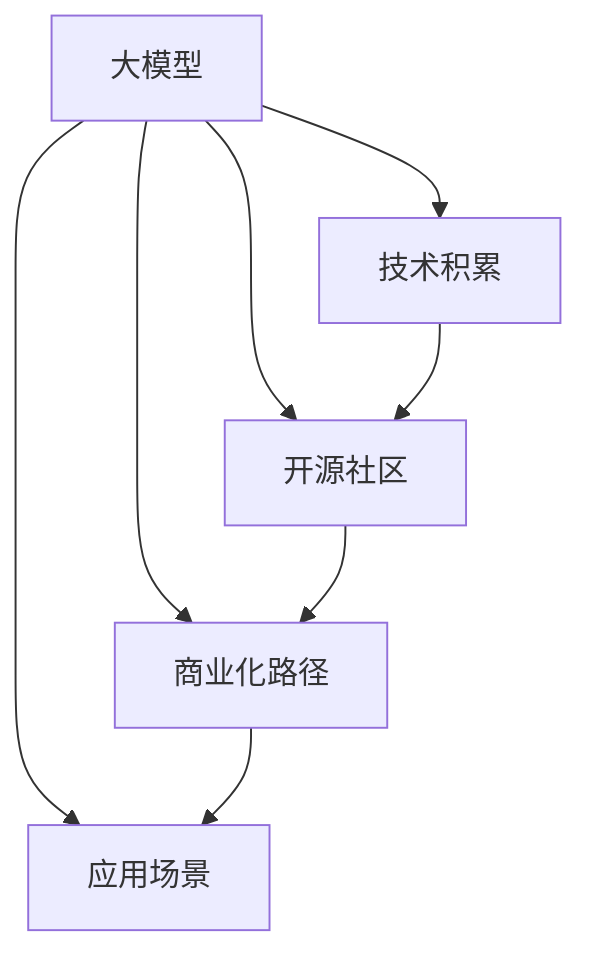

                 

# 技术发展：大模型创业的基石

> 关键词：大模型创业, 人工智能, 技术发展, 开源社区, 商业化, 应用场景

## 1. 背景介绍

### 1.1 问题由来
近年来，人工智能技术的快速发展，特别是大模型技术的崛起，为创业企业提供了新的契机。大模型如BERT、GPT-3等，凭借其强大的语言理解和生成能力，在自然语言处理（NLP）、计算机视觉（CV）、语音识别等多个领域表现出色，吸引了众多创业企业的关注。这些模型往往在数据量、参数规模和性能表现上远超传统方法，成为新一代技术的代表。

然而，尽管大模型在技术上具有显著优势，但创业企业在落地应用时仍面临诸多挑战。从技术实现到商业化部署，再到实际应用中的效果评估和优化，每一个环节都要求企业具备高水平的技术实力和市场洞察力。因此，本文将从技术发展的视角出发，探讨大模型创业企业的技术基石和未来发展方向。

### 1.2 问题核心关键点
大模型创业企业的技术基石主要包括技术积累、开源社区、商业化路径和应用场景。其中，技术积累是企业成功的核心保障；开源社区是企业快速成长的催化剂；商业化路径是企业实现盈利的关键；应用场景则是企业技术落地的重要导向。通过综合考虑这四个方面，企业能够更好地应对挑战，把握机遇。

## 2. 核心概念与联系

### 2.1 核心概念概述

为更好地理解大模型创业企业的技术基石，本节将介绍几个密切相关的核心概念：

- 大模型(大规模预训练模型)：以BERT、GPT等架构为代表的大规模语言模型，通过在海量数据上进行预训练，学习到丰富的语言知识，具有强大的自然语言理解和生成能力。

- 技术积累：指企业在开发、优化、部署和管理大模型时积累的经验和技术，包括算法优化、模型训练、分布式计算等。

- 开源社区：指围绕大模型构建的开发者社区，包含代码贡献、算法讨论、应用分享等，是企业快速成长的催化剂。

- 商业化路径：指企业将技术转化为实际产品，并实现盈利的全流程，包括市场分析、产品设计、销售推广等。

- 应用场景：指大模型在特定行业或场景中的应用，如NLP、CV、推荐系统等，是大模型技术落地的重要导向。

这些核心概念之间的逻辑关系可以通过以下Mermaid流程图来展示：



这个流程图展示了大模型创业企业的核心概念及其之间的关系：

1. 大模型通过技术积累获得基础能力。
2. 开源社区加速技术积累，推动模型优化。
3. 商业化路径将技术转化为盈利产品。
4. 应用场景为模型提供落地应用方向。

这些概念共同构成了大模型创业企业的技术发展框架，使其能够在多个维度上取得成功。

## 3. 核心算法原理 & 具体操作步骤
### 3.1 算法原理概述

大模型创业企业的技术核心是模型训练和优化，即在大规模数据上进行预训练，并在特定任务上进行调整，以提升模型在实际应用中的表现。核心算法原理包括：

- 预训练：使用大规模无标签数据对模型进行预训练，学习到通用的语言表示。
- 微调：选择任务相关的数据集，对模型进行有监督的微调，以适应特定任务的需求。
- 参数高效微调：仅更新模型中的一部分参数，保留预训练的权重，以降低微调成本。
- 分布式计算：通过分布式训练，利用多台机器并行计算，提高模型训练效率。

### 3.2 算法步骤详解

基于大模型创业企业的技术核心，以下是具体的算法步骤：

**Step 1: 准备数据和计算资源**
- 收集并标注大规模数据集，作为模型预训练和微调的数据来源。
- 配置高性能计算资源，包括GPU、TPU、分布式集群等。

**Step 2: 构建预训练模型**
- 选择预训练架构，如Transformer、BERT等。
- 设定模型参数和超参数，包括模型大小、学习率、优化器等。
- 在预训练数据上，使用大规模无标签数据进行预训练，学习到通用的语言表示。

**Step 3: 执行微调**
- 选择任务相关的标注数据集，作为微调的监督信号。
- 设计任务适配层，如分类头、回归头等。
- 使用微调数据集，对预训练模型进行有监督的微调，以适应特定任务的需求。
- 采用正则化技术，如Dropout、L2正则等，避免过拟合。
- 设定合适的学习率和迭代轮数，优化模型性能。

**Step 4: 参数高效微调**
- 根据任务需求，选择参数高效微调方法，如Adapter、LoRA等。
- 仅更新模型中的一部分参数，如顶层分类头或解码器。
- 使用动态微调策略，如Memory-augmented Networks等，减少计算成本。

**Step 5: 分布式计算**
- 使用分布式训练框架，如TensorFlow分布式、PyTorch分布式等。
- 通过多台机器并行计算，加速模型训练过程。
- 设定合适的并行策略，如数据并行、模型并行等。

以上是大模型创业企业在模型训练和优化方面的基本步骤。在实际应用中，还需根据具体任务需求，对算法进行进一步优化。

### 3.3 算法优缺点

大模型创业企业的算法优化具有以下优点：

- 高效的模型训练。通过分布式计算，大幅缩短模型训练时间，提升研发效率。
- 优异的模型表现。基于大规模数据预训练和微调，模型在各种任务上均能取得优秀的性能。
- 灵活的模型微调。通过参数高效微调和任务适配层，可以在固定大部分预训练权重的情况下，快速适应新任务。

同时，这些算法也存在一定的局限性：

- 高昂的计算成本。大规模数据预训练和分布式计算需要高昂的计算资源。
- 数据依赖性强。模型的性能很大程度上依赖于数据质量和标注数量。
- 模型复杂度高。大规模预训练模型参数量巨大，优化和部署难度高。
- 泛化能力不足。模型在特定数据集上表现优异，但面对新数据时泛化性能可能下降。

尽管存在这些局限性，但就目前而言，基于大模型的算法优化仍是技术研发的主要方向，是创业企业技术积累的核心。

### 3.4 算法应用领域

大模型创业企业的算法优化广泛应用于以下领域：

- 自然语言处理（NLP）：如文本分类、情感分析、机器翻译等。通过预训练和微调，模型可以自动理解文本内容，生成准确的输出结果。
- 计算机视觉（CV）：如图像分类、目标检测、图像生成等。通过预训练和微调，模型可以自动分析图像特征，生成高质量的输出结果。
- 推荐系统：如协同过滤、内容推荐等。通过预训练和微调，模型可以自动分析用户行为，生成个性化的推荐结果。
- 语音识别：如语音转文本、语音情感识别等。通过预训练和微调，模型可以自动分析语音信号，生成准确的输出结果。
- 知识图谱：如实体关系抽取、知识推理等。通过预训练和微调，模型可以自动分析知识图谱结构，生成合理的推理结果。

除了上述这些经典领域外，大模型创业企业的算法优化还被创新性地应用到更多场景中，如医疗诊断、智能客服、智能家居等，为不同行业带来了新的技术突破。随着预训练模型和微调方法的不断进步，相信大模型技术将在更广阔的应用领域大放异彩。

## 4. 数学模型和公式 & 详细讲解 & 举例说明

### 4.1 数学模型构建

本节将使用数学语言对大模型创业企业的算法优化过程进行更加严格的刻画。

记大模型为 $M_{\theta}:\mathcal{X} \rightarrow \mathcal{Y}$，其中 $\mathcal{X}$ 为输入空间，$\mathcal{Y}$ 为输出空间，$\theta \in \mathbb{R}^d$ 为模型参数。假设预训练数据的分布为 $p(x)$，微调任务的数据分布为 $p(x|y)$。

定义预训练损失函数为 $L_{pre}(\theta) = \mathbb{E}_{x \sim p(x)}[-\log M_{\theta}(x)]$，微调损失函数为 $L_{fin}(\theta) = \mathbb{E}_{(x,y) \sim p(x|y)}[-\log M_{\theta}(x|y)]$。

在实际应用中，预训练损失函数通常使用自监督任务，如语言模型、掩码语言模型等。微调损失函数则根据具体任务，选择相应的监督信号，如分类交叉熵、回归均方误差等。

### 4.2 公式推导过程

以下我们以文本分类任务为例，推导微调模型的损失函数及其梯度的计算公式。

假设模型 $M_{\theta}$ 在输入 $x$ 上的输出为 $\hat{y}=M_{\theta}(x) \in [0,1]$，表示样本属于正类的概率。真实标签 $y \in \{0,1\}$。则二分类交叉熵损失函数定义为：

$$
L_{fin}(\theta) = -\frac{1}{N}\sum_{i=1}^N [y_i\log \hat{y}_i+(1-y_i)\log (1-\hat{y}_i)]
$$

其中 $N$ 为样本数。

根据链式法则，损失函数对参数 $\theta_k$ 的梯度为：

$$
\frac{\partial L_{fin}(\theta)}{\partial \theta_k} = -\frac{1}{N}\sum_{i=1}^N (\frac{y_i}{\hat{y}_i}-\frac{1-y_i}{1-\hat{y}_i}) \frac{\partial \hat{y}_i}{\partial \theta_k}
$$

其中 $\frac{\partial \hat{y}_i}{\partial \theta_k}$ 可通过自动微分技术高效计算。

在得到损失函数的梯度后，即可带入参数更新公式，完成模型的迭代优化。重复上述过程直至收敛，最终得到适应下游任务的最优模型参数 $\theta^*$。

### 4.3 案例分析与讲解

**案例分析：情感分析任务**

情感分析任务的目标是判断文本的情感倾向，通常使用二分类或多分类标签表示。假设已经收集到标注好的情感分析数据集，包含正向、负向和中性情感的文本样本。

以下是具体的算法步骤：

**Step 1: 准备数据和计算资源**
- 收集并标注情感分析数据集，作为模型微调的数据来源。
- 配置高性能计算资源，包括GPU、TPU、分布式集群等。

**Step 2: 构建预训练模型**
- 选择预训练架构，如BERT、GPT等。
- 设定模型参数和超参数，包括模型大小、学习率、优化器等。
- 在预训练数据上，使用大规模无标签数据进行预训练，学习到通用的语言表示。

**Step 3: 执行微调**
- 选择情感分析相关的标注数据集，作为微调的监督信号。
- 设计分类头，添加交叉熵损失函数。
- 使用微调数据集，对预训练模型进行有监督的微调，以适应情感分析任务的需求。
- 采用正则化技术，如Dropout、L2正则等，避免过拟合。
- 设定合适的学习率和迭代轮数，优化模型性能。

**Step 4: 参数高效微调**
- 根据情感分析任务需求，选择参数高效微调方法，如Adapter、LoRA等。
- 仅更新模型中的分类头或解码器。
- 使用动态微调策略，如Memory-augmented Networks等，减少计算成本。

**Step 5: 分布式计算**
- 使用分布式训练框架，如TensorFlow分布式、PyTorch分布式等。
- 通过多台机器并行计算，加速模型训练过程。
- 设定合适的并行策略，如数据并行、模型并行等。

通过上述步骤，即可构建一个高效、优异的情感分析模型。在实际应用中，通过不断地微调和优化，模型的表现将不断提升，满足不同应用场景的需求。

## 5. 项目实践：代码实例和详细解释说明

### 5.1 开发环境搭建

在进行大模型创业企业的算法优化实践前，我们需要准备好开发环境。以下是使用Python进行PyTorch开发的环境配置流程：

1. 安装Anaconda：从官网下载并安装Anaconda，用于创建独立的Python环境。

2. 创建并激活虚拟环境：
```bash
conda create -n pytorch-env python=3.8 
conda activate pytorch-env
```

3. 安装PyTorch：根据CUDA版本，从官网获取对应的安装命令。例如：
```bash
conda install pytorch torchvision torchaudio cudatoolkit=11.1 -c pytorch -c conda-forge
```

4. 安装Transformers库：
```bash
pip install transformers
```

5. 安装各类工具包：
```bash
pip install numpy pandas scikit-learn matplotlib tqdm jupyter notebook ipython
```

完成上述步骤后，即可在`pytorch-env`环境中开始算法优化实践。

### 5.2 源代码详细实现

下面以情感分析任务为例，给出使用Transformers库对BERT模型进行微调的PyTorch代码实现。

首先，定义情感分析任务的数据处理函数：

```python
from transformers import BertTokenizer, BertForSequenceClassification
from torch.utils.data import Dataset
import torch

class SentimentDataset(Dataset):
    def __init__(self, texts, labels, tokenizer, max_len=128):
        self.texts = texts
        self.labels = labels
        self.tokenizer = tokenizer
        self.max_len = max_len
        
    def __len__(self):
        return len(self.texts)
    
    def __getitem__(self, item):
        text = self.texts[item]
        label = self.labels[item]
        
        encoding = self.tokenizer(text, return_tensors='pt', max_length=self.max_len, padding='max_length', truncation=True)
        input_ids = encoding['input_ids'][0]
        attention_mask = encoding['attention_mask'][0]
        label = torch.tensor(label, dtype=torch.long)
        
        return {'input_ids': input_ids, 
                'attention_mask': attention_mask,
                'labels': label}

# 标签与id的映射
label2id = {'positive': 1, 'negative': 0}
id2label = {v: k for k, v in label2id.items()}

# 创建dataset
tokenizer = BertTokenizer.from_pretrained('bert-base-cased')

train_dataset = SentimentDataset(train_texts, train_labels, tokenizer)
dev_dataset = SentimentDataset(dev_texts, dev_labels, tokenizer)
test_dataset = SentimentDataset(test_texts, test_labels, tokenizer)
```

然后，定义模型和优化器：

```python
from transformers import AdamW

model = BertForSequenceClassification.from_pretrained('bert-base-cased', num_labels=2)

optimizer = AdamW(model.parameters(), lr=2e-5)
```

接着，定义训练和评估函数：

```python
from torch.utils.data import DataLoader
from tqdm import tqdm
from sklearn.metrics import classification_report

device = torch.device('cuda') if torch.cuda.is_available() else torch.device('cpu')
model.to(device)

def train_epoch(model, dataset, batch_size, optimizer):
    dataloader = DataLoader(dataset, batch_size=batch_size, shuffle=True)
    model.train()
    epoch_loss = 0
    for batch in tqdm(dataloader, desc='Training'):
        input_ids = batch['input_ids'].to(device)
        attention_mask = batch['attention_mask'].to(device)
        labels = batch['labels'].to(device)
        model.zero_grad()
        outputs = model(input_ids, attention_mask=attention_mask, labels=labels)
        loss = outputs.loss
        epoch_loss += loss.item()
        loss.backward()
        optimizer.step()
    return epoch_loss / len(dataloader)

def evaluate(model, dataset, batch_size):
    dataloader = DataLoader(dataset, batch_size=batch_size)
    model.eval()
    preds, labels = [], []
    with torch.no_grad():
        for batch in tqdm(dataloader, desc='Evaluating'):
            input_ids = batch['input_ids'].to(device)
            attention_mask = batch['attention_mask'].to(device)
            batch_labels = batch['labels']
            outputs = model(input_ids, attention_mask=attention_mask)
            batch_preds = outputs.logits.argmax(dim=2).to('cpu').tolist()
            batch_labels = batch_labels.to('cpu').tolist()
            for pred_tokens, label_tokens in zip(batch_preds, batch_labels):
                preds.append(pred_tokens[:len(label_tokens)])
                labels.append(label_tokens)
                
    print(classification_report(labels, preds))
```

最后，启动训练流程并在测试集上评估：

```python
epochs = 5
batch_size = 16

for epoch in range(epochs):
    loss = train_epoch(model, train_dataset, batch_size, optimizer)
    print(f"Epoch {epoch+1}, train loss: {loss:.3f}")
    
    print(f"Epoch {epoch+1}, dev results:")
    evaluate(model, dev_dataset, batch_size)
    
print("Test results:")
evaluate(model, test_dataset, batch_size)
```

以上就是使用PyTorch对BERT进行情感分析任务微调的完整代码实现。可以看到，得益于Transformers库的强大封装，我们可以用相对简洁的代码完成BERT模型的加载和微调。

### 5.3 代码解读与分析

让我们再详细解读一下关键代码的实现细节：

**SentimentDataset类**：
- `__init__`方法：初始化文本、标签、分词器等关键组件。
- `__len__`方法：返回数据集的样本数量。
- `__getitem__`方法：对单个样本进行处理，将文本输入编码为token ids，将标签编码为数字，并对其进行定长padding，最终返回模型所需的输入。

**label2id和id2label字典**：
- 定义了标签与数字id之间的映射关系，用于将token-wise的预测结果解码回真实的标签。

**训练和评估函数**：
- 使用PyTorch的DataLoader对数据集进行批次化加载，供模型训练和推理使用。
- 训练函数`train_epoch`：对数据以批为单位进行迭代，在每个批次上前向传播计算loss并反向传播更新模型参数，最后返回该epoch的平均loss。
- 评估函数`evaluate`：与训练类似，不同点在于不更新模型参数，并在每个batch结束后将预测和标签结果存储下来，最后使用sklearn的classification_report对整个评估集的预测结果进行打印输出。

**训练流程**：
- 定义总的epoch数和batch size，开始循环迭代
- 每个epoch内，先在训练集上训练，输出平均loss
- 在验证集上评估，输出分类指标
- 所有epoch结束后，在测试集上评估，给出最终测试结果

可以看到，PyTorch配合Transformers库使得BERT微调的代码实现变得简洁高效。开发者可以将更多精力放在数据处理、模型改进等高层逻辑上，而不必过多关注底层的实现细节。

当然，工业级的系统实现还需考虑更多因素，如模型的保存和部署、超参数的自动搜索、更灵活的任务适配层等。但核心的微调范式基本与此类似。

## 6. 实际应用场景
### 6.1 智能客服系统

基于大语言模型微调的对话技术，可以广泛应用于智能客服系统的构建。传统客服往往需要配备大量人力，高峰期响应缓慢，且一致性和专业性难以保证。而使用微调后的对话模型，可以7x24小时不间断服务，快速响应客户咨询，用自然流畅的语言解答各类常见问题。

在技术实现上，可以收集企业内部的历史客服对话记录，将问题和最佳答复构建成监督数据，在此基础上对预训练对话模型进行微调。微调后的对话模型能够自动理解用户意图，匹配最合适的答案模板进行回复。对于客户提出的新问题，还可以接入检索系统实时搜索相关内容，动态组织生成回答。如此构建的智能客服系统，能大幅提升客户咨询体验和问题解决效率。

### 6.2 金融舆情监测

金融机构需要实时监测市场舆论动向，以便及时应对负面信息传播，规避金融风险。传统的人工监测方式成本高、效率低，难以应对网络时代海量信息爆发的挑战。基于大语言模型微调的文本分类和情感分析技术，为金融舆情监测提供了新的解决方案。

具体而言，可以收集金融领域相关的新闻、报道、评论等文本数据，并对其进行主题标注和情感标注。在此基础上对预训练语言模型进行微调，使其能够自动判断文本属于何种主题，情感倾向是正面、中性还是负面。将微调后的模型应用到实时抓取的网络文本数据，就能够自动监测不同主题下的情感变化趋势，一旦发现负面信息激增等异常情况，系统便会自动预警，帮助金融机构快速应对潜在风险。

### 6.3 个性化推荐系统

当前的推荐系统往往只依赖用户的历史行为数据进行物品推荐，无法深入理解用户的真实兴趣偏好。基于大语言模型微调技术，个性化推荐系统可以更好地挖掘用户行为背后的语义信息，从而提供更精准、多样的推荐内容。

在实践中，可以收集用户浏览、点击、评论、分享等行为数据，提取和用户交互的物品标题、描述、标签等文本内容。将文本内容作为模型输入，用户的后续行为（如是否点击、购买等）作为监督信号，在此基础上微调预训练语言模型。微调后的模型能够从文本内容中准确把握用户的兴趣点。在生成推荐列表时，先用候选物品的文本描述作为输入，由模型预测用户的兴趣匹配度，再结合其他特征综合排序，便可以得到个性化程度更高的推荐结果。

### 6.4 未来应用展望

随着大语言模型微调技术的发展，基于微调范式将在更多领域得到应用，为传统行业带来变革性影响。

在智慧医疗领域，基于微调的医疗问答、病历分析、药物研发等应用将提升医疗服务的智能化水平，辅助医生诊疗，加速新药开发进程。

在智能教育领域，微调技术可应用于作业批改、学情分析、知识推荐等方面，因材施教，促进教育公平，提高教学质量。

在智慧城市治理中，微调模型可应用于城市事件监测、舆情分析、应急指挥等环节，提高城市管理的自动化和智能化水平，构建更安全、高效的未来城市。

此外，在企业生产、社会治理、文娱传媒等众多领域，基于大模型微调的人工智能应用也将不断涌现，为经济社会发展注入新的动力。相信随着技术的日益成熟，微调方法将成为人工智能落地应用的重要范式，推动人工智能技术在各个垂直行业的广泛应用。

## 7. 工具和资源推荐
### 7.1 学习资源推荐

为了帮助开发者系统掌握大模型创业企业的技术基石，这里推荐一些优质的学习资源：

1. 《Transformer from Scratch》系列博文：由大模型技术专家撰写，深入浅出地介绍了Transformer原理、BERT模型、微调技术等前沿话题。

2. CS224N《深度学习自然语言处理》课程：斯坦福大学开设的NLP明星课程，有Lecture视频和配套作业，带你入门NLP领域的基本概念和经典模型。

3. 《Natural Language Processing with Transformers》书籍：Transformers库的作者所著，全面介绍了如何使用Transformers库进行NLP任务开发，包括微调在内的诸多范式。

4. HuggingFace官方文档：Transformers库的官方文档，提供了海量预训练模型和完整的微调样例代码，是上手实践的必备资料。

5. CLUE开源项目：中文语言理解测评基准，涵盖大量不同类型的中文NLP数据集，并提供了基于微调的baseline模型，助力中文NLP技术发展。

通过对这些资源的学习实践，相信你一定能够快速掌握大模型创业企业的技术基石，并用于解决实际的NLP问题。
###  7.2 开发工具推荐

高效的开发离不开优秀的工具支持。以下是几款用于大模型创业企业算法优化的常用工具：

1. PyTorch：基于Python的开源深度学习框架，灵活动态的计算图，适合快速迭代研究。大部分预训练语言模型都有PyTorch版本的实现。

2. TensorFlow：由Google主导开发的开源深度学习框架，生产部署方便，适合大规模工程应用。同样有丰富的预训练语言模型资源。

3. Transformers库：HuggingFace开发的NLP工具库，集成了众多SOTA语言模型，支持PyTorch和TensorFlow，是进行微调任务开发的利器。

4. Weights & Biases：模型训练的实验跟踪工具，可以记录和可视化模型训练过程中的各项指标，方便对比和调优。与主流深度学习框架无缝集成。

5. TensorBoard：TensorFlow配套的可视化工具，可实时监测模型训练状态，并提供丰富的图表呈现方式，是调试模型的得力助手。

6. Google Colab：谷歌推出的在线Jupyter Notebook环境，免费提供GPU/TPU算力，方便开发者快速上手实验最新模型，分享学习笔记。

合理利用这些工具，可以显著提升大模型创业企业算法优化的开发效率，加快创新迭代的步伐。

### 7.3 相关论文推荐

大模型创业企业的算法优化不断发展，得益于学界的持续研究。以下是几篇奠基性的相关论文，推荐阅读：

1. Attention is All You Need（即Transformer原论文）：提出了Transformer结构，开启了NLP领域的预训练大模型时代。

2. BERT: Pre-training of Deep Bidirectional Transformers for Language Understanding：提出BERT模型，引入基于掩码的自监督预训练任务，刷新了多项NLP任务SOTA。

3. Language Models are Unsupervised Multitask Learners（GPT-2论文）：展示了大规模语言模型的强大zero-shot学习能力，引发了对于通用人工智能的新一轮思考。

4. Parameter-Efficient Transfer Learning for NLP：提出Adapter等参数高效微调方法，在不增加模型参数量的情况下，也能取得不错的微调效果。

5. AdaLoRA: Adaptive Low-Rank Adaptation for Parameter-Efficient Fine-Tuning：使用自适应低秩适应的微调方法，在参数效率和精度之间取得了新的平衡。

这些论文代表了大模型创业企业算法优化的发展脉络。通过学习这些前沿成果，可以帮助研究者把握学科前进方向，激发更多的创新灵感。

## 8. 总结：未来发展趋势与挑战

### 8.1 总结

本文对大模型创业企业的技术基石进行了全面系统的介绍。首先阐述了技术积累、开源社区、商业化路径和应用场景的核心概念，明确了这些概念之间的关系。其次，从原理到实践，详细讲解了算法优化过程中的关键步骤，给出了微调任务开发的完整代码实例。同时，本文还广泛探讨了大模型在NLP、CV、推荐系统等领域的实际应用场景，展示了技术基石的广阔应用前景。

通过本文的系统梳理，可以看到，大模型创业企业的技术基石是企业成功的核心保障，是企业快速成长的催化剂，是实现盈利的关键，是技术落地的重要导向。这些基石共同构成了大模型创业企业的技术发展框架，使其能够在多个维度上取得成功。

### 8.2 未来发展趋势

展望未来，大模型创业企业的技术基石将呈现以下几个发展趋势：

1. 算法优化将更加高效。随着算法的不断演进，微调、预训练等步骤的效率将显著提升，使得模型训练和优化更加快速。

2. 开源社区将更加活跃。开源社区的贡献者数量和多样性将不断增加，使得模型优化和应用更加多样。

3. 商业化路径将更加丰富。随着技术的成熟，更多企业将进入人工智能领域，开发更多产品，形成竞争和合作的双赢局面。

4. 应用场景将更加广泛。大模型将在医疗、教育、金融、智能家居等更多垂直行业得到应用，推动行业智能化转型。

5. 技术交流将更加频繁。更多企业将参与国际人工智能大会、学术会议等，交流技术成果，推动行业发展。

6. 算法优化将更加面向实际应用。未来算法优化将更加关注模型在实际应用中的效果，通过多领域数据训练，提升模型泛化性能。

以上趋势凸显了大模型创业企业的技术基石的广阔前景。这些方向的探索发展，必将进一步提升大模型创业企业在各垂直行业的表现，推动人工智能技术的普及和应用。

### 8.3 面临的挑战

尽管大模型创业企业的技术基石已经取得了显著成果，但在迈向更加智能化、普适化应用的过程中，仍面临诸多挑战：

1. 计算资源瓶颈。大规模数据预训练和分布式计算需要高昂的计算资源，普通企业难以负担。

2. 数据依赖性强。模型的性能很大程度上依赖于数据质量和标注数量，获取高质量标注数据的成本较高。

3. 模型复杂度高。大规模预训练模型参数量巨大，优化和部署难度高。

4. 技术积累不足。大多数创业企业缺乏丰富的技术积累，需要花大量时间和精力在模型优化和算法研发上。

5. 知识迁移能力有限。模型在特定领域内的泛化性能可能不足，需要进一步优化。

6. 伦理和安全性问题。预训练模型可能会学习到有害信息，应用于不同场景时可能存在安全隐患。

尽管存在这些挑战，但通过不断创新和突破，大模型创业企业依然能够在人工智能领域取得突破性进展，为各行各业带来变革性影响。

### 8.4 研究展望

面向未来，大模型创业企业需要在以下几个方面寻求新的突破：

1. 探索无监督和半监督学习。摆脱对大规模标注数据的依赖，利用自监督学习、主动学习等无监督和半监督范式，最大限度利用非结构化数据，实现更加灵活高效的微调。

2. 研究参数高效和计算高效的微调范式。开发更加参数高效的微调方法，在固定大部分预训练参数的同时，只更新极少量的任务相关参数。同时优化微调模型的计算图，减少前向传播和反向传播的资源消耗，实现更加轻量级、实时性的部署。

3. 融合因果和对比学习范式。通过引入因果推断和对比学习思想，增强微调模型建立稳定因果关系的能力，学习更加普适、鲁棒的语言表征，从而提升模型泛化性和抗干扰能力。

4. 引入更多先验知识。将符号化的先验知识，如知识图谱、逻辑规则等，与神经网络模型进行巧妙融合，引导微调过程学习更准确、合理的语言模型。同时加强不同模态数据的整合，实现视觉、语音等多模态信息与文本信息的协同建模。

5. 结合因果分析和博弈论工具。将因果分析方法引入微调模型，识别出模型决策的关键特征，增强输出解释的因果性和逻辑性。借助博弈论工具刻画人机交互过程，主动探索并规避模型的脆弱点，提高系统稳定性。

6. 纳入伦理道德约束。在模型训练目标中引入伦理导向的评估指标，过滤和惩罚有偏见、有害的输出倾向。同时加强人工干预和审核，建立模型行为的监管机制，确保输出符合人类价值观和伦理道德。

这些研究方向的探索，必将引领大模型创业企业在人工智能领域的进一步发展，为人类认知智能的进化带来深远影响。面向未来，大模型创业企业需要在技术创新、商业合作、伦理治理等多个维度上共同发力，方能更好地构建人机协同的智能时代。

## 9. 附录：常见问题与解答

**Q1：大模型创业企业如何获取高质量标注数据？**

A: 大模型创业企业获取高质量标注数据的方法包括：
1. 爬取公开数据集：如CLUE、GLUE等，这些数据集已经标注好，可直接用于模型微调。
2. 众包标注平台：如Amazon Mechanical Turk，雇佣标注人员进行标注，成本较低。
3. 企业自有数据：收集企业内部的业务数据，如客服对话记录、用户行为数据等，进行标注。
4. 开源社区：通过参与开源项目，获取标注数据或利用其他企业标注数据。

以上方法各有优缺点，企业需要根据具体情况选择合适的方式。

**Q2：大模型创业企业如何降低计算成本？**

A: 大模型创业企业降低计算成本的方法包括：
1. 利用云计算平台：如AWS、阿里云、华为云等，提供GPU、TPU等高性能算力，降低计算成本。
2. 使用模型压缩技术：如模型剪枝、量化、稀疏化等，减小模型大小，降低计算量。
3. 利用分布式训练：通过多台机器并行计算，加速模型训练过程。
4. 优化模型结构：如引入Adapter、LoRA等参数高效微调方法，减少计算量。
5. 使用GPU、TPU等高效硬件：通过硬件加速，提高计算效率。

通过上述方法，企业可以在保证模型性能的前提下，大幅降低计算成本。

**Q3：大模型创业企业如何进行伦理治理？**

A: 大模型创业企业进行伦理治理的方法包括：
1. 引入伦理导向的评估指标：如公平性、透明度、可信度等，确保模型输出符合伦理道德。
2. 加强人工干预和审核：如人工标注、人工推理等，确保模型输出符合人类价值观。
3. 建立模型行为监管机制：如风险评估、异常检测等，防止模型输出有害信息。
4. 引入伦理道德团队：招聘具有伦理道德背景的专家，对模型输出进行评估和监管。
5. 加强技术透明度：公开模型架构、训练过程等，确保技术透明和可信。

通过以上方法，大模型创业企业可以在技术创新和伦理治理之间取得平衡，确保模型输出符合社会价值观和伦理道德。

---

作者：禅与计算机程序设计艺术 / Zen and the Art of Computer Programming

