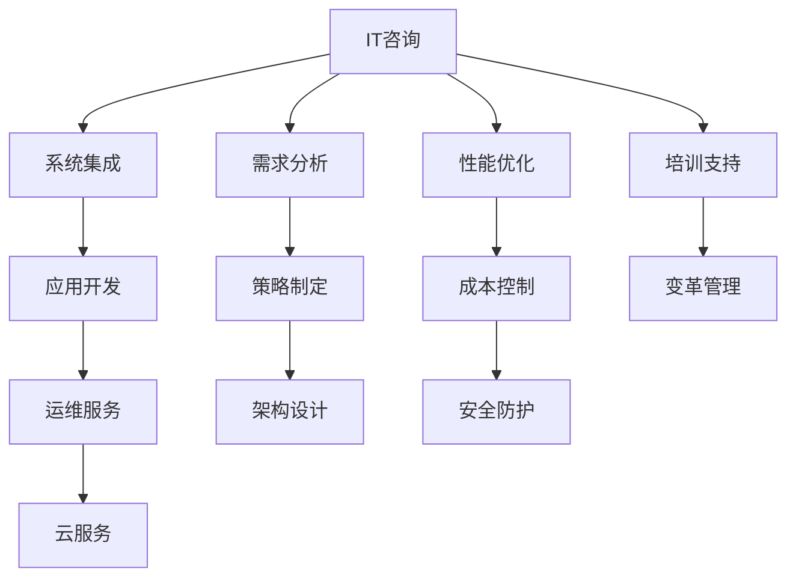

                 

## 1. 背景介绍

### 1.1 问题由来
在数字化转型的浪潮中，各行业企业纷纷加大了对信息技术（IT）的依赖，希望通过高价值的IT咨询和解决方案提升运营效率，降低运营成本，优化决策支持，创造新的业务机会。然而，面对日益复杂和多样化的企业需求，传统的IT服务模式和咨询服务已无法满足其日益增长的需求。

### 1.2 问题核心关键点
高价值服务的提供需要建立在深厚的技术积累、丰富的实践经验、广泛的知识体系和全面的战略洞察之上。而信息技术咨询、系统架构设计、应用开发、系统集成和运维等各个环节，都需要专业且复合的咨询师和工程师来完成。

### 1.3 问题研究意义
高价值IT咨询服务的提供，对于提升企业数字化转型水平，增强竞争力，具有重要意义：

1. **降低IT风险**：通过专业的咨询，帮助企业避免技术选择错误，降低IT项目实施风险。
2. **提升运营效率**：通过全面的规划和优化，提升企业IT系统的效率，缩短项目实施周期。
3. **优化决策支持**：基于数据驱动的分析和决策，提供更科学、准确的业务建议。
4. **创造新价值**：通过技术创新和业务结合，激发企业的创新潜力，推动业务模式转型。
5. **保障信息安全**：利用最新安全技术，建立安全可靠的信息系统，保护企业数据资产。

## 2. 核心概念与联系

### 2.1 核心概念概述

为了更好地理解高价值IT咨询服务的提供，本节将介绍几个密切相关的核心概念：

- **IT咨询（IT Consulting）**：为企业提供信息化规划、IT策略制定、系统架构设计等专业咨询服务。
- **系统集成（System Integration）**：将多个独立系统和组件整合为一个完整的业务系统，实现信息共享和协同工作。
- **应用开发（Application Development）**：基于企业需求，定制开发软件应用，解决业务问题。
- **运维服务（IT Operations）**：确保IT系统稳定运行，提供故障排除、性能优化等服务。
- **云服务（Cloud Services）**：通过云计算平台，提供弹性扩展、按需计费的服务。

这些概念之间有着紧密的联系，共同构成了IT服务的核心体系：

1. **IT咨询**提供战略和技术规划，为后续的系统集成和应用开发提供指导。
2. **系统集成**将应用开发和运维服务整合，形成一个完整的IT解决方案。
3. **应用开发**根据企业需求定制解决方案，提供功能实现。
4. **运维服务**保障IT系统稳定运行，及时解决系统问题。
5. **云服务**提供弹性扩展和成本优化的服务，支持企业业务扩展和灵活调整。

### 2.2 核心概念原理和架构的 Mermaid 流程图



这个流程图展示了大价值IT服务提供的基本流程：

1. **需求分析**：理解企业业务需求，设计合理的IT解决方案。
2. **策略制定**：根据企业目标和现状，制定IT发展策略，规划IT系统架构。
3. **架构设计**：设计系统架构，确保系统可靠性、可扩展性、可维护性。
4. **应用开发**：根据架构要求，开发符合企业需求的定制应用。
5. **运维服务**：保障系统稳定运行，及时解决系统问题。
6. **云服务**：通过弹性扩展，优化资源使用，支持企业业务增长。

这些环节相互关联，形成一个完整的IT服务链条。

## 3. 核心算法原理 & 具体操作步骤

### 3.1 算法原理概述

高价值IT咨询服务，本质上是一个数据驱动、知识驱动的咨询和执行过程。其核心在于：

- **数据驱动**：通过数据采集、分析和可视化，帮助企业理解业务现状和趋势。
- **知识驱动**：利用专业知识和最佳实践，提供科学的IT解决方案。
- **执行驱动**：通过项目管理、协同工作和持续优化，实现IT系统的部署和运维。

### 3.2 算法步骤详解

1. **需求分析和策略制定**
   - 收集企业业务需求，了解其业务目标、流程和数据需求。
   - 根据业务需求，制定IT发展策略，包括目标设定、方案选择、技术路线等。

2. **系统架构设计**
   - 根据策略和需求，设计系统架构，确定系统组件、接口、数据流等。
   - 选择合适的技术和工具，保障系统可靠性、可扩展性和可维护性。

3. **应用开发和系统集成**
   - 根据架构要求，进行应用开发，实现业务功能。
   - 对各个应用模块进行系统集成，确保信息共享和协同工作。

4. **运维服务**
   - 部署和上线系统，提供日常运维服务，保障系统稳定运行。
   - 定期进行性能优化和故障排除，提升系统效率和稳定性。

5. **持续优化和升级**
   - 根据业务发展和用户反馈，不断优化和升级系统。
   - 引入新技术和工具，提升系统功能和性能。

### 3.3 算法优缺点

**优点**：

- **全面性**：覆盖IT服务的各个环节，提供一站式的解决方案。
- **专业性**：结合咨询、开发、运维等专业团队，提供高质量的服务。
- **灵活性**：根据企业需求，提供定制化的解决方案，满足多样化需求。

**缺点**：

- **成本高**：需要投入大量的咨询、开发和运维资源，成本较高。
- **周期长**：IT系统建设周期较长，短期内难以见效。
- **依赖性强**：对咨询师和工程师的专业水平和经验要求高。

### 3.4 算法应用领域

高价值IT咨询服务的提供，已经在多个领域得到了广泛应用，如：

- **金融行业**：通过IT咨询和系统集成，提升金融机构的业务效率和风险管理能力。
- **零售行业**：利用应用开发和云服务，实现客户关系管理和库存优化，提升运营效率。
- **制造业**：结合系统集成和运维服务，实现生产计划和供应链管理，降低成本，提升质量。
- **医疗行业**：通过系统集成和云服务，实现电子病历管理和远程医疗，提升服务质量和覆盖范围。
- **政府部门**：通过IT咨询和应用开发，实现电子政务和公共服务，提升政府管理效率和服务水平。

## 4. 数学模型和公式 & 详细讲解 & 举例说明

### 4.1 数学模型构建

高价值IT咨询服务的提供，涉及多个领域的知识和技能，包括信息技术、管理学、数据分析、工程学等。在此，我们以一个简单的项目规划和成本控制模型为例，说明高价值IT服务的具体实现过程。

### 4.2 公式推导过程

假设企业需要建设一个ERP系统，其成本C由多个部分组成，包括咨询费用C咨询、开发费用C开发、硬件和网络费用C硬件、运维费用C运维和云服务费用C云服务。

$$
C = C_{\text{咨询}} + C_{\text{开发}} + C_{\text{硬件}} + C_{\text{运维}} + C_{\text{云服务}}
$$

其中，咨询费用C咨询根据咨询师的工时和工作量计算；开发费用C开发根据开发人员的工时和工作量计算；硬件和网络费用C硬件根据设备采购和网络建设成本计算；运维费用C运维根据运维人员工时和设备维护成本计算；云服务费用C云服务根据云计算平台的使用成本计算。

### 4.3 案例分析与讲解

某制造企业需要建设一个生产管理系统，根据需求分析，制定了以下策略：

1. **咨询阶段**：
   - 需求分析：通过调研，了解生产管理现状和需求。
   - 策略制定：制定ERP系统建设策略，包括系统架构、功能需求、技术选型等。

2. **系统设计阶段**：
   - 架构设计：确定系统架构，包括生产计划模块、库存管理模块、采购管理模块等。
   - 技术选型：选择适合的技术栈，如Java、Spring、MySQL等。

3. **应用开发阶段**：
   - 模块开发：开发生产计划、库存管理、采购管理等模块，实现生产管理功能。
   - 系统集成：将各个模块集成为一个完整的ERP系统。

4. **运维服务阶段**：
   - 部署上线：将ERP系统部署到企业内部网络。
   - 运维支持：提供日常运维服务，保障系统稳定运行。

5. **持续优化阶段**：
   - 性能优化：定期进行性能优化，提升系统响应速度和稳定性。
   - 功能升级：根据企业需求，进行功能升级和扩展。

通过以上步骤，企业能够实现生产管理的全面信息化，提升运营效率，降低成本，提升管理水平。

## 5. 项目实践：代码实例和详细解释说明

### 5.1 开发环境搭建

高价值IT服务的提供，涉及多个领域的技术和工具。以下是一个简化的开发环境搭建流程：

1. **安装Python和相关库**：
   - 安装Python和pip，方便后续安装相关库。
   - 安装numpy、pandas、scikit-learn等数据分析库。

2. **安装项目管理工具**：
   - 安装JIRA或Trello，用于需求管理和项目管理。
   - 安装Confluence或SharePoint，用于知识管理和文档存储。

3. **安装开发和运维工具**：
   - 安装Git，方便版本控制和代码管理。
   - 安装Docker和Kubernetes，用于容器化和分布式部署。

4. **安装云服务提供商工具**：
   - 安装AWS CLI或Google Cloud SDK，方便云服务部署和运维。
   - 安装Azure CLI，方便Azure云服务的管理和监控。

### 5.2 源代码详细实现

以下是一个简单的项目规划和成本控制模型的代码实现，使用Python和Pandas库进行数据分析：

```python
import pandas as pd

# 读取数据
data = pd.read_csv('ERP_costs.csv')

# 数据清洗
data.dropna(inplace=True)

# 计算各项成本
total_cost = data['C咨询'].sum() + data['C开发'].sum() + data['C硬件'].sum() + data['C运维'].sum() + data['C云服务'].sum()

# 输出结果
print(f"总成本为：{total_cost}")
```

### 5.3 代码解读与分析

上述代码实现了一个简单的项目规划和成本控制模型，主要包含以下几个步骤：

1. **数据读取**：使用Pandas库读取ERP系统建设成本的数据集。
2. **数据清洗**：使用dropna方法清除缺失数据。
3. **成本计算**：使用sum方法计算各项成本的总和。
4. **结果输出**：输出总成本。

通过这个简单的模型，可以初步评估ERP系统建设的成本，帮助企业进行预算控制和决策。

### 5.4 运行结果展示

假设企业建设ERP系统，各项成本如表所示：

| 项     | 成本（元） |
|--------|-----------|
| C咨询  | 100000    |
| C开发  | 150000    |
| C硬件  | 200000    |
| C运维  | 100000    |
| C云服务| 50000     |

根据上述代码，计算总成本如下：

$$
\text{总成本} = 100000 + 150000 + 200000 + 100000 + 50000 = 600000
$$

## 6. 实际应用场景

### 6.1 金融行业

金融行业对IT系统的稳定性和可靠性要求极高。通过IT咨询和系统集成，金融企业可以构建高效的金融信息系统，实现风险管理和客户服务升级。

1. **风险管理**：利用IT系统实时监控市场动态，实现风险预警和分析。
2. **客户服务**：通过线上服务系统，提升客户体验，减少人工操作。
3. **业务扩展**：利用云计算平台，实现业务快速扩展和弹性调整。

### 6.2 零售行业

零售企业需要高效管理库存、订单和客户关系。通过应用开发和云服务，零售企业可以实现供应链优化和客户管理升级。

1. **库存管理**：利用ERP系统，实现库存自动补货和预警。
2. **订单管理**：通过在线销售平台，提升订单处理效率和客户满意度。
3. **客户管理**：利用CRM系统，实现客户关系管理和营销分析。

### 6.3 制造业

制造业企业需要高效管理生产计划和供应链。通过系统集成和运维服务，制造业企业可以实现生产计划优化和供应链管理升级。

1. **生产计划**：利用ERP系统，实现生产计划和调度优化。
2. **库存管理**：通过仓储管理系统，实现库存管理和自动化。
3. **供应链管理**：利用供应链管理系统，实现供应商管理、采购管理和物流跟踪。

### 6.4 医疗行业

医疗行业对数据安全和隐私保护要求极高。通过系统集成和云服务，医疗企业可以实现电子病历管理和远程医疗升级。

1. **电子病历管理**：利用电子病历系统，实现病历记录、查询和共享。
2. **远程医疗**：通过远程医疗平台，实现远程诊断和治疗。
3. **数据安全**：利用云服务，实现数据备份和灾难恢复。

### 6.5 政府部门

政府部门需要高效管理公共事务和服务。通过IT咨询和应用开发，政府部门可以实现电子政务和公共服务升级。

1. **电子政务**：利用电子政务系统，实现政务公开和电子审批。
2. **公共服务**：通过线上服务平台，提升服务效率和用户体验。
3. **数据管理**：利用数据管理系统，实现数据收集、分析和共享。

## 7. 工具和资源推荐

### 7.1 学习资源推荐

为帮助开发者系统掌握高价值IT服务的提供，推荐以下学习资源：

1. **《IT咨询与项目管理》**：介绍IT咨询和项目管理的基本概念和方法。
2. **《系统集成与软件开发》**：讲解系统集成和应用开发的关键技术。
3. **《运维管理与云计算》**：涵盖运维管理和云计算平台的基本原理和应用。
4. **《数据分析与数据可视化》**：讲解数据分析和数据可视化的基本技能和方法。
5. **《IT安全与风险管理》**：介绍IT安全技术和风险管理的基本知识和方法。

### 7.2 开发工具推荐

以下推荐的开发工具，可帮助开发者高效地进行高价值IT服务的提供：

1. **项目管理工具**：
   - JIRA：功能强大的项目管理和缺陷跟踪工具。
   - Trello：简单易用的看板式项目管理工具。

2. **代码管理工具**：
   - Git：版本控制工具，支持分布式协作开发。
   - SVN：版本控制工具，适合集中式开发。

3. **云服务提供商工具**：
   - AWS CLI：Amazon Web Services的命令行工具，方便云服务部署和管理。
   - Google Cloud SDK：Google Cloud Platform的命令行工具，方便云服务部署和管理。

### 7.3 相关论文推荐

高价值IT服务的提供，涉及多个领域的研究和实践，推荐以下相关论文：

1. **《IT咨询与项目管理实践》**：介绍了IT咨询和项目管理的基本方法和案例。
2. **《系统集成与软件工程》**：讲解系统集成和应用开发的关键技术。
3. **《云计算与大数据》**：涵盖云计算平台和大数据处理的基本原理和应用。
4. **《数据分析与机器学习》**：介绍数据分析和机器学习的基本技能和方法。
5. **《IT安全与隐私保护》**：介绍IT安全技术和隐私保护的基本知识和方法。

## 8. 总结：未来发展趋势与挑战

### 8.1 总结

高价值IT服务的提供，是大数据、云计算、人工智能等新兴技术融合的产物。本文对高价值IT服务的提供进行了全面系统的介绍，包括其基本原理、操作步骤和实际应用。通过深入讲解需求分析、系统设计、应用开发、运维服务和持续优化等环节，帮助读者理解高价值IT服务的具体实现过程。

通过本文的系统梳理，可以看到，高价值IT服务的提供，涉及IT咨询、系统集成、应用开发、运维服务等多个环节，需要全面而深入的规划和执行。只有从数据、知识、技术、管理和战略等多个维度协同发力，才能真正实现高价值IT服务的提供。

### 8.2 未来发展趋势

展望未来，高价值IT服务的提供将呈现以下几个发展趋势：

1. **智能化和自动化**：随着人工智能和机器学习技术的发展，IT服务将更加智能化和自动化，提升服务效率和质量。
2. **云计算和边缘计算**：云计算和边缘计算的普及，将支持企业实现弹性扩展和高效部署，降低IT成本。
3. **数据驱动和洞察力**：通过大数据分析和数据可视化，IT服务将提供更强的洞察力和决策支持。
4. **安全和隐私保护**：随着信息安全和隐私保护意识的增强，IT服务将更加注重数据安全和隐私保护。
5. **人机协同和用户体验**：通过人机协同和用户体验设计，IT服务将提供更加友好和高效的服务体验。

### 8.3 面临的挑战

尽管高价值IT服务的提供已经取得了显著成就，但在迈向更加智能化、普适化应用的过程中，仍面临诸多挑战：

1. **技术复杂性**：高价值IT服务涉及多个领域的技术和工具，需要系统化的技术栈和知识体系。
2. **需求多样性**：企业需求千差万别，IT服务需要灵活应对多样化需求，提供定制化的解决方案。
3. **成本和资源投入**：高价值IT服务需要投入大量的资源，包括人力、时间和资金，成本较高。
4. **项目管理风险**：IT项目复杂度高，需要高效的项目管理和风险控制。
5. **数据安全和隐私保护**：企业数据安全和隐私保护要求高，IT服务需要注重数据安全和隐私保护。

### 8.4 研究展望

未来，高价值IT服务的提供需要在以下几个方面寻求新的突破：

1. **技术融合和创新**：结合大数据、云计算、人工智能等技术，实现IT服务的技术融合和创新。
2. **项目管理优化**：引入敏捷开发和持续交付等现代项目管理方法，提升项目效率和质量。
3. **需求分析和定制化**：深入理解企业需求，提供定制化的解决方案，满足多样化需求。
4. **成本和资源优化**：通过云计算、微服务和容器化等技术，优化资源使用和成本控制。
5. **数据安全和隐私保护**：引入最新的安全技术和隐私保护方法，保障企业数据安全和隐私。

这些研究方向的探索，将引领高价值IT服务的提供走向更高的台阶，为各行各业提供更加高效、智能、安全的服务。面向未来，高价值IT服务需要综合考虑技术、管理、业务和战略等多个方面，协同发力，才能真正实现其在数字化转型中的价值。

## 9. 附录：常见问题与解答

**Q1: 高价值IT服务的提供需要哪些关键技术和工具？**

A: 高价值IT服务的提供需要以下关键技术和工具：

1. **项目管理工具**：如JIRA、Trello，用于需求管理和项目管理。
2. **版本控制工具**：如Git、SVN，用于代码管理和版本控制。
3. **云服务提供商工具**：如AWS CLI、Google Cloud SDK，用于云服务部署和管理。
4. **数据分析和可视化工具**：如Pandas、NumPy、Matplotlib，用于数据分析和可视化。
5. **应用开发和系统集成工具**：如Spring Boot、Django，用于应用开发和系统集成。
6. **运维和监控工具**：如Kubernetes、Docker，用于系统部署和运维监控。

**Q2: 如何提高IT服务的智能化和自动化水平？**

A: 提高IT服务的智能化和自动化水平，需要结合以下技术和方法：

1. **人工智能和机器学习**：利用AI和ML技术，实现自动化决策和智能推理。
2. **大数据分析**：通过大数据分析，提取数据洞察，优化决策支持。
3. **自动化工具和流程**：引入自动化工具和流程，提高服务效率和质量。
4. **容器化和微服务**：通过容器化和微服务，实现系统模块化和弹性扩展。
5. **自然语言处理**：利用NLP技术，实现人机交互和自然语言处理。

**Q3: 如何保障IT服务的安全和隐私保护？**

A: 保障IT服务的安全和隐私保护，需要以下措施：

1. **数据加密和访问控制**：利用数据加密和访问控制技术，保护数据安全。
2. **安全审计和监控**：定期进行安全审计和监控，发现和修复安全漏洞。
3. **隐私保护和合规性**：遵循隐私保护法规和标准，确保数据隐私和合规性。
4. **零信任安全架构**：引入零信任安全架构，确保系统安全。
5. **安全意识培训**：加强员工安全意识培训，提高安全防护能力。

**Q4: 如何提升IT服务的效率和质量？**

A: 提升IT服务的效率和质量，需要以下措施：

1. **需求分析和定制化**：深入理解企业需求，提供定制化的解决方案。
2. **敏捷开发和持续交付**：引入敏捷开发和持续交付方法，提高项目效率和质量。
3. **自动化测试和部署**：引入自动化测试和部署工具，提升测试和部署效率。
4. **持续优化和升级**：根据企业需求和市场变化，持续优化和升级系统。
5. **性能监控和调优**：利用性能监控工具，及时发现和解决性能问题。

**Q5: 如何保障IT服务的稳定性和可靠性？**

A: 保障IT服务的稳定性和可靠性，需要以下措施：

1. **冗余和备份**：实现系统冗余和数据备份，防止单点故障。
2. **高可用架构**：采用高可用架构，确保系统持续稳定运行。
3. **故障排除和恢复**：建立故障排除和恢复机制，及时处理系统故障。
4. **监控和告警**：实时监控系统状态，设置告警阈值，及时发现和处理问题。
5. **灾难恢复计划**：制定灾难恢复计划，确保系统在灾难发生时能够快速恢复。

通过这些措施，可以确保IT服务的稳定性和可靠性，提升企业IT系统的整体效能。

---

作者：禅与计算机程序设计艺术 / Zen and the Art of Computer Programming

