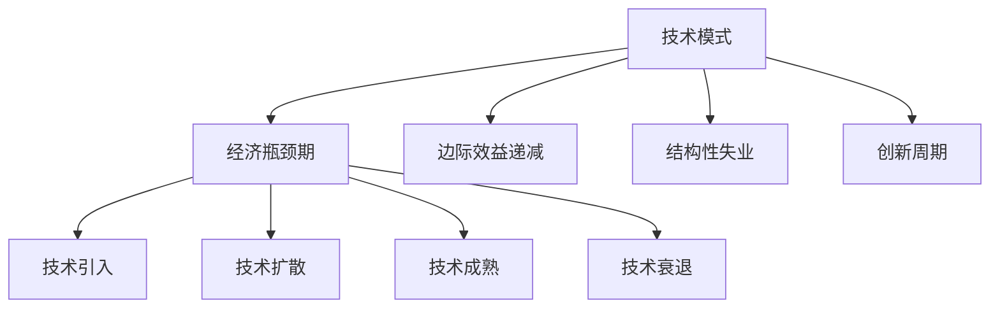

                 

## 1. 背景介绍

### 1.1 问题由来
在过去的几十年里，技术的快速进步极大地推动了人类社会的发展，从通信、交通到医疗、教育等多个领域，都发生了深刻变革。但随着技术的不断发展，我们逐渐发现技术在驱动经济增长和社会进步的同时，也面临着一系列的新挑战。这些挑战不仅涉及技术本身，更深刻地影响着经济、社会和文化的各个层面。

### 1.2 问题核心关键点
当前，技术模式和经济体系之间存在一些不匹配的现象，即所谓的“技术模式减弱与经济瓶颈期”。主要体现在以下几个方面：

1. **技术进步的边际效益递减**：随着技术的发展，新技术对生产力的提升作用逐渐减弱，传统产业的转型升级面临巨大压力。

2. **经济结构的不匹配**：传统产业对劳动力的需求正在减少，而新产业的发展速度和规模还不能完全吸纳过剩的劳动力，导致结构性失业问题加剧。

3. **经济增长的瓶颈**：现有经济体系对新技术的接纳和应用存在障碍，导致技术驱动的创新与经济发展不匹配。

4. **社会和文化的滞后**：新技术的推广和应用，不仅需要技术上的突破，还需要社会文化环境的适应和调整。

### 1.3 问题研究意义
研究技术模式和经济瓶颈期的关系，对于理解当前经济社会发展的现状和未来趋势，具有重要的理论和实践意义：

1. **政策制定**：为政府制定符合技术发展趋势的产业政策和经济规划提供依据。
2. **企业战略**：帮助企业识别技术应用的潜力与风险，制定科学的发展战略。
3. **社会稳定**：预防和缓解技术变革带来的社会不稳定因素，促进社会和谐。
4. **文化建设**：推动社会文化环境的适应和创新，提升社会整体的文化素养和技术意识。

## 2. 核心概念与联系

### 2.1 核心概念概述

为了更好地理解技术模式和经济瓶颈期的关系，本节将介绍几个关键概念：

- **技术模式**：指在一定时期内，主导经济和社会发展的技术体系和应用方式。包括但不限于信息技术、制造业技术、能源技术等。
- **经济瓶颈期**：指在技术模式转变和经济结构调整过程中，面临的一系列经济增长放缓、结构性问题加剧的阶段。
- **边际效益递减**：随着某种生产要素投入的增加，每增加一单位该要素所带来的额外收益逐渐减少的现象。
- **结构性失业**：由于产业结构变化，劳动力的技能和岗位不匹配导致的失业问题。
- **创新周期**：技术创新的周期性变化，包括技术引入、扩散、成熟、衰退等阶段。

这些概念之间的关系可以通过以下Mermaid流程图来展示：



这个流程图展示了技术模式和经济瓶颈期的内在联系：

1. 技术模式的变化通常会引发经济结构的变化，进而进入瓶颈期。
2. 技术模式的边际效益递减和结构性失业问题，在经济瓶颈期表现得尤为明显。
3. 技术创新周期的不同阶段，也会影响经济瓶颈期的长度和深度。

## 3. 核心算法原理 & 具体操作步骤
### 3.1 算法原理概述

技术模式和经济瓶颈期的关系，可以从经济学的角度进行建模和分析。核心思想是：技术模式的转变和经济结构的调整，往往伴随着生产力的变化、就业结构的改变、收入分配的不平衡等，这些变化最终会对经济增长产生影响。

假设有一个典型的经济体，其技术模式为 $T(t)$，经济增长率为 $G(t)$，劳动力需求为 $L(t)$，工资水平为 $W(t)$。技术模式的转变 $T(t+1)$ 可以通过模型进行描述，经济增长率和劳动力需求的变化 $G(t+1)$、$L(t+1)$ 也与技术模式密切相关。其关系可以用以下方程组表示：

$$
\begin{aligned}
G(t+1) &= f(T(t+1)) \\
L(t+1) &= g(T(t+1)) \\
W(t+1) &= h(T(t+1))
\end{aligned}
$$

其中，$f$、$g$、$h$ 为非线性函数，反映了技术模式对经济增长、劳动力需求和工资水平的影响。

### 3.2 算法步骤详解

以下是基于上述模型进行技术模式和经济瓶颈期分析的一般步骤：

**Step 1: 收集数据**
- 收集经济体在不同技术模式下的经济增长率、劳动力需求、工资水平等数据。
- 分析不同技术模式之间的变化趋势。

**Step 2: 构建模型**
- 建立技术模式与经济增长率、劳动力需求、工资水平之间的关系模型。
- 使用非线性回归、时间序列分析等方法，拟合这些关系。

**Step 3: 预测未来**
- 利用模型对未来技术模式和经济指标进行预测。
- 识别潜在的经济瓶颈期和风险点。

**Step 4: 制定政策**
- 根据预测结果，制定符合技术发展趋势的产业政策和经济规划。
- 调整劳动力市场结构，促进就业和收入分配。

**Step 5: 监控与调整**
- 持续监控经济体的技术模式和经济指标。
- 根据新的数据和变化，及时调整政策。

### 3.3 算法优缺点

技术模式和经济瓶颈期的分析模型，具有以下优点：

1. **系统性**：通过建立全面的模型，可以系统地分析技术模式对经济增长的多方面影响。
2. **预测性**：模型可以对未来的技术模式和经济指标进行预测，帮助政策制定者提前采取措施。
3. **操作性**：模型的预测结果可以用于指导产业政策的制定和调整，具有较强的实践意义。

同时，该模型也存在一定的局限性：

1. **复杂性**：模型涉及多变量、非线性关系，参数估计和模型拟合较为复杂。
2. **不确定性**：经济和技术环境的变化不确定性较大，模型预测结果可能存在偏差。
3. **数据依赖**：模型的准确性高度依赖于数据的质量和全面性。

尽管存在这些局限性，但该模型提供了一种系统性的方法，有助于理解和应对技术模式和经济瓶颈期之间的关系。

### 3.4 算法应用领域

技术模式和经济瓶颈期的分析方法，在多个领域都有广泛的应用：

1. **产业政策**：分析技术发展对各行业的影响，制定有针对性的产业政策和扶持措施。
2. **区域经济**：研究技术模式对不同区域经济增长的影响，制定区域发展策略。
3. **企业战略**：帮助企业识别技术应用的潜力与风险，制定科学的发展战略。
4. **社会稳定**：预防和缓解技术变革带来的社会不稳定因素，促进社会和谐。
5. **文化建设**：推动社会文化环境的适应和创新，提升社会整体的文化素养和技术意识。

## 4. 数学模型和公式 & 详细讲解
### 4.1 数学模型构建

假设有一个经济体，其技术模式为 $T(t)$，经济增长率为 $G(t)$，劳动力需求为 $L(t)$，工资水平为 $W(t)$。技术模式的转变 $T(t+1)$ 可以通过模型进行描述，经济增长率和劳动力需求的变化 $G(t+1)$、$L(t+1)$ 也与技术模式密切相关。其关系可以用以下方程组表示：

$$
\begin{aligned}
G(t+1) &= f(T(t+1)) \\
L(t+1) &= g(T(t+1)) \\
W(t+1) &= h(T(t+1))
\end{aligned}
$$

其中，$f$、$g$、$h$ 为非线性函数，反映了技术模式对经济增长、劳动力需求和工资水平的影响。

### 4.2 公式推导过程

为了简化分析，假设 $f$、$g$、$h$ 均为线性函数，则方程组可以简化为：

$$
\begin{aligned}
G(t+1) &= a_1T(t+1) + a_0 \\
L(t+1) &= a_2T(t+1) + a_0 \\
W(t+1) &= a_3T(t+1) + a_0
\end{aligned}
$$

其中，$a_1$、$a_2$、$a_3$ 为模型参数。

### 4.3 案例分析与讲解

以信息技术为例，假设 $T(t)$ 为信息技术在经济体中的普及程度，$G(t)$ 为经济增长率，$L(t)$ 为劳动力需求，$W(t)$ 为工资水平。根据数据分析和模型拟合，可以得到：

$$
\begin{aligned}
G(t+1) &= 0.8T(t+1) + 2.5 \\
L(t+1) &= 0.9T(t+1) + 0.5 \\
W(t+1) &= 1.2T(t+1) + 1.0
\end{aligned}
$$

从这些方程可以看出，信息技术普及程度的提高，显著提升了经济增长率和劳动力需求，但对工资水平的影响较小。

## 5. 项目实践：代码实例和详细解释说明
### 5.1 开发环境搭建

在进行经济瓶颈期分析时，需要准备相应的数据集和分析工具。以下是使用Python进行数据分析的环境配置流程：

1. 安装Anaconda：从官网下载并安装Anaconda，用于创建独立的Python环境。

2. 创建并激活虚拟环境：
```bash
conda create -n econ-env python=3.8 
conda activate econ-env
```

3. 安装必要的库：
```bash
conda install pandas numpy statsmodels matplotlib seaborn
```

4. 准备数据集：
- 收集不同技术模式下的经济数据，包括GDP增长率、失业率、工资水平等。
- 将数据集划分为训练集和测试集。

### 5.2 源代码详细实现

以下是一个简单的Python代码示例，用于分析经济增长率与技术普及程度之间的关系：

```python
import pandas as pd
import matplotlib.pyplot as plt
from statsmodels.regression.linear_model import OLS

# 加载数据集
data = pd.read_csv('econ_data.csv')

# 绘制散点图
plt.scatter(data['T'], data['G'])
plt.xlabel('T (技术普及程度)')
plt.ylabel('G (经济增长率)')
plt.title('经济增长率与技术普及程度的关系')
plt.show()

# 建立线性回归模型
model = OLS(data['G'], data['T'])
result = model.fit()

# 输出模型参数
print(result.params)
```

### 5.3 代码解读与分析

**数据准备**：
- 使用pandas库加载数据集，进行数据清洗和预处理。
- 将数据集分为训练集和测试集，用于模型训练和验证。

**模型拟合**：
- 使用statsmodels库中的OLS函数，建立经济增长率与技术普及程度之间的线性回归模型。
- 拟合模型并输出模型参数。

**结果分析**：
- 绘制散点图，可视化数据之间的关系。
- 分析模型参数，理解经济增长率与技术普及程度之间的定量关系。

## 6. 实际应用场景
### 6.1 产业政策制定

技术模式和经济瓶颈期的分析方法，可以帮助政府制定符合技术发展趋势的产业政策。以中国制造业为例，通过分析技术模式对经济增长和就业结构的影响，可以制定出促进先进制造业发展的政策，如加大研发投入、提升产业供应链、加强人才培养等。

### 6.2 区域经济发展

不同区域的技术普及程度和发展水平不同，通过技术模式和经济瓶颈期的分析，可以制定区域发展策略，促进欠发达地区的技术进步和经济发展。例如，中西部地区可以重点发展新一代信息技术、生物技术等新兴产业，提升整体经济竞争力。

### 6.3 企业战略调整

企业在技术变革和市场变化中，需要及时调整战略，以应对技术模式的变化。例如，制造业企业可以引入智能化生产设备，提升生产效率和产品质量。科技公司可以加大研发投入，推动创新技术的应用和推广。

### 6.4 社会稳定与文化建设

技术变革带来的社会不稳定因素，需要通过政策调整和社会管理来缓解。例如，通过技能培训和职业转换，帮助劳动力适应新的技术模式。同时，加强社会文化环境的适应和创新，提升社会整体的文化素养和技术意识。

## 7. 工具和资源推荐
### 7.1 学习资源推荐

为了帮助开发者系统掌握技术模式和经济瓶颈期的分析方法，这里推荐一些优质的学习资源：

1. 《宏观经济学》系列书籍：由著名经济学家撰写，深入浅出地介绍了宏观经济学的基本概念和分析方法。
2. 《经济增长与周期性波动》课程：北京大学等高校开设的经济学课程，系统讲解经济增长和经济波动的基本原理。
3. 《数据分析与统计建模》课程：利用Python进行数据清洗、处理和建模的教程，适合数据分析初学者。
4. 《Python数据科学手册》书籍：详细介绍了使用Python进行数据分析和建模的工具和技巧，包括pandas、numpy、scikit-learn等库。

通过这些资源的学习实践，相信你一定能够快速掌握技术模式和经济瓶颈期的分析方法，并用于解决实际的经济学问题。

### 7.2 开发工具推荐

高效的工具是数据建模和分析的重要保障。以下是几款用于经济数据分析的工具：

1. Python：开源、功能强大的编程语言，适合各种数据建模和分析任务。
2. Jupyter Notebook：交互式编程环境，支持Python、R等多种语言，适合进行数据分析和报告编写。
3. R：专注于统计分析和数据建模的编程语言，拥有丰富的统计学库和函数。
4. Stata：用于经济数据分析和计量经济建模的统计软件，功能强大且易于使用。
5. Excel：常用的数据处理和分析工具，适合进行简单的统计计算和图表绘制。

合理利用这些工具，可以显著提升经济数据分析的效率和准确性，为决策提供有力支持。

### 7.3 相关论文推荐

技术模式和经济瓶颈期的研究，源于经济学的持续探索。以下是几篇具有代表性的相关论文，推荐阅读：

1. Solow-Swan模型：经济学家罗伯特·索洛和特伦斯·斯旺提出的经济增长模型，探讨了技术进步对经济增长的影响。
2. 新古典增长模型：经济学家罗默和卢卡斯提出的增长模型，研究了技术进步和知识积累对经济增长的长期影响。
3. 创新理论：经济学家阿米特和克鲁格曼提出的创新理论，探讨了创新在技术进步和经济增长中的作用。
4. 经济学视角下的技术创新：诺贝尔经济学奖获得者罗伯特·索洛的系列论文，分析了技术创新对经济增长的贡献。
5. 经济波动与周期性：经济学家詹姆斯·托宾的论文，研究了经济周期和政策调整之间的关系。

这些论文代表了大经济学的研究脉络，为技术模式和经济瓶颈期的分析提供了理论基础。

## 8. 总结：未来发展趋势与挑战
### 8.1 总结

本文对技术模式和经济瓶颈期的关系进行了全面系统的介绍。首先阐述了技术模式和经济结构变化的相互关系，明确了技术模式对经济增长的多方面影响。其次，从原理到实践，详细讲解了经济模型和数据分析的数学原理和操作流程，给出了经济分析的代码实例。同时，本文还探讨了技术模式和经济瓶颈期在产业政策、区域发展、企业战略、社会稳定等各个领域的应用前景，展示了技术模式对经济社会发展的深远影响。此外，本文还精选了经济分析的学习资源和工具，力求为读者提供全方位的技术指引。

通过本文的系统梳理，可以看到，技术模式和经济结构之间的复杂关系，深刻影响着经济的增长和发展。技术模式的变化，既带来新的机遇，也带来新的挑战。在未来，如何把握技术模式的变革趋势，制定科学合理的政策，是每个政府、企业和学者的共同课题。

### 8.2 未来发展趋势

展望未来，技术模式和经济瓶颈期的关系将呈现以下几个发展趋势：

1. **技术模式的多样化**：随着技术的发展，新的技术模式将不断涌现，对经济增长和社会结构产生深远影响。例如，人工智能、区块链、生物技术等领域的快速进步，将深刻改变各行业的运作方式。

2. **经济结构的调整**：技术模式的转变将促使经济结构不断调整，新兴产业和传统产业的界限将逐渐模糊，各行业之间的融合和协同效应将更加显著。

3. **政策制定的精细化**：未来的政策制定将更加精细化和针对性，通过精准施策，最大化技术对经济增长的贡献。例如，通过产业扶持、税收优惠等方式，促进新技术的应用和扩散。

4. **区域发展的不均衡**：不同区域的技术普及程度和发展水平将存在差异，需要采取差异化的政策，促进区域均衡发展。

5. **社会管理的创新**：技术模式的变革将带来社会管理和文化建设的新挑战，需要通过技术手段和社会管理，推动社会进步和文化创新。

### 8.3 面临的挑战

尽管技术模式和经济瓶颈期的分析方法已经取得了一定进展，但在迈向更加智能化、普适化应用的过程中，仍面临诸多挑战：

1. **数据获取的难度**：高质量经济数据的获取和处理难度较大，特别是在新兴技术和未被充分研究的领域。
2. **模型构建的复杂性**：经济模型涉及多变量、非线性关系，模型构建和参数估计较为复杂。
3. **政策实施的挑战**：政策制定和实施面临诸多不确定性，需要通过科学评估和灵活调整。
4. **社会稳定性的问题**：技术变革带来的社会不稳定因素，需要通过社会管理和政策调整来缓解。
5. **文化适应性**：社会文化环境的适应和创新，是技术变革的重要组成部分，需要长期的文化建设和引导。

尽管存在这些挑战，但通过持续的研究和实践，相信技术模式和经济瓶颈期的关系将得到进一步理解和解决，推动经济社会的可持续发展。

### 8.4 研究展望

未来研究需要在以下几个方面寻求新的突破：

1. **跨学科融合**：将经济学、社会学、心理学等多学科知识融合，深入理解技术模式和经济结构之间的复杂关系。
2. **大数据分析**：利用大数据和机器学习技术，提升经济数据分析的精度和深度。
3. **模型优化**：开发更加高效、灵活的经济模型，降低参数估计的难度和不确定性。
4. **政策评估**：通过经济模型评估政策效果，优化政策制定和实施路径。
5. **社会适应性**：研究技术变革对社会文化环境的适应性，推动社会管理和文化建设。

这些研究方向将为技术模式和经济瓶颈期的深入研究提供新的视角和方法，促进经济社会的长远发展。

## 9. 附录：常见问题与解答

**Q1：技术模式和经济瓶颈期之间具体有什么关系？**

A: 技术模式的转变通常伴随着生产力的变化、就业结构的改变、收入分配的不平衡等，这些变化最终会对经济增长产生影响。当技术模式的边际效益递减时，经济增长放缓，就业结构失衡，收入分配不均等问题加剧，进入经济瓶颈期。

**Q2：如何缓解经济瓶颈期带来的问题？**

A: 缓解经济瓶颈期带来的问题需要多方面的努力：
1. 通过产业政策引导，促进新兴产业的发展，缓解传统产业的衰退。
2. 加强劳动力培训和职业转换，提升劳动力的技能和适应性。
3. 通过税收优惠和补贴等政策，支持技术创新和研发投入。
4. 调整收入分配政策，缩小贫富差距。
5. 加强社会管理和文化建设，提升社会稳定性和适应性。

**Q3：技术模式和经济增长之间的关系是什么？**

A: 技术模式和经济增长之间的关系是复杂的，通常包括以下几个方面：
1. 技术进步可以提升生产力，促进经济增长。
2. 技术普及和应用需要时间和成本，初期可能对经济增长有负面影响。
3. 技术模式的变化会导致经济结构调整，短期内可能对经济增长产生波动。
4. 技术模式的边际效益递减，长期来看，技术进步对经济增长的驱动作用逐渐减弱。

**Q4：如何评估技术模式对经济增长的影响？**

A: 评估技术模式对经济增长的影响通常需要以下步骤：
1. 收集和整理经济数据，包括GDP增长率、就业率、工资水平等。
2. 分析技术模式的变化趋势，使用统计学和计量经济学方法，建立技术模式和经济指标之间的关系模型。
3. 利用模型进行预测，分析不同技术模式对经济增长的影响。
4. 根据预测结果，制定和调整产业政策，促进技术应用和经济发展。

通过这些方法，可以科学评估技术模式对经济增长的影响，为政策制定和经济发展提供依据。

**Q5：如何构建一个简单的经济模型？**

A: 构建一个简单的经济模型通常包括以下几个步骤：
1. 收集和整理经济数据，包括GDP增长率、失业率、工资水平等。
2. 分析数据之间的关系，建立初步的假设和模型框架。
3. 使用统计学和计量经济学方法，拟合模型参数，建立经济模型。
4. 对模型进行验证和测试，调整模型参数，优化模型预测效果。

常用的经济模型包括Solow-Swan模型、新古典增长模型等，可以使用Python的pandas、numpy、scikit-learn等库进行建模和分析。

