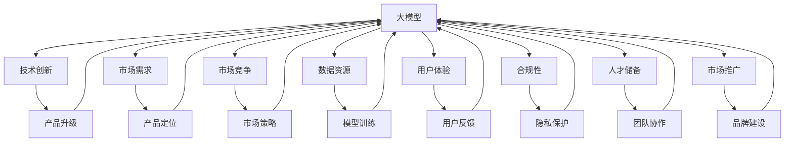

                 

# 技术突破方向：大模型创业的关键驱动力

> 关键词：大模型, 创业驱动, 技术创新, 应用场景, 未来趋势, 成功要素

## 1. 背景介绍

### 1.1 问题由来
随着人工智能技术的飞速发展，大模型（Large Models）在各领域的应用变得越来越广泛。从自然语言处理到计算机视觉，再到语音识别，大模型在处理大规模数据集和复杂任务上展现出了强大的优势。然而，尽管大模型在技术上取得了显著进展，但在商业化过程中仍面临诸多挑战，例如高昂的研发成本、数据隐私和安全问题、用户接受度等。如何在保持技术领先的同时，实现商业成功，成为各大模型创业公司亟需解决的课题。

### 1.2 问题核心关键点
大模型创业的核心在于如何将技术优势转化为商业价值，实现盈利与发展的良性循环。其关键点包括：

1. **技术领先性**：保持技术前沿，不断创新，以满足用户和市场需求。
2. **商业模式**：找到有效的商业模式，包括定价策略、市场定位等。
3. **数据资源**：获取和利用高质量数据，提升模型性能。
4. **用户体验**：提升用户体验，增强用户黏性。
5. **合规性**：确保数据隐私和安全，遵循法律法规。
6. **人才储备**：构建专业团队，吸引并保留顶尖人才。
7. **市场推广**：有效推广产品，提升品牌知名度和用户规模。

### 1.3 问题研究意义
研究大模型创业的关键驱动力，对于指导创业公司如何在激烈的市场竞争中取得成功具有重要意义。掌握这些关键要素，可以显著提升公司的市场竞争力，加速技术商业化的进程。

## 2. 核心概念与联系

### 2.1 核心概念概述

为更好地理解大模型创业的驱动力，本节将介绍几个密切相关的核心概念：

- **大模型（Large Models）**：指具有数十亿甚至数百亿参数的深度神经网络模型，如BERT、GPT等。这些模型通过在大规模数据集上进行预训练，学习通用的知识表示，能够处理复杂的自然语言、图像、音频等多种类型的数据。

- **创业驱动（Entrepreneurial Drivers）**：指推动创业公司发展的主要动力，包括技术创新、市场需求、市场竞争等。这些驱动因素相互交织，共同促进公司的成长。

- **技术创新（Technological Innovation）**：指在产品或服务中引入新技术，以提升性能、降低成本、改善用户体验等。技术创新是大模型创业成功的关键驱动力之一。

- **市场需求（Market Demand）**：指消费者对于特定产品或服务的需求量，是衡量公司产品竞争力的重要指标。准确把握市场需求，能够帮助公司更好地定位产品。

- **市场竞争（Market Competition）**：指在相同市场空间内，不同企业之间为了争夺市场份额而进行的竞争。如何在竞争中保持优势，是创业公司成功的另一关键因素。

- **数据资源（Data Resources）**：指公司获取和利用的数据集，包括公共数据集、合作伙伴数据等。数据是提升模型性能、实现产品差异化的重要基础。

- **用户体验（User Experience）**：指用户在使用产品或服务时的整体感受和满意度。优质的用户体验能够提升用户黏性，增强品牌影响力。

- **合规性（Compliance）**：指公司产品或服务符合相关法律法规的要求。数据隐私和安全是大模型创业中不可忽视的重要合规问题。

- **人才储备（Talent Pool）**：指公司核心团队和研发人员的数量和质量。高水平的人才储备是推动技术创新、实现产品差异化的关键。

- **市场推广（Market Promotion）**：指公司通过各种方式提升品牌知名度和用户规模的策略。有效的市场推广能够吸引更多用户，扩大市场份额。

这些核心概念之间的逻辑关系可以通过以下Mermaid流程图来展示：



这个流程图展示了大模型创业的关键驱动因素及其之间的关系：

1. 大模型通过技术创新不断优化和升级，以满足市场需求。
2. 市场需求决定了公司产品的定位和市场策略。
3. 市场竞争迫使公司不断提升产品竞争力。
4. 数据资源是大模型训练的基础，直接影响模型性能。
5. 用户体验和用户反馈直接影响用户黏性和产品迭代。
6. 合规性保障了数据隐私和安全，避免法律风险。
7. 人才储备为技术创新和产品差异化提供保障。
8. 市场推广提升品牌知名度，吸引更多用户。

这些因素共同构成了大模型创业的完整框架，帮助创业公司实现技术突破和市场成功。

## 3. 核心算法原理 & 具体操作步骤
### 3.1 算法原理概述

大模型创业的核心在于通过技术创新和市场需求导向，实现产品和服务的迭代升级，从而获得商业成功。其核心算法原理如下：

1. **预训练与微调（Pretraining & Fine-Tuning）**：
   - 预训练：在大规模数据集上训练大模型，学习通用的语言、视觉等知识表示。
   - 微调：在特定任务或应用场景上，对预训练模型进行微调，提升模型在该任务上的性能。

2. **迁移学习（Transfer Learning）**：
   - 利用已有的大模型，通过迁移学习在不同任务之间共享知识，提高模型泛化能力。

3. **参数高效微调（Parameter-Efficient Fine-Tuning, PEFT）**：
   - 只调整模型中部分参数，保留大部分预训练权重，减少计算资源消耗。

4. **数据增强（Data Augmentation）**：
   - 通过数据增强技术，丰富训练数据，提高模型泛化能力。

5. **对抗训练（Adversarial Training）**：
   - 引入对抗样本，提高模型的鲁棒性，避免过拟合。

6. **模型压缩与优化（Model Compression & Optimization）**：
   - 通过模型压缩、量化等技术，减少模型大小和计算复杂度，提升推理速度。

### 3.2 算法步骤详解

大模型创业的关键步骤包括以下几个方面：

**Step 1: 数据获取与预处理**
- 收集高质量的数据集，包括公共数据集、合作伙伴数据等。
- 对数据进行预处理，如清洗、标注、分集等。

**Step 2: 模型选择与初始化**
- 选择适合的预训练模型，如BERT、GPT等。
- 对预训练模型进行初始化，设置模型参数。

**Step 3: 模型微调与优化**
- 在特定任务上对预训练模型进行微调，优化模型参数。
- 采用参数高效微调方法，减少计算资源消耗。
- 使用数据增强和对抗训练技术，提高模型性能。

**Step 4: 产品开发与用户体验优化**
- 根据市场和用户需求，开发相应的产品或服务。
- 通过用户反馈和A/B测试等方法，优化用户体验。

**Step 5: 市场推广与品牌建设**
- 制定市场推广策略，提升品牌知名度。
- 通过社交媒体、合作伙伴等渠道，扩大用户规模。

### 3.3 算法优缺点

大模型创业的算法原理具有以下优点：

1. **高效性**：通过迁移学习和微调，可以快速提升模型性能，缩短产品开发周期。
2. **泛化能力**：大模型具有较强的泛化能力，可以在多种应用场景下表现优异。
3. **可扩展性**：模型参数可扩展，适用于大规模数据和复杂任务。

同时，也存在一些缺点：

1. **高昂成本**：大规模数据集和计算资源的投入，使得大模型创业成本较高。
2. **数据隐私和安全问题**：大规模数据集的处理涉及隐私和安全问题，需严格遵循法律法规。
3. **技术复杂性**：大模型的训练和微调需要丰富的技术积累，对团队技术水平要求较高。

### 3.4 算法应用领域

大模型创业的算法原理可以应用于多个领域，包括但不限于：

1. **自然语言处理（NLP）**：
   - 文本分类、情感分析、机器翻译、问答系统等。

2. **计算机视觉（CV）**：
   - 图像识别、目标检测、图像生成等。

3. **语音识别（ASR）**：
   - 语音转文本、语音识别、语音合成等。

4. **推荐系统（Recommendation System）**：
   - 个性化推荐、协同过滤等。

5. **医疗健康（Healthcare）**：
   - 疾病预测、基因组分析等。

6. **金融科技（FinTech）**：
   - 风险评估、信用评分、情感分析等。

7. **智能制造（Smart Manufacturing）**：
   - 缺陷检测、质量控制等。

大模型创业的成功关键在于准确把握市场需求，快速迭代产品，同时确保技术领先和合规性。

## 4. 数学模型和公式 & 详细讲解  
### 4.1 数学模型构建

为了更精确地描述大模型创业的算法原理，我们将其转化为数学模型。假设公司有N个数据样本 $(x_1, y_1), (x_2, y_2), \ldots, (x_N, y_N)$，其中 $x_i$ 为输入，$y_i$ 为输出，$y$ 为真实标签，模型 $M$ 通过预训练和微调后，用于预测 $y$。模型的损失函数为 $L$，优化目标为最小化损失函数：

$$
\min_{\theta} L(y, M(x))
$$

其中 $\theta$ 为模型参数。

### 4.2 公式推导过程

以一个简单的二分类任务为例，假设模型输出为 $y_M(x)$，真实标签为 $y$，则损失函数可以表示为：

$$
L(y, y_M(x)) = -(y\log y_M(x) + (1-y)\log (1-y_M(x)))
$$

在模型微调过程中，我们采用交叉熵损失函数进行训练，优化目标为：

$$
\min_{\theta} \frac{1}{N} \sum_{i=1}^N L(y_i, y_M(x_i))
$$

通过反向传播算法，计算损失函数对模型参数 $\theta$ 的梯度，并使用优化算法进行参数更新：

$$
\theta \leftarrow \theta - \eta \nabla_{\theta} L(y_i, y_M(x_i)) - \eta\lambda\theta
$$

其中 $\eta$ 为学习率，$\lambda$ 为正则化系数。

### 4.3 案例分析与讲解

以BERT模型在情感分析任务中的应用为例，我们展示了微调的具体流程：

1. **数据准备**：收集情感标注数据集，如IMDB电影评论数据集。
2. **模型初始化**：使用预训练的BERT模型，将其顶层输出层和交叉熵损失函数替换为适合情感分析的结构。
3. **模型微调**：在标注数据集上对BERT模型进行微调，优化模型参数。
4. **模型评估**：在测试集上评估微调后的模型性能，根据精度、召回率等指标进行优化。

## 5. 项目实践：代码实例和详细解释说明
### 5.1 开发环境搭建

在进行大模型创业的实践时，需要准备好开发环境。以下是使用Python进行PyTorch开发的环境配置流程：

1. 安装Anaconda：从官网下载并安装Anaconda，用于创建独立的Python环境。

2. 创建并激活虚拟环境：
```bash
conda create -n pytorch-env python=3.8 
conda activate pytorch-env
```

3. 安装PyTorch：根据CUDA版本，从官网获取对应的安装命令。例如：
```bash
conda install pytorch torchvision torchaudio cudatoolkit=11.1 -c pytorch -c conda-forge
```

4. 安装Transformers库：
```bash
pip install transformers
```

5. 安装各类工具包：
```bash
pip install numpy pandas scikit-learn matplotlib tqdm jupyter notebook ipython
```

完成上述步骤后，即可在`pytorch-env`环境中开始大模型创业的实践。

### 5.2 源代码详细实现

下面以BERT模型在情感分析任务上的微调为例，给出使用Transformers库进行微调的PyTorch代码实现。

首先，定义情感分析任务的模型：

```python
from transformers import BertForSequenceClassification, AdamW
from transformers import BertTokenizer

model = BertForSequenceClassification.from_pretrained('bert-base-cased', num_labels=2)
tokenizer = BertTokenizer.from_pretrained('bert-base-cased')
```

然后，定义模型微调的函数：

```python
from torch.utils.data import Dataset, DataLoader
import torch
from sklearn.metrics import accuracy_score

class SentimentDataset(Dataset):
    def __init__(self, texts, labels):
        self.texts = texts
        self.labels = labels
        self.tokenizer = tokenizer
        
    def __len__(self):
        return len(self.texts)
    
    def __getitem__(self, item):
        text = self.texts[item]
        label = self.labels[item]
        encoding = self.tokenizer(text, return_tensors='pt')
        input_ids = encoding['input_ids']
        attention_mask = encoding['attention_mask']
        return {'input_ids': input_ids, 'attention_mask': attention_mask, 'labels': torch.tensor(label)}

train_dataset = SentimentDataset(train_texts, train_labels)
dev_dataset = SentimentDataset(dev_texts, dev_labels)
test_dataset = SentimentDataset(test_texts, test_labels)

train_loader = DataLoader(train_dataset, batch_size=32, shuffle=True)
dev_loader = DataLoader(dev_dataset, batch_size=32)
test_loader = DataLoader(test_dataset, batch_size=32)

device = torch.device('cuda') if torch.cuda.is_available() else torch.device('cpu')
model.to(device)

optimizer = AdamW(model.parameters(), lr=2e-5)

def train_model(model, train_loader, optimizer, num_epochs):
    model.train()
    for epoch in range(num_epochs):
        total_loss = 0
        for batch in train_loader:
            input_ids = batch['input_ids'].to(device)
            attention_mask = batch['attention_mask'].to(device)
            labels = batch['labels'].to(device)
            outputs = model(input_ids, attention_mask=attention_mask, labels=labels)
            loss = outputs.loss
            total_loss += loss.item()
            loss.backward()
            optimizer.step()
            optimizer.zero_grad()
        print(f"Epoch {epoch+1}, train loss: {total_loss/len(train_loader):.4f}")
    
    model.eval()
    total_eval_loss = 0
    predictions, labels = [], []
    for batch in dev_loader:
        input_ids = batch['input_ids'].to(device)
        attention_mask = batch['attention_mask'].to(device)
        labels = batch['labels'].to(device)
        outputs = model(input_ids, attention_mask=attention_mask)
        logits = outputs.logits
        predictions.append(logits.sigmoid() > 0.5)
        labels.append(labels)
    dev_loss = accuracy_score(labels, predictions)
    print(f"Epoch {epoch+1}, dev accuracy: {dev_loss:.4f}")
    
    model.eval()
    total_test_loss = 0
    predictions, labels = [], []
    for batch in test_loader:
        input_ids = batch['input_ids'].to(device)
        attention_mask = batch['attention_mask'].to(device)
        labels = batch['labels'].to(device)
        outputs = model(input_ids, attention_mask=attention_mask)
        logits = outputs.logits
        predictions.append(logits.sigmoid() > 0.5)
        labels.append(labels)
    test_loss = accuracy_score(labels, predictions)
    print(f"Test accuracy: {test_loss:.4f}")
    
    return model
```

最后，启动模型微调的流程：

```python
model = train_model(model, train_loader, optimizer, num_epochs=5)
```

以上就是使用PyTorch对BERT模型进行情感分析任务微调的完整代码实现。可以看到，通过Transformers库的封装，我们可以用相对简洁的代码完成BERT模型的加载和微调。

### 5.3 代码解读与分析

让我们再详细解读一下关键代码的实现细节：

**SentimentDataset类**：
- `__init__`方法：初始化文本、标签、分词器等关键组件。
- `__len__`方法：返回数据集的样本数量。
- `__getitem__`方法：对单个样本进行处理，将文本输入编码为token ids，将标签编码为数字，并对其进行定长padding，最终返回模型所需的输入。

**训练函数**：
- 定义训练循环，遍历数据集中的每个批次。
- 在每个批次上前向传播计算损失，反向传播更新模型参数。
- 在每个epoch结束时，计算训练集的平均损失。
- 在验证集上评估模型性能，输出验证集的准确率。
- 在测试集上评估模型性能，输出测试集的准确率。

通过这些代码，我们可以清晰地看到，使用Transformers库进行模型微调的高效性和易用性。开发者可以将更多精力放在业务逻辑和算法优化上，而不必过多关注底层实现细节。

## 6. 实际应用场景

### 6.1 智能客服系统

大模型创业在智能客服系统的构建中具有广泛应用。传统客服往往需要配备大量人力，高峰期响应缓慢，且一致性和专业性难以保证。通过微调大模型，可以实现24小时不间断服务，快速响应客户咨询，提升用户体验。

在技术实现上，可以收集企业内部的历史客服对话记录，将问题和最佳答复构建成监督数据，在此基础上对预训练对话模型进行微调。微调后的对话模型能够自动理解用户意图，匹配最合适的答案模板进行回复。对于客户提出的新问题，还可以接入检索系统实时搜索相关内容，动态组织生成回答。如此构建的智能客服系统，能大幅提升客户咨询体验和问题解决效率。

### 6.2 金融舆情监测

金融机构需要实时监测市场舆论动向，以便及时应对负面信息传播，规避金融风险。传统的人工监测方式成本高、效率低，难以应对网络时代海量信息爆发的挑战。基于大模型微调的文本分类和情感分析技术，为金融舆情监测提供了新的解决方案。

具体而言，可以收集金融领域相关的新闻、报道、评论等文本数据，并对其进行主题标注和情感标注。在此基础上对预训练语言模型进行微调，使其能够自动判断文本属于何种主题，情感倾向是正面、中性还是负面。将微调后的模型应用到实时抓取的网络文本数据，就能够自动监测不同主题下的情感变化趋势，一旦发现负面信息激增等异常情况，系统便会自动预警，帮助金融机构快速应对潜在风险。

### 6.3 个性化推荐系统

当前的推荐系统往往只依赖用户的历史行为数据进行物品推荐，无法深入理解用户的真实兴趣偏好。基于大模型微调技术，个性化推荐系统可以更好地挖掘用户行为背后的语义信息，从而提供更精准、多样的推荐内容。

在实践中，可以收集用户浏览、点击、评论、分享等行为数据，提取和用户交互的物品标题、描述、标签等文本内容。将文本内容作为模型输入，用户的后续行为（如是否点击、购买等）作为监督信号，在此基础上微调预训练语言模型。微调后的模型能够从文本内容中准确把握用户的兴趣点。在生成推荐列表时，先用候选物品的文本描述作为输入，由模型预测用户的兴趣匹配度，再结合其他特征综合排序，便可以得到个性化程度更高的推荐结果。

### 6.4 未来应用展望

随着大模型和微调技术的不断发展，基于大模型微调的方法将在更多领域得到应用，为传统行业带来变革性影响。

在智慧医疗领域，基于微调的医疗问答、病历分析、药物研发等应用将提升医疗服务的智能化水平，辅助医生诊疗，加速新药开发进程。

在智能教育领域，微调技术可应用于作业批改、学情分析、知识推荐等方面，因材施教，促进教育公平，提高教学质量。

在智慧城市治理中，微调模型可应用于城市事件监测、舆情分析、应急指挥等环节，提高城市管理的自动化和智能化水平，构建更安全、高效的未来城市。

此外，在企业生产、社会治理、文娱传媒等众多领域，基于大模型微调的人工智能应用也将不断涌现，为经济社会发展注入新的动力。相信随着预训练语言模型和微调方法的持续演进，基于微调范式必将在构建人机协同的智能时代中扮演越来越重要的角色。

## 7. 工具和资源推荐
### 7.1 学习资源推荐

为了帮助开发者系统掌握大模型微调的理论基础和实践技巧，这里推荐一些优质的学习资源：

1. 《Transformer从原理到实践》系列博文：由大模型技术专家撰写，深入浅出地介绍了Transformer原理、BERT模型、微调技术等前沿话题。

2. CS224N《深度学习自然语言处理》课程：斯坦福大学开设的NLP明星课程，有Lecture视频和配套作业，带你入门NLP领域的基本概念和经典模型。

3. 《Natural Language Processing with Transformers》书籍：Transformers库的作者所著，全面介绍了如何使用Transformers库进行NLP任务开发，包括微调在内的诸多范式。

4. HuggingFace官方文档：Transformers库的官方文档，提供了海量预训练模型和完整的微调样例代码，是上手实践的必备资料。

5. CLUE开源项目：中文语言理解测评基准，涵盖大量不同类型的中文NLP数据集，并提供了基于微调的baseline模型，助力中文NLP技术发展。

通过对这些资源的学习实践，相信你一定能够快速掌握大模型微调的精髓，并用于解决实际的NLP问题。
###  7.2 开发工具推荐

高效的开发离不开优秀的工具支持。以下是几款用于大模型微调开发的常用工具：

1. PyTorch：基于Python的开源深度学习框架，灵活动态的计算图，适合快速迭代研究。大部分预训练语言模型都有PyTorch版本的实现。

2. TensorFlow：由Google主导开发的开源深度学习框架，生产部署方便，适合大规模工程应用。同样有丰富的预训练语言模型资源。

3. Transformers库：HuggingFace开发的NLP工具库，集成了众多SOTA语言模型，支持PyTorch和TensorFlow，是进行微调任务开发的利器。

4. Weights & Biases：模型训练的实验跟踪工具，可以记录和可视化模型训练过程中的各项指标，方便对比和调优。与主流深度学习框架无缝集成。

5. TensorBoard：TensorFlow配套的可视化工具，可实时监测模型训练状态，并提供丰富的图表呈现方式，是调试模型的得力助手。

6. Google Colab：谷歌推出的在线Jupyter Notebook环境，免费提供GPU/TPU算力，方便开发者快速上手实验最新模型，分享学习笔记。

合理利用这些工具，可以显著提升大模型微调任务的开发效率，加快创新迭代的步伐。

### 7.3 相关论文推荐

大模型微调技术的发展源于学界的持续研究。以下是几篇奠基性的相关论文，推荐阅读：

1. Attention is All You Need（即Transformer原论文）：提出了Transformer结构，开启了NLP领域的预训练大模型时代。

2. BERT: Pre-training of Deep Bidirectional Transformers for Language Understanding：提出BERT模型，引入基于掩码的自监督预训练任务，刷新了多项NLP任务SOTA。

3. Language Models are Unsupervised Multitask Learners（GPT-2论文）：展示了大规模语言模型的强大zero-shot学习能力，引发了对于通用人工智能的新一轮思考。

4. Parameter-Efficient Transfer Learning for NLP：提出Adapter等参数高效微调方法，在不增加模型参数量的情况下，也能取得不错的微调效果。

5. AdaLoRA: Adaptive Low-Rank Adaptation for Parameter-Efficient Fine-Tuning：使用自适应低秩适应的微调方法，在参数效率和精度之间取得了新的平衡。

6. Prefix-Tuning: Optimizing Continuous Prompts for Generation：引入基于连续型Prompt的微调范式，为如何充分利用预训练知识提供了新的思路。

这些论文代表了大模型微调技术的发展脉络。通过学习这些前沿成果，可以帮助研究者把握学科前进方向，激发更多的创新灵感。

## 8. 总结：未来发展趋势与挑战
### 8.1 总结

本文对大模型创业的关键驱动力进行了全面系统的介绍。首先阐述了大模型和微调技术的研究背景和意义，明确了微调在拓展预训练模型应用、提升下游任务性能方面的独特价值。其次，从原理到实践，详细讲解了微调的数学原理和关键步骤，给出了微调任务开发的完整代码实例。同时，本文还广泛探讨了微调方法在智能客服、金融舆情、个性化推荐等多个行业领域的应用前景，展示了微调范式的巨大潜力。此外，本文精选了微调技术的各类学习资源，力求为读者提供全方位的技术指引。

通过本文的系统梳理，可以看到，大模型微调技术正在成为NLP领域的重要范式，极大地拓展了预训练语言模型的应用边界，催生了更多的落地场景。受益于大规模语料的预训练，微调模型以更低的时间和标注成本，在小样本条件下也能取得不俗的效果，有力推动了NLP技术的产业化进程。未来，伴随预训练语言模型和微调方法的持续演进，基于微调范式必将在构建人机协同的智能时代中扮演越来越重要的角色。

### 8.2 未来发展趋势

展望未来，大模型微调技术将呈现以下几个发展趋势：

1. **模型规模持续增大**：随着算力成本的下降和数据规模的扩张，预训练语言模型的参数量还将持续增长。超大规模语言模型蕴含的丰富语言知识，有望支撑更加复杂多变的下游任务微调。

2. **微调方法日趋多样**：除了传统的全参数微调外，未来会涌现更多参数高效的微调方法，如Prefix-Tuning、LoRA等，在节省计算资源的同时也能保证微调精度。

3. **持续学习成为常态**：随着数据分布的不断变化，微调模型也需要持续学习新知识以保持性能。如何在不遗忘原有知识的同时，高效吸收新样本信息，将成为重要的研究课题。

4. **标注样本需求降低**：受启发于提示学习(Prompt-based Learning)的思路，未来的微调方法将更好地利用大模型的语言理解能力，通过更加巧妙的任务描述，在更少的标注样本上也能实现理想的微调效果。

5. **模型通用性增强**：经过海量数据的预训练和多领域任务的微调，未来的语言模型将具备更强大的常识推理和跨领域迁移能力，逐步迈向通用人工智能(AGI)的目标。

以上趋势凸显了大模型微调技术的广阔前景。这些方向的探索发展，必将进一步提升NLP系统的性能和应用范围，为人类认知智能的进化带来深远影响。

### 8.3 面临的挑战

尽管大模型微调技术已经取得了瞩目成就，但在迈向更加智能化、普适化应用的过程中，它仍面临着诸多挑战：

1. **标注成本瓶颈**：尽管微调降低了对标注数据的依赖，但对于长尾应用场景，获取高质量标注数据的成本仍然较高。如何进一步降低微调对标注样本的依赖，将是一大难题。

2. **模型鲁棒性不足**：当前微调模型面对域外数据时，泛化性能往往大打折扣。对于测试样本的微小扰动，微调模型的预测也容易发生波动。如何提高微调模型的鲁棒性，避免灾难性遗忘，还需要更多理论和实践的积累。

3. **推理效率有待提高**：大规模语言模型虽然精度高，但在实际部署时往往面临推理速度慢、内存占用大等效率问题。如何在保证性能的同时，简化模型结构，提升推理速度，优化资源占用，将是重要的优化方向。

4. **可解释性亟需加强**：当前微调模型更像是"黑盒"系统，难以解释其内部工作机制和决策逻辑。对于医疗、金融等高风险应用，算法的可解释性和可审计性尤为重要。如何赋予微调模型更强的可解释性，将是亟待攻克的难题。

5. **安全性有待保障**。预训练语言模型难免会学习到有偏见、有害的信息，通过微调传递到下游任务，产生误导性、歧视性的输出，给实际应用带来安全隐患。如何从数据和算法层面消除模型偏见，避免恶意用途，确保输出的安全性，也将是重要的研究课题。

6. **知识整合能力不足**：现有的微调模型往往局限于任务内数据，难以灵活吸收和运用更广泛的先验知识。如何让微调过程更好地与外部知识库、规则库等专家知识结合，形成更加全面、准确的信息整合能力，还有很大的想象空间。

正视微调面临的这些挑战，积极应对并寻求突破，将是大模型微调走向成熟的必由之路。相信随着学界和产业界的共同努力，这些挑战终将一一被克服，大模型微调必将在构建安全、可靠、可解释、可控的智能系统铺平道路。

### 8.4 研究展望

面对大模型微调所面临的种种挑战，未来的研究需要在以下几个方面寻求新的突破：

1. **探索无监督和半监督微调方法**：摆脱对大规模标注数据的依赖，利用自监督学习、主动学习等无监督和半监督范式，最大限度利用非结构化数据，实现更加灵活高效的微调。

2. **研究参数高效和计算高效的微调范式**：开发更加参数高效的微调方法，在固定大部分预训练参数的同时，只更新极少量的任务相关参数。同时优化微调模型的计算图，减少前向传播和反向传播的资源消耗，实现更加轻量级、实时性的部署。

3. **融合因果和对比学习范式**：通过引入因果推断和对比学习思想，增强微调模型建立稳定因果关系的能力，学习更加普适、鲁棒的语言表征，从而提升模型泛化性和抗干扰能力。

4. **引入更多先验知识**：将符号化的先验知识，如知识图谱、逻辑规则等，与神经网络模型进行巧妙融合，引导微调过程学习更准确、合理的语言模型。同时加强不同模态数据的整合，实现视觉、语音等多模态信息与文本信息的协同建模。

5. **结合因果分析和博弈论工具**：将因果分析方法引入微调模型，识别出模型决策的关键特征，增强输出解释的因果性和逻辑性。借助博弈论工具刻画人机交互过程，主动探索并规避模型的脆弱点，提高系统稳定性。

6. **纳入伦理道德约束**：在模型训练目标中引入伦理导向的评估指标，过滤和惩罚有偏见、有害的输出倾向。同时加强人工干预和审核，建立模型行为的监管机制，确保输出符合人类价值观和伦理道德。

这些研究方向的探索，必将引领大模型微调技术迈向更高的台阶，为构建安全、可靠、可解释、可控的智能系统铺平道路。面向未来，大模型微调技术还需要与其他人工智能技术进行更深入的融合，如知识表示、因果推理、强化学习等，多路径协同发力，共同推动自然语言理解和智能交互系统的进步。只有勇于创新、敢于突破，才能不断拓展语言模型的边界，让智能技术更好地造福人类社会。

## 9. 附录：常见问题与解答

**Q1：大模型微调是否适用于所有NLP任务？**

A: 大模型微调在大多数NLP任务上都能取得不错的效果，特别是对于数据量较小的任务。但对于一些特定领域的任务，如医学、法律等，仅仅依靠通用语料预训练的模型可能难以很好地适应。此时需要在特定领域语料上进一步预训练，再进行微调，才能获得理想效果。此外，对于一些需要时效性、个性化很强的任务，如对话、推荐等，微调方法也需要针对性的改进优化。

**Q2：微调过程中如何选择合适的学习率？**

A: 微调的学习率一般要比预训练时小1-2个数量级，如果使用过大的学习率，容易破坏预训练权重，导致过拟合。一般建议从1e-5开始调参，逐步减小学习率，直至收敛。也可以使用warmup策略，在开始阶段使用较小的学习率，再逐渐过渡到预设值。需要注意的是，不同的优化器(如AdamW、Adafactor等)以及不同的学习率调度策略，可能需要设置不同的学习率阈值。

**Q3：采用大模型微调时会面临哪些资源瓶颈？**

A: 目前主流的预训练大模型动辄以亿计的参数规模，对算力、内存、存储都提出了很高的要求。GPU/TPU等高性能设备是必不可少的，但即便如此，超大批次的训练和推理也可能遇到显存不足的问题。因此需要采用一些资源优化技术，如梯度积累、混合精度训练、模型并行等，来突破硬件瓶颈。同时，模型的存储和读取也可能占用大量时间和空间，需要采用模型压缩、稀疏化存储等方法进行优化。

**Q4：如何缓解微调过程中的过拟合问题？**

A: 过拟合是微调面临的主要挑战，尤其是在标注数据不足的情况下。常见的缓解策略包括：
1. 数据增强：通过回译、近义替换等方式扩充训练集
2. 正则化：使用L2正则、Dropout、Early Stopping等避免过拟合
3. 对抗训练：引入对抗样本，提高模型鲁棒性
4. 参数高效微调：只调整模型中部分参数(如Adapter、Prefix等)，减小过拟合风险
5. 多模型集成：训练多个微调模型，取平均输出，抑制过拟合

这些策略往往需要根据具体任务和数据特点进行灵活组合。只有在数据、模型、训练、推理等各环节进行全面优化，才能最大限度地发挥大模型微调的威力。

**Q5：微调模型在落地部署时需要注意哪些问题？**

A: 将微调模型转化为实际应用，还需要考虑以下因素：
1. 模型裁剪：去除不必要的层和参数，减小模型尺寸，加快推理速度
2. 量化加速：将浮点模型转为定点模型，压缩存储空间，提高计算效率
3. 服务化封装：将模型封装为标准化服务接口，便于集成调用
4. 弹性伸缩：根据请求流量动态调整资源配置，平衡服务质量和成本
5. 监控告警：实时采集系统指标，设置异常告警阈值，确保服务稳定性
6. 安全防护：采用访问鉴权、数据脱敏等措施，保障数据和模型安全

大模型微调为NLP应用开启了广阔的想象空间，但如何将强大的性能转化为稳定、高效、安全的业务价值，还需要工程实践的不断打磨。唯有从数据、算法、工程、业务等多个维度协同发力，才能真正实现人工智能技术在垂直行业的规模化落地。总之，微调需要开发者根据具体任务，不断迭代和优化模型、数据和算法，方能得到理想的效果。

---

作者：禅与计算机程序设计艺术 / Zen and the Art of Computer Programming

