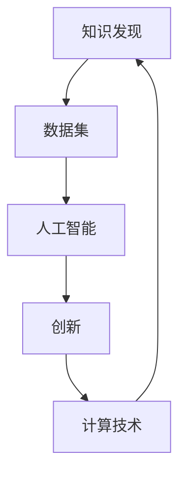

                 

## 1. 背景介绍

在过去的几十年里，计算机科学和人工智能（AI）取得了巨大的进步，从早期简单的数值计算到现今深度学习和自然语言处理技术的广泛应用，人工智能已经渗透到我们生活的方方面面。然而，在这场数字化革命中，人类计算的智力贡献不可忽视。本文旨在探讨人类在推动知识发现与创新中的作用，以及如何通过计算技术进一步促进这一过程。

### 1.1 知识发现与创新的重要性

在现代社会中，知识发现与创新是推动经济增长和社会进步的核心驱动力。从医学领域的基因组学研究到商业领域的数据分析，再到科学研究中的大数据处理，知识发现与创新无处不在。然而，仅仅依靠传统的人类智慧已经难以应对日益复杂的数据量和任务需求。计算技术的介入，特别是人工智能和机器学习的发展，为我们提供了新的工具和方法，帮助我们在海量数据中提取有价值的信息和知识，加速创新的步伐。

### 1.2 计算技术在知识发现与创新中的角色

计算技术，特别是高性能计算、云计算和人工智能技术，为知识发现与创新提供了强有力的支持。通过这些技术，我们可以处理大规模数据集，进行复杂的模拟和预测，自动化地分析和发现知识，从而加速创新过程。

本文将围绕人类计算的智力贡献，探讨如何通过计算技术推动知识发现与创新，同时也不忘强调人类智慧的价值。

## 2. 核心概念与联系

### 2.1 核心概念概述

在本节中，我们将介绍几个关键概念，这些概念是推动知识发现与创新的基础。

- **知识发现（Knowledge Discovery）**：从大量数据中提取有用知识和模式的过程。
- **创新（Innovation）**：通过发现新知识，开发新技术或方法，创造新价值的过程。
- **人工智能（Artificial Intelligence）**：模拟人类智能行为的技术，包括机器学习、自然语言处理等。
- **计算技术（Computational Technology）**：用于数据处理、模拟和分析的各种技术，如高性能计算、云计算和数据库技术。

这些概念之间的联系紧密，共同构成了知识发现与创新的技术基础。人工智能和计算技术为知识发现提供了工具和方法，而知识发现又为创新提供了基础。

### 2.2 核心概念原理和架构的 Mermaid 流程图



这个流程图展示了知识发现与创新的过程和计算技术的作用。数据集经过人工智能的分析和处理，生成新的知识，这些知识又通过计算技术进行存储和传播，最终推动创新。

## 3. 核心算法原理 & 具体操作步骤

### 3.1 算法原理概述

在知识发现与创新的过程中，算法和技术起着关键作用。本文将介绍几种核心的算法原理，这些算法和技术帮助我们在大规模数据中发现知识，推动创新。

- **机器学习（Machine Learning）**：通过训练模型从数据中学习规律和模式，实现自动化的知识发现。
- **深度学习（Deep Learning）**：利用神经网络模型进行复杂的数据处理和模式识别，广泛应用于图像识别、自然语言处理等领域。
- **自然语言处理（Natural Language Processing, NLP）**：使计算机能够理解和处理人类语言，支持文本分析和信息提取。

这些算法和技术通过数据驱动的方式，使机器能够自主地发现和分析知识，从而加速创新过程。

### 3.2 算法步骤详解

基于上述算法原理，知识发现与创新的具体操作步骤可以概括为以下几个步骤：

1. **数据收集**：收集大量的原始数据，这些数据可以来自于多种来源，如科学实验、市场数据、社交媒体等。
2. **数据清洗与预处理**：对数据进行清洗和预处理，包括数据去重、格式转换、缺失值处理等，确保数据的质量。
3. **特征提取**：从原始数据中提取有用的特征，这些特征可以是统计量、文本中的关键词、图像中的像素值等。
4. **模型训练**：使用机器学习和深度学习模型对数据进行训练，学习数据中的规律和模式。
5. **知识发现**：通过训练好的模型进行知识发现，输出有价值的信息和模式。
6. **创新应用**：将发现的知识应用于新产品、新方法的开发，推动创新。

### 3.3 算法优缺点

尽管机器学习和深度学习在知识发现与创新中发挥了巨大作用，但它们也存在一些局限性：

- **数据依赖性高**：模型需要大量的标注数据进行训练，标注数据的质量和数量直接影响模型的性能。
- **模型复杂性**：深度学习模型往往结构复杂，难以解释，容易受到过拟合的影响。
- **计算资源需求高**：训练深度学习模型需要高性能计算资源，对于资源有限的场景，计算成本较高。

### 3.4 算法应用领域

机器学习和深度学习技术已经被广泛应用于多个领域，包括：

- **医疗领域**：通过图像识别和自然语言处理技术，支持疾病诊断、药物研发等。
- **金融领域**：利用数据挖掘和预测模型，进行风险评估、投资策略优化等。
- **制造业**：采用工业物联网（IIoT）和预测性维护技术，提升生产效率和设备寿命。
- **农业**：通过遥感和图像处理技术，优化农业生产和管理。

## 4. 数学模型和公式 & 详细讲解 & 举例说明

### 4.1 数学模型构建

在本节中，我们将介绍几个常用的数学模型和公式，这些模型和公式是知识发现与创新的基础。

- **线性回归模型**：用于预测连续型变量的模型，公式为 $y = \beta_0 + \beta_1 x_1 + \beta_2 x_2 + \ldots + \beta_n x_n + \epsilon$，其中 $y$ 为预测值，$x_i$ 为自变量，$\beta_i$ 为回归系数，$\epsilon$ 为误差项。
- **决策树模型**：通过树形结构对数据进行分类，公式为 $T = \{if \ (x_1, x_2, \ldots, x_n) \in R_1 then y_1 else y_2$，其中 $R_1, R_2$ 为不同子集，$y_1, y_2$ 为不同类别。
- **卷积神经网络（CNN）**：用于图像识别和处理的深度学习模型，公式为 $f(x) = \sum_i w_i g(x_i) + b$，其中 $x_i$ 为输入层，$w_i$ 为权重，$g$ 为激活函数，$b$ 为偏置项。

### 4.2 公式推导过程

为了更好地理解这些模型的原理和应用，我们将进行一些简单的公式推导：

- **线性回归模型**：通过最小二乘法求得回归系数 $\beta_i$，公式为 $\beta_i = \frac{\sum (x_i - \bar{x}) (y_i - \bar{y})}{\sum (x_i - \bar{x})^2}$，其中 $\bar{x}$ 和 $\bar{y}$ 分别为自变量和因变量的均值。
- **决策树模型**：通过信息增益（ID3算法）选择最优特征，公式为 $Gain = Entropy_{parent} - \sum_{class} P(class|feature) \times Entropy_{class}$，其中 $Entropy$ 为信息熵，$P(class|feature)$ 为特征在类中的概率。
- **卷积神经网络**：通过反向传播算法更新权重 $w_i$，公式为 $\frac{\partial L}{\partial w_i} = \sum_i g'(x_i) (y_i - f(x))$，其中 $L$ 为损失函数，$f(x)$ 为网络输出，$g'(x_i)$ 为激活函数的导数。

### 4.3 案例分析与讲解

在本节中，我们将通过几个具体的案例，展示机器学习和深度学习在知识发现与创新中的应用：

- **医学图像分析**：使用卷积神经网络对医学影像进行分析和诊断，如CT、MRI等。
- **股票价格预测**：通过线性回归模型和支持向量机（SVM）对股票价格进行预测，为投资者提供决策依据。
- **智能客服系统**：采用自然语言处理技术，构建智能客服系统，提升客户服务体验。

## 5. 项目实践：代码实例和详细解释说明

### 5.1 开发环境搭建

在进行项目实践之前，我们需要准备好开发环境。以下是使用Python进行Keras和TensorFlow开发的环境配置流程：

1. 安装Anaconda：从官网下载并安装Anaconda，用于创建独立的Python环境。

2. 创建并激活虚拟环境：
```bash
conda create -n tf-env python=3.8 
conda activate tf-env
```

3. 安装Keras和TensorFlow：
```bash
pip install keras tensorflow
```

4. 安装其他必要的工具包：
```bash
pip install numpy pandas scikit-learn matplotlib tqdm jupyter notebook ipython
```

完成上述步骤后，即可在`tf-env`环境中开始项目实践。

### 5.2 源代码详细实现

下面我们将通过一个简单的案例，展示如何使用Keras和TensorFlow进行知识发现与创新实践：

#### 案例：医学图像分类

首先，导入必要的库和模块：

```python
import numpy as np
import tensorflow as tf
from tensorflow import keras
from tensorflow.keras import layers

from sklearn.model_selection import train_test_split
from sklearn.datasets import load_breast_cancer
from sklearn.preprocessing import StandardScaler
```

接下来，加载数据集并进行预处理：

```python
data = load_breast_cancer()
X = data.data
y = data.target
X_train, X_test, y_train, y_test = train_test_split(X, y, test_size=0.2, random_state=42)
scaler = StandardScaler()
X_train = scaler.fit_transform(X_train)
X_test = scaler.transform(X_test)
```

然后，构建卷积神经网络模型：

```python
model = keras.Sequential(
    [
        layers.Conv2D(32, 3, activation="relu"),
        layers.MaxPooling2D(),
        layers.Flatten(),
        layers.Dense(1, activation="sigmoid"),
    ]
)
```

接着，编译模型并训练：

```python
model.compile(optimizer="adam", loss="binary_crossentropy", metrics=["accuracy"])
model.fit(X_train.reshape(-1, 1, 30, 30), y_train, epochs=10, batch_size=32)
```

最后，评估模型性能：

```python
test_loss, test_acc = model.evaluate(X_test.reshape(-1, 1, 30, 30), y_test)
print(f"Test accuracy: {test_acc}")
```

### 5.3 代码解读与分析

让我们再详细解读一下关键代码的实现细节：

**医学图像分类模型**：
- `load_breast_cancer`：加载乳腺癌数据集。
- `StandardScaler`：对特征进行标准化处理。
- `train_test_split`：将数据集划分为训练集和测试集。
- `Sequential`：创建顺序模型。
- `Conv2D`：创建卷积层。
- `MaxPooling2D`：创建池化层。
- `Flatten`：将特征展平。
- `Dense`：创建全连接层。
- `compile`：编译模型。
- `fit`：训练模型。
- `evaluate`：评估模型。

**代码实现细节**：
- 首先，使用`load_breast_cancer`加载乳腺癌数据集，并存储为`X`和`y`。
- 使用`train_test_split`将数据集划分为训练集和测试集。
- 对训练集和测试集分别进行标准化处理，确保数据的一致性。
- 创建顺序模型，并添加卷积层、池化层和全连接层。
- 使用`compile`编译模型，指定优化器、损失函数和评价指标。
- 使用`fit`训练模型，指定训练集、批次大小和迭代轮数。
- 使用`evaluate`评估模型，输出测试集上的精度。

## 6. 实际应用场景

### 6.1 智能客服系统

智能客服系统是一种典型的知识发现与创新应用，通过自然语言处理技术，智能客服系统能够理解客户需求，提供个性化的服务。在传统客服系统中，客户需要等待人工服务，耗时长且服务质量难以保证。而智能客服系统能够24小时不间断服务，快速响应客户咨询，提升客户满意度。

具体而言，智能客服系统可以通过以下步骤实现：

1. **数据收集**：收集历史客户咨询记录，包括问题、回答和客户满意度等。
2. **数据清洗与预处理**：清洗和预处理数据，去除无用信息，标准化格式。
3. **特征提取**：从文本数据中提取关键词和短语，作为模型的输入特征。
4. **模型训练**：使用深度学习模型（如RNN、Transformer等）训练客户意图识别和回答生成模型。
5. **知识发现**：通过模型输出，发现客户最常问的问题和回答模式。
6. **创新应用**：根据发现的知识，优化回答模板，提升服务质量。

### 6.2 金融舆情监测

金融舆情监测是另一个重要的知识发现与创新应用。通过分析金融市场中的新闻、评论和社交媒体数据，金融舆情监测系统能够及时发现市场动向和风险信号，为投资者提供决策依据。

具体而言，金融舆情监测系统可以通过以下步骤实现：

1. **数据收集**：收集金融市场中的新闻、评论、社交媒体数据等。
2. **数据清洗与预处理**：清洗和预处理数据，去除无用信息，标准化格式。
3. **特征提取**：从文本数据中提取关键词和短语，作为模型的输入特征。
4. **模型训练**：使用深度学习模型（如LSTM、BERT等）训练舆情分析模型。
5. **知识发现**：通过模型输出，发现市场情绪和风险信号。
6. **创新应用**：根据发现的知识，调整投资策略，规避风险。

### 6.3 个性化推荐系统

个性化推荐系统是知识发现与创新的另一重要应用。通过分析用户的历史行为数据，个性化推荐系统能够发现用户的兴趣和偏好，推荐个性化的内容或产品。

具体而言，个性化推荐系统可以通过以下步骤实现：

1. **数据收集**：收集用户的历史浏览、点击、评论、分享等行为数据。
2. **数据清洗与预处理**：清洗和预处理数据，去除无用信息，标准化格式。
3. **特征提取**：从文本数据中提取关键词和短语，作为模型的输入特征。
4. **模型训练**：使用深度学习模型（如CF、协同过滤等）训练推荐模型。
5. **知识发现**：通过模型输出，发现用户的兴趣和偏好。
6. **创新应用**：根据发现的知识，推荐个性化的内容或产品。

## 7. 工具和资源推荐

### 7.1 学习资源推荐

为了帮助开发者系统掌握知识发现与创新的理论基础和实践技巧，这里推荐一些优质的学习资源：

1. 《深度学习》（Goodfellow et al.）：全面介绍了深度学习的基本原理和应用。
2. 《自然语言处理综论》（Jurafsky et al.）：介绍了自然语言处理的基础知识和最新进展。
3. 《Python数据科学手册》（Jake VanderPlas）：介绍了Python在数据科学中的应用，包括数据预处理、特征提取、模型训练等。
4. Coursera《机器学习》（Andrew Ng）：斯坦福大学开设的机器学习课程，有Lecture视频和配套作业，带你入门机器学习领域。
5. Kaggle数据科学竞赛平台：提供了大量真实世界的数据集和竞赛项目，供开发者实践和提升。

通过对这些资源的学习实践，相信你一定能够快速掌握知识发现与创新的精髓，并用于解决实际的NLP问题。

### 7.2 开发工具推荐

高效的开发离不开优秀的工具支持。以下是几款用于知识发现与创新开发的常用工具：

1. Python：Python是数据科学和机器学习的主流编程语言，具有丰富的库和工具支持。
2. TensorFlow：由Google主导开发的开源深度学习框架，生产部署方便，适合大规模工程应用。
3. Keras：高层次的深度学习API，易于上手，适合快速迭代研究。
4. Weights & Biases：模型训练的实验跟踪工具，可以记录和可视化模型训练过程中的各项指标，方便对比和调优。
5. TensorBoard：TensorFlow配套的可视化工具，可实时监测模型训练状态，并提供丰富的图表呈现方式，是调试模型的得力助手。
6. Jupyter Notebook：交互式编程环境，方便开发者记录和分享学习笔记。

合理利用这些工具，可以显著提升知识发现与创新任务的开发效率，加快创新迭代的步伐。

### 7.3 相关论文推荐

知识发现与创新领域的研究方兴未艾，以下是几篇奠基性的相关论文，推荐阅读：

1. "A Neural Probabilistic Language Model"（Hinton et al.）：提出了神经网络语言模型，推动了自然语言处理的发展。
2. "Bidirectional and Recursive Deep Neural Networks for Sequence Tagging"（Cho et al.）：提出双向循环神经网络（BiRNN），提升了序列标注的精度。
3. "Learning Phrases and Sentences for Statistical Machine Translation"（Collobert et al.）：提出基于神经网络的语言翻译模型，显著提高了翻译质量。
4. "Attention is All You Need"（Vaswani et al.）：提出了Transformer结构，开启了大规模语言模型时代。
5. "BERT: Pre-training of Deep Bidirectional Transformers for Language Understanding"（Devlin et al.）：提出BERT模型，引入基于掩码的自监督预训练任务，刷新了多项NLP任务SOTA。

这些论文代表了大语言模型和微调技术的发展脉络。通过学习这些前沿成果，可以帮助研究者把握学科前进方向，激发更多的创新灵感。

## 8. 总结：未来发展趋势与挑战

### 8.1 研究成果总结

本文对知识发现与创新的背景、核心概念和具体算法进行了详细阐述，并介绍了如何通过计算技术推动这一过程。具体步骤如下：

1. **数据收集**：收集大量的原始数据。
2. **数据清洗与预处理**：对数据进行清洗和预处理，确保数据的质量。
3. **特征提取**：从原始数据中提取有用的特征。
4. **模型训练**：使用机器学习和深度学习模型对数据进行训练，学习数据中的规律和模式。
5. **知识发现**：通过训练好的模型进行知识发现，输出有价值的信息和模式。
6. **创新应用**：将发现的知识应用于新产品、新方法的开发，推动创新。

### 8.2 未来发展趋势

展望未来，知识发现与创新领域将呈现以下几个发展趋势：

1. **自动化水平提升**：随着自动化技术的发展，越来越多的知识发现与创新过程将实现自动化，减少人力成本，提高效率。
2. **跨领域融合**：知识发现与创新将更多地与其他领域（如生物学、物理学等）进行融合，产生新的交叉学科。
3. **数据质量提升**：随着数据采集和存储技术的进步，数据的质量将得到显著提升，为知识发现与创新提供更好的基础。
4. **计算资源优化**：计算资源（如高性能计算、云计算等）的优化将进一步推动知识发现与创新的发展。
5. **多模态融合**：通过融合多模态数据（如文本、图像、语音等），提升知识发现与创新的精度和广度。

### 8.3 面临的挑战

尽管知识发现与创新取得了巨大的进展，但仍然面临诸多挑战：

1. **数据隐私和安全**：数据采集和处理过程中，如何保护用户隐私和数据安全是一个重要问题。
2. **计算资源成本**：大规模数据处理和深度学习模型训练需要高性能计算资源，成本较高。
3. **模型解释性**：深度学习模型的复杂性使得其解释性不足，难以解释决策过程。
4. **知识普适性**：知识发现与创新需要适用于多个领域和场景，但现有模型往往难以实现泛化。

### 8.4 研究展望

面对知识发现与创新面临的挑战，未来的研究需要在以下几个方面寻求新的突破：

1. **隐私保护技术**：研究隐私保护技术，确保数据在处理过程中的安全性。
2. **模型压缩与加速**：开发高效计算模型和压缩技术，降低计算资源成本。
3. **可解释性增强**：增强深度学习模型的可解释性，提高模型的可信度和可接受性。
4. **跨领域知识迁移**：研究跨领域知识迁移技术，提升模型的普适性和泛化能力。

总之，知识发现与创新是推动社会进步和经济发展的重要驱动力。通过计算技术，我们可以加速这一过程，实现更多的创新和突破。然而，这一过程中也面临着诸多挑战，需要我们共同努力，寻找新的解决方案。

## 9. 附录：常见问题与解答

**Q1: 知识发现与创新和人工智能有什么区别？**

A: 知识发现与创新是指从大量数据中提取有用知识和模式，并将这些知识应用于新产品、新方法的开发。而人工智能则是模拟人类智能行为的技术，包括机器学习、自然语言处理等，是实现知识发现与创新的工具和方法。

**Q2: 知识发现与创新需要哪些数据？**

A: 知识发现与创新需要大量的数据，包括结构化数据（如数据库、表格）和非结构化数据（如文本、图像、视频等）。这些数据可以来自于多个来源，如科学实验、市场数据、社交媒体等。

**Q3: 如何提升数据质量？**

A: 提升数据质量可以从以下几个方面入手：数据清洗、数据标注、数据增强等。数据清洗可以去除无用信息，去除重复数据等。数据标注可以为模型提供监督信号，提高模型精度。数据增强可以扩充训练集，提高模型泛化能力。

**Q4: 知识发现与创新在实际应用中有什么挑战？**

A: 知识发现与创新在实际应用中面临诸多挑战，包括数据隐私和安全、计算资源成本、模型解释性、知识普适性等。需要从技术、政策、伦理等多个方面进行综合考虑和优化。

---

作者：禅与计算机程序设计艺术 / Zen and the Art of Computer Programming

