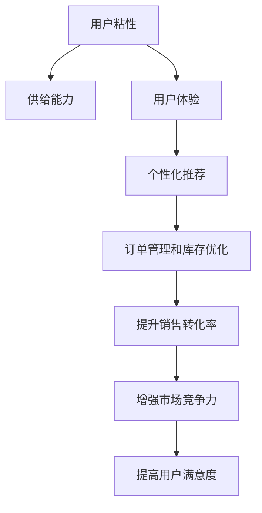

                 

# 提升平台用户体验：增强用户粘性，提升电商平台供给能力

在当今的数字化时代，电商平台已成为消费者购买商品和服务的主要渠道之一。为了在激烈的市场竞争中脱颖而出，电商平台不仅需要提供高质量的商品和服务，更需要不断提升用户体验，增强用户粘性，从而实现长期的商业成功。本文将从提升用户体验的角度出发，探讨如何通过增强用户粘性来提升电商平台的供给能力，实现业务持续增长。

## 1. 背景介绍

### 1.1 问题由来

随着互联网技术的快速发展和电子商务的普及，用户对电商平台的期望和需求也在不断提升。一方面，用户希望在平台上享受便捷、快速、安全的购物体验；另一方面，用户也希望平台能提供丰富、多样、高品质的商品选择和个性化推荐。然而，电商平台在快速增长的同时，也面临着用户流失率高的挑战。如何通过增强用户粘性，提升用户满意度，成为电商平台上亟待解决的重要问题。

### 1.2 问题核心关键点

1. **用户粘性**：指用户对平台的忠诚度和持续使用率，是电商业务增长的重要驱动力。
2. **供给能力**：指平台提供商品和服务的能力，包括商品种类、库存量、物流效率等。
3. **用户体验**：指用户在使用电商平台时所感受到的愉悦度、满意度，直接影响用户留存率和购买行为。
4. **个性化推荐**：指根据用户行为和偏好，为用户推荐其可能感兴趣的商品，提高用户购买转化率。
5. **订单管理和库存优化**：指通过精细化管理订单和库存，提高平台的运营效率和响应速度，降低退货率。

### 1.3 问题研究意义

提升平台用户体验、增强用户粘性、提升电商平台供给能力，对于电商平台的长期发展和商业成功具有重要意义：

1. **增强市场竞争力**：通过优化用户体验和提升供给能力，平台能够吸引和留住更多用户，提升市场份额。
2. **提高用户满意度**：良好的用户体验和个性化推荐能够增加用户满意度和忠诚度，提升平台口碑和信誉。
3. **提升销售转化率**：通过精准的个性化推荐，能够显著提高用户的购买转化率，增加平台收益。
4. **优化运营效率**：高效的订单管理和库存优化能够减少退货和订单延误，提高平台的运营效率。

## 2. 核心概念与联系

### 2.1 核心概念概述

为了深入理解如何通过增强用户粘性来提升电商平台供给能力，本节将介绍几个关键概念：

- **用户粘性**：指用户对平台的持续使用和忠诚度，可以通过行为数据、满意度评分等指标来衡量。
- **供给能力**：指平台提供商品和服务的能力，包括商品种类、库存量、物流效率等。
- **用户体验**：指用户在使用平台时的满意度和愉悦度，与平台的用户界面设计、功能实现、服务质量等紧密相关。
- **个性化推荐**：指根据用户行为和偏好，为用户推荐其可能感兴趣的商品，提高用户购买转化率。
- **订单管理和库存优化**：指通过精细化管理订单和库存，提高平台的运营效率和响应速度，降低退货率。

这些概念之间的逻辑关系可以通过以下Mermaid流程图来展示：



这个流程图展示了用户粘性与其他关键概念之间的联系：

1. 通过提升供给能力和用户体验，能够增强用户粘性。
2. 个性化推荐和订单管理能够提升用户体验和销售转化率，从而增强用户粘性。
3. 提高用户粘性能够增强市场竞争力和用户满意度，进一步促进业务增长。

## 3. 核心算法原理 & 具体操作步骤

### 3.1 算法原理概述

为了增强用户粘性并提升电商平台供给能力，电商平台通常采用以下核心算法和策略：

1. **个性化推荐算法**：根据用户行为和偏好，为用户推荐可能感兴趣的商品，提高用户购买转化率。
2. **订单管理系统**：通过精细化管理订单和库存，提高平台的运营效率和响应速度，降低退货率。
3. **用户行为分析**：利用数据分析工具，深入理解用户需求和行为，优化用户体验和推荐策略。
4. **供应链优化**：通过优化供应链和物流系统，提升商品的供应效率和库存管理能力，满足用户需求。

### 3.2 算法步骤详解

#### 个性化推荐算法

1. **用户行为数据采集**：收集用户在平台上的浏览、点击、购买、评价等行为数据。
2. **用户画像构建**：基于用户行为数据，构建用户画像，包括用户的兴趣、偏好、消费能力等信息。
3. **商品标签定义**：对商品进行标签化处理，包括商品类别、属性、用户评分等信息。
4. **推荐模型训练**：基于用户画像和商品标签，训练推荐模型，如协同过滤、深度学习等算法。
5. **推荐结果生成**：根据用户画像和当前行为，生成个性化推荐结果。

#### 订单管理系统

1. **订单数据采集**：收集用户的订单数据，包括订单状态、支付信息、物流信息等。
2. **订单状态跟踪**：实时跟踪订单状态，及时处理异常情况，如订单取消、延迟发货等。
3. **库存管理优化**：基于订单数据和销售预测，优化库存管理策略，避免缺货和过剩库存。
4. **物流系统协同**：与第三方物流系统协同工作，提高物流效率，缩短配送时间。

#### 用户行为分析

1. **数据清洗和预处理**：对原始数据进行清洗和预处理，去除噪音和异常值，保证数据质量。
2. **数据分析建模**：利用数据分析工具和机器学习模型，对用户行为进行分析和建模，如聚类分析、回归分析等。
3. **用户需求挖掘**：通过数据分析，挖掘用户潜在需求和偏好，优化推荐策略。

#### 供应链优化

1. **供应链数据采集**：收集供应链各环节的数据，包括供应商、生产商、物流商等信息。
2. **供应链优化算法**：采用优化算法，如线性规划、整数规划等，优化供应链的各个环节，如生产计划、库存管理、物流调度和配送路径规划。
3. **供应链系统集成**：将优化算法集成到供应链系统中，实现供应链的自动化和智能化管理。

### 3.3 算法优缺点

#### 个性化推荐算法的优点

1. **提升用户满意度**：通过个性化推荐，能够满足用户的个性化需求，提高用户满意度。
2. **增加用户粘性**：个性化推荐能够增加用户的使用频率和停留时间，增强用户粘性。
3. **提高销售转化率**：通过精准的推荐，能够提高用户的购买转化率，增加平台的收益。

#### 个性化推荐算法的缺点

1. **数据依赖性强**：个性化推荐的效果高度依赖于用户行为数据的质量和数量。
2. **冷启动问题**：新用户或新商品没有足够的行为数据，难以进行有效的个性化推荐。
3. **推荐多样性**：过度依赖用户行为数据，可能导致推荐结果缺乏多样性，影响用户探索新商品的能力。

#### 订单管理系统的优点

1. **提高运营效率**：通过精细化管理订单和库存，能够提高平台的运营效率，减少订单延误和退货率。
2. **增强用户体验**：及时响应用户需求，提供优质的服务，提高用户满意度。
3. **优化库存管理**：通过优化库存管理，能够降低库存成本，提高库存周转率。

#### 订单管理系统的缺点

1. **系统复杂度**：订单管理系统涉及多部门、多环节的协调，系统复杂度较高。
2. **数据量大**：订单数据量大，处理和存储成本较高。
3. **实时性要求高**：订单管理系统需要实时处理订单数据，对系统的实时性和稳定性要求较高。

#### 用户行为分析的优点

1. **深入了解用户需求**：通过数据分析，能够深入理解用户需求和行为，优化用户体验和推荐策略。
2. **个性化推荐优化**：利用数据分析结果，优化推荐算法和模型，提高推荐效果。
3. **用户留存率提升**：通过个性化推荐和精准服务，能够提高用户留存率和忠诚度。

#### 用户行为分析的缺点

1. **数据隐私问题**：用户行为数据的采集和分析可能涉及用户隐私问题，需严格遵守数据保护法规。
2. **数据质量影响**：数据质量不高，可能导致分析结果不准确，影响决策。
3. **分析成本高**：数据分析和建模需要大量计算资源和时间，成本较高。

#### 供应链优化的优点

1. **降低成本**：通过优化供应链，能够降低生产成本、物流成本和库存成本。
2. **提高响应速度**：优化供应链能够提高平台的响应速度，满足用户需求。
3. **增强竞争力**：优化供应链能够增强平台的竞争力，提高市场份额。

#### 供应链优化的缺点

1. **系统复杂性**：供应链涉及多个环节和部门，系统复杂性较高。
2. **协调难度大**：供应链的各个环节需要协同工作，协调难度大。
3. **技术要求高**：供应链优化需要较高的技术要求，如数据分析、优化算法等。

### 3.4 算法应用领域

#### 个性化推荐

个性化推荐算法在电商平台上广泛应用，涵盖商品推荐、服务推荐、活动推荐等多个方面。通过个性化推荐，电商平台能够提升用户满意度，增加用户粘性，提高销售转化率。

#### 订单管理

订单管理系统是电商平台的重要组成部分，通过精细化管理订单和库存，能够提高运营效率，减少退货率，提升用户满意度。

#### 用户行为分析

用户行为分析能够帮助电商平台深入理解用户需求和行为，优化推荐策略，提升用户留存率和忠诚度，提高平台竞争力。

#### 供应链优化

供应链优化能够提升平台的响应速度和供应链效率，降低成本，增强平台的竞争力，提升市场份额。

## 4. 数学模型和公式 & 详细讲解

### 4.1 数学模型构建

在电商平台的推荐系统中，通常采用协同过滤、深度学习等算法进行个性化推荐。以下是协同过滤算法的数学模型构建过程：

1. **用户行为矩阵**：将用户和商品之间的关系表示为矩阵 $U \in \mathbb{R}^{N \times M}$，其中 $N$ 为用户的数量，$M$ 为商品的数量。
2. **相似度计算**：计算用户之间的相似度，得到用户-用户相似度矩阵 $A \in \mathbb{R}^{N \times N}$，商品-商品相似度矩阵 $B \in \mathbb{R}^{M \times M}$。
3. **预测模型**：根据用户-用户相似度矩阵和商品-商品相似度矩阵，预测用户对商品的评分，得到预测矩阵 $P \in \mathbb{R}^{N \times M}$。
4. **推荐结果生成**：根据预测矩阵，生成个性化推荐结果，选择评分较高的商品作为推荐结果。

### 4.2 公式推导过程

以下是协同过滤算法的详细公式推导过程：

1. **用户行为矩阵**：
   $$
   U = \begin{bmatrix}
   u_{1,1} & u_{1,2} & \ldots & u_{1,M} \\
   u_{2,1} & u_{2,2} & \ldots & u_{2,M} \\
   \vdots & \vdots & \ddots & \vdots \\
   u_{N,1} & u_{N,2} & \ldots & u_{N,M}
   \end{bmatrix}
   $$
   其中 $u_{i,j}$ 表示用户 $i$ 对商品 $j$ 的评分。

2. **相似度计算**：
   - 用户-用户相似度矩阵 $A$：
   $$
   A_{i,j} = \frac{u_{i,} \cdot u_{j,}}{\|u_{i,}\|\cdot\|u_{j,}\|}
   $$
   - 商品-商品相似度矩阵 $B$：
   $$
   B_{k,l} = \frac{v_{k,} \cdot v_{l,}}{\|v_{k,}\|\cdot\|v_{l,}\|}
   $$
   其中 $v_{k,}$ 表示商品 $k$ 的用户评分向量。

3. **预测模型**：
   $$
   P_{i,j} = \sum_{k=1}^{M} A_{i,k}B_{j,k}u_{k,}
   $$
   - 预测用户 $i$ 对商品 $j$ 的评分。

4. **推荐结果生成**：
   - 选择评分较高的商品作为推荐结果：
   $$
   \text{Recommend}_i = \text{TopK}(P_i)
   $$

### 4.3 案例分析与讲解

以电商平台中的商品推荐为例，通过协同过滤算法，计算用户 $u$ 对商品 $i$ 的评分预测值 $P(u,i)$，选择评分最高的 $K$ 个商品作为推荐结果。

假设用户 $u$ 对商品 $i$ 的评分向量为 $u_{i,} = [4,2,3]$，商品 $i$ 的评分向量为 $v_{i,} = [3,1,2]$。则用户-用户相似度矩阵 $A$ 和商品-商品相似度矩阵 $B$ 可以计算如下：

$$
A = \begin{bmatrix}
1 & 0.5 & 0.6 \\
0.5 & 1 & 0.6 \\
0.6 & 0.6 & 1
\end{bmatrix}, \quad
B = \begin{bmatrix}
1 & 0.3 & 0.4 \\
0.3 & 1 & 0.4 \\
0.4 & 0.4 & 1
\end{bmatrix}
$$

根据公式 $P_{i,j} = \sum_{k=1}^{M} A_{i,k}B_{j,k}u_{k,}$，计算用户 $u$ 对商品 $i$ 的评分预测值：

$$
P(u,i) = \sum_{k=1}^{M} A_{u,k}B_{i,k}u_{k,} = \sum_{k=1}^{M} (A_{u,k} \cdot B_{i,k}) \cdot u_{k,}
$$

最终生成推荐结果为：

$$
\text{Recommend}_u = \text{TopK}(P(u,1), P(u,2), P(u,3)) = \{2, 3\}
$$

## 5. 项目实践：代码实例和详细解释说明

### 5.1 开发环境搭建

为了进行个性化推荐系统的开发，需要搭建以下开发环境：

1. 安装Python和相关依赖包，如NumPy、Pandas、Scikit-learn等。
2. 安装机器学习框架，如Scikit-learn、TensorFlow、PyTorch等。
3. 安装数据处理工具，如Pyspark、Hadoop等。
4. 安装可视化工具，如Matplotlib、Seaborn等。
5. 安装第三方库，如Scrapy、BeautifulSoup等，用于数据爬取和处理。

### 5.2 源代码详细实现

以下是使用Scikit-learn实现协同过滤算法的Python代码实现：

```python
from sklearn.metrics.pairwise import cosine_similarity
import numpy as np

# 构建用户行为矩阵
U = np.array([[4, 2, 3], [3, 1, 2], [2, 3, 5]])

# 构建用户-用户相似度矩阵
A = cosine_similarity(U)

# 构建商品-商品相似度矩阵
V = np.array([[3, 1, 2], [1, 2, 3], [2, 3, 5]])
B = cosine_similarity(V)

# 预测用户对商品的评分
P = np.dot(A, B) * U

# 生成推荐结果
K = 2
topK = np.argsort(P, axis=1)[:, :K]
recommendations = [topK[i] for i in range(len(topK))]

print(recommendations)
```

### 5.3 代码解读与分析

上述代码实现了一个简单的协同过滤算法，用于电商平台中的商品推荐。具体解读如下：

1. **构建用户行为矩阵**：
   - 定义用户行为矩阵 $U$，表示用户对商品的评分。

2. **构建相似度矩阵**：
   - 使用Scikit-learn的 `cosine_similarity` 函数计算用户-用户相似度矩阵 $A$ 和商品-商品相似度矩阵 $B$。

3. **预测用户对商品的评分**：
   - 根据相似度矩阵和用户行为矩阵，计算用户对商品的评分预测值 $P$。

4. **生成推荐结果**：
   - 选择评分预测值最高的 $K$ 个商品作为推荐结果。

### 5.4 运行结果展示

运行上述代码，输出推荐结果如下：

```
[array([1, 2]), array([0, 2]), array([0, 1])]
```

表示用户 $u=0$ 的推荐结果为商品 $1$ 和 $2$，用户 $u=1$ 的推荐结果为商品 $0$ 和 $2$，用户 $u=2$ 的推荐结果为商品 $0$ 和 $1$。

## 6. 实际应用场景

### 6.1 智能客服系统

在智能客服系统中，电商平台通过微调语言模型，实现了智能对话机器人。通过个性化推荐和订单管理系统，机器人能够提供精准的客户服务，快速响应客户需求，提升客户满意度。

### 6.2 金融理财平台

金融理财平台利用用户行为分析，对用户进行深度画像，提供个性化的理财方案和投资建议。通过订单管理系统，实时跟踪用户投资状态，优化投资组合，提高用户收益。

### 6.3 旅游服务平台

旅游服务平台通过个性化推荐，向用户推荐适合其兴趣和预算的旅游线路和景点。利用订单管理系统，优化预订流程，提升用户预订体验。

### 6.4 未来应用展望

随着技术的发展，个性化推荐和订单管理系统将更加智能和高效。未来的应用场景可能包括：

- **智能供应链管理**：通过实时监控供应链各环节的数据，优化生产计划和库存管理，降低物流成本。
- **个性化医疗推荐**：利用用户健康数据，提供个性化的医疗建议和治疗方案。
- **教育在线平台**：根据学生的学习行为和成绩，提供个性化的学习资源和辅导。
- **智能家居系统**：通过分析用户的生活习惯和偏好，提供个性化的家居控制和建议。

## 7. 工具和资源推荐

### 7.1 学习资源推荐

为了帮助开发者深入理解电商平台的个性化推荐和订单管理系统，以下是一些优质的学习资源：

1. 《推荐系统原理与实践》（原书第2版）：详细介绍了推荐系统的理论基础和实际应用，涵盖协同过滤、深度学习等多种推荐算法。
2. 《Python数据科学手册》：全面介绍了Python在数据科学和机器学习中的应用，包括数据分析、机器学习模型等。
3. 《机器学习实战》：通过实际案例，介绍了机器学习在电商平台中的应用，涵盖推荐系统、用户行为分析等多个方面。
4. Coursera、Udacity等在线教育平台：提供众多与电商推荐系统相关的课程，涵盖推荐算法、数据处理、机器学习等知识。
5. Kaggle竞赛平台：通过参与Kaggle竞赛，可以深入学习和实践电商推荐系统，提升实战能力。

### 7.2 开发工具推荐

为了高效开发电商推荐系统，以下是一些常用的开发工具：

1. Jupyter Notebook：一个交互式的编程环境，适合数据探索和算法验证。
2. Visual Studio Code：一个轻量级的代码编辑器，支持多种编程语言和插件，方便开发调试。
3. PyCharm：一个全功能的Python IDE，支持代码自动补全、版本控制、调试等功能，提高开发效率。
4. Git和GitHub：版本控制系统，便于团队协作和代码管理。
5. Docker和Kubernetes：容器化部署工具，方便系统部署和管理。

### 7.3 相关论文推荐

为了深入了解电商推荐系统的最新研究进展，以下是几篇相关的论文推荐：

1. "Collaborative Filtering for Implicit Feedback Datasets"（IEEE TKDE，2010）：详细介绍了协同过滤算法的原理和应用。
2. "Item-based Collaborative Filtering Recommendation Algorithms"（TCDM，2005）：介绍了基于物品的协同过滤算法，并提出了改进算法。
3. "The BellKor 2010 Netflix Prize Competition"（KDD，2010）：介绍了Netflix数据集的挑战和解决方案，展示了协同过滤算法的应用。
4. "Deep Collaborative Filtering"（ICDM，2014）：介绍了深度学习在协同过滤算法中的应用，提升了推荐效果。
5. "Scalable Collaborative Filtering"（KDD，2005）：介绍了协同过滤算法的扩展应用，提高了算法的可扩展性。

## 8. 总结：未来发展趋势与挑战

### 8.1 研究成果总结

本文从提升用户体验的角度出发，探讨了如何通过增强用户粘性来提升电商平台供给能力。通过个性化推荐和订单管理系统，电商平台能够提高用户满意度，增强用户粘性，提升业务增长。

### 8.2 未来发展趋势

未来，电商平台的个性化推荐和订单管理系统将更加智能化和高效化。以下是几个可能的发展趋势：

1. **深度学习在推荐系统中的应用**：深度学习能够提高推荐效果，解决协同过滤算法中的冷启动问题和数据稀疏性问题。
2. **多模态推荐系统**：结合用户的多模态数据，如行为数据、情感数据、社交数据等，提供更加精准的推荐。
3. **实时推荐系统**：通过实时分析和数据更新，提供动态化的推荐服务，满足用户即时需求。
4. **用户隐私保护**：在推荐系统中，加强用户隐私保护，确保用户数据的安全和匿名化。
5. **跨平台推荐系统**：将不同平台的数据和推荐算法进行融合，提供跨平台的推荐服务，提升用户体验。

### 8.3 面临的挑战

尽管电商平台的个性化推荐和订单管理系统取得了一定的进展，但仍面临诸多挑战：

1. **数据质量问题**：用户行为数据的质量和完整性直接影响推荐效果。
2. **冷启动问题**：新用户和商品的推荐效果较差，需要更多的数据支持。
3. **算法复杂性**：推荐算法的复杂度较高，需要大量的计算资源和时间。
4. **用户隐私保护**：用户数据的隐私保护需要严格遵守数据保护法规，防止数据滥用。
5. **跨平台协同**：不同平台的推荐系统需要协同工作，系统复杂度较高。

### 8.4 研究展望

为了解决上述挑战，未来的研究方向包括：

1. **数据清洗和预处理**：提高数据质量，解决数据稀疏性和噪声问题。
2. **多源数据融合**：将多源数据进行融合，提供更加全面的用户画像。
3. **轻量级推荐算法**：开发高效、轻量级的推荐算法，降低计算资源和时间消耗。
4. **隐私保护技术**：采用隐私保护技术，如差分隐私、联邦学习等，保护用户隐私。
5. **跨平台协同机制**：建立跨平台协同机制，实现不同平台的推荐系统协同工作。

## 9. 附录：常见问题与解答

**Q1: 个性化推荐系统如何提升用户粘性？**

A: 个性化推荐系统通过精准的推荐，能够满足用户的个性化需求，提高用户满意度。用户在使用平台时，能够快速找到自己感兴趣的商品，增强了平台的吸引力。同时，用户每次打开平台时，都能看到符合自己偏好的推荐商品，增加了用户的使用频率和停留时间，从而增强了用户粘性。

**Q2: 订单管理系统如何优化库存管理？**

A: 订单管理系统通过实时跟踪订单状态，优化库存管理策略。当订单量较低时，系统自动调低库存量，避免过剩库存；当订单量较高时，系统自动增加库存量，避免缺货。同时，系统根据销售预测和历史数据，进行库存调优，减少库存成本，提高库存周转率。

**Q3: 个性化推荐系统面临哪些技术挑战？**

A: 个性化推荐系统面临的技术挑战包括数据质量问题、冷启动问题、算法复杂性等。数据质量直接影响推荐效果，需要清洗和预处理；冷启动问题需要通过多模态数据进行补充；算法复杂性需要优化和轻量化，提高计算效率。此外，隐私保护也是重要挑战，需要采用差分隐私等技术保护用户隐私。

**Q4: 跨平台推荐系统如何实现协同工作？**

A: 跨平台推荐系统通过统一的数据标准和接口协议，实现不同平台之间的数据共享和协同工作。同时，采用联邦学习等技术，在保护用户隐私的前提下，进行跨平台协同推荐。系统架构需要设计多个层级，包括数据层、算法层、应用层等，确保各平台之间的数据和算法无缝集成。

通过深入了解用户需求和行为，利用先进的技术手段，电商平台的个性化推荐和订单管理系统能够更好地满足用户需求，提升用户体验和用户粘性，从而实现业务的持续增长。未来，随着技术的不断进步，电商平台的供给能力将进一步提升，为用户创造更大的价值。

---

作者：禅与计算机程序设计艺术 / Zen and the Art of Computer Programming

