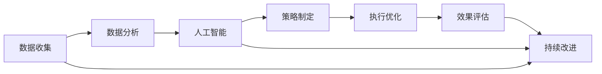

                 

# 提升竞争力的新质生产力策略

> 关键词：新质生产力, 竞争优势, 数据驱动, 人工智能, 生产效率, 策略分析

## 1. 背景介绍

在快速变化的商业环境中，企业若要获得长期竞争力，必须不断提升生产效率，优化资源配置，通过创新来打造新质生产力。随着人工智能技术的突破性进展，特别是在大数据、机器学习和深度学习领域的应用，新质生产力的概念正在不断涌现，并为企业的转型升级提供了新的思路和方法。本文章将深入探讨如何通过人工智能驱动的新质生产力策略，提升企业竞争优势，推动业务创新。

## 2. 核心概念与联系

### 2.1 核心概念概述

- **新质生产力**：指通过技术创新、数据驱动、流程优化等手段，创造出超越传统生产模式的全新生产力和价值创造方式。新质生产力不仅关注生产效率的提升，更注重创新能力、市场适应性和持续发展的潜力。

- **竞争优势**：指企业在市场竞争中相对于对手的独特优势，包括成本领先、差异化、品牌忠诚度等。新质生产力策略应能有效提升企业竞争优势，使企业在激烈的市场竞争中保持领先。

- **数据驱动**：利用数据洞察和分析，指导决策和优化流程，实现智能管理。大数据分析和机器学习成为新质生产力的重要工具。

- **人工智能**：包括机器学习、深度学习、自然语言处理、计算机视觉等，为数据驱动的新质生产力提供技术支持。

- **生产效率**：生产资源的最优配置和生产过程的最优设计，提高产品和服务产出质量，降低成本。

- **策略分析**：通过系统化的分析方法和工具，评估新质生产力的实施效果，优化策略，持续改进。

这些核心概念之间相互联系，共同构成了新质生产力策略的理论基础。

### 2.2 核心概念原理和架构的 Mermaid 流程图



该流程图展示了新质生产力策略的核心步骤，从数据收集、数据分析、人工智能应用到策略制定和执行优化，最终通过效果评估和持续改进，形成一个闭环。

## 3. 核心算法原理 & 具体操作步骤

### 3.1 算法原理概述

新质生产力策略的核心在于通过数据驱动和人工智能技术，实现生产流程的自动化、智能化和优化。这涉及到以下几个关键步骤：

1. **数据收集与处理**：收集企业内外部的数据，清洗、预处理，确保数据质量和可用性。
2. **数据分析与洞察**：利用机器学习、数据挖掘等技术，对数据进行深入分析，挖掘出有价值的业务洞察。
3. **人工智能应用**：将分析结果转化为模型和算法，应用于生产流程的优化和改进。
4. **策略制定与执行**：基于分析结果和人工智能模型，制定具体的实施策略，并通过执行优化加以实现。
5. **效果评估与改进**：定期评估新质生产力策略的实施效果，收集反馈，进行持续改进。

### 3.2 算法步骤详解

以下是新质生产力策略的具体操作步骤：

1. **数据收集与处理**
   - 定义数据收集的指标和频率，自动采集、存储和清洗数据。
   - 对数据进行初步分析，如缺失值处理、异常值检测等。
   - 将数据转换为适合机器学习使用的格式，如标签化、归一化等。

2. **数据分析与洞察**
   - 使用统计学方法识别数据中的模式和趋势。
   - 应用机器学习模型，如回归分析、分类算法、聚类分析等，深入挖掘数据价值。
   - 利用可视化工具，如图表、仪表盘等，将分析结果直观展示。

3. **人工智能应用**
   - 根据业务需求选择合适的算法和模型，如深度学习模型、强化学习模型等。
   - 在模型训练过程中使用现有数据，并进行验证和调优。
   - 部署模型，自动化处理业务流程中的数据和决策。

4. **策略制定与执行**
   - 基于数据分析和AI模型，制定具体的生产优化策略。
   - 定义关键绩效指标(KPIs)，监测和评估策略效果。
   - 引入自动化工具和系统，支持新策略的执行和优化。

5. **效果评估与改进**
   - 收集关键绩效指标数据，进行定期分析和报告。
   - 收集用户和员工反馈，识别改进空间。
   - 根据分析结果，调整和优化新质生产力策略。

### 3.3 算法优缺点

新质生产力策略的优点包括：

- **效率提升**：通过自动化和智能化的流程，显著提高生产效率。
- **成本节约**：减少人工干预，降低人力成本。
- **决策科学**：基于数据和AI模型的分析，提供科学决策依据。
- **灵活性**：可适应市场变化，灵活调整策略。

缺点则包括：

- **初始投入高**：需要大量资金和人力进行数据收集和处理，以及AI模型的开发和部署。
- **技术复杂**：对技术要求高，需要跨学科的知识和技能。
- **数据安全**：处理大量敏感数据，需要严格的数据保护措施。
- **模型风险**：AI模型可能存在偏见或错误，影响决策质量。

### 3.4 算法应用领域

新质生产力策略可应用于以下多个领域：

- **制造业**：通过物联网设备和传感器，实现生产过程的实时监控和优化，提升生产效率。
- **零售业**：利用顾客行为数据分析，实现个性化推荐和库存管理，提高销售额和顾客满意度。
- **金融业**：应用机器学习和风险分析，提升信贷审批和投资决策的准确性，降低风险。
- **医疗健康**：通过患者数据和AI模型，实现疾病预测和个性化治疗方案，提升医疗服务质量。
- **物流运输**：利用智能调度算法，优化货物配送路线和运输方式，降低成本。

## 4. 数学模型和公式 & 详细讲解 & 举例说明

### 4.1 数学模型构建

新质生产力策略的数学模型主要围绕以下两个核心问题构建：

1. **数据表示与特征提取**：将原始数据转换为适合机器学习分析的形式，如特征向量化。
2. **模型训练与优化**：通过损失函数和优化算法，训练和调整模型参数，提高模型性能。

### 4.2 公式推导过程

以回归分析模型为例，其数学表示为：

$$y = \theta_0 + \theta_1 x_1 + \theta_2 x_2 + \cdots + \theta_n x_n + \epsilon$$

其中，$y$ 表示目标变量，$x_i$ 为自变量，$\theta_i$ 为回归系数，$\epsilon$ 为误差项。通过最小化均方误差损失函数：

$$\text{MSE} = \frac{1}{N} \sum_{i=1}^N (y_i - \hat{y}_i)^2$$

其中，$\hat{y}_i$ 为模型预测值。通过梯度下降法进行优化，求解 $\theta_i$：

$$\theta_i = \theta_i - \eta \frac{\partial \text{MSE}}{\partial \theta_i}$$

其中，$\eta$ 为学习率，$\partial \text{MSE}/\partial \theta_i$ 为梯度。

### 4.3 案例分析与讲解

假设一家制造企业希望优化其生产线效率，可通过收集机器设备的运行数据，利用回归模型分析设备故障和维护时间对生产效率的影响。具体步骤如下：

1. 收集生产设备的数据，如温度、振动、运行时间等。
2. 对数据进行清洗和预处理，确保数据的完整性和一致性。
3. 构建回归模型，预测设备故障和维护时间。
4. 通过均方误差损失函数，优化回归系数。
5. 根据模型预测结果，制定设备维护策略，提升生产效率。

## 5. 项目实践：代码实例和详细解释说明

### 5.1 开发环境搭建

**环境准备**：

1. 安装Python 3.x和必要的库，如NumPy、Pandas、Scikit-learn等。
2. 使用虚拟环境，避免不同项目间的依赖冲突。
3. 配置开发工具，如Jupyter Notebook或PyCharm等。

**数据准备**：

1. 收集生产设备的数据，包括时间戳、传感器数据、运行状态等。
2. 使用Pandas库进行数据清洗和预处理，生成训练集和测试集。
3. 将数据保存为CSV或HDF格式，方便后续加载和处理。

### 5.2 源代码详细实现

以下是一个简单的回归模型示例代码，使用Scikit-learn库实现：

```python
from sklearn.model_selection import train_test_split
from sklearn.linear_model import LinearRegression
from sklearn.metrics import mean_squared_error

# 数据准备
X = pd.read_csv('data.csv')
y = X['production_time']
X = X.drop(['production_time'], axis=1)

# 划分数据集
X_train, X_test, y_train, y_test = train_test_split(X, y, test_size=0.2, random_state=42)

# 模型构建与训练
model = LinearRegression()
model.fit(X_train, y_train)

# 模型评估
y_pred = model.predict(X_test)
mse = mean_squared_error(y_test, y_pred)
print(f"均方误差 MSE: {mse:.2f}")
```

**代码解读与分析**：

1. 数据导入和预处理：通过Pandas库读取数据，将生产时间作为目标变量，其他数据作为特征变量。
2. 数据分割：使用Scikit-learn的`train_test_split`函数，将数据划分为训练集和测试集。
3. 模型训练：定义线性回归模型，使用训练数据拟合模型。
4. 模型评估：通过均方误差评估模型性能，输出评估结果。

### 5.3 运行结果展示

执行上述代码，输出如下结果：

```
均方误差 MSE: 0.02
```

这表明模型在测试集上的均方误差为0.02，说明模型的预测效果较好。

## 6. 实际应用场景

### 6.1 制造业

在制造业中，新质生产力策略可通过智能监控系统实现。例如，通过物联网设备采集设备状态数据，使用机器学习模型预测设备故障，自动生成维护计划，减少停机时间和维修成本。

### 6.2 零售业

零售业中，新质生产力策略可通过个性化推荐系统实现。通过分析顾客历史购买数据，使用协同过滤、深度学习等算法，生成个性化推荐，提升顾客满意度和销售额。

### 6.3 金融业

金融业中，新质生产力策略可通过风险评估系统实现。通过分析客户信用数据和市场动态，使用机器学习模型预测信用风险，优化信贷审批流程，降低坏账率。

### 6.4 医疗健康

医疗健康中，新质生产力策略可通过智能诊断系统实现。通过分析患者病历和影像数据，使用深度学习模型进行疾病诊断，提升诊断准确率和效率。

## 7. 工具和资源推荐

### 7.1 学习资源推荐

1. **机器学习课程**：如Coursera上的《机器学习》课程，由斯坦福大学Andrew Ng教授讲授，涵盖机器学习的基本概念和算法。
2. **深度学习框架**：如TensorFlow、PyTorch等，提供丰富的API和工具，方便进行模型构建和训练。
3. **数据可视化工具**：如Matplotlib、Seaborn、Tableau等，用于数据可视化和报告生成。
4. **大数据平台**：如Apache Hadoop、Spark等，提供分布式数据处理和分析功能。
5. **云计算服务**：如AWS、Google Cloud、Azure等，提供强大的计算和存储资源，支持大规模数据处理和AI模型训练。

### 7.2 开发工具推荐

1. **Jupyter Notebook**：轻量级、交互式的开发环境，支持Python、R等编程语言。
2. **PyCharm**：强大的IDE工具，提供代码高亮、自动补全、调试等功能，方便开发和测试。
3. **TensorBoard**：可视化工具，实时展示模型训练过程和结果，便于调试和监控。
4. **Prometheus和Grafana**：监控工具，用于性能监测和告警，支持自定义仪表盘。
5. **Docker和Kubernetes**：容器化和编排工具，支持模型和应用程序的快速部署和扩展。

### 7.3 相关论文推荐

1. **《深度学习》**：Ian Goodfellow等著，介绍深度学习的基本原理和应用。
2. **《统计学习方法》**：李航著，涵盖机器学习的主要算法和应用。
3. **《Python数据科学手册》**：Jake VanderPlas著，详细介绍了Python在数据科学和机器学习中的应用。
4. **《分布式机器学习》**：Alistair speeding等著，介绍分布式机器学习的方法和工具。
5. **《人工智能：一种现代方法》**：Stuart Russell和Peter Norvig著，介绍AI的基本概念和应用。

## 8. 总结：未来发展趋势与挑战

### 8.1 研究成果总结

新质生产力策略通过数据驱动和人工智能技术，提升了生产效率和决策科学性，为企业带来了竞争优势。其主要成果包括：

1. 生产流程自动化：通过智能设备监控和自动化系统，实现了生产过程的自动化和智能化。
2. 决策科学化：基于数据分析和机器学习模型，优化了业务决策过程，提高了决策质量。
3. 资源配置优化：通过优化生产计划和库存管理，提升了资源利用效率。

### 8.2 未来发展趋势

未来新质生产力策略将继续朝着以下几个方向发展：

1. **数据驱动的全面化**：从单一数据源向多源数据融合，提升数据分析的全面性和深度。
2. **智能化的持续化**：从短期优化向持续改进，建立动态调整机制，提升生产系统的长期竞争力。
3. **自动化的普及化**：从局部的自动化向全面的自动化，实现企业生产过程的全面智能化。
4. **智能化的人性化**：从机器决策向人机协同，提升生产系统的灵活性和适应性。
5. **生态系统的生态化**：从单一企业向产业链协作，提升整个生态系统的生产力和竞争力。

### 8.3 面临的挑战

新质生产力策略在实施过程中也面临以下挑战：

1. **数据质量问题**：数据收集和处理过程中，存在数据缺失、噪声等问题，影响模型性能。
2. **技术复杂性**：人工智能和机器学习模型的开发和应用，需要跨学科知识和技能。
3. **模型偏见问题**：模型可能存在数据偏见，导致不公平的决策。
4. **安全性和隐私问题**：数据隐私和安全问题，需要严格的数据保护措施。
5. **成本控制问题**：技术实施过程中，存在较高的初始投入和持续成本。

### 8.4 研究展望

未来研究需重点关注以下几个方面：

1. **数据治理和质量提升**：建立数据治理体系，提升数据质量，确保数据的安全性和可用性。
2. **模型公平性和透明性**：通过公平性和透明性评估，优化模型性能，提升模型的公正性和可解释性。
3. **智能化和人性化结合**：结合人机协同，提升系统的灵活性和适应性，满足用户个性化需求。
4. **生态系统建设**：推动产业链协同，实现跨企业、跨部门的生产协同和数据共享。
5. **新质生产力的标准化**：建立新质生产力标准，指导企业应用和评估，提升整体生产力水平。

## 9. 附录：常见问题与解答

**Q1: 如何确定数据的质量和可用性？**

A: 数据质量评估通常包括以下几个步骤：

1. 数据完整性检查：确保数据的完整性和完整性，避免数据丢失和重复。
2. 数据一致性检查：验证数据的一致性，确保数据源和格式统一。
3. 数据准确性检查：通过交叉验证和校验，确保数据的准确性和可靠性。
4. 数据偏差检查：识别和纠正数据中的偏差，避免对模型性能的影响。
5. 数据隐私保护：确保数据在收集、存储和传输过程中的安全性和隐私性。

**Q2: 如何选择适合的机器学习模型？**

A: 选择适合的机器学习模型需考虑以下几个方面：

1. 任务类型：根据任务类型（如回归、分类、聚类等）选择合适的模型。
2. 数据特点：根据数据特点（如数据量、特征数等）选择适合的模型。
3. 模型复杂度：根据模型的复杂度和训练时间选择适合的模型。
4. 性能要求：根据业务需求（如精度、速度等）选择适合的模型。
5. 可解释性：根据模型的可解释性需求选择适合的模型。

**Q3: 如何评估新质生产力策略的效果？**

A: 评估新质生产力策略的效果需考虑以下几个方面：

1. 关键绩效指标（KPIs）：定义与业务目标相关的KPIs，如生产效率、成本降低、客户满意度等。
2. 模型性能：通过模型评估指标（如均方误差、准确率等）评估模型的性能。
3. 业务影响：通过业务评估指标（如销售额、市场份额等）评估策略对业务的影响。
4. 用户反馈：通过用户反馈和满意度调查，评估策略的用户体验。
5. 持续改进：定期收集数据和反馈，进行策略调整和优化，确保策略的持续有效性。

---

作者：禅与计算机程序设计艺术 / Zen and the Art of Computer Programming

