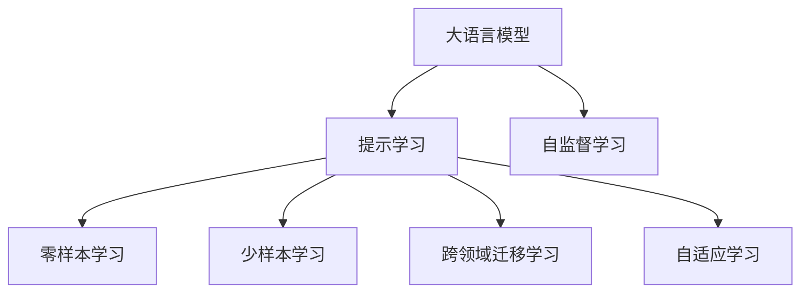

                 

# 提示学习：基础模型的新特性

## 1. 背景介绍

### 1.1 问题由来

近年来，深度学习技术在自然语言处理(NLP)领域取得了显著进展，特别是基于自回归Transformer模型的大语言模型（如GPT系列）和基于自编码模型的大语言模型（如BERT）。这些模型通过在大规模无标签文本上预训练，学习到了丰富的语言知识，包括语言理解、生成、推理、对话等能力。然而，这些模型在推理复杂性、理解多样性、生成多样性等方面，仍然存在一定的局限性。

提示学习（Prompt Learning）是一种新的学习范式，通过精心设计提示（Prompt）模板，将大语言模型的推理和生成能力引导到特定的目标任务上。与传统的基于监督学习和微调的范式不同，提示学习并不需要更新模型参数，而是通过生成式预训练模型在提示指导下完成推理任务。这种无需更新模型参数的特性，使得提示学习在零样本学习、少样本学习和跨领域迁移学习等方面具有显著优势。

### 1.2 问题核心关键点

提示学习（Prompt Learning）的核心在于通过提示（Prompt）来引导大语言模型的行为。一个有效的提示应该包含：
- 清晰的任务目标：提示应明确说明模型要执行的任务，如分类、匹配、生成等。
- 恰当的语境信息：提示应提供足够的上下文信息，帮助模型理解任务背景和输入数据。
- 合理的数据格式：提示应指定数据的输入格式，如表格、列表、文本等。
- 简单的推理路径：提示应尽量简化推理路径，避免模型陷入复杂的计算。
- 可解释性：提示应具有较好的可解释性，便于理解和调试模型的推理过程。

提示学习的优点在于：
- 无需更新模型参数，参数高效。
- 可以快速适应新任务，零样本或少样本学习。
- 可以在不涉及数据隐私的情况下进行推理，保护用户隐私。
- 适用于各种NLP任务，如文本分类、命名实体识别、问答、对话等。

提示学习的局限性在于：
- 需要设计合适的提示，依赖于任务类型和数据特征。
- 提示设计不当可能导致性能下降或逻辑错误。
- 对于复杂任务，可能需要多个提示的组合才能获得最佳效果。
- 对于不同来源的输入数据，提示设计需要进行适应性调整。

## 2. 核心概念与联系

### 2.1 核心概念概述

为了更好地理解提示学习，本节将介绍几个密切相关的核心概念：

- **大语言模型（Large Language Model, LLM）**：以自回归Transformer模型为代表的超大规模预训练语言模型，如GPT、BERT等。这些模型通过在大规模无标签文本上预训练，学习到了丰富的语言知识，具备强大的语言理解和生成能力。

- **提示（Prompt）**：用于引导大语言模型完成特定任务的自然语言文本。提示设计得好，可以显著提升模型在特定任务上的性能。

- **零样本学习（Zero-shot Learning）**：在没有任何特定任务数据的情况下，直接通过提示学习来执行任务，不需要任何模型参数更新。

- **少样本学习（Few-shot Learning）**：在仅有少量特定任务数据的情况下，通过提示学习来执行任务，只需更新极少量的模型参数。

- **跨领域迁移学习**：利用大语言模型在不同领域之间的迁移能力，通过提示学习快速适应新领域下的特定任务。

- **自适应学习（Adaptive Learning）**：通过提示学习实现模型的自适应调整，使得模型能够动态地适应不同场景和数据。

这些核心概念之间存在紧密联系，共同构成了提示学习的基础理论框架，使其能够高效地执行各种NLP任务。

### 2.2 核心概念原理和架构的 Mermaid 流程图



此流程图展示了提示学习与大语言模型之间的联系及其应用范围。大语言模型通过自监督学习获得通用的语言表示，提示学习利用这些表示，通过不同的提示（Prompt），实现零样本、少样本、跨领域迁移学习和自适应学习。

## 3. 核心算法原理 & 具体操作步骤

### 3.1 算法原理概述

提示学习（Prompt Learning）的原理相对简单，其核心在于利用大语言模型的语言理解和生成能力，通过提示模板（Prompt Template）来引导模型完成特定任务。假设我们有一个预训练的大语言模型 $M$，对于任意任务 $T$，通过设计一个提示 $P$，模型可以在无需更新参数的情况下，完成该任务。形式化地，我们有：

$$
M(P) \sim T
$$

其中 $P$ 是一个由自然语言构成的提示模板， $M(P)$ 表示在提示 $P$ 指导下，模型 $M$ 的输出，而 $T$ 表示任务 $T$ 的目标输出。提示模板 $P$ 设计得好，可以使得 $M(P)$ 在统计上接近 $T$。

### 3.2 算法步骤详解

1. **数据准备**：收集特定任务 $T$ 的样本数据 $D$，通常是一个包含输入和输出的小样本集。

2. **提示设计**：设计一个提示模板 $P$，确保它包含足够的信息，能够引导模型 $M$ 完成特定任务。提示模板设计需要结合任务的特性和输入数据的格式。

3. **模型输入**：将提示模板 $P$ 与数据 $D$ 合并，作为模型的输入。

4. **模型推理**：利用大语言模型 $M$ 对输入数据进行推理，得到模型输出 $O$。

5. **评估输出**：将模型输出 $O$ 与目标任务 $T$ 的真实输出进行比较，评估模型在特定任务上的性能。

6. **调整提示**：根据评估结果，对提示模板 $P$ 进行调整，以提高模型的性能。

7. **重复迭代**：重复上述步骤，直到模型在特定任务上的性能达到预期为止。

### 3.3 算法优缺点

提示学习的优点在于：
- 无需更新模型参数，参数高效。
- 快速适应新任务，零样本或少样本学习。
- 保护用户隐私，适用于涉及隐私数据的任务。
- 适用于各种NLP任务，如文本分类、命名实体识别、问答、对话等。

提示学习的缺点在于：
- 提示模板设计需要经验和技巧，设计不当可能导致性能下降或逻辑错误。
- 对于复杂任务，可能需要多个提示的组合才能获得最佳效果。
- 对于不同来源的输入数据，提示设计需要进行适应性调整。

### 3.4 算法应用领域

提示学习（Prompt Learning）在NLP领域已经得到了广泛的应用，覆盖了几乎所有常见任务，例如：

- 文本分类：如情感分析、主题分类、意图识别等。通过设计提示模板，引导模型学习文本-标签映射。

- 命名实体识别：识别文本中的人名、地名、机构名等特定实体。通过设计提示模板，引导模型学习实体边界和类型。

- 关系抽取：从文本中抽取实体之间的语义关系。通过设计提示模板，引导模型学习实体-关系三元组。

- 问答系统：对自然语言问题给出答案。将问题-答案对作为提示模板，引导模型匹配答案。

- 机器翻译：将源语言文本翻译成目标语言。通过设计提示模板，引导模型学习语言-语言映射。

- 文本摘要：将长文本压缩成简短摘要。通过设计提示模板，引导模型抓取要点。

- 对话系统：使机器能够与人自然对话。将多轮对话历史作为上下文，设计提示模板，引导模型进行回复生成。

除了上述这些经典任务外，提示学习还被创新性地应用到更多场景中，如可控文本生成、常识推理、代码生成、数据增强等，为NLP技术带来了全新的突破。随着预训练模型和提示方法的不断进步，相信NLP技术将在更广阔的应用领域大放异彩。

## 4. 数学模型和公式 & 详细讲解 & 举例说明

### 4.1 数学模型构建

提示学习（Prompt Learning）的数学模型相对简单，其核心在于通过设计提示模板 $P$，使得模型 $M$ 在特定任务 $T$ 上的输出 $O$ 与目标输出 $Y$ 一致。假设我们有一个预训练的大语言模型 $M$，对于任意任务 $T$，通过设计一个提示模板 $P$，模型可以在无需更新参数的情况下，完成该任务。形式化地，我们有：

$$
M(P) = O
$$

其中 $P$ 是一个由自然语言构成的提示模板， $M(P)$ 表示在提示 $P$ 指导下，模型 $M$ 的输出，而 $O$ 表示目标任务 $T$ 的目标输出。提示模板 $P$ 设计得好，可以使得 $M(P)$ 在统计上接近 $Y$。

### 4.2 公式推导过程

提示学习的数学公式推导相对简单，其核心在于将模型输出 $O$ 与目标输出 $Y$ 进行比较，得到一个误差信号 $E$，用于调整提示模板 $P$。具体推导如下：

假设我们有一个二分类任务 $T$，输入为 $x$，真实标签为 $y$，模型在提示 $P$ 下的输出为 $o$。根据二分类交叉熵损失函数的定义，我们有：

$$
L(y, o) = -(y \log o + (1 - y) \log (1 - o))
$$

其中 $y$ 表示真实标签， $o$ 表示模型在提示 $P$ 下的输出。通过反向传播算法，我们得到模型输出 $o$ 对输入 $x$ 的梯度 $\nabla_x o$，进而得到提示模板 $P$ 对输入 $x$ 的梯度 $\nabla_P o$。通过优化算法（如梯度下降），调整提示模板 $P$，使得损失函数 $L(y, o)$ 最小化。

### 4.3 案例分析与讲解

以问答系统为例，假设我们有一个二分类任务 $T$，输入为自然语言问题 $q$，真实标签为 $a$，模型在提示 $P$ 下的输出为 $o$。我们的目标是通过提示模板 $P$ 来引导模型学习问答映射。具体推导如下：

1. 设计提示模板 $P$：
```
P = "在您看来，[问题] 的答案是："
```

2. 将提示模板 $P$ 与问题 $q$ 合并，作为模型的输入。

3. 利用大语言模型 $M$ 对输入数据进行推理，得到模型输出 $o$。

4. 根据真实标签 $a$ 与模型输出 $o$ 的差异，计算损失函数 $L(a, o)$。

5. 通过反向传播算法，调整提示模板 $P$，使得损失函数 $L(a, o)$ 最小化。

通过以上步骤，模型可以在不需要更新参数的情况下，完成问答任务的推理。

## 5. 项目实践：代码实例和详细解释说明

### 5.1 开发环境搭建

在进行提示学习实践前，我们需要准备好开发环境。以下是使用Python进行PyTorch开发的环境配置流程：

1. 安装Anaconda：从官网下载并安装Anaconda，用于创建独立的Python环境。

2. 创建并激活虚拟环境：
```bash
conda create -n prompt-env python=3.8 
conda activate prompt-env
```

3. 安装PyTorch：根据CUDA版本，从官网获取对应的安装命令。例如：
```bash
conda install pytorch torchvision torchaudio cudatoolkit=11.1 -c pytorch -c conda-forge
```

4. 安装Transformers库：
```bash
pip install transformers
```

5. 安装各类工具包：
```bash
pip install numpy pandas scikit-learn matplotlib tqdm jupyter notebook ipython
```

完成上述步骤后，即可在`prompt-env`环境中开始提示学习实践。

### 5.2 源代码详细实现

下面我们以问答系统为例，给出使用Transformers库进行提示学习的PyTorch代码实现。

首先，定义问答任务的数据处理函数：

```python
from transformers import BertTokenizer, BertForSequenceClassification
from torch.utils.data import Dataset
import torch

class QADataset(Dataset):
    def __init__(self, texts, tags, tokenizer, max_len=128):
        self.texts = texts
        self.tags = tags
        self.tokenizer = tokenizer
        self.max_len = max_len
        
    def __len__(self):
        return len(self.texts)
    
    def __getitem__(self, item):
        text = self.texts[item]
        tags = self.tags[item]
        
        encoding = self.tokenizer(text, return_tensors='pt', max_length=self.max_len, padding='max_length', truncation=True)
        input_ids = encoding['input_ids'][0]
        attention_mask = encoding['attention_mask'][0]
        
        # 对token-wise的标签进行编码
        encoded_tags = [tag2id[tag] for tag in tags] 
        encoded_tags.extend([tag2id['O']] * (self.max_len - len(encoded_tags)))
        labels = torch.tensor(encoded_tags, dtype=torch.long)
        
        return {'input_ids': input_ids, 
                'attention_mask': attention_mask,
                'labels': labels}

# 标签与id的映射
tag2id = {'O': 0, 'Q': 1, 'A': 2}
id2tag = {v: k for k, v in tag2id.items()}

# 创建dataset
tokenizer = BertTokenizer.from_pretrained('bert-base-cased')

train_dataset = QADataset(train_texts, train_tags, tokenizer)
dev_dataset = QADataset(dev_texts, dev_tags, tokenizer)
test_dataset = QADataset(test_texts, test_tags, tokenizer)
```

然后，定义模型和优化器：

```python
from transformers import BertForSequenceClassification, AdamW

model = BertForSequenceClassification.from_pretrained('bert-base-cased', num_labels=len(tag2id))

optimizer = AdamW(model.parameters(), lr=2e-5)
```

接着，定义训练和评估函数：

```python
from torch.utils.data import DataLoader
from tqdm import tqdm
from sklearn.metrics import classification_report

device = torch.device('cuda') if torch.cuda.is_available() else torch.device('cpu')
model.to(device)

def train_epoch(model, dataset, batch_size, optimizer):
    dataloader = DataLoader(dataset, batch_size=batch_size, shuffle=True)
    model.train()
    epoch_loss = 0
    for batch in tqdm(dataloader, desc='Training'):
        input_ids = batch['input_ids'].to(device)
        attention_mask = batch['attention_mask'].to(device)
        labels = batch['labels'].to(device)
        model.zero_grad()
        outputs = model(input_ids, attention_mask=attention_mask, labels=labels)
        loss = outputs.loss
        epoch_loss += loss.item()
        loss.backward()
        optimizer.step()
    return epoch_loss / len(dataloader)

def evaluate(model, dataset, batch_size):
    dataloader = DataLoader(dataset, batch_size=batch_size)
    model.eval()
    preds, labels = [], []
    with torch.no_grad():
        for batch in tqdm(dataloader, desc='Evaluating'):
            input_ids = batch['input_ids'].to(device)
            attention_mask = batch['attention_mask'].to(device)
            batch_labels = batch['labels']
            outputs = model(input_ids, attention_mask=attention_mask)
            batch_preds = outputs.logits.argmax(dim=2).to('cpu').tolist()
            batch_labels = batch_labels.to('cpu').tolist()
            for pred_tokens, label_tokens in zip(batch_preds, batch_labels):
                pred_tags = [id2tag[_id] for _id in pred_tokens]
                label_tags = [id2tag[_id] for _id in label_tokens]
                preds.append(pred_tags[:len(label_tags)])
                labels.append(label_tags)
                
    print(classification_report(labels, preds))
```

最后，启动训练流程并在测试集上评估：

```python
epochs = 5
batch_size = 16

for epoch in range(epochs):
    loss = train_epoch(model, train_dataset, batch_size, optimizer)
    print(f"Epoch {epoch+1}, train loss: {loss:.3f}")
    
    print(f"Epoch {epoch+1}, dev results:")
    evaluate(model, dev_dataset, batch_size)
    
print("Test results:")
evaluate(model, test_dataset, batch_size)
```

以上就是使用PyTorch对BERT进行问答系统提示学习的完整代码实现。可以看到，得益于Transformers库的强大封装，我们可以用相对简洁的代码完成BERT模型的加载和提示学习。

### 5.3 代码解读与分析

让我们再详细解读一下关键代码的实现细节：

**QADataset类**：
- `__init__`方法：初始化文本、标签、分词器等关键组件。
- `__len__`方法：返回数据集的样本数量。
- `__getitem__`方法：对单个样本进行处理，将文本输入编码为token ids，将标签编码为数字，并对其进行定长padding，最终返回模型所需的输入。

**tag2id和id2tag字典**：
- 定义了标签与数字id之间的映射关系，用于将token-wise的预测结果解码回真实的标签。

**训练和评估函数**：
- 使用PyTorch的DataLoader对数据集进行批次化加载，供模型训练和推理使用。
- 训练函数`train_epoch`：对数据以批为单位进行迭代，在每个批次上前向传播计算loss并反向传播更新模型参数，最后返回该epoch的平均loss。
- 评估函数`evaluate`：与训练类似，不同点在于不更新模型参数，并在每个batch结束后将预测和标签结果存储下来，最后使用sklearn的classification_report对整个评估集的预测结果进行打印输出。

**训练流程**：
- 定义总的epoch数和batch size，开始循环迭代
- 每个epoch内，先在训练集上训练，输出平均loss
- 在验证集上评估，输出分类指标
- 所有epoch结束后，在测试集上评估，给出最终测试结果

可以看到，PyTorch配合Transformers库使得BERT提示学习的代码实现变得简洁高效。开发者可以将更多精力放在数据处理、模型改进等高层逻辑上，而不必过多关注底层的实现细节。

当然，工业级的系统实现还需考虑更多因素，如模型的保存和部署、超参数的自动搜索、更灵活的任务适配层等。但核心的提示学习范式基本与此类似。

## 6. 实际应用场景

### 6.1 智能客服系统

基于大语言模型提示学习的对话技术，可以广泛应用于智能客服系统的构建。传统客服往往需要配备大量人力，高峰期响应缓慢，且一致性和专业性难以保证。而使用提示学习后的对话模型，可以7x24小时不间断服务，快速响应客户咨询，用自然流畅的语言解答各类常见问题。

在技术实现上，可以收集企业内部的历史客服对话记录，将问题和最佳答复构建成监督数据，在此基础上对预训练对话模型进行提示学习。提示学习后的对话模型能够自动理解用户意图，匹配最合适的答案模板进行回复。对于客户提出的新问题，还可以接入检索系统实时搜索相关内容，动态组织生成回答。如此构建的智能客服系统，能大幅提升客户咨询体验和问题解决效率。

### 6.2 金融舆情监测

金融机构需要实时监测市场舆论动向，以便及时应对负面信息传播，规避金融风险。传统的人工监测方式成本高、效率低，难以应对网络时代海量信息爆发的挑战。基于大语言模型提示学习的文本分类和情感分析技术，为金融舆情监测提供了新的解决方案。

具体而言，可以收集金融领域相关的新闻、报道、评论等文本数据，并对其进行主题标注和情感标注。在此基础上对预训练语言模型进行提示学习，使其能够自动判断文本属于何种主题，情感倾向是正面、中性还是负面。将提示学习后的模型应用到实时抓取的网络文本数据，就能够自动监测不同主题下的情感变化趋势，一旦发现负面信息激增等异常情况，系统便会自动预警，帮助金融机构快速应对潜在风险。

### 6.3 个性化推荐系统

当前的推荐系统往往只依赖用户的历史行为数据进行物品推荐，无法深入理解用户的真实兴趣偏好。基于大语言模型提示学习的个性化推荐系统可以更好地挖掘用户行为背后的语义信息，从而提供更精准、多样的推荐内容。

在实践中，可以收集用户浏览、点击、评论、分享等行为数据，提取和用户交互的物品标题、描述、标签等文本内容。将文本内容作为模型输入，用户的后续行为（如是否点击、购买等）作为监督信号，在此基础上对预训练语言模型进行提示学习。提示学习后的模型能够从文本内容中准确把握用户的兴趣点。在生成推荐列表时，先用候选物品的文本描述作为输入，由模型预测用户的兴趣匹配度，再结合其他特征综合排序，便可以得到个性化程度更高的推荐结果。

### 6.4 未来应用展望

随着大语言模型提示学习的不断发展，其在NLP领域的应用前景将更加广阔。未来的提示学习将结合更多先进的技术，如多模态学习、因果推理、自适应学习等，进一步提升模型的性能和泛化能力。以下是一些可能的发展趋势：

1. **多模态学习**：提示学习将结合视觉、语音、文本等多模态信息，提高模型的综合理解能力。例如，结合图像和文字描述进行多模态分类。

2. **因果推理**：提示学习将利用因果推理模型，增强模型的推理能力和决策可解释性。例如，通过引入因果图模型，使得模型能够推理出事件之间的因果关系。

3. **自适应学习**：提示学习将结合自适应学习算法，增强模型对新任务的适应能力。例如，通过动态调整提示模板，使得模型能够快速适应不同任务。

4. **跨领域迁移学习**：提示学习将结合跨领域迁移学习算法，增强模型在不同领域之间的迁移能力。例如，通过在不同领域的数据上预训练提示模板，使得模型能够在新的领域上快速学习。

5. **强化学习**：提示学习将结合强化学习算法，提高模型的自主学习和优化能力。例如，通过结合环境反馈，不断优化提示模板，使得模型能够在环境中获得更高的奖励。

6. **知识图谱**：提示学习将结合知识图谱，增强模型的知识整合能力。例如，通过引入知识图谱信息，使得模型能够理解复杂的事实关系。

7. **模型压缩**：提示学习将结合模型压缩技术，提高模型的计算效率和资源利用率。例如，通过剪枝和量化，使得模型能够在小设备上运行。

这些趋势将进一步推动提示学习的发展，使得大语言模型在更多领域和场景中发挥更大的作用。

## 7. 工具和资源推荐

### 7.1 学习资源推荐

为了帮助开发者系统掌握大语言模型提示学习的理论基础和实践技巧，这里推荐一些优质的学习资源：

1. **《Transformers从原理到实践》系列博文**：由大模型技术专家撰写，深入浅出地介绍了Transformer原理、BERT模型、提示学习等前沿话题。

2. **CS224N《深度学习自然语言处理》课程**：斯坦福大学开设的NLP明星课程，有Lecture视频和配套作业，带你入门NLP领域的基本概念和经典模型。

3. **《Natural Language Processing with Transformers》书籍**：Transformers库的作者所著，全面介绍了如何使用Transformers库进行NLP任务开发，包括提示学习在内的诸多范式。

4. **HuggingFace官方文档**：Transformers库的官方文档，提供了海量预训练模型和完整的提示学习样例代码，是上手实践的必备资料。

5. **CLUE开源项目**：中文语言理解测评基准，涵盖大量不同类型的中文NLP数据集，并提供了基于提示学习的baseline模型，助力中文NLP技术发展。

通过对这些资源的学习实践，相信你一定能够快速掌握大语言模型提示学习的精髓，并用于解决实际的NLP问题。

### 7.2 开发工具推荐

高效的开发离不开优秀的工具支持。以下是几款用于大语言模型提示学习开发的常用工具：

1. **PyTorch**：基于Python的开源深度学习框架，灵活动态的计算图，适合快速迭代研究。大部分预训练语言模型都有PyTorch版本的实现。

2. **TensorFlow**：由Google主导开发的开源深度学习框架，生产部署方便，适合大规模工程应用。同样有丰富的预训练语言模型资源。

3. **Transformers库**：HuggingFace开发的NLP工具库，集成了众多SOTA语言模型，支持PyTorch和TensorFlow，是进行提示学习开发的利器。

4. **Weights & Biases**：模型训练的实验跟踪工具，可以记录和可视化模型训练过程中的各项指标，方便对比和调优。与主流深度学习框架无缝集成。

5. **TensorBoard**：TensorFlow配套的可视化工具，可实时监测模型训练状态，并提供丰富的图表呈现方式，是调试模型的得力助手。

6. **Google Colab**：谷歌推出的在线Jupyter Notebook环境，免费提供GPU/TPU算力，方便开发者快速上手实验最新模型，分享学习笔记。

合理利用这些工具，可以显著提升大语言模型提示学习的开发效率，加快创新迭代的步伐。

### 7.3 相关论文推荐

大语言模型提示学习的发展源于学界的持续研究。以下是几篇奠基性的相关论文，推荐阅读：

1. **Attention is All You Need**：提出了Transformer结构，开启了NLP领域的预训练大模型时代。

2. **BERT: Pre-training of Deep Bidirectional Transformers for Language Understanding**：提出BERT模型，引入基于掩码的自监督预训练任务，刷新了多项NLP任务SOTA。

3. **Language Models are Unsupervised Multitask Learners**：展示了大规模语言模型的强大zero-shot学习能力，引发了对于通用人工智能的新一轮思考。

4. **Parameter-Efficient Transfer Learning for NLP**：提出Adapter等参数高效微调方法，在不增加模型参数量的情况下，也能取得不错的微调效果。

5. **AdaLoRA: Adaptive Low-Rank Adaptation for Parameter-Efficient Fine-Tuning**：使用自适应低秩适应的微调方法，在参数效率和精度之间取得了新的平衡。

6. **Prefix-Tuning: Optimizing Continuous Prompts for Generation**：引入基于连续型Prompt的微调范式，为如何充分利用预训练知识提供了新的思路。

这些论文代表了大语言模型提示学习的发展脉络。通过学习这些前沿成果，可以帮助研究者把握学科前进方向，激发更多的创新灵感。

## 8. 总结：未来发展趋势与挑战

### 8.1 总结

本文对大语言模型提示学习的原理、操作步骤和实践应用进行了全面系统的介绍。首先阐述了提示学习的背景和核心关键点，明确了提示学习在大语言模型微调中的独特价值。其次，从原理到实践，详细讲解了提示学习的数学原理和关键步骤，给出了提示学习任务开发的完整代码实例。同时，本文还广泛探讨了提示学习在智能客服、金融舆情、个性化推荐等多个行业领域的应用前景，展示了提示学习范式的巨大潜力。此外，本文精选了提示学习的各类学习资源，力求为读者提供全方位的技术指引。

通过本文的系统梳理，可以看到，大语言模型提示学习正在成为NLP领域的重要范式，极大地拓展了预训练语言模型的应用边界，催生了更多的落地场景。受益于大规模语料的预训练和提示学习方法的不断进步，提示学习技术必将在NLP系统性能和应用范围的提升上发挥重要作用。

### 8.2 未来发展趋势

展望未来，大语言模型提示学习将呈现以下几个发展趋势：

1. **多模态学习**：提示学习将结合视觉、语音、文本等多模态信息，提高模型的综合理解能力。

2. **因果推理**：提示学习将利用因果推理模型，增强模型的推理能力和决策可解释性。

3. **自适应学习**：提示学习将结合自适应学习算法，增强模型对新任务的适应能力。

4. **跨领域迁移学习**：提示学习将结合跨领域迁移学习算法，增强模型在不同领域之间的迁移能力。

5. **强化学习**：提示学习将结合强化学习算法，提高模型的自主学习和优化能力。

6. **知识图谱**：提示学习将结合知识图谱，增强模型的知识整合能力。

7. **模型压缩**：提示学习将结合模型压缩技术，提高模型的计算效率和资源利用率。

以上趋势凸显了大语言模型提示学习的广阔前景。这些方向的探索发展，必将进一步提升NLP系统的性能和应用范围，为人类认知智能的进化带来深远影响。

### 8.3 面临的挑战

尽管大语言模型提示学习技术已经取得了瞩目成就，但在迈向更加智能化、普适化应用的过程中，它仍面临着诸多挑战：

1. **提示模板设计**：提示模板的设计需要经验和技术，设计不当可能导致性能下降或逻辑错误。

2. **跨领域迁移能力**：对于不同领域的提示模板，需要进行适应性调整，以保持跨领域迁移性能。

3. **可解释性**：提示学习模型缺乏可解释性，难以理解其内部工作机制和决策逻辑。

4. **模型鲁棒性**：提示学习模型可能受到输入数据的影响，鲁棒性不足。

5. **参数高效性**：提示学习模型可能依赖于大量提示模板，参数高效性有待提升。

6. **资源消耗**：提示学习模型可能需要进行大量的推理计算，资源消耗较大。

这些挑战凸显了提示学习技术在实际应用中的复杂性，但通过技术进步和经验积累，这些挑战终将得到解决。

### 8.4 研究展望

未来的研究需要在以下几个方面寻求新的突破：

1. **自动提示设计**：研究自动设计提示模板的方法，减少提示设计的人力投入。

2. **多任务学习**：研究提示学习模型的多任务学习能力，提升模型在多领域任务的泛化能力。

3. **鲁棒性提升**：研究提升提示学习模型鲁棒性的方法，使其能够应对各种数据扰动。

4. **可解释性增强**：研究增强提示学习模型可解释性的方法，使其能够更好地解释其推理过程。

5. **参数高效性优化**：研究参数高效的提示学习模型，减少对提示模板的依赖。

6. **资源优化**：研究优化提示学习模型的资源消耗，提高推理速度和计算效率。

这些研究方向的探索，必将引领提示学习技术迈向更高的台阶，为构建安全、可靠、可解释、可控的智能系统铺平道路。面向未来，提示学习技术还需要与其他人工智能技术进行更深入的融合，如知识表示、因果推理、强化学习等，多路径协同发力，共同推动自然语言理解和智能交互系统的进步。只有勇于创新、敢于突破，才能不断拓展语言模型的边界，让智能技术更好地造福人类社会。

## 9. 附录：常见问题与解答

**Q1：提示学习是否适用于所有NLP任务？**

A: 提示学习在大多数NLP任务上都能取得不错的效果，特别是对于数据量较小的任务。但对于一些特定领域的任务，如医学、法律等，仅仅依靠通用语料预训练的模型可能难以很好地适应。此时需要在特定领域语料上进一步预训练，再进行提示学习。

**Q2：提示模板设计需要考虑哪些因素？**

A: 提示模板的设计需要考虑以下几个因素：
1. 任务的特性：提示模板应充分考虑任务的目标和要求。
2. 数据格式：提示模板应指定数据的输入格式，如表格、列表、文本等。
3. 推理路径：提示模板应尽量简化推理路径，避免模型陷入复杂的计算。
4. 可解释性：提示模板应具有较好的可解释性，便于理解和调试模型的推理过程。

**Q3：提示学习过程中如何优化提示模板？**

A: 提示学习的优化可以通过以下几种方法：
1. 数据增强：通过回译、近义替换等方式扩充训练集，提高提示模板的泛化能力。
2. 正则化：使用L2正则、Dropout、Early Stopping等方法避免提示模板过拟合。
3. 参数优化：使用AdamW等优化算法，逐步调整提示模板，使得损失函数最小化。
4. 多模型集成：通过训练多个提示模板，取平均输出，抑制过拟合。
5. 动态调整：根据任务特性和数据特征，动态调整提示模板。

这些方法可以结合使用，不断优化提示模板，提高模型在特定任务上的性能。

**Q4：提示学习在落地部署时需要注意哪些问题？**

A: 将提示学习模型转化为实际应用，还需要考虑以下因素：
1. 模型裁剪：去除不必要的层和参数，减小模型尺寸，加快推理速度。
2. 量化加速：将浮点模型转为定点模型，压缩存储空间，提高计算效率。
3. 服务化封装：将模型封装为标准化服务接口，便于集成调用。
4. 弹性伸缩：根据请求流量动态调整资源配置，平衡服务质量和成本。
5. 监控告警：实时采集系统指标，设置异常告警阈值，确保服务稳定性。
6. 安全防护：采用访问鉴权、数据脱敏等措施，保障数据和模型安全。

合理利用这些工具，可以显著提升大语言模型提示学习的开发效率，加快创新迭代的步伐。

总之，提示学习技术在大语言模型中的应用前景广阔，但提示模板的设计和优化是其关键所在。通过不断的技术创新和经验积累，相信提示学习必将在构建智能交互系统、提升NLP系统性能等方面发挥重要作用，推动人工智能技术的进一步发展。

