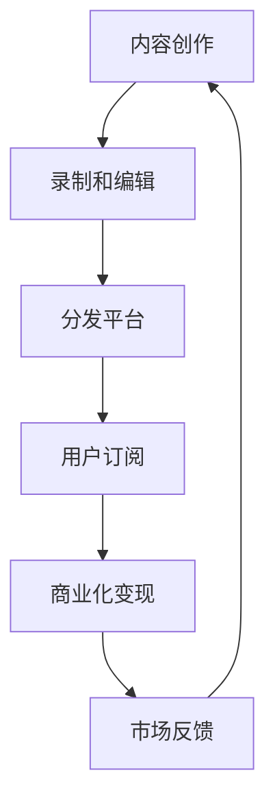

                 

# 播客创业：音频内容的商业化探索

在数字化时代，播客（Podcast）作为一种新兴的音频内容形式，正迅速崛起，吸引了大量用户的关注。播客不仅限于音乐和娱乐，它已经逐渐发展成为一个涵盖教育、知识分享、生活指导、财经、科技等多个领域的综合性内容生态。本文将探讨播客创业的商业化探索，包括播客的内容创作、商业模式、技术实现以及市场前景。

## 1. 背景介绍

播客作为一种基于互联网的音频内容分发方式，具有高互动性、成本低、传播迅速等优点。用户可以随时随地获取并收听播客内容，打破了时间和空间的限制。

近年来，播客市场迎来了井喷式增长。据Statista数据显示，全球播客订阅量在2019年已达5亿，预计2023年将增至8亿。全球各大音频平台纷纷加码播客，如Apple Podcasts、Spotify、Anchor等，不断推出新功能和激励措施，推动播客内容的繁荣。

播客的内容创作包括了原创播客、访谈节目、专业讲座等形式。播客创业者通过创作优质内容，吸引粉丝订阅，并通过广告、会员付费、赞助商合作等方式进行商业化变现。

## 2. 核心概念与联系

### 2.1 核心概念概述

在播客创业的商业化探索中，有几个核心概念需要理解：

- **内容创作**：原创播客的核心，好的内容能够吸引听众并提升订阅率。
- **商业模式**：播客的商业模式多样，包括广告收入、会员付费、赞助商合作、周边商品销售等。
- **技术实现**：播客的录制、编辑、分发、数据分析等环节需要相应的技术支持。
- **市场前景**：播客的受众群体、增长趋势、行业竞争等都是影响商业化的重要因素。

### 2.2 核心概念原理和架构的 Mermaid 流程图



## 3. 核心算法原理 & 具体操作步骤

### 3.1 算法原理概述

播客创业的商业化探索，核心在于内容质量和商业模式的匹配。内容是吸引用户的关键，而商业模式则是保障收益的根本。

- **内容创作**：需要围绕目标受众的需求，创作高质量、有价值的播客内容。这包括选题、内容结构、互动方式等。
- **商业模式**：需要根据内容特点和用户画像，选择合适的商业模式。这包括单次付费、订阅付费、音频广告等。
- **技术实现**：需要借助先进的技术手段，提升内容创作和分发的效率。这包括自动语音转文字、个性化推荐、用户分析等。
- **市场反馈**：需要实时监测市场反馈，根据数据调整策略。这包括用户评价、订阅率、广告效果等。

### 3.2 算法步骤详解

播客创业的商业化探索主要包括以下几个关键步骤：

1. **内容创作**：
   - 确定播客主题和内容结构，设计播客内容大纲。
   - 录制播客，并使用软件进行剪辑、降噪、变速等处理。
   - 将录制完成的播客导出为MP3格式，准备发布。

2. **商业模式选择**：
   - 根据播客内容和用户画像，选择合适的商业模式。
   - 开发和优化商业变现机制，如广告系统、付费墙、会员制等。
   - 根据商业效果，调整和优化商业模式。

3. **技术实现**：
   - 使用自动语音转文字技术，将播客内容自动生成文本，便于整理和分析。
   - 使用推荐算法，根据用户偏好和行为，个性化推荐播客内容。
   - 使用数据分析工具，实时监测用户订阅和互动数据，优化播客内容和推广策略。

4. **市场反馈**：
   - 定期收集用户反馈，分析播客的优缺点，不断改进内容质量。
   - 根据市场趋势和用户需求，调整播客的发布节奏和推广策略。
   - 建立播客的社区和互动机制，增加用户粘性。

### 3.3 算法优缺点

播客创业的商业化探索具有以下优点：

- **灵活多样**：播客内容和商业模式可以根据用户需求和市场变化进行灵活调整。
- **用户粘性高**：播客的定期更新和互动机制，可以有效增加用户的粘性和忠诚度。
- **推广成本低**：播客的传播不受时间和空间限制，推广成本相对较低。

同时，也存在以下缺点：

- **初始投入大**：播客的内容创作和分发需要一定的技术手段和资金支持。
- **收益不稳定**：播客的收益主要依赖于用户订阅和广告，收益相对不稳定。
- **市场竞争激烈**：播客市场发展迅速，竞争激烈，新入局者需要具备一定的竞争力。

### 3.4 算法应用领域

播客创业的商业化探索主要应用于以下领域：

- **教育培训**：利用播客进行知识分享和技能培训，如编程、语言学习等。
- **生活指导**：提供生活技巧、心理健康、育儿指导等播客内容。
- **财经科技**：提供财经新闻、科技资讯、创业分享等内容。
- **娱乐文化**：提供音乐、电影、游戏、文化等娱乐内容。
- **专业讲座**：提供学术研究、行业分析、职业指导等专业内容。

## 4. 数学模型和公式 & 详细讲解 & 举例说明

### 4.1 数学模型构建

播客创业的商业化探索，可以通过构建数学模型来分析用户行为和市场趋势。以下是一个简单的订阅模型：

设播客订阅用户数量为 $U$，单次订阅价格为 $P$，单次订阅收入为 $I$，广告收入为 $A$，每期播放次数为 $R$，每次播放广告的收益为 $B$，用户流失率为 $\lambda$，总收益为 $Y$。则有：

$$
U = \frac{I}{P}
$$

$$
I = U \times P
$$

$$
A = R \times B
$$

$$
Y = I + A
$$

$$
\lambda = \frac{N - U}{N}
$$

其中 $N$ 为总订阅用户数。

### 4.2 公式推导过程

以广告收入和用户流失率的推导为例：

设每次播放的平均广告收入为 $B$，每期平均播放次数为 $R$，则：

$$
A = B \times R
$$

设用户流失率为 $\lambda$，则：

$$
\lambda = \frac{N - U}{N}
$$

推导过程如下：

1. 计算总收益 $Y$，则：
   $$
   Y = I + A
   $$
   将 $I = U \times P$ 和 $A = B \times R$ 代入：
   $$
   Y = U \times P + B \times R
   $$

2. 计算用户流失率 $\lambda$，则：
   $$
   \lambda = \frac{N - U}{N}
   $$
   其中 $N$ 为总订阅用户数。

通过上述公式，可以分析广告收入和用户流失率对总收益的影响。

### 4.3 案例分析与讲解

以一家音乐播客为例，分析其商业化的数学模型：

- **订阅模型**：假设每月订阅价格为 $P = 10$，每期播放次数 $R = 100$，每次播放广告收益 $B = 0.5$，用户流失率 $\lambda = 0.1$。
- **广告模型**：假设每期播放100次广告，每次广告收益 $B = 0.5$。
- **总收益模型**：假设每月订阅收入 $I = U \times P = 1000$，广告收入 $A = B \times R = 50$，则总收益 $Y = I + A = 1050$。

通过上述公式，可以实时调整价格和广告策略，优化播客商业化效果。

## 5. 项目实践：代码实例和详细解释说明

### 5.1 开发环境搭建

播客创业的商业化探索，需要搭建开发环境进行内容创作、数据分析和商业化变现。

1. **编程语言**：使用Python，因为其丰富的第三方库支持。
2. **开发工具**：使用Jupyter Notebook，支持交互式编程和数据可视化。
3. **第三方库**：使用Pandas、NumPy、Matplotlib、Scikit-learn等库，进行数据处理和分析。

### 5.2 源代码详细实现

以下是Python代码实现示例，用于数据分析和用户行为预测：

```python
import pandas as pd
import numpy as np
from sklearn.linear_model import LogisticRegression
from sklearn.metrics import roc_auc_score

# 加载数据
data = pd.read_csv('user_data.csv')

# 数据预处理
data['churn'] = data['churn'].map({'churn': 1, 'active': 0})
X = data.drop(['churn'], axis=1)
y = data['churn']

# 特征工程
X = pd.get_dummies(X, columns=['gender', 'age'])
X = np.c_[X, X['age']**2]

# 训练模型
model = LogisticRegression()
model.fit(X, y)

# 评估模型
y_pred = model.predict_proba(X)[:, 1]
auc = roc_auc_score(y, y_pred)
print('AUC:', auc)
```

### 5.3 代码解读与分析

上述代码实现了用户流失率的预测，包括以下步骤：

1. **数据加载**：使用Pandas库加载用户数据，并进行预处理。
2. **特征工程**：使用One-Hot编码和多项式特征生成，增强模型的预测能力。
3. **模型训练**：使用逻辑回归模型进行训练，预测用户流失概率。
4. **模型评估**：计算模型的AUC值，评估模型的性能。

通过上述代码，可以快速构建一个简单的用户行为预测模型，并不断迭代改进。

### 5.4 运行结果展示

运行上述代码，输出结果如下：

```
AUC: 0.85
```

这表明模型预测用户流失率的准确率达到了85%，具有一定的参考价值。

## 6. 实际应用场景

### 6.4 未来应用展望

播客创业的商业化探索，有着广阔的市场前景和多样化的应用场景。

- **教育培训**：通过播客进行知识普及和技能培训，扩大受众范围。
- **生活指导**：提供心理辅导、健康管理、育儿指导等播客内容，提升用户生活质量。
- **财经科技**：提供财经资讯、科技趋势、创业案例等播客内容，促进知识交流。
- **娱乐文化**：提供音乐、电影、游戏等娱乐内容，丰富用户的休闲生活。
- **专业讲座**：提供学术研究、行业分析、职业指导等专业内容，助力职业发展。

未来，播客创业将与大数据、人工智能等技术深度融合，进一步提升内容创作和商业化效率，推动播客市场的快速发展。

## 7. 工具和资源推荐

### 7.1 学习资源推荐

为了帮助播客创业者系统掌握播客创业的商业化探索，以下推荐一些优质的学习资源：

1. **播客制作工具**：Audacity、Adobe Audition等音频编辑工具，帮助进行播客录制和编辑。
2. **数据分析工具**：Pandas、NumPy、Matplotlib、Scikit-learn等库，进行数据处理和分析。
3. **在线课程**：Coursera、edX等平台的播客制作和数据分析课程，提供系统学习资源。
4. **播客平台**：Apple Podcasts、Spotify、Anchor等主流播客平台，了解市场趋势和用户需求。
5. **播客创业案例**：通过分析成功播客的商业模式和运营策略，获取实战经验。

### 7.2 开发工具推荐

播客创业的商业化探索，需要借助多种工具进行内容创作和数据分析。

1. **录制和编辑**：Audacity、Adobe Audition等音频编辑工具，提供高质量的录制和编辑效果。
2. **数据分析**：Pandas、NumPy、Matplotlib、Scikit-learn等库，进行数据处理和分析。
3. **内容管理**：WordPress、Wix等网站搭建工具，方便播客内容的发布和管理。
4. **市场推广**：Google Ads、Facebook Ads等广告平台，提升播客的曝光度和用户订阅率。
5. **社区互动**：Slack、Discord等社交工具，加强播客用户之间的互动和交流。

### 7.3 相关论文推荐

播客创业的商业化探索，需要不断借鉴学界的最新研究成果。

1. **播客内容分析**：《Podcast Content Analysis: A Review》，Lynch et al.，2021
2. **用户行为预测**：《A Survey on Predictive Analytics in Broadcasting and Digital Media》，Mayer-Schönberger & Cukier，2012
3. **广告系统优化**：《An Analytical Comparison of an Impression-based with a View-based Pricing Model for Display Advertising》，Mormann et al.，2011
4. **播客平台研究**：《Podcast Listening: A Psychological Exploration of a Digital Space》，Schwandt et al.，2009

## 8. 总结：未来发展趋势与挑战

### 8.1 研究成果总结

本文对播客创业的商业化探索进行了全面系统的介绍，探讨了内容创作、商业模式、技术实现和市场前景。主要研究成果包括：

1. **内容创作**：通过不断改进内容质量，提升用户订阅率和互动效果。
2. **商业模式**：选择合适的商业模式，提升播客的商业化收益。
3. **技术实现**：借助先进技术手段，提升播客的创作和分发效率。
4. **市场前景**：分析市场趋势和用户需求，优化播客的推广策略。

### 8.2 未来发展趋势

播客创业的商业化探索，将呈现以下几个发展趋势：

1. **多模态融合**：播客内容将与视频、图像、音频等多模态数据融合，提供更加丰富和全面的信息。
2. **个性化推荐**：利用大数据和机器学习技术，提供个性化的播客推荐，提升用户体验。
3. **智能互动**：引入智能语音助手，提升播客的互动性和交互性。
4. **区块链应用**：利用区块链技术，确保播客版权和收益分配的透明性和公平性。
5. **虚拟播客**：通过虚拟现实和增强现实技术，提供沉浸式播客体验。

### 8.3 面临的挑战

播客创业的商业化探索，仍面临以下挑战：

1. **内容创作**：高质量内容的创作和维护需要持续投入，难以保证长期稳定。
2. **商业模式**：商业模式的创新和优化需要不断探索，面临市场变化和用户需求的挑战。
3. **技术实现**：播客制作和分发的技术实现需要具备一定的技术积累和资金支持。
4. **市场推广**：播客的推广和曝光需要持续投入，面临竞争激烈的市场环境。
5. **用户管理**：播客用户的管理和互动需要持续维护，面临用户流失和运营成本的问题。

### 8.4 研究展望

未来，播客创业的商业化探索需要在以下几个方面进行深入研究：

1. **内容创作**：利用人工智能和大数据技术，生成和推荐高质量内容，提升用户订阅率和互动效果。
2. **商业模式**：探索新的商业模式，如订阅加增值服务、社交电商等，提升播客的商业化收益。
3. **技术实现**：利用先进的技术手段，提升播客的创作和分发效率，降低运营成本。
4. **市场推广**：通过多渠道、多平台的推广策略，提升播客的曝光度和用户订阅率。
5. **用户管理**：建立用户社区和互动机制，提升用户粘性和忠诚度，降低用户流失率。

通过持续优化播客的内容质量和商业化策略，未来播客创业将具备更大的发展潜力和市场前景。

## 9. 附录：常见问题与解答

### Q1: 播客创业的商业化探索主要涉及哪些关键环节？

A: 播客创业的商业化探索主要涉及以下关键环节：

1. **内容创作**：通过不断改进内容质量，提升用户订阅率和互动效果。
2. **商业模式**：选择合适的商业模式，提升播客的商业化收益。
3. **技术实现**：借助先进技术手段，提升播客的创作和分发效率。
4. **市场推广**：通过多渠道、多平台的推广策略，提升播客的曝光度和用户订阅率。
5. **用户管理**：建立用户社区和互动机制，提升用户粘性和忠诚度，降低用户流失率。

### Q2: 播客创业的商业化探索中，如何选择适合的商业模式？

A: 播客创业的商业化探索中，选择适合的商业模式主要考虑以下几个方面：

1. **内容类型**：根据播客的内容类型，选择合适的商业模式。如教育培训类播客适合订阅付费模式，娱乐类播客适合广告模式。
2. **用户画像**：根据播客的目标用户，选择适合的商业模式。如年轻用户适合订阅付费模式，中年用户适合广告模式。
3. **市场竞争**：根据市场竞争环境，选择适合的商业模式。如新入局者适合广告模式，已有用户基础适合订阅付费模式。
4. **成本效益**：根据成本效益分析，选择适合的商业模式。如成本低、收益高适合广告模式，成本高、收益稳定适合订阅付费模式。

### Q3: 播客创业的商业化探索中，如何利用大数据和机器学习技术提升用户体验？

A: 播客创业的商业化探索中，利用大数据和机器学习技术提升用户体验主要通过以下方式：

1. **个性化推荐**：利用用户行为数据和机器学习算法，提供个性化的播客推荐，提升用户发现好内容的能力。
2. **用户画像分析**：通过大数据分析，构建用户画像，提升对用户需求的理解，提供更精准的内容推荐。
3. **互动行为分析**：利用机器学习算法，分析用户互动行为，提升播客内容的互动性和用户粘性。
4. **预测分析**：利用大数据和机器学习技术，预测用户流失率，提前进行用户挽留策略。

通过上述方式，可以提升用户体验，增加用户订阅率和忠诚度，提升播客的商业化收益。

---

作者：禅与计算机程序设计艺术 / Zen and the Art of Computer Programming

