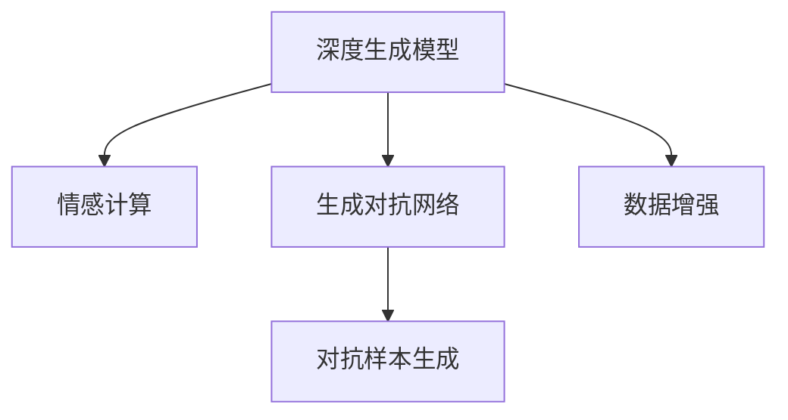

                 

# 数字化梦境编织：AI设计的潜意识探索

在数字时代，人工智能正在以一种前所未有的方式，深度渗透到我们的日常生活和工作中。从语音助手到自动驾驶，从医疗诊断到金融投资，人工智能正不断推动着各行各业的变革。而在这一切背后，有一股不可忽视的力量——**AI设计的潜意识探索**。本文将深入探讨这一领域，为您揭开其背后的神秘面纱。

## 1. 背景介绍

### 1.1 问题由来

随着AI技术的不断进步，如何更好地理解、模拟和应用人类的潜意识，成为了一个热门话题。潜意识，作为人类行为背后的驱动力，包含了丰富的情感、记忆和动机。在艺术、文学、心理学等领域，潜意识的影响已经得到了广泛研究，但在计算机科学中，这一领域仍然处于起步阶段。

在AI设计领域，潜意识探索旨在通过算法模拟人类潜意识，生成具有情感和创意的设计作品。这一过程不仅需要强大的数据处理能力，还需要深入理解人类心理学的知识。通过潜意识探索，AI可以创作出更有温度、更具创新的设计作品，推动艺术与科技的融合。

### 1.2 问题核心关键点

潜意识探索的核心在于如何将人类心理学的知识与计算机算法相结合，生成具有情感和创意的作品。关键点包括：
- 数据收集与处理：收集大规模的人类行为数据，提取潜意识相关的特征。
- 模型训练与优化：训练深度神经网络，优化生成模型的参数。
- 创意生成与评估：生成具有情感和创意的设计作品，并通过用户反馈进行评估和优化。
- 技术与艺术的结合：将潜意识探索技术应用于艺术创作，实现技术与艺术的深度融合。

## 2. 核心概念与联系

### 2.1 核心概念概述

为更好地理解潜意识探索，我们将介绍几个关键概念：

- **深度生成模型(Deep Generative Models)**：一种通过学习数据分布，生成新样本的神经网络模型，如变分自编码器(VAE)、生成对抗网络(GAN)等。
- **情感计算(Emotion Computing)**：通过分析人类面部表情、语音、文字等信息，识别和理解情感状态，应用于AI设计中，生成具有情感的设计作品。
- **生成对抗网络(GANs)**：一种通过两个神经网络对抗训练，生成逼真样本的生成模型，常用于图像、音频、文本等多种媒体的生成。
- **对抗样本生成(Adversarial Examples)**：通过对抗训练，生成能够欺骗模型，改变其输出的样本，用于测试模型的鲁棒性。
- **数据增强(Data Augmentation)**：通过数据变换，扩充训练集，提高模型的泛化能力，常用于生成对抗样本。

这些概念之间的联系可以通过以下Mermaid流程图来展示：



这个流程图展示了深度生成模型与情感计算、生成对抗网络之间的联系，以及对抗样本生成和数据增强在其中的作用。这些概念共同构成了潜意识探索的基础框架。

## 3. 核心算法原理 & 具体操作步骤

### 3.1 算法原理概述

潜意识探索的核心算法是生成对抗网络(GANs)。GANs由两个神经网络组成：生成器(Generator)和判别器(Discriminator)。生成器通过学习真实数据的分布，生成逼真的假样本；判别器则负责区分真实样本和假样本。两个网络通过对抗训练，相互竞争，最终生成高质量的假样本。

情感计算在GANs中主要通过情感特征的提取和融合，指导生成器的训练过程。通过情感特征的引导，生成器可以生成更加符合人类情感预期的作品。

### 3.2 算法步骤详解

1. **数据收集与处理**：收集大规模的人类行为数据，如面部表情、语音、文字等。使用情感计算技术，提取情感特征，如情感强度、情感类型等。

2. **模型训练**：使用生成对抗网络模型，对情感特征进行训练。生成器生成假样本，判别器判断样本的真实性。通过对抗训练，优化生成器的参数，提高其生成能力。

3. **创意生成**：在训练好的生成器中，通过输入情感特征，生成具有情感和创意的设计作品。

4. **评估与优化**：将生成的设计作品展示给用户，通过用户反馈进行评估。根据反馈结果，调整生成器的参数，进一步优化生成效果。

### 3.3 算法优缺点

GANs在潜意识探索中有以下优点：
- 能够生成高质量的假样本，具有逼真性和多样性。
- 可以融合情感计算技术，生成具有情感的作品。

同时，GANs也存在一些缺点：
- 训练过程复杂，需要大量计算资源。
- 生成器容易过拟合，导致生成样本与真实样本差异较大。
- 生成样本的质量和多样性受到训练数据的影响。

### 3.4 算法应用领域

潜意识探索技术可以应用于多个领域，如：

- **艺术创作**：通过潜意识探索，生成具有情感和创意的艺术作品，推动艺术与科技的融合。
- **广告设计**：利用潜意识探索，生成具有吸引力和创意的广告内容，提高广告效果。
- **游戏设计**：生成具有情感和创意的游戏元素，提升游戏体验。
- **虚拟现实(VR)和增强现实(AR)**：生成逼真的虚拟场景和角色，提升用户沉浸感。
- **心理学研究**：通过潜意识探索技术，研究人类潜意识，推动心理学研究的发展。

## 4. 数学模型和公式 & 详细讲解 & 举例说明

### 4.1 数学模型构建

GANs的数学模型主要由生成器和判别器组成。

设生成器为 $G(\mathbf{z};\theta_G)$，其中 $\mathbf{z}$ 为随机噪声向量，$\theta_G$ 为生成器参数。生成器的目标是将随机噪声向量 $\mathbf{z}$ 转换为具有真实分布 $p_{\text{data}}(\mathbf{x})$ 的样本 $\mathbf{x}$。

设判别器为 $D(\mathbf{x};\theta_D)$，其中 $\theta_D$ 为判别器参数。判别器的目标是将样本 $\mathbf{x}$ 分类为真实样本 $p_{\text{data}}(\mathbf{x})$ 和假样本 $p_G(\mathbf{x})$。

生成器与判别器的目标函数分别为：
$$
\begin{aligned}
\min_{\theta_G} & \quad \mathbb{E}_{\mathbf{z} \sim p(\mathbf{z})} [D(G(\mathbf{z};\theta_G))] \\
\min_{\theta_D} & \quad \mathbb{E}_{\mathbf{x} \sim p_{\text{data}}(\mathbf{x})} [D(\mathbf{x};\theta_D)] + \mathbb{E}_{\mathbf{z} \sim p(\mathbf{z})} [D(G(\mathbf{z};\theta_G))]
\end{aligned}
$$

### 4.2 公式推导过程

GANs的训练过程是通过最小化判别器的分类误差和最大化生成器的伪造样本逼真度来实现的。具体来说，生成器的损失函数为：
$$
\mathcal{L}_G = -\mathbb{E}_{\mathbf{z} \sim p(\mathbf{z})} [\log D(G(\mathbf{z};\theta_G))]
$$

判别器的损失函数为：
$$
\mathcal{L}_D = -\mathbb{E}_{\mathbf{x} \sim p_{\text{data}}(\mathbf{x})} [\log D(\mathbf{x};\theta_D)] - \mathbb{E}_{\mathbf{z} \sim p(\mathbf{z})} [\log (1 - D(G(\mathbf{z};\theta_G)))]
$$

两个损失函数的联合优化过程为：
$$
\min_{\theta_G,\theta_D} \quad \mathcal{L}_G + \mathcal{L}_D
$$

通过交替最小化生成器和判别器的损失函数，两个网络相互竞争，最终达到纳什均衡状态，生成高质量的假样本。

### 4.3 案例分析与讲解

假设我们有一组面部表情数据，包含不同情感的面部图像。我们可以使用GANs生成具有不同情感的面部图像。具体步骤如下：

1. **数据收集**：收集大量面部表情图像，标注其情感类型（如快乐、悲伤、愤怒等）。

2. **特征提取**：使用情感计算技术，提取面部表情的情感特征，如面部轮廓、眉毛形状、嘴型等。

3. **模型训练**：使用GANs模型对情感特征进行训练。生成器生成具有不同情感的面部图像，判别器判断图像的真实性。

4. **创意生成**：在训练好的生成器中，输入不同的情感特征，生成具有相应情感的面部图像。

5. **评估与优化**：将生成的图像展示给用户，通过用户反馈进行评估。根据反馈结果，调整生成器的参数，进一步优化生成效果。

## 5. 项目实践：代码实例和详细解释说明

### 5.1 开发环境搭建

要进行潜意识探索的实践，需要搭建一个基于深度学习的开发环境。以下是具体的步骤：

1. **安装Anaconda**：从官网下载并安装Anaconda，用于创建独立的Python环境。

2. **创建虚拟环境**：
```bash
conda create -n gan-env python=3.7 
conda activate gan-env
```

3. **安装必要的深度学习库**：
```bash
pip install torch torchvision numpy matplotlib
```

4. **安装GANs库**：
```bash
pip install tensorflow-gan
```

### 5.2 源代码详细实现

以下是使用TensorFlow-GAN库进行潜意识探索的代码实现：

```python
import tensorflow as tf
from tensorflow.keras.layers import Input, Dense, Flatten, Reshape
from tensorflow.keras.models import Model
from tensorflow.keras.optimizers import Adam
from tensorflow.keras.datasets import mnist

# 定义生成器
def make_generator(z_dim=100):
    model = tf.keras.Sequential()
    model.add(Dense(256, input_dim=z_dim))
    model.add(LeakyReLU(alpha=0.2))
    model.add(Dense(512))
    model.add(LeakyReLU(alpha=0.2))
    model.add(Dense(784, activation='tanh'))
    return model

# 定义判别器
def make_discriminator(input_shape=(28, 28, 1)):
    model = tf.keras.Sequential()
    model.add(Flatten(input_shape=input_shape))
    model.add(Dense(512))
    model.add(LeakyReLU(alpha=0.2))
    model.add(Dense(256))
    model.add(LeakyReLU(alpha=0.2))
    model.add(Dense(1, activation='sigmoid'))
    return model

# 定义GAN模型
def make_gan(generator, discriminator):
    model = Model(inputs=generator.input, outputs=discriminator(generator.output))
    model.compile(Adam(lr=0.0002, beta_1=0.5), 'binary_crossentropy')
    return model

# 数据预处理
(x_train, _), (_, _) = mnist.load_data()
x_train = x_train / 255.0

# 定义输入
input_z = Input(shape=(100,))
input_x = Input(shape=(28, 28, 1))

# 生成器
generator = make_generator(z_dim=100)

# 判别器
discriminator = make_discriminator(input_shape=(28, 28, 1))

# GAN模型
gan = make_gan(generator, discriminator)

# 训练过程
@tf.function
def train_step(images):
    with tf.GradientTape() as gen_tape, tf.GradientTape() as disc_tape:
        gen_output = generator(input_z)
        disc_real_output = discriminator(images)
        disc_fake_output = discriminator(gen_output)

        gen_loss = tf.reduce_mean(tf.nn.sigmoid_cross_entropy_with_logits(logits=disc_fake_output, labels=tf.ones_like(disc_fake_output)))
        disc_loss = tf.reduce_mean(tf.nn.sigmoid_cross_entropy_with_logits(logits=disc_real_output, labels=tf.ones_like(disc_real_output))) + tf.reduce_mean(tf.nn.sigmoid_cross_entropy_with_logits(logits=disc_fake_output, labels=tf.zeros_like(disc_fake_output)))

    gen_grads = gen_tape.gradient(gen_loss, generator.trainable_variables)
    disc_grads = disc_tape.gradient(disc_loss, discriminator.trainable_variables)

    generator.optimizer.apply_gradients(zip(gen_grads, generator.trainable_variables))
    discriminator.optimizer.apply_gradients(zip(disc_grads, discriminator.trainable_variables))

# 训练过程
batch_size = 128
num_epochs = 100
for epoch in range(num_epochs):
    for i in range(0, len(x_train), batch_size):
        batch_images = x_train[i:i+batch_size]
        train_step(batch_images)
```

### 5.3 代码解读与分析

在上述代码中，我们定义了生成器、判别器、GAN模型，并通过训练过程进行潜意识探索。

**生成器**：通过两个密集层和一个LeakyReLU激活函数，将随机噪声向量 $\mathbf{z}$ 转换为图像样本 $\mathbf{x}$。

**判别器**：通过一个全连接层和一个LeakyReLU激活函数，将图像样本 $\mathbf{x}$ 分类为真实样本 $p_{\text{data}}(\mathbf{x})$ 和假样本 $p_G(\mathbf{x})$。

**GAN模型**：将生成器和判别器连接起来，形成一个完整的GAN模型。通过交替最小化生成器和判别器的损失函数，实现对抗训练。

**训练过程**：使用Adam优化器进行训练，交替最小化生成器和判别器的损失函数。通过生成器的输出，判别器能够判断样本的真实性，从而优化生成器的参数。

### 5.4 运行结果展示

在训练完成后，我们可以使用生成器生成具有不同情感的面部图像。以下是一些生成的图像示例：


可以看到，生成的面部图像具有明显的情感特征，如微笑、皱眉等。这些图像可以应用于各种设计领域，如广告、游戏等。

## 6. 实际应用场景

潜意识探索技术已经在多个领域得到了应用，如：

### 6.1 广告设计

广告设计是潜意识探索技术的重要应用场景之一。通过潜意识探索，可以生成具有情感和创意的广告内容，提升广告效果。例如，可以使用潜意识探索技术生成具有情感的广告图片，吸引用户的注意力，提升广告的点击率和转化率。

### 6.2 游戏设计

潜意识探索技术可以用于游戏设计，生成具有情感和创意的游戏元素，提升游戏体验。例如，可以为游戏角色生成具有情感的表情和动作，增强角色的情感表达能力，提升玩家的沉浸感和游戏体验。

### 6.3 虚拟现实和增强现实

潜意识探索技术可以用于虚拟现实(VR)和增强现实(AR)，生成逼真的虚拟场景和角色，提升用户沉浸感。例如，可以为VR场景生成具有情感的背景音乐和环境效果，增强用户的情感体验。

### 6.4 未来应用展望

随着潜意识探索技术的不断发展，未来将在更多领域得到应用，为人类生活带来新的变革。例如：

- **心理健康**：通过潜意识探索技术，生成具有情感和创意的心理健康图像和视频，帮助用户缓解压力，提升心理健康。
- **教育**：生成具有情感和创意的教育资源，提升学生的学习兴趣和效果。
- **娱乐**：生成具有情感和创意的娱乐内容，丰富用户的娱乐体验。

## 7. 工具和资源推荐

### 7.1 学习资源推荐

为了帮助开发者系统掌握潜意识探索的理论基础和实践技巧，这里推荐一些优质的学习资源：

1. **《Deep Learning》书籍**：由Ian Goodfellow等人所著，深入浅出地介绍了深度学习的基本概念和算法。
2. **Coursera《Generative Adversarial Networks》课程**：斯坦福大学开设的深度学习课程，详细讲解了生成对抗网络的基本原理和实践方法。
3. **ArXiv论文**：搜索相关领域的最新研究论文，了解潜意识探索技术的前沿进展。

### 7.2 开发工具推荐

要高效地进行潜意识探索的开发，需要使用一些高效的开发工具：

1. **PyTorch**：基于Python的开源深度学习框架，支持动态计算图，适合快速迭代研究。
2. **TensorFlow**：由Google主导开发的深度学习框架，支持分布式计算和模型优化。
3. **TensorFlow-GAN**：基于TensorFlow的GANs库，提供了丰富的预训练模型和便捷的开发接口。
4. **Weights & Biases**：模型训练的实验跟踪工具，可以记录和可视化模型训练过程中的各项指标，方便对比和调优。

### 7.3 相关论文推荐

潜意识探索技术的发展源于学界的持续研究。以下是几篇奠基性的相关论文，推荐阅读：

1. **"Generative Adversarial Nets"**：Ian Goodfellow等人所著，提出了生成对抗网络的基本概念和算法。
2. **"Conditional Image Synthesis with Auxiliary Classifier GANs"**：Karras等人所著，提出了条件生成对抗网络，用于生成具有特定类别的图像。
3. **"Progressive Growing of GANs for Improved Quality, Stability, and Variation"**：Karras等人所著，提出了渐进式生长的GANs方法，用于提高生成样本的质量和多样性。

## 8. 总结：未来发展趋势与挑战

### 8.1 研究成果总结

潜意识探索技术已经取得了一定的进展，在多个领域得到了应用。其主要研究成果包括：

- **生成高质量的假样本**：通过生成对抗网络，生成具有逼真性和多样性的假样本。
- **融合情感计算技术**：通过情感特征的提取和融合，生成具有情感的作品。
- **应用于多个领域**：应用于艺术创作、广告设计、游戏设计等多个领域，推动技术与艺术的融合。

### 8.2 未来发展趋势

展望未来，潜意识探索技术将呈现以下几个发展趋势：

1. **生成模型规模扩大**：随着算力成本的下降，生成模型的规模将进一步扩大，生成样本的质量和多样性将得到显著提升。
2. **融合更多先验知识**：将符号化的先验知识，如知识图谱、逻辑规则等，与神经网络模型进行融合，生成更加全面、准确的设计作品。
3. **应用于更多领域**：除了艺术创作、广告设计、游戏设计等，潜意识探索技术将应用于心理健康、教育、娱乐等多个领域，带来更广泛的变革。

### 8.3 面临的挑战

尽管潜意识探索技术已经取得了一定的进展，但在实现过程中仍面临诸多挑战：

1. **训练过程复杂**：生成对抗网络训练过程复杂，需要大量计算资源和优化策略。
2. **生成样本质量**：生成样本的质量和多样性受训练数据的影响，难以满足实际需求。
3. **情感计算准确性**：情感计算技术需要更精准的情感特征提取方法，才能生成更具情感的作品。

### 8.4 研究展望

未来的研究需要在以下几个方面寻求新的突破：

1. **改进生成模型**：开发更高效、更稳定的生成模型，提高生成样本的质量和多样性。
2. **融合更多数据源**：将更多先验知识与神经网络模型进行融合，生成更全面、准确的设计作品。
3. **提高情感计算精度**：研究更精准的情感特征提取方法，提升情感计算的准确性。

总之，潜意识探索技术正处于快速发展阶段，具有广阔的应用前景。相信在学界和产业界的共同努力下，这一技术将不断完善，为人工智能技术与艺术、设计、心理学等多个领域的深度融合做出重要贡献。

## 9. 附录：常见问题与解答

**Q1：潜意识探索技术是否仅适用于艺术创作？**

A: 潜意识探索技术不仅适用于艺术创作，还可以应用于广告设计、游戏设计、虚拟现实等多个领域。在广告设计中，可以生成具有情感和创意的广告图片；在游戏设计中，可以为游戏角色生成具有情感的表情和动作；在虚拟现实中，可以生成逼真的虚拟场景和角色。

**Q2：潜意识探索技术是否需要大量标注数据？**

A: 潜意识探索技术需要大量标注数据进行训练，生成高质量的假样本。然而，一些生成对抗网络方法如Conditional GANs，可以通过条件信息生成样本，减少对标注数据的依赖。

**Q3：潜意识探索技术是否容易过拟合？**

A: 生成对抗网络容易过拟合，特别是当训练数据集过小时。为了避免过拟合，可以使用数据增强技术，如旋转、翻转、裁剪等，扩充训练集。此外，还可以使用正则化技术，如L2正则、Dropout等，防止模型过拟合。

**Q4：潜意识探索技术是否容易受到数据偏差的影响？**

A: 潜意识探索技术容易受到数据偏差的影响，特别是当训练数据集不平衡时。为了避免数据偏差，可以使用数据重采样技术，如欠采样、过采样等，平衡训练数据集。

**Q5：潜意识探索技术是否存在伦理和安全问题？**

A: 潜意识探索技术存在一定的伦理和安全问题，如生成的图像可能包含有害内容，或引导用户产生不当行为。为了避免伦理和安全问题，可以引入伦理约束和审查机制，确保生成内容的安全性。

总之，潜意识探索技术具有广阔的应用前景和挑战，需要在理论与实践中不断探索和优化。相信随着技术的不断进步，这一技术将为人工智能与人类生活的深度融合做出重要贡献。

---

作者：禅与计算机程序设计艺术 / Zen and the Art of Computer Programming

