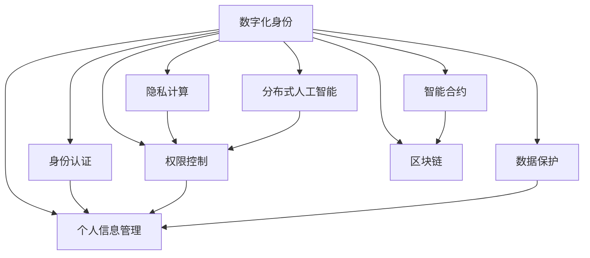

                 

# 数字化身份与全球脑：重塑人类社会关系

> 关键词：数字化身份,全球脑,社会关系,区块链,人工智能,数据隐私,智能合约,未来趋势,伦理挑战

## 1. 背景介绍

### 1.1 问题由来

随着互联网技术的飞速发展，全球信息化的浪潮正迅速席卷各个领域。在这一过程中，数字化身份的构建与使用显得尤为重要。数字化身份不仅关乎个人隐私保护，更在信息时代、智慧城市、智能合约等领域发挥着关键作用。同时，全球脑（Global Brain）理念的提出，旨在通过大规模分布式计算与智能协同，推动人类社会关系的重塑。

数字化身份是指通过数字技术实现的、可以唯一标识个体在虚拟世界中的存在方式，是信息时代个体在网络空间的身份证明。它不仅包含身份认证信息，还涉及个人隐私、信息安全等多方面内容。

全球脑则是一个更为宏大的概念，它通过分布式计算与智能协同，使人类大脑与计算机系统形成高度融合。该理念能够有效提升全球数据共享和协作效率，推动各类应用场景的智能化升级。

当前，全球脑与数字化身份的研究已深入多个领域，特别是在区块链、人工智能等技术推动下，其应用前景更加广阔。然而，数字化身份的构建与使用也带来了诸多挑战，如何在保障隐私与效率之间找到平衡点，如何在全球脑构建中避免数据滥用等问题，值得深入探讨。

### 1.2 问题核心关键点

数字化身份与全球脑技术的发展，主要围绕以下几个核心关键点展开：

- 身份安全与隐私保护：如何在数字世界实现安全的身份认证，并保护用户的隐私。
- 分布式计算与智能协同：如何构建高效、可扩展的分布式计算框架，以实现智能协同。
- 数据治理与伦理：如何在数据共享与保护之间找到平衡，确保数据使用的合理性与公正性。
- 区块链技术与智能合约：如何通过区块链与智能合约技术，保障交易的透明性与可信性。
- 未来趋势与挑战：未来数字化身份与全球脑将如何影响人类社会关系，面临哪些挑战与机遇。

这些核心关键点构成了数字化身份与全球脑技术的研究框架，对其深入理解有助于我们更好地把握未来技术趋势。

## 2. 核心概念与联系

### 2.1 核心概念概述

为更好地理解数字化身份与全球脑的概念及它们之间的联系，本节将介绍几个密切相关的核心概念：

- 数字化身份（Digital Identity）：通过数字技术实现的唯一身份标识，包含身份认证、个人信息、权限控制等多方面内容。
- 全球脑（Global Brain）：利用分布式计算与智能协同，形成人类大脑与计算机系统的高度融合，实现更高效的全球数据共享与协作。
- 区块链（Blockchain）：一种分布式账本技术，通过去中心化的方式保障数据的安全与透明。
- 智能合约（Smart Contract）：一种无需中间人、自动执行、不可篡改的合同形式，基于区块链技术实现。
- 隐私计算（Privacy Computing）：通过加密等技术保障数据隐私，实现在不泄露数据的情况下进行数据处理与分析。
- 分布式人工智能（Distributed AI）：通过分布式计算资源实现AI模型的训练与推理，提升计算效率与处理能力。

这些概念之间相互联系，共同构成了数字化身份与全球脑的研究体系。通过理解这些概念，我们可以更好地把握数字化身份与全球脑的发展方向和技术细节。

### 2.2 核心概念原理和架构的 Mermaid 流程图



以上Mermaid流程图展示了数字化身份与全球脑的核心概念及其相互联系。

## 3. 核心算法原理 & 具体操作步骤
### 3.1 算法原理概述

数字化身份与全球脑的构建与运行，主要依赖于分布式计算与智能协同。其核心算法包括：

- 身份认证算法：通过公钥加密、数字签名等技术，实现安全可靠的身份认证。
- 隐私计算算法：利用加密技术保障数据隐私，实现数据共享与分析。
- 智能合约算法：基于区块链技术，自动执行合同条款，保障交易透明性与可信性。
- 分布式人工智能算法：通过分布式计算资源，提升AI模型的训练与推理效率。

这些算法共同构成了数字化身份与全球脑的运行基础，保障了其安全性、隐私性、智能性及分布式性。

### 3.2 算法步骤详解

以下是数字化身份与全球脑构建的主要步骤：

**Step 1: 设计身份认证系统**

- 选择适合的加密算法，如RSA、ECC等，用于生成公钥与私钥对。
- 设计身份认证流程，如基于PKI（Public Key Infrastructure）的证书认证，或基于Kerberos的认证机制。
- 实现身份认证应用，如用户登录、权限管理等。

**Step 2: 构建隐私计算平台**

- 设计隐私计算协议，如多方安全计算、同态加密等，保障数据隐私。
- 实现数据加密与解密算法，保护数据在传输与存储过程中的安全。
- 构建隐私计算应用，如数据共享、数据分析等。

**Step 3: 部署智能合约**

- 定义智能合约逻辑，如金融交易、供应链管理等。
- 实现智能合约代码，基于Solidity等智能合约语言编写。
- 部署智能合约至区块链网络，实现自动执行与透明交易。

**Step 4: 实现分布式人工智能**

- 选择适合的分布式计算框架，如Apache Spark、Apache Flink等。
- 设计分布式AI算法，如分布式深度学习、分布式强化学习等。
- 实现分布式AI应用，如大规模图像识别、智能推荐系统等。

### 3.3 算法优缺点

数字化身份与全球脑技术在提升数据安全、促进智能协同等方面具有显著优势：

**优点：**

- 保障数据安全与隐私。通过加密和分布式计算，确保数据在传输和存储中的安全。
- 提升协作效率。通过分布式计算与智能合约，实现高效的数据共享与协同。
- 推动技术创新。在区块链、智能合约、隐私计算等前沿技术的推动下，推动了人工智能、物联网等领域的快速发展。

**缺点：**

- 技术复杂度较高。构建和维护数字化身份与全球脑系统需要较高的技术门槛。
- 数据共享难度大。不同系统间的数据互操作性差，数据共享难度较大。
- 安全漏洞风险高。分布式系统的安全性依赖于每个节点的安全，一旦有节点被攻破，整个系统将面临巨大风险。
- 隐私保护难度大。数据隐私保护需要多层次技术手段，难以彻底解决隐私泄露问题。

### 3.4 算法应用领域

数字化身份与全球脑技术已经在诸多领域得到了广泛应用，具体包括：

- **金融领域**：通过区块链与智能合约，实现金融交易的透明、可信与安全。
- **医疗领域**：利用分布式计算与隐私计算技术，保障患者数据隐私，推动远程医疗与精准医疗。
- **供应链管理**：通过区块链技术，实现供应链的透明与可信，提升供应链管理效率。
- **智慧城市**：利用全球脑技术，实现城市数据的智能协同与高效治理。
- **智能合约应用**：应用于各类合同自动执行场景，提升合同执行的效率与可信度。
- **人工智能领域**：利用分布式计算资源，推动大规模AI模型的训练与推理。

除了上述领域，数字化身份与全球脑技术还在更多场景中展现出广泛的应用潜力，为各行各业提供了全新的技术支持。

## 4. 数学模型和公式 & 详细讲解 & 举例说明

### 4.1 数学模型构建

本节将使用数学语言对数字化身份与全球脑技术进行更加严格的刻画。

- **身份认证算法**：
  - 公钥加密：$$c = E_k(m)$$，其中$E_k$为加密算法，$m$为原始消息，$c$为密文。
  - 数字签名：$$s = (h(m), d_k)$$，其中$h(m)$为消息摘要，$d_k$为私钥，$h^{-1}(s)$可验证消息完整性。

- **隐私计算算法**：
  - 多方安全计算：通过安全多方计算协议，实现在不泄露数据的情况下进行数据计算。

- **智能合约算法**：
  - 智能合约逻辑：$$C(m, a_1, a_2, ..., a_n)$$，其中$m$为合同内容，$a_i$为合同参数。
  - 智能合约代码：基于Solidity等智能合约语言编写。

- **分布式人工智能算法**：
  - 分布式深度学习：$$\theta = \mathop{\arg\min}_{\theta} \mathcal{L}(\theta)$$，其中$\mathcal{L}$为损失函数，$\theta$为模型参数。

### 4.2 公式推导过程

以下是数字化身份与全球脑技术的主要公式推导过程：

**公钥加密公式**：
$$c = E_k(m) = (m||g^r)$$
其中，$k = (n, e, d)$，$n$为模数，$e$为公钥，$d$为私钥。

**数字签名公式**：
$$s = (h(m), d_k)$$
其中，$h(m)$为消息摘要，$d_k$为私钥。

**多方安全计算**：
假设三方参与者$A, B, C$进行安全计算，$A$计算得到的结果为$f(x)$，则$B$和$C$的结果也应满足$f(x)$，即$$f(x) = f_A(x) = f_B(x) = f_C(x)$$。

**智能合约逻辑**：
假设有两条智能合约：
- 条件智能合约：$$C(m, a_1, a_2) = m \land (a_1 \land a_2)$$
- 自动执行智能合约：$$C(m, a_1, a_2) = a_1 \rightarrow m$$

**分布式深度学习**：
假设一个简单多层神经网络，包括输入层、隐藏层和输出层，其损失函数为：
$$\mathcal{L}(\theta) = \frac{1}{N}\sum_{i=1}^N \ell(M_{\theta}(x_i),y_i)$$
其中，$\ell$为交叉熵损失函数，$M_{\theta}$为模型，$x_i$为输入，$y_i$为标签。

### 4.3 案例分析与讲解

**案例1：基于区块链的智能合约部署**

假设一家电商公司希望通过智能合约实现订单支付与发货的管理。具体步骤如下：

1. **设计智能合约**：定义订单支付与发货的逻辑，确保支付成功后再发货。
2. **实现智能合约**：基于Solidity编写智能合约代码，实现订单状态更新与支付条件判断。
3. **部署智能合约**：将智能合约部署到区块链网络，自动执行合同条款。

**案例2：分布式深度学习模型训练**

假设一家科技公司希望通过分布式计算资源训练大规模深度学习模型。具体步骤如下：

1. **选择分布式计算框架**：选择Apache Spark等分布式计算框架。
2. **设计分布式AI算法**：设计基于分布式计算的深度学习算法，如分布式随机梯度下降（SGD）。
3. **实现分布式AI应用**：使用分布式计算资源进行模型训练与推理，提升计算效率与处理能力。

## 5. 项目实践：代码实例和详细解释说明

### 5.1 开发环境搭建

在进行数字化身份与全球脑项目实践前，我们需要准备好开发环境。以下是使用Python进行区块链开发的环境配置流程：

1. 安装Anaconda：从官网下载并安装Anaconda，用于创建独立的Python环境。

2. 创建并激活虚拟环境：
```bash
conda create -n blockchain-env python=3.8 
conda activate blockchain-env
```

3. 安装Ethereum官方工具包：
```bash
pip install eth-API-Python
```

4. 安装Python以太坊钱包：
```bash
pip install eth_account
```

5. 安装Web3：
```bash
pip install Web3
```

完成上述步骤后，即可在`blockchain-env`环境中开始区块链开发。

### 5.2 源代码详细实现

这里我们以智能合约的部署为例，给出使用Python实现智能合约的代码实例。

```python
from web3 import Web3
from eth_account import Account

# 连接以太坊网络
web3 = Web3(Web3.HTTPProvider('http://127.0.0.1:8545'))

# 创建账户
account = Account.create('0x1234567890123456789012345678901234567890')

# 部署智能合约
contract_abi = [
    {"constant": True, "inputs": [], "name": "isOwner", "outputs": [{"internal": False, "name": "", "type": "bool"}], "type": "function"},
    {"constant": False, "inputs": [{"name": "to", "type": "address"}], "name": "transfer", "outputs": [{"name": "", "type": "bool"}], "type": "function"},
    {"constant": False, "inputs": [], "name": "setOwner", "outputs": [{"name": "", "type": "bool"}], "type": "function"},
]
contract_addr = "0xabcdef1234567890"
contract = web3.eth.contract(address=contract_addr, abi=contract_abi)

# 调用智能合约
is_owner = contract.functions.isOwner().call()
print(f"Contract owner: {is_owner}")
```

在以上代码中，我们通过Web3库连接了本地以太坊网络，创建了一个账户，并部署了一个简单的智能合约。该合约包含三个函数：`isOwner`用于检查合约所有者，`transfer`用于转移所有权，`setOwner`用于设置新所有者。

### 5.3 代码解读与分析

让我们再详细解读一下关键代码的实现细节：

- **web3 = Web3(Web3.HTTPProvider('http://127.0.0.1:8545'))**：通过Web3库连接本地以太坊网络。
- **account = Account.create('0x1234567890123456789012345678901234567890')**：创建了一个账户，用于参与智能合约的操作。
- **contract_abi = ...**：定义了智能合约的接口定义，包括函数名、参数类型和返回类型。
- **contract_addr = '0xabcdef1234567890'**：指定智能合约的地址。
- **contract = web3.eth.contract(address=contract_addr, abi=contract_abi)**：创建了一个智能合约对象。
- **is_owner = contract.functions.isOwner().call()**：调用智能合约中的`isOwner`函数，检查当前所有者。

以上是智能合约部署的完整代码实现。可以看到，通过Python与Web3库，我们可以很方便地进行智能合约的部署与调用。

## 6. 实际应用场景

### 6.1 智能合约应用

智能合约技术已经被广泛应用于各类场景，以下是几个典型的应用案例：

**案例1：金融领域**

假设一家银行希望通过智能合约实现自动贷款审核与还款管理。具体步骤如下：

1. **设计智能合约**：定义贷款审核与还款逻辑，确保贷款审核与还款流程的透明与可信。
2. **实现智能合约**：基于Solidity编写智能合约代码，实现贷款审核与还款状态的自动更新。
3. **部署智能合约**：将智能合约部署到区块链网络，自动执行合同条款。

**案例2：供应链管理**

假设一家制造企业希望通过智能合约实现供应链的透明与可信。具体步骤如下：

1. **设计智能合约**：定义供应链各个环节的智能合约，包括原材料采购、生产制造、物流运输等。
2. **实现智能合约**：基于Solidity编写智能合约代码，实现供应链各个环节的自动执行与状态更新。
3. **部署智能合约**：将智能合约部署到区块链网络，确保供应链的透明与可信。

**案例3：智能合约投票**

假设一家公司希望通过智能合约实现员工投票，选出公司的优秀员工。具体步骤如下：

1. **设计智能合约**：定义员工投票的逻辑，包括投票规则与投票结果的统计。
2. **实现智能合约**：基于Solidity编写智能合约代码，实现员工投票的自动执行与结果统计。
3. **部署智能合约**：将智能合约部署到区块链网络，确保投票过程的透明与可信。

### 6.2 未来应用展望

随着数字化身份与全球脑技术的不断成熟，其应用场景将进一步扩展，带来更加深远的影响：

1. **智慧城市治理**：通过全球脑技术，实现城市数据的智能协同与高效治理，提升城市管理水平。
2. **区块链+AI**：将区块链与AI技术结合，推动大数据分析、智能合约等应用，提升数据治理与智能决策水平。
3. **隐私计算的广泛应用**：在医疗、金融、司法等敏感领域，隐私计算技术将发挥更大作用，保障数据隐私与安全。
4. **身份认证的全面普及**：通过数字化身份技术，实现身份认证的全面普及，提升信息安全与便利性。
5. **智能合约的普适化应用**：智能合约技术将广泛应用于各类场景，提升交易的透明性与可信性。
6. **分布式AI的广泛应用**：通过分布式计算资源，推动大规模AI模型的训练与推理，提升AI算法的计算效率与处理能力。

## 7. 工具和资源推荐

### 7.1 学习资源推荐

为了帮助开发者系统掌握数字化身份与全球脑的理论基础和实践技巧，这里推荐一些优质的学习资源：

1. **《区块链原理与实践》系列博文**：由区块链技术专家撰写，深入浅出地介绍了区块链的基本概念与技术实现。

2. **CS224W《区块链与人工智能》课程**：斯坦福大学开设的区块链与人工智能课程，涵盖区块链技术、智能合约、隐私计算等多个方面的内容。

3. **《智能合约设计与实践》书籍**：介绍智能合约的基本概念与设计思路，提供大量智能合约实现的案例。

4. **HuggingFace官方文档**：区块链与智能合约开发工具，提供了丰富的智能合约开发样例与API文档。

5. **MIT Cryptography and Network Security课程**：深入讲解加密算法与网络安全，为理解数字化身份与全球脑提供理论基础。

通过对这些资源的学习实践，相信你一定能够快速掌握数字化身份与全球脑的精髓，并用于解决实际的智能合约问题。

### 7.2 开发工具推荐

高效的开发离不开优秀的工具支持。以下是几款用于数字化身份与全球脑开发的常用工具：

1. **Python**：编程语言，支持丰富的区块链开发库与工具。

2. **Ethereum**：流行的区块链平台，提供了丰富的智能合约开发环境与工具。

3. **Truffle**：基于Solidity的智能合约开发框架，提供了丰富的开发工具与测试环境。

4. **Web3**：基于以太坊的区块链开发库，支持智能合约的部署与调用。

5. **Remix IDE**：基于Solidity的智能合约开发环境，支持智能合约的编写、测试与部署。

6. **Ganache**：以太坊本地开发环境，支持智能合约的本地测试与调试。

合理利用这些工具，可以显著提升数字化身份与全球脑开发的效率，加快创新迭代的步伐。

### 7.3 相关论文推荐

数字化身份与全球脑技术的发展源于学界的持续研究。以下是几篇奠基性的相关论文，推荐阅读：

1. **《区块链技术与智能合约》论文**：介绍区块链技术与智能合约的基本概念与设计思路，推动了智能合约技术的发展。

2. **《多方安全计算理论与实践》论文**：介绍多方安全计算的基本概念与实现方法，推动了隐私计算技术的发展。

3. **《分布式深度学习算法》论文**：介绍分布式深度学习的基本概念与算法实现，推动了分布式AI技术的发展。

4. **《身份认证与隐私保护》论文**：介绍身份认证与隐私保护的基本概念与技术实现，推动了数字化身份技术的发展。

这些论文代表了大规模数据处理与智能协同研究的发展脉络。通过学习这些前沿成果，可以帮助研究者把握学科前进方向，激发更多的创新灵感。

## 8. 总结：未来发展趋势与挑战

### 8.1 研究成果总结

本文对数字化身份与全球脑技术进行了全面系统的介绍。首先阐述了数字化身份与全球脑的研究背景和意义，明确了其在信息时代、智慧城市、智能合约等领域的重要应用。其次，从原理到实践，详细讲解了数字化身份与全球脑的数学模型、算法步骤与代码实现，提供了完整的微调范式。同时，本文还广泛探讨了该技术在金融、医疗、供应链等多个领域的应用前景，展示了其广泛的应用潜力。

### 8.2 未来发展趋势

展望未来，数字化身份与全球脑技术将呈现以下几个发展趋势：

1. **区块链技术的普及与应用**：区块链技术将广泛应用于更多场景，提升数据透明性与可信性。

2. **智能合约的普适化应用**：智能合约技术将应用于各类智能合约场景，提升合同执行的效率与可信性。

3. **隐私计算的广泛应用**：在医疗、金融、司法等敏感领域，隐私计算技术将发挥更大作用，保障数据隐私与安全。

4. **分布式AI的广泛应用**：通过分布式计算资源，推动大规模AI模型的训练与推理，提升AI算法的计算效率与处理能力。

5. **分布式身份的全面普及**：通过分布式身份技术，实现身份认证的全面普及，提升信息安全与便利性。

6. **智能合约的普适化应用**：智能合约技术将广泛应用于各类场景，提升交易的透明性与可信性。

以上趋势凸显了数字化身份与全球脑技术的广阔前景。这些方向的探索发展，必将进一步提升数据安全与协作效率，推动智慧社会的建设。

### 8.3 面临的挑战

尽管数字化身份与全球脑技术已经取得了显著成就，但在迈向更加智能化、普适化应用的过程中，仍面临诸多挑战：

1. **技术复杂度较高**：构建和维护数字化身份与全球脑系统需要较高的技术门槛。

2. **数据共享难度大**：不同系统间的数据互操作性差，数据共享难度较大。

3. **安全漏洞风险高**：分布式系统的安全性依赖于每个节点的安全，一旦有节点被攻破，整个系统将面临巨大风险。

4. **隐私保护难度大**：数据隐私保护需要多层次技术手段，难以彻底解决隐私泄露问题。

5. **算法复杂度较高**：分布式AI算法的设计与实现较为复杂，需要处理大规模数据与复杂计算。

6. **模型解释性不足**：智能合约等算法的可解释性不足，难以解释其内部工作机制和决策逻辑。

这些挑战需要我们在理论研究与工程实践中进行持续探索与优化。只有克服这些挑战，数字化身份与全球脑技术才能真正发挥其潜力，推动智慧社会的建设。

### 8.4 研究展望

面对数字化身份与全球脑面临的诸多挑战，未来的研究需要在以下几个方面寻求新的突破：

1. **简化智能合约设计**：通过代码生成、自动化测试等工具，简化智能合约的设计与实现，提升开发效率与安全性。

2. **提高分布式计算效率**：优化分布式计算框架，提升数据处理与模型训练的效率，降低计算资源消耗。

3. **加强数据隐私保护**：引入隐私计算技术与差分隐私算法，提升数据隐私保护水平，确保数据安全。

4. **提高智能合约可解释性**：引入因果分析与可解释性算法，提升智能合约的可解释性，确保模型决策的透明性与可信性。

5. **推动技术标准化**：推动区块链、智能合约、隐私计算等技术的标准化，确保技术互操作性，促进技术普及与应用。

6. **提升系统安全可靠性**：引入区块链与分布式系统安全技术，确保系统的安全性与可靠性。

这些研究方向将引领数字化身份与全球脑技术迈向更高的台阶，为构建安全、可靠、可解释、可控的智能系统铺平道路。面向未来，数字化身份与全球脑技术还需要与其他人工智能技术进行更深入的融合，如知识表示、因果推理、强化学习等，多路径协同发力，共同推动自然语言理解和智能交互系统的进步。

## 9. 附录：常见问题与解答

**Q1：如何保护数字身份的安全性？**

A: 保护数字身份的安全性，需要多层次的技术手段：

1. 公钥加密：通过RSA、ECC等公钥加密算法，确保身份认证的安全性。
2. 数字签名：通过数字签名算法，确保身份认证信息的完整性与真实性。
3. 分布式身份系统：利用区块链与分布式身份系统，确保身份认证的去中心化与防篡改。

**Q2：智能合约的缺陷有哪些？**

A: 智能合约虽然具有高效、透明的特点，但也存在以下缺陷：

1. 可解释性不足：智能合约的决策过程难以解释，难以理解其内部工作机制。
2. 安全漏洞：智能合约可能存在代码漏洞与攻击手段，如重入攻击、溢出攻击等。
3. 执行效率：智能合约的执行效率较低，可能受到网络拥堵与计算资源限制。
4. 智能合约本身错误：智能合约的设计错误可能导致意外的合同执行结果。

**Q3：如何优化分布式AI的计算效率？**

A: 优化分布式AI的计算效率，需要采用以下策略：

1. 分布式计算框架：选择高效的分布式计算框架，如Apache Spark、Apache Flink等。
2. 数据分块与并行处理：将大规模数据分块处理，实现并行计算与分布式计算。
3. 自动调参：采用自动调参技术，优化模型参数，提升计算效率。
4. 混合精度训练：采用混合精度训练技术，降低计算资源消耗，提升计算效率。

**Q4：区块链与智能合约的优势有哪些？**

A: 区块链与智能合约具有以下优势：

1. 透明性：区块链与智能合约能够实现交易的透明性与可信性，提升数据的可信度。
2. 去中心化：区块链与智能合约具有去中心化的特点，确保数据与交易的去中介化。
3. 自动化：智能合约能够自动执行合同条款，提升合同执行的效率与准确性。
4. 安全可靠：区块链与智能合约通过去中心化与分布式技术，提升系统的安全性和可靠性。

以上是数字化身份与全球脑技术的全面介绍，希望能为读者提供清晰的思路和详细的实践指导，助其在实际应用中充分发挥其潜力。

