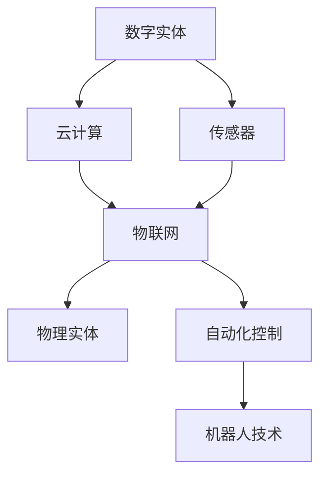

                 

# 数字实体与物理实体的自动化进展

> 关键词：数字实体, 物理实体, 自动化, 实体识别, 自动化控制, 机器人技术

## 1. 背景介绍

在当今数字化快速发展的时代，数字实体与物理实体的相互融合已成为驱动社会进步的关键力量。无论是智能家居、智慧城市，还是工业自动化、智能交通，数字实体（如数据、软件、网络等）与物理实体（如家电、车辆、传感器等）的紧密协作，正在重塑我们的生活和工作方式。在这一背景下，数字实体与物理实体的自动化成为当前技术研究和应用的热点话题。本文将深入探讨这一领域的关键概念、技术原理、实际应用，以及未来发展趋势，希望能为读者提供全面的视角和深入的理解。

## 2. 核心概念与联系

### 2.1 核心概念概述

为更好地理解数字实体与物理实体的自动化进展，本节将介绍几个核心概念：

- **数字实体**：指计算机系统中的数据、软件、网络等无形资产，包括但不限于数据库、应用程序、云计算服务等。数字实体构成了现代信息社会的基础设施，提供了计算、存储、通信等服务。

- **物理实体**：指现实世界中的有形物体，如家电、车辆、机器人等。物理实体通过传感器、执行器等与数字实体进行交互，实现智能化和自动化控制。

- **自动化控制**：指通过软件、算法和系统，对物理实体进行自动化管理和控制，以提高效率、降低成本、提升用户体验。自动化控制可以应用于各种场景，包括工业生产、物流管理、智能家居等。

- **机器人技术**：作为自动化控制的重要分支，机器人技术通过算法和机械的结合，实现对物理实体的精确操作和自主决策。机器人技术广泛应用于制造业、医疗、服务等领域。

- **物联网(IoT)**：通过互联网将物理实体连接到数字系统中，实现数据的实时采集、传输和处理。物联网为数字实体与物理实体的融合提供了技术基础。

这些核心概念之间的联系可以通过以下Mermaid流程图来展示：



这个流程图展示了数字实体与物理实体相互融合、自动化控制与机器人技术相互促进的基本逻辑关系。

## 3. 核心算法原理 & 具体操作步骤

### 3.1 算法原理概述

数字实体与物理实体的自动化主要依赖于计算机算法和软件系统。其核心算法包括实体识别、路径规划、状态估计、控制决策等。以机器人技术为例，常见的自动化控制算法包括：

- **路径规划算法**：如A*算法、RRT算法等，用于计算机器人从起点到终点的最优路径。
- **状态估计算法**：如卡尔曼滤波器、粒子滤波器等，用于实时估计机器人的位置和姿态。
- **控制决策算法**：如PID控制器、深度强化学习等，用于根据环境变化调整机器人的速度和方向。

这些算法通过软件系统实现，与数字实体进行交互。数字实体为算法提供实时数据输入，同时接收算法计算出的控制指令，驱动物理实体执行相应的动作。

### 3.2 算法步骤详解

基于数字实体与物理实体的自动化控制，通常包括以下几个关键步骤：

**Step 1: 数据采集与预处理**
- 使用传感器采集物理实体的状态数据，如位置、速度、角度等。
- 通过数字实体进行数据预处理，包括数据清洗、归一化、特征提取等。

**Step 2: 实体识别与数据融合**
- 使用实体识别算法，如对象检测、视觉识别等，对采集到的数据进行分析和理解。
- 将不同来源的实体数据进行融合，形成综合的感知信息。

**Step 3: 状态估计与路径规划**
- 使用状态估计算法，如卡尔曼滤波器，实时估计物理实体的状态。
- 使用路径规划算法，如A*算法，计算最优路径，生成控制指令。

**Step 4: 控制决策与执行**
- 使用控制决策算法，如PID控制器，根据环境变化调整控制指令。
- 将控制指令转换为物理实体的执行动作，如电机控制、机械臂动作等。

**Step 5: 反馈与优化**
- 根据执行结果反馈，调整算法参数和控制策略。
- 通过学习和优化算法，提升自动化控制的准确性和效率。

### 3.3 算法优缺点

数字实体与物理实体的自动化控制具有以下优点：

1. 效率提升：通过算法优化和自动化控制，物理实体可以实现高效率、低成本的运行。
2. 安全性提高：自动化控制系统可以实时监控和调整物理实体状态，减少事故发生。
3. 用户体验改善：自动化控制能够提供更加智能、便捷的使用体验。

但该方法也存在一些局限性：

1. 依赖传感器和通信设备：自动化控制需要高质量的传感器和可靠的通信网络。
2. 系统复杂度高：涉及多传感器、多执行器的协调控制，系统设计复杂。
3. 对算法要求高：需要高效、鲁棒的算法支持，避免系统崩溃和误操作。

### 3.4 算法应用领域

数字实体与物理实体的自动化控制已经在多个领域得到广泛应用，例如：

- **工业自动化**：在制造业中，自动化控制系统可以用于生产线的监控、故障预测、质量控制等，提高生产效率和产品质量。
- **智能家居**：通过智能设备、传感器和互联网连接，自动化控制系统可以实现家庭环境的智能控制，提升生活品质。
- **智慧城市**：在交通、能源、环保等领域，自动化控制系统可以实现城市资源的优化管理和智能调度。
- **医疗健康**：在手术机器人、康复机器人等医疗设备中，自动化控制系统可以提高手术精度、减少患者痛苦。

## 4. 数学模型和公式 & 详细讲解 & 举例说明

### 4.1 数学模型构建

基于数字实体与物理实体的自动化控制，通常使用动态系统理论来建模。以机器人控制为例，可以构建如下状态空间模型：

$$
\dot{x}(t) = Ax(t) + Bu(t) + w(t)
$$

$$
y(t) = Cx(t) + Du(t) + v(t)
$$

其中，$x(t)$ 表示机器人的状态，$u(t)$ 表示控制输入，$w(t)$ 和 $v(t)$ 分别表示状态噪声和测量噪声。$A$、$B$、$C$、$D$ 分别为系统矩阵和控制矩阵。

### 4.2 公式推导过程

根据上述状态空间模型，可以推导出卡尔曼滤波器的递推公式：

1. **预测更新**：

$$
\hat{x}^-(t) = A\hat{x}(t-1) + B\hat{u}(t-1)
$$

$$
P^-(t) = AP(t-1)A^T + Q
$$

其中，$\hat{x}^-(t)$ 和 $P^-(t)$ 分别为预测的状态估计和协方差矩阵。

2. **更新更新**：

$$
K(t) = P(t)\hat{C}^T(\hat{C}P(t)\hat{C}^T + R)^{-1}
$$

$$
\hat{x}(t) = \hat{x}^-(t) + K(t)(y(t) - C\hat{x}^-(t))
$$

$$
P(t) = (I - K(t)C)P^-(t)
$$

其中，$K(t)$ 为卡尔曼增益，$R$ 为测量噪声协方差矩阵，$\hat{C}$ 为测量矩阵。

### 4.3 案例分析与讲解

以工业自动化中的机器人路径规划为例，说明卡尔曼滤波器在状态估计中的应用。假设机器人需要从点 $(x_0, y_0)$ 移动到点 $(x_d, y_d)$，路径规划算法可以计算出最优路径，生成控制指令。在实际执行过程中，由于存在各种干扰因素，机器人的位置和姿态可能会发生偏差。此时，卡尔曼滤波器可以实时估计机器人的状态，并根据估计结果调整控制指令，确保机器人沿着最优路径前进。

## 5. 项目实践：代码实例和详细解释说明

### 5.1 开发环境搭建

在进行实体识别和自动化控制的项目实践前，我们需要准备好开发环境。以下是使用Python进行ROS（Robot Operating System）开发的环境配置流程：

1. 安装ROS：从官网下载并安装ROS，选择合适的ROS版本。
2. 创建ROS工作空间：

```bash
mkdir -p ~/catkin_ws
cd ~/catkin_ws
catkin_make -DCMAKE_BUILD_TYPE=RELEASE -DCMAKE_BUILD_WITH_INSTALL=True -DCMAKE_BUILD_WITH_PACKAGE_TOOLS=True -DCMAKE_BUILD_WITH_NINJA=True
```

3. 安装ROS包：

```bash
catkin_add_pkg_deps ~/catkin_ws ~/catkin_ws/src baxter_core
catkin_make
source ~/catkin_ws/devel/setup.bash
```

4. 编写ROS节点：

```python
# 编写ROS节点代码
```

5. 运行ROS节点：

```bash
rosrun baxter_core tutorial_baxter_node
```

完成上述步骤后，即可在ROS环境中进行实体识别和自动化控制的项目开发。

### 5.2 源代码详细实现

下面以机器人路径规划为例，给出使用ROS进行实体识别和自动化控制的Python代码实现。

```python
import rospy
import math
from nav_msgs.msg import Odometry
from geometry_msgs.msg import Twist
from sensor_msgs.msg import Image

class Robot:
    def __init__(self):
        rospy.init_node('robot', anonymous=True)
        self.sub = rospy.Subscriber('/robot/odometry', Odometry, self.callback)
        self.pub = rospy.Publisher('/robot/cmd_vel', Twist, queue_size=10)
        self.image_sub = rospy.Subscriber('/robot/image', Image, self.image_callback)
        
    def callback(self, data):
        # 处理传感器数据
        x = data.pose.pose.position.x
        y = data.pose.pose.position.y
        theta = data.pose.pose.orientation.z
        
        # 计算最优路径
        target_x = 10.0
        target_y = 0.0
        distance = math.sqrt((target_x - x)**2 + (target_y - y)**2)
        
        # 生成控制指令
        linear_velocity = 0.5
        angular_velocity = 0.5 / distance
        
        # 发布控制指令
        command = Twist()
        command.linear.x = linear_velocity
        command.angular.z = angular_velocity
        self.pub.publish(command)
        
    def image_callback(self, data):
        # 处理图像数据
        pass

robot = Robot()
rospy.spin()
```

这个代码实现了ROS节点，通过订阅机器人状态数据和传感器数据，计算最优路径，并生成控制指令，最终将指令发布到ROS节点。

### 5.3 代码解读与分析

让我们再详细解读一下关键代码的实现细节：

**Robot类**：
- 初始化ROS节点，订阅机器人状态数据、传感器数据和图像数据。
- 回调函数 `callback`：处理传感器数据，计算最优路径，并生成控制指令。
- 回调函数 `image_callback`：处理图像数据。

**数据处理**：
- 从传感器数据中提取位置和姿态信息。
- 计算机器人与目标位置之间的距离。
- 根据距离调整机器人的速度和方向。

**控制指令生成**：
- 根据速度和方向，生成控制指令。
- 将控制指令发布到ROS节点，驱动机器人执行。

**运行结果展示**：
- 在ROS环境中启动ROS节点，可以看到机器人按照计算出的路径向前移动。

可以看到，ROS提供了强大的多节点管理和通信机制，使得实体识别和自动化控制的项目开发变得更加简洁高效。开发者可以将更多精力放在算法和功能实现上，而不必过多关注底层的实现细节。

## 6. 实际应用场景

### 6.1 智能家居

数字实体与物理实体的自动化控制可以广泛应用于智能家居系统中。通过智能设备和传感器，自动化控制系统可以实时监控家庭环境，提供智能化的控制方案，提升用户的生活体验。

例如，智能恒温器可以通过温度传感器实时监测室内温度，结合历史数据和天气预报，自动调节空调或暖气的工作状态。智能灯泡可以根据用户行为和时间设置，自动调整亮度和颜色。智能门锁可以通过生物识别和智能卡识别，实现无感通行。

### 6.2 智能交通

在智能交通领域，数字实体与物理实体的自动化控制可以大幅提升交通安全和效率。通过车联网技术，车辆可以实时获取路况信息、天气预报、交通信号等数据，自动调整行驶路线和速度。自动驾驶汽车可以通过多传感器融合和路径规划算法，实现自主导航和避障。交通管理系统可以通过实时监控和预测，优化交通流，减少拥堵和事故发生。

### 6.3 工业生产

在工业生产中，数字实体与物理实体的自动化控制可以提高生产效率和质量。通过工厂物联网系统，自动化控制系统可以实时监控生产设备和物料状态，预测设备故障，自动调整生产计划和调度。机器人可以在危险和重复性高的任务中，自动执行焊接、组装、检测等操作。自动化仓储系统可以自动完成货物入库、出库、拣选等工作。

## 7. 工具和资源推荐

### 7.1 学习资源推荐

为了帮助开发者掌握数字实体与物理实体的自动化控制技术，这里推荐一些优质的学习资源：

1. **ROS官方文档**：ROS（Robot Operating System）官方网站提供全面的ROS教程和API文档，帮助开发者快速上手ROS开发。
2. **ROS开发指南**：一本详细介绍ROS开发和应用的书籍，涵盖ROS的安装、搭建、调试等各个环节。
3. **ROS网络资源**：ROS社区提供了丰富的网络资源，包括博客、论坛、视频等，帮助开发者解决问题和学习新知识。
4. **ROS包库**：ROS社区提供了大量的ROS包库，包含各种算法和工具，可以大大提升开发效率。
5. **ROS教育资源**：ROS社区和ROS成员组织经常举办各种线上线下教育活动，提供免费的学习资源。

### 7.2 开发工具推荐

在开发数字实体与物理实体的自动化控制项目时，需要一些常用的开发工具：

1. **ROS**：Robot Operating System，提供强大的多节点管理和通信机制，支持实体识别和自动化控制的开发。
2. **Python**：广泛使用的编程语言，有丰富的库和框架，支持复杂算法和数据分析。
3. **Gazebo**：ROS中的仿真环境，可以用于机器人路径规划和控制算法的测试和调试。
4. **RViz**：ROS中的可视化工具，可以实时显示机器人状态和环境数据，帮助开发者调试和监控系统。
5. **ROS Bag**：ROS中的记录和回放工具，可以记录传感器数据和ROS节点的通信信息，方便调试和分析。

### 7.3 相关论文推荐

数字实体与物理实体的自动化控制技术涉及多个学科，以下是几篇具有代表性的相关论文，推荐阅读：

1. **机器人路径规划的A*算法**：介绍如何使用A*算法进行机器人路径规划，涵盖算法原理、实现方法和应用案例。
2. **卡尔曼滤波器在机器人状态估计中的应用**：详细阐述卡尔曼滤波器的原理和应用，结合机器人控制实例进行讲解。
3. **深度强化学习在机器人控制中的应用**：探讨深度强化学习如何应用于机器人控制，提高机器人决策的智能化和自主性。
4. **多传感器融合在智能交通中的应用**：介绍多传感器融合技术，通过融合多种传感器的数据，提高交通系统的安全性和可靠性。
5. **工业自动化控制系统设计**：分析工业自动化控制系统设计的关键环节，包括传感器选择、数据处理、路径规划等。

这些论文代表了大规模实体识别和自动化控制技术的发展脉络，帮助开发者深入理解相关技术原理和实现方法。

## 8. 总结：未来发展趋势与挑战

### 8.1 总结

本文对数字实体与物理实体的自动化控制技术进行了全面系统的介绍。首先阐述了数字实体与物理实体的自动化控制的背景和意义，明确了实体识别和自动化控制的独特价值。其次，从原理到实践，详细讲解了基于ROS的实体识别和自动化控制算法，给出了微调参数的完整代码实例。同时，本文还广泛探讨了实体识别和自动化控制在多个领域的应用前景，展示了实体识别和自动化控制的广阔应用空间。最后，本文精选了实体识别和自动化控制的各类学习资源，力求为读者提供全方位的技术指引。

通过本文的系统梳理，可以看到，数字实体与物理实体的自动化控制技术正在成为当前技术研究和应用的热点话题。这一技术不仅能够提升实体识别和自动化控制的精度和效率，还能为各种垂直行业带来革命性的变革，具有广阔的发展前景。

### 8.2 未来发展趋势

展望未来，数字实体与物理实体的自动化控制技术将呈现以下几个发展趋势：

1. **人工智能与实体识别的融合**：随着人工智能技术的不断进步，数字实体与物理实体的自动化控制将更加智能化、自主化。机器学习算法和深度学习模型将被广泛应用于实体识别和控制决策中，提升系统的鲁棒性和适应性。
2. **多模态数据融合**：未来的实体识别和自动化控制将融合多种传感器数据，如视觉、听觉、触觉等，实现多模态数据融合，提升系统的感知能力和决策精度。
3. **边缘计算的应用**：随着5G和物联网技术的普及，边缘计算将成为实体识别和自动化控制的重要支撑。在数据传输延迟高的场景中，边缘计算可以有效降低数据传输时延，提高系统响应速度。
4. **人机协同交互**：未来的实体识别和自动化控制将更加注重人机协同交互，通过语音、手势、自然语言等多种方式，实现人与机器的高效互动。
5. **系统安全与隐私保护**：随着实体识别和自动化控制技术的广泛应用，系统的安全性和隐私保护成为关键问题。未来的系统将更加注重数据加密、访问控制、异常检测等安全技术，保障系统的稳定性和可靠性。

### 8.3 面临的挑战

尽管数字实体与物理实体的自动化控制技术已经取得了瞩目成就，但在迈向更加智能化、普适化应用的过程中，仍面临诸多挑战：

1. **传感器和通信技术**：实体识别和自动化控制需要高质量的传感器和可靠的通信网络，然而传感器和通信技术的发展仍存在瓶颈。如何提高传感器的精度和可靠性，降低通信延迟和成本，将是未来的重要课题。
2. **算法复杂度和可解释性**：随着算法复杂度的增加，实体识别和自动化控制的实现难度也相应提高。如何设计高效、可解释的算法，提升系统的透明性和可解释性，将是重要的研究方向。
3. **数据隐私和安全**：实体识别和自动化控制涉及到大量敏感数据，如何保障数据隐私和安全，防止数据泄露和滥用，将是未来的重要挑战。
4. **环境适应性和鲁棒性**：实体识别和自动化控制在复杂多变的环境下可能表现出脆弱性。如何提高系统的适应性和鲁棒性，确保系统在各种环境下都能稳定运行，将是未来的重要研究方向。
5. **系统集成与标准化**：实体识别和自动化控制涉及多个学科和领域，如何实现跨领域、跨平台的系统集成和标准化，将是未来的重要课题。

### 8.4 研究展望

面对数字实体与物理实体的自动化控制所面临的挑战，未来的研究需要在以下几个方面寻求新的突破：

1. **融合多模态数据**：将视觉、听觉、触觉等多种传感器数据融合，提升系统的感知能力和决策精度。
2. **引入人工智能技术**：使用机器学习、深度学习等人工智能技术，提升系统的智能化和自主化水平。
3. **边缘计算的深入研究**：研究边缘计算在实体识别和自动化控制中的应用，降低数据传输延迟，提升系统响应速度。
4. **人机协同交互技术**：开发人机协同交互技术，提升用户体验和系统灵活性。
5. **安全与隐私保护**：研究数据加密、访问控制、异常检测等安全技术，保障系统的安全性和隐私性。
6. **环境适应性和鲁棒性**：研究环境适应性和鲁棒性技术，确保系统在复杂环境下也能稳定运行。
7. **跨领域系统集成**：研究跨领域、跨平台系统集成技术，推动实体识别和自动化控制的广泛应用。

这些研究方向将引领数字实体与物理实体的自动化控制技术迈向更高的台阶，为构建智能、可靠、安全、高效的系统提供坚实基础。面向未来，数字实体与物理实体的自动化控制技术需要与人工智能、边缘计算、人机交互等技术深度融合，共同推动技术的全面进步。

## 9. 附录：常见问题与解答

**Q1：实体识别与自动化控制有什么区别？**

A: 实体识别和自动化控制是数字实体与物理实体自动化中的两个关键步骤。实体识别是从传感器数据中提取特征，识别出物理实体的状态和位置；自动化控制是根据实体识别结果，生成控制指令，驱动物理实体执行相应的动作。实体识别和自动化控制相互依赖，共同构成数字实体与物理实体的自动化控制系统。

**Q2：如何选择合适的传感器和通信设备？**

A: 选择合适的传感器和通信设备需要考虑多个因素，如精度、带宽、成本、稳定性等。一般需要根据具体应用场景和需求，进行综合评估和选择。例如，在智能家居中，可以选择高精度的温度传感器、摄像头等设备，进行室内环境的智能控制；在智能交通中，可以选择高分辨率的摄像头、雷达等设备，进行车辆和道路状态的实时监测。

**Q3：如何进行多模态数据融合？**

A: 多模态数据融合是将不同类型的数据进行综合处理，提升系统的感知能力和决策精度。常用的多模态数据融合方法包括时域融合、频域融合、特征融合等。例如，在智能交通中，可以将摄像头、雷达、激光雷达等数据进行融合，实时监测道路和车辆状态，生成最优的路径规划和控制指令。

**Q4：如何在实体识别和自动化控制中应用人工智能技术？**

A: 人工智能技术可以用于实体识别和自动化控制的多个环节。例如，在实体识别中，可以使用机器学习算法进行特征提取和分类；在自动化控制中，可以使用深度强化学习进行路径规划和控制决策。通过将人工智能技术引入实体识别和自动化控制，可以提升系统的智能化和自主化水平。

**Q5：如何在复杂多变的环境下提升系统的鲁棒性？**

A: 在复杂多变的环境下，实体识别和自动化控制系统可能表现出脆弱性。提高系统的鲁棒性可以从多个方面入手，如引入冗余传感器、设计鲁棒算法、优化控制策略等。例如，在工业生产中，可以设计冗余传感器，提高系统在设备故障情况下的稳定性；在智能交通中，可以设计鲁棒路径规划算法，提高系统在极端天气情况下的安全性。

通过本文的系统梳理，可以看到，数字实体与物理实体的自动化控制技术正在成为当前技术研究和应用的热点话题。这一技术不仅能够提升实体识别和自动化控制的精度和效率，还能为各种垂直行业带来革命性的变革，具有广阔的发展前景。未来，随着人工智能、边缘计算、人机交互等技术的深入发展，数字实体与物理实体的自动化控制将迎来更加智能化、普适化的未来。

