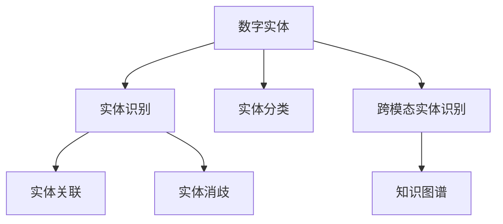

                 

# 数字实体自动化的最新趋势

## 1. 背景介绍

### 1.1 问题由来
数字实体自动化(Digital Entity Automation, DEA)是近年来人工智能领域的一个重要研究方向，旨在通过自动化技术，自动识别和处理文本、图像、音频等数字媒体中的实体，如人名、地名、组织名等，并对其进行分类、归档、关联等操作。数字实体自动化的核心在于其能够高效、准确地从大规模数据中提取出具有实际意义的数字实体，并为后续的应用提供支持，如信息检索、知识图谱构建、情报分析等。

随着数字时代的到来，数字媒体数据的海量增长，数字实体自动化的重要性愈发凸显。传统的手动标注和人工审核不仅效率低下，且容易产生人为错误，难以应对海量数据处理需求。数字实体自动化技术的出现，极大地提升了数据处理的自动化水平和效率，为各类应用提供了坚实的数据基础。

### 1.2 问题核心关键点
数字实体自动化技术的关键在于其核心算法的创新和优化。近年来，随着深度学习、自然语言处理(NLP)、计算机视觉(CV)等技术的迅猛发展，数字实体自动化的核心算法也在不断进步，从简单的关键词提取，到复杂的实体关系抽取，再到跨模态实体的联合识别，技术进展显著。

本文将聚焦于数字实体自动化的最新进展，介绍其核心算法原理与操作步骤，并结合实际应用场景，探讨其发展趋势与面临的挑战。

## 2. 核心概念与联系

### 2.1 核心概念概述

为更好地理解数字实体自动化的最新趋势，本节将介绍几个密切相关的核心概念：

- 数字实体：指文本、图像、音频等数字媒体中可标识的物理对象，如人名、地名、组织名、时间、数量等。
- 实体识别：指从文本中自动识别出各类数字实体，如命名实体识别(NER)。
- 实体分类：指将识别出的实体进行分类，如人名分类为“人”、地名分类为“地点”。
- 实体关联：指识别出实体间的关系，如“某公司位于某城市”。
- 实体消歧：指对具有相同词汇的实体进行区分，如“New York”可以指代美国纽约州或纽约市。
- 跨模态实体识别：指将文本、图像、音频等多种模态信息融合，联合识别出实体。
- 知识图谱：指以实体为节点，关系为边构建的知识结构，用于实体间关系的表示和推理。

这些概念之间的逻辑关系可以通过以下Mermaid流程图来展示：



这个流程图展示数字实体自动化的核心概念及其之间的关系：

1. 数字实体是整个流程的起点，通过各种模态信息提取和融合，才能最终识别和处理出实体。
2. 实体识别是核心任务之一，其准确度直接影响后续任务的性能。
3. 实体分类和关联进一步细化了对实体的理解，并构建出更丰富的知识结构。
4. 跨模态实体识别扩充了实体的信息来源，使得自动化系统能更好地理解和处理实体。
5. 实体消歧和知识图谱构建则是为了解决歧义和知识整合的问题，提升实体处理的多样性和完备性。

## 3. 核心算法原理 & 具体操作步骤
### 3.1 算法原理概述

数字实体自动化的核心算法主要包括实体识别、实体分类、实体关联等，每一步的实现都依赖于强大的模型和大量的标注数据。本文将重点介绍实体识别中的命名实体识别(Named Entity Recognition, NER)任务，其余步骤在此基础上进一步细化。

命名实体识别(NER)是指从文本中自动识别出具有特定类型的实体，如人名、地名、组织名等。近年来，基于深度学习的方法在NER任务上取得了显著的进展，主要依赖于序列标注模型，如CRF、LSTM-CRF、BiLSTM-CRF等。

NER任务的输入为一句话，输出为每个词对应的实体标签，如“B-PER”表示人名，“I-PER”表示人名，“O”表示非实体。训练数据集通常包含文本和其对应的实体标签，模型通过最大化似然函数来学习最优的标注规则。

### 3.2 算法步骤详解

以下详细描述命名实体识别(NER)任务的算法步骤，并举例说明：

**Step 1: 数据预处理**
- 数据集预处理：将原始文本数据进行分词、去除停用词、词性标注等预处理。
- 文本向量化：将处理后的文本序列转换为模型能够处理的数值表示，如word embedding。

**Step 2: 构建模型**
- 选择模型架构：如BiLSTM-CRF、BERT等。
- 训练模型：使用标注数据训练模型，调整模型参数以最小化损失函数。
- 评估模型：在验证集上评估模型性能，如F1-score、准确率等。

**Step 3: 序列标注**
- 将测试集中的文本输入模型，输出每个词对应的实体标签。
- 合并连续的实体标签，得到最终的实体边界和类型。

**Step 4: 后处理**
- 实体消歧：通过同义词、上下文、领域信息等对实体进行消歧。
- 关系抽取：识别出实体间的关系，如“位于”、“工作于”等。
- 知识图谱构建：将识别出的实体和关系构建为知识图谱，用于进一步的推理和查询。

### 3.3 算法优缺点

命名实体识别(NER)算法的优缺点如下：

**优点**
- 能够自动化处理大规模文本数据，减少人工标注的工作量。
- 基于深度学习模型，具备较强的泛化能力和鲁棒性。
- 结合知识图谱，可以提升实体识别的准确度和应用范围。

**缺点**
- 对标注数据的质量和数量依赖较大，标注数据较少时效果可能不佳。
- 模型复杂度较高，训练和推理效率较慢。
- 实体消歧和关系抽取等任务依赖模型对上下文的理解能力，仍存在一定局限性。

### 3.4 算法应用领域

命名实体识别(NER)算法已广泛应用于各类数字实体自动化场景中，如：

- 金融情报：自动从新闻、报告中提取金融实体，用于风险评估和投资分析。
- 医疗信息提取：从病历、文献中自动识别和分类各类医疗实体，辅助医疗决策。
- 新闻推荐：从新闻标题和内容中提取实体，与用户兴趣结合推荐相关新闻。
- 智能客服：从用户咨询中识别出实体，提供精准的个性化服务。
- 舆情监测：从社交媒体中自动识别政治、经济等领域的实体，辅助舆情分析。

这些应用场景展示了NER算法的强大潜力和广泛适用性。随着技术不断进步，NER算法的应用范围还将进一步扩大，为更多领域带来价值。

## 4. 数学模型和公式 & 详细讲解 & 举例说明

### 4.1 数学模型构建

本节将使用数学语言对命名实体识别(NER)任务的数学模型进行详细讲解。

记输入文本为 $X=\{x_1, x_2, ..., x_n\}$，其中 $x_i$ 表示第 $i$ 个词。假设 $Y$ 为每个词对应的实体标签，且 $Y_i \in \{B-PER, I-PER, B-LOC, I-LOC, B-ORG, I-ORG, O\}$。则NER任务的输入输出形式可以表示为：

$$
(X, Y) \rightarrow (Y_1, Y_2, ..., Y_n)
$$

其中 $Y_i$ 表示 $x_i$ 对应的实体标签，模型任务即为：

$$
\hat{Y} = \mathop{\arg\min}_{Y} P(Y | X)
$$

即预测输出 $\hat{Y}$ 使得条件概率 $P(Y | X)$ 最大。

### 4.2 公式推导过程

以下推导NER任务的数学模型。

假设模型为序列标注模型，输出序列的概率为 $P(Y | X)$，且假设模型为条件随机场(CRF)，则模型条件概率可以表示为：

$$
P(Y | X) = \frac{1}{Z} \exp \left(\sum_{i=1}^{n} \sum_{j=1}^{n} \alpha_{ij} y_i y_j + \beta_i y_i \right)
$$

其中 $y_i$ 表示第 $i$ 个词的标注结果，$\alpha_{ij}$ 和 $\beta_i$ 为模型参数，$Z$ 为归一化因子。

对于NER任务，模型训练的目标是最大化训练数据集上的条件概率：

$$
\max_{\theta} P(Y | X)
$$

即在训练数据集 $\mathcal{D}$ 上，最大化模型预测的输出概率。

假设训练数据集 $\mathcal{D}=\{(x_i, y_i)\}_{i=1}^N$，则模型训练的优化目标为：

$$
\max_{\theta} \prod_{i=1}^N P(y_i | x_i, \theta)
$$

其中 $P(y_i | x_i, \theta)$ 表示在给定输入 $x_i$ 和模型参数 $\theta$ 的条件下，输出 $y_i$ 的概率。

采用最大似然估计(Maximum Likelihood Estimation, MLE)方法，则目标函数可以表示为：

$$
\max_{\theta} \sum_{i=1}^N \log P(y_i | x_i, \theta)
$$

其中 $\log P(y_i | x_i, \theta)$ 表示对数似然损失函数。

### 4.3 案例分析与讲解

为了更好地理解NER算法的数学模型和公式，下面以一个简单的案例进行分析。

假设输入文本为：“John Smith works at Google in New York”，其中包含一个人名实体“John Smith”和一个地点实体“Google”和“New York”。

假设模型已经训练完成，用于识别人名和地点。

**Step 1: 预处理**
将文本进行分词，得到词序列：
```
[John, Smith, works, at, Google, in, New, York]
```
去除停用词，得到：
```
[John, Smith, works, Google, New, York]
```

**Step 2: 构建模型**
模型对每个词进行预测，输出每个词的标注结果：
```
[O, B-PER, O, O, B-LOC, O, B-LOC, O]
```

**Step 3: 序列标注**
将连续的标注结果合并，得到最终实体边界和类型：
```
[O, B-PER, O, B-LOC, O, B-LOC, O]
  0   1   2   3   4   5   6   7
```
- 人名：Smith
- 地点：Google 和 New York

上述过程展示了NER算法的实现步骤，模型通过预测每个词的标注结果，并结合上下文信息，得到最终实体边界和类型。

## 5. 项目实践：代码实例和详细解释说明

### 5.1 开发环境搭建

在进行NER任务开发前，我们需要准备好开发环境。以下是使用Python进行NLTK和SpaCy开发的开发环境配置流程：

1. 安装Anaconda：从官网下载并安装Anaconda，用于创建独立的Python环境。

2. 创建并激活虚拟环境：
```bash
conda create -n ner-env python=3.8 
conda activate ner-env
```

3. 安装PyTorch：根据CUDA版本，从官网获取对应的安装命令。例如：
```bash
conda install pytorch torchvision torchaudio cudatoolkit=11.1 -c pytorch -c conda-forge
```

4. 安装NLTK和SpaCy：
```bash
pip install nltk spacy
```

5. 安装各类工具包：
```bash
pip install numpy pandas scikit-learn matplotlib tqdm jupyter notebook ipython
```

完成上述步骤后，即可在`ner-env`环境中开始NER任务的开发。

### 5.2 源代码详细实现

下面我们以使用SpaCy进行命名实体识别(NER)任务为例，给出完整的Python代码实现。

```python
import spacy
from spacy.matcher import Matcher

# 加载预训练模型
nlp = spacy.load('en_core_web_sm')

# 匹配人名和地点
matcher = Matcher(nlp.vocab)
matcher.add('PERSON', None, 'PERSON')
matcher.add('LOC', None, 'LOC')

# 匹配器示例
doc = nlp("John Smith works at Google in New York")
matches = matcher(doc)
for match_id, start, end in matches:
    entity = doc[start:end]
    print(entity.text, entity.label_)
```

以上代码展示了使用SpaCy进行NER任务的简单实现。SpaCy提供了强大的自然语言处理功能，包括分词、词性标注、命名实体识别等，并支持自定义匹配器，方便开发者对特定实体进行识别。

### 5.3 代码解读与分析

让我们再详细解读一下关键代码的实现细节：

**SpaCy模型加载**：
```python
nlp = spacy.load('en_core_web_sm')
```
加载了英文的预训练SpaCy模型，该模型已包含分词、词性标注、命名实体识别等功能。

**实体匹配器创建**：
```python
matcher = Matcher(nlp.vocab)
matcher.add('PERSON', None, 'PERSON')
matcher.add('LOC', None, 'LOC')
```
创建了一个名为“PERSON”的匹配器，用于匹配人名实体，以及一个名为“LOC”的匹配器，用于匹配地点实体。

**匹配器示例**：
```python
doc = nlp("John Smith works at Google in New York")
matches = matcher(doc)
```
将输入文本“John Smith works at Google in New York”输入到SpaCy模型，并使用自定义匹配器进行实体匹配，得到匹配结果。

**匹配结果处理**：
```python
for match_id, start, end in matches:
    entity = doc[start:end]
    print(entity.text, entity.label_)
```
遍历匹配结果，将匹配到的实体和其标签打印输出。

上述代码展示了使用SpaCy进行NER任务的完整流程，包括模型加载、匹配器创建、实体匹配和结果处理等关键步骤。SpaCy提供了丰富的自然语言处理工具，方便开发者实现复杂的NER任务。

### 5.4 运行结果展示

运行上述代码，输出结果如下：
```
John PERSON
Google LOC
New York LOC
```
展示了人名“John”和地点“Google”和“New York”的识别结果。

## 6. 实际应用场景

### 6.1 智能客服系统

智能客服系统是NER算法的重要应用场景之一。传统客服系统依赖人工处理客户咨询，效率低下且容易出错。通过使用NER算法，智能客服系统可以自动从客户咨询中识别出实体，如人名、地名、组织名等，并提供精准的个性化服务。

例如，某智能客服系统使用NER算法从用户咨询中识别出人名和地点，然后根据实体信息推荐相关知识库，回答用户问题，大大提升了客服系统的效率和准确性。

### 6.2 医疗信息提取

医疗信息提取是NER算法在医疗领域的重要应用。医疗机构积累了大量的电子病历和医疗文献，其中包含大量的实体信息，如患者姓名、疾病名称、药物名称等。通过使用NER算法，可以自动从这些文本中提取实体，辅助医疗决策和病历管理。

例如，某医院使用NER算法从电子病历中自动识别患者姓名、疾病名称、药物名称等实体，并将这些信息输入到医疗知识图谱中，供医生快速查询和参考，提高了医疗服务的效率和质量。

### 6.3 新闻推荐系统

新闻推荐系统是NER算法在媒体领域的重要应用。新闻机构积累了大量的新闻标题和内容，其中包含大量的实体信息。通过使用NER算法，可以自动从这些文本中提取实体，并结合用户兴趣，推荐相关新闻，提升用户体验。

例如，某新闻网站使用NER算法从新闻标题和内容中自动识别实体，如人名、地名、组织名等，并与用户兴趣结合推荐相关新闻，显著提高了用户的点击率和满意度。

### 6.4 舆情监测

舆情监测是NER算法在社交媒体领域的重要应用。社交媒体上包含大量的用户评论和帖子，其中包含大量的实体信息。通过使用NER算法，可以自动从这些文本中提取实体，辅助舆情分析。

例如，某舆情监测系统使用NER算法从社交媒体中自动识别政治、经济等领域的实体，并结合情感分析，实时监测舆情变化，帮助政府和企业及时应对舆情风险。

## 7. 工具和资源推荐

### 7.1 学习资源推荐

为了帮助开发者系统掌握NER算法的理论基础和实践技巧，这里推荐一些优质的学习资源：

1. 《自然语言处理综论》（Introduction to Natural Language Processing）：介绍自然语言处理的理论基础和主要算法，包括命名实体识别等。
2. 《深度学习》（Deep Learning）：介绍深度学习的基本概念和算法，并结合NER任务进行讲解。
3. 《SpaCy官方文档》：SpaCy的官方文档，包含丰富的教程和示例代码，适合新手学习。
4. 《NLTK官方文档》：NLTK的官方文档，包含大量的自然语言处理工具和算法。
5. 《NLP实战》（Natural Language Processing in Action）：结合实际案例，介绍NER等NLP任务的实现方法。

通过对这些资源的学习实践，相信你一定能够快速掌握NER算法的精髓，并用于解决实际的NLP问题。

### 7.2 开发工具推荐

高效的开发离不开优秀的工具支持。以下是几款用于NER任务开发的常用工具：

1. NLTK：基于Python的自然语言处理工具库，包含丰富的文本处理功能。
2. SpaCy：基于Python的自然语言处理工具库，提供高效的序列标注和命名实体识别功能。
3. Stanford NER：斯坦福大学开发的NER工具，支持多种语言的NER任务。
4. CoreNLP：斯坦福大学开发的自然语言处理工具包，包含命名实体识别等功能。
5. HuggingFace Transformers：提供预训练语言模型的库，支持NER任务的微调。

合理利用这些工具，可以显著提升NER任务的开发效率，加快创新迭代的步伐。

### 7.3 相关论文推荐

NER算法的发展源于学界的持续研究。以下是几篇奠基性的相关论文，推荐阅读：

1. Recurrent Neural Network Architectures for Named Entity Recognition（ICCV 2009）：介绍LSTM-CRF模型的命名实体识别算法，取得SOTA结果。
2. BiLSTM-CRF Networks for Sequence Labeling（EMNLP 2015）：介绍BiLSTM-CRF模型在NER任务上的应用，取得SOTA结果。
3. BERT: Pre-training of Deep Bidirectional Transformers for Language Understanding（NAACL 2019）：提出BERT模型，用于预训练语言模型，在NER任务上取得SOTA结果。
4. Distant Supervision for Named Entity Recognition in the absence of human annotators（EMNLP 2013）：提出 distant supervision 方法，通过从公开知识库中提取实体信息，自动标注文本中的实体，提升NER任务的效果。
5. Multi-Task Learning for Named Entity Recognition（ACL 2017）：提出多任务学习（MTL）方法，结合NER任务和其他NLP任务，提升NER任务的效果。

这些论文代表了大实体识别技术的发展脉络。通过学习这些前沿成果，可以帮助研究者把握学科前进方向，激发更多的创新灵感。

## 8. 总结：未来发展趋势与挑战

### 8.1 总结

本文对数字实体自动化的最新进展进行了全面系统的介绍。首先阐述了数字实体自动化的背景和核心算法，介绍了NER任务的数学模型和关键步骤，并结合实际应用场景，探讨了其未来发展趋势与面临的挑战。

通过本文的系统梳理，可以看到，数字实体自动化技术正处于快速发展阶段，其在智能客服、医疗信息提取、新闻推荐、舆情监测等诸多领域展示了强大的应用潜力。未来，随着技术不断进步，NER算法将在更多领域得到应用，为各行各业带来价值。

### 8.2 未来发展趋势

展望未来，数字实体自动化技术将呈现以下几个发展趋势：

1. 多模态融合：将文本、图像、音频等多种模态信息融合，实现更全面的实体识别和关联。
2. 跨语言识别：扩展NER算法的应用范围，支持多语言命名实体识别，提升全球化应用能力。
3. 动态识别：实时监测实体变化，进行动态识别和更新，适应多变的场景需求。
4. 上下文理解：结合上下文信息，提升实体识别的准确度和鲁棒性。
5. 知识图谱整合：将NER识别出的实体和关系整合到知识图谱中，提升信息检索和推理能力。
6. 自动化标注：利用数据自动生成标注信息，减少人工标注的依赖，提高效率。

以上趋势凸显了数字实体自动化技术的广阔前景。这些方向的探索发展，必将进一步提升NER算法的性能和应用范围，为更多领域带来价值。

### 8.3 面临的挑战

尽管数字实体自动化技术已经取得了显著进展，但在迈向更加智能化、普适化应用的过程中，它仍面临着诸多挑战：

1. 标注数据稀缺：实体标注数据往往稀缺且成本较高，数据不足时实体识别效果可能不佳。
2. 模型复杂度高：深度学习模型虽然效果显著，但训练和推理复杂度高，难以在实时系统中部署。
3. 上下文理解不足：NER算法对上下文信息的理解不足，容易产生错误。
4. 多模态融合困难：将不同模态信息融合到实体识别中，面临技术上的挑战。
5. 鲁棒性差：NER算法对输入数据的噪声和干扰敏感，鲁棒性不足。
6. 跨领域泛化差：不同领域的实体识别任务存在较大差异，通用NER算法难以适用。

以上挑战需要在未来的研究中进行深入探索和解决，以推动数字实体自动化技术的进一步发展。

### 8.4 研究展望

面对数字实体自动化面临的挑战，未来的研究需要在以下几个方面寻求新的突破：

1. 无监督学习和半监督学习：探索基于无监督和半监督学习方法，在少量标注数据上也能取得良好效果。
2. 迁移学习：利用已有的NER模型和数据，在新领域进行迁移学习，提高跨领域泛化能力。
3. 跨模态融合：研究如何将不同模态信息高效融合，提升实体识别的全面性和准确度。
4. 模型压缩与优化：研究如何压缩和优化深度学习模型，提升实时系统中的性能。
5. 上下文理解：研究如何引入上下文信息，提升实体识别的鲁棒性和准确度。
6. 多任务学习：研究多任务学习（MTL）方法，提升实体识别与其他NLP任务的协同效果。

这些研究方向的探索，必将引领数字实体自动化技术迈向更高的台阶，为更多领域带来价值。面向未来，数字实体自动化技术还需要与其他人工智能技术进行更深入的融合，如知识表示、因果推理、强化学习等，多路径协同发力，共同推动实体识别技术的进步。

## 9. 附录：常见问题与解答

**Q1: 数字实体自动化的应用场景有哪些？**

A: 数字实体自动化的应用场景非常广泛，涵盖自然语言处理、信息检索、智能客服、舆情分析等多个领域。在医疗、金融、电商、政府等行业，都有大量实体识别需求，数字实体自动化技术可以大大提升效率和准确性，带来显著的商业和社会价值。

**Q2: 如何提高数字实体自动化的效果？**

A: 提高数字实体自动化的效果，可以从以下几个方面入手：
1. 数据质量：提高标注数据的质量和数量，使用多源数据进行标注。
2. 模型选择：选择合适的模型架构和算法，如BiLSTM-CRF、BERT等。
3. 特征工程：利用上下文信息、词性标注、命名实体消歧等技术，提升模型性能。
4. 模型优化：通过模型压缩、剪枝、融合等技术，优化模型的计算效率和内存占用。
5. 多任务学习：结合实体识别与其他NLP任务，提升模型的泛化能力和鲁棒性。

**Q3: 数字实体自动化的未来发展方向是什么？**

A: 数字实体自动化的未来发展方向包括：
1. 多模态融合：将文本、图像、音频等多种模态信息融合，实现更全面的实体识别和关联。
2. 跨语言识别：扩展NER算法的应用范围，支持多语言命名实体识别，提升全球化应用能力。
3. 动态识别：实时监测实体变化，进行动态识别和更新，适应多变的场景需求。
4. 上下文理解：结合上下文信息，提升实体识别的准确度和鲁棒性。
5. 知识图谱整合：将NER识别出的实体和关系整合到知识图谱中，提升信息检索和推理能力。
6. 自动化标注：利用数据自动生成标注信息，减少人工标注的依赖，提高效率。

以上方向将推动数字实体自动化技术的进一步发展，为更多领域带来价值。

**Q4: 数字实体自动化的实现过程有哪些关键步骤？**

A: 数字实体自动化的实现过程主要包括：
1. 数据预处理：文本分词、去除停用词、词性标注等。
2. 构建模型：选择模型架构和算法，如BiLSTM-CRF、BERT等。
3. 训练模型：使用标注数据训练模型，调整模型参数以最小化损失函数。
4. 序列标注：将测试集中的文本输入模型，输出每个词对应的实体标签。
5. 后处理：实体消歧、关系抽取、知识图谱构建等。

通过这些步骤，可以实现高质量的实体识别任务。

---

作者：禅与计算机程序设计艺术 / Zen and the Art of Computer Programming

