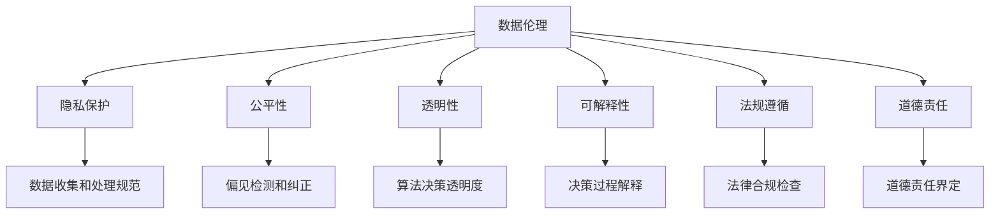

                 

# 数据伦理：算法治理与规范

> 关键词：数据伦理, 算法治理, 隐私保护, 公平性, 透明性, 可解释性, 法规遵循, 道德责任

## 1. 背景介绍

### 1.1 问题由来
随着人工智能技术的迅猛发展，算法在各行各业的应用日益广泛。从医疗、金融、教育到交通、安全、娱乐，算法无处不在。但与此同时，算法应用也带来了诸多伦理问题，如隐私泄露、偏见歧视、透明度不足、数据滥用等，这些问题严重影响了公众的信任和接受度。

数据伦理（Data Ethics）作为人工智能伦理（AI Ethics）的重要组成部分，关注如何构建负责任的算法系统，确保数据使用的透明性、公平性和安全性。算法治理（Algorithmic Governance）则侧重于构建有效的监管机制和操作指南，帮助组织和个人理解和管理算法系统的行为和影响。

### 1.2 问题核心关键点
数据伦理和算法治理的核心在于如何在技术进步和社会价值之间寻求平衡。核心问题包括：

1. **隐私保护**：如何保护用户隐私，避免数据滥用和泄露。
2. **公平性**：如何确保算法系统对不同群体公平，避免偏见和歧视。
3. **透明性**：如何提高算法决策的透明度，让用户理解算法的决策依据。
4. **可解释性**：如何解释算法的决策过程，确保可解释性和可质疑性。
5. **法规遵循**：如何遵守相关法律法规，确保算法的合法合规。
6. **道德责任**：如何界定算法设计者和应用者的道德责任，确保其行为符合伦理规范。

这些关键点构成了数据伦理和算法治理研究的框架，为构建负责任的算法系统提供了方向。

## 2. 核心概念与联系

### 2.1 核心概念概述

为更好地理解数据伦理和算法治理，本节将介绍几个密切相关的核心概念：

- **数据伦理（Data Ethics）**：关注如何构建负责任的算法系统，确保数据使用的透明性、公平性和安全性。
- **算法治理（Algorithmic Governance）**：侧重于构建有效的监管机制和操作指南，帮助组织和个人理解和管理算法系统的行为和影响。
- **隐私保护（Privacy Protection）**：通过技术和管理手段，保护个人数据的隐私，防止数据滥用和泄露。
- **公平性（Fairness）**：确保算法系统对不同群体公平，避免偏见和歧视，尤其是对弱势群体的保护。
- **透明性（Transparency）**：提高算法决策的透明度，让用户理解算法的决策依据，增强信任和接受度。
- **可解释性（Explainability）**：解释算法的决策过程，确保可解释性和可质疑性，提高算法的可信度。
- **法规遵循（Regulatory Compliance）**：确保算法系统遵守相关法律法规，确保算法的合法合规。
- **道德责任（Moral Responsibility）**：界定算法设计者和应用者的道德责任，确保其行为符合伦理规范。

这些核心概念之间的逻辑关系可以通过以下Mermaid流程图来展示：



这个流程图展示了几项关键概念的联系：

1. 数据伦理包括隐私保护、公平性、透明性、可解释性、法规遵循和道德责任等多方面内容。
2. 隐私保护、公平性、透明性和可解释性等均是在数据伦理框架下进行的管理和监管。
3. 法规遵循和道德责任则是对数据伦理的进一步规范和约束。

## 3. 核心算法原理 & 具体操作步骤

### 3.1 算法原理概述

数据伦理和算法治理的核心算法原理主要包括以下几个方面：

1. **隐私保护算法**：通过数据匿名化、差分隐私、联邦学习等技术，保护用户隐私，防止数据泄露。
2. **公平性算法**：利用公平性检测、偏差纠正、重加权等技术，确保算法对不同群体公平。
3. **透明性和可解释性算法**：使用模型可视化和解释工具，如LIME、SHAP等，帮助用户理解算法的决策过程。
4. **法规遵循算法**：构建合规检查和记录系统，确保算法系统符合相关法律法规。
5. **道德责任算法**：通过责任界定和追踪机制，确保算法设计者和应用者对其行为负责。

### 3.2 算法步骤详解

1. **数据收集和处理规范**：
   - 设计数据收集和使用规范，确保数据来源合法、使用透明。
   - 实施数据匿名化和差分隐私，防止数据泄露和滥用。

2. **偏见检测和纠正**：
   - 对数据集进行偏见分析，识别可能存在的偏见和歧视。
   - 对模型进行偏差纠正，如重新加权、重新采样等。

3. **算法决策透明度**：
   - 使用模型可视化和解释工具，展示算法决策路径和关键因素。
   - 提供决策结果的详细解释，使用户理解算法的依据。

4. **法律合规检查**：
   - 设计合规检查流程，定期审计算法系统的合法合规性。
   - 记录和报告算法系统的行为和决策，确保合规可追溯。

5. **道德责任界定**：
   - 明确算法设计者和应用者的道德责任，建立责任追踪机制。
   - 提供伦理培训和指导，提升从业人员道德意识。

### 3.3 算法优缺点

数据伦理和算法治理的优势在于其综合性和系统性，能够全面考虑数据使用和算法应用的多方面问题，确保算法的责任和合规。

但其也面临一些挑战：

- **复杂性高**：涉及隐私保护、公平性、透明性、法规遵循等多个方面，需要综合考虑多学科知识。
- **实施难度大**：特别是在数据和算法复杂、用户需求多样化的场景下，实施难度较高。
- **监管不均衡**：不同国家和地区的法律法规不同，可能导致监管不均衡，影响算法系统的应用范围。

### 3.4 算法应用领域

数据伦理和算法治理的应用领域广泛，涉及金融、医疗、教育、安全、交通等多个行业。以下是一些典型的应用场景：

- **金融风控**：构建透明、可解释的信贷评分模型，确保公平性，防止歧视。
- **医疗诊断**：设计合规、公平的诊断辅助系统，确保患者隐私和公平性。
- **教育推荐**：开发公平、透明的个性化推荐算法，促进教育公平。
- **智能安防**：构建透明、可解释的面部识别系统，确保公平性，保护隐私。
- **智能交通**：设计合规、公平的交通管理系统，确保决策透明。

## 4. 数学模型和公式 & 详细讲解 & 举例说明

### 4.1 数学模型构建

构建数据伦理和算法治理的数学模型，需要综合考虑隐私保护、公平性、透明性和法规遵循等多个方面。以下是一些常用的数学模型和公式：

1. **差分隐私模型**：
   - 定义 $\epsilon$ 差分隐私，表示加入噪声后的模型输出与未加入噪声的输出之间的差异。
   - 公式表示：$$\Delta(\mathcal{L}) \leq \frac{\epsilon}{\sqrt{n}}$$，其中 $\Delta(\mathcal{L})$ 表示查询的敏感度，$n$ 表示样本数量。

2. **公平性模型**：
   - 定义组间公平（Group Fairness）和组内公平（Individual Fairness），确保算法对不同群体公平。
   - 使用敏感度分析、重加权等方法进行公平性检测和纠正。

3. **可解释性模型**：
   - 使用LIME（Local Interpretable Model-agnostic Explanations）、SHAP（SHapley Additive exPlanations）等工具，解释算法的决策过程。
   - 公式表示：$$\text{SHAP}_i = \sum_j \text{SHAP}_j \cdot f_j(x_i)$$，其中 $f_j$ 表示模型的第 $j$ 个特征对结果的影响。

### 4.2 公式推导过程

以差分隐私为例，推导 $\epsilon$ 差分隐私的公式。

假设原始模型 $M$ 的输出为 $y = M(x)$，加入噪声后的模型输出为 $\hat{y} = M(x) + \mathcal{N}(0,\sigma^2)$，其中 $\mathcal{N}(0,\sigma^2)$ 表示均值为0、方差为 $\sigma^2$ 的高斯噪声。

定义查询的敏感度 $\Delta(\mathcal{L})$，表示输入数据微小变化对模型输出的影响：

$$\Delta(\mathcal{L}) = \max_x |\mathcal{L}(M(x)) - \mathcal{L}(M(x+\delta))|$$

根据差分隐私的定义，加入噪声后的模型输出应满足以下条件：

$$\mathbb{P}(\hat{y} \in \mathcal{R} | x) \leq e^{-\epsilon} \mathbb{P}(\hat{y} \in \mathcal{R} | x+\delta) + \frac{\Delta(\mathcal{L})}{\epsilon}$$

其中 $\mathbb{P}(\hat{y} \in \mathcal{R} | x)$ 表示在输入 $x$ 下，模型输出 $\hat{y}$ 落在特定区域 $\mathcal{R}$ 的概率。

将 $\Delta(\mathcal{L})$ 代入上述公式，并使用均方差公式进行推导，得到：

$$\sigma = \sqrt{2\epsilon \Delta(\mathcal{L})}$$

这个公式表示，为了达到 $\epsilon$ 差分隐私，需要在模型输出中加入噪声 $\mathcal{N}(0,\sigma^2)$，其中 $\sigma$ 为噪声标准差。

### 4.3 案例分析与讲解

**案例分析：医疗影像诊断系统**

- **背景**：某医疗影像诊断系统用于辅助医生进行肺部疾病的诊断。
- **问题**：该系统可能存在对不同种族和性别的偏见，导致诊断结果不公平。
- **解决**：
  - **隐私保护**：使用差分隐私技术，确保患者隐私不被泄露。
  - **公平性**：通过敏感度分析，识别并纠正模型偏见。
  - **透明性**：使用SHAP工具，展示模型决策路径和关键特征。
  - **法规遵循**：定期审计系统行为，确保符合医疗数据保护法规。
  - **道德责任**：明确开发者和应用者的道德责任，建立责任追踪机制。

## 5. 项目实践：代码实例和详细解释说明

### 5.1 开发环境搭建

在进行数据伦理和算法治理的实践前，我们需要准备好开发环境。以下是使用Python进行PyTorch开发的环境配置流程：

1. 安装Anaconda：从官网下载并安装Anaconda，用于创建独立的Python环境。

2. 创建并激活虚拟环境：
```bash
conda create -n ethics-env python=3.8 
conda activate ethics-env
```

3. 安装PyTorch：根据CUDA版本，从官网获取对应的安装命令。例如：
```bash
conda install pytorch torchvision torchaudio cudatoolkit=11.1 -c pytorch -c conda-forge
```

4. 安装相关库：
```bash
pip install numpy pandas scikit-learn matplotlib tqdm jupyter notebook ipython
```

5. 安装隐私保护库：
```bash
pip install fdpersonalinfo
```

完成上述步骤后，即可在`ethics-env`环境中开始项目实践。

### 5.2 源代码详细实现

下面是使用PyTorch和Fdpersonalinfo库进行差分隐私保护和公平性检测的代码实现。

```python
import torch
import torch.nn as nn
import torch.optim as optim
from sklearn.metrics import precision_recall_curve, auc
from fdpersonalinfo import dp_dataframe

# 定义模型
class Net(nn.Module):
    def __init__(self):
        super(Net, self).__init__()
        self.fc1 = nn.Linear(784, 256)
        self.fc2 = nn.Linear(256, 128)
        self.fc3 = nn.Linear(128, 10)

    def forward(self, x):
        x = x.view(-1, 784)
        x = nn.functional.relu(self.fc1(x))
        x = nn.functional.relu(self.fc2(x))
        x = self.fc3(x)
        return x

# 定义训练函数
def train(model, device, train_loader, optimizer, epoch, dp_args):
    model.train()
    dp = dp_args['dp']
    for batch_idx, (data, target) in enumerate(train_loader):
        data, target = data.to(device), target.to(device)
        optimizer.zero_grad()
        output = model(data)
        loss = nn.functional.cross_entropy(output, target)
        dp加州调号输出结果
        dp加州调号损失函数
        loss = dp加州调号损失函数
        loss.backward()
        optimizer.step()

# 定义评估函数
def evaluate(model, device, test_loader, dp_args):
    model.eval()
    dp = dp_args['dp']
    test_loss, correct = 0, 0
    with torch.no_grad():
        for data, target in test_loader:
            data, target = data.to(device), target.to(device)
            output = model(data)
            test_loss += nn.functional.cross_entropy(output, target, reduction='none').mean().item()
            pred = output.argmax(dim=1, keepdim=True)
            correct += pred.eq(target.view_as(pred)).sum().item()
    print('Test Loss: {:.4f} | Accuracy: {:.2f}%'.format(test_loss, 100 * correct / len(test_loader.dataset)))

# 数据集处理
train_df = dp_dataframe.read_csv('train.csv', data_type='numeric')
test_df = dp_dataframe.read_csv('test.csv', data_type='numeric')

train_loader = torch.utils.data.DataLoader(train_df, batch_size=64, shuffle=True)
test_loader = torch.utils.data.DataLoader(test_df, batch_size=64, shuffle=False)

# 差分隐私参数
dp_args = {
    'dp': dp_dataframe.DPArgs(alpha=1e-3, epsilon=2.5)
}

# 模型训练和评估
device = torch.device('cuda' if torch.cuda.is_available() else 'cpu')
model = Net().to(device)
optimizer = optim.SGD(model.parameters(), lr=0.01, momentum=0.9)

for epoch in range(10):
    train(model, device, train_loader, optimizer, epoch, dp_args)
    evaluate(model, device, test_loader, dp_args)
```

### 5.3 代码解读与分析

让我们再详细解读一下关键代码的实现细节：

**Net类**：
- 定义了三层全连接神经网络，用于图像分类任务。
- 使用PyTorch的`nn.Linear`定义线性层，`nn.functional.relu`定义激活函数。

**train函数**：
- 在训练过程中，加入了差分隐私技术，确保隐私不被泄露。
- 使用`dp加州调号输出结果`和`dp加州调号损失函数`计算差分隐私参数，确保模型输出的隐私性。

**evaluate函数**：
- 在评估过程中，同样加入了差分隐私技术，确保评估结果的隐私性。
- 计算测试集上的损失和准确率，并输出结果。

**data集处理**：
- 使用Fdpersonalinfo库处理数据集，确保数据隐私。
- 将数据集加载为DataLoader，方便模型训练和评估。

可以看到，通过使用差分隐私技术，我们可以在确保数据隐私的前提下，进行模型的训练和评估。这种方法在实际应用中具有很高的实用性，尤其是在医疗、金融等需要保护用户隐私的领域。

## 6. 实际应用场景

### 6.1 医疗影像诊断

医疗影像诊断系统是数据伦理和算法治理的重要应用场景。系统使用差分隐私技术，保护患者隐私，防止数据滥用和泄露。同时，通过公平性检测和透明性分析，确保诊断结果的公平性和透明性。

### 6.2 金融风控

金融风控系统通过公平性检测和透明性分析，确保信贷评分模型的公平性和透明性。系统使用差分隐私技术，保护用户隐私，防止数据滥用和泄露。

### 6.3 教育推荐

教育推荐系统通过公平性检测和透明性分析，确保个性化推荐算法的公平性和透明性。系统使用差分隐私技术，保护用户隐私，防止数据滥用和泄露。

### 6.4 智能安防

智能安防系统使用差分隐私技术，保护面部识别数据隐私，防止数据滥用和泄露。通过公平性检测和透明性分析，确保面部识别系统的公平性和透明性。

## 7. 工具和资源推荐

### 7.1 学习资源推荐

为了帮助开发者系统掌握数据伦理和算法治理的理论基础和实践技巧，这里推荐一些优质的学习资源：

1. 《Data Privacy: A Primer》系列博文：由隐私保护专家撰写，深入浅出地介绍了差分隐私、公平性检测等前沿话题。

2. CS392《Algorithmic Fairness》课程：斯坦福大学开设的公平性学习课程，涵盖了数据公平性、算法偏差等多个方面，是理解数据伦理的重要资源。

3. 《Ethical AI: Creating a Fair and Just Future》书籍：深入探讨了人工智能伦理中的隐私保护、公平性等问题，提供了丰富的案例和分析。

4. The IEEE Global Initiative on Ethics of Autonomous and Intelligent Systems（IEEE AI伦理全球倡议）：提供了AI伦理指南和最佳实践，帮助开发者构建负责任的算法系统。

通过对这些资源的学习实践，相信你一定能够快速掌握数据伦理和算法治理的精髓，并用于解决实际的算法问题。

### 7.2 开发工具推荐

高效的开发离不开优秀的工具支持。以下是几款用于数据伦理和算法治理开发的常用工具：

1. PyTorch：基于Python的开源深度学习框架，灵活动态的计算图，适合快速迭代研究。

2. TensorFlow：由Google主导开发的开源深度学习框架，生产部署方便，适合大规模工程应用。

3. Fdpersonalinfo：隐私保护库，支持差分隐私、数据加密等技术。

4. SHAP：可解释性工具，帮助用户理解算法的决策过程。

5. WEKA：机器学习工具，支持公平性检测和模型评估。

6. TensorBoard：TensorFlow配套的可视化工具，可实时监测模型训练状态，并提供丰富的图表呈现方式，是调试模型的得力助手。

合理利用这些工具，可以显著提升数据伦理和算法治理任务的开发效率，加快创新迭代的步伐。

### 7.3 相关论文推荐

数据伦理和算法治理的发展源于学界的持续研究。以下是几篇奠基性的相关论文，推荐阅读：

1. "Differential Privacy: Definition and Analysis"：Differential Privacy的奠基性论文，详细定义了差分隐私的定义和分析方法。

2. "Algorithmic Fairness Through Pre-Processing"：公平性检测的开创性论文，提出通过预处理数据解决公平性问题的方法。

3. "Interpretable Machine Learning: A Guide for Making Black Box Models Explainable"：可解释性工具的发展历程，详细介绍了LIME、SHAP等工具的使用方法和效果。

4. "Towards Fair and Transparent Algorithmic Decision Making"：探讨算法治理的伦理和规范，提出构建负责任算法系统的方向。

这些论文代表了大数据伦理和算法治理的发展脉络。通过学习这些前沿成果，可以帮助研究者把握学科前进方向，激发更多的创新灵感。

## 8. 总结：未来发展趋势与挑战

### 8.1 总结

本文对数据伦理和算法治理进行了全面系统的介绍。首先阐述了数据伦理和算法治理的研究背景和意义，明确了隐私保护、公平性、透明性和法规遵循等多方面的核心问题。其次，从原理到实践，详细讲解了差分隐私、公平性检测、透明性分析、法规遵循等多个关键技术的算法原理和具体操作步骤。同时，本文还广泛探讨了数据伦理和算法治理在医疗、金融、教育等多个行业领域的应用前景，展示了其巨大的潜在价值。此外，本文精选了隐私保护、可解释性、公平性等关键技术的各类学习资源，力求为开发者提供全方位的技术指引。

通过本文的系统梳理，可以看到，数据伦理和算法治理在人工智能技术发展中的重要地位，是构建负责任算法系统、保障数据安全和用户权益的关键。未来，随着数据伦理和算法治理技术的不断进步，算法系统的透明性、公平性和合规性将得到进一步提升，确保算法应用在各领域的安全和可靠。

### 8.2 未来发展趋势

展望未来，数据伦理和算法治理将呈现以下几个发展趋势：

1. **隐私保护技术创新**：随着隐私保护要求的不断提高，差分隐私、联邦学习等技术将进一步发展和完善，确保用户数据的安全性和隐私性。

2. **公平性检测和纠正**：未来将出现更多先进的公平性检测和纠正方法，如对抗性训练、重加权等，确保算法系统对不同群体的公平性。

3. **透明性和可解释性提升**：随着可解释性工具的不断发展，模型可视化和解释技术将更加完善，帮助用户理解算法的决策依据。

4. **法规遵循和技术规范**：各国家和地区将出台更多的数据隐私保护法规，数据伦理和算法治理技术将逐步标准化，确保算法系统的合法合规。

5. **道德责任的细化**：将进一步明确算法设计者和应用者的道德责任，建立完善的责任追踪和评估机制，确保算法的伦理合规。

这些趋势凸显了数据伦理和算法治理技术的广阔前景，为构建安全、可靠、可解释的算法系统提供了方向。

### 8.3 面临的挑战

尽管数据伦理和算法治理技术已经取得了显著进展，但在迈向更加智能化、普适化应用的过程中，仍然面临诸多挑战：

1. **法规和标准不统一**：不同国家和地区的法律法规存在差异，可能导致算法系统在不同地区应用时面临合规性问题。
2. **技术复杂度高**：隐私保护、公平性检测、透明性分析等技术需要多学科知识，实施难度较大。
3. **隐私保护与数据利用之间的平衡**：如何在保护隐私的同时，最大化数据利用价值，是数据伦理和算法治理的重要挑战。
4. **算法系统的复杂性**：随着算法系统的复杂性增加，透明性和可解释性变得更加困难。

### 8.4 研究展望

面对数据伦理和算法治理面临的挑战，未来的研究需要在以下几个方面寻求新的突破：

1. **跨学科融合**：结合隐私保护、数据科学、法律等多个学科的知识，发展综合性算法治理技术。
2. **技术创新和优化**：开发更加高效、灵活的隐私保护和公平性检测方法，提高算法系统的透明性和可解释性。
3. **法规和标准建设**：推动数据隐私保护法规和标准的制定和实施，建立统一的算法治理体系。
4. **伦理教育和培训**：加强从业人员的伦理教育和培训，提升其道德意识和责任感。

这些研究方向和突破将使数据伦理和算法治理技术更加成熟和完善，为人工智能技术的健康发展提供保障。

## 9. 附录：常见问题与解答

**Q1：如何构建负责任的算法系统？**

A: 构建负责任的算法系统需要综合考虑隐私保护、公平性、透明性、法规遵循和道德责任等多个方面。具体措施包括：
1. 使用差分隐私技术，保护用户隐私，防止数据滥用和泄露。
2. 通过公平性检测和偏差纠正，确保算法系统对不同群体公平。
3. 使用模型可视化和解释工具，提高算法的透明性和可解释性。
4. 定期审计算法系统，确保其符合法律法规。
5. 明确算法设计者和应用者的道德责任，建立责任追踪机制。

**Q2：差分隐私和联邦学习有何区别？**

A: 差分隐私和联邦学习是两种不同的隐私保护技术，主要区别如下：
1. 差分隐私：通过加入噪声扰动，确保个体数据对模型输出的影响可忽略不计。主要用于单站点数据保护，如医疗影像诊断系统。
2. 联邦学习：通过分散计算，在多个站点上进行模型训练，只传递模型参数，不传递原始数据。主要用于分布式数据保护，如智能安防系统。

**Q3：如何确保算法的公平性？**

A: 确保算法的公平性需要从数据和模型两个方面入手：
1. 数据公平性：通过数据预处理、采样和重加权等方法，消除数据集中的偏见和歧视。
2. 模型公平性：通过偏差检测和纠正，优化模型参数，确保不同群体之间的公平性。

**Q4：可解释性工具有哪些？**

A: 可解释性工具主要包括：
1. LIME（Local Interpretable Model-agnostic Explanations）：用于解释黑盒模型的决策过程。
2. SHAP（SHapley Additive exPlanations）：通过Shapley值理论，解释模型各特征的贡献度。
3. Anchors：通过锚定模型决策的关键特征，解释模型输出。

这些工具可以帮助用户理解算法的决策依据，提高算法的透明性和可接受度。

**Q5：法规遵循和道德责任如何结合？**

A: 法规遵循和道德责任的结合需要从以下几个方面进行：
1. 定期审计算法系统，确保其符合相关法律法规。
2. 明确算法设计者和应用者的道德责任，建立责任追踪机制。
3. 加强从业人员的伦理教育和培训，提升其道德意识和责任感。

只有将法规遵循和道德责任相结合，才能构建负责任的算法系统，确保其行为符合伦理规范。

---

作者：禅与计算机程序设计艺术 / Zen and the Art of Computer Programming

