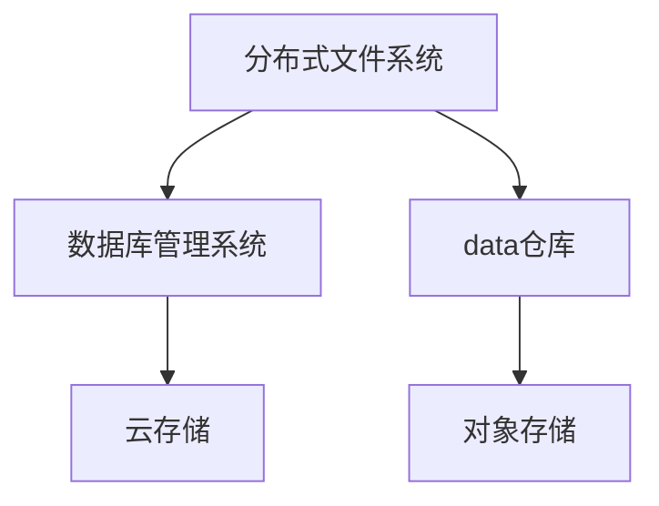

                 

# 数据存储系统：满足 AI 2.0 海量数据存储需求

> 关键词：
- 数据存储系统
- AI 2.0
- 海量数据
- 分布式文件系统
- 数据库管理系统
- 数据仓库
- 云存储

## 1. 背景介绍

### 1.1 问题由来

随着人工智能(AI)技术的不断发展，尤其是AI 2.0时代的到来，数据存储系统面临着前所未有的挑战。AI 2.0强调的不仅仅是传统的数据存储和处理，更强调数据的智能分析、预测与决策。这对数据存储系统提出了更高的要求：

- **高吞吐量**：AI 2.0模型训练和推理需要处理大规模、高维度的数据，数据存储系统需要具备高吞吐量的读写能力。
- **低延迟**：AI 2.0应用场景多样，如实时推荐系统、自动驾驶等，要求数据存储系统提供毫秒级的低延迟服务。
- **弹性扩展**：数据量随时间增长，存储系统需要支持动态扩展，以应对不断增长的数据需求。
- **高可用性**：AI 2.0应用要求系统稳定可靠，任何硬件故障或网络问题都可能导致重大损失，数据存储系统需要具备高可用性。
- **灵活性**：AI 2.0模型训练和推理方式多样，数据存储系统需要支持多种数据访问协议和格式。

### 1.2 问题核心关键点

要满足AI 2.0对数据存储系统的需求，核心关键点在于：

- **分布式架构**：通过分布式系统实现数据的高可用性和弹性扩展。
- **高性能计算**：利用先进的数据存储技术，提高数据的读写和处理效率。
- **安全与隐私**：确保数据的隐私性和安全性，防止数据泄露和滥用。
- **多云兼容**：支持多种云平台，实现数据跨云迁移和管理。
- **自动化运维**：减少人工干预，提高系统稳定性和可靠性。

本文将系统阐述满足AI 2.0需求的数据存储架构，包括分布式文件系统、数据库管理系统、数据仓库及云存储等，旨在为开发者提供完整的解决方案。

## 2. 核心概念与联系

### 2.1 核心概念概述

为更好地理解数据存储系统在AI 2.0中的应用，本节将介绍几个密切相关的核心概念：

- **分布式文件系统**：如Hadoop Distributed File System (HDFS)、Apache Hadoop YARN等，提供大容量数据的分布式存储和管理系统。
- **数据库管理系统**：如MySQL、PostgreSQL、MongoDB等，支持结构化和半结构化数据的存储、查询和分析。
- **数据仓库**：如Apache Hive、Apache Impala等，提供大规模数据的ETL(Extract, Transform, Load)处理和OLAP(Online Analytical Processing)分析能力。
- **云存储**：如Amazon S3、Microsoft Azure Blob Storage、Google Cloud Storage等，提供跨地域、高可用的云原生数据存储服务。
- **对象存储**：如Amazon S3、Google Cloud Storage等，适用于非结构化数据和大量冷数据的存储。

这些核心概念之间的逻辑关系可以通过以下Mermaid流程图来展示：



这个流程图展示了数据存储系统的核心组件及其之间的联系：

1. 分布式文件系统为海量数据提供分布式存储。
2. 数据库管理系统对结构化数据进行高效存储和查询。
3. 数据仓库对大规模数据进行ETL和分析。
4. 云存储提供跨地域、高可用的云原生存储服务。
5. 对象存储用于非结构化数据的存储和管理。

这些组件相互配合，共同构建了高性能、高可用、高安全的数据存储系统，满足AI 2.0的应用需求。

## 3. 核心算法原理 & 具体操作步骤

### 3.1 算法原理概述

AI 2.0时代的数据存储系统，底层算法和原理主要包括以下几个方面：

- **分布式存储**：通过将数据分片存储在多台服务器上，实现高可用性和弹性扩展。
- **数据冗余与备份**：通过副本机制和定期备份，确保数据的高可用性和安全性。
- **高性能计算**：利用SSD、分布式缓存等技术提升数据读写和处理效率。
- **数据一致性协议**：如Paxos、Raft等，确保分布式系统的一致性和可靠性。
- **跨云数据管理**：通过云平台之间的数据复制和同步，实现数据跨云迁移和管理。

### 3.2 算法步骤详解

数据存储系统的构建一般包括以下几个关键步骤：

**Step 1: 设计数据模型**

- 根据应用场景，设计合适的数据模型，如关系型数据模型或NoSQL数据模型。
- 考虑数据的分布、访问频率和一致性要求，选择合适的数据存储方案。

**Step 2: 配置分布式架构**

- 选择适合的分布式文件系统，如Hadoop HDFS或Apache YARN。
- 配置分布式集群，包括节点选择、网络拓扑和数据分片策略。

**Step 3: 部署数据库管理系统**

- 选择合适的关系型数据库或NoSQL数据库，如MySQL、PostgreSQL、MongoDB等。
- 配置数据库的集群、复制和分片策略。

**Step 4: 搭建数据仓库**

- 选择合适的数据仓库解决方案，如Apache Hive、Apache Impala等。
- 设计ETL流程，将数据从源系统导入数据仓库。
- 设计OLAP查询，优化数据仓库的查询效率。

**Step 5: 实现跨云数据管理**

- 利用云平台提供的跨云复制和同步功能，实现数据跨云迁移。
- 设计跨云数据复制策略，确保数据一致性和可用性。

**Step 6: 实施安全与隐私保护**

- 设计数据加密、访问控制和审计机制，确保数据安全。
- 实施数据隐私保护措施，如数据脱敏、访问控制等。

**Step 7: 部署监控和运维系统**

- 配置监控系统，实时监控数据存储系统的性能和健康状态。
- 部署自动化运维工具，如Ansible、Puppet等，实现系统的自动化部署和运维。

### 3.3 算法优缺点

数据存储系统在满足AI 2.0需求的同时，也存在一些优缺点：

**优点**：

- **高扩展性**：分布式架构支持弹性扩展，能够应对数据量随时间增长的需求。
- **高可用性**：多副本和定期备份机制，确保系统的高可用性。
- **高灵活性**：支持多种数据访问协议和格式，满足AI 2.0模型训练和推理的多样化需求。
- **高效计算**：先进的数据存储技术提升读写和处理效率，缩短模型训练和推理时间。
- **高安全性和隐私保护**：数据加密、访问控制和隐私保护措施，确保数据安全。

**缺点**：

- **复杂性**：分布式架构和数据一致性协议增加了系统的复杂性。
- **管理难度**：多系统管理和跨云复制增加了运维难度。
- **成本高**：大规模分布式存储和计算资源需求，增加了系统的部署和运维成本。
- **延迟和性能瓶颈**：在大规模数据访问时，可能出现延迟和性能瓶颈。

### 3.4 算法应用领域

数据存储系统在AI 2.0时代的应用领域广泛，包括：

- **科学研究**：科学研究机构利用数据存储系统，存储和管理大规模实验数据，支持深度学习和数据分析。
- **医疗健康**：医疗机构利用数据存储系统，存储和管理患者的健康数据，支持AI辅助诊断和治疗。
- **金融服务**：金融机构利用数据存储系统，存储和管理金融数据，支持风险评估和投资分析。
- **智能制造**：制造企业利用数据存储系统，存储和管理生产数据，支持智能制造和自动化生产。
- **智慧城市**：城市管理部门利用数据存储系统，存储和管理城市数据，支持智慧城市建设和智能交通管理。

## 4. 数学模型和公式 & 详细讲解 & 举例说明

### 4.1 数学模型构建

在AI 2.0的数据存储系统中，数学模型主要涉及数据分布、数据冗余和一致性协议等方面。

假设一个分布式存储系统由n个节点组成，每个节点存储m份数据。系统设计了数据冗余和备份机制，确保在任意一个节点故障时，能够从备份节点恢复数据。系统的数学模型如下：

- **数据冗余**：$r=1,2,3,\cdots,m$。
- **数据备份**：$b=1,2,3,\cdots,n$。
- **节点故障**：$f=1,2,3,\cdots,n$。
- **数据一致性**：$c=1,2,3,\cdots,n$。

系统总数据量为$N$，设每个节点的数据量为$T$，则有$N=n \times m \times T$。系统故障节点的数量为$F=f \times b \times r$。系统的一致性因子为$C=c \times f \times r$。

### 4.2 公式推导过程

在上述模型中，数据冗余$r$、数据备份$b$、节点故障$f$和数据一致性$c$是系统设计的关键参数，直接影响系统的可用性和性能。通过数学公式，可以推导出系统的高可用性和性能指标：

1. **高可用性计算**：

   设系统故障节点数为$F$，系统一致性因子为$C$，则系统的可用性$A$为：

   $$
   A = \frac{C}{F} = \frac{c \times f \times r}{f \times b \times r} = \frac{c}{b}
   $$

   即系统的可用性与数据备份比例$b$和一致性因子$c$成正比。

2. **性能计算**：

   设系统节点数量为$n$，每个节点的数据量为$T$，则系统总数据量为$N=n \times m \times T$。系统的读写延迟$D$为：

   $$
   D = \frac{N}{n \times m \times T} \times \delta
   $$

   其中$\delta$为单个节点的读写延迟。

3. **可靠性计算**：

   设系统的冗余度$r$为1时，系统的可靠数据量为$R_1$，冗余度$r=2$时，系统的可靠数据量为$R_2$。则有：

   $$
   R_1 = \frac{N}{n \times T} \times r
   $$
   
   $$
   R_2 = \frac{N}{n \times T} \times (1-r)
   $$

   即当冗余度$r=2$时，系统的可靠数据量是$r=1$时的$(1-r)$倍。

### 4.3 案例分析与讲解

假设一个数据存储系统由10个节点组成，每个节点存储3份数据，数据备份比例为2，数据一致性因子为3。当系统节点故障2个时，系统可用性和性能计算如下：

1. **高可用性计算**：

   $$
   A = \frac{3}{2} = 1.5
   $$

   即系统的可用性为1.5，说明在节点故障2个时，系统仍然可以正常运行。

2. **性能计算**：

   设每个节点的读写延迟为$\delta=1$，则系统的总数据量为$N=10 \times 3 \times T=30T$。系统的总延迟为：

   $$
   D = \frac{30T}{10 \times 3 \times T} \times 1 = 1
   $$

   即系统在节点数量为10，每个节点的读写延迟为1时，系统总延迟为1。

3. **可靠性计算**：

   当冗余度$r=1$时，系统的可靠数据量为：

   $$
   R_1 = \frac{30T}{10 \times T} \times 1 = 3
   $$

   当冗余度$r=2$时，系统的可靠数据量为：

   $$
   R_2 = \frac{30T}{10 \times T} \times (1-1) = 0
   $$

   即当冗余度为2时，系统的可靠数据量为0。

## 5. 项目实践：代码实例和详细解释说明

### 5.1 开发环境搭建

在进行数据存储系统的开发前，我们需要准备好开发环境。以下是使用Python进行Apache Hadoop搭建开发环境的流程：

1. 安装Apache Hadoop：从官网下载并安装Hadoop版本。
2. 配置环境变量：设置Hadoop的bin目录和core-site.xml、hdfs-site.xml、yarn-site.xml等配置文件。
3. 启动Hadoop集群：在终端执行启动脚本，启动Hadoop集群。

完成上述步骤后，即可在Hadoop集群上进行数据存储系统的开发和测试。

### 5.2 源代码详细实现

下面我们以分布式文件系统为例，给出使用Hadoop搭建分布式文件系统的Python代码实现。

```python
from hadoop.fs import FileSystem
from hadoop.conf import Configuration

# 创建Hadoop配置
configuration = Configuration()

# 创建Hadoop文件系统
fs = FileSystem(configuration)

# 上传文件到HDFS
fs.put('local_file', 'hdfs://namenode:port/user/dir/file.txt', overwrite=True)

# 删除文件
fs.delete('hdfs://namenode:port/user/dir/file.txt')

# 列出文件
files = fs.ls('hdfs://namenode:port/user/dir')
for file in files:
    print(file)

# 下载文件
fs.get('hdfs://namenode:port/user/dir/file.txt', 'local_file')
```

以上代码实现了文件的上传、删除、列出和下载操作。开发者可以进一步扩展，实现更复杂的文件系统操作，如数据分片、数据复制、数据备份等。

### 5.3 代码解读与分析

以下是关键代码的详细解读：

- `Configuration()`：创建一个Hadoop配置对象。
- `FileSystem(configuration)`：创建一个Hadoop文件系统对象，用于操作HDFS文件系统。
- `fs.put('local_file', 'hdfs://namenode:port/user/dir/file.txt', overwrite=True)`：将本地文件`local_file`上传至HDFS指定目录。
- `fs.delete('hdfs://namenode:port/user/dir/file.txt')`：删除指定HDFS目录下的文件。
- `fs.ls('hdfs://namenode:port/user/dir')`：列出指定目录下的文件。
- `fs.get('hdfs://namenode:port/user/dir/file.txt', 'local_file')`：将指定HDFS文件下载至本地文件。

这些操作展示了Hadoop文件系统的基本使用，开发者可以进一步扩展，实现更复杂的文件系统操作。

## 6. 实际应用场景

### 6.1 智能制造

在智能制造领域，数据存储系统可以存储和管理生产数据，支持设备监控、质量检测和智能维护。通过实时采集和分析生产数据，智能制造系统能够预测设备故障，优化生产流程，提高生产效率和产品质量。

具体而言，数据存储系统可以存储设备的传感器数据、生产指令和历史故障记录。智能制造系统利用这些数据，训练预测模型，预测设备故障，并实时调整生产参数，防止设备故障影响生产。此外，智能制造系统还可以分析生产数据，优化生产流程，提高生产效率和产品质量。

### 6.2 智慧城市

智慧城市建设需要海量数据的存储和处理。数据存储系统可以存储和管理城市的交通、能源、环境等数据，支持城市管理和决策。

具体而言，数据存储系统可以存储城市交通流量数据、能源消耗数据和环境监测数据。智慧城市系统利用这些数据，分析城市交通流量、优化能源消耗和环境监测，为城市管理提供决策支持。此外，智慧城市系统还可以预测城市风险，如洪水、地震等，提前采取措施，保障城市安全。

### 6.3 金融服务

金融服务领域需要处理和存储大量的金融数据，包括股票交易、投资分析、风险评估等。数据存储系统可以存储和管理这些数据，支持金融机构的业务需求。

具体而言，数据存储系统可以存储股票交易数据、投资组合数据和风险评估数据。金融机构利用这些数据，分析股票市场趋势、优化投资组合和评估风险，提高投资回报。此外，数据存储系统还可以支持金融机构的数据共享和协作，提升金融服务效率。

### 6.4 未来应用展望

随着数据存储技术的不断发展，未来数据存储系统将具备更高的性能和灵活性。以下是几个可能的发展方向：

1. **多云兼容**：数据存储系统将具备跨云兼容能力，支持不同云平台之间的数据迁移和管理。
2. **自动扩展**：数据存储系统将具备自动扩展能力，根据数据量和访问频率动态调整资源配置。
3. **AI驱动**：数据存储系统将利用AI技术，提升数据的读写和处理效率，缩短模型训练和推理时间。
4. **安全与隐私**：数据存储系统将具备更强的安全性和隐私保护能力，确保数据的安全性和合规性。
5. **边缘计算**：数据存储系统将支持边缘计算，将数据处理和存储任务分布到边缘节点，提升系统的实时性和可靠性。

## 7. 工具和资源推荐

### 7.1 学习资源推荐

为了帮助开发者系统掌握数据存储系统的理论基础和实践技巧，这里推荐一些优质的学习资源：

1. Apache Hadoop官方文档：提供了Hadoop的详细介绍、安装配置和用户指南，是学习Hadoop的基础。
2. Cloudera Hadoop认证课程：Cloudera提供的官方认证课程，涵盖Hadoop的核心概念和最佳实践，适合进阶学习。
3. Apache Hive官方文档：提供了Hive的详细介绍、SQL语法和数据仓库设计指南，是学习数据仓库的必备资源。
4. Hadoop with Python Cookbook：该书详细介绍了Hadoop的Python API和代码示例，适合开发实践。
5. Hadoop: The Definitive Guide：该书全面介绍了Hadoop的架构、部署和管理，是学习Hadoop的权威教材。

通过对这些资源的学习实践，相信你一定能够快速掌握数据存储系统的精髓，并用于解决实际的业务问题。

### 7.2 开发工具推荐

高效的开发离不开优秀的工具支持。以下是几款用于数据存储系统开发的常用工具：

1. Hadoop：Apache Hadoop项目，提供了分布式文件系统和分布式计算框架。
2. Hive：Apache Hive项目，提供了基于SQL的数据仓库解决方案。
3. Cassandra：Apache Cassandra项目，提供了高性能、高可用的分布式数据库管理系统。
4. MongoDB：MongoDB公司提供的NoSQL数据库管理系统。
5. ElasticSearch：Elastic公司提供的搜索引擎，支持大规模数据的存储和查询。

合理利用这些工具，可以显著提升数据存储系统的开发效率，加快创新迭代的步伐。

### 7.3 相关论文推荐

数据存储系统的发展离不开学界的持续研究。以下是几篇奠基性的相关论文，推荐阅读：

1. Hadoop: The Large-Scale Distributed File System：介绍Hadoop分布式文件系统的经典论文，奠定了Hadoop技术的基础。
2. Google File System：介绍Google分布式文件系统的经典论文，影响了Hadoop的设计和实现。
3. Yahoo! CloudBase：提供了一个大规模NoSQL数据库的架构和设计，为NoSQL技术的发展提供了重要参考。
4. Amazon Dynamo：介绍Amazon Dynamo的架构和设计，展示了NoSQL数据库的优秀实践。
5. Rethinking Distributed Databases：总结了过去十年分布式数据库的发展，提出了新的设计思路和优化策略。

这些论文代表了大数据存储技术的发展脉络，通过学习这些前沿成果，可以帮助研究者把握学科前进方向，激发更多的创新灵感。

## 8. 总结：未来发展趋势与挑战

### 8.1 研究成果总结

本文对数据存储系统在AI 2.0中的应用进行了全面系统的介绍。首先阐述了数据存储系统在AI 2.0中的重要性和需求，明确了数据存储系统需要具备高吞吐量、低延迟、高可用性等特性。其次，从原理到实践，详细讲解了数据存储系统的核心算法和具体操作步骤，给出了数据存储任务开发的完整代码实例。同时，本文还广泛探讨了数据存储系统在智能制造、智慧城市、金融服务等多个行业领域的应用前景，展示了数据存储系统的广阔应用空间。

通过本文的系统梳理，可以看到，数据存储系统在AI 2.0中的应用前景广阔，具有高扩展性、高可用性、高安全性和高灵活性。数据存储系统能够满足AI 2.0对大规模数据存储和处理的需求，为AI 2.0技术的发展提供了坚实的基础。

### 8.2 未来发展趋势

展望未来，数据存储系统将呈现以下几个发展趋势：

1. **自动化运维**：随着AI和大数据技术的不断发展，自动化运维将成为数据存储系统的重要方向。通过机器学习和自动化算法，实现系统的自动部署、监控和优化。
2. **跨云融合**：未来数据存储系统将具备跨云融合能力，支持不同云平台之间的数据迁移和管理。
3. **边缘计算**：边缘计算技术将加速数据的本地处理和存储，提升系统的实时性和可靠性。
4. **AI驱动**：数据存储系统将利用AI技术，提升数据的读写和处理效率，缩短模型训练和推理时间。
5. **安全与隐私**：数据存储系统将具备更强的安全性和隐私保护能力，确保数据的安全性和合规性。

这些趋势凸显了数据存储系统的先进性和前沿性，将进一步推动AI 2.0技术的发展和应用。

### 8.3 面临的挑战

尽管数据存储系统在AI 2.0中的应用取得了显著进展，但在迈向更加智能化、普适化应用的过程中，它仍面临着诸多挑战：

1. **系统复杂性**：分布式架构和数据一致性协议增加了系统的复杂性，需要开发者具备较高的技术水平。
2. **资源消耗高**：大规模分布式存储和计算资源需求，增加了系统的部署和运维成本。
3. **延迟和性能瓶颈**：在大规模数据访问时，可能出现延迟和性能瓶颈，需要优化系统架构和算法。
4. **数据安全和隐私**：数据存储系统需要具备强大的安全性和隐私保护能力，防止数据泄露和滥用。
5. **系统兼容性**：不同系统之间的兼容性问题，需要系统具备跨平台和跨技术栈的互操作性。

这些挑战需要通过持续的技术创新和优化，才能有效克服，进一步提升数据存储系统的性能和可靠性。

### 8.4 研究展望

面对数据存储系统面临的挑战，未来的研究需要在以下几个方面寻求新的突破：

1. **分布式架构优化**：优化分布式存储架构，减少延迟和性能瓶颈，提高系统效率。
2. **数据一致性改进**：改进数据一致性协议，提升系统的可用性和可靠性。
3. **自动化运维**：开发自动化运维工具，减少人工干预，提高系统稳定性和可靠性。
4. **跨云兼容**：研究跨云兼容技术，实现不同云平台之间的数据迁移和管理。
5. **AI驱动**：利用AI技术，提升数据的读写和处理效率，缩短模型训练和推理时间。
6. **安全与隐私**：研究安全与隐私保护技术，确保数据的安全性和合规性。

这些研究方向将引领数据存储技术迈向更高的台阶，为AI 2.0技术的发展提供坚实的技术支撑。相信随着学界和产业界的共同努力，数据存储系统必将满足AI 2.0的需求，推动AI 2.0技术的普及和应用。

## 9. 附录：常见问题与解答

**Q1：如何提高数据存储系统的性能？**

A: 提高数据存储系统的性能可以从以下几个方面入手：

1. **数据分片**：将大规模数据分成多个片段，分别存储在多个节点上，减少单个节点的数据量，提高系统的读写效率。
2. **数据压缩**：利用数据压缩技术，减少数据的存储空间，提高系统效率。
3. **分布式缓存**：利用分布式缓存技术，将热点数据缓存到本地，减少数据访问延迟。
4. **异步I/O**：利用异步I/O技术，提高系统的并发处理能力，提升系统的读写性能。

**Q2：如何选择合适的大数据存储方案？**

A: 选择合适的大数据存储方案需要考虑以下几个因素：

1. **数据类型**：根据数据类型选择适合的存储方案，如结构化数据、半结构化数据或非结构化数据。
2. **数据量**：根据数据量选择适合的存储方案，如适合大规模数据存储的分布式文件系统和适合小规模数据存储的对象存储。
3. **访问频率**：根据数据的访问频率选择适合的存储方案，如适合高访问频率的分布式缓存和适合低访问频率的对象存储。
4. **一致性要求**：根据数据的一致性要求选择适合的存储方案，如适合高一致性的分布式数据库和适合低一致性的对象存储。
5. **扩展性**：根据系统的扩展性要求选择适合的存储方案，如适合高扩展性的分布式文件系统和适合低扩展性的关系型数据库。

**Q3：如何在数据存储系统中实现高可用性？**

A: 实现高可用性可以从以下几个方面入手：

1. **数据冗余**：通过数据冗余机制，确保数据在多个节点上有备份，避免单点故障。
2. **分布式系统**：利用分布式系统，实现数据的分布式存储和计算，提高系统的可靠性。
3. **故障恢复**：实现快速故障恢复机制，如通过备份节点快速恢复数据，避免系统停机。
4. **负载均衡**：实现负载均衡机制，将数据和计算任务均衡分布在多个节点上，提高系统的稳定性和可靠性。
5. **自动化运维**：实现自动化运维机制，及时发现和修复系统故障，保证系统的稳定性和可靠性。

**Q4：如何保护数据存储系统的安全性和隐私？**

A: 保护数据存储系统的安全性和隐私可以从以下几个方面入手：

1. **数据加密**：对存储数据进行加密，防止数据泄露和滥用。
2. **访问控制**：实现严格的访问控制机制，确保只有授权用户能够访问数据。
3. **审计和监控**：实时监控和审计数据访问行为，防止数据滥用和恶意攻击。
4. **数据脱敏**：对敏感数据进行脱敏处理，防止数据泄露。
5. **合规性管理**：确保数据存储系统符合相关法律法规和行业标准，保护用户隐私。

这些措施将有效保护数据存储系统的安全性和隐私性，确保数据的安全和合规。

**Q5：如何实现跨云数据迁移和管理？**

A: 实现跨云数据迁移和管理可以从以下几个方面入手：

1. **数据同步**：利用云平台提供的跨云数据同步功能，实现不同云平台之间的数据同步。
2. **数据复制**：通过数据复制技术，将数据在不同云平台上备份，实现数据的高可用性。
3. **数据加密**：对跨云传输的数据进行加密，防止数据泄露和滥用。
4. **元数据管理**：实现跨云元数据管理，确保数据在不同云平台之间的完整性和一致性。
5. **API集成**：利用云平台提供的API接口，实现跨云数据管理，支持不同云平台之间的数据访问和操作。

这些措施将有效实现跨云数据迁移和管理，确保数据在不同云平台之间的安全性和一致性。

---

作者：禅与计算机程序设计艺术 / Zen and the Art of Computer Programming

