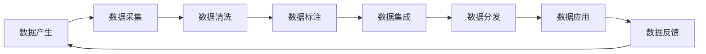

                 

# 数据集供应链:软件2.0的数据生态新图景

> 关键词：数据集供应链, 软件2.0, 数据生态, 数据治理, 数据市场, 数据驱动

## 1. 背景介绍

随着数字经济的崛起，数据的重要性日益凸显，而数据集的供应链管理成为软件2.0时代的关键一环。传统软件产业主要围绕代码和算法进行迭代和优化，而软件2.0则以数据为中心，通过数据驱动的决策，实现业务的持续创新和优化。数据集的供应链，包括数据集的获取、清洗、标注、集成和管理，直接决定了软件的价值和竞争力。本文将深入探讨软件2.0的数据生态新图景，分析数据集供应链的重要性和未来趋势，为从业者和决策者提供有价值的参考。

## 2. 核心概念与联系

### 2.1 核心概念概述

要理解数据集供应链的运作机制，首先需要理解几个核心概念：

- **数据集供应链**：指从数据产生到最终应用于软件系统的全过程，包括数据采集、清洗、标注、集成、分发和应用等环节。
- **软件2.0**：基于数据驱动的软件新范式，强调通过大规模数据分析、人工智能模型训练等方式，提取业务洞察，驱动软件应用的创新和优化。
- **数据生态**：由数据生产者、数据使用者、数据治理者、数据市场和数据驱动的业务系统组成的数据流通和互动网络。
- **数据治理**：包括数据标准、数据质量、数据安全和数据隐私等多方面的管理和规范。
- **数据市场**：基于数据商品的交换平台，促进数据资源的流通和交易。
- **数据驱动**：指通过数据的分析和应用，驱动业务决策、产品创新和流程优化。

### 2.2 核心概念原理和架构的 Mermaid 流程图



这个流程图展示了数据集供应链的全过程，从数据产生到数据反馈的闭环。每个环节都通过数据治理和数据市场进行连接和规范，确保数据流通的合规性和高效性。

## 3. 核心算法原理 & 具体操作步骤

### 3.1 算法原理概述

数据集供应链的核心算法原理基于数据流动的管理和优化，通过数据采集、清洗、标注、集成和分发等环节，实现数据的流通和应用。其中，数据采集和清洗是数据质量控制的关键，数据标注和集成影响数据的多样性和完整性，数据分发和应用则是数据价值的实现。

### 3.2 算法步骤详解

1. **数据采集**：从各类数据源中获取原始数据，包括传感器数据、日志数据、用户行为数据等。
2. **数据清洗**：对数据进行去重、去噪、异常值处理等操作，提升数据的质量和一致性。
3. **数据标注**：对清洗后的数据进行标注，如文本分类、实体识别、情感分析等，为后续的机器学习模型训练提供标签。
4. **数据集成**：将不同来源、格式和结构的数据进行融合，形成统一的数据集，支持更广泛的数据分析和应用。
5. **数据分发**：将数据集按照需求进行分发，支持离线使用、在线API接口调用等形式，确保数据的可用性和可访问性。
6. **数据应用**：将数据应用于模型的训练和优化，驱动业务决策、产品创新和流程优化。
7. **数据反馈**：根据数据应用的效果，进行数据质量的评估和改进，形成数据集供应链的闭环反馈机制。

### 3.3 算法优缺点

**优点**：
- 提升数据质量和多样性，增强模型训练的泛化能力。
- 优化数据流通和应用，提高软件系统的性能和效率。
- 促进数据驱动的业务决策，增强市场竞争力。

**缺点**：
- 数据采集和清洗的复杂性高，工作量大。
- 数据标注的质量和一致性难以保证，影响模型的准确性。
- 数据集成和分发的复杂性高，技术挑战大。

### 3.4 算法应用领域

数据集供应链的应用领域广泛，涵盖了金融、零售、医疗、交通、能源等多个行业。以下是几个典型应用场景：

1. **金融风控**：通过数据采集和清洗，获取用户行为和交易数据，进行风险评估和信用评分，提升金融产品的竞争力和用户体验。
2. **零售推荐**：通过数据标注和集成，构建用户画像和行为数据，实现个性化推荐系统，提升销售额和用户满意度。
3. **医疗诊断**：通过数据采集和清洗，获取患者病历和检查结果，进行疾病预测和诊断，提升医疗服务的准确性和效率。
4. **交通出行**：通过数据采集和清洗，获取交通流量和路况数据，进行交通分析和优化，提升交通管理水平和用户出行体验。
5. **能源管理**：通过数据采集和清洗，获取能源消耗和环境数据，进行能源优化和环境监测，提升能源利用效率和环境保护水平。

## 4. 数学模型和公式 & 详细讲解 & 举例说明

### 4.1 数学模型构建

在数据集供应链的管理中，可以构建一个数据流图模型，用于描述数据从采集到应用的全过程。该模型由节点和边组成，每个节点代表数据集供应链中的一个步骤，边代表数据在节点之间的流动。

### 4.2 公式推导过程

设数据集供应链中有 $n$ 个节点，每个节点 $i$ 对应一个数据处理操作 $f_i$，数据从节点 $i$ 到节点 $j$ 的流动通过边 $(i, j)$ 表示，其中 $i, j \in \{1, 2, \ldots, n\}$。

- 数据采集：$f_1(x) = x$，表示原始数据采集。
- 数据清洗：$f_2(x) = \mathcal{G}(x)$，表示数据清洗操作。
- 数据标注：$f_3(x) = \mathcal{L}(x)$，表示数据标注操作。
- 数据集成：$f_4(x) = \mathcal{I}(x)$，表示数据集成操作。
- 数据分发：$f_5(x) = \mathcal{D}(x)$，表示数据分发操作。
- 数据应用：$f_6(x) = \mathcal{A}(x)$，表示数据应用操作。
- 数据反馈：$f_7(x) = \mathcal{F}(x)$，表示数据反馈操作。

其中，$\mathcal{G}$、$\mathcal{L}$、$\mathcal{I}$、$\mathcal{D}$、$\mathcal{A}$、$\mathcal{F}$ 分别表示对应的数据处理函数。

### 4.3 案例分析与讲解

以零售推荐系统为例，分析数据集供应链的运作机制：

1. **数据采集**：从电商平台获取用户点击、浏览、购买等行为数据。
2. **数据清洗**：去除无效、重复和不一致的数据，确保数据的完整性和准确性。
3. **数据标注**：对用户行为进行分类标注，如点击次数、停留时间、购买金额等。
4. **数据集成**：将用户行为数据与产品信息数据集成，形成统一的推荐数据集。
5. **数据分发**：将推荐数据集通过API接口或数据湖等形式，提供给推荐算法使用。
6. **数据应用**：使用协同过滤、深度学习等算法，生成个性化推荐结果。
7. **数据反馈**：根据用户反馈和点击率等指标，评估推荐效果，进行数据质量的改进和优化。

## 5. 项目实践：代码实例和详细解释说明

### 5.1 开发环境搭建

在进行数据集供应链的实践时，需要搭建一个包含数据采集、清洗、标注、集成和分发等环节的开发环境。以下是一些常用的工具和框架：

- **Python**：作为数据处理和机器学习的通用语言，提供了丰富的数据处理和分析库。
- **Pandas**：用于数据清洗和集成，支持高效的数据操作和处理。
- **Scikit-learn**：提供了多种数据标注和机器学习算法，支持数据标注和模型训练。
- **TensorFlow**：支持大规模数据处理和深度学习模型训练，适合数据驱动的应用场景。
- **Keras**：提供简单易用的深度学习API，适合快速迭代原型开发。
- **Flask**：提供RESTful API接口，方便数据分发和应用。

### 5.2 源代码详细实现

以下是一个基于Python的数据集供应链管理系统的代码实现，涵盖数据采集、清洗、标注、集成和分发等环节：

```python
import pandas as pd
from sklearn.model_selection import train_test_split
from tensorflow.keras.models import Sequential
from tensorflow.keras.layers import Dense, Dropout
from flask import Flask, request, jsonify

# 数据采集
def data_acquisition():
    # 从数据源获取原始数据
    # ...
    return data

# 数据清洗
def data_cleaning(data):
    # 去除无效、重复和不一致的数据
    # ...
    return cleaned_data

# 数据标注
def data_labelling(data):
    # 对数据进行分类标注
    # ...
    return annotated_data

# 数据集成
def data_integration(data):
    # 将不同来源的数据集成
    # ...
    return integrated_data

# 数据分发
def data_distribution(data):
    # 将数据通过API接口或数据湖等形式分发
    # ...
    return response

# 数据应用
def data_application(data):
    # 使用深度学习等算法，生成推荐结果
    # ...
    return recommendation

# 数据反馈
def data_feedback(recommendation):
    # 根据用户反馈和点击率等指标，评估推荐效果
    # ...
    return feedback

# 构建数据集供应链
def build_data_pipeline():
    data = data_acquisition()
    cleaned_data = data_cleaning(data)
    annotated_data = data_labelling(cleaned_data)
    integrated_data = data_integration(annotated_data)
    response = data_distribution(integrated_data)
    recommendation = data_application(integrated_data)
    feedback = data_feedback(recommendation)
    return feedback

# Flask应用
app = Flask(__name__)

@app.route('/data', methods=['POST'])
def data_pipeline():
    data = request.json['data']
    feedback = build_data_pipeline()
    return jsonify(feedback)

if __name__ == '__main__':
    app.run(debug=True)
```

### 5.3 代码解读与分析

- **数据采集**：获取原始数据，可以是一个简单的函数调用，也可以从特定的API接口获取。
- **数据清洗**：对数据进行预处理，去除无效数据、处理缺失值和异常值，确保数据的完整性和一致性。
- **数据标注**：对数据进行分类、标注，为后续的机器学习模型训练提供标签。
- **数据集成**：将不同来源的数据进行融合，形成统一的数据集，支持更广泛的数据分析和应用。
- **数据分发**：将数据集通过API接口等形式提供，确保数据的可用性和可访问性。
- **数据应用**：使用深度学习等算法，生成推荐结果等应用。
- **数据反馈**：根据用户反馈和点击率等指标，评估推荐效果，进行数据质量的改进和优化。

### 5.4 运行结果展示

- **数据采集**：输出原始数据集。
- **数据清洗**：输出清洗后的数据集。
- **数据标注**：输出标注后的数据集。
- **数据集成**：输出集成后的数据集。
- **数据分发**：通过API接口输出数据集。
- **数据应用**：生成推荐结果等应用输出。
- **数据反馈**：根据用户反馈和点击率等指标，评估推荐效果，输出反馈信息。

## 6. 实际应用场景

### 6.1 金融风控

在金融风控领域，数据集供应链通过收集和处理用户行为和交易数据，进行风险评估和信用评分，提升金融产品的竞争力和用户体验。具体应用场景包括：

- **用户行为分析**：通过数据采集和清洗，获取用户的行为数据，如交易记录、登录记录等。
- **信用评分模型训练**：使用机器学习模型，对用户行为数据进行分析和预测，生成信用评分。
- **风险评估**：根据信用评分和用户画像，评估用户的信用风险，进行贷款审批和信用管理。

### 6.2 零售推荐

在零售推荐领域，数据集供应链通过收集和处理用户行为数据，构建推荐系统，提升用户的购物体验和销售额。具体应用场景包括：

- **用户行为数据采集**：通过网站、APP等渠道，收集用户的点击、浏览、购买等行为数据。
- **推荐模型训练**：使用协同过滤、深度学习等算法，构建个性化推荐模型，生成推荐结果。
- **推荐效果评估**：根据用户反馈和点击率等指标，评估推荐效果，进行模型调优。

### 6.3 医疗诊断

在医疗诊断领域，数据集供应链通过收集和处理患者病历和检查结果，进行疾病预测和诊断，提升医疗服务的准确性和效率。具体应用场景包括：

- **病历和检查结果采集**：通过电子病历系统和医疗设备，获取患者的病历和检查结果数据。
- **疾病预测模型训练**：使用机器学习模型，对病历和检查结果进行分析和预测，生成疾病预测结果。
- **诊断和治疗方案**：根据疾病预测结果，制定诊断和治疗方案，提升医疗服务的精准性和效率。

## 7. 工具和资源推荐

### 7.1 学习资源推荐

1. **《数据科学导论》（Introduction to Data Science）**：由数据科学领域的知名学者编写，涵盖数据采集、清洗、标注、集成和分析等核心概念和方法。
2. **Coursera数据科学课程**：提供由世界顶级大学和机构开设的数据科学课程，涵盖数据处理、机器学习、数据可视化等多个领域。
3. **Kaggle数据科学竞赛**：提供各种数据科学竞赛和挑战，通过实战项目提升数据处理和模型训练能力。
4. **GitHub数据科学项目**：提供各种开源数据科学项目，学习和参考优秀的代码实现。

### 7.2 开发工具推荐

1. **PyTorch**：开源深度学习框架，支持大规模数据处理和深度学习模型训练。
2. **TensorFlow**：开源深度学习框架，支持分布式计算和高效的模型训练。
3. **Pandas**：Python数据处理库，支持高效的数据清洗和集成。
4. **Scikit-learn**：Python机器学习库，支持各种数据标注和机器学习算法。
5. **Flask**：轻量级Web框架，支持快速开发API接口和数据分发。

### 7.3 相关论文推荐

1. **《大数据时代的机器学习挑战与机遇》（Big Data and the Challenge of Machine Learning）**：探讨在大数据背景下，机器学习面临的挑战和机遇，为数据集供应链管理提供理论支持。
2. **《数据驱动的决策系统构建》（Building Data-Driven Decision Systems）**：讨论数据驱动的决策系统构建方法，包括数据采集、清洗、标注、集成和应用等环节。
3. **《深度学习在推荐系统中的应用》（Deep Learning for Recommendation Systems）**：介绍深度学习在推荐系统中的应用，提升推荐效果和用户满意度。
4. **《医疗数据挖掘与分析》（Medical Data Mining and Analysis）**：探讨医疗数据挖掘与分析方法，提升医疗服务的精准性和效率。

## 8. 总结：未来发展趋势与挑战

### 8.1 研究成果总结

在软件2.0时代，数据集供应链的管理和优化成为关键。通过对数据采集、清洗、标注、集成、分发和应用等环节的有效管理，可以实现数据的最大价值。本文从理论和实践两个层面，深入探讨了数据集供应链的重要性和未来趋势。

### 8.2 未来发展趋势

1. **数据采集自动化**：随着物联网和传感器技术的普及，数据采集将变得更加自动化和智能化。
2. **数据清洗和标注智能化**：通过深度学习等技术，实现数据清洗和标注的自动化和智能化。
3. **数据集成和分发高效化**：通过分布式计算和大数据技术，实现数据集成和分发的高效化和实时化。
4. **数据应用和反馈迭代化**：通过机器学习和数据反馈机制，实现数据应用和反馈的迭代化，不断提升数据价值。

### 8.3 面临的挑战

1. **数据质量和一致性**：数据采集和清洗的复杂性高，工作量大，数据质量难以保证。
2. **数据标注的难度**：数据标注的质量和一致性难以保证，影响模型的准确性。
3. **数据集成和分发的复杂性**：数据集成和分发的复杂性高，技术挑战大。

### 8.4 研究展望

未来，数据集供应链的研究需要在以下几个方面寻求新的突破：

1. **数据采集自动化**：研究自动化数据采集技术，提高数据采集的效率和质量。
2. **数据清洗和标注智能化**：研究数据清洗和标注的智能化技术，减少人工干预，提高数据处理的效率和准确性。
3. **数据集成和分发高效化**：研究高效的数据集成和分发技术，支持大规模数据的实时处理和应用。
4. **数据应用和反馈迭代化**：研究数据应用和反馈的迭代技术，实现数据驱动的业务优化和创新。

## 9. 附录：常见问题与解答

**Q1: 什么是数据集供应链？**

A: 数据集供应链指从数据产生到最终应用于软件系统的全过程，包括数据采集、清洗、标注、集成、分发和应用等环节。

**Q2: 数据集供应链在软件2.0时代有什么重要作用？**

A: 在软件2.0时代，数据集供应链的管理和优化成为关键。通过对数据采集、清洗、标注、集成、分发和应用等环节的有效管理，可以实现数据的最大价值。

**Q3: 数据集供应链的数学模型构建和公式推导过程是怎样的？**

A: 数据集供应链的数学模型由节点和边组成，每个节点代表数据集供应链中的一个步骤，边代表数据在节点之间的流动。数据集供应链的公式推导过程包括数据采集、清洗、标注、集成、分发和应用等环节的描述。

**Q4: 数据集供应链在金融风控、零售推荐、医疗诊断等领域有哪些应用？**

A: 数据集供应链在金融风控、零售推荐、医疗诊断等领域有广泛的应用。在金融风控中，通过数据采集和清洗，获取用户行为和交易数据，进行风险评估和信用评分；在零售推荐中，通过数据标注和集成，构建个性化推荐系统；在医疗诊断中，通过数据采集和清洗，获取患者病历和检查结果数据，进行疾病预测和诊断。

**Q5: 数据集供应链的开发工具和资源有哪些？**

A: 数据集供应链的开发工具和资源包括PyTorch、TensorFlow、Pandas、Scikit-learn、Flask等。学习资源包括《数据科学导论》、Coursera数据科学课程、Kaggle数据科学竞赛、GitHub数据科学项目等。

---

作者：禅与计算机程序设计艺术 / Zen and the Art of Computer Programming

