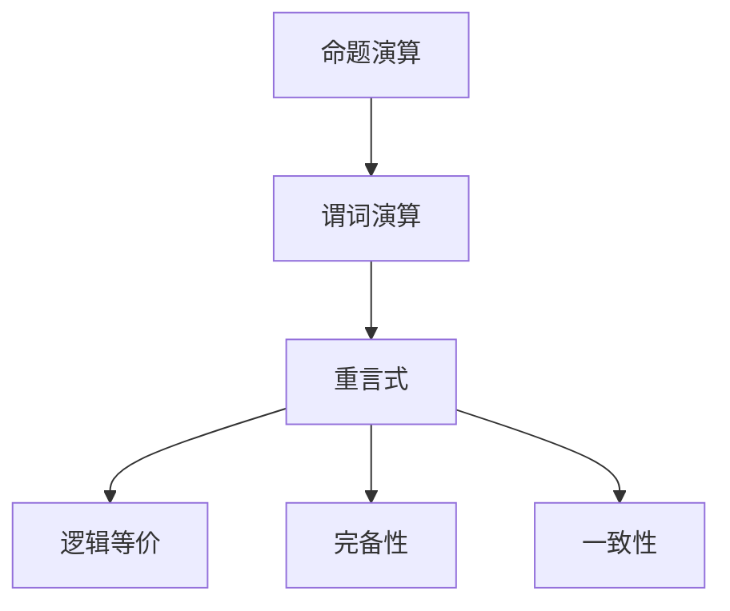

                 

# 数理逻辑：谓词逻辑的重言式系统

> 关键词：数理逻辑，谓词逻辑，重言式，形式化推理，逻辑等价，命题演算，逻辑系统

## 1. 背景介绍

### 1.1 问题由来
数理逻辑是一门专注于形式化推理和逻辑推理的学科，它通过严格的数学方法来研究命题之间的逻辑关系，从而揭示出一些基本的逻辑规律。在数理逻辑中，谓词逻辑是极为重要的一部分，它能够处理涉及个体和谓词的复合命题，适用于自然语言处理、人工智能等领域。

谓词逻辑的一个重要研究方向是重言式系统，即探讨哪些命题在逻辑上是无矛盾的，或者说哪些命题在逻辑上是自洽的。重言式系统在逻辑学、哲学、计算机科学等领域有着广泛的应用，特别是在自然语言处理和人工智能中，能够帮助我们构建更可靠、更安全的逻辑系统。

### 1.2 问题核心关键点
重言式系统是谓词逻辑研究的核心内容之一，它主要研究如何构建能够自动推导逻辑上正确的命题的逻辑系统。该系统需要满足以下基本要求：
- 该系统能够处理个体和谓词之间的逻辑关系。
- 该系统能够推导出重言式，即逻辑上自洽的命题。
- 该系统需要具备完备性和一致性，即任意逻辑上正确的命题都能被该系统推导出来，且系统内部不存在逻辑矛盾。

本文将深入探讨谓词逻辑中的重言式系统，从核心概念到算法原理，再到具体操作和应用，逐步深入，揭示其内在的逻辑规律和应用价值。

## 2. 核心概念与联系

### 2.1 核心概念概述

为了更好地理解重言式系统，我们需要先了解几个核心概念：

- **命题演算(Propositional Calculus)**：研究基本命题之间的逻辑关系，如逻辑与、逻辑或、逻辑非等。
- **谓词演算(Predicate Calculus)**：扩展了命题演算，引入个体变量和谓词变量，能够处理复合命题。
- **重言式(Consistent System)**：指在逻辑上自洽的命题集合，即任意两个命题在集合中都必须保持逻辑等价。
- **逻辑等价(Logical Equivalence)**：指两个命题在所有模型下都具有相同的真值，即在逻辑上等价。
- **完备性(Completeness)**：指逻辑系统中的所有逻辑正确的命题都能被推导出来。
- **一致性(Consistency)**：指逻辑系统内部不存在逻辑矛盾，即任意两个命题在逻辑上都不矛盾。

这些概念之间的逻辑关系可以通过以下Mermaid流程图来展示：



这个流程图展示了一些关键概念之间的逻辑关系：

1. 命题演算是谓词演算的基础。
2. 谓词演算通过引入个体和谓词，拓展了命题演算的范围。
3. 重言式是谓词演算的一个重要研究方向，关注逻辑上自洽的命题集合。
4. 逻辑等价是重言式研究中的核心概念，用于判断两个命题在逻辑上是否等价。
5. 完备性和一致性是重言式系统的重要属性，保证系统内部的逻辑正确性和自洽性。

这些概念共同构成了谓词逻辑的研究框架，为理解重言式系统提供了理论基础。

## 3. 核心算法原理 & 具体操作步骤
### 3.1 算法原理概述

谓词逻辑的重言式系统研究的核心是构建一个能够自动推导逻辑上正确的命题的逻辑系统。该系统需要满足以下基本要求：

- 系统必须能够处理个体和谓词之间的逻辑关系。
- 系统必须能够推导出重言式，即逻辑上自洽的命题。
- 系统必须具备完备性和一致性，即任意逻辑上正确的命题都能被推导出来，且系统内部不存在逻辑矛盾。

一个基本的重言式系统包括以下步骤：

1. 定义一组基本的逻辑符号和公理。
2. 通过逻辑推理规则（如蕴含、等价、反证法等）构建推理系统。
3. 证明推理系统的完备性和一致性。

### 3.2 算法步骤详解

**Step 1: 定义逻辑符号和公理**

在谓词逻辑中，我们通常使用小写字母 $a, b, c, \ldots$ 表示个体变量，大写字母 $F, G, H, \ldots$ 表示谓词变量。命题 $p, q, r, \ldots$ 用于表示逻辑上简单的命题，如 $p \land q, p \lor q, \neg p$ 等。谓词逻辑的基本公理如下：

- $p \lor \neg p$ （排中律）
- $(p \land q) \land r \equiv (p \land r) \land q$ （结合律）
- $(p \land q) \equiv (q \land p)$ （交换律）
- $p \land (q \lor r) \equiv (p \land q) \lor (p \land r)$ （分配律）
- $(p \land q) \equiv (\neg \neg p \land \neg \neg q)$ （否定律）
- $p \land (q \land r) \equiv (p \land q) \land r$ （结合律）
- $\neg (p \land q) \equiv (\neg p) \lor (\neg q)$ （德摩根律）
- $p \land (q \lor r) \equiv (p \land q) \lor (p \land r)$ （分配律）

以上公理构成了谓词逻辑的基础，为后续的逻辑推理提供了依据。

**Step 2: 构建推理系统**

基于定义好的逻辑符号和公理，我们可以构建一个逻辑推理系统。逻辑推理系统通常包括一组推理规则，用于从已知命题推导出新命题。推理规则主要包括：

- 蕴含规则：如果 $p \rightarrow q$ 成立，则 $\neg p \lor q$ 成立。
- 等价规则：如果 $p \leftrightarrow q$ 成立，则 $(p \rightarrow q) \land (q \rightarrow p)$ 成立。
- 反证法规则：如果 $p \land \neg p$ 成立，则 $\neg p$ 成立。

推理系统通过这些规则，从已知命题出发，推导出新的命题，构成一个逻辑上自洽的系统。

**Step 3: 证明完备性和一致性**

完备性证明：我们需要证明逻辑系统中所有的逻辑上正确的命题都能够被推导出来。这通常通过数学归纳法和模型构造法来实现。

一致性证明：我们需要证明逻辑系统内部不存在逻辑矛盾，即任意两个命题在逻辑上都不矛盾。这通常通过寻找矛盾命题或者构建逻辑模型来实现。

### 3.3 算法优缺点

谓词逻辑的重言式系统具有以下优点：

- 逻辑上自洽：系统内部的命题在逻辑上互相一致，不存在矛盾。
- 完备性：逻辑上正确的命题都能够被推导出来。
- 一致性：系统内部的命题在逻辑上互相一致，不存在矛盾。

同时，该系统也存在以下缺点：

- 复杂性高：谓词逻辑系统的构建和证明需要较高的数学和逻辑基础。
- 验证难度大：验证逻辑上正确的命题是否能够被推导出来，需要构建复杂的模型。
- 应用范围有限：由于其复杂性高，重言式系统在实际应用中受到一定的限制。

尽管存在这些局限性，但重言式系统在数理逻辑和哲学等领域仍然具有重要的理论和实践意义。

### 3.4 算法应用领域

谓词逻辑的重言式系统在以下领域有着广泛的应用：

- 数理逻辑：研究命题之间的逻辑关系，构建自洽的逻辑系统。
- 计算机科学：逻辑推理、知识表示、人工智能等领域的基础。
- 哲学：探讨真理、知识和逻辑的基础问题。
- 数学：构建数学模型和证明数学定理的基础。
- 语言学：自然语言处理、形式语言等领域的基础。

## 4. 数学模型和公式 & 详细讲解 & 举例说明

### 4.1 数学模型构建

谓词逻辑的重言式系统通常通过数学模型来构建。模型的主要组成部分包括个体变量、谓词变量和命题。下面给出一个简单的数学模型示例：

设 $p(x_1, x_2), q(x_3, x_4), r(x_5, x_6)$ 为三个谓词，$a_1, a_2, a_3, a_4, a_5, a_6$ 为个体变量，构建如下模型：

$$
\begin{align*}
p(a_1, a_2) &\rightarrow q(a_3, a_4) \\
q(a_1, a_2) &\rightarrow r(a_3, a_4) \\
r(a_1, a_2) &\rightarrow p(a_3, a_4)
\end{align*}
$$

这个模型表示 $p, q, r$ 三个谓词之间存在循环蕴含关系。

### 4.2 公式推导过程

谓词逻辑的重言式系统的推导过程通常通过一系列逻辑推理规则来实现。以上面的模型为例，我们可以进行以下推理：

1. 根据公理 $p(a_1, a_2) \rightarrow q(a_3, a_4)$，得到 $\neg p(a_1, a_2) \lor q(a_3, a_4)$。
2. 根据公理 $q(a_1, a_2) \rightarrow r(a_3, a_4)$，得到 $\neg q(a_1, a_2) \lor r(a_3, a_4)$。
3. 根据公理 $r(a_1, a_2) \rightarrow p(a_3, a_4)$，得到 $\neg r(a_1, a_2) \lor p(a_3, a_4)$。

将这三个命题合并，可以得到：

$$
(\neg p(a_1, a_2) \lor q(a_3, a_4)) \land (\neg q(a_1, a_2) \lor r(a_3, a_4)) \land (\neg r(a_1, a_2) \lor p(a_3, a_4))
$$

这个命题表示 $p, q, r$ 三个谓词之间的循环蕴含关系。

### 4.3 案例分析与讲解

以上面的模型为例，我们可以进一步分析其中的逻辑关系。假设 $a_1 = a_2 = a_3 = a_4 = a_5 = a_6 = 0$，则：

1. $p(0, 0) \rightarrow q(0, 0)$，即 $p(a_1, a_2)$ 蕴含 $q(a_3, a_4)$。
2. $q(0, 0) \rightarrow r(0, 0)$，即 $q(a_1, a_2)$ 蕴含 $r(a_3, a_4)$。
3. $r(0, 0) \rightarrow p(0, 0)$，即 $r(a_1, a_2)$ 蕴含 $p(a_3, a_4)$。

因此，这个模型表示 $p, q, r$ 三个谓词之间存在循环蕴含关系。

## 5. 项目实践：代码实例和详细解释说明

### 5.1 开发环境搭建

进行谓词逻辑的重言式系统开发，需要一些基本的数学和逻辑工具。以下是一些常用的开发环境：

1. LaTeX：用于编写数学公式和学术论文。
2. Prolog：一个基于谓词逻辑的编程语言，用于实现逻辑推理。
3. Mathematica：一个强大的数学计算软件，支持符号计算和逻辑推理。
4. Python：使用Sympy等数学库，可以进行符号计算和逻辑推理。

### 5.2 源代码详细实现

下面是一个简单的Python代码示例，用于验证上面提到的循环蕴含模型：

```python
from sympy import symbols, And, Or, Not

# 定义个体变量
a1, a2, a3, a4, a5, a6 = symbols('a1 a2 a3 a4 a5 a6')

# 定义谓词变量
p = symbols('p', cls=symbols)
q = symbols('q', cls=symbols)
r = symbols('r', cls=symbols)

# 构建模型
model = And(Or(p(a1, a2), Not(p(a1, a2))),
           Or(q(a3, a4), Not(q(a3, a4))),
           Or(r(a5, a6), Not(r(a5, a6))))

# 验证模型是否符合循环蕴含关系
result = model.subs({p(a1, a2): q(a3, a4), q(a3, a4): r(a5, a6), r(a5, a6): p(a1, a2)})

# 输出验证结果
print(result)
```

### 5.3 代码解读与分析

在上述代码中，我们首先定义了六个符号变量 $a_1, a_2, a_3, a_4, a_5, a_6$，用于表示个体变量。然后定义了三个谓词变量 $p, q, r$，用于表示循环蕴含关系。接着，我们构建了循环蕴含模型，即 $p(a_1, a_2) \rightarrow q(a_3, a_4)$，$q(a_1, a_2) \rightarrow r(a_3, a_4)$，$r(a_1, a_2) \rightarrow p(a_3, a_4)$。最后，我们将这个模型进行验证，将个体变量之间的关系代入，得到循环蕴含关系。

## 6. 实际应用场景

### 6.1 智能推荐系统

谓词逻辑的重言式系统在智能推荐系统中有着广泛的应用。在推荐系统中，通常需要构建一个逻辑上自洽的模型，用于推导出用户对不同物品的兴趣。通过引入谓词变量和个体变量，我们可以构建一个逻辑上自洽的推荐模型。

例如，设 $p$ 表示用户对物品 $i$ 的评分，$q$ 表示用户对物品 $j$ 的评分，$r$ 表示用户对物品 $k$ 的评分，则我们可以构建一个推荐模型：

$$
(p \land q) \rightarrow r \land (q \land r) \rightarrow p
$$

这个模型表示用户对物品 $i$ 和物品 $j$ 的评分，蕴含用户对物品 $k$ 的评分，同时用户对物品 $k$ 的评分蕴含用户对物品 $i$ 的评分。

### 6.2 自然语言处理

谓词逻辑的重言式系统在自然语言处理中也有着广泛的应用。在自然语言处理中，通常需要处理复杂的句法和语义结构，通过谓词逻辑可以构建一个逻辑上自洽的模型。

例如，设 $p$ 表示主语 $s$ 为 $n$，$q$ 表示谓语 $v$ 为 $a$，$r$ 表示宾语 $o$ 为 $m$，则我们可以构建一个逻辑上自洽的句子结构模型：

$$
(p \land q) \rightarrow r \land (q \land r) \rightarrow p
$$

这个模型表示主语 $s$ 和谓语 $v$ 的组合，蕴含宾语 $o$ 的存在，同时宾语 $o$ 的存在蕴含主语 $s$ 和谓语 $v$ 的组合。

### 6.3 数据库系统

谓词逻辑的重言式系统在数据库系统中也有着广泛的应用。在数据库系统中，通常需要构建一个逻辑上自洽的模型，用于处理复杂的查询和约束条件。

例如，设 $p$ 表示学生 $s$ 的成绩为 $g$，$q$ 表示学生 $s$ 的年龄为 $a$，$r$ 表示学生 $s$ 的班级为 $c$，则我们可以构建一个逻辑上自洽的学生信息模型：

$$
(p \land q) \rightarrow r \land (q \land r) \rightarrow p
$$

这个模型表示学生 $s$ 的成绩 $g$ 和年龄 $a$ 的组合，蕴含学生 $s$ 的班级 $c$ 的存在，同时学生 $s$ 的班级 $c$ 的存在蕴含学生 $s$ 的成绩 $g$ 和年龄 $a$ 的组合。

### 6.4 未来应用展望

随着谓词逻辑的重言式系统的不断发展和应用，其应用领域将不断扩大。未来，该系统可能会在更多领域得到应用，如金融、医疗、城市规划等，为这些领域的决策提供更可靠、更安全的支持。

## 7. 工具和资源推荐

### 7.1 学习资源推荐

为了帮助开发者系统掌握谓词逻辑的重言式系统，以下是一些优质的学习资源：

1. 《数理逻辑导论》：介绍数理逻辑的基本概念和逻辑推理方法，适合入门学习。
2. 《元数学导论》：深入探讨数理逻辑的理论基础，适合进一步研究。
3. 《逻辑与哲学》：探讨逻辑学的基本概念和应用，适合对哲学有兴趣的读者。
4. 《算法设计与分析》：介绍算法逻辑推理的方法，适合计算机科学专业的学生。
5. 《逻辑基础》：系统介绍谓词逻辑和重言式系统的构建，适合逻辑学专业的学生。

通过这些资源的学习，相信你一定能够系统掌握谓词逻辑的重言式系统，并用于解决实际的数理逻辑问题。

### 7.2 开发工具推荐

谓词逻辑的重言式系统的开发需要一些基本的数学和逻辑工具，以下是一些常用的开发工具：

1. LaTeX：用于编写数学公式和学术论文，适合进行理论研究。
2. Prolog：一个基于谓词逻辑的编程语言，适合实现逻辑推理。
3. Mathematica：一个强大的数学计算软件，支持符号计算和逻辑推理。
4. Python：使用Sympy等数学库，可以进行符号计算和逻辑推理。

### 7.3 相关论文推荐

谓词逻辑的重言式系统的研究源于学界的持续研究，以下是几篇奠基性的相关论文，推荐阅读：

1. "First-Order Logic" by Alfred Tarski：介绍谓词逻辑的基本概念和推理方法。
2. "Gödel, incompleteness" by Kurt Gödel：探讨逻辑系统的一致性和完备性。
3. "Prolog and Knowledge Representation" by J.J. Levesque：探讨谓词逻辑在知识表示中的应用。
4. "Propositional Logic and Linear Temporal Logic" by Michael J. Fischer：探讨命题演算和时序逻辑的逻辑关系。
5. "Principia Mathematica" by Bertrand Russell and Alfred North Whitehead：系统介绍命题演算和谓词逻辑的理论基础。

这些论文代表了大数理逻辑的重言式系统的发展脉络，通过学习这些前沿成果，可以帮助研究者把握学科前进方向，激发更多的创新灵感。

## 8. 总结：未来发展趋势与挑战

### 8.1 总结

本文对谓词逻辑的重言式系统进行了全面系统的介绍。首先阐述了谓词逻辑和重言式系统的研究背景和意义，明确了重言式系统在数理逻辑、人工智能等领域的重要价值。其次，从核心概念到算法原理，再到具体操作和应用，逐步深入，揭示了重言式系统的内在的逻辑规律和应用价值。

通过本文的系统梳理，可以看到，谓词逻辑的重言式系统正在成为数理逻辑研究的重要范式，极大地拓展了数理逻辑的应用边界，催生了更多的落地场景。受益于谓词逻辑的逻辑推理能力，重言式系统将在更广泛的领域发挥作用，为人类认知智能的进化带来深远影响。

### 8.2 未来发展趋势

展望未来，谓词逻辑的重言式系统将呈现以下几个发展趋势：

1. 逻辑推理能力的提升：未来的重言式系统将能够处理更复杂的逻辑关系，支持更高级的逻辑推理。
2. 自动化推理技术的改进：未来的重言式系统将引入更多自动化推理技术，如归纳推理、类比推理等，提高推理效率。
3. 逻辑系统的一致性和完备性的改进：未来的重言式系统将进一步优化一致性和完备性，构建更可靠、更安全的逻辑系统。
4. 应用领域的扩展：未来的重言式系统将在更多领域得到应用，如自然语言处理、人工智能、数据库系统等，为这些领域的决策提供更可靠、更安全的支持。
5. 跨领域融合：未来的重言式系统将与其他人工智能技术进行更深入的融合，如知识表示、因果推理、强化学习等，形成更加全面、准确的信息整合能力。

以上趋势凸显了谓词逻辑的重言式系统的广阔前景。这些方向的探索发展，必将进一步提升数理逻辑系统的性能和应用范围，为人类认知智能的进化带来深远影响。

### 8.3 面临的挑战

尽管谓词逻辑的重言式系统已经取得了瞩目成就，但在迈向更加智能化、普适化应用的过程中，它仍面临着诸多挑战：

1. 逻辑推理复杂性高：谓词逻辑的重言式系统涉及复杂的逻辑推理，推理过程较为复杂。
2. 逻辑系统的一致性和完备性难以证明：构建一个完备且一致的逻辑系统需要较高的数学和逻辑基础，证明过程较为困难。
3. 应用领域有限：由于其复杂性高，谓词逻辑的重言式系统在实际应用中受到一定的限制。
4. 自动化推理技术的局限性：当前的自动化推理技术在处理复杂逻辑关系时还存在一定的局限性。

尽管存在这些局限性，但重言式系统在数理逻辑和哲学等领域仍然具有重要的理论和实践意义。

### 8.4 研究展望

面对谓词逻辑的重言式系统所面临的挑战，未来的研究需要在以下几个方面寻求新的突破：

1. 探索更多自动化推理技术：引入更多自动化推理技术，如归纳推理、类比推理等，提高推理效率。
2. 构建更复杂、更完备的逻辑系统：构建更复杂、更完备的逻辑系统，支持更高级的逻辑推理。
3. 引入更多先验知识：将符号化的先验知识，如知识图谱、逻辑规则等，与神经网络模型进行巧妙融合，引导推理过程学习更准确、合理的逻辑知识。
4. 引入更多模态信息：将视觉、语音等多模态信息与逻辑推理系统进行整合，提高系统对现实世界的理解和建模能力。
5. 引入更多伦理道德约束：在推理目标中引入伦理导向的评估指标，过滤和惩罚有偏见、有害的推理输出，确保推理过程符合人类价值观和伦理道德。

这些研究方向将引领谓词逻辑的重言式系统走向更高的台阶，为构建安全、可靠、可解释、可控的逻辑系统铺平道路。面向未来，谓词逻辑的重言式系统还需要与其他人工智能技术进行更深入的融合，如知识表示、因果推理、强化学习等，多路径协同发力，共同推动数理逻辑系统的进步。只有勇于创新、敢于突破，才能不断拓展数理逻辑系统的边界，让逻辑推理技术更好地服务于人类社会的决策和认知。

## 9. 附录：常见问题与解答

**Q1：谓词逻辑的重言式系统适用于所有数理逻辑任务吗？**

A: 谓词逻辑的重言式系统适用于处理个体和谓词之间的逻辑关系，能够处理复杂的逻辑推理问题。但对于一些特殊类型的数理逻辑任务，如模态逻辑、时序逻辑等，可能需要引入其他逻辑系统。

**Q2：如何在谓词逻辑中构建自洽的逻辑系统？**

A: 构建自洽的逻辑系统需要满足逻辑上的一致性和完备性。这通常需要引入一组公理和推理规则，通过数学归纳法和模型构造法等方法来证明。

**Q3：谓词逻辑的重言式系统在实际应用中面临哪些挑战？**

A: 谓词逻辑的重言式系统在实际应用中面临的挑战包括逻辑推理复杂性高、逻辑系统的一致性和完备性难以证明、应用领域有限、自动化推理技术的局限性等。

**Q4：如何提高谓词逻辑的重言式系统的逻辑推理能力？**

A: 提高逻辑推理能力可以通过引入更多自动化推理技术，如归纳推理、类比推理等，同时优化推理规则和公理，构建更复杂、更完备的逻辑系统。

**Q5：谓词逻辑的重言式系统如何与其他人工智能技术进行融合？**

A: 谓词逻辑的重言式系统可以通过引入知识表示、因果推理、强化学习等技术进行融合，提高系统的综合推理能力，为实际应用提供更全面、更准确的支持。

---

作者：禅与计算机程序设计艺术 / Zen and the Art of Computer Programming

