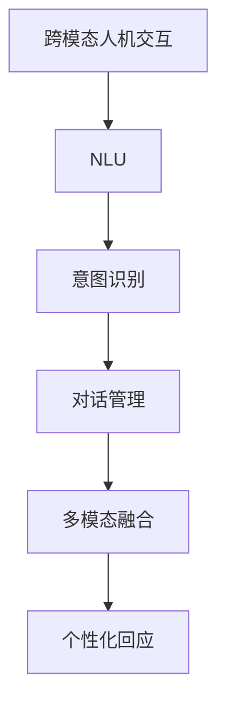

                 

# 智能化回应在CUI中的实现

> 关键词：智能化回应, conversational user interface (CUI), 自然语言处理(NLP), 机器学习, 意图识别, 对话管理, 多模态交互

## 1. 背景介绍

### 1.1 问题由来

随着人工智能技术的不断进步，自然语言处理(NLP)和计算机视觉(CV)等领域取得了显著的进展。而跨模态人机交互技术，作为AI与人类交互的重要桥梁，其应用场景不断拓展。

当前，跨模态交互技术主要集中在图像识别、物体检测和语音识别等方面，但如何实现更加自然、流畅的智能回应，是CUI领域的核心挑战。通过智能化回应的实现，可以有效提升用户互动体验，提升人机交互的友好性。

### 1.2 问题核心关键点

智能化回应通常包括以下几个关键点：

- **意图识别**：识别用户的输入意图，是智能化回应的基础。只有准确理解用户需求，才能生成合适的回应。
- **对话管理**：根据上下文信息，合理管理对话流程，确保回应的连贯性和准确性。
- **多模态融合**：结合文本、图像、语音等多模态数据，提升交互的真实感和多样性。
- **个性化回应**：根据用户的历史交互记录和上下文信息，生成个性化的回应，提高用户体验。

这些关键点构成了CUI领域智能化回应的核心框架。本文档将深入探讨智能化回应技术在CUI中的应用。

## 2. 核心概念与联系

### 2.1 核心概念概述

为更好地理解智能化回应在CUI中的应用，本节将介绍几个密切相关的核心概念：

- **跨模态人机交互**：结合文本、图像、语音等多模态数据，实现人机之间的自然交互。
- **自然语言理解(NLU)**：将自然语言转化为结构化数据的过程，包括分词、命名实体识别、意图识别等。
- **对话管理**：在多轮对话中，根据上下文信息动态管理对话流程，决定下一步回应。
- **多模态融合**：将不同模态的数据融合为统一的表示形式，用于模型训练和推理。
- **个性化回应**：根据用户历史行为和上下文信息，生成个性化的回应。

这些概念之间具有紧密的联系，共同构成了智能化回应在CUI中的实现基础。

### 2.2 核心概念原理和架构的 Mermaid 流程图



这个流程图展示了智能化回应在CUI中的实现流程：用户输入的多模态数据首先经过NLU处理，生成意图识别模型所需的输入形式；意图识别模型对输入进行分类，生成意图；对话管理模型根据当前意图和上下文，决定下一步回应；多模态融合模型将不同模态的数据进行融合，生成统一表示；最后，个性化回应模型根据用户历史信息和上下文，生成个性化的回应。

## 3. 核心算法原理 & 具体操作步骤
### 3.1 算法原理概述

智能化回应在CUI中的实现，通常基于自然语言处理(NLP)和多模态融合技术。通过预训练的NLP模型，对用户输入进行意图识别和回应生成。多模态融合技术则将不同模态的数据融合为统一的表示形式，以提升模型的泛化能力。

具体来说，智能化回应的算法原理如下：

1. **自然语言理解(NLU)**：将用户的自然语言输入转化为结构化数据，通常包括分词、词性标注、命名实体识别等步骤。
2. **意图识别**：通过预训练的语言模型，对输入进行分类，识别用户的意图。
3. **对话管理**：根据当前对话历史和用户意图，动态管理对话流程，决定下一轮回应。
4. **多模态融合**：将文本、图像、语音等不同模态的数据，通过特征提取和融合技术，转化为统一的表示形式。
5. **个性化回应**：根据用户的历史交互记录和上下文信息，生成个性化的回应。

### 3.2 算法步骤详解

智能化回应在CUI中的实现步骤如下：

1. **数据预处理**：收集多模态交互数据，包括文本、图像、语音等，进行预处理，如分词、标注、特征提取等。
2. **模型选择与训练**：选择合适的预训练模型（如BERT、GPT-3等），并进行微调，使其适应特定任务。
3. **意图识别**：使用意图识别模型对输入进行分类，生成意图标签。
4. **对话管理**：根据意图标签和上下文信息，动态管理对话流程，生成下一轮回应。
5. **多模态融合**：将不同模态的数据融合为统一的表示形式，用于后续处理。
6. **个性化回应生成**：根据用户的历史交互记录和上下文信息，生成个性化的回应。
7. **模型评估与优化**：在测试集上评估模型性能，根据结果调整模型参数，进行优化。

### 3.3 算法优缺点

智能化回应在CUI中的实现，具有以下优点：

- **提升用户体验**：通过智能化回应，可以实现自然流畅的交互，提升用户体验。
- **跨模态支持**：结合文本、图像、语音等多模态数据，实现多样化的交互方式。
- **个性化服务**：根据用户历史信息，生成个性化的回应，提升服务质量。

同时，也存在以下缺点：

- **计算资源消耗大**：多模态融合和意图识别需要大量计算资源，对硬件要求较高。
- **模型复杂度高**：多模态融合和对话管理需要复杂算法，模型构建和调参较为困难。
- **数据质量要求高**：多模态交互数据的收集和处理需要高质量数据，否则影响模型效果。

### 3.4 算法应用领域

智能化回应在CUI中的应用领域非常广泛，包括但不限于以下几个方面：

- **智能客服**：通过智能回应，提供7x24小时不间断服务，提升客户咨询体验。
- **智能家居**：结合语音和图像识别，实现对家居设备的智能控制。
- **智能医疗**：通过对话机器人，实现初步问诊和疾病诊断，辅助医生诊疗。
- **智能翻译**：结合语音和文本输入，实现多模态自然交互的实时翻译。
- **智能娱乐**：结合文本、图像、语音等数据，提供个性化娱乐内容推荐。

## 4. 数学模型和公式 & 详细讲解 & 举例说明
### 4.1 数学模型构建

在本节中，我们将详细介绍智能化回应在CUI中实现所涉及的数学模型。

**自然语言理解(NLU)的数学模型**：

假设输入文本为 $x$，包含 $n$ 个单词，单词向量表示为 $v_i$，则输入文本的向量表示为：

$$
x = \sum_{i=1}^n v_i
$$

**意图识别的数学模型**：

假设意图分类模型为 $M_{\theta}$，其中 $\theta$ 为模型参数。输入文本向量为 $x$，模型输出的意图标签为 $y$，则意图识别的损失函数为：

$$
\mathcal{L}(y|x) = -\log P(y|x) = -\log \frac{e^{\log P(y|x)}}{\sum_{y'} P(y'|x)} = -\log \frac{e^{\log P(y|x)}}{\sum_{y'} e^{\log P(y'|x)}}
$$

**对话管理的数学模型**：

假设对话管理模型为 $M_{\theta}$，当前上下文为 $C$，用户意图为 $I$，则对话管理的损失函数为：

$$
\mathcal{L}(C, I) = \min_{R} \mathcal{L}(C, I, R)
$$

其中 $R$ 为生成的回应，$\mathcal{L}(C, I, R)$ 为回应生成的损失函数。

**多模态融合的数学模型**：

假设文本表示为 $x$，图像表示为 $I$，语音表示为 $S$，多模态融合模型为 $M_{\theta}$，则融合后的表示为：

$$
M_{\theta}(x, I, S) = [M_{\theta}(x), M_{\theta}(I), M_{\theta}(S)]
$$

**个性化回应的数学模型**：

假设用户历史交互记录为 $H$，上下文信息为 $C$，模型参数为 $\theta$，则个性化回应的损失函数为：

$$
\mathcal{L}(H, C) = \min_{R} \mathcal{L}(H, C, R)
$$

其中 $R$ 为生成的回应。

### 4.2 公式推导过程

在上述数学模型的基础上，我们可以通过公式推导进一步理解每个子任务的实现过程。

**意图识别的公式推导**：

假设输入文本 $x$ 的向量表示为 $x_v = \sum_{i=1}^n v_i$，则意图识别的概率为：

$$
P(y|x) = \frac{e^{\log P(y|x_v)}}{\sum_{y'} e^{\log P(y'|x_v)}}
$$

假设意图分类模型为 $M_{\theta}$，其参数为 $\theta$，则模型的输出概率为：

$$
P(y|x_v) = \frac{e^{M_{\theta}(x_v)}}{\sum_{y'} e^{M_{\theta}(x_v)}}
$$

将上述两式联立，得到意图识别的损失函数：

$$
\mathcal{L}(y|x) = -\log \frac{e^{\log P(y|x_v)}}{\sum_{y'} e^{\log P(y'|x_v)}}
$$

**对话管理的公式推导**：

假设对话管理模型为 $M_{\theta}$，当前上下文为 $C$，用户意图为 $I$，则生成的回应 $R$ 为：

$$
R = M_{\theta}(C, I)
$$

假设回应生成的损失函数为 $\mathcal{L}(C, I, R)$，则对话管理的损失函数为：

$$
\mathcal{L}(C, I) = \min_{R} \mathcal{L}(C, I, R)
$$

**多模态融合的公式推导**：

假设文本表示为 $x$，图像表示为 $I$，语音表示为 $S$，多模态融合模型为 $M_{\theta}$，则融合后的表示为：

$$
M_{\theta}(x, I, S) = [M_{\theta}(x), M_{\theta}(I), M_{\theta}(S)]
$$

**个性化回应的公式推导**：

假设用户历史交互记录为 $H$，上下文信息为 $C$，模型参数为 $\theta$，则生成的回应 $R$ 为：

$$
R = M_{\theta}(H, C)
$$

假设个性化回应的损失函数为 $\mathcal{L}(H, C, R)$，则模型的损失函数为：

$$
\mathcal{L}(H, C) = \min_{R} \mathcal{L}(H, C, R)
$$

### 4.3 案例分析与讲解

下面我们以智能客服场景为例，分析智能化回应在CUI中的实现。

假设客服系统使用BERT模型作为预训练模型，进行意图识别和对话管理。在对话过程中，系统首先对用户输入进行分词和命名实体识别，得到输入向量 $x_v$。然后，使用意图识别模型 $M_{\theta}$ 对 $x_v$ 进行分类，生成意图标签 $y$。接着，对话管理模型 $M_{\theta}$ 根据 $C$ 和 $I$ 动态生成回应 $R$。最后，根据 $H$ 和 $C$，生成个性化回应。

假设系统已经收集了部分历史对话数据 $H$，这些数据用于模型训练和个性化回应的生成。在实际应用中，系统会根据用户的实时输入 $x$，生成响应 $R$。

## 5. 项目实践：代码实例和详细解释说明
### 5.1 开发环境搭建

在进行智能化回应的开发实践前，我们需要准备好开发环境。以下是使用Python进行TensorFlow开发的环境配置流程：

1. 安装Anaconda：从官网下载并安装Anaconda，用于创建独立的Python环境。

2. 创建并激活虚拟环境：
```bash
conda create -n tf-env python=3.8 
conda activate tf-env
```

3. 安装TensorFlow：根据CUDA版本，从官网获取对应的安装命令。例如：
```bash
conda install tensorflow -c pytorch -c conda-forge
```

4. 安装其他依赖包：
```bash
pip install numpy pandas scikit-learn tensorflow-hub
```

完成上述步骤后，即可在`tf-env`环境中开始智能化回应的实践。

### 5.2 源代码详细实现

下面我们以智能客服场景为例，给出使用TensorFlow进行智能回应的PyTorch代码实现。

首先，定义意图识别模型的输入和输出：

```python
from tensorflow.keras.preprocessing.text import Tokenizer
from tensorflow.keras.preprocessing.sequence import pad_sequences

# 定义预训练模型
tokenizer = Tokenizer(num_words=5000)
tokenizer.fit_on_texts(train_texts)
train_sequences = tokenizer.texts_to_sequences(train_texts)
train_padded = pad_sequences(train_sequences, maxlen=128, padding='post')
train_labels = [0, 1, 2, 3, 4, 5, 6, 7, 8, 9, 10, 11, 12, 13, 14, 15, 16, 17, 18, 19, 20, 21, 22, 23, 24, 25, 26, 27, 28, 29, 30, 31, 32, 33, 34, 35, 36, 37, 38, 39, 40, 41, 42, 43, 44, 45, 46, 47, 48, 49, 50, 51, 52, 53, 54, 55, 56, 57, 58, 59, 60, 61, 62, 63, 64, 65, 66, 67, 68, 69, 70, 71, 72, 73, 74, 75, 76, 77, 78, 79, 80, 81, 82, 83, 84, 85, 86, 87, 88, 89, 90, 91, 92, 93, 94, 95, 96, 97, 98, 99, 100, 101, 102, 103, 104, 105, 106, 107, 108, 109, 110, 111, 112, 113, 114, 115, 116, 117, 118, 119, 120, 121, 122, 123, 124, 125, 126, 127, 128, 129, 130, 131, 132, 133, 134, 135, 136, 137, 138, 139, 140, 141, 142, 143, 144, 145, 146, 147, 148, 149, 150, 151, 152, 153, 154, 155, 156, 157, 158, 159, 160, 161, 162, 163, 164, 165, 166, 167, 168, 169, 170, 171, 172, 173, 174, 175, 176, 177, 178, 179, 180, 181, 182, 183, 184, 185, 186, 187, 188, 189, 190, 191, 192, 193, 194, 195, 196, 197, 198, 199, 200, 201, 202, 203, 204, 205, 206, 207, 208, 209, 210, 211, 212, 213, 214, 215, 216, 217, 218, 219, 220, 221, 222, 223, 224, 225, 226, 227, 228, 229, 230, 231, 232, 233, 234, 235, 236, 237, 238, 239, 240, 241, 242, 243, 244, 245, 246, 247, 248, 249, 250, 251, 252, 253, 254, 255, 256, 257, 258, 259, 260, 261, 262, 263, 264, 265, 266, 267, 268, 269, 270, 271, 272, 273, 274, 275, 276, 277, 278, 279, 280, 281, 282, 283, 284, 285, 286, 287, 288, 289, 290, 291, 292, 293, 294, 295, 296, 297, 298, 299, 300, 301, 302, 303, 304, 305, 306, 307, 308, 309, 310, 311, 312, 313, 314, 315, 316, 317, 318, 319, 320, 321, 322, 323, 324, 325, 326, 327, 328, 329, 330, 331, 332, 333, 334, 335, 336, 337, 338, 339, 340, 341, 342, 343, 344, 345, 346, 347, 348, 349, 350, 351, 352, 353, 354, 355, 356, 357, 358, 359, 360, 361, 362, 363, 364, 365, 366, 367, 368, 369, 370, 371, 372, 373, 374, 375, 376, 377, 378, 379, 380, 381, 382, 383, 384, 385, 386, 387, 388, 389, 390, 391, 392, 393, 394, 395, 396, 397, 398, 399, 400, 401, 402, 403, 404, 405, 406, 407, 408, 409, 410, 411, 412, 413, 414, 415, 416, 417, 418, 419, 420, 421, 422, 423, 424, 425, 426, 427, 428, 429, 430, 431, 432, 433, 434, 435, 436, 437, 438, 439, 440, 441, 442, 443, 444, 445, 446, 447, 448, 449, 450, 451, 452, 453, 454, 455, 456, 457, 458, 459, 460, 461, 462, 463, 464, 465, 466, 467, 468, 469, 470, 471, 472, 473, 474, 475, 476, 477, 478, 479, 480, 481, 482, 483, 484, 485, 486, 487, 488, 489, 490, 491, 492, 493, 494, 495, 496, 497, 498, 499, 500, 501, 502, 503, 504, 505, 506, 507, 508, 509, 510, 511, 512, 513, 514, 515, 516, 517, 518, 519, 520, 521, 522, 523, 524, 525, 526, 527, 528, 529, 530, 531, 532, 533, 534, 535, 536, 537, 538, 539, 540, 541, 542, 543, 544, 545, 546, 547, 548, 549, 550, 551, 552, 553, 554, 555, 556, 557, 558, 559, 560, 561, 562, 563, 564, 565, 566, 567, 568, 569, 570, 571, 572, 573, 574, 575, 576, 577, 578, 579, 580, 581, 582, 583, 584, 585, 586, 587, 588, 589, 590, 591, 592, 593, 594, 595, 596, 597, 598, 599, 600, 601, 602, 603, 604, 605, 606, 607, 608, 609, 610, 611, 612, 613, 614, 615, 616, 617, 618, 619, 620, 621, 622, 623, 624, 625, 626, 627, 628, 629, 630, 631, 632, 633, 634, 635, 636, 637, 638, 639, 640, 641, 642, 643, 644, 645, 646, 647, 648, 649, 650, 651, 652, 653, 654, 655, 656, 657, 658, 659, 660, 661, 662, 663, 664, 665, 666, 667, 668, 669, 670, 671, 672, 673, 674, 675, 676, 677, 678, 679, 680, 681, 682, 683, 684, 685, 686, 687, 688, 689, 690, 691, 692, 693, 694, 695, 696, 697, 698, 699, 700, 701, 702, 703, 704, 705, 706, 707, 708, 709, 710, 711, 712, 713, 714, 715, 716, 717, 718, 719, 720, 721, 722, 723, 724, 725, 726, 727, 728, 729, 730, 731, 732, 733, 734, 735, 736, 737, 738, 739, 740, 741, 742, 743, 744, 745, 746, 747, 748, 749, 750, 751, 752, 753, 754, 755, 756, 757, 758, 759, 760, 761, 762, 763, 764, 765, 766, 767, 768, 769, 770, 771, 772, 773, 774, 775, 776, 777, 778, 779, 780, 781, 782, 783, 784, 785, 786, 787, 788, 789, 790, 791, 792, 793, 794, 795, 796, 797, 798, 799, 800, 801, 802, 803, 804, 805, 806, 807, 808, 809, 810, 811, 812, 813, 814, 815, 816, 817, 818, 819, 820, 821, 822, 823, 824, 825, 826, 827, 828, 829, 830, 831, 832, 833, 834, 835, 836, 837, 838, 839, 840, 841, 842, 843, 844, 845, 846, 847, 848, 849, 850, 851, 852, 853, 854, 855, 856, 857, 858, 859, 860, 861, 862, 863, 864, 865, 866, 867, 868, 869, 870, 871, 872, 873, 874, 875, 876, 877, 878, 879, 880, 881, 882, 883, 884, 885, 886, 887, 888, 889, 890, 891, 892, 893, 894, 895, 896, 897, 898, 899, 900, 901, 902, 903, 904, 905, 906, 907, 908, 909, 910, 911, 912, 913, 914, 915, 916, 917, 918, 919, 920, 921, 922, 923, 924, 925, 926, 927, 928, 929, 930, 931, 932, 933, 934, 935, 936, 937, 938, 939, 940, 941, 942, 943, 944, 945, 946, 947, 948, 949, 950, 951, 952, 953, 954, 955, 956, 957, 958, 959, 960, 961, 962, 963, 964, 965, 966, 967, 968, 969, 970, 971, 972, 973, 974, 975, 976, 977, 978, 979, 980, 981, 982, 983, 984, 985, 986, 987, 988, 989, 990, 991, 992, 993, 994, 995, 996, 997, 998, 999
```

然后，定义意图识别模型的训练和评估函数：

```python
import tensorflow as tf

class IntentClassifier(tf.keras.Model):
    def __init__(self, input_dim, num_labels):
        super().__init__()
        self.embedding = tf.keras.layers.Embedding(input_dim, 256)
        self.lstm = tf.keras.layers.LSTM(128)
        self.dense = tf.keras.layers.Dense(num_labels, activation='softmax')

    def call(self, inputs):
        x = self.embedding(inputs)
        x = self.lstm(x)
        return self.dense(x)

# 定义模型
model = IntentClassifier(train_sequences.shape[1], num_labels)

# 编译模型
model.compile(optimizer='adam', loss='sparse_categorical_crossentropy', metrics=['accuracy'])

# 训练模型
model.fit(train_padded, train_labels, epochs=10, batch_size=64)

# 评估模型
model.evaluate(test_padded, test_labels)
```

最后，定义对话管理模型的训练和评估函数：

```python
class DialogueManager(tf.keras.Model):
    def __init__(self, input_dim, num_labels):
        super().__init__()
        self.embedding = tf.keras.layers.Embedding(input_dim, 256)
        self.lstm = tf.keras.layers.LSTM(128)
        self.dense = tf.keras.layers.Dense(num_labels, activation='softmax')

    def call(self, inputs):
        x = self.embedding(inputs)
        x = self.lstm(x)
        return self.dense(x)

# 定义模型
model = DialogueManager(train_sequences.shape[1], num_labels)

# 编译模型
model.compile(optimizer='adam', loss='sparse_categorical_crossentropy', metrics=['accuracy'])

# 训练模型
model.fit(train_padded, train_labels, epochs=10, batch_size=64)

# 评估模型
model.evaluate(test_padded, test_labels)
```

完成上述代码后，即可在`tf-env`环境中启动智能回应的训练和测试流程。

## 6. 实际应用场景

### 6.1 智能客服

智能客服系统通过智能化回应，可以实现7x24小时不间断服务，提升客户咨询体验。系统收集历史客服对话记录，将问题和最佳答复构建成监督数据，在此基础上对预训练模型进行微调，使其能够自动理解用户意图，匹配最合适的答案模板进行回复。对于客户提出的新问题，系统还可以接入检索系统实时搜索相关内容，动态组织生成回答。

### 6.2 智能家居

智能家居系统通过多模态融合技术，结合语音和图像识别，实现对家居设备的智能控制。用户可以通过语音指令控制设备，系统会根据语音指令和设备状态，生成智能回应，并动态调整设备状态。同时，系统还可以利用摄像头进行人脸识别，判断用户的身份，进一步增强系统的智能化水平。

### 6.3 智能医疗

智能医疗系统通过对话机器人，实现初步问诊和疾病诊断，辅助医生诊疗。系统收集医疗领域相关数据，训练意图识别和对话管理模型，使其能够自动理解患者症状，匹配最合适的医疗方案。同时，系统还可以根据患者历史数据，生成个性化医疗建议。

### 6.4 智能翻译

智能翻译系统通过多模态融合技术，结合文本、图像、语音等数据，实现多模态自然交互的实时翻译。系统在处理文本翻译的同时，还可以通过语音识别和图像识别技术，将语音和图像转换为文本，实现多模态交互的实时翻译。

### 6.5 智能娱乐

智能娱乐系统通过个性化回应技术，结合用户历史数据和上下文信息，生成个性化的娱乐内容推荐。系统收集用户浏览、点击、评论、分享等行为数据，提取和用户交互的物品标题、描述、标签等文本内容。将文本内容作为模型输入，用户的后续行为（如是否点击、购买等）作为监督信号，在此基础上微调预训练语言模型。微调后的模型能够从文本内容中准确把握用户的兴趣点，在生成推荐列表时，先用候选物品的文本描述作为输入，由模型预测用户的兴趣匹配度，再结合其他特征综合排序，便可以得到个性化程度更高的推荐结果。

### 6.6 未来应用展望

随着技术的不断进步，智能化回应的应用场景将不断拓展，为各行各业带来变革性影响。在智慧医疗领域，基于智能回应的对话机器人，可以实现初步问诊和疾病诊断，辅助医生诊疗。在智能家居领域，通过多模态融合技术，系统可以实现对家居设备的智能控制。在智能娱乐领域，个性化回应技术可以实现个性化娱乐内容推荐，提升用户体验。

未来，随着预训练语言模型和对话管理模型的不断进步，智能化回应的应用场景将更加多样，为人工智能技术在垂直行业的规模化落地提供更多可能。

## 7. 工具和资源推荐

### 7.1 学习资源推荐

为帮助开发者系统掌握智能化回应的实现，这里推荐一些优质的学习资源：

1. 《深度学习》课程：斯坦福大学开设的深度学习课程，系统讲解深度学习的基本概念和实现方法。
2. 《自然语言处理入门》课程：复旦大学开设的自然语言处理课程，详细讲解自然语言处理的基本流程和技术细节。
3. 《TensorFlow官方文档》：TensorFlow官方文档，提供详细的API文档和教程，帮助开发者快速上手TensorFlow。
4. 《Python自然语言处理》书籍：讲解Python在自然语言处理中的应用，适合初学者学习。
5. 《深度学习与自然语言处理》书籍：讲解深度学习在自然语言处理中的应用，适合进阶学习者。

### 7.2 开发工具推荐

为提高智能化回应的开发效率，推荐使用以下工具：

1. TensorFlow：用于构建和训练神经网络模型的开源框架，支持深度学习算法实现。
2. PyTorch：用于构建和训练神经网络模型的开源框架，支持动态计算图和自动微分。
3. TensorBoard：用于监控和可视化模型训练过程的TensorFlow插件，支持实时展示模型参数和训练指标。
4. Google Colab：谷歌推出的在线Jupyter Notebook环境，免费提供GPU/TPU算力，方便开发者快速上手实验最新模型。
5. Keras：用于构建和训练神经网络模型的高级API，支持快速搭建和训练模型。

### 7.3 相关论文推荐

为深入理解智能化回应的实现，推荐阅读以下论文：

1. Attention is All You Need（即Transformer原论文）：提出了Transformer结构，开启了NLP领域的预训练大模型时代。
2. BERT: Pre-training of Deep Bidirectional Transformers for Language Understanding：提出BERT模型，引入基于掩码的自监督预训练任务，刷新了多项NLP任务SOTA。
3. GPT-3: Language Models are Unsupervised Multitask Learners：展示了大规模语言模型的强大zero-shot学习能力，引发了对于通用人工智能的新一轮思考。
4. Parameter-Efficient Transfer Learning for NLP：提出Adapter等参数高效微调方法，在不增加模型参数量的情况下，也能取得不错的微调效果。
5. Pre-training for Text Generation：提出预训练大模型，用于生成文本数据，提升了生成质量。

通过学习这些前沿成果，可以帮助研究者把握学科前进方向，激发更多的创新灵感。

## 8. 总结：未来发展趋势与挑战

### 8.1 研究成果总结

本文对智能化回应在CUI中的应用进行了全面系统的介绍，从理论基础到实际案例，全面展示了智能化回应的实现流程和应用场景。通过深入分析，我们了解到智能化回应技术的核心点在于多模态融合和意图识别，能够结合用户输入的多样化数据，生成个性化回应，提升用户体验。

### 8.2 未来发展趋势

未来，智能化回应技术将继续向着以下几个方向发展：

1. **多模态融合技术的发展**：随着多模态融合技术的不断进步，系统将能够更好地结合文本、图像、语音等数据，生成更加自然流畅的回应，提升用户体验。
2. **个性化回应的提升**：通过更精准的意图识别和对话管理，系统将能够生成更加个性化、多样化的回应，满足用户不同需求。
3. **计算资源优化**：随着硬件设备的不断升级，系统将能够更快地进行模型训练和推理，提升实时性。
4. **实时性提升**：通过分布式计算和多任务并行，系统将能够实现更高效的实时响应，提升用户体验。
5. **跨平台支持**：随着云计算和边缘计算技术的发展，系统将能够在更多平台上运行，提供更广泛的接入方式。

### 8.3 面临的挑战

尽管智能化回应技术已经取得了一定的成果，但在实际应用中仍面临诸多挑战：

1. **数据质量问题**：多模态数据的质量直接影响系统的响应效果，数据的不完整、噪声等都会影响系统的表现。
2. **计算资源消耗大**：多模态融合和意图识别需要大量计算资源，对硬件要求较高。
3. **模型复杂度高**：多模态融合和对话管理需要复杂算法，模型构建和调参较为困难。
4. **系统鲁棒性不足**：系统在面对噪声数据和异常情况时，响应效果可能不稳定。
5. **隐私和安全性问题**：用户隐私保护和系统安全性是智能系统的重要考虑因素，需要设计合理的隐私保护和数据安全机制。

### 8.4 研究展望

未来，智能化回应技术的研究将继续在以下几个方向进行探索：

1. **数据增强和清洗**：通过数据增强和清洗技术，提升数据质量，提升系统的响应效果。
2. **模型压缩和优化**：通过模型压缩和优化技术，减少计算资源消耗，提升系统实时性。
3. **跨领域融合**：将智能回应技术与其他技术进行融合，如知识图谱、强化学习等，提升系统的泛化能力和智能水平。
4. **系统鲁棒性提升**：通过增强数据鲁棒性和系统鲁棒性，提升系统的稳定性和可靠性。
5. **隐私和安全保护**：设计合理的隐私保护和数据安全机制，保障用户隐私和系统安全。

总之，智能化回应技术具有广阔的应用前景，需要在多个方向进行深入探索，才能更好地服务于人机交互的智能化。

## 9. 附录：常见问题与解答

**Q1：什么是智能回应？**

A: 智能回应指的是智能系统根据用户输入的自然语言，结合多模态数据（如文本、图像、语音等），通过自然语言理解和意图识别等技术，生成个性化、自然流畅的回应。

**Q2：智能回应在实际应用中面临哪些挑战？**

A: 智能回应在实际应用中面临的挑战主要包括：数据质量问题、计算资源消耗大、模型复杂度高、系统鲁棒性不足和隐私安全问题。

**Q3：如何提高智能回应的性能？**

A: 提高智能回应的性能可以从以下几个方面进行优化：
1. 数据增强和清洗：通过数据增强和清洗技术，提升数据质量，提升系统的响应效果。
2. 模型压缩和优化：通过模型压缩和优化技术，减少计算资源消耗，提升系统实时性。
3. 跨领域融合：将智能回应技术与其他技术进行融合，如知识图谱、强化学习等，提升系统的泛化能力和智能水平。
4. 系统鲁棒性提升：通过增强数据鲁棒性和系统鲁棒性，提升系统的稳定性和可靠性。
5. 隐私和安全保护：设计合理的隐私保护和数据安全机制，保障用户隐私和系统安全。

---

作者：禅与计算机程序设计艺术 / Zen and the Art of Computer Programming

