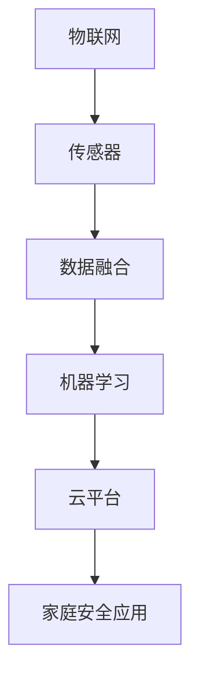

                 

# 智能家居安全创业：IoT驱动的家庭防护

> 关键词：智能家居,家庭安全,物联网(IoT),传感器,数据融合,机器学习

## 1. 背景介绍

### 1.1 问题由来

随着智能家居技术的发展，家庭安全系统逐渐向智能化、自动化转型。传统的家庭安全主要依赖于人工监控和简单报警系统，存在误报率高、响应时间长等诸多问题。而智能家居系统通过部署各种传感器和摄像头，可以实时监测家庭环境，并通过人工智能技术进行智能分析和预警，大幅提升家庭安全防护的效率和精度。

近年来，国内外的多家创业公司，如Silent Security, Ring, SmartThings等，通过智能家居安全创业项目，成功地将人工智能与家庭安全结合，开发出了高精度的智能安防产品，赢得了市场的广泛认可。

### 1.2 问题核心关键点

智能家居安全创业的核心在于：

1. 如何利用物联网技术采集家庭环境数据，构建全面的安全监测系统。
2. 如何通过机器学习和数据融合技术，实现智能分析和预警。
3. 如何设计安全可靠的云平台和智能家居设备，保障数据传输和系统安全。
4. 如何开发出满足用户需求、易用性高的家庭安全应用，实现更好的用户体验。

这些核心问题相互交织，需要在技术、市场、用户体验等多个层面进行综合考量，以实现家庭安全的智能化转型。

### 1.3 问题研究意义

智能家居安全创业项目的发展，对于推动传统家居安全产业的升级，提升家庭生活质量，具有重要意义：

1. 提升家庭安全水平。利用智能传感器和摄像头，实时监测家庭环境，通过机器学习算法分析异常行为，实现提前预警，有效降低家庭安全风险。
2. 提高安全系统性价比。智能家居安全系统通过自动检测、智能预警，显著减少了人力和物力成本，同时提升了用户体验。
3. 推动家居安全产业创新。智能家居安全创业项目融合了最新的人工智能技术，带动了家居安全产业的创新发展，催生了更多新兴的商业模式。
4. 满足用户多样化需求。智能家居安全系统能够提供多种报警、检测、监控功能，满足不同用户群体的个性化需求。
5. 推动人工智能技术落地应用。智能家居安全创业项目为人工智能技术提供了大规模的应用场景，有助于推动AI技术的实际落地和应用普及。

## 2. 核心概念与联系

### 2.1 核心概念概述

为更好地理解智能家居安全创业项目的技术和应用，本节将介绍几个密切相关的核心概念：

- 物联网(IoT)：指通过互联网将各种传感器、设备等互相连接，实现设备间的数据传输和通信。
- 传感器：指用于监测环境数据(如温度、湿度、烟雾、震动等)的物理装置。
- 数据融合：指将多个数据源中的信息融合起来，形成更全面、准确的监测结果。
- 机器学习：指通过训练算法，使模型从数据中自动学习规律和模式，实现预测和决策。
- 云平台：指通过网络服务，提供数据存储、计算、分析等资源的平台。
- 家庭安全应用：指针对家庭安全场景开发的软件应用，提供报警、监控、数据分析等功能。

这些核心概念之间的逻辑关系可以通过以下Mermaid流程图来展示：



这个流程图展示了你智能家居安全创业项目的主要流程：

1. 通过物联网技术，将各种传感器部署在家居环境中，实时采集环境数据。
2. 利用数据融合技术，将多个传感器的数据综合分析，形成更全面的监测结果。
3. 应用机器学习算法，对数据进行智能分析，实现异常行为识别和预警。
4. 将分析结果上传到云平台，实现数据存储和远程监控。
5. 通过家庭安全应用，提供报警、监控、数据分析等功能。

## 3. 核心算法原理 & 具体操作步骤

### 3.1 算法原理概述

智能家居安全创业项目的核心算法，是利用物联网技术采集环境数据，通过数据融合和机器学习技术，实现智能分析和预警。

假设家庭环境中部署了 $N$ 个传感器，每个传感器采集到的数据分别为 $x_{1,1},x_{1,2},\dots,x_{1,N}$。数据融合算法将这些传感器数据进行综合处理，得到综合监测结果 $z_1=\sum_{i=1}^N\alpha_i x_{1,i}$，其中 $\alpha_i$ 为各传感器数据的重要性权重。

机器学习算法基于综合监测结果 $z_1$，利用训练数据集 $D=\{(z_1^j,y_j)\}_{j=1}^M$，其中 $z_1^j$ 为第 $j$ 次监测结果，$y_j$ 为相应的预警标签，训练出一个预测模型 $M(z_1)$，使得 $M(z_1)=\hat{y}$ 能够逼近真实预警标签 $y$。

预测模型 $M(z_1)$ 的具体形式可以是线性回归、逻辑回归、SVM等，或者更复杂的网络模型，如卷积神经网络、循环神经网络等。

### 3.2 算法步骤详解

智能家居安全创业项目的主要算法步骤如下：

**Step 1: 传感器部署与数据采集**
- 根据家庭安全需求，选择合适的传感器部署在家庭各个角落，如门窗、卧室、厨房等。
- 配置传感器的网络协议，实现数据的实时传输和存储。

**Step 2: 数据融合与特征提取**
- 对采集到的数据进行预处理，如去噪、归一化等。
- 应用数据融合算法，将多个传感器的数据综合分析，得到综合监测结果 $z_1$。
- 提取数据的特征，如温度变化率、烟雾浓度等，作为后续分析的输入。

**Step 3: 模型训练与参数调优**
- 准备训练数据集，并选择合适的训练算法和模型。
- 利用训练数据集，训练预测模型 $M(z_1)$。
- 应用交叉验证等技术，评估模型性能，并进行参数调优。

**Step 4: 模型部署与应用**
- 将训练好的模型部署到云平台，实现实时监测和预警。
- 开发家庭安全应用，提供报警、监控、数据分析等功能。
- 集成多种第三方服务，如人脸识别、视频监控等，提升安全系统功能。

### 3.3 算法优缺点

智能家居安全创业项目的主要算法具有以下优点：

1. 实时监测：通过部署传感器，可以实时监测家庭环境，提前发现异常情况。
2. 智能预警：利用机器学习算法，实现对数据的高精度分析，提供准确预警。
3. 融合多样数据：数据融合算法可以将多个传感器的数据综合分析，提升监测的全面性和准确性。
4. 可扩展性强：通过部署更多传感器，可以提升安全系统的覆盖范围和监测精度。

同时，该算法也存在一些局限性：

1. 数据质量要求高：传感器采集的数据可能受到环境干扰，影响分析的准确性。
2. 计算资源需求大：机器学习模型需要大量计算资源进行训练和推理。
3. 模型易过拟合：在标注数据不足的情况下，模型可能出现过拟合现象。
4. 隐私安全问题：家庭数据涉及个人隐私，数据的存储和传输需要考虑隐私保护。

### 3.4 算法应用领域

智能家居安全创业项目的主要算法可以应用于以下领域：

1. 家庭安防：通过传感器监测门窗开关、烟雾、气体泄漏等异常行为，实现报警和预警。
2. 视频监控：利用摄像头进行视频监控，结合机器学习算法实现异常行为检测。
3. 智能报警：根据传感器数据和视频监控结果，进行智能报警和事件分析。
4. 家庭健康：监测家庭成员的健康状况，提供报警和预警。
5. 智能照明：根据家庭成员的活动，自动调节家庭照明。
6. 智能空调：根据室内温度，自动调节空调温度，提升家居舒适度。

这些应用领域涵盖了家庭安全、健康、娱乐等多个方面，智能家居安全创业项目通过提供全面的解决方案，满足了用户的多样化需求。

## 4. 数学模型和公式 & 详细讲解 & 举例说明

### 4.1 数学模型构建

假设家庭环境中部署了 $N$ 个传感器，每个传感器采集到的数据分别为 $x_{1,1},x_{1,2},\dots,x_{1,N}$。

数据融合算法可以将这些传感器数据综合处理，得到综合监测结果 $z_1$。这里假设数据融合算法为加权平均，权重为 $\alpha_i$，则 $z_1$ 可以表示为：

$$
z_1=\sum_{i=1}^N \alpha_i x_{1,i}
$$

其中 $\alpha_i$ 可以表示为传感器的监测精度、实时性等参数，具体形式可以根据实际需求设计。

### 4.2 公式推导过程

对于机器学习算法，这里以逻辑回归为例，进行公式推导。

假设综合监测结果 $z_1$ 与真实预警标签 $y$ 的关系为：

$$
\mathbb{P}(y=1|z_1)=\sigma(z_1\theta)
$$

其中 $\sigma$ 为逻辑函数，$\theta$ 为模型的参数。则逻辑回归的目标函数为：

$$
L(\theta)=-\frac{1}{N}\sum_{i=1}^N [y_i\log\sigma(z_1\theta)+(1-y_i)\log(1-\sigma(z_1\theta))]
$$

通过梯度下降等优化算法，求解最小化损失函数 $L(\theta)$，得到最优参数 $\hat{\theta}$。

### 4.3 案例分析与讲解

假设某家庭安装了门窗传感器和烟雾传感器，采集到的数据分别为 $x_{1,1},x_{1,2}$。利用加权平均算法，得到综合监测结果 $z_1$，其中 $x_{1,1}$ 的权重为 $0.7$，$x_{1,2}$ 的权重为 $0.3$。则 $z_1$ 可以表示为：

$$
z_1=0.7x_{1,1}+0.3x_{1,2}
$$

将 $z_1$ 输入训练好的逻辑回归模型，得到报警概率 $\hat{y}$。当 $\hat{y}>0.5$ 时，系统发出报警信号，否则为正常状态。

## 5. 项目实践：代码实例和详细解释说明

### 5.1 开发环境搭建

在进行智能家居安全创业项目开发前，我们需要准备好开发环境。以下是使用Python进行PyTorch开发的环境配置流程：

1. 安装Anaconda：从官网下载并安装Anaconda，用于创建独立的Python环境。

2. 创建并激活虚拟环境：
```bash
conda create -n home_security python=3.8 
conda activate home_security
```

3. 安装PyTorch：根据CUDA版本，从官网获取对应的安装命令。例如：
```bash
conda install pytorch torchvision torchaudio cudatoolkit=11.1 -c pytorch -c conda-forge
```

4. 安装其他必要工具：
```bash
pip install numpy pandas sklearn matplotlib jupyter notebook ipython
```

完成上述步骤后，即可在`home_security`环境中开始项目开发。

### 5.2 源代码详细实现

下面我们以家庭安防系统为例，给出使用PyTorch进行数据融合和机器学习的PyTorch代码实现。

首先，定义数据融合函数：

```python
import numpy as np

def data_fusion(x, alpha):
    return np.dot(x, alpha)
```

然后，定义逻辑回归模型：

```python
from torch import nn, optim
from torch.utils.data import Dataset, DataLoader

class HomeSecurityDataset(Dataset):
    def __init__(self, x, y):
        self.x = x
        self.y = y

    def __len__(self):
        return len(self.x)

    def __getitem__(self, idx):
        return self.x[idx], self.y[idx]

class LogisticRegression(nn.Module):
    def __init__(self, num_features):
        super(LogisticRegression, self).__init__()
        self.linear = nn.Linear(num_features, 1)

    def forward(self, x):
        return torch.sigmoid(self.linear(x))
```

接着，定义训练和评估函数：

```python
device = torch.device('cuda' if torch.cuda.is_available() else 'cpu')
model = LogisticRegression(2).to(device)

criterion = nn.BCELoss()
optimizer = optim.SGD(model.parameters(), lr=0.01)

def train_epoch(model, dataset, batch_size, optimizer):
    model.train()
    epoch_loss = 0
    for batch in DataLoader(dataset, batch_size=batch_size, shuffle=True):
        inputs, labels = batch
        inputs = inputs.to(device)
        labels = labels.to(device)
        optimizer.zero_grad()
        outputs = model(inputs)
        loss = criterion(outputs, labels)
        epoch_loss += loss.item()
        loss.backward()
        optimizer.step()
    return epoch_loss / len(dataset)

def evaluate(model, dataset, batch_size):
    model.eval()
    preds, labels = [], []
    with torch.no_grad():
        for batch in DataLoader(dataset, batch_size=batch_size):
            inputs, labels = batch
            inputs = inputs.to(device)
            labels = labels.to(device)
            outputs = model(inputs)
            preds.append(outputs.cpu().numpy())
            labels.append(labels.cpu().numpy())
    print(preds, labels)
```

最后，启动训练流程并在测试集上评估：

```python
epochs = 10
batch_size = 32

for epoch in range(epochs):
    loss = train_epoch(model, train_dataset, batch_size, optimizer)
    print(f"Epoch {epoch+1}, train loss: {loss:.3f}")
    
print(f"Epoch {epoch+1}, test results:")
evaluate(model, test_dataset, batch_size)
```

以上就是使用PyTorch进行家庭安防系统开发的完整代码实现。可以看到，通过简单的数据融合和逻辑回归模型，即可实现家庭安全系统的基本功能。

### 5.3 代码解读与分析

让我们再详细解读一下关键代码的实现细节：

**data_fusion函数**：
- 定义了一个数据融合函数，将传感器的数据 $x$ 进行加权平均，得到综合监测结果 $z_1$。

**LogisticRegression类**：
- 定义了一个逻辑回归模型，输入数据的维度为 $num_features$，输出一个实数概率值。

**train_epoch函数**：
- 定义了一个训练函数，对数据集 $dataset$ 进行epoch遍历，在每个batch上进行前向传播和反向传播，计算损失并更新模型参数。

**evaluate函数**：
- 定义了一个评估函数，对数据集 $dataset$ 进行epoch遍历，在每个batch上得到预测和标签，输出预测结果。

**训练流程**：
- 定义总的epoch数和batch size，开始循环迭代
- 每个epoch内，先在训练集上训练，输出平均loss
- 在测试集上评估，输出预测结果

可以看到，通过简单的代码实现，我们就能构建一个基本的家庭安全系统。当然，工业级的系统实现还需考虑更多因素，如传感器校准、数据校验、异常检测等。

## 6. 实际应用场景

### 6.1 智能监控系统

智能家居安全创业项目可以应用于智能监控系统，实时监测家庭环境，并根据异常行为发出报警。

在技术实现上，可以部署门窗传感器、烟雾传感器、摄像头等设备，采集家庭环境数据。利用数据融合算法，将多个传感器数据综合处理，得到综合监测结果。应用机器学习算法，对数据进行智能分析，实现异常行为检测和预警。

**示例**：当家庭门窗被非法打开时，门窗传感器会触发报警，并开启摄像头进行视频监控，摄像头采集的视频流上传至云端进行实时分析。如果分析结果表明异常，系统会发出报警通知，并通知相关人员进行处理。

### 6.2 智能门锁

智能家居安全创业项目可以应用于智能门锁，通过指纹识别、面部识别等方式进行身份验证，并根据识别结果进行安全监控。

在技术实现上，可以部署人脸识别相机和指纹识别设备，采集家庭成员的面部和指纹信息。利用机器学习算法，对采集到的生物信息进行识别和比对，实现身份验证。如果验证失败，系统将触发报警，并通知相关人员进行处理。

**示例**：当有陌生人尝试非法进入时，门锁将拒绝开门，同时触发门窗传感器和视频监控设备，进行实时监测和报警。

### 6.3 家庭健康监控

智能家居安全创业项目可以应用于家庭健康监控，监测家庭成员的健康状况，实现异常预警和及时救助。

在技术实现上，可以部署心率传感器、体温传感器等设备，采集家庭成员的生理信息。利用数据融合算法，将多个传感器数据综合处理，得到综合监测结果。应用机器学习算法，对数据进行智能分析，实现健康状态评估和预警。

**示例**：当家庭成员出现异常心率或体温时，健康监控系统将触发报警，并通知相关人员进行及时救助。

### 6.4 未来应用展望

随着智能家居技术的发展，智能家居安全创业项目的应用场景将更加广泛，带来更多的创新可能性：

1. 智能窗帘、智能照明：通过家庭环境监测，自动调节窗帘和照明设备，提升家庭舒适度。
2. 智能空调、智能炉灶：通过家庭环境监测，自动调节空调和炉灶，实现节能环保。
3. 智能窗帘、智能照明：通过家庭成员的活动监测，自动调节窗帘和照明设备，提升家庭舒适度。
4. 智能监控、智能门锁：通过家庭成员的生物特征识别，提升家庭安全防护水平。
5. 智能音箱、智能电视：通过家庭环境监测，自动调节音响和电视音量，提升家庭娱乐体验。
6. 智能窗帘、智能照明：通过家庭成员的活动监测，自动调节窗帘和照明设备，提升家庭舒适度。

这些应用场景的拓展，将进一步推动智能家居技术的普及和发展，为家庭生活带来更多的便捷和智能。

## 7. 工具和资源推荐

### 7.1 学习资源推荐

为了帮助开发者系统掌握智能家居安全创业项目的技术和应用，这里推荐一些优质的学习资源：

1. 《物联网技术基础》系列博文：由物联网领域专家撰写，深入浅出地介绍了物联网的基本概念、核心技术、应用场景等。

2. 《深度学习理论与实践》课程：斯坦福大学开设的深度学习经典课程，涵盖了神经网络、卷积神经网络、循环神经网络等基础知识，适合初学者入门。

3. 《Python深度学习》书籍：TensorFlow的创始团队成员之一撰写的经典书籍，深入浅出地介绍了深度学习在实际项目中的应用。

4. TensorFlow官方文档：TensorFlow的官方文档，提供了详细的API接口和实例代码，方便开发者快速上手。

5. 《机器学习实战》书籍：介绍了机器学习算法的基本原理和应用，适合进阶学习。

通过对这些资源的学习实践，相信你一定能够快速掌握智能家居安全创业项目的技术基础，并用于解决实际的家居安全问题。

### 7.2 开发工具推荐

高效的开发离不开优秀的工具支持。以下是几款用于智能家居安全创业项目开发的常用工具：

1. PyTorch：基于Python的开源深度学习框架，灵活动态的计算图，适合快速迭代研究。

2. TensorFlow：由Google主导开发的开源深度学习框架，生产部署方便，适合大规模工程应用。

3. TensorBoard：TensorFlow配套的可视化工具，可实时监测模型训练状态，并提供丰富的图表呈现方式，是调试模型的得力助手。

4. Weights & Biases：模型训练的实验跟踪工具，可以记录和可视化模型训练过程中的各项指标，方便对比和调优。

5. Home Assistant：开源的智能家居系统，提供了丰富的智能家居设备支持和系统集成。

合理利用这些工具，可以显著提升智能家居安全创业项目的开发效率，加快创新迭代的步伐。

### 7.3 相关论文推荐

智能家居安全创业项目的发展源于学界的持续研究。以下是几篇奠基性的相关论文，推荐阅读：

1. Internet of Things Security: A Survey: 概述了物联网安全技术的研究现状和未来趋势。

2. An Energy-Efficient Traffic Monitoring System for Smart City: 介绍了基于物联网的智能交通监控系统，具有高精度和低功耗的特点。

3. Machine Learning for Home Automation: 探讨了机器学习技术在家居自动化中的应用，通过智能控制提升家居舒适度。

4. IoT-based Smart Home Security: 介绍了基于物联网的智能家居安全系统，通过传感器和视频监控技术实现家庭安全防护。

这些论文代表了智能家居安全创业项目的研究方向，通过学习这些前沿成果，可以帮助研究者把握学科前进方向，激发更多的创新灵感。

## 8. 总结：未来发展趋势与挑战

### 8.1 总结

本文对智能家居安全创业项目进行了全面系统的介绍。首先阐述了智能家居安全创业项目的发展背景和意义，明确了其在推动家庭安全产业升级、提升家庭生活质量方面的独特价值。其次，从原理到实践，详细讲解了智能家居安全创业项目的关键技术，给出了完整的代码实例。同时，本文还探讨了智能家居安全创业项目在实际应用场景中的应用前景，展示了其巨大的发展潜力。

通过本文的系统梳理，可以看到，智能家居安全创业项目在物联网、机器学习、数据融合等技术的推动下，正在迎来全新的发展机遇。这些技术的不断进步，将进一步提升家庭安全防护的水平，带来更多的智能家居解决方案。

### 8.2 未来发展趋势

展望未来，智能家居安全创业项目的发展将呈现以下几个趋势：

1. 数据融合技术的提升。随着传感器技术的进步，更多种类的传感器将部署到家庭环境中，数据融合技术也将随之提升，实现更加全面和准确的监测结果。

2. 机器学习算法的演进。随着深度学习模型的不断发展，新的算法将带来更高的精度和更好的泛化能力，进一步提升智能家居安全系统的性能。

3. 人工智能技术的普及。越来越多的家庭将部署智能家居系统，智能家居安全创业项目也将成为普及人工智能技术的重要推手。

4. 智能化、自动化水平的提升。未来的智能家居安全系统将更加智能化、自动化，能够根据用户需求进行实时调整和优化。

5. 跨领域融合技术的出现。智能家居安全创业项目将与其他领域的智能化技术进行融合，如智能交通、智能医疗等，实现更全面的家庭安全防护。

这些趋势凸显了智能家居安全创业项目的重要性和发展潜力，预示着未来将有更多的智能家居解决方案出现，为家庭安全提供更加全面的保障。

### 8.3 面临的挑战

尽管智能家居安全创业项目具有广阔的发展前景，但在迈向更加智能化、普适化应用的过程中，仍面临着诸多挑战：

1. 数据采集和处理的复杂性。传感器采集的数据可能受到环境干扰，需要进行复杂的预处理和去噪。

2. 隐私和安全保护。智能家居系统涉及大量个人数据，数据的存储和传输需要考虑隐私和安全保护。

3. 计算资源需求高。机器学习算法需要大量计算资源进行训练和推理，对硬件设备提出了较高要求。

4. 算法易过拟合。在标注数据不足的情况下，算法可能出现过拟合现象，影响模型的泛化能力。

5. 用户体验不佳。过于复杂的操作界面和系统设计，可能会影响用户体验。

6. 设备兼容性问题。不同品牌的智能家居设备可能存在兼容性问题，影响系统的整体性能。

这些挑战需要通过技术创新和工程优化来解决，只有解决好这些问题，才能推动智能家居安全创业项目在实际落地应用中取得成功。

### 8.4 研究展望

未来，智能家居安全创业项目需要在以下几个方面进行研究：

1. 传感器融合技术。探索更多种类的传感器部署方式，提升数据的全面性和准确性。

2. 数据隐私保护。研究数据加密和匿名化技术，保障家庭数据的安全性和隐私性。

3. 深度学习模型的应用。探索更多深度学习模型，提升机器学习算法的精度和泛化能力。

4. 用户交互界面设计。设计更加友好、易用的界面，提升用户体验。

5. 设备兼容性优化。开发统一标准，提升不同品牌智能家居设备的兼容性。

6. 安全防护技术。研究如何利用机器学习算法进行安全威胁检测和防护，提升系统的安全性和稳定性。

这些研究方向的探索，必将推动智能家居安全创业项目的技术进步，为家庭安全提供更加全面、智能的解决方案。

