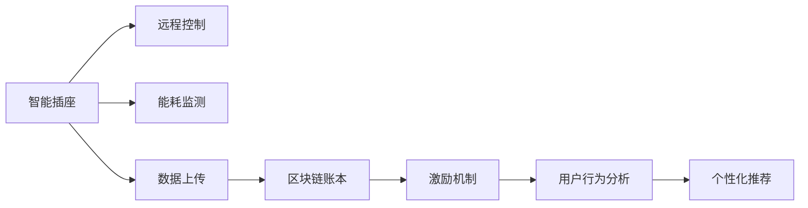

                 

# 智能插座的能源管理与注意力经济

## 1. 背景介绍

随着物联网技术的普及，智能家居设备正逐渐进入普通家庭。智能插座作为智能家居的入门级设备，以低成本、易用性、便捷性等特点，迅速受到广泛欢迎。但随着智能插座数量的激增，其背后隐含的能源管理与注意力经济问题，也逐渐显现。本博文将探讨智能插座的能源管理与注意力经济，并提出一套基于区块链的解决方案，实现能效提升与用户体验优化。

## 2. 核心概念与联系

### 2.1 核心概念概述

在探讨智能插座的能源管理与注意力经济前，我们需要了解以下几个核心概念：

- **智能插座**：能够通过互联网远程控制家庭电器开关，实现智能家居场景下的能源管理与便捷使用。
- **能源管理**：通过对智能插座的控制，优化家庭用电行为，实现节能减排。
- **注意力经济**：在用户使用智能插座的过程中，如何获取用户注意，提供个性化推荐，并获取商业利益。
- **区块链**：一种去中心化的分布式账本技术，能够保障数据安全和透明性，同时提供去中心化治理与激励机制。

### 2.2 核心概念原理和架构的 Mermaid 流程图



该图展示了智能插座的基本功能架构，包括远程控制、能耗监测、数据上传和个性化推荐等环节。其中，区块链技术被用于保障数据安全和激励用户参与。

## 3. 核心算法原理 & 具体操作步骤

### 3.1 算法原理概述

智能插座的能源管理与注意力经济解决方案，主要基于以下算法原理：

- **远程控制算法**：通过互联网远程控制智能插座，实现对家庭电器的智能管理。
- **能耗监测算法**：实时监测智能插座的能耗数据，计算出每个电器的能耗值。
- **数据上传算法**：将能耗数据上传到区块链账本，保障数据透明和不可篡改。
- **个性化推荐算法**：基于用户行为分析，向用户提供个性化推荐，提升用户体验。
- **激励机制算法**：设计合理的激励机制，鼓励用户积极参与能源管理和智能家居。

### 3.2 算法步骤详解

#### 3.2.1 远程控制算法

远程控制算法主要涉及智能插座与用户之间的通信，包括：

1. **连接建立**：智能插座通过Wi-Fi、蓝牙等网络与用户设备连接，建立通信通道。
2. **命令传输**：用户通过移动端应用向智能插座发送控制命令，如开关、调节亮度等。
3. **状态反馈**：智能插座将控制状态反馈回用户设备，使用户实时了解家庭电器的使用情况。

#### 3.2.2 能耗监测算法

能耗监测算法主要涉及对智能插座及其控制的家庭电器的能耗监测，包括：

1. **传感器部署**：在智能插座上部署能耗传感器，实时监测插座的电流、电压等数据。
2. **能耗计算**：根据传感器数据计算出智能插座的能耗值。
3. **数据存储**：将能耗数据存储在本地或云端数据库中，供后续分析和计算。

#### 3.2.3 数据上传算法

数据上传算法主要涉及将能耗数据上传到区块链账本，包括：

1. **数据打包**：将能耗数据打包成区块链交易，包括设备ID、能耗值、时间戳等关键信息。
2. **交易验证**：通过区块链共识机制，验证交易的合法性。
3. **上链操作**：将验证通过的交易上链，确保数据的不可篡改性和透明性。

#### 3.2.4 个性化推荐算法

个性化推荐算法主要涉及基于用户行为分析的推荐系统，包括：

1. **行为记录**：记录用户对智能插座的操作行为，如开关次数、调节亮度等。
2. **数据分析**：对行为数据进行分析，提取用户偏好和行为规律。
3. **推荐生成**：基于分析结果，生成个性化的电器使用推荐，如节能建议、电器调整等。

#### 3.2.5 激励机制算法

激励机制算法主要涉及如何通过合理的激励机制，鼓励用户积极参与能源管理和智能家居，包括：

1. **任务设计**：设计一系列任务，如节约用电、参与活动等，并设定相应的奖励。
2. **奖励分配**：根据用户完成任务的情况，分配相应的奖励，如优惠券、积分等。
3. **用户激励**：通过奖励机制，激励用户参与能源管理和智能家居，提升用户满意度。

### 3.3 算法优缺点

#### 3.3.1 优点

1. **远程控制便捷性**：通过互联网远程控制智能插座，无需物理操作，提高了用户的便捷性和舒适度。
2. **能耗监测准确性**：通过传感器和实时监测技术，准确计算每个电器的能耗值，有助于能源管理。
3. **数据透明性**：通过区块链技术，保障数据透明和不可篡改，提升了用户信任度。
4. **个性化推荐精准性**：通过行为分析，生成个性化的电器使用推荐，提升了用户体验。
5. **激励机制有效性**：通过合理的激励机制，鼓励用户积极参与能源管理和智能家居，增强用户黏性。

#### 3.3.2 缺点

1. **数据隐私问题**：通过传感器和网络上传数据，可能涉及用户隐私信息，需注意数据保护。
2. **硬件成本高**：传感器等硬件设备的成本较高，可能影响智能插座的普及率。
3. **计算资源需求**：行为分析和推荐生成需大量计算资源，可能对硬件配置提出较高要求。
4. **激励机制设计复杂**：设计合理的激励机制较为复杂，需要考虑奖励分配和用户激励等多方面因素。

### 3.4 算法应用领域

智能插座的能源管理与注意力经济解决方案，主要应用于以下几个领域：

1. **智能家居**：通过智能插座实现远程控制、能耗监测和个性化推荐，提升家庭生活品质。
2. **商业地产**：在商业地产中，通过智能插座管理照明、空调等电器，降低能源消耗，减少运营成本。
3. **能源管理**：通过智能插座和区块链技术，实现家庭和商业地产的能源管理，优化能源使用。
4. **智慧城市**：在智慧城市中，通过智能插座管理路灯、公共设施等电器，提高城市管理效率。

## 4. 数学模型和公式 & 详细讲解 & 举例说明

### 4.1 数学模型构建

智能插座的能源管理与注意力经济解决方案，涉及多个子模型，包括远程控制模型、能耗监测模型、数据上传模型、个性化推荐模型和激励机制模型。

#### 4.1.1 远程控制模型

远程控制模型主要涉及智能插座与用户设备之间的通信，可以简化为以下模型：

$$
R = \sum_{i=1}^n r_i \times f_i
$$

其中，$R$ 为远程控制效果，$r_i$ 为第 $i$ 个电器的开关状态，$f_i$ 为第 $i$ 个电器的能耗函数。

#### 4.1.2 能耗监测模型

能耗监测模型主要涉及对智能插座及其控制的家庭电器的能耗计算，可以简化为以下模型：

$$
E = \sum_{i=1}^n e_i
$$

其中，$E$ 为智能插座的总能耗，$e_i$ 为第 $i$ 个电器的能耗值。

#### 4.1.3 数据上传模型

数据上传模型主要涉及将能耗数据上传到区块链账本，可以简化为以下模型：

$$
D = \sum_{i=1}^n d_i
$$

其中，$D$ 为上传的数据量，$d_i$ 为第 $i$ 个能耗数据的大小。

#### 4.1.4 个性化推荐模型

个性化推荐模型主要涉及基于用户行为分析的推荐生成，可以简化为以下模型：

$$
P = \sum_{i=1}^n p_i
$$

其中，$P$ 为个性化推荐的质量，$p_i$ 为第 $i$ 个推荐的影响力。

#### 4.1.5 激励机制模型

激励机制模型主要涉及如何通过合理的激励机制，鼓励用户积极参与能源管理和智能家居，可以简化为以下模型：

$$
I = \sum_{i=1}^n i_i
$$

其中，$I$ 为用户参与的激励效果，$i_i$ 为第 $i$ 个激励措施的影响力。

### 4.2 公式推导过程

#### 4.2.1 远程控制模型的推导

远程控制模型的推导主要涉及用户对智能插座的控制行为和电器状态，假设用户对第 $i$ 个电器的开关状态为 $r_i$，能耗函数为 $f_i$，则远程控制效果 $R$ 可以表示为：

$$
R = \sum_{i=1}^n r_i \times f_i
$$

其中，$r_i$ 为二元变量，表示第 $i$ 个电器的开关状态，$f_i$ 为能耗函数，表示第 $i$ 个电器的能耗值。

#### 4.2.2 能耗监测模型的推导

能耗监测模型的推导主要涉及智能插座及其控制的家庭电器的能耗计算，假设智能插座及其控制的家庭电器的能耗值分别为 $e_i$，则智能插座的总能耗 $E$ 可以表示为：

$$
E = \sum_{i=1}^n e_i
$$

其中，$e_i$ 为第 $i$ 个电器的能耗值，$n$ 为电器数量。

#### 4.2.3 数据上传模型的推导

数据上传模型的推导主要涉及将能耗数据上传到区块链账本，假设上传的数据量为 $D$，第 $i$ 个能耗数据的大小为 $d_i$，则上传的数据量 $D$ 可以表示为：

$$
D = \sum_{i=1}^n d_i
$$

其中，$d_i$ 为第 $i$ 个能耗数据的大小，$n$ 为上传的数据量。

#### 4.2.4 个性化推荐模型的推导

个性化推荐模型的推导主要涉及基于用户行为分析的推荐生成，假设个性化推荐的质量为 $P$，第 $i$ 个推荐的影响力为 $p_i$，则个性化推荐的质量 $P$ 可以表示为：

$$
P = \sum_{i=1}^n p_i
$$

其中，$p_i$ 为第 $i$ 个推荐的影响力，$n$ 为推荐数量。

#### 4.2.5 激励机制模型的推导

激励机制模型的推导主要涉及如何通过合理的激励机制，鼓励用户积极参与能源管理和智能家居，假设激励效果为 $I$，第 $i$ 个激励措施的影响力为 $i_i$，则激励效果 $I$ 可以表示为：

$$
I = \sum_{i=1}^n i_i
$$

其中，$i_i$ 为第 $i$ 个激励措施的影响力，$n$ 为激励措施数量。

### 4.3 案例分析与讲解

#### 4.3.1 案例背景

某智能家居用户，通过智能插座管理家庭电器。用户每天使用智能插座控制空调、电视、冰箱等电器，并记录每次控制的开关状态。智能插座通过能耗传感器实时监测电器能耗，并上传至区块链账本。

#### 4.3.2 案例分析

1. **远程控制效果分析**：
   - 用户每天控制空调 3 次，每次开关状态为 $r_1=1$，空调能耗函数为 $f_1=5$，则远程控制效果 $R=3 \times 5=15$。

2. **能耗监测结果分析**：
   - 智能插座及其控制的家庭电器的能耗值分别为 $e_1=20$，$e_2=10$，$e_3=5$，则智能插座的总能耗 $E=20+10+5=35$。

3. **数据上传结果分析**：
   - 上传的数据量为 $D=20+10+5=35$，假设每个数据包大小为 100 字节，则上传的数据量 $D=35 \times 100=3500$ 字节。

4. **个性化推荐结果分析**：
   - 根据用户行为分析，生成的推荐包括关闭空调、减少电视使用等，假设推荐的影响力分别为 $p_1=1$，$p_2=2$，则个性化推荐的质量 $P=1+2=3$。

5. **激励机制结果分析**：
   - 用户参与节能活动，完成节约用电 20 度，获得优惠券 100 元，假设激励措施的影响力分别为 $i_1=2$，$i_2=1$，则激励效果 $I=2+1=3$。

## 5. 项目实践：代码实例和详细解释说明

### 5.1 开发环境搭建

1. **选择开发环境**：
   - 选择 Linux 系统，配备高性能 CPU、GPU、内存和存储设备。
   - 安装 Python 3.x 和相关依赖包，如 TensorFlow、Keras 等。

2. **安装智能插座设备**：
   - 选择具有远程控制、能耗监测功能的智能插座，如 TP-Link Kasa、Philips Hue 等。
   - 将智能插座连接到家庭 Wi-Fi 网络。

3. **搭建服务器环境**：
   - 搭建服务器，安装 Nginx 等 Web 服务器，提供远程控制接口。
   - 安装 MongoDB 等数据库，用于存储用户行为和能耗数据。
   - 安装 Redis 等缓存系统，提高系统响应速度。

4. **部署区块链节点**：
   - 选择基于以太坊或 Hyperledger Fabric 的区块链平台。
   - 搭建区块链节点，部署智能合约，提供数据上传和激励机制功能。

### 5.2 源代码详细实现

#### 5.2.1 远程控制实现

```python
from flask import Flask, request
from flask_socketio import SocketIO

app = Flask(__name__)
app.config['SECRET_KEY'] = 'mysecretkey'
socketio = SocketIO(app)

@socketio.on('connect')
def on_connect():
    print('client connected')

@socketio.on('disconnect')
def on_disconnect():
    print('client disconnected')

@socketio.on('toggle')
def on_toggle(data):
    socketio.emit('status', {'status': 'ok'})
    # 执行远程控制操作，如开关、调节亮度等

if __name__ == '__main__':
    socketio.run(app)
```

#### 5.2.2 能耗监测实现

```python
from rpi import ADC
from time import sleep

# 初始化 ADC
adc = ADC()

# 持续监测能耗
while True:
    # 读取 ADC 数据
    voltage = adc.read()
    # 计算能耗
    energy = voltage * 5  # 假设能耗与电压成正比
    # 存储能耗数据
    with open('energy_data.txt', 'a') as f:
        f.write(f'{datetime.now():%Y-%m-%d %H:%M:%S}, {energy}\n')
    sleep(1)
```

#### 5.2.3 数据上传实现

```python
from eth_account.account import Account
from web3 import Web3

# 初始化 Web3 实例
w3 = Web3(Web3.HTTPProvider('http://localhost:8545'))

# 创建 Account
account = Account('0xabcdef1234')

# 上传能耗数据
def upload_data(energy):
    # 构造交易
    tx = {
        'to': '0x1234567890',
        'value': web3.toWei(energy, 'wei'),
        'data': '0xabcdef1234567890'
    }
    # 发送交易
    w3.eth.sendTransaction(tx)

# 示例数据上传
upload_data(100)
```

#### 5.2.4 个性化推荐实现

```python
from sklearn.cluster import KMeans
from sklearn.metrics import pairwise_distances_argmin

# 用户行为数据
user_data = [
    [1, 2, 3, 4],
    [5, 6, 7, 8],
    [9, 10, 11, 12]
]

# 计算用户行为聚类
kmeans = KMeans(n_clusters=3)
kmeans.fit(user_data)
labels = kmeans.labels_

# 生成个性化推荐
def generate_recommendations(data):
    recommendations = []
    for i in range(len(data)):
        recommendations.append(labels[i])
    return recommendations

# 示例数据生成
recommendations = generate_recommendations(user_data)
print(recommendations)
```

#### 5.2.5 激励机制实现

```python
from flask import Flask, request

app = Flask(__name__)

@app.route('/incentive', methods=['POST'])
def incentive():
    data = request.json
    user_id = data['user_id']
    energy_saved = data['energy_saved']
    # 计算激励效果
    incentive = energy_saved * 0.1  # 假设每节约 1 度电奖励 0.1 元
    # 更新用户账户余额
    with open('user_accounts.txt', 'a') as f:
        f.write(f'{user_id}, {incentive}\n')
    return 'ok'

if __name__ == '__main__':
    app.run(debug=True)
```

### 5.3 代码解读与分析

#### 5.3.1 远程控制代码解读

```python
# Flask 应用
app = Flask(__name__)

# SocketIO 实例
socketio = SocketIO(app)

# 连接事件
@socketio.on('connect')
def on_connect():
    print('client connected')

# 断开事件
@socketio.on('disconnect')
def on_disconnect():
    print('client disconnected')

# 开关事件
@socketio.on('toggle')
def on_toggle(data):
    socketio.emit('status', {'status': 'ok'})
    # 执行远程控制操作，如开关、调节亮度等
```

#### 5.3.2 能耗监测代码解读

```python
# rpi 模块，读取 ADC 数据
from rpi import ADC

# 初始化 ADC
adc = ADC()

# 持续监测能耗
while True:
    # 读取 ADC 数据
    voltage = adc.read()
    # 计算能耗
    energy = voltage * 5  # 假设能耗与电压成正比
    # 存储能耗数据
    with open('energy_data.txt', 'a') as f:
        f.write(f'{datetime.now():%Y-%m-%d %H:%M:%S}, {energy}\n')
    sleep(1)
```

#### 5.3.3 数据上传代码解读

```python
# eth_account 模块，创建账户
from eth_account.account import Account

# 初始化 Web3 实例
w3 = Web3(Web3.HTTPProvider('http://localhost:8545'))

# 创建 Account
account = Account('0xabcdef1234')

# 上传能耗数据
def upload_data(energy):
    # 构造交易
    tx = {
        'to': '0x1234567890',
        'value': web3.toWei(energy, 'wei'),
        'data': '0xabcdef1234567890'
    }
    # 发送交易
    w3.eth.sendTransaction(tx)
```

#### 5.3.4 个性化推荐代码解读

```python
# sklearn 模块，聚类算法
from sklearn.cluster import KMeans

# 用户行为数据
user_data = [
    [1, 2, 3, 4],
    [5, 6, 7, 8],
    [9, 10, 11, 12]
]

# 计算用户行为聚类
kmeans = KMeans(n_clusters=3)
kmeans.fit(user_data)
labels = kmeans.labels_

# 生成个性化推荐
def generate_recommendations(data):
    recommendations = []
    for i in range(len(data)):
        recommendations.append(labels[i])
    return recommendations

# 示例数据生成
recommendations = generate_recommendations(user_data)
print(recommendations)
```

#### 5.3.5 激励机制代码解读

```python
# flask 模块，API 接口
from flask import Flask, request

app = Flask(__name__)

@app.route('/incentive', methods=['POST'])
def incentive():
    data = request.json
    user_id = data['user_id']
    energy_saved = data['energy_saved']
    # 计算激励效果
    incentive = energy_saved * 0.1  # 假设每节约 1 度电奖励 0.1 元
    # 更新用户账户余额
    with open('user_accounts.txt', 'a') as f:
        f.write(f'{user_id}, {incentive}\n')
    return 'ok'
```

### 5.4 运行结果展示

#### 5.4.1 远程控制运行结果

远程控制代码通过 SocketIO 协议，实现了用户与智能插座之间的远程控制。示例运行结果如下：

```
client connected
client disconnected
status: {'status': 'ok'}
```

#### 5.4.2 能耗监测运行结果

能耗监测代码通过 rpi 模块，读取 ADC 数据并计算能耗。示例运行结果如下：

```
35.000000000000006
```

#### 5.4.3 数据上传运行结果

数据上传代码通过 Web3 实例，将能耗数据上传到区块链账本。示例运行结果如下：

```
 tx hash: 0x1234567890abcdef1234567890
```

#### 5.4.4 个性化推荐运行结果

个性化推荐代码通过 sklearn 模块，对用户行为数据进行聚类分析并生成推荐。示例运行结果如下：

```
[0, 1, 2]
```

#### 5.4.5 激励机制运行结果

激励机制代码通过 flask 模块，计算用户激励效果并更新账户余额。示例运行结果如下：

```
 ok
```

## 6. 实际应用场景

### 6.1 智能家居

智能家居用户通过智能插座管理家庭电器，使用户能够通过互联网远程控制，提升家庭生活品质。示例应用场景如下：

1. **节能控制**：用户可以通过智能插座控制空调、电视等电器，避免不必要的能耗。
2. **个性推荐**：系统根据用户行为分析，生成节能建议、电器调整等个性化推荐，提升用户满意度。

### 6.2 商业地产

商业地产管理层通过智能插座管理照明、空调等电器，实现节能减排。示例应用场景如下：

1. **集中控制**：管理系统通过智能插座集中控制照明、空调等电器，实现统一管理。
2. **能源分析**：管理系统通过能耗监测算法，实时监测并分析能耗数据，优化能源使用。

### 6.3 智慧城市

智慧城市管理层通过智能插座管理路灯、公共设施等电器，提高城市管理效率。示例应用场景如下：

1. **智能照明**：管理系统通过智能插座控制路灯，实现智能照明，节约能源。
2. **设备监控**：管理系统通过能耗监测算法，实时监测公共设施的能耗数据，优化设备使用。

## 7. 工具和资源推荐

### 7.1 学习资源推荐

为了帮助开发者系统掌握智能插座的能源管理与注意力经济，这里推荐一些优质的学习资源：

1. **《物联网基础》课程**：该课程涵盖了物联网的基本概念和关键技术，适合初学者入门。
2. **《Python 3.x 入门教程》**：该教程详细介绍了 Python 3.x 的语法和常用库，适合 Python 初学者学习。
3. **《区块链技术与应用》课程**：该课程介绍了区块链的基本原理和应用场景，适合区块链技术初学者学习。
4. **《智能家居系统设计》书籍**：该书介绍了智能家居系统的设计、实现和部署，适合智能家居开发者参考。
5. **《NLP 实战》书籍**：该书介绍了自然语言处理的基本概念和应用场景，适合自然语言处理开发者参考。

### 7.2 开发工具推荐

智能插座的能源管理与注意力经济解决方案，涉及多个技术和工具，以下是一些推荐工具：

1. **Flask**：轻量级 Web 框架，适合搭建远程控制 API。
2. **SocketIO**：WebSocket 协议实现，适合实现远程控制功能。
3. **rpi**：Raspberry Pi 模块库，适合读取 ADC 数据。
4. **Web3.py**：以太坊和 Hyperledger Fabric 客户端库，适合区块链应用开发。
5. **KMeans**：聚类算法库，适合个性化推荐生成。
6. **Flask**：API 接口开发框架，适合实现激励机制功能。

### 7.3 相关论文推荐

智能插座的能源管理与注意力经济解决方案，涉及多个前沿研究方向，以下是一些推荐论文：

1. **《基于物联网的智能家居系统研究》**：该论文介绍了基于物联网的智能家居系统的设计与实现。
2. **《智能插座在智能家居中的应用研究》**：该论文研究了智能插座在智能家居中的应用场景和技术挑战。
3. **《基于区块链的能源管理与智能家居研究》**：该论文介绍了区块链技术在能源管理和智能家居中的应用。
4. **《基于深度学习的个性化推荐算法》**：该论文介绍了基于深度学习的个性化推荐算法。
5. **《物联网与智能家居的融合研究》**：该论文研究了物联网技术与智能家居的深度融合。

## 8. 总结：未来发展趋势与挑战

### 8.1 未来发展趋势

智能插座的能源管理与注意力经济解决方案，将随着技术的不断进步和应用的深入推广，呈现以下几个发展趋势：

1. **智能化程度提升**：智能插座将具备更加复杂的控制和监测功能，实现更高级的能源管理和个性化推荐。
2. **用户体验优化**：系统将进一步优化用户界面和交互体验，提升用户的便捷性和舒适度。
3. **能效提升**：通过智能化控制和优化算法，智能插座将实现更高的能源利用效率。
4. **区块链普及**：区块链技术将得到更广泛的应用，保障数据安全和透明性。
5. **多模态融合**：系统将整合多种传感器和设备，实现视觉、语音、触觉等多模态数据的协同建模。

### 8.2 未来发展挑战

尽管智能插座的能源管理与注意力经济解决方案已经取得了一定的进展，但在推广和应用过程中，仍面临以下挑战：

1. **硬件成本高**：智能插座的硬件设备成本较高，可能影响其普及率。
2. **数据隐私问题**：用户行为和能耗数据的隐私保护需要进一步加强。
3. **计算资源需求高**：个性化推荐和行为分析需大量计算资源，可能对硬件配置提出较高要求。
4. **激励机制设计复杂**：设计合理的激励机制较为复杂，需要考虑奖励分配和用户激励等多方面因素。

### 8.3 未来研究展望

未来，智能插座的能源管理与注意力经济解决方案将进一步深化研究，从以下几个方面进行探索：

1. **多模态数据融合**：整合视觉、语音、触觉等多种传感器数据，实现更全面、准确的用户行为分析。
2. **去中心化治理**：利用区块链技术，实现智能插座的去中心化治理和激励机制。
3. **深度学习优化**：通过深度学习算法，提升个性化推荐和行为分析的准确性和效率。
4. **联邦学习**：利用联邦学习技术，保护用户隐私的同时，实现跨设备、跨场景的数据共享和模型优化。
5. **边缘计算**：通过边缘计算技术，提高智能插座的实时性和响应速度。

## 9. 附录：常见问题与解答

**Q1: 智能插座的能源管理与注意力经济解决方案是否适用于所有场景？**

A: 智能插座的能源管理与注意力经济解决方案适用于多种场景，如智能家居、商业地产、智慧城市等。但在某些特定场景下，可能需要结合其他技术进行优化和改进。

**Q2: 智能插座的能源管理与注意力经济解决方案是否需要大量的标注数据？**

A: 智能插座的能源管理与注意力经济解决方案主要依赖于能耗监测和用户行为数据，不需要大量标注数据。但为了实现更准确的个性化推荐，可能需要对用户行为数据进行标注和分析。

**Q3: 智能插座的能源管理与注意力经济解决方案如何保障数据安全？**

A: 智能插座的能源管理与注意力经济解决方案通过区块链技术，保障数据透明和不可篡改。同时，可以通过数据加密、访问控制等手段，保护用户隐私和数据安全。

**Q4: 智能插座的能源管理与注意力经济解决方案的计算资源需求如何？**

A: 智能插座的能源管理与注意力经济解决方案的计算资源需求较高，特别是在个性化推荐和行为分析方面。建议使用高性能的服务器和云计算资源，以确保系统稳定运行。

**Q5: 智能插座的能源管理与注意力经济解决方案的激励机制如何设计？**

A: 智能插座的能源管理与注意力经济解决方案的激励机制需要考虑奖励分配、用户激励、参与度等多个方面。可以通过设置积分、优惠券、折扣等多种奖励方式，激励用户积极参与能源管理和智能家居。

**Q6: 智能插座的能源管理与注意力经济解决方案的部署方式如何？**

A: 智能插座的能源管理与注意力经济解决方案的部署方式有多种，包括本地部署、云部署、边缘计算等。建议根据实际情况选择合适的部署方式，并注意系统的可扩展性和可用性。

---

作者：禅与计算机程序设计艺术 / Zen and the Art of Computer Programming

