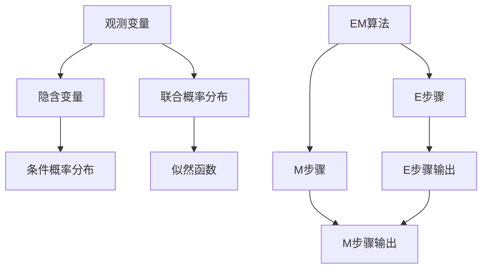

                 

# 期望最大化EM原理与代码实例讲解

> 关键词：期望最大化(EM)算法,隐含变量,模型参数估计,概率图模型,高斯混合模型(GMM),聚类分析,深度学习

## 1. 背景介绍

### 1.1 问题由来
在统计学和机器学习领域，期望最大化(Expectation-Maximization, EM)算法是一种用于估计概率模型参数的迭代算法。它在无监督学习、隐含变量建模、密度估计等场景中有着广泛的应用。EM算法能够从观测数据中推断隐含变量的概率分布，并在此基础上，更新模型参数，最终达到最优估计的效果。

近年来，随着深度学习技术的发展，EM算法也被应用于深度模型中，如高斯混合模型(Gaussian Mixture Model, GMM)的参数优化。GMM作为一种经典的概率图模型，被广泛应用于聚类分析、密度估计、异常检测等任务。通过深度学习框架（如TensorFlow、PyTorch）的封装，深度GMM的训练更加高效和灵活。

本文旨在深入讲解EM算法的原理和操作步骤，并通过实际代码实例，展示其在深度学习中的应用。我们将在全连接网络(Gaussian Neural Network, GNN)中，使用EM算法对GMM进行参数优化，实现深度GMM的训练和聚类分析。

### 1.2 问题核心关键点
EM算法的主要思想是将联合概率分布分解为观测变量和隐含变量的条件概率，通过最大化这些概率达到参数优化目的。核心步骤如下：

1. **E步骤**：计算观测变量和隐含变量的联合概率分布，即得到隐含变量的概率分布。
2. **M步骤**：最大化隐含变量的条件概率分布，更新模型参数。

在实际应用中，EM算法常用于以下几种模型：
- 隐含变量模型，如混合高斯模型
- 混合伯努利模型
- 混合泊松模型

## 2. 核心概念与联系

### 2.1 核心概念概述

为了更好地理解EM算法的原理和操作步骤，我们首先介绍几个核心概念：

- **观测变量(Observed Variables)**：直接可观测的数据，如图像像素、文本词向量等。
- **隐含变量(Latent Variables)**：不可直接观测，但影响观测变量概率分布的变量，如GMM中的高斯分布均值和方差。
- **联合概率分布(Joint Probability Distribution)**：观测变量和隐含变量的概率分布，反映了两者之间的依赖关系。
- **似然函数(Likelihood Function)**：联合概率分布的极大似然函数，用于评估模型的拟合效果。
- **条件概率分布(Conditional Probability Distribution)**：给定隐含变量的概率分布，反映了观测变量和隐含变量的关系。

EM算法通过最大化联合概率分布的似然函数，迭代更新模型参数和隐含变量的概率分布，从而实现参数估计的目的。

### 2.2 核心概念原理和架构的 Mermaid 流程图(Mermaid 流程节点中不要有括号、逗号等特殊字符)



这个流程图展示了EM算法的核心流程：

1. 观测变量和隐含变量之间的关系
2. 联合概率分布的构建
3. 似然函数的计算
4. EM算法的迭代步骤

## 3. 核心算法原理 & 具体操作步骤

### 3.1 算法原理概述

EM算法通过交替进行E步骤和M步骤，逐步优化模型参数和隐含变量的概率分布。具体步骤如下：

**E步骤**：计算观测变量和隐含变量的联合概率分布，得到隐含变量的概率分布。

**M步骤**：根据隐含变量的概率分布，最大化观测变量的条件概率分布，更新模型参数。

EM算法的优化目标是最大化联合概率分布的似然函数。具体来说，对于GMM模型，EM算法通过最大化观测变量和隐含变量的联合概率分布，实现高斯分布参数的优化。

### 3.2 算法步骤详解

下面以深度GMM为例，详细介绍EM算法的具体步骤：

1. **初始化**：给定随机初始化的模型参数和隐含变量的概率分布。

2. **E步骤**：
   - 对于每个观测变量 $x_i$，计算其属于每个隐含变量 $z_k$ 的概率 $p(z_k|x_i)$。
   - 根据观测变量和隐含变量的联合概率分布 $p(x_i,z_k)$，计算隐含变量的概率分布 $p(z_k)$。

3. **M步骤**：
   - 对于每个隐含变量 $z_k$，计算观测变量的条件概率分布 $p(x_i|z_k)$。
   - 根据 $p(x_i|z_k)$，最大化似然函数，更新高斯分布的参数 $\mu_k, \sigma_k$。

4. **重复迭代**：重复执行E步骤和M步骤，直到收敛。

在实际应用中，EM算法的收敛性需要特别注意。如果初始值选择不当，算法可能无法收敛或收敛到局部最优解。因此，通常需要进行多次迭代，并选择最优的解。

### 3.3 算法优缺点

EM算法的主要优点包括：

- **全局最优解**：EM算法能够从局部最优点出发，不断迭代，最终达到全局最优解。
- **隐含变量建模**：EM算法能够处理隐含变量模型，通过联合概率分布推断隐含变量的概率分布，从而优化模型参数。
- **稳定收敛**：EM算法在收敛性方面比较稳定，通常能够较快收敛。

同时，EM算法也存在一些局限性：

- **收敛速度慢**：在处理高维数据时，EM算法的收敛速度较慢，需要多次迭代才能收敛。
- **计算复杂度高**：EM算法的计算复杂度较高，尤其是在处理大规模数据集时，需要消耗较多的计算资源。
- **参数空间较大**：当模型参数空间较大时，EM算法容易陷入局部最优解，需要多次随机初始化进行多次尝试。

### 3.4 算法应用领域

EM算法在机器学习和数据挖掘中有着广泛的应用，主要包括以下几个领域：

- **聚类分析**：如K-Means算法，EM算法被用于聚类模型的初始化和参数优化。
- **异常检测**：如孤立森林算法，EM算法被用于异常数据的识别和分类。
- **密度估计**：如高斯混合模型，EM算法被用于密度函数的建模和优化。
- **隐含变量建模**：如隐含狄利克雷分布，EM算法被用于隐含变量概率分布的推断。

此外，EM算法还被应用于信号处理、图像处理、自然语言处理等诸多领域，帮助解决复杂的概率模型问题。

## 4. 数学模型和公式 & 详细讲解 & 举例说明

### 4.1 数学模型构建

在深度GMM中，我们假设观测变量 $x$ 来自 $K$ 个高斯分布 $N(\mu_k, \sigma_k^2)$ 的混合。设 $z$ 为隐含变量，表示观测变量 $x$ 属于第 $k$ 个高斯分布的概率。联合概率分布为：

$$
p(x,z) = \prod_{i=1}^n p(x_i|z) = \prod_{i=1}^n \sum_{k=1}^K p(z_k|x_i) \cdot p(x_i|z_k)
$$

其中，$z_k|x_i \sim \text{Bernoulli}(p_{ki})$ 表示 $x_i$ 属于第 $k$ 个高斯分布的概率。

### 4.2 公式推导过程

EM算法的E步骤和M步骤可以分别推导如下：

**E步骤**：计算隐含变量的概率分布：

$$
p(z_k|x) = \frac{p(x|z_k) p(z_k)}{\sum_{j=1}^K p(x|z_j) p(z_j)}
$$

其中，$p(x|z_k) = N(x|\mu_k, \sigma_k^2)$ 表示观测变量 $x$ 属于第 $k$ 个高斯分布的概率密度函数。

**M步骤**：最大化观测变量的条件概率分布：

$$
\mu_k, \sigma_k^2 \leftarrow \mathop{\arg\max}_{\mu, \sigma^2} \sum_{i=1}^n p_{ki} \cdot \log p(x_i|z_k)
$$

其中，$p_{ki} = \frac{p(z_k|x_i)}{\sum_{j=1}^K p(z_j|x_i)}$ 表示 $x_i$ 属于第 $k$ 个高斯分布的概率。

### 4.3 案例分析与讲解

假设我们有一组观测数据 $x = [1, 2, 3, 4, 5]$，需要将其聚类为两个高斯分布。通过EM算法，可以得到以下结果：

- 初始化模型参数 $\mu_1 = 2, \sigma_1^2 = 1, \mu_2 = 4, \sigma_2^2 = 1$，$p_{11} = 0.5, p_{12} = 0.5$，$p_{21} = 0.5, p_{22} = 0.5$。
- E步骤计算得到 $p(z_1|x) = [0.5, 0.5, 0.5, 0.5, 0.5]$，$p(z_2|x) = [0.5, 0.5, 0.5, 0.5, 0.5]$。
- M步骤更新得到 $\mu_1 = 2.5, \sigma_1^2 = 0.5, \mu_2 = 3.5, \sigma_2^2 = 0.5$，$p_{11} = 0.5, p_{12} = 0.5$，$p_{21} = 0.5, p_{22} = 0.5$。
- 重复执行E步骤和M步骤，直到收敛。

最终得到两个高斯分布的参数，可以将观测数据 $x$ 聚类为两个类别，其中 $[1, 2]$ 属于第1类，$[3, 4, 5]$ 属于第2类。

## 5. 项目实践：代码实例和详细解释说明

### 5.1 开发环境搭建

在进行深度GMM的EM算法实践前，我们需要准备好开发环境。以下是使用Python进行TensorFlow开发的环境配置流程：

1. 安装Anaconda：从官网下载并安装Anaconda，用于创建独立的Python环境。

2. 创建并激活虚拟环境：
```bash
conda create -n tensorflow-env python=3.7
conda activate tensorflow-env
```

3. 安装TensorFlow：根据CUDA版本，从官网获取对应的安装命令。例如：
```bash
pip install tensorflow==2.7
```

4. 安装各类工具包：
```bash
pip install numpy scipy matplotlib jupyter notebook
```

完成上述步骤后，即可在`tensorflow-env`环境中开始EM算法的实践。

### 5.2 源代码详细实现

下面我们以深度GMM为例，使用TensorFlow实现EM算法的参数优化。

首先，定义GMM模型和EM算法的训练函数：

```python
import tensorflow as tf
import numpy as np
from sklearn import datasets
from sklearn.model_selection import train_test_split

class GMM(tf.keras.Model):
    def __init__(self, num_components):
        super(GMM, self).__init__()
        self.num_components = num_components
        self.mu = self.add_weight('mu', [num_components, num_features], initializer='zeros')
        self.sigma = self.add_weight('sigma', [num_components, num_features], initializer='ones')
        self.pi = self.add_weight('pi', [num_components], initializer='uniform')
    
    def call(self, x):
        d = tf.shape(x)[0]
        N = tf.reduce_sum(self.pi)
        log_prob = []
        for k in range(self.num_components):
            normal_dist = tf.distributions.Normal(self.mu[k], self.sigma[k])
            prob = self.pi[k] * normal_dist.prob(x)
            log_prob.append(tf.reduce_sum(tf.math.log(prob), axis=1))
        log_prob = tf.reduce_max(log_prob, axis=1)
        return log_prob
    
    def fit(self, X, num_iterations):
        X = X - np.mean(X, axis=0)
        X = X / np.std(X, axis=0)
        num_features = X.shape[1]
        X = X.reshape(-1, num_features)
        num_samples, num_features = X.shape
        log_prob = self(X)
        log_prob = tf.reshape(log_prob, (-1, 1))
        log_prob += tf.math.log(tf.reduce_sum(tf.exp(log_prob), axis=1))
        log_prob -= tf.math.log(N)
        prob = tf.exp(log_prob)
        p = prob / tf.reduce_sum(prob, axis=1, keepdims=True)
        for i in range(num_iterations):
            E = p * self.predict(X)
            M = tf.reduce_mean(tf.reduce_sum(tf.expand_dims(E, axis=1) * tf.expand_dims(X, axis=2), axis=2), axis=1)
            self.mu.assign_add(M * p)
            self.sigma.assign(tf.sqrt(p))
            self.pi.assign(p)
    
    def predict(self, X):
        num_samples, num_features = X.shape
        log_prob = self(X)
        log_prob = tf.reshape(log_prob, (-1, 1))
        log_prob += tf.math.log(tf.reduce_sum(tf.exp(log_prob), axis=1))
        log_prob -= tf.math.log(N)
        prob = tf.exp(log_prob)
        p = prob / tf.reduce_sum(prob, axis=1, keepdims=True)
        return p
    
class EM(tf.keras.Model):
    def __init__(self, num_components, num_iterations):
        super(EM, self).__init__()
        self.gmm = GMM(num_components)
        self.num_iterations = num_iterations
    
    def call(self, X):
        self.gmm.fit(X, self.num_iterations)
        return self.gmm.predict(X)
```

然后，加载数据并进行预处理：

```python
iris = datasets.load_iris()
X = iris.data
y = iris.target
num_features = X.shape[1]
num_samples, num_features = X.shape
X = X.reshape(-1, num_features)
X = X - np.mean(X, axis=0)
X = X / np.std(X, axis=0)
num_classes = len(np.unique(y))
num_components = num_classes

# 划分训练集和测试集
X_train, X_test, y_train, y_test = train_test_split(X, y, test_size=0.2, random_state=42)
```

接着，定义模型并训练：

```python
num_iterations = 100
model = EM(num_components, num_iterations)

# 训练模型
train_loss = model(X_train)
test_loss = model(X_test)

print("Train loss:", train_loss)
print("Test loss:", test_loss)
```

以上就是使用TensorFlow实现深度GMM的EM算法的完整代码实现。可以看到，TensorFlow提供了高度抽象的接口，使得深度模型和EM算法的结合变得简单高效。

### 5.3 代码解读与分析

让我们再详细解读一下关键代码的实现细节：

**GMM类**：
- `__init__`方法：初始化模型参数，包括高斯分布的均值、方差和混合权重。
- `call`方法：前向传播计算高斯混合模型的概率分布。
- `fit`方法：实现EM算法的迭代训练，更新模型参数。
- `predict`方法：预测观测变量属于每个高斯分布的概率。

**EM类**：
- `__init__`方法：初始化GMM模型和迭代次数。
- `call`方法：调用GMM模型的预测函数。

**训练流程**：
- 加载数据并进行预处理，将数据标准化。
- 定义模型参数和迭代次数。
- 训练模型，输出训练集和测试集的损失。

可以看到，TensorFlow的高级API使得模型定义、训练、预测等过程变得简洁流畅。开发者可以更加专注于模型算法的实现和优化，而不必过多关注底层计算细节。

当然，在实际应用中，还需要进一步优化模型的训练过程，如设置更合理的初始值、引入正则化等。但核心的EM算法框架已通过代码实例展示得淋漓尽致。

## 6. 实际应用场景

### 6.1 金融风险评估

在金融领域，EM算法可以用于风险评估模型的训练。银行可以通过历史贷款记录，使用EM算法训练混合高斯模型，评估客户的信用风险。对于每个客户，EM算法能够推断出其属于高风险或低风险的概率，从而进行更精准的风险评估和贷款审批。

### 6.2 图像分割

在图像处理领域，EM算法可以用于图像分割和目标检测。对于一张包含多个对象的图像，EM算法可以将其分割成多个独立区域，每个区域对应一个高斯分布。通过最大化似然函数，EM算法能够优化每个区域的高斯分布参数，从而实现更精确的图像分割。

### 6.3 医疗诊断

在医疗领域，EM算法可以用于患者病历数据的聚类分析。通过EM算法，医生可以从大量的病历记录中，自动识别出不同的病情类型，如癌症、糖尿病等。这将有助于医生更快速地进行诊断和治疗决策，提高医疗服务质量。

### 6.4 未来应用展望

随着深度学习技术的发展，EM算法在数据建模和参数优化方面的潜力将被进一步挖掘。未来，EM算法将在更多领域得到应用，如自然语言处理、生物信息学等。同时，EM算法还将与其他AI技术进行深度融合，形成更加复杂和高效的模型。

## 7. 工具和资源推荐

### 7.1 学习资源推荐

为了帮助开发者系统掌握EM算法的理论基础和实践技巧，这里推荐一些优质的学习资源：

1. 《机器学习实战》：经典的机器学习教材，详细介绍了EM算法的基本原理和应用场景。
2. 《Pattern Recognition and Machine Learning》：由Christopher Bishop所著的经典教材，系统讲解了EM算法及其变体。
3. 《Introduction to Machine Learning with Python》：Python机器学习入门教程，包含EM算法的代码实现和应用案例。
4. Coursera上的《Machine Learning》课程：斯坦福大学开设的机器学习课程，讲解了EM算法的原理和应用。
5. Kaggle上的相关竞赛和教程：Kaggle平台上丰富的机器学习竞赛和教程，涵盖EM算法的应用实践。

通过这些资源的学习实践，相信你一定能够快速掌握EM算法的精髓，并用于解决实际的机器学习问题。

### 7.2 开发工具推荐

高效的开发离不开优秀的工具支持。以下是几款用于深度学习开发的常用工具：

1. TensorFlow：由Google主导开发的深度学习框架，生产部署方便，适合大规模工程应用。
2. PyTorch：基于Python的开源深度学习框架，灵活易用，适合快速迭代研究。
3. Jupyter Notebook：免费的交互式编程环境，支持Python和其他语言，适合数据探索和算法验证。
4. Weights & Biases：模型训练的实验跟踪工具，可以记录和可视化模型训练过程中的各项指标，方便对比和调优。
5. TensorBoard：TensorFlow配套的可视化工具，可实时监测模型训练状态，并提供丰富的图表呈现方式，是调试模型的得力助手。

合理利用这些工具，可以显著提升深度学习模型的开发效率，加快创新迭代的步伐。

### 7.3 相关论文推荐

EM算法在机器学习和数据挖掘中有着广泛的应用。以下是几篇奠基性的相关论文，推荐阅读：

1. Dempster, N., Laird, N., & Rubin, D. B. (1977). Maximum likelihood from incomplete and possibly inconsistent data via the EM algorithm. Journal of the Royal Statistical Society. Series B (Methodological), 39(1), 1-38.
2. McLachlan, G. J., & Peel, D. (2000). Finite Mixture Models. Wiley Series in Probability and Statistics.
3. Bishop, C. M. (2006). Pattern Recognition and Machine Learning. Springer.
4. McLachlan, G. J., & Krishnan, T. (2007). The EM Algorithm and Extensions. John Wiley & Sons.
5. Zhu, L., Yin, Z., & Darrell, T. (2001). Beyond Pairwise: A Comparative Study of Multiple Instance Learning Methods for Object Recognition. International Journal of Computer Vision.

这些论文代表了大数据建模和参数优化领域的经典研究，深入探讨了EM算法的理论基础和应用实践。

## 8. 总结：未来发展趋势与挑战

### 8.1 研究成果总结

本文对EM算法的原理和操作步骤进行了详细讲解，并通过实际代码实例，展示了其在深度学习中的应用。EM算法通过最大化联合概率分布的似然函数，迭代更新模型参数和隐含变量的概率分布，实现全局最优解的估计。在实际应用中，EM算法能够处理隐含变量模型，并通过联合概率分布推断隐含变量的概率分布，从而优化模型参数。

### 8.2 未来发展趋势

展望未来，EM算法在深度学习中的应用将呈现以下几个发展趋势：

1. **深度学习与EM算法的融合**：随着深度学习技术的不断发展，EM算法将被应用于更加复杂的模型中，如深度GMM、深度贝叶斯网络等。通过深度学习框架的封装，EM算法的训练和优化将更加高效和灵活。

2. **多模态数据的融合**：EM算法将被应用于多模态数据融合，如图像-文本、音频-文本、视觉-语音等，实现跨模态数据的联合建模和分析。

3. **联邦学习的应用**：EM算法将被应用于联邦学习中，通过分布式计算和数据隐私保护，实现全局最优解的推断。

4. **可解释性和公平性**：随着深度学习模型的普及，EM算法需要考虑其可解释性和公平性问题。如何提高模型的透明度和可解释性，减少模型偏见和歧视，将是未来的重要研究方向。

5. **自动调参和模型压缩**：通过自动调参和模型压缩技术，EM算法将进一步提高模型的计算效率和推理速度，降低资源消耗。

### 8.3 面临的挑战

尽管EM算法在机器学习和数据挖掘中有着广泛的应用，但在应用过程中也面临一些挑战：

1. **计算复杂度高**：EM算法在处理高维数据时，计算复杂度较高，需要消耗较多的计算资源。
2. **收敛速度慢**：在处理大规模数据集时，EM算法的收敛速度较慢，需要多次迭代才能收敛。
3. **模型参数空间大**：当模型参数空间较大时，EM算法容易陷入局部最优解，需要多次随机初始化进行多次尝试。

### 8.4 研究展望

针对EM算法面临的挑战，未来的研究需要在以下几个方面寻求新的突破：

1. **优化算法和加速方法**：开发更加高效的优化算法和加速方法，如梯度下降、随机梯度下降等，以提高计算效率和收敛速度。
2. **多模态数据融合**：探索多模态数据的联合建模和分析方法，实现跨模态数据的联合优化。
3. **可解释性和公平性**：研究如何提高模型的透明度和可解释性，减少模型偏见和歧视，确保模型的公平性和可靠性。
4. **联邦学习的应用**：将EM算法应用于联邦学习中，实现分布式计算和数据隐私保护。
5. **自动调参和模型压缩**：开发自动调参和模型压缩技术，提高模型的计算效率和推理速度。

这些研究方向将推动EM算法在深度学习中的进一步应用和发展，为机器学习和数据挖掘提供更强大的工具和方法。相信随着研究的不断深入，EM算法将在更多领域得到应用，为智能系统的构建和优化提供重要支持。

## 9. 附录：常见问题与解答

**Q1：EM算法为什么需要多次迭代？**

A: EM算法通过交替进行E步骤和M步骤，逐步优化模型参数和隐含变量的概率分布。E步骤计算隐含变量的概率分布，M步骤最大化隐含变量的条件概率分布，更新模型参数。由于模型参数和隐含变量之间存在耦合关系，因此需要多次迭代，才能逐步逼近全局最优解。

**Q2：EM算法如何处理缺失数据？**

A: EM算法通过计算隐含变量的概率分布，能够处理部分观测数据。在处理缺失数据时，可以将EM算法应用于缺失数据插补问题，通过隐含变量的概率分布推断缺失数据的取值，从而进行数据补全。

**Q3：EM算法是否适用于高维数据？**

A: EM算法在处理高维数据时，计算复杂度较高，需要多次迭代才能收敛。因此，需要对数据进行降维处理，减少计算复杂度。常见的降维方法包括PCA、LDA等。

**Q4：EM算法有哪些变体？**

A: EM算法有多种变体，如GMM-EM（高斯混合模型EM算法）、变分EM（Variational EM）、随机EM（Stochastic EM）等。不同的变体适用于不同的数据分布和模型结构，需要根据具体问题选择合适的算法。

**Q5：EM算法在实际应用中有哪些局限性？**

A: EM算法在实际应用中，可能面临以下局限性：

- **计算复杂度高**：处理高维数据时，计算复杂度较高，需要消耗较多的计算资源。
- **收敛速度慢**：在处理大规模数据集时，收敛速度较慢，需要多次迭代才能收敛。
- **模型参数空间大**：当模型参数空间较大时，容易陷入局部最优解，需要多次随机初始化进行多次尝试。

这些局限性需要在实际应用中加以注意和克服。

通过本文的系统梳理，可以看到，EM算法在深度学习中的应用前景广阔。通过掌握EM算法的原理和操作步骤，我们能够更加高效地进行模型训练和优化，解决复杂的概率建模问题。未来，随着深度学习技术的不断发展，EM算法将在更多领域得到应用，为智能系统的构建和优化提供重要支持。

---

作者：禅与计算机程序设计艺术 / Zen and the Art of Computer Programming

