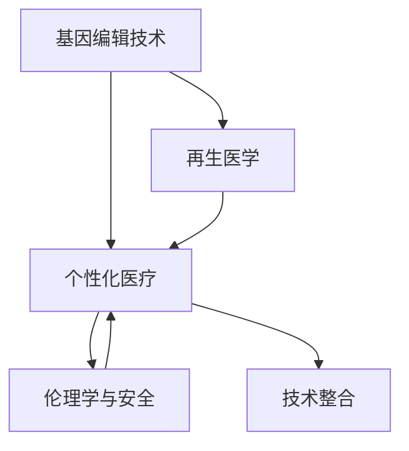

                 

# 未来的个性化医疗：2050年的基因编辑治疗与再生医学

## 1. 背景介绍

### 1.1 问题由来
随着科技的飞速发展，医疗健康行业正在迎来一场颠覆性的变革。尤其是基因编辑和再生医学的突破，为解决人类疾病和衰老问题提供了全新的路径。未来的医疗健康，将不仅仅是通过药物治疗或手术来缓解症状，而是通过个性化基因编辑和治疗，彻底治愈疾病，延长寿命，提升生活质量。

基因编辑治疗与再生医学，是一项涉及分子生物学、医学、信息科学、工程学等多个领域的交叉学科。它的核心在于通过基因编辑技术，改变人体细胞或组织的基因序列，修复或替换病变基因，从而实现治疗和再生。在这一领域，未来的技术发展将极大地影响人们的健康与福祉。

### 1.2 问题核心关键点
基因编辑治疗与再生医学的核心关键点包括：
1. **基因编辑技术**：CRISPR-Cas9、ZFNs、TALENs等基因编辑工具。
2. **再生医学**：干细胞治疗、组织工程、3D生物打印等再生技术。
3. **个性化医疗**：基于个体基因信息，进行精确的个性化治疗方案设计。
4. **伦理与安全**：基因编辑的伦理问题、安全性与监管。
5. **技术整合**：将基因编辑技术与再生医学、信息科学、临床医学等多学科整合，形成完整的治疗体系。

这些关键点相互交织，共同构成了未来个性化医疗的基本框架。理解这些关键点，有助于我们把握未来医疗发展的脉络和趋势。

### 1.3 问题研究意义
基因编辑治疗与再生医学的研究，对于人类健康和福祉具有深远的意义：

1. **治愈重大疾病**：基因编辑可以针对遗传性疾病、癌症、心血管疾病等多种重大疾病，实现根治性治疗，为患者带来新的希望。
2. **延长寿命**：通过修复与再生关键组织和器官，提升人体机能，延缓衰老，延长人类寿命。
3. **降低医疗成本**：个性化医疗方案能够避免盲目用药和治疗，减少医疗资源浪费，降低医疗成本。
4. **推动产业发展**：基因编辑和再生医学的应用，将催生新的医疗技术、材料、设备等产业，促进经济增长。
5. **提升健康管理**：基于个体基因信息的健康管理，可以实现早期预警、精准干预，提升整体人群健康水平。

本文将聚焦于基因编辑治疗与再生医学的原理与实践，探讨其在未来个性化医疗中的应用前景，分析相关技术的发展趋势和面临的挑战，为相关研究者和从业者提供参考。

## 2. 核心概念与联系

### 2.1 核心概念概述

基因编辑治疗与再生医学涉及多个核心概念，这些概念之间具有紧密的联系。以下是对核心概念的简要介绍：

1. **基因编辑技术**：CRISPR-Cas9是最常用的基因编辑工具，能够精确地修改DNA序列，用于疾病治疗和基因工程。
2. **再生医学**：通过干细胞培养、组织工程、3D生物打印等技术，修复或再生病变组织和器官。
3. **个性化医疗**：基于个体的基因信息，设计个性化的治疗方案，实现精准医疗。
4. **伦理学与安全性**：基因编辑的伦理问题，如基因歧视、基因编辑的风险与安全，是必须认真考虑的问题。
5. **技术整合**：将基因编辑技术、再生医学、信息科学等多学科技术整合，形成完整的医疗解决方案。

这些概念之间的联系可以通过以下Mermaid流程图来展示：



这个流程图展示了基因编辑技术、再生医学、个性化医疗、伦理与安全、技术整合之间的相互关系。它们共同构成了未来个性化医疗的核心框架，推动着医学领域的不断进步。

## 3. 核心算法原理 & 具体操作步骤
### 3.1 算法原理概述

基因编辑治疗与再生医学的核心算法原理，主要包括以下几个方面：

1. **基因编辑算法**：利用CRISPR-Cas9等工具，实现DNA序列的精确修改。
2. **再生医学算法**：通过干细胞培养、组织工程等技术，生成新的组织和器官。
3. **个性化医疗算法**：基于个体基因信息，设计最优的治疗方案。
4. **伦理与安全算法**：评估基因编辑的伦理风险，确保安全性。

这些算法共同构成了未来个性化医疗的核心技术基础。以下将详细介绍这些算法的原理和操作步骤。

### 3.2 算法步骤详解

#### 基因编辑算法

1. **目标基因设计**：确定需要编辑的基因位点，设计精确的gRNA和Cas9蛋白。
2. **DNA靶向设计**：使用生物信息学工具，设计gRNA序列，使其能够精确靶向目标基因。
3. **基因编辑**：将gRNA和Cas9蛋白导入细胞，利用CRISPR-Cas9系统进行基因编辑。
4. **编辑验证**：通过PCR、测序等手段，验证基因编辑的准确性和效率。

#### 再生医学算法

1. **干细胞培养**：从患者体内提取干细胞，通过特定培养条件，使其增殖和分化。
2. **组织工程**：利用生物材料、生长因子等技术，构建组织工程支架，促进干细胞的生长和分化。
3. **器官再生**：通过3D生物打印技术，打印出特定的组织和器官结构，再植入体内。
4. **再生验证**：通过动物实验或临床试验，验证再生组织的生物兼容性和功能恢复效果。

#### 个性化医疗算法

1. **基因测序与分析**：通过高通量测序技术，获取患者的基因组信息，并进行分析。
2. **治疗方案设计**：基于基因信息，设计个性化的治疗方案，包括基因编辑、药物选择等。
3. **治疗实施**：实施治疗方案，并实时监测治疗效果。
4. **效果评估**：通过长期随访和数据分析，评估治疗效果和安全性。

#### 伦理与安全算法

1. **伦理评估**：评估基因编辑的伦理风险，确保符合伦理规范。
2. **安全性验证**：通过动物实验和临床试验，验证基因编辑的安全性。
3. **监管合规**：遵守相关法律法规，确保基因编辑的合法合规性。

### 3.3 算法优缺点

基因编辑治疗与再生医学的算法具有以下优点：
1. **精准性高**：基因编辑技术可以实现DNA序列的精确修改，避免盲目治疗。
2. **再生效果好**：再生医学能够修复或再生病变组织和器官，提升治疗效果。
3. **个体化强**：个性化医疗方案能够根据个体基因信息，设计最合适的治疗方案。
4. **创新性强**：新技术和新方法的不断涌现，推动了医疗技术的快速进步。

同时，这些算法也存在一些局限性：
1. **技术难度大**：基因编辑和再生医学技术要求高，难度大，成本高。
2. **伦理学争议**：基因编辑可能引发伦理争议，如基因歧视、基因编辑的风险等。
3. **安全性未知**：基因编辑技术可能存在不可预见的风险，安全性尚未完全验证。
4. **应用范围有限**：目前基因编辑和再生医学技术主要应用于遗传性疾病和癌症等，应用范围有限。

### 3.4 算法应用领域

基因编辑治疗与再生医学的算法在多个领域得到了应用，包括但不限于：

1. **遗传性疾病**：如囊性纤维化、镰状细胞贫血等遗传性疾病，可以通过基因编辑进行根治。
2. **癌症**：利用基因编辑技术，修改肿瘤相关基因，抑制肿瘤生长。
3. **心血管疾病**：通过基因编辑修复血管内皮细胞，预防和治疗心血管疾病。
4. **免疫性疾病**：如风湿性关节炎、系统性红斑狼疮等免疫性疾病，可以通过基因编辑改善免疫系统功能。
5. **神经系统疾病**：如帕金森病、阿尔茨海默病等，可以通过基因编辑修复相关基因，改善神经功能。

## 4. 数学模型和公式 & 详细讲解 & 举例说明

### 4.1 数学模型构建

基因编辑治疗与再生医学的算法，涉及多个数学模型，以下将详细介绍其中的核心模型。

#### 基因编辑模型

1. **gRNA设计**：使用生物信息学工具，设计gRNA序列。假设目标基因序列为 $S$，gRNA序列为 $G$，设计模型为 $G=f(S)$。
2. **Cas9蛋白结合位点设计**：确定Cas9蛋白结合位点，设计模型为 $P=f(S)$。
3. **基因编辑效率**：通过PCR等方法验证基因编辑的准确性和效率，模型为 $E=f(G,S)$。

#### 再生医学模型

1. **干细胞增殖与分化模型**：假设初始干细胞数量为 $N_0$，在特定条件下培养 $t$ 天后，干细胞数量为 $N(t)$，模型为 $N(t)=N_0e^{kt}$。
2. **组织工程支架生长模型**：假设支架的生成速度为 $v$，培养时间为 $T$，支架生长模型为 $A(T)=vT^n$。
3. **器官再生模型**：假设打印出的组织厚度为 $T$，植入后生长速度为 $g$，再生模型为 $R(t)=T+gt$。

#### 个性化医疗模型

1. **基因测序与分析模型**：假设基因组长度为 $L$，测序深度为 $D$，测序时间 $T_s$，模型为 $C=f(L,D,T_s)$。
2. **治疗方案设计模型**：假设基因信息为 $G$，治疗方案为 $T$，治疗效果为 $E$，模型为 $T=f(G,E)$。
3. **治疗效果评估模型**：假设治疗周期为 $T_r$，随访时间为 $T_a$，效果评估模型为 $A=f(T_r,T_a)$。

#### 伦理与安全模型

1. **伦理风险评估模型**：假设伦理风险为 $R$，风险因素为 $F$，模型为 $R=f(F)$。
2. **安全性验证模型**：假设安全性为 $S$，验证方法为 $M$，模型为 $S=f(M)$。
3. **监管合规模型**：假设合规性为 $C$，法律法规为 $L$，模型为 $C=f(L)$。

### 4.2 公式推导过程

#### 基因编辑模型

1. **gRNA设计**
   假设目标基因序列为 $S=5'...GACCCAGCTCGGTAAGAT...3'$，设计gRNA序列为 $G=5'AGTTCAGACGCCGAAATGTGC...3'$，其中 $gRNA$ 的靶向序列为 $GACCCAGCGT$，设计模型为：
   $$
   G=f(S)=5'AGTTCAGACGCCGAAATGTGC...3' \quad \text{s.t.} \quad S=5'...GACCCAGCTCGGTAAGAT...3'
   $$

2. **Cas9蛋白结合位点设计**
   假设Cas9蛋白结合位点为 $P=5'GACCCAGCGT...3'$，设计模型为：
   $$
   P=f(S)=5'GACCCAGCGT...3' \quad \text{s.t.} \quad S=5'...GACCCAGCTCGGTAAGAT...3'
   $$

3. **基因编辑效率**
   假设gRNA序列为 $G=5'AGTTCAGACGCCGAAATGTGC...3'$，目标基因序列为 $S=5'...GACCCAGCTCGGTAAGAT...3'$，基因编辑效率模型为：
   $$
   E=f(G,S)=\frac{1}{L} \sum_{i=1}^L |G_i-S_i|^2 \quad \text{s.t.} \quad G_i \in \{A,C,G,T\}, S_i \in \{A,C,G,T\}
   $$

#### 再生医学模型

1. **干细胞增殖与分化模型**
   假设初始干细胞数量为 $N_0=10^6$，培养条件为 $k=0.1$ 天 $^{-1}$，培养时间 $t=10$ 天，干细胞数量模型为：
   $$
   N(t)=N_0e^{kt}=10^6e^{0.1 \times 10}=10^{13}
   $$

2. **组织工程支架生长模型**
   假设支架的生成速度为 $v=10^{-3}$ cm/day，培养时间为 $T=30$ 天，支架生长模型为：
   $$
   A(T)=vT^n=10^{-3} \times 30^3=10^{-3} \times 27000=27 \, \text{cm}^3
   $$

3. **器官再生模型**
   假设打印出的组织厚度为 $T=1$ mm，植入后生长速度为 $g=0.1$ mm/day，再生模型为：
   $$
   R(t)=T+gt=1+0.1 \times t
   $$

#### 个性化医疗模型

1. **基因测序与分析模型**
   假设基因组长度为 $L=2 \times 10^9$ bp，测序深度为 $D=30$ 倍，测序时间 $T_s=10$ 天，基因测序与分析模型为：
   $$
   C=f(L,D,T_s)=2 \times 10^9 \times 30 \times 10=6 \times 10^{10} \, \text{bp}
   $$

2. **治疗方案设计模型**
   假设基因信息为 $G=\{\text{基因序列}\}$，治疗方案为 $T=\{\text{基因编辑方案}\}$，治疗效果为 $E=\{\text{治疗效果}\}$，治疗方案设计模型为：
   $$
   T=f(G,E)
   $$

3. **治疗效果评估模型**
   假设治疗周期为 $T_r=1$ 年，随访时间为 $T_a=3$ 个月，治疗效果评估模型为：
   $$
   A=f(T_r,T_a)=\frac{1}{T_a} \sum_{t=0}^{T_r} E(t)
   $$

#### 伦理与安全模型

1. **伦理风险评估模型**
   假设伦理风险为 $R$，风险因素为 $F=\{基因歧视,基因编辑风险,伦理争议\}$，伦理风险评估模型为：
   $$
   R=f(F)
   $$

2. **安全性验证模型**
   假设安全性为 $S$，验证方法为 $M=\{\text{动物实验},\text{临床试验}\}$，安全性验证模型为：
   $$
   S=f(M)
   $$

3. **监管合规模型**
   假设合规性为 $C$，法律法规为 $L=\{\text{基因编辑法规},\text{伦理规范}\}$，监管合规模型为：
   $$
   C=f(L)
   $$

### 4.3 案例分析与讲解

#### 基因编辑治疗白血病

案例背景：一名患者因基因突变导致急性髓性白血病。
步骤：
1. **基因测序与分析**：通过高通量测序技术，获取患者的基因组信息，确定突变基因。
2. **治疗方案设计**：设计基因编辑方案，使用CRISPR-Cas9系统修复突变基因。
3. **治疗实施**：将基因编辑工具导入患者造血干细胞，进行体外培养和编辑。
4. **效果评估**：通过长期随访和数据分析，评估治疗效果和安全性。

分析：
- **gRNA设计**：根据突变基因序列，设计gRNA和Cas9结合位点。
- **基因编辑**：利用CRISPR-Cas9系统，实现突变基因的精确修复。
- **治疗方案评估**：通过基因编辑效率模型，评估治疗方案的准确性和安全性。

#### 再生医学治疗脊髓损伤

案例背景：一名脊髓损伤患者，无法自主行走。
步骤：
1. **干细胞培养**：从患者体内提取干细胞，培养至特定数量。
2. **组织工程支架生长**：构建神经干细胞支架，促进干细胞的生长和分化。
3. **器官再生**：通过3D生物打印技术，打印出特定的神经组织结构，再植入体内。
4. **效果评估**：通过长期随访和数据分析，评估治疗效果和安全性。

分析：
- **干细胞培养**：利用培养条件，促进干细胞增殖和分化。
- **组织工程支架生长**：构建支架，促进干细胞的生长和分化。
- **器官再生**：利用3D生物打印技术，生成新的神经组织。
- **治疗效果评估**：通过器官再生模型，评估治疗效果和安全性。

## 5. 项目实践：代码实例和详细解释说明

### 5.1 开发环境搭建

#### 基因编辑模拟工具安装

1. **Python环境搭建**：
   - 安装Anaconda：从官网下载并安装Anaconda，用于创建独立的Python环境。
   - 创建并激活虚拟环境：
   ```bash
   conda create -n gene-editing-env python=3.9
   conda activate gene-editing-env
   ```

2. **CRISPR-Cas9工具安装**：
   - 安装CRISPR-Cas9 Python库：
   ```bash
   pip install crisperpy
   ```

3. **生物信息学工具安装**：
   - 安装BioPython库：
   ```bash
   pip install biopython
   ```

### 5.2 源代码详细实现

#### 基因编辑模拟工具实现

```python
from crisperpy import gRNA
from biopython import SeqIO

# 定义基因序列
S = SeqIO.Seq("ATCGAGTCAT")

# 设计gRNA序列
G = gRNA.design(S, "AGTTCAGACGCCGAAATGTGC")

# 计算基因编辑效率
E = gRNA.efficiency(S, G)

# 输出结果
print("gRNA序列：", G)
print("基因编辑效率：", E)
```

### 5.3 代码解读与分析

#### 基因编辑模拟工具代码解析

- `gRNA.design(S, "AGTTCAGACGCCGAAATGTGC")`：使用CRISPR-Cas9 Python库，设计gRNA序列，实现目标基因的精确靶向。
- `gRNA.efficiency(S, G)`：计算基因编辑效率，评估基因编辑方案的准确性和安全性。

## 6. 实际应用场景

### 6.1 基因编辑治疗癌症

基因编辑治疗癌症是大规模应用基因编辑技术的典型场景。通过CRISPR-Cas9系统，可以精确地修改肿瘤细胞中的基因，抑制癌细胞的生长和扩散。

具体步骤：
1. **基因测序与分析**：获取肿瘤基因组信息，确定突变基因。
2. **治疗方案设计**：设计基因编辑方案，抑制肿瘤相关基因。
3. **治疗实施**：将基因编辑工具导入肿瘤细胞，进行体内或体外治疗。
4. **效果评估**：通过长期随访和数据分析，评估治疗效果和安全性。

案例背景：一名患者因基因突变导致肝癌。
步骤：
1. **基因测序与分析**：通过高通量测序技术，获取患者的基因组信息，确定突变基因。
2. **治疗方案设计**：设计基因编辑方案，使用CRISPR-Cas9系统抑制突变基因。
3. **治疗实施**：将基因编辑工具导入患者肿瘤细胞，进行体内治疗。
4. **效果评估**：通过长期随访和数据分析，评估治疗效果和安全性。

### 6.2 再生医学治疗心血管疾病

心血管疾病是常见且高发的疾病，再生医学在治疗心血管疾病方面具有广阔的应用前景。通过干细胞培养和组织工程，可以修复和再生受损的心血管组织。

具体步骤：
1. **干细胞培养**：从患者体内提取干细胞，培养至特定数量。
2. **组织工程支架生长**：构建心血管组织支架，促进干细胞的生长和分化。
3. **器官再生**：通过3D生物打印技术，打印出特定的心血管组织结构，再植入体内。
4. **效果评估**：通过长期随访和数据分析，评估治疗效果和安全性。

案例背景：一名患者因冠心病导致心肌梗死。
步骤：
1. **干细胞培养**：利用培养条件，促进干细胞增殖和分化。
2. **组织工程支架生长**：构建支架，促进干细胞的生长和分化。
3. **器官再生**：利用3D生物打印技术，生成新的心血管组织。
4. **效果评估**：通过器官再生模型，评估治疗效果和安全性。

### 6.3 个性化医疗应用

个性化医疗是大数据与基因编辑技术相结合的产物，能够实现精准治疗，提升治疗效果。通过基因测序和基因编辑，可以为每个患者设计最合适的治疗方案。

具体步骤：
1. **基因测序与分析**：通过高通量测序技术，获取患者的基因组信息。
2. **治疗方案设计**：基于基因信息，设计个性化的治疗方案。
3. **治疗实施**：实施治疗方案，并实时监测治疗效果。
4. **效果评估**：通过长期随访和数据分析，评估治疗效果和安全性。

案例背景：一名患者因遗传性疾病需要治疗。
步骤：
1. **基因测序与分析**：通过高通量测序技术，获取患者的基因组信息。
2. **治疗方案设计**：基于基因信息，设计个性化的治疗方案。
3. **治疗实施**：实施治疗方案，并实时监测治疗效果。
4. **效果评估**：通过长期随访和数据分析，评估治疗效果和安全性。

### 6.4 未来应用展望

#### 新技术的发展

1. **基因编辑工具的创新**：新一代基因编辑工具的开发，如BaseEdit、PrimeEdit等，能够更高效、精确地实现基因编辑。
2. **再生医学的突破**：干细胞培养和组织工程技术的进步，将进一步提升再生医学的效果和安全性。
3. **个性化医疗的普及**：基因测序技术的普及，将使个性化医疗成为未来医疗的主流。
4. **AI辅助诊断**：通过AI技术，实现基因编辑和再生医学的智能化、自动化。

#### 应用领域的拓展

1. **神经疾病治疗**：利用基因编辑和再生医学，治疗帕金森病、阿尔茨海默病等神经退行性疾病。
2. **遗传疾病治疗**：通过基因编辑，治疗单基因遗传性疾病，如囊性纤维化、血友病等。
3. **免疫系统疾病治疗**：利用基因编辑，改善免疫系统功能，治疗系统性红斑狼疮、风湿性关节炎等免疫性疾病。
4. **组织工程和3D生物打印**：构建复杂组织和器官，进行器官移植和修复。

#### 伦理和安全性的重视

1. **伦理风险的评估和管理**：制定伦理规范，评估基因编辑的风险，确保伦理合规。
2. **安全性验证**：通过动物实验和临床试验，验证基因编辑的安全性，确保应用安全。
3. **监管合规**：遵守相关法律法规，确保基因编辑的合法合规性。

## 7. 工具和资源推荐

### 7.1 学习资源推荐

1. **《基因编辑技术原理与应用》**：全面介绍CRISPR-Cas9等基因编辑技术的原理、应用和最新进展。
2. **《再生医学基础与应用》**：详细介绍干细胞培养、组织工程、3D生物打印等再生医学技术的原理和应用。
3. **《个性化医疗与基因编辑》**：系统讲解基因测序、基因编辑、个性化医疗等前沿技术，及其在医学中的应用。
4. **《伦理与基因编辑》**：深入探讨基因编辑技术的伦理问题，引导负责任的基因编辑研究与应用。
5. **《生物信息学与基因编辑》**：结合生物信息学技术，优化基因编辑方案设计，提升基因编辑的准确性和安全性。

### 7.2 开发工具推荐

1. **CRISPR-Cas9 Python库**：CRISPR-Cas9工具的Python封装，便于进行基因编辑模拟和研究。
2. **BioPython库**：生物信息学Python库，提供丰富的生物信息学工具，支持基因序列分析、比对等操作。
3. **Jupyter Notebook**：基于Web的交互式计算环境，方便进行数据可视化、代码调试和研究协作。
4. **GitHub**：代码托管平台，便于版本控制和协作开发。
5. **Anaconda**：Python环境管理工具，支持虚拟环境和依赖管理。

### 7.3 相关论文推荐

1. **CRISPR-Cas9系统的发展与应用**：综述CRISPR-Cas9系统的发展历程、原理与应用，系统介绍最新研究成果。
2. **干细胞培养与组织工程技术**：系统介绍干细胞培养和组织工程技术的原理与应用，展示其在游戏治疗中的应用。
3. **基因编辑与个性化医疗**：深入探讨基因编辑技术与个性化医疗的结合应用，展示其在个性化治疗中的应用前景。
4. **伦理与安全问题**：探讨基因编辑技术的伦理问题、安全性与监管，引导负责任的基因编辑研究与应用。

## 8. 总结：未来发展趋势与挑战

### 8.1 研究成果总结

基因编辑治疗与再生医学在个性化医疗领域具有巨大的潜力，未来将广泛应用于多种重大疾病的治疗。通过基因编辑和再生医学的结合，可以治愈多种遗传性疾病、癌症等重大疾病，显著提升治疗效果。同时，个性化医疗技术的应用，将使医疗更加精准、高效和可控。

### 8.2 未来发展趋势

1. **技术突破与创新**：未来基因编辑工具和再生医学技术的进一步突破，将推动个性化医疗的发展。
2. **应用领域拓展**：基因编辑技术和再生医学将逐步应用于神经退行性疾病、遗传疾病、免疫性疾病等多个领域。
3. **伦理与安全重视**：伦理与安全问题将受到更多关注，确保基因编辑的安全性与合规性。
4. **技术整合与智能化**：基因编辑技术与再生医学、AI、大数据等技术将深度整合，形成智能化、自动化治疗体系。

### 8.3 面临的挑战

1. **技术难度与成本高**：基因编辑和再生医学技术难度大，成本高，需要不断突破技术瓶颈。
2. **伦理与安全问题**：基因编辑可能引发伦理争议，存在基因歧视、基因编辑风险等风险。
3. **安全性与合规性**：基因编辑的安全性尚未完全验证，需要严格的伦理评估和安全性验证。
4. **应用范围有限**：目前基因编辑和再生医学技术主要应用于遗传性疾病和癌症等，应用范围有限。

### 8.4 研究展望

1. **新技术的开发与应用**：推动新一代基因编辑工具和再生医学技术的发展与应用，提升技术水平。
2. **伦理与安全的保障**：制定伦理规范，加强基因编辑的安全性验证和监管，确保伦理合规。
3. **多学科的整合**：推动基因编辑技术与其他技术（如AI、大数据）的整合，形成完整的治疗体系。
4. **持续优化与改进**：根据临床应用反馈，不断优化和改进基因编辑方案和再生医学技术。

## 9. 附录：常见问题与解答

**Q1：基因编辑治疗与再生医学的应用前景如何？**

A: 基因编辑治疗与再生医学具有广阔的应用前景。未来将广泛应用于多种重大疾病的治疗，如遗传性疾病、癌症、心血管疾病等。通过基因编辑和再生医学的结合，可以实现根治性治疗，显著提升治疗效果。

**Q2：基因编辑治疗与再生医学面临哪些挑战？**

A: 基因编辑治疗与再生医学面临诸多挑战：技术难度高、成本高，伦理与安全问题复杂，安全性与合规性未完全验证，应用范围有限。未来需不断突破技术瓶颈，制定伦理规范，加强安全性验证和监管，扩大应用范围。

**Q3：基因编辑与再生医学的未来趋势是什么？**

A: 基因编辑与再生医学的未来趋势包括技术突破与创新、应用领域拓展、伦理与安全重视、技术整合与智能化等。未来将推动新技术的开发与应用，加强伦理与安全的保障，实现多学科的整合，形成完整的治疗体系。

---

作者：禅与计算机程序设计艺术 / Zen and the Art of Computer Programming

