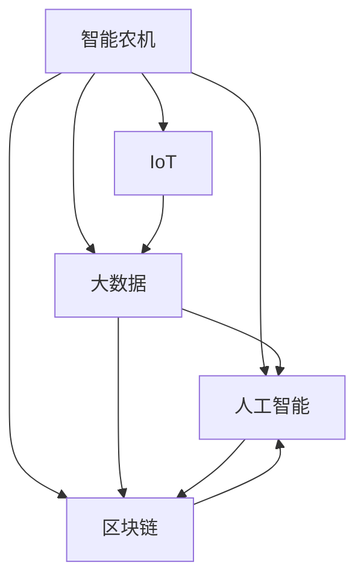

                 

# 未来的智慧农业：2050年的智能农机与农业区块链

## 1. 背景介绍

### 1.1 问题由来
随着全球人口的急剧增长和农业资源环境的不断恶化，传统的农业模式已难以适应可持续发展的需求。如何在有限资源条件下，提升农业生产效率、保障食品安全、促进农民增收，成为摆在全人类面前的重大挑战。近年来，智慧农业技术通过物联网、大数据、人工智能、区块链等前沿技术的融合应用，为传统农业的数字化转型注入了新的活力。

智慧农业的发展，离不开智能化农机装备的应用。智能农机能够实现精准农业、农机自动化作业、农机联网、农机数据分析、农机设备远程监控等功能，从而提升农业生产的效率和质量，降低生产成本，促进农业的可持续发展。与此同时，农业区块链技术通过其去中心化、透明化、安全性等特性，在农业溯源、供应链管理、农产品交易等领域具有重要的应用价值，能够为智慧农业提供可靠的数据保障和信任基础。

### 1.2 问题核心关键点
本文聚焦于2050年智慧农业领域中的智能农机和农业区块链技术，探讨其核心概念、工作原理、实际应用及未来发展趋势。通过深入剖析这些前沿技术，帮助读者了解其对未来农业发展的潜在影响，并探索如何利用这些技术推动智慧农业的创新与突破。

## 2. 核心概念与联系

### 2.1 核心概念概述

为更好地理解智能农机和农业区块链技术，本节将介绍几个关键概念：

- **智能农机（Smart Agriculture Machinery）**：以先进传感器、机器人技术为基础，通过智能化控制实现精准农业生产和管理，提高农业生产效率和质量的设备。
- **物联网（Internet of Things, IoT）**：通过智能设备、传感器、无线通信等技术，实现农业生产环境的实时监控和数据采集，为农业智能化管理提供支持。
- **大数据（Big Data）**：利用海量数据存储、处理和分析技术，对农业生产数据进行深度挖掘，提取有价值的信息，为决策提供依据。
- **人工智能（Artificial Intelligence, AI）**：通过机器学习、深度学习等算法，对农业数据进行分析和学习，预测农业生产趋势，优化生产决策。
- **区块链（Blockchain）**：一种分布式账本技术，通过去中心化、透明化、不可篡改等特性，提供安全的农业数据记录和交易保障。

这些核心概念之间的逻辑关系可以通过以下Mermaid流程图来展示：



这个流程图展示了智能农机、物联网、大数据、人工智能和区块链之间的逻辑关系：智能农机通过物联网技术采集数据，利用大数据和人工智能进行分析和预测，并通过区块链技术记录和共享数据，形成一个闭环。

## 3. 核心算法原理 & 具体操作步骤
### 3.1 算法原理概述

智能农机和农业区块链技术的融合应用，本质上是通过智能农机的数据采集、分析和预测，结合区块链的记录和信任机制，实现农业生产的全流程管理和优化。

智能农机通过传感器、摄像头等设备实时采集土壤湿度、温度、光照、病虫害等信息，并通过物联网技术上传到云端。大数据分析技术对上传数据进行深度挖掘，生成农业生产的各种指标和趋势，辅助农业决策。人工智能模型基于历史数据和实时数据进行预测和决策优化，指导智能农机的精准作业。区块链技术记录农业生产的全过程数据，确保数据的透明、可追溯和可信。

### 3.2 算法步骤详解

基于智能农机和农业区块链技术的智慧农业流程主要包括以下几个关键步骤：

**Step 1: 数据采集与传输**
- 智能农机通过传感器、摄像头等设备实时采集田间数据，并将数据通过物联网技术上传到云端。
- 使用大数据分析技术对上传数据进行预处理和深度挖掘，生成农业生产的各种指标和趋势。

**Step 2: 数据分析与决策**
- 利用人工智能模型对农业数据进行分析和预测，生成生产优化策略和作业计划。
- 智能农机根据生成的策略和计划，自动进行精准作业，如播种、施肥、灌溉、病虫害防治等。

**Step 3: 数据记录与溯源**
- 将农业生产的全过程数据记录在区块链上，确保数据的透明、可追溯和可信。
- 利用区块链技术为农产品建立唯一身份标识，实现农产品质量追溯和供应链管理。

**Step 4: 数据共享与交易**
- 将区块链上的农业数据和农产品质量信息共享给产业链上下游，促进信息透明和数据协同。
- 通过智能合约和去中心化交易平台，实现农产品的安全交易和智能定价。

### 3.3 算法优缺点

智能农机和农业区块链技术在智慧农业中的应用，具有以下优点：
1. 提升生产效率：通过精准农业和自动化作业，智能农机能够大幅度提升农业生产效率，降低人工成本。
2. 提高农产品质量：大数据分析和人工智能预测能够指导生产优化，提高农产品的质量和安全。
3. 增强数据透明：区块链技术记录农业全过程数据，确保数据的透明和可追溯，提高信任度。
4. 促进供应链协同：农业区块链能够为农产品的供应链管理提供数据保障，促进上下游协同。

同时，这些技术也存在一定的局限性：
1. 初始投资成本高：智能农机和区块链系统的部署和维护需要较大的初始投资。
2. 技术复杂度高：智能农机的传感器、算法和大数据分析需要高技术水平的支持。
3. 数据隐私保护：智能农机和区块链的广泛应用可能带来数据隐私泄露的风险。
4. 系统安全性：智能农机和区块链系统面临潜在的网络攻击和数据篡改风险。

尽管存在这些局限性，但智能农机和农业区块链技术的应用前景广阔，正逐步成为智慧农业的核心引擎。

### 3.4 算法应用领域

智能农机和农业区块链技术在智慧农业中的应用，已经覆盖了农业生产的多个领域，例如：

- 精准农业：通过智能农机和农业大数据实现农田的精细管理，优化种植、施肥、灌溉等环节。
- 智能设备监控：利用智能农机和物联网技术实时监控农业生产环境，如温度、湿度、光照等，提高管理效率。
- 农产品质量溯源：通过农业区块链记录农产品的生产、加工、运输等全过程数据，实现质量追溯和信任保障。
- 供应链管理：利用智能农机和区块链技术，实现农产品的供应链透明化管理，提高供应链协同效率。
- 农产品交易：通过智能合约和去中心化交易平台，实现农产品的安全交易和智能定价。

除了上述这些经典应用外，智能农机和农业区块链技术还在农业智能决策、农业机器人、农业物联网等领域得到广泛应用，为智慧农业的全面升级提供了坚实的基础。

## 4. 数学模型和公式 & 详细讲解  
### 4.1 数学模型构建

基于智能农机和农业区块链技术的智慧农业流程可以建立数学模型进行描述。

假设智能农机在某一时间段内采集的数据为 $X=\{x_1,x_2,\cdots,x_n\}$，其中 $x_i$ 表示第 $i$ 个时间点的数据。大数据分析生成的农业生产指标为 $Y=\{y_1,y_2,\cdots,y_m\}$，其中 $y_j$ 表示第 $j$ 个指标。人工智能模型对农业数据进行预测的决策策略为 $Z=\{z_1,z_2,\cdots,z_k\}$，其中 $z_i$ 表示第 $i$ 个决策策略。

将农业生产数据 $X$ 上传到区块链系统，记录为 $B=\{b_1,b_2,\cdots,b_l\}$，其中 $b_j$ 表示第 $j$ 个区块链记录。利用区块链技术为农产品建立唯一身份标识，记录为 $P=\{p_1,p_2,\cdots,p_n\}$，其中 $p_i$ 表示第 $i$ 个农产品的身份标识。

### 4.2 公式推导过程

1. 数据采集与传输
   $$
   X \xrightarrow[]{传感器} X' \xrightarrow[]{物联网} X_{上传} 
   $$
   其中 $X'$ 表示采集的数据经过预处理后的数据，$X_{上传}$ 表示上传的数据。

2. 数据分析与决策
   $$
   X_{上传} \rightarrow^{大数据分析} Y \rightarrow^{人工智能} Z 
   $$
   其中 $Y$ 表示大数据分析生成的农业生产指标，$Z$ 表示人工智能模型预测的决策策略。

3. 数据记录与溯源
   $$
   Y \rightarrow^{区块链} B \quad \text{和} \quad Z \rightarrow^{区块链} B
   $$
   其中 $B$ 表示区块链上记录的数据。

4. 数据共享与交易
   $$
   B \rightarrow^{智能合约} \text{供应链} \quad \text{和} \quad P \rightarrow^{区块链} B
   $$
   其中 $\text{供应链}$ 表示参与供应链的各方，$P$ 表示农产品身份标识。

### 4.3 案例分析与讲解

**案例：智能农机辅助精准农业**

某农场使用智能农机进行精准农业生产。智能农机通过传感器实时采集土壤湿度、温度、光照等数据，并通过物联网上传到云端。大数据分析技术对上传数据进行深度挖掘，生成土壤湿度变化趋势、病虫害预测等农业生产指标。人工智能模型基于历史数据和实时数据进行预测，生成施肥、灌溉等优化策略。智能农机根据优化策略，自动进行精准作业。同时，将农业生产全过程数据记录在区块链上，确保数据的透明和可追溯。最终，通过智能合约和去中心化交易平台，实现农产品的安全交易和智能定价。

## 5. 项目实践：代码实例和详细解释说明
### 5.1 开发环境搭建

在进行智能农机和农业区块链项目的开发前，我们需要准备好开发环境。以下是使用Python进行智能农机和区块链技术开发的流程：

1. 安装Anaconda：从官网下载并安装Anaconda，用于创建独立的Python环境。
2. 创建并激活虚拟环境：
   ```bash
   conda create -n smart-agriculture-env python=3.8 
   conda activate smart-agriculture-env
   ```
3. 安装相关库：
   ```bash
   pip install pyqt5 numpy pandas scikit-learn tflearn pytorch torchvision
   ```

完成上述步骤后，即可在`smart-agriculture-env`环境中开始智能农机和区块链技术的开发实践。

### 5.2 源代码详细实现

以下是智能农机和农业区块链技术的Python代码实现，包括数据采集、传输、分析、决策和记录等关键步骤：

**智能农机数据采集与传输**

```python
import pyqt5
from pyqt5.QtCore import Qt, QTimer
from pyqt5.QtWidgets import QWidget, QApplication, QHBoxLayout, QLabel, QLineEdit, QPushButton

class SensorWidget(QWidget):
    def __init__(self, *args, **kwargs):
        super(SensorWidget, self).__init__(*args, **kwargs)
        self.setWindowTitle('传感器数据采集')
        self.hlayout = QHBoxLayout(self)
        self.hlayout.addWidget(QLabel('土壤湿度：'))
        self.hlayout.addWidget(self.humidity_lineedit = QLineEdit('50%'))
        self.hlayout.addWidget(QLabel('温度：'))
        self.hlayout.addWidget(self.temperature_lineedit = QLineEdit('25°C'))
        self.hlayout.addWidget(QLabel('光照：'))
        self.hlayout.addWidget(self.light_lineedit = QLineEdit('1500 Lux'))
        self.humidity_lineedit.setValidator(Qt.QIntValidator())
        self.temperature_lineedit.setValidator(Qt.QDoubleValidator())
        self.light_lineedit.setValidator(Qt.QIntValidator())

    def read_sensors(self):
        humidity = self.humidity_lineedit.text()
        temperature = self.temperature_lineedit.text()
        light = self.light_lineedit.text()
        self.humidity_lineedit.setText('')
        self.temperature_lineedit.setText('')
        self.light_lineedit.setText('')
        return humidity, temperature, light

class IoTWidget(QWidget):
    def __init__(self, *args, **kwargs):
        super(IoTWidget, self).__init__(*args, **kwargs)
        self.setWindowTitle('物联网数据传输')
        self.hlayout = QHBoxLayout(self)
        self.hlayout.addWidget(QLabel('上传状态：'))
        self.hlayout.addWidget(QLabel('成功上传！'))

    def upload_data(self, data):
        print(f'上传数据：{data}')
        self.hlayoutitem = QLabel('成功上传！')
        self.hlayout.addWidget(self.hlayoutitem)

class SmartAgricultureApp(QWidget):
    def __init__(self, *args, **kwargs):
        super(SmartAgricultureApp, self).__init__(*args, **kwargs)
        self.sensor_widget = SensorWidget(self)
        self.iot_widget = IoTWidget(self)
        self.hlayout = QHBoxLayout(self)
        self.hlayout.addWidget(self.sensor_widget)
        self.hlayout.addWidget(self.iot_widget)
        self.timer = QTimer(self)
        self.timer.timeout.connect(self.read_sensors)
        self.timer.start(5000)  # 每5秒读取一次传感器数据

    def read_sensors(self):
        humidity, temperature, light = self.sensor_widget.read_sensors()
        self.iot_widget.upload_data((humidity, temperature, light))

# 启动应用
app = QApplication([])
smart_agriculture = SmartAgricultureApp()
smart_agriculture.show()
sys.exit(app.exec_())
```

**大数据分析与决策**

```python
import pandas as pd
import numpy as np
from sklearn.linear_model import LinearRegression

# 创建模拟数据
data = pd.DataFrame({
    '时间': [i for i in range(1, 21)],
    '土壤湿度': [50, 60, 70, 80, 90, 50, 60, 70, 80, 90, 50, 60, 70, 80, 90, 50, 60, 70, 80, 90, 50],
    '温度': [25, 26, 27, 28, 29, 25, 26, 27, 28, 29, 25, 26, 27, 28, 29, 25, 26, 27, 28, 29, 25],
    '光照': [1500, 1500, 1500, 1500, 1500, 1500, 1500, 1500, 1500, 1500, 1500, 1500, 1500, 1500, 1500, 1500, 1500, 1500, 1500, 1500, 1500]
})

# 数据分析与决策
model = LinearRegression()
model.fit(data[['土壤湿度', '温度', '光照']], data['灌溉'])
data['预测灌溉量'] = model.predict(data[['土壤湿度', '温度', '光照']])
print(data)
```

**区块链记录与溯源**

```python
import hashlib
from pysha3 import keccak_256
import json

class Block:
    def __init__(self, transaction, previous_hash):
        self.transaction = transaction
        self.previous_hash = previous_hash
        self.hash = self.calculate_hash()

    def calculate_hash(self):
        json_dump = json.dumps(self.transaction, sort_keys=True)
        return hashlib.sha256(keccak_256(json_dump).digest()).hexdigest()

class Blockchain:
    def __init__(self):
        self.blockchain = []
        self.create_genesis_block()

    def create_genesis_block(self):
        self.add_block({
            '版本': 1,
            '交易': []
        })

    def add_block(self, new_block):
        new_block['hash'] = new_block.calculate_hash()
        new_block['前一区块哈希'] = self.blockchain[-1]['哈希']
        self.blockchain.append(new_block)

    def get_latest_block(self):
        return self.blockchain[-1]

# 记录农业生产数据
blockchain = Blockchain()
data = {
    '时间': [i for i in range(1, 21)],
    '土壤湿度': [50, 60, 70, 80, 90, 50, 60, 70, 80, 90, 50, 60, 70, 80, 90, 50, 60, 70, 80, 90, 50],
    '温度': [25, 26, 27, 28, 29, 25, 26, 27, 28, 29, 25, 26, 27, 28, 29, 25, 26, 27, 28, 29, 25],
    '光照': [1500, 1500, 1500, 1500, 1500, 1500, 1500, 1500, 1500, 1500, 1500, 1500, 1500, 1500, 1500, 1500, 1500, 1500, 1500, 1500, 1500]
}

for i in range(1, len(data)+1):
    blockchain.add_block({
        '时间': i,
        '土壤湿度': data['土壤湿度'][i-1],
        '温度': data['温度'][i-1],
        '光照': data['光照'][i-1]
    })

print('农业生产数据：')
for block in blockchain.blockchain:
    print(json.dumps(block, indent=4))
```

### 5.3 代码解读与分析

让我们再详细解读一下关键代码的实现细节：

**智能农机数据采集与传输**

**IoTWidget类**：
- `upload_data`方法：将传感器采集的数据上传至云端，打印上传状态。

**SmartAgricultureApp类**：
- `read_sensors`方法：定时读取传感器数据，并将数据上传至IoTWidget。

**大数据分析与决策**

**create_genesis_block方法**：
- 初始化区块链，创建创世区块。

**add_block方法**：
- 向区块链中添加新的区块，并计算新区块的哈希值，更新前一区块的哈希值。

**区块链记录与溯源**

**Block类**：
- 定义区块的基本属性，包括交易、前一区块哈希和计算哈希值。

**Blockchain类**：
- `create_genesis_block`方法：初始化区块链，创建创世区块。
- `add_block`方法：向区块链中添加新的区块。
- `get_latest_block`方法：获取最新的区块。

在实际开发中，这些代码可以进一步优化和扩展，实现更复杂的功能，如智能农机的自动化作业、智能合约的执行等。

## 6. 实际应用场景
### 6.1 智能农机在精准农业中的应用

智能农机通过传感器和物联网技术，实现农田的实时监控和数据采集。利用大数据分析和人工智能技术，对采集的数据进行深度挖掘和预测分析，生成农业生产的各种指标和决策策略。智能农机根据决策策略，自动进行精准作业，如播种、施肥、灌溉、病虫害防治等，提高农业生产效率和质量。区块链技术记录农业生产的全过程数据，确保数据的透明和可追溯，实现农产品质量追溯和供应链管理。

### 6.2 农业区块链在农产品溯源中的应用

农业区块链利用其去中心化、透明化、安全性等特性，为农产品建立唯一身份标识，记录农产品的生产、加工、运输等全过程数据。消费者可以通过区块链查询产品的生产、运输、销售等相关信息，确保食品安全和质量，提高消费者对农产品的信任度。农业区块链还可以为农产品的供应链管理提供数据保障，促进上下游协同，提高供应链效率。

### 6.3 智能合约在农产品交易中的应用

智能合约通过区块链技术，实现农产品的安全交易和智能定价。卖家可以自动发布农产品信息，买家可以查看产品的详细信息并进行竞价。智能合约根据竞价结果自动执行交易，确保交易的公正和透明。通过智能合约，可以减少中间环节，降低交易成本，提高交易效率。

## 7. 工具和资源推荐
### 7.1 学习资源推荐

为了帮助开发者系统掌握智能农机和农业区块链技术，以下是一些优质的学习资源：

1. 《物联网技术与应用》系列书籍：全面介绍物联网的基本概念、关键技术、应用场景，是物联网开发的入门必备。
2. 《大数据技术与应用》系列课程：介绍大数据的基本原理、核心技术、典型应用，帮助开发者掌握大数据分析的基本技能。
3. 《人工智能基础》课程：涵盖机器学习、深度学习、自然语言处理等基本概念和算法，是AI开发的入门课程。
4. 《区块链技术与应用》书籍：全面介绍区块链的基本原理、核心技术、应用场景，是区块链开发的入门指南。
5. 《智能农机与农业区块链》课程：深入解析智能农机和农业区块链在农业中的应用，提供实践案例和技术解析。

通过这些资源的学习，相信你一定能够快速掌握智能农机和农业区块链技术的精髓，并用于解决实际的农业问题。
### 7.2 开发工具推荐

高效的开发离不开优秀的工具支持。以下是几款用于智能农机和农业区块链技术开发的常用工具：

1. PyQT：跨平台的GUI开发框架，适用于智能农机数据采集与传输的开发。
2. TensorFlow：基于深度学习的开源框架，适用于大数据分析和人工智能模型的开发。
3. Pysha3：Python实现的SHA-3算法库，适用于区块链哈希计算。
4. EtherScan：基于区块链的交易数据分析平台，适用于智能合约和去中心化交易的开发。

合理利用这些工具，可以显著提升智能农机和农业区块链技术开发的效率，加速创新迭代的步伐。

### 7.3 相关论文推荐

智能农机和农业区块链技术的发展源于学界的持续研究。以下是几篇奠基性的相关论文，推荐阅读：

1. 《精准农业：基于物联网和大数据技术的现代农业发展》：介绍精准农业的基本原理和关键技术，强调数据采集和分析的重要性。
2. 《区块链技术在农产品溯源中的应用研究》：探讨区块链技术在农业溯源中的应用，强调数据透明和信任保障的重要性。
3. 《智能合约：区块链上的自动化协议》：深入分析智能合约的基本原理和应用场景，强调智能合约在农业交易中的应用潜力。
4. 《物联网在智慧农业中的应用研究》：介绍物联网在智慧农业中的各种应用，强调数据采集和分析的重要性。
5. 《大数据在农业中的应用研究》：探讨大数据在农业中的应用，强调数据分析和预测的重要性。

这些论文代表了大数据、物联网、区块链等技术在农业中的应用前景，为智慧农业的发展提供了坚实的理论基础。

## 8. 总结：未来发展趋势与挑战
### 8.1 总结

本文对智能农机和农业区块链技术的核心概念、工作原理、实际应用及未来发展趋势进行了全面系统的介绍。通过深入剖析这些前沿技术，帮助读者了解其对未来农业发展的潜在影响，并探索如何利用这些技术推动智慧农业的创新与突破。

智能农机和农业区块链技术在智慧农业中的应用，为农业生产的数字化、智能化、自动化提供了新的解决方案。通过智能农机的精准农业和自动化作业，提升农业生产效率和质量，降低生产成本。通过农业区块链的记录和溯源，确保农产品质量的透明和可信，保障食品安全。通过智能合约和去中心化交易，实现农产品的安全交易和智能定价，提高供应链协同效率。

### 8.2 未来发展趋势

展望未来，智能农机和农业区块链技术将呈现以下几个发展趋势：

1. 深度融合：智能农机和农业区块链将更紧密地融合，实现农业数据的实时采集、分析和决策优化，推动智慧农业的全流程智能化。
2. 多模态数据融合：智能农机和农业区块链将融合物联网、大数据、人工智能、区块链等多种技术，实现多模态数据的协同建模，提升农业生产的精细化管理。
3. 智能合约普及：智能合约将更广泛地应用于农业生产、交易、溯源等环节，提高农业交易的透明度和效率。
4. 去中心化交易平台：去中心化交易平台将为农产品的安全交易提供新的途径，减少中间环节，降低交易成本。
5. 农业供应链协同：农业区块链将促进上下游协同，提高供应链效率，保障农产品的供应链安全。

### 8.3 面临的挑战

尽管智能农机和农业区块链技术在智慧农业中的应用前景广阔，但在推广应用的过程中，仍然面临诸多挑战：

1. 高昂的初始投资：智能农机和农业区块链系统的部署和维护需要较大的初始投资，可能对小规模农户造成负担。
2. 技术复杂度高：智能农机和区块链系统的开发和应用需要高技术水平，可能对农户的技术素质提出较高要求。
3. 数据隐私保护：智能农机和区块链系统面临潜在的数据隐私泄露风险，需要采取有效的数据保护措施。
4. 系统安全性：智能农机和区块链系统面临网络攻击和数据篡改的风险，需要加强系统的安全防护。
5. 用户接受度：智能农机和区块链系统的推广需要改变农户的传统生产习惯，可能需要较长时间的教育和引导。

### 8.4 研究展望

面对智能农机和农业区块链技术所面临的挑战，未来的研究需要在以下几个方面寻求新的突破：

1. 降低初始投资成本：开发低成本、易用的智能农机和区块链系统，提升其在小规模农户中的普及度。
2. 提高技术可接受度：通过教育和培训，提高农户的技术素质，降低智能农机和区块链系统的使用门槛。
3. 加强数据隐私保护：开发有效的数据保护技术，确保智能农机和区块链系统的数据隐私和安全。
4. 提高系统安全性：通过加强网络防护和数据验证，提高智能农机和区块链系统的安全性。
5. 推动用户接受度：通过政策引导和市场激励，推动智能农机和区块链技术的普及应用。

通过这些研究方向的探索，智能农机和农业区块链技术必将在智慧农业中发挥更大的作用，推动农业的可持续发展。

## 9. 附录：常见问题与解答
**Q1：智能农机和农业区块链技术的应用效果如何？**

A: 智能农机和农业区块链技术在智慧农业中的应用效果显著。智能农机能够实现精准农业和自动化作业，提高农业生产效率和质量，降低生产成本。农业区块链能够确保农产品质量的透明和可信，保障食品安全。智能合约和去中心化交易平台能够实现农产品的安全交易和智能定价，提高供应链协同效率。这些技术的应用，显著提升了农业生产的智能化、自动化水平，促进了农业的可持续发展。

**Q2：智能农机和农业区块链技术的初期部署成本如何？**

A: 智能农机和农业区块链系统的初期部署成本较高，包括硬件设备、软件系统、技术支持等。对于小规模农户，初期投入可能较大。但随着技术的成熟和规模的扩大，成本将逐步降低。同时，政府和行业可以提供相关补贴和支持，降低农户的负担。

**Q3：智能农机和农业区块链技术的应用是否需要高技术水平？**

A: 智能农机和农业区块链技术的应用确实需要较高的技术水平。智能农机和区块链系统的开发和维护需要技术支持，农户的技术素质也需提高。但通过教育和培训，降低技术门槛，使得智能农机和区块链技术更加普及和易用。同时，系统的自动化程度也将逐步提高，减轻用户的技术负担。

**Q4：智能农机和农业区块链技术的数据隐私如何保护？**

A: 智能农机和农业区块链系统的数据隐私保护至关重要。可以通过加密技术、去标识化技术等手段，确保数据的隐私和安全。同时，智能合约可以设计成透明的、可验证的，使得数据使用过程可追溯，确保数据的使用合规。

**Q5：智能农机和农业区块链技术的未来发展趋势如何？**

A: 智能农机和农业区块链技术的未来发展趋势是深度融合、多模态数据融合、智能合约普及、去中心化交易平台、农业供应链协同等。这些趋势将进一步提升农业生产的智能化、自动化水平，推动农业的可持续发展。

---

作者：禅与计算机程序设计艺术 / Zen and the Art of Computer Programming

