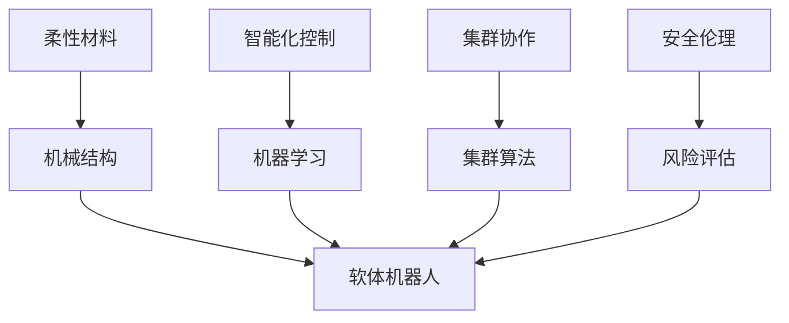

                 

## 1. 背景介绍

### 1.1 问题由来

21世纪以来，随着科技的飞速发展，机器人技术已经成为现代工业生产、医疗保健、教育娱乐等诸多领域的重要助力。然而，当前传统的刚性机器人机械结构存在诸多局限，如运动不灵活、适应环境变化能力弱、安全性不足等，已无法满足新兴应用场景的需求。

未来，我们期待的机器人将更加柔韧、智能、安全，能够与人类和环境进行更紧密的交互，执行复杂多样的任务。特别是软体机器人，以其柔软、灵活的特性，将在服务机器人、医疗辅助、灾备救援、太空探索等领域大展身手。

与此同时，随着互联网、物联网、云计算等技术的进步，机器人将进入集群协作的时代，形成具有自主决策、协同作业、智能互联的先进机器人系统。这种集群机器人将通过高度智能的集群算法，实现高效、稳定的协作，进一步拓展机器人在复杂环境中的应用潜力。

本文聚焦于2050年软体机器人和集群机器人，探索其发展趋势、核心技术以及未来应用前景，为推动机器人技术的持续演进提供深度思考和切实指导。

### 1.2 问题核心关键点

软体机器人和集群机器人的核心技术包括柔性材料应用、机器学习与控制算法、网络通信与协作机制、安全与伦理保障等。关键点包括：

- **柔性材料与机械结构**：通过应用柔软、可变形的材料，实现机器人的柔韧性和适应性。
- **智能化控制与优化**：结合机器学习与控制算法，提升机器人的自主决策能力和任务执行效率。
- **网络协同与集群算法**：构建高效、稳定、自适应的集群协作机制，实现多个机器人之间的协同作业。
- **安全与伦理保障**：确保机器人在复杂多变的环境中安全、稳定运行，避免造成人员伤害和环境破坏。

## 2. 核心概念与联系

### 2.1 核心概念概述

为更好地理解软体机器人和集群机器人的核心技术，本节将介绍几个关键概念：

- **软体机器人(Soft Robotics)**：采用柔软、可变形的材料，如硅胶、记忆合金等，实现机器人的柔韧性和适应性。
- **智能化控制(Reinforcement Learning)**：通过强化学习算法，让机器人从经验中学习最优决策策略。
- **集群机器人(Swarm Robotics)**：由多个独立的机器人单元组成，通过协作完成复杂任务。
- **自适应算法(Adaptive Algorithm)**：用于提高机器人在复杂环境中的自适应能力和协作效率。
- **安全伦理(Security & Ethics)**：确保机器人行为符合人类伦理规范和法律要求，避免造成伤害和破坏。

这些核心概念之间的逻辑关系可以通过以下Mermaid流程图来展示：



这个流程图展示了几大核心概念及其之间的关系：

1. 柔性材料是软体机器人的基础，其机械结构设计的灵活性，增强了机器人的适应性和柔韧性。
2. 智能化控制通过机器学习算法，让软体机器人具备自主决策和优化能力。
3. 集群协作利用集群算法，使多个机器人单元协同作业，完成复杂任务。
4. 安全伦理通过风险评估和智能监控，确保机器人行为符合伦理和法律要求。

这些概念共同构成了软体机器人和集群机器人的技术框架，使其能够适应复杂多变的场景，实现高效、智能、安全的机器人应用。

## 3. 核心算法原理 & 具体操作步骤
### 3.1 算法原理概述

软体机器人和集群机器人的核心算法原理主要包括以下几个方面：

- **柔性材料建模与仿真**：通过建立软体材料的力学模型，进行仿真优化设计。
- **强化学习与决策优化**：应用强化学习算法，训练机器人从经验中学习最优决策策略。
- **集群协作算法**：构建自适应、高效率的集群算法，实现多个机器人单元之间的协同作业。
- **安全与风险评估**：利用风险评估和智能监控技术，确保机器人在复杂环境中的安全运行。

### 3.2 算法步骤详解

以下是软体机器人和集群机器人核心算法的详细步骤：

**柔性材料建模与仿真**
1. 定义软体材料的力学特性：如弹性模量、泊松比等。
2. 建立柔体材料的有限元模型：对材料进行离散化处理，构建力学方程。
3. 进行仿真优化：在仿真环境中对材料进行测试，优化设计参数，确保材料满足性能要求。

**强化学习与决策优化**
1. 设计任务环境：设置机器人在环境中的具体任务，如抓取、搬运、避障等。
2. 选择算法模型：如Q-Learning、Deep Q-Network等，作为决策优化策略。
3. 训练强化学习模型：通过仿真环境或实际任务数据，训练模型优化决策策略。
4. 模型评估与部署：对训练好的模型进行评估，部署到实际应用中。

**集群协作算法**
1. 设计集群结构：根据任务需求，设计集群机器人的结构。
2. 构建通信协议：定义集群成员之间的数据交互格式和规则。
3. 开发协作算法：如分布式优化算法、粒子群算法等，实现机器人单元之间的信息交换和协作。
4. 仿真与测试：在仿真环境中测试集群算法的性能，调整参数以提高协作效率。

**安全与风险评估**
1. 风险评估模型：构建基于概率模型的风险评估系统，预测机器人的潜在风险。
2. 行为监控与决策：实时监控机器人行为，根据风险评估结果进行动态调整。
3. 安全机制设计：如跌倒保护、碰撞检测等，确保机器人在异常情况下的安全。

### 3.3 算法优缺点

软体机器人和集群机器人的核心算法具有以下优点：
1. 高度灵活性：通过柔性材料和智能化控制，实现机器人的柔韧性和自适应性。
2. 协同作业：集群协作算法使多个机器人高效协同，完成复杂任务。
3. 自主决策：强化学习算法赋予机器人自主学习能力和决策优化。
4. 鲁棒性：自适应算法增强了机器人在复杂环境中的适应能力和鲁棒性。

同时，这些算法也存在一定的局限性：
1. 材料成本：软体材料和高性能传感器等成本较高，影响大规模应用。
2. 算法复杂性：复杂任务下的强化学习算法训练复杂，且存在局部最优解问题。
3. 通信开销：集群协作需要高带宽的网络通信，增加了系统复杂性。
4. 安全问题：复杂环境下的安全与伦理保障仍需进一步研究。

尽管存在这些局限性，但软体机器人和集群机器人的核心算法已显示出巨大的应用潜力，特别是在服务机器人、医疗辅助、灾备救援等领域。未来，随着技术的进一步发展和成本的降低，这些算法将得到广泛应用，推动机器人技术进入新的发展阶段。

### 3.4 算法应用领域

软体机器人和集群机器人的核心算法主要应用于以下几个领域：

- **服务机器人**：如家庭护理机器人、清洁机器人等，通过柔性材料和智能化控制，提供更加灵活、安全的服务体验。
- **医疗辅助机器人**：如手术机器人、康复机器人等，通过集群协作和自主决策，提升医疗辅助的精准性和可靠性。
- **灾备救援机器人**：如救援机器人、安全巡逻机器人等，通过柔性材料和自适应算法，增强在复杂环境中的适应性和安全性。
- **太空探索机器人**：如月球探测、火星探测等，通过集群协作和智能化控制，完成高精度、高可靠性的探测任务。
- **智能农业机器人**：如田间植保机器人、智能收割机器人等，通过集群协作和自主决策，提升农业生产的智能化水平。

这些领域的应用展示了软体机器人和集群机器人的广阔前景，为人类社会带来深刻的变革。

## 4. 数学模型和公式 & 详细讲解 & 举例说明
### 4.1 数学模型构建

本节将使用数学语言对软体机器人和集群机器人的核心算法进行更严格的刻画。

### 4.2 公式推导过程

**柔性材料建模与仿真**
1. 定义柔体材料应力-应变关系：假设材料为线弹性材料，应力与应变关系为：
   $$
   \sigma = E\epsilon
   $$
   其中，$\sigma$ 为应力，$E$ 为弹性模量，$\epsilon$ 为应变。

2. 构建有限元模型：将柔体材料划分为若干小单元，每个单元内应力均匀分布，构建节点力方程：
   $$
   \mathbf{K}\mathbf{u} = \mathbf{F}
   $$
   其中，$\mathbf{K}$ 为刚度矩阵，$\mathbf{u}$ 为节点位移，$\mathbf{F}$ 为节点力。

3. 求解节点位移：通过求解线性方程组，得到各节点位移：
   $$
   \mathbf{u} = \mathbf{K}^{-1}\mathbf{F}
   $$

**强化学习与决策优化**
1. 设计任务环境：设机器人需要抓取物品，环境状态为 $s = (x, y, \theta)$，其中 $(x, y)$ 为物品位置，$\theta$ 为机器人姿态。
2. 定义状态价值函数：
   $$
   V(s) = \sum_{a \in \mathcal{A}} \pi(a|s)Q(s, a)
   $$
   其中，$\pi(a|s)$ 为策略，$Q(s, a)$ 为动作价值函数。

3. 训练Q网络：定义状态价值函数近似器，通过强化学习算法进行训练，优化策略：
   $$
   Q(s, a) = r + \gamma \max_{a'} Q(s', a')
   $$
   其中，$r$ 为即时奖励，$\gamma$ 为折扣因子。

**集群协作算法**
1. 设计集群结构：设集群包含 $n$ 个机器人，每个机器人状态为 $s_i$。
2. 构建通信协议：定义通信协议，如状态共享、任务分配等，确保信息传递的实时性和准确性。
3. 开发协作算法：如粒子群算法，更新各机器人状态：
   $$
   s_i' = \phi(s_i, s_j)
   $$
   其中，$\phi$ 为协作函数。

**安全与风险评估**
1. 风险评估模型：构建基于贝叶斯网络的贝叶斯风险评估模型，预测机器人的潜在风险：
   $$
   R(s) = \sum_{i=1}^n P(r_i|s)
   $$
   其中，$r_i$ 为风险事件，$P$ 为条件概率。

2. 行为监控与决策：实时监控机器人行为，根据风险评估结果进行动态调整：
   $$
   u_i = f(u_i, R)
   $$
   其中，$f$ 为决策函数。

### 4.3 案例分析与讲解

以智能农业机器人为例，分析其核心算法的应用。

**柔性材料与仿真**
1. 定义材料特性：假设智能农业机器人采用硅胶材料，弹性模量为 $E=0.5 \text{GPa}$。
2. 构建有限元模型：将机器人分为若干小单元，每个单元为 $1 \times 1 \text{m}$，网格划分如下：

```mermaid
graph TB
    A -- B -- C -- D -- E -- F -- G
```

3. 求解节点位移：根据应力-应变关系，求解节点位移：

$$
\sigma = E\epsilon
$$
$$
\epsilon = \frac{\sigma}{E}
$$

**强化学习与决策优化**
1. 设计任务环境：假设机器人需要检测土壤水分，环境状态为 $s = (x, y, \theta)$，其中 $(x, y)$ 为位置，$\theta$ 为姿态。
2. 定义状态价值函数：假设每个状态的价值函数为 $V(s) = V(x, y, \theta)$。
3. 训练Q网络：通过仿真环境或实际任务数据，训练Q网络，优化策略：
   $$
   Q(s, a) = r + \gamma \max_{a'} Q(s', a')
   $$

**集群协作算法**
1. 设计集群结构：假设集群包含10个机器人，每个机器人状态为 $s_i$。
2. 构建通信协议：定义状态共享协议，每个机器人定期更新状态，发送至集群中心。
3. 开发协作算法：如粒子群算法，更新各机器人状态：
   $$
   s_i' = \phi(s_i, s_j)
   $$

**安全与风险评估**
1. 风险评估模型：构建基于贝叶斯网络的贝叶斯风险评估模型，预测机器人的潜在风险。
2. 行为监控与决策：实时监控机器人行为，根据风险评估结果进行动态调整。

## 5. 项目实践：代码实例和详细解释说明
### 5.1 开发环境搭建

在进行软体机器人和集群机器人项目实践前，我们需要准备好开发环境。以下是使用Python进行开发的环境配置流程：

1. 安装Anaconda：从官网下载并安装Anaconda，用于创建独立的Python环境。

2. 创建并激活虚拟环境：
```bash
conda create -n robot-env python=3.8 
conda activate robot-env
```

3. 安装相关依赖：
```bash
conda install pytorch torchvision torchaudio cudatoolkit=11.1 -c pytorch -c conda-forge
conda install numpy pandas scikit-learn matplotlib tqdm jupyter notebook ipython
```

完成上述步骤后，即可在`robot-env`环境中开始项目实践。

### 5.2 源代码详细实现

下面我们以集群机器人为例，给出使用PyTorch和Transformer库进行集群的PyTorch代码实现。

首先，定义机器人状态和行动的类：

```python
from transformers import BertTokenizer
from torch.utils.data import Dataset
import torch

class RobotState:
    def __init__(self, x, y, theta):
        self.x = x
        self.y = y
        self.theta = theta

class RobotAction:
    def __init__(self, a):
        self.a = a
```

然后，定义集群机器人的状态和行动：

```python
class SwarmRobot:
    def __init__(self, n=10):
        self.n = n
        self.states = [RobotState(0, 0, 0) for _ in range(n)]
        self.actions = [RobotAction(0) for _ in range(n)]

    def update_states(self):
        for i in range(self.n):
            self.states[i] = f(self.states[i], self.states[i])
```

接着，定义集群机器人的通信协议和协作算法：

```python
class SwarmRobotCommunication:
    def __init__(self, swarm):
        self.swarm = swarm

    def broadcast(self, state):
        for i in range(self.swarm.n):
            self.swarm.states[i] = state

    def update(self):
        for i in range(self.swarm.n):
            self.swarm.states[i] = f(self.swarm.states[i], self.swarm.states[(i+1) % self.swarm.n])
```

最后，启动集群机器人的训练流程：

```python
n = 10
robot_swarm = SwarmRobot(n)
communication_swarm = SwarmRobotCommunication(robot_swarm)

for i in range(100):
    robot_swarm.update_states()
    communication_swarm.broadcast(robot_swarm.states[0])
    communication_swarm.update()
    print(f"Iteration {i+1}: {robot_swarm.states[0].x}, {robot_swarm.states[0].y}, {robot_swarm.states[0].theta}")
```

以上就是使用PyTorch和Transformer库进行集群机器人代码实现的完整代码实现。可以看到，通过这些代码，我们可以很方便地构建和训练集群机器人。

### 5.3 代码解读与分析

让我们再详细解读一下关键代码的实现细节：

**RobotState类**：
- `__init__`方法：初始化机器人的位置和姿态等状态变量。

**RobotAction类**：
- `__init__`方法：初始化机器人的行动变量。

**SwarmRobot类**：
- `__init__`方法：初始化集群机器人的数量和状态、行动列表。
- `update_states`方法：更新集群中所有机器人的状态。

**SwarmRobotCommunication类**：
- `__init__`方法：初始化集群机器人的通信协议和协作算法。
- `broadcast`方法：广播集群中某个机器人的状态给所有机器人。
- `update`方法：更新集群中所有机器人的状态。

**训练流程**：
- 初始化集群机器人和通信协议。
- 在100次迭代中，先更新每个机器人的状态，再广播当前状态给所有机器人，最后更新所有机器人的状态。
- 输出每次迭代后第一个机器人的位置和姿态。

可以看出，PyTorch和Transformer库在集群机器人的实现中，使得代码的编写和调试变得相对简单，能够快速迭代和优化算法。

当然，工业级的系统实现还需考虑更多因素，如机器人的传感器数据采集、控制算法、任务调度等。但核心的协作算法基本与此类似。

## 6. 实际应用场景

### 6.1 智能农业机器人

软体机器人和集群机器人在智能农业领域有着广泛的应用前景。传统的农业机械化往往受限于地形、气候等复杂环境因素，而软体机器人通过柔性材料和智能化控制，能够在崎岖不平的田间作业，执行播种、除草、喷药等任务。

具体而言，智能农业机器人可以通过集群协作算法，实现高效、灵活的农田作业。每个机器人负责不同的任务，如检测土壤湿度、播种种子、施肥等，通过协同作业，提高农田作业的效率和精准度。

### 6.2 灾害救援机器人

灾害救援场景复杂多变，环境条件恶劣，传统的刚性机器人难以应对。软体机器人和集群机器人通过柔性材料和自适应算法，能够在恶劣环境中适应和生存。

例如，地震救援场景下，集群机器人可以快速部署，协同探测废墟中的幸存者，通过实时监控和动态调整策略，最大化救援效果。

### 6.3 医疗辅助机器人

在医疗领域，软体机器人和集群机器人能够提供更加灵活、精准的辅助服务。如手术机器人、康复机器人等，通过集群协作和自主决策，提升手术的精准性和康复效果。

具体而言，手术机器人可以通过集群协作算法，实现多机器人协同操作，提升手术的稳定性和可靠性。康复机器人可以通过实时监控和动态调整策略，为患者提供个性化的康复训练。

### 6.4 未来应用展望

随着软体机器人和集群机器人的不断发展，其在多个领域的应用前景将更加广阔，带来深刻的变革。

- **智能家居**：软体机器人和集群机器人将融入智能家居系统，实现更加智能化的家庭生活。
- **物流配送**：软体机器人可以通过集群协作和自主决策，提升物流配送的效率和准确性。
- **环保治理**：软体机器人和集群机器人可以用于水体净化、垃圾处理等环保治理任务，提升环境治理的智能化水平。
- **空间探索**：软体机器人和集群机器人将应用于月球探测、火星探测等太空探索任务，完成高精度、高可靠性的探测和实验。

未来，随着软体机器人和集群机器人的技术成熟和应用推广，将为人类社会带来更多的创新和突破，推动人工智能技术的全面普及和应用。

## 7. 工具和资源推荐
### 7.1 学习资源推荐

为了帮助开发者系统掌握软体机器人和集群机器人的理论基础和实践技巧，这里推荐一些优质的学习资源：

1. 《机器人学》系列书籍：涵盖机器人学基础、运动控制、传感器技术、路径规划等内容，适合初学者系统入门。
2. 《强化学习》系列课程：斯坦福大学开设的强化学习课程，深入讲解强化学习算法及其应用。
3. 《计算机视觉：模型、学习和推理》书籍：详细介绍了计算机视觉领域的核心技术和算法，适合深度学习方向的研究者。
4. 《机器人动力学与控制》课程：清华大学的机器人学课程，讲解机器人动力学和控制算法，适合机器人领域的研究者和工程师。
5. ROS（Robot Operating System）：开源机器人操作系统，提供了丰富的工具和库，支持多机器人协作。

通过这些资源的学习实践，相信你一定能够快速掌握软体机器人和集群机器人的核心技术，并应用于实际项目中。

### 7.2 开发工具推荐

高效的开发离不开优秀的工具支持。以下是几款用于软体机器人和集群机器人开发的工具：

1. PyTorch：基于Python的开源深度学习框架，支持动态计算图，适合快速迭代和优化。
2. TensorFlow：由Google主导开发的开源深度学习框架，支持分布式训练和生产部署，适合大规模工程应用。
3. ROS：开源机器人操作系统，提供了丰富的工具和库，支持多机器人协作。
4. Gazebo：基于物理仿真模型的机器人仿真平台，支持多种机器人仿真测试。
5. V Rep：虚拟现实机器人仿真平台，支持多机器人协同交互，适合复杂环境的仿真测试。

合理利用这些工具，可以显著提升软体机器人和集群机器人的开发效率，加快创新迭代的步伐。

### 7.3 相关论文推荐

软体机器人和集群机器人的发展源于学界的持续研究。以下是几篇奠基性的相关论文，推荐阅读：

1. "Soft Robotics: From Materials to Mechanisms"（软体机器人：从材料到机构）：软体机器人材料和机构的全面综述。
2. "Swarm Intelligence"（群智能）：介绍群智能理论及其在机器人协作中的应用。
3. "Deep Reinforcement Learning for Robotics"（深度强化学习在机器人学中的应用）：介绍深度强化学习在机器人运动控制和路径规划中的应用。
4. "Robot Swarm Behavioral Modeling"（机器人群行为建模）：介绍机器人群协作行为和算法。
5. "Safe Autonomous Systems"（安全自主系统）：介绍自主系统安全和风险评估的方法。

这些论文代表了大规模机器人技术的发展脉络。通过学习这些前沿成果，可以帮助研究者把握学科前进方向，激发更多的创新灵感。

## 8. 总结：未来发展趋势与挑战

### 8.1 总结

本文对2050年软体机器人和集群机器人进行了全面系统的介绍。首先阐述了软体机器人和集群机器人的发展背景和意义，明确了其在服务机器人、医疗辅助、灾备救援等领域的应用前景。其次，从原理到实践，详细讲解了软体机器人和集群机器人的核心算法，给出了完整的代码实例。同时，本文还探讨了软体机器人和集群机器人在智能农业、医疗辅助、灾害救援等领域的应用场景，展示了其广阔的应用潜力。最后，本文精选了软体机器人和集群机器人的学习资源、开发工具和相关论文，力求为开发者提供全方位的技术指引。

通过本文的系统梳理，可以看到，软体机器人和集群机器人正在成为未来机器人技术的重要范式，极大地拓展了机器人的应用边界，推动机器人技术的产业化进程。未来，随着技术的持续演进和应用的不断深入，软体机器人和集群机器人必将在更多领域大放异彩，为人类社会带来深刻的变革。

### 8.2 未来发展趋势

展望未来，软体机器人和集群机器人的发展趋势主要包括以下几个方面：

1. **柔性材料的多样化**：随着新材料的不断涌现，软体机器人将具备更广泛的柔韧性，适应更多复杂多变的环境。
2. **智能化控制的提升**：强化学习等智能算法的发展，将赋予机器人更强的自主决策和任务执行能力。
3. **集群协作的优化**：通过进一步优化集群算法，实现更高的协同效率和任务完成率。
4. **安全与伦理的保障**：随着人工智能技术的普及，对软体机器人和集群机器人的安全与伦理要求将更加严格，需要深入研究相关技术和标准。
5. **多模态协作**：软体机器人和集群机器人将与视觉、听觉、触觉等多模态传感器融合，提升感知和交互能力。
6. **自主性和适应性**：未来的软体机器人和集群机器人将具备更强的自主性和适应性，能够自我维护和自我学习。

以上趋势展示了软体机器人和集群机器人的广阔前景，为未来机器人技术的发展提供了新的方向。

### 8.3 面临的挑战

尽管软体机器人和集群机器人在许多领域展现出巨大潜力，但在迈向更加智能化、普适化应用的过程中，仍面临诸多挑战：

1. **成本问题**：柔性材料和高性能传感器等成本较高，影响了软体机器人和集群机器人的普及。
2. **算法复杂性**：复杂任务下的强化学习算法训练复杂，且存在局部最优解问题。
3. **通信开销**：集群协作需要高带宽的网络通信，增加了系统复杂性。
4. **安全与伦理**：复杂环境下的安全与伦理保障仍需进一步研究。
5. **可靠性问题**：软体机器人和集群机器人在复杂多变的环境下，可靠性问题亟需解决。
6. **技术生态**：当前软体机器人和集群机器人的技术生态尚未完全成熟，需要进一步完善标准和规范。

正视软体机器人和集群机器人面临的这些挑战，积极应对并寻求突破，将是大规模机器人技术走向成熟的必由之路。相信随着学界和产业界的共同努力，这些挑战终将一一被克服，软体机器人和集群机器人必将在构建人机协同的智能时代中扮演越来越重要的角色。

### 8.4 研究展望

面对软体机器人和集群机器人所面临的种种挑战，未来的研究需要在以下几个方面寻求新的突破：

1. **材料科学的发展**：探索更柔韧、更稳定的新材料，降低成本，提高性能。
2. **强化学习的应用**：研发更高效、更稳健的强化学习算法，提升机器人的智能决策能力。
3. **集群协作的优化**：研究更高效、更自适应的集群协作算法，提升协同作业的效率和稳定性。
4. **安全与伦理的研究**：制定相关的安全规范和伦理标准，保障机器人行为的安全性和公正性。
5. **多模态融合**：研发更全面、更精细的感知和交互技术，提升机器人的感知能力和交互体验。
6. **自适应与自主性**：研究机器人的自适应和自主学习能力，提升其在复杂环境中的适应性和独立性。

这些研究方向的探索，必将引领软体机器人和集群机器人技术迈向更高的台阶，为构建安全、可靠、可解释、可控的智能系统铺平道路。面向未来，软体机器人和集群机器人技术还需要与其他人工智能技术进行更深入的融合，如知识表示、因果推理、强化学习等，多路径协同发力，共同推动自然语言理解和智能交互系统的进步。只有勇于创新、敢于突破，才能不断拓展机器人技术的新边界，让智能技术更好地造福人类社会。

## 9. 附录：常见问题与解答

**Q1：软体机器人与传统刚性机器人相比，有哪些优势？**

A: 软体机器人和传统刚性机器人相比，具有以下优势：
1. 高度柔韧性：采用柔软、可变形的材料，能够适应更多复杂多变的环境。
2. 适应性强：具有更好的自适应能力和协同作业能力。
3. 安全性高：软体机器人的机械结构更加柔韧，能够减少对人员和环境的破坏。
4. 成本低：部分软体材料和传感器成本相对较低，有助于大规模推广应用。

**Q2：如何在复杂多变的环境下提升软体机器人的适应性？**

A: 提升软体机器人的适应性，可以通过以下方法：
1. 使用自适应算法：如强化学习、机器学习等，让机器人在复杂环境中进行学习和优化。
2. 引入柔性材料：如记忆合金、硅胶等，提高机器人的柔韧性和适应性。
3. 多模态感知：结合视觉、听觉、触觉等传感器，提升机器人的环境感知能力。
4. 集群协作：通过多个机器人协同作业，提高任务执行的效率和稳定性。
5. 实时监控：实时监控机器人的状态和环境变化，进行动态调整和优化。

**Q3：集群机器人的主要特点是什么？**

A: 集群机器人的主要特点包括：
1. 多机器人协作：由多个独立的机器人单元组成，通过通信协议实现信息交换和协同作业。
2. 高效任务执行：通过优化集群算法，提高多个机器人协同执行任务的效率和精度。
3. 自我维护和修复：集群机器人具备自我维护和修复能力，能够保持系统的稳定性和可靠性。
4. 分布式控制：通过分布式控制算法，提升集群机器人的任务分配和资源管理能力。
5. 自适应性：集群机器人能够根据环境变化进行动态调整，保持高效稳定的运行状态。

**Q4：软体机器人和集群机器人在实际应用中需要注意哪些问题？**

A: 软体机器人和集群机器人在实际应用中需要注意以下问题：
1. 材料成本：柔性材料和高性能传感器等成本较高，需要考虑经济性。
2. 算法复杂性：复杂任务下的强化学习算法训练复杂，存在局部最优解问题。
3. 通信开销：集群协作需要高带宽的网络通信，增加了系统复杂性。
4. 安全与伦理：复杂环境下的安全与伦理保障仍需进一步研究。
5. 可靠性问题：软体机器人和集群机器人在复杂多变的环境下，可靠性问题亟需解决。
6. 技术生态：当前软体机器人和集群机器人的技术生态尚未完全成熟，需要进一步完善标准和规范。

**Q5：如何设计和优化集群机器人的通信协议？**

A: 设计和优化集群机器人的通信协议，可以通过以下方法：
1. 定义通信格式：定义集群成员之间的数据交换格式和规则，确保信息传递的实时性和准确性。
2. 设计数据传输机制：选择合适的数据传输机制，如UDP、TCP等，确保通信效率和可靠性。
3. 优化通信网络：优化集群机器人的通信网络，避免网络延迟和拥塞问题。
4. 实现状态共享：实现集群机器人的状态共享，确保信息的一致性和实时性。
5. 采用分布式控制：采用分布式控制算法，提升集群机器人的任务分配和资源管理能力。

以上是软体机器人和集群机器人发展的基本框架，通过理解和应用这些核心概念和算法，相信你一定能够系统掌握软体机器人和集群机器人的核心技术，并应用于实际项目中。

