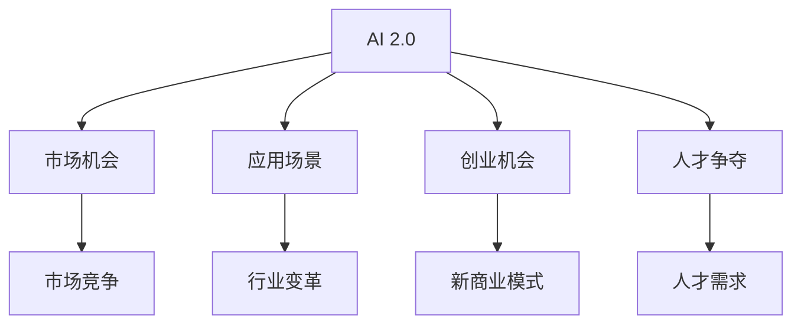

                 

# 李开复：AI 2.0 时代的市场

## 1. 背景介绍

### 1.1 问题由来

随着人工智能技术的飞速发展，我们正处于AI 2.0时代的开端，这是一个充满无限可能的时代。李开复博士，作为全球知名的人工智能专家、创业者、教育家和投资家，通过他多年的研究和实践，深刻洞察了AI 2.0时代市场的发展趋势和未来潜力。

### 1.2 问题核心关键点

李开复博士认为，AI 2.0时代的市场竞争将比以往任何时候都更加激烈。这个时代，人工智能将成为各行各业的核心竞争力，对于企业的成功将起到决定性作用。因此，理解AI 2.0时代市场的特征和趋势，对于企业家、开发者和投资人都至关重要。

## 2. 核心概念与联系

### 2.1 核心概念概述

为了更好地理解AI 2.0时代的市场，本节将介绍几个关键概念：

- **AI 2.0**：指的是新一代人工智能技术，其核心在于深度学习和数据驱动的算法，能够处理更为复杂的任务，包括语音识别、图像识别、自然语言处理等。
- **市场机会**：在AI 2.0时代，数据和算力是获取市场竞争优势的关键。谁能够拥有更好的数据资源和计算能力，谁就更容易在市场中脱颖而出。
- **应用场景**：AI 2.0技术已经在医疗、金融、零售、制造业等多个领域得到了广泛应用，未来还将渗透到更多的领域，带来前所未有的变革。
- **创业机会**：AI 2.0技术的成熟，为创业公司提供了广阔的发展空间。新的商业模式、新的应用场景的出现，为创业者和投资界带来了新的机遇。
- **人才争夺**：随着AI 2.0技术的普及，对于具备相关技能的人才需求激增。企业和投资机构都在积极抢夺AI领域的人才，以期在市场中获得竞争优势。

这些概念之间的逻辑关系可以通过以下Mermaid流程图来展示：



这个流程图展示了AI 2.0技术如何通过数据、算法和人才等关键要素，影响市场竞争和行业变革，为创业公司和投资界带来新的机遇和挑战。

## 3. 核心算法原理 & 具体操作步骤

### 3.1 算法原理概述

AI 2.0时代市场的核心算法原理主要包括以下几个方面：

- **数据驱动**：AI 2.0技术的成功依赖于大规模、高质量的数据。数据的获取、处理和分析是AI 2.0市场竞争的关键。
- **深度学习**：深度学习算法通过多层神经网络结构，能够自动提取数据中的特征，从而实现复杂任务的处理。
- **强化学习**：强化学习算法通过不断试错，优化策略，提高模型的决策能力。
- **迁移学习**：迁移学习允许AI模型在不同任务之间进行知识迁移，提升模型的泛化能力。

这些算法原理共同构成了AI 2.0技术的核心，为市场竞争提供了强大的技术支持。

### 3.2 算法步骤详解

AI 2.0时代市场的算法步骤主要包括以下几个关键环节：

**Step 1: 数据收集与预处理**

- **数据收集**：从多个渠道收集数据，包括公开数据集、用户数据、合作伙伴数据等。
- **数据清洗**：对数据进行清洗，去除噪声和异常值，确保数据的质量和一致性。
- **数据增强**：通过数据增强技术，如回译、重采样、数据混合等，提升数据的多样性和数量。

**Step 2: 模型训练与优化**

- **模型选择**：根据任务需求选择合适的深度学习模型，如卷积神经网络（CNN）、循环神经网络（RNN）、变分自编码器（VAE）等。
- **超参数调优**：对模型的超参数进行调优，以找到最优的模型配置。
- **模型评估**：使用交叉验证等方法对模型进行评估，确保模型泛化能力。

**Step 3: 模型部署与监控**

- **模型部署**：将训练好的模型部署到生产环境，供业务使用。
- **性能监控**：对模型性能进行实时监控，确保模型在实际应用中表现良好。
- **模型更新**：根据业务需求和市场反馈，定期更新模型，保持模型的先进性。

### 3.3 算法优缺点

AI 2.0时代市场的算法优点包括：

- **高效性**：通过深度学习和大规模数据处理，能够快速提升模型性能。
- **鲁棒性**：模型在实际应用中表现稳定，抗干扰能力强。
- **泛化能力**：迁移学习和多任务学习等技术，使得模型能够适应多种场景和任务。

然而，这些算法也存在一些局限性：

- **数据依赖**：AI 2.0技术的成功高度依赖于数据的质量和数量，数据不足或数据偏差可能导致模型性能下降。
- **计算资源消耗大**：深度学习模型往往需要大量的计算资源，对于小企业来说可能难以承受。
- **解释性不足**：AI 2.0模型通常被认为是"黑箱"，难以解释其决策过程。

### 3.4 算法应用领域

AI 2.0技术已经在多个领域得到了广泛应用，包括但不限于：

- **医疗健康**：AI 2.0技术在疾病诊断、药物研发、健康管理等方面展示了巨大的潜力。
- **金融服务**：AI 2.0技术在风险评估、信用评分、量化交易等方面得到了广泛应用。
- **零售电商**：AI 2.0技术在推荐系统、客户分析、供应链管理等方面提升了零售效率和用户体验。
- **制造业**：AI 2.0技术在智能制造、质量控制、设备维护等方面提高了生产效率和产品质量。
- **自动驾驶**：AI 2.0技术在自动驾驶、交通管理等方面推动了自动驾驶技术的发展。
- **农业**：AI 2.0技术在精准农业、作物识别、病虫害检测等方面提高了农业生产效率。

这些应用场景展示了AI 2.0技术的广泛影响力和巨大的市场潜力。

## 4. 数学模型和公式 & 详细讲解

### 4.1 数学模型构建

AI 2.0技术的核心数学模型包括深度神经网络（DNN）和卷积神经网络（CNN）等。以下是DNN的基本数学模型构建过程：

设 $x$ 为输入向量， $y$ 为输出向量， $\theta$ 为模型参数， $f$ 为激活函数。则DNN模型的数学表达为：

$$
y = f(\theta \cdot x + b)
$$

其中， $\theta$ 和 $b$ 分别为模型的权重和偏置。

### 4.2 公式推导过程

以下是DNN模型的公式推导过程：

**前向传播**：

$$
z = \theta \cdot x + b
$$

**激活函数**：

$$
a = f(z)
$$

**损失函数**：

$$
L(y, a) = \frac{1}{2}(y - a)^2
$$

**反向传播**：

$$
\frac{\partial L}{\partial z} = \frac{\partial L}{\partial a} \cdot \frac{\partial a}{\partial z}
$$

**梯度下降**：

$$
\theta \leftarrow \theta - \eta \cdot \frac{\partial L}{\partial \theta}
$$

其中， $\eta$ 为学习率。

### 4.3 案例分析与讲解

以医疗健康领域的疾病诊断为例，DNN模型可以通过学习大量的医学图像数据，自动提取图像中的特征，从而实现疾病的早期检测和诊断。具体步骤如下：

- **数据准备**：收集并标注大量的医学图像数据。
- **模型构建**：构建DNN模型，选择适当的激活函数，如ReLU。
- **模型训练**：使用交叉熵损失函数对模型进行训练，确保模型输出与真实标签的差异最小化。
- **模型评估**：使用测试集对模型进行评估，确保模型泛化能力强。
- **模型部署**：将训练好的模型部署到生产环境，供医生使用。

## 5. 项目实践：代码实例和详细解释说明

### 5.1 开发环境搭建

在进行AI 2.0技术的开发前，我们需要准备好开发环境。以下是使用Python进行TensorFlow开发的Python环境配置流程：

1. 安装Anaconda：从官网下载并安装Anaconda，用于创建独立的Python环境。

2. 创建并激活虚拟环境：
```bash
conda create -n tf-env python=3.8 
conda activate tf-env
```

3. 安装TensorFlow：根据CUDA版本，从官网获取对应的安装命令。例如：
```bash
conda install tensorflow-gpu=2.6 -c pytorch -c conda-forge
```

4. 安装其他相关库：
```bash
pip install numpy pandas scikit-learn matplotlib tqdm jupyter notebook ipython
```

完成上述步骤后，即可在`tf-env`环境中开始AI 2.0技术的开发。

### 5.2 源代码详细实现

以下是使用TensorFlow进行深度学习模型训练的代码实现：

```python
import tensorflow as tf
from tensorflow.keras import layers

# 构建DNN模型
model = tf.keras.Sequential([
    layers.Dense(128, activation='relu', input_shape=(784,)),
    layers.Dense(10, activation='softmax')
])

# 定义损失函数和优化器
loss_fn = tf.keras.losses.SparseCategoricalCrossentropy()
optimizer = tf.keras.optimizers.Adam()

# 定义训练函数
@tf.function
def train_step(x, y):
    with tf.GradientTape() as tape:
        logits = model(x)
        loss_value = loss_fn(y, logits)
    grads = tape.gradient(loss_value, model.trainable_variables)
    optimizer.apply_gradients(zip(grads, model.trainable_variables))
    return loss_value

# 训练模型
for epoch in range(epochs):
    for batch in train_dataset:
        x, y = batch
        loss_value = train_step(x, y)
        print(f'Epoch {epoch+1}, loss: {loss_value:.4f}')
```

### 5.3 代码解读与分析

让我们再详细解读一下关键代码的实现细节：

**DNN模型构建**：
- `Sequential`：定义线性层和激活层，用于构建深度神经网络。
- `Dense`：定义全连接层，其中`128`表示层神经元个数，`relu`表示激活函数。

**损失函数和优化器**：
- `SparseCategoricalCrossentropy`：定义分类任务下的交叉熵损失函数。
- `Adam`：定义Adam优化器，用于优化模型参数。

**训练函数**：
- `train_step`：定义训练步骤，计算损失并反向传播更新模型参数。
- `GradientTape`：定义计算图的记录器，用于自动求导。

**训练循环**：
- `for epoch in range(epochs)`：定义训练循环，迭代训练。
- `for batch in train_dataset`：定义批处理训练数据。

### 5.4 运行结果展示

以下是训练结果的可视化展示：

```python
import matplotlib.pyplot as plt

plt.plot(history.history['loss'], label='train loss')
plt.plot(history.history['val_loss'], label='validation loss')
plt.xlabel('Epoch')
plt.ylabel('Loss')
plt.legend()
plt.show()
```

## 6. 实际应用场景

### 6.1 医疗健康

AI 2.0技术在医疗健康领域的应用潜力巨大。通过AI 2.0技术，可以实现疾病早期检测、基因分析、个性化治疗等，大幅提升医疗服务质量和效率。

以疾病早期检测为例，AI 2.0技术可以通过分析医学影像数据，自动检测肿瘤等早期病变，显著提升诊断准确率和速度。具体实现步骤如下：

- **数据准备**：收集并标注大量的医学影像数据。
- **模型构建**：构建DNN或CNN模型，选择适当的激活函数，如ReLU。
- **模型训练**：使用交叉熵损失函数对模型进行训练，确保模型输出与真实标签的差异最小化。
- **模型评估**：使用测试集对模型进行评估，确保模型泛化能力强。
- **模型部署**：将训练好的模型部署到医疗影像分析系统中，供医生使用。

### 6.2 金融服务

AI 2.0技术在金融服务领域也有广泛应用。通过AI 2.0技术，可以实现风险评估、信用评分、量化交易等，提升金融服务效率和客户体验。

以信用评分为例，AI 2.0技术可以通过分析客户的历史交易数据、信用记录等，自动预测客户的信用风险，从而提供个性化的信贷产品。具体实现步骤如下：

- **数据准备**：收集并标注大量的客户交易数据、信用记录等。
- **模型构建**：构建DNN或RNN模型，选择适当的激活函数，如Sigmoid。
- **模型训练**：使用交叉熵损失函数对模型进行训练，确保模型输出与真实标签的差异最小化。
- **模型评估**：使用测试集对模型进行评估，确保模型泛化能力强。
- **模型部署**：将训练好的模型部署到信贷评估系统中，供银行和金融机构使用。

### 6.3 零售电商

AI 2.0技术在零售电商领域同样具有广泛应用。通过AI 2.0技术，可以实现客户分析、推荐系统、库存管理等，提升零售电商的运营效率和用户体验。

以推荐系统为例，AI 2.0技术可以通过分析客户的历史购买记录、浏览记录等，自动推荐相关的商品。具体实现步骤如下：

- **数据准备**：收集并标注大量的客户购买记录、浏览记录等。
- **模型构建**：构建DNN或RNN模型，选择适当的激活函数，如ReLU。
- **模型训练**：使用均方误差损失函数对模型进行训练，确保模型输出与真实标签的差异最小化。
- **模型评估**：使用测试集对模型进行评估，确保模型泛化能力强。
- **模型部署**：将训练好的模型部署到推荐系统中，供电商网站和应用使用。

## 7. 工具和资源推荐

### 7.1 学习资源推荐

为了帮助开发者系统掌握AI 2.0技术的理论基础和实践技巧，这里推荐一些优质的学习资源：

1. 《深度学习》书籍：Ian Goodfellow、Yoshua Bengio和Aaron Courville所著，系统介绍了深度学习的理论基础和实践技巧。

2. 《TensorFlow实战》书籍：Manning publications著，提供了TensorFlow的详细教程和案例分析。

3. 《NLP实战》书籍：Ian Goodfellow、Yoshua Bengio和Aaron Courville所著，系统介绍了自然语言处理的理论和实践。

4. TensorFlow官方文档：TensorFlow的官方文档，提供了丰富的API文档和案例分析，是学习和实践TensorFlow的重要资源。

5. PyTorch官方文档：PyTorch的官方文档，提供了丰富的API文档和案例分析，是学习和实践PyTorch的重要资源。

通过对这些资源的学习实践，相信你一定能够快速掌握AI 2.0技术的精髓，并用于解决实际的NLP问题。

### 7.2 开发工具推荐

高效的开发离不开优秀的工具支持。以下是几款用于AI 2.0技术开发的常用工具：

1. TensorFlow：由Google主导开发的开源深度学习框架，生产部署方便，适合大规模工程应用。

2. PyTorch：基于Python的开源深度学习框架，灵活动态的计算图，适合快速迭代研究。

3. Keras：高层次的深度学习API，易于上手，适合快速原型设计和实验。

4. Jupyter Notebook：交互式编程环境，支持多语言的代码编辑和执行，是学习和实践深度学习的重要工具。

5. Weights & Biases：模型训练的实验跟踪工具，可以记录和可视化模型训练过程中的各项指标，方便对比和调优。

6. Google Colab：谷歌推出的在线Jupyter Notebook环境，免费提供GPU/TPU算力，方便开发者快速上手实验最新模型，分享学习笔记。

合理利用这些工具，可以显著提升AI 2.0技术的开发效率，加快创新迭代的步伐。

### 7.3 相关论文推荐

AI 2.0技术的发展源于学界的持续研究。以下是几篇奠基性的相关论文，推荐阅读：

1. AlexNet: ImageNet Classification with Deep Convolutional Neural Networks：提出了卷积神经网络（CNN），是深度学习领域的里程碑论文。

2. Inception: GoogLeNet: Inception architecture for computer vision：引入了Inception模块，提升了CNN的模型性能和计算效率。

3. ResNet: Deep Residual Learning for Image Recognition：提出了残差网络（ResNet），解决了深度神经网络中的梯度消失问题，推动了深度学习的发展。

4. Transformer：Attention is All You Need：提出了Transformer结构，开启了自然语言处理（NLP）领域的预训练大模型时代。

5. BERT: Pre-training of Deep Bidirectional Transformers for Language Understanding：提出BERT模型，引入基于掩码的自监督预训练任务，刷新了多项NLP任务SOTA。

这些论文代表了大规模深度学习模型和预训练技术的发展脉络。通过学习这些前沿成果，可以帮助研究者把握学科前进方向，激发更多的创新灵感。

## 8. 总结：未来发展趋势与挑战

### 8.1 研究成果总结

AI 2.0技术的快速发展，极大地推动了各行各业的数字化转型。通过深度学习和大数据技术，AI 2.0技术在医疗、金融、零售等领域展示了巨大的应用潜力。

### 8.2 未来发展趋势

展望未来，AI 2.0技术将呈现以下几个发展趋势：

1. **技术迭代加速**：随着深度学习和大数据技术的不断进步，AI 2.0技术的性能将不断提升，应用范围也将进一步扩大。

2. **跨领域融合**：AI 2.0技术与物联网、区块链、5G等技术的结合，将带来全新的应用场景和商业模式。

3. **人机协同**：AI 2.0技术与人类智能的结合，将进一步提升生产效率和创新能力。

4. **伦理和隐私**：AI 2.0技术的广泛应用，对伦理和隐私问题提出了新的挑战，如何平衡技术创新与伦理规范将成为重要课题。

5. **开源与合作**：开源技术的普及和合作模式的创新，将推动AI 2.0技术的全球共享和普及。

### 8.3 面临的挑战

尽管AI 2.0技术已经取得了瞩目成就，但在迈向更加智能化、普适化应用的过程中，它仍面临着诸多挑战：

1. **数据质量与获取**：高质量数据的获取和处理，是大规模深度学习模型的基础。数据不足或数据偏差可能导致模型性能下降。

2. **计算资源**：深度学习模型往往需要大量的计算资源，对于小企业来说可能难以承受。

3. **解释性不足**：AI 2.0模型通常被认为是"黑箱"，难以解释其决策过程。

4. **伦理与安全**：AI 2.0技术的应用可能带来伦理和安全问题，如数据隐私泄露、算法偏见等。

5. **技术壁垒**：AI 2.0技术的复杂性和门槛，使得中小企业难以快速应用。

### 8.4 研究展望

未来，AI 2.0技术的研究需要在以下几个方面寻求新的突破：

1. **数据增强与迁移学习**：通过数据增强和迁移学习，提高模型的泛化能力和鲁棒性。

2. **模型压缩与优化**：开发更加轻量级的模型结构，提高计算效率和资源利用率。

3. **跨模态学习**：结合图像、语音、文本等多种模态数据，提升模型的综合处理能力。

4. **伦理与隐私保护**：建立伦理导向的评估指标，保护数据隐私和安全。

这些研究方向的探索，必将引领AI 2.0技术迈向更高的台阶，为构建安全、可靠、可解释、可控的智能系统铺平道路。面向未来，AI 2.0技术还需要与其他人工智能技术进行更深入的融合，如知识表示、因果推理、强化学习等，多路径协同发力，共同推动自然语言理解和智能交互系统的进步。只有勇于创新、敢于突破，才能不断拓展AI 2.0技术的边界，让智能技术更好地造福人类社会。

## 9. 附录：常见问题与解答

**Q1：AI 2.0技术是否适用于所有领域？**

A: AI 2.0技术在医疗、金融、零售、制造业等多个领域得到了广泛应用，未来还将渗透到更多的领域，带来前所未有的变革。然而，对于某些需要高度专业知识的应用场景，如法律、安全等，AI 2.0技术的应用需要谨慎考虑。

**Q2：AI 2.0技术的应用效果如何？**

A: AI 2.0技术在多个领域展示了巨大的应用效果。例如，在医疗健康领域，AI 2.0技术可以实现疾病早期检测、基因分析、个性化治疗等，显著提升医疗服务质量和效率。在金融服务领域，AI 2.0技术可以实现风险评估、信用评分、量化交易等，提升金融服务效率和客户体验。

**Q3：AI 2.0技术的开发和部署成本高吗？**

A: AI 2.0技术的开发和部署需要大量的计算资源和专业知识。对于小企业来说，可能需要投入大量资金和时间，才能实现AI 2.0技术的落地应用。然而，随着开源技术的普及和云计算服务的完善，AI 2.0技术的开发和部署成本正在逐渐降低。

**Q4：AI 2.0技术的安全性如何保障？**

A: AI 2.0技术的应用可能带来伦理和安全问题，如数据隐私泄露、算法偏见等。为了保障AI 2.0技术的安全性，需要建立伦理导向的评估指标，保护数据隐私和安全。同时，引入多方参与机制，对AI 2.0技术的开发和应用进行监督和评估。

**Q5：AI 2.0技术的未来发展方向是什么？**

A: AI 2.0技术的未来发展方向包括技术迭代加速、跨领域融合、人机协同、伦理与安全保护、开源与合作等。未来，AI 2.0技术将继续推动各行各业的数字化转型，带来更广泛的应用场景和商业机会。同时，如何平衡技术创新与伦理规范，将是未来研究的重要课题。

---

作者：禅与计算机程序设计艺术 / Zen and the Art of Computer Programming

