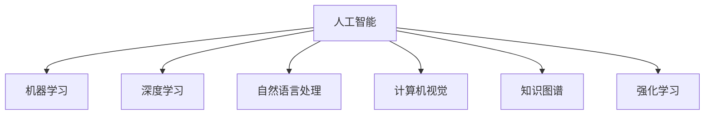

                 

# 李开复：AI 2.0 时代的未来

在人工智能（AI）迅速发展的今天，我们正迎来一个全新的时代——AI 2.0时代。这一时代，AI不仅在技术层面更为先进，更是在应用层面开始深刻改变人类的生活方式。本文将从背景介绍、核心概念与联系、核心算法原理、数学模型、项目实践、实际应用、工具与资源、总结与展望、常见问题与解答等多个方面，深入探讨AI 2.0时代的未来。

## 1. 背景介绍

### 1.1 问题由来

AI 2.0时代的到来，离不开过去几十年计算机科学领域的巨大进步。从1980年代的人工智能萌芽，到2000年后的深度学习大放异彩，再到近年来的数据科学、机器学习、自然语言处理等技术的飞速发展，AI 2.0时代应运而生。

当前，AI 2.0技术已经在自动驾驶、智能家居、医疗诊断、金融风控等多个领域得到了广泛应用。然而，随着技术的不断进步，AI 2.0也面临诸多挑战，包括模型解释性不足、数据隐私问题、伦理道德问题等。这些问题，都需要我们在未来的研究中加以解决。

### 1.2 问题核心关键点

AI 2.0时代，AI技术的核心关键点在于以下几个方面：

1. **数据驱动**：AI 2.0时代，数据成为AI模型的核心驱动，通过大量数据训练出的模型能够更好地理解人类行为和需求。
2. **深度学习**：深度学习技术使得AI模型能够自动学习复杂特征，提升模型的表现力。
3. **模型可解释性**：AI模型的可解释性是未来发展的关键，需要模型不仅能够做出正确的预测，还需要能够解释其决策过程。
4. **跨领域应用**：AI 2.0技术需要能够跨越不同领域，解决实际问题。
5. **伦理道德**：AI 2.0技术在应用过程中，需要考虑伦理道德问题，如隐私保护、数据使用、算法偏见等。

### 1.3 问题研究意义

理解AI 2.0时代的未来，对于我们把握技术发展方向、制定科学合理的AI应用策略至关重要。只有真正理解AI 2.0的核心原理和技术要点，才能在实际应用中实现技术的最大化价值。

## 2. 核心概念与联系

### 2.1 核心概念概述

为更好地理解AI 2.0时代的未来，本节将介绍几个密切相关的核心概念：

1. **人工智能（AI）**：指通过计算机系统模拟人类智能，实现信息的获取、处理、推理和决策的能力。
2. **机器学习（ML）**：指机器通过数据学习规律和知识，并应用到实际问题中。
3. **深度学习（DL）**：指利用多层神经网络进行学习和决策，适用于处理复杂的非线性问题。
4. **自然语言处理（NLP）**：指计算机理解和处理人类语言的技术。
5. **计算机视觉（CV）**：指计算机识别、处理和分析图像和视频的技术。
6. **知识图谱（KG）**：指用于描述实体间关系和知识的图结构。
7. **强化学习（RL）**：指机器通过与环境的交互，通过奖励机制学习最优策略。

这些概念之间的逻辑关系可以通过以下Mermaid流程图来展示：



这个流程图展示了几大AI核心技术之间的关系：

1. 人工智能是这些技术的总体，涵盖多个子领域。
2. 机器学习、深度学习、自然语言处理、计算机视觉、知识图谱、强化学习是人工智能的子领域，各自解决特定的技术问题。

## 3. 核心算法原理 & 具体操作步骤

### 3.1 算法原理概述

AI 2.0时代的核心算法原理，主要围绕数据驱动、模型学习、任务适配等方面展开。以下是对这些原理的详细介绍：

1. **数据驱动**：AI 2.0时代的模型训练依赖于大量高质量数据，通过数据驱动的方式，模型能够更好地理解数据规律，提升预测准确性。
2. **模型学习**：AI 2.0时代的模型学习，包括监督学习、无监督学习、强化学习等多种形式。通过学习规律和知识，模型能够更好地适应不同应用场景。
3. **任务适配**：AI 2.0时代的模型需要适配不同的应用场景，如自然语言处理、计算机视觉、知识图谱等，通过任务适配，提升模型的通用性和应用范围。

### 3.2 算法步骤详解

AI 2.0时代的算法步骤，主要包括以下几个关键步骤：

1. **数据准备**：收集高质量的数据，并将其划分为训练集、验证集和测试集。
2. **模型选择**：选择合适的算法模型，如卷积神经网络（CNN）、递归神经网络（RNN）、Transformer等。
3. **模型训练**：在训练集上使用优化算法训练模型，并使用验证集进行调参。
4. **模型评估**：在测试集上评估模型的性能，并根据评估结果进行优化。
5. **模型部署**：将训练好的模型部署到实际应用场景中，并进行实时推理和预测。

### 3.3 算法优缺点

AI 2.0时代的算法，具有以下优点：

1. **高效性**：AI 2.0算法能够通过大量数据训练出高效的模型，提升预测准确性和效率。
2. **通用性**：AI 2.0算法适用于多种应用场景，具有较强的泛化能力。
3. **可解释性**：部分AI 2.0算法能够通过可视化和解释工具，解释模型的决策过程。

同时，AI 2.0算法也存在以下缺点：

1. **数据依赖**：AI 2.0算法需要大量的高质量数据，数据获取和标注成本较高。
2. **模型复杂**：AI 2.0算法模型较为复杂，训练和推理过程耗时较长。
3. **可解释性不足**：部分AI 2.0算法模型黑箱化，难以解释其决策过程。
4. **伦理道德问题**：AI 2.0算法在应用过程中可能面临伦理道德问题，如隐私保护、算法偏见等。

### 3.4 算法应用领域

AI 2.0算法在各个领域都有广泛应用，以下是几个典型的应用场景：

1. **医疗健康**：通过图像识别、自然语言处理等技术，AI 2.0算法能够在医学影像分析、病历分析等方面发挥重要作用。
2. **金融风控**：通过数据挖掘和机器学习，AI 2.0算法能够预测信用风险、反欺诈等金融问题。
3. **智能家居**：通过计算机视觉和自然语言处理技术，AI 2.0算法能够实现智能语音助手、家居控制等功能。
4. **自动驾驶**：通过计算机视觉和强化学习技术，AI 2.0算法能够实现自动驾驶汽车。
5. **智慧城市**：通过大数据分析和机器学习，AI 2.0算法能够优化交通流量、环保管理等方面。

## 4. 数学模型和公式 & 详细讲解 & 举例说明

### 4.1 数学模型构建

AI 2.0时代的数学模型构建，主要围绕数据表示、模型学习、任务适配等方面展开。以下是对这些模型的详细介绍：

1. **数据表示**：使用向量表示法将数据转化为数值形式，方便模型处理和分析。
2. **模型学习**：使用线性回归、逻辑回归、支持向量机等模型进行学习，并通过优化算法进行参数更新。
3. **任务适配**：使用任务特定的模型适配，如卷积神经网络（CNN）用于图像识别，循环神经网络（RNN）用于时间序列预测。

### 4.2 公式推导过程

以下是一个简单的线性回归模型公式推导过程：

设 $y$ 为输出变量，$x$ 为输入变量，$w$ 为权重向量，$b$ 为偏置项，则线性回归模型的目标为最小化均方误差（Mean Squared Error, MSE）：

$$
\text{MSE} = \frac{1}{N}\sum_{i=1}^N(y_i - f(x_i;w,b))^2
$$

其中 $f(x;w,b) = w^Tx + b$ 为线性函数。

根据梯度下降算法，模型参数的更新公式为：

$$
w \leftarrow w - \alpha \nabla_{w}\text{MSE}, b \leftarrow b - \alpha \nabla_{b}\text{MSE}
$$

其中 $\alpha$ 为学习率。

### 4.3 案例分析与讲解

以自然语言处理（NLP）为例，分析AI 2.0时代中深度学习模型的应用：

1. **词嵌入**：使用Word2Vec、GloVe等模型将单词转化为向量形式，方便模型进行处理。
2. **循环神经网络（RNN）**：使用RNN进行序列预测，如文本生成、机器翻译等任务。
3. **卷积神经网络（CNN）**：使用CNN进行文本分类和情感分析等任务。

## 5. 项目实践：代码实例和详细解释说明

### 5.1 开发环境搭建

在进行AI 2.0项目实践前，我们需要准备好开发环境。以下是使用Python进行TensorFlow开发的环境配置流程：

1. 安装Anaconda：从官网下载并安装Anaconda，用于创建独立的Python环境。

2. 创建并激活虚拟环境：
```bash
conda create -n tf-env python=3.8 
conda activate tf-env
```

3. 安装TensorFlow：根据CUDA版本，从官网获取对应的安装命令。例如：
```bash
conda install tensorflow-gpu=2.6
```

4. 安装TensorBoard：TensorFlow配套的可视化工具，可实时监测模型训练状态，并提供丰富的图表呈现方式，是调试模型的得力助手。

5. 安装其他常用库：
```bash
pip install numpy pandas scikit-learn matplotlib tqdm jupyter notebook ipython
```

完成上述步骤后，即可在`tf-env`环境中开始AI 2.0项目实践。

### 5.2 源代码详细实现

这里我们以图像分类任务为例，给出使用TensorFlow对卷积神经网络（CNN）进行图像分类的PyTorch代码实现。

首先，定义模型结构：

```python
import tensorflow as tf
from tensorflow.keras import layers

class CNNModel(tf.keras.Model):
    def __init__(self, num_classes):
        super(CNNModel, self).__init__()
        self.conv1 = layers.Conv2D(32, (3, 3), activation='relu')
        self.pool1 = layers.MaxPooling2D((2, 2))
        self.conv2 = layers.Conv2D(64, (3, 3), activation='relu')
        self.pool2 = layers.MaxPooling2D((2, 2))
        self.flatten = layers.Flatten()
        self.dense1 = layers.Dense(128, activation='relu')
        self.dense2 = layers.Dense(num_classes, activation='softmax')
        
    def call(self, x):
        x = self.conv1(x)
        x = self.pool1(x)
        x = self.conv2(x)
        x = self.pool2(x)
        x = self.flatten(x)
        x = self.dense1(x)
        x = self.dense2(x)
        return x
```

然后，定义数据集和优化器：

```python
import numpy as np
import os

(train_images, train_labels), (test_images, test_labels) = tf.keras.datasets.cifar10.load_data()

train_images = train_images / 255.0
test_images = test_images / 255.0

train_images = np.expand_dims(train_images, axis=3)
test_images = np.expand_dims(test_images, axis=3)

model = CNNModel(num_classes=10)
optimizer = tf.keras.optimizers.Adam(learning_rate=0.001)
```

接着，定义训练和评估函数：

```python
@tf.function
def train_step(images, labels):
    with tf.GradientTape() as tape:
        logits = model(images)
        loss = tf.keras.losses.sparse_categorical_crossentropy(labels, logits)
    gradients = tape.gradient(loss, model.trainable_variables)
    optimizer.apply_gradients(zip(gradients, model.trainable_variables))

@tf.function
def evaluate_step(images, labels):
    logits = model(images)
    accuracy = tf.keras.metrics.sparse_categorical_accuracy(labels, tf.argmax(logits, axis=1))
    return accuracy
```

最后，启动训练流程并在测试集上评估：

```python
epochs = 10
batch_size = 64

for epoch in range(epochs):
    for batch in train_dataset:
        train_step(batch[0], batch[1])
    
    eval_accuracy = evaluate_step(test_images, test_labels)
    print(f"Epoch {epoch+1}, test accuracy: {eval_accuracy.numpy():.4f}")
```

以上就是使用TensorFlow对CNN进行图像分类的完整代码实现。可以看到，TensorFlow提供了丰富的API和工具，使得模型训练和推理变得简洁高效。

### 5.3 代码解读与分析

让我们再详细解读一下关键代码的实现细节：

**CNNModel类**：
- `__init__`方法：初始化卷积层、池化层、全连接层等组件，并定义模型结构。
- `call`方法：前向传播计算模型的输出。

**数据集定义**：
- 使用`tf.keras.datasets.cifar10.load_data()`加载CIFAR-10数据集，并进行归一化处理。
- 将数据维度扩展到4维张量，方便卷积操作。

**优化器定义**：
- 使用Adam优化器，学习率为0.001。

**训练和评估函数**：
- `train_step`函数：计算模型的损失和梯度，并使用优化器更新模型参数。
- `evaluate_step`函数：计算模型在测试集上的准确率。

**训练流程**：
- 定义总的epoch数和batch size，开始循环迭代
- 每个epoch内，在训练集上训练
- 在测试集上评估，输出准确率

可以看到，TensorFlow提供的高效API和工具，使得AI 2.0项目的开发和部署变得简单快捷。开发者可以将更多精力放在模型设计、数据处理等核心任务上，而不必过多关注底层实现细节。

当然，工业级的系统实现还需考虑更多因素，如模型的保存和部署、超参数的自动搜索、更灵活的任务适配层等。但核心的AI 2.0算法基本与此类似。

## 6. 实际应用场景

### 6.1 智能客服系统

AI 2.0时代的智能客服系统，可以通过AI 2.0技术实现自动化客服，提高客户满意度和服务效率。

具体而言，可以收集企业内部的历史客服对话记录，将问题和最佳答复构建成监督数据，在此基础上对预训练模型进行微调。微调后的模型能够自动理解用户意图，匹配最合适的答案模板进行回复。对于客户提出的新问题，还可以接入检索系统实时搜索相关内容，动态组织生成回答。如此构建的智能客服系统，能大幅提升客户咨询体验和问题解决效率。

### 6.2 金融舆情监测

AI 2.0时代的金融舆情监测，可以通过AI 2.0技术实现实时舆情分析，规避金融风险。

具体而言，可以收集金融领域相关的新闻、报道、评论等文本数据，并对其进行主题标注和情感标注。在此基础上对预训练语言模型进行微调，使其能够自动判断文本属于何种主题，情感倾向是正面、中性还是负面。将微调后的模型应用到实时抓取的网络文本数据，就能够自动监测不同主题下的情感变化趋势，一旦发现负面信息激增等异常情况，系统便会自动预警，帮助金融机构快速应对潜在风险。

### 6.3 个性化推荐系统

AI 2.0时代的个性化推荐系统，可以通过AI 2.0技术实现更精准、多样的推荐内容。

具体而言，可以收集用户浏览、点击、评论、分享等行为数据，提取和用户交互的物品标题、描述、标签等文本内容。将文本内容作为模型输入，用户的后续行为（如是否点击、购买等）作为监督信号，在此基础上微调预训练语言模型。微调后的模型能够从文本内容中准确把握用户的兴趣点。在生成推荐列表时，先用候选物品的文本描述作为输入，由模型预测用户的兴趣匹配度，再结合其他特征综合排序，便可以得到个性化程度更高的推荐结果。

### 6.4 未来应用展望

随着AI 2.0技术的不断发展，未来将在更多领域得到应用，为传统行业带来变革性影响。

在智慧医疗领域，AI 2.0技术可以用于医学影像分析、病历分析、药物研发等，提升医疗服务的智能化水平，辅助医生诊疗，加速新药开发进程。

在智能教育领域，AI 2.0技术可应用于作业批改、学情分析、知识推荐等方面，因材施教，促进教育公平，提高教学质量。

在智慧城市治理中，AI 2.0技术可以用于城市事件监测、舆情分析、应急指挥等环节，提高城市管理的自动化和智能化水平，构建更安全、高效的未来城市。

此外，在企业生产、社会治理、文娱传媒等众多领域，AI 2.0技术也将不断涌现，为经济社会发展注入新的动力。

## 7. 工具和资源推荐

### 7.1 学习资源推荐

为了帮助开发者系统掌握AI 2.0的理论基础和实践技巧，这里推荐一些优质的学习资源：

1. **Deep Learning Specialization**：由Coursera开设的深度学习课程，由斯坦福大学教授Andrew Ng主讲，涵盖深度学习的各个方面。
2. **CS231n: Convolutional Neural Networks for Visual Recognition**：斯坦福大学开设的计算机视觉课程，涵盖CNN、RNN、LSTM等深度学习技术。
3. **Natural Language Processing with Python**：NLP领域的入门书籍，介绍NLP基础、文本处理、情感分析等技术。
4. **TensorFlow官方文档**：TensorFlow的官方文档，提供丰富的API和样例代码，是学习和使用TensorFlow的重要资源。
5. **Keras官方文档**：Keras的官方文档，提供简单易用的API，方便快速构建深度学习模型。

通过对这些资源的学习实践，相信你一定能够快速掌握AI 2.0的核心技术，并用于解决实际的AI问题。

### 7.2 开发工具推荐

高效的开发离不开优秀的工具支持。以下是几款用于AI 2.0开发的工具：

1. **TensorFlow**：由Google主导开发的深度学习框架，生产部署方便，适合大规模工程应用。
2. **Keras**：Google开发的高级API，基于TensorFlow构建，简单易用。
3. **PyTorch**：由Facebook开发的深度学习框架，灵活高效，适合学术研究和创新应用。
4. **Jupyter Notebook**：支持Python编程的交互式开发环境，适合数据分析和模型实验。
5. **Colab**：Google提供的Jupyter Notebook云端环境，免费使用，方便进行大规模实验。

合理利用这些工具，可以显著提升AI 2.0项目的开发效率，加快创新迭代的步伐。

### 7.3 相关论文推荐

AI 2.0技术的发展源于学界的持续研究。以下是几篇奠基性的相关论文，推荐阅读：

1. **ImageNet Classification with Deep Convolutional Neural Networks**：AlexNet论文，介绍卷积神经网络在图像分类任务中的应用。
2. **Google's Neural Machine Translation System**：Google的机器翻译系统，介绍神经机器翻译技术。
3. **Deep Learning with Gaussian Processes**：使用高斯过程进行深度学习，介绍深度学习在时间序列预测中的应用。
4. **Attention Is All You Need**：Transformer论文，介绍自注意力机制在NLP中的应用。
5. **BERT: Pre-training of Deep Bidirectional Transformers for Language Understanding**：BERT论文，介绍预训练语言模型在NLP中的应用。

这些论文代表了大规模深度学习技术的发展脉络，通过学习这些前沿成果，可以帮助研究者把握学科前进方向，激发更多的创新灵感。

## 8. 总结：未来发展趋势与挑战

### 8.1 总结

本文对AI 2.0时代的未来进行了全面系统的探讨。首先阐述了AI 2.0时代的技术背景和发展方向，明确了AI 2.0技术的核心原理和应用场景。其次，从原理到实践，详细讲解了AI 2.0算法的构建和应用流程，给出了AI 2.0项目开发的完整代码实例。同时，本文还广泛探讨了AI 2.0技术在各个领域的应用前景，展示了AI 2.0技术的巨大潜力。最后，本文精选了AI 2.0技术的各类学习资源，力求为读者提供全方位的技术指引。

通过本文的系统梳理，可以看到，AI 2.0技术正在成为AI领域的重要范式，极大地拓展了深度学习模型的应用边界，催生了更多的落地场景。受益于大规模深度学习模型的强大性能，AI 2.0技术必将在更多领域得到应用，为传统行业带来变革性影响。

### 8.2 未来发展趋势

展望未来，AI 2.0技术将呈现以下几个发展趋势：

1. **深度学习框架的升级**：未来的深度学习框架将更加高效、灵活、易用，支持更多的AI应用场景。
2. **跨模态AI技术的发展**：未来的AI技术将融合视觉、语音、自然语言等多种模态，实现更全面、多维度的信息整合。
3. **AI伦理道德的强化**：未来的AI技术将更加注重伦理道德问题，建立更为严格的监管机制，保障数据安全和模型公正性。
4. **自动化和增强学习的应用**：未来的AI技术将更多地应用于自动化和增强学习，提高效率和效果。
5. **AI与大数据的融合**：未来的AI技术将更加依赖大数据，通过大数据分析提升AI模型的表现力。

以上趋势凸显了AI 2.0技术的广阔前景。这些方向的探索发展，必将进一步提升AI 2.0技术的性能和应用范围，为人类认知智能的进化带来深远影响。

### 8.3 面临的挑战

尽管AI 2.0技术已经取得了瞩目成就，但在迈向更加智能化、普适化应用的过程中，它仍面临着诸多挑战：

1. **数据依赖**：AI 2.0算法需要大量的高质量数据，数据获取和标注成本较高。
2. **模型复杂性**：AI 2.0算法模型较为复杂，训练和推理过程耗时较长。
3. **可解释性不足**：部分AI 2.0算法模型黑箱化，难以解释其决策过程。
4. **伦理道德问题**：AI 2.0算法在应用过程中可能面临伦理道德问题，如隐私保护、算法偏见等。
5. **硬件资源限制**：AI 2.0算法需要高性能的计算资源，大规模模型和数据集的训练和推理需要大量计算资源。

正视AI 2.0面临的这些挑战，积极应对并寻求突破，将是大规模深度学习技术走向成熟的必由之路。相信随着学界和产业界的共同努力，这些挑战终将一一被克服，AI 2.0技术必将在构建人机协同的智能时代中扮演越来越重要的角色。

### 8.4 研究展望

面对AI 2.0技术所面临的种种挑战，未来的研究需要在以下几个方面寻求新的突破：

1. **探索无监督和半监督学习**：摆脱对大规模标注数据的依赖，利用自监督学习、主动学习等无监督和半监督范式，最大限度利用非结构化数据，实现更加灵活高效的AI 2.0模型。
2. **研究参数高效和计算高效模型**：开发更加参数高效和计算高效的AI 2.0模型，在固定大部分预训练参数的同时，只更新极少量的任务相关参数，减小计算资源消耗。
3. **引入更多先验知识**：将符号化的先验知识，如知识图谱、逻辑规则等，与神经网络模型进行巧妙融合，引导AI 2.0模型学习更准确、合理的知识。
4. **结合因果分析和博弈论工具**：将因果分析方法引入AI 2.0模型，识别出模型决策的关键特征，增强输出解释的因果性和逻辑性，借助博弈论工具刻画人机交互过程，主动探索并规避模型的脆弱点，提高系统稳定性。
5. **纳入伦理道德约束**：在AI 2.0模型训练目标中引入伦理导向的评估指标，过滤和惩罚有偏见、有害的输出倾向，加强人工干预和审核，建立模型行为的监管机制，确保输出符合人类价值观和伦理道德。

这些研究方向的探索，必将引领AI 2.0技术迈向更高的台阶，为构建安全、可靠、可解释、可控的智能系统铺平道路。面向未来，AI 2.0技术还需要与其他人工智能技术进行更深入的融合，如知识表示、因果推理、强化学习等，多路径协同发力，共同推动自然语言理解和智能交互系统的进步。只有勇于创新、敢于突破，才能不断拓展深度学习模型的边界，让智能技术更好地造福人类社会。

## 9. 附录：常见问题与解答

**Q1：AI 2.0是否适用于所有NLP任务？**

A: AI 2.0在大多数NLP任务上都能取得不错的效果，特别是对于数据量较小的任务。但对于一些特定领域的任务，如医学、法律等，仅仅依靠通用语料预训练的模型可能难以很好地适应。此时需要在特定领域语料上进一步预训练，再进行微调，才能获得理想效果。此外，对于一些需要时效性、个性化很强的任务，如对话、推荐等，AI 2.0方法也需要针对性的改进优化。

**Q2：AI 2.0模型在落地部署时需要注意哪些问题？**

A: 将AI 2.0模型转化为实际应用，还需要考虑以下因素：
1. **模型裁剪**：去除不必要的层和参数，减小模型尺寸，加快推理速度。
2. **量化加速**：将浮点模型转为定点模型，压缩存储空间，提高计算效率。
3. **服务化封装**：将模型封装为标准化服务接口，便于集成调用。
4. **弹性伸缩**：根据请求流量动态调整资源配置，平衡服务质量和成本。
5. **监控告警**：实时采集系统指标，设置异常告警阈值，确保服务稳定性。
6. **安全防护**：采用访问鉴权、数据脱敏等措施，保障数据和模型安全。

**Q3：AI 2.0算法存在哪些资源瓶颈？**

A: 目前主流的预训练大模型动辄以亿计的参数规模，对算力、内存、存储都提出了很高的要求。GPU/TPU等高性能设备是必不可少的，但即便如此，超大批次的训练和推理也可能遇到显存不足的问题。因此需要采用一些资源优化技术，如梯度积累、混合精度训练、模型并行等，来突破硬件瓶颈。同时，模型的存储和读取也可能占用大量时间和空间，需要采用模型压缩、稀疏化存储等方法进行优化。

**Q4：如何缓解AI 2.0模型训练过程中的过拟合问题？**

A: 过拟合是AI 2.0模型训练面临的主要挑战，尤其是在标注数据不足的情况下。常见的缓解策略包括：
1. **数据增强**：通过回译、近义替换等方式扩充训练集。
2. **正则化**：使用L2正则、Dropout、Early Stopping等避免过拟合。
3. **对抗训练**：引入对抗样本，提高模型鲁棒性。
4. **参数高效模型**：使用Adapter等参数高效模型，在固定大部分预训练参数的同时，只更新极少量的任务相关参数，减小过拟合风险。

这些策略往往需要根据具体任务和数据特点进行灵活组合。只有在数据、模型、训练、推理等各环节进行全面优化，才能最大限度地发挥AI 2.0模型的威力。

**Q5：AI 2.0算法在应用过程中需要注意哪些伦理道德问题？**

A: AI 2.0算法在应用过程中可能面临以下伦理道德问题：
1. **数据隐私**：在收集和使用数据时，需要确保用户隐私得到保护，遵循相关法律法规。
2. **算法偏见**：AI 2.0算法可能学习到数据中的偏见，导致输出结果有偏见。
3. **透明度和可解释性**：AI 2.0算法的决策过程需要透明可解释，便于用户理解和信任。
4. **安全性和可靠性**：AI 2.0算法需要保证系统安全稳定，避免出现故障或误判。
5. **伦理约束**：AI 2.0算法的应用需要符合伦理道德标准，避免有害行为。

AI 2.0算法的伦理道德问题需要引起重视，从数据采集、模型训练、应用部署等多个环节进行全面考量，确保算法的公正性、透明度和安全可靠性。

---

作者：禅与计算机程序设计艺术 / Zen and the Art of Computer Programming

