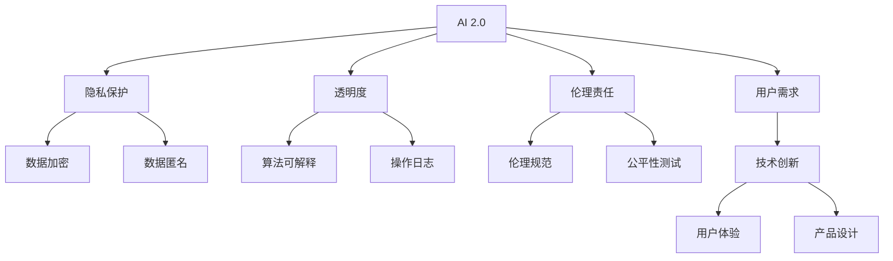

                 

## 1. 背景介绍

在AI 2.0时代，人工智能技术已经从少数专家掌握的领域走进了普通大众的生活。机器学习、深度学习、自然语言处理等技术的迅速发展，使得AI能够从视觉、听觉、语言等多个方面理解和处理人类信息，进入了千家万户。人们在与AI的交互中，不仅体验到了前所未有的便利，也逐渐意识到AI在生活中的重要作用。

### 1.1 问题由来

随着AI技术的不断进步，越来越多的AI产品和服务被引入到日常生活中。从智能音箱、智能手表到智能家居，AI的触角已经渗透到生活的方方面面。但随之而来的是，对于AI产品的使用，人们也面临诸多困惑和挑战。

1. **隐私问题**：在享受AI带来的便利的同时，人们也担心自己的隐私数据会被滥用或泄露。
2. **技术理解**：对于大部分人来说，AI技术仍然是一门高深的学问，对AI的工作原理和运作机制存在误解。
3. **伦理道德**：随着AI的普及，如何确保AI系统遵守伦理道德规范，避免偏见和歧视，也成为一个重要的问题。

### 1.2 问题核心关键点

为了解决上述问题，我们需要对AI 2.0时代的用户进行深入分析，了解他们的需求、痛点和使用习惯，从而提供更加符合用户期望的AI产品和解决方案。核心关键点包括：

1. **隐私保护**：如何在提供服务的同时，保护用户的隐私数据，避免数据滥用和泄露。
2. **透明度**：如何让AI的工作过程透明化，让用户了解AI的决策依据和运作机制。
3. **伦理责任**：如何在AI系统中引入伦理机制，确保AI系统的决策公正、透明，避免偏见和歧视。

## 2. 核心概念与联系

### 2.1 核心概念概述

在AI 2.0时代，用户与AI的交互变得更加直接和频繁。为了更好地理解用户，我们需要明确以下几个核心概念：

- **AI 2.0**：指新一代人工智能技术，通过大数据、深度学习和自然语言处理等技术，使AI具备更强的理解和处理人类信息的能力。
- **用户需求**：指用户在使用AI产品和服务时所期望的功能、体验和情感需求。
- **隐私保护**：指在AI系统中，保护用户个人信息和隐私，防止数据滥用和泄露的技术和措施。
- **透明度**：指AI系统的决策过程和算法设计，能够被用户理解和验证的程度。
- **伦理责任**：指在AI设计和使用中，遵循伦理规范，避免偏见和歧视，确保AI系统行为的公正性和合理性。

这些概念之间的联系紧密，用户需求驱动AI技术的创新，而AI技术的进步又反过来满足了用户的更高需求。隐私保护、透明度和伦理责任则是确保AI系统公平、透明、安全的必要条件。

### 2.2 核心概念原理和架构的 Mermaid 流程图



这个流程图展示了AI 2.0技术、用户需求与隐私保护、透明度、伦理责任等概念之间的联系。AI 2.0技术的创新和应用，是为了更好地满足用户需求，而隐私保护、透明度和伦理责任则是确保AI系统公平、透明、安全的必要条件。

## 3. 核心算法原理 & 具体操作步骤

### 3.1 算法原理概述

在AI 2.0时代，用户与AI的交互涉及多种复杂算法和数据处理技术。为了更好地理解用户，AI系统需要具备以下算法原理：

1. **机器学习**：通过分析大量数据，使AI系统具备自主学习和适应环境的能力。
2. **深度学习**：通过多层神经网络结构，使AI系统能够处理复杂的非线性关系，提高预测和决策的准确性。
3. **自然语言处理**：使AI系统能够理解和生成自然语言，进行语义分析、情感识别等任务。

这些算法原理为AI系统提供了强大的技术支持，使其能够更好地理解和满足用户需求。

### 3.2 算法步骤详解

AI 2.0时代的用户交互，涉及多个步骤，以下是详细步骤：

1. **数据收集**：通过多种传感器和接口收集用户的行为数据、语音数据、文本数据等。
2. **预处理**：对收集到的数据进行清洗、过滤、去重等预处理操作，以便后续分析和应用。
3. **特征提取**：通过机器学习算法，从数据中提取出与用户需求相关的特征。
4. **模型训练**：使用深度学习算法，训练出能够满足用户需求的AI模型。
5. **用户交互**：将训练好的模型部署到应用中，与用户进行实时交互。
6. **反馈优化**：根据用户的反馈，不断优化AI模型和算法，提高系统的性能和用户体验。

### 3.3 算法优缺点

AI 2.0技术在满足用户需求方面具有以下优点：

1. **高效便捷**：AI系统能够快速处理和分析大量数据，提供高效的解决方案。
2. **个性化服务**：通过深度学习等算法，AI系统能够针对用户需求提供个性化的服务。
3. **跨领域应用**：AI技术可以应用于多个领域，如智能家居、医疗健康、金融服务等。

然而，AI 2.0技术也存在以下缺点：

1. **数据隐私**：大量数据收集和处理过程中，用户的隐私数据可能被滥用或泄露。
2. **算法透明**：AI系统的决策过程可能不透明，难以被用户理解和验证。
3. **伦理问题**：AI系统的设计和应用中，可能存在伦理道德问题，如偏见和歧视。

### 3.4 算法应用领域

AI 2.0技术在多个领域中得到了广泛应用，以下是几个典型应用领域：

1. **智能家居**：通过语音识别和自然语言处理，AI系统能够控制家居设备，提供个性化的生活服务。
2. **医疗健康**：通过图像识别和自然语言处理，AI系统能够帮助医生进行诊断和治疗，提高医疗效率。
3. **金融服务**：通过机器学习和深度学习，AI系统能够分析金融市场数据，提供投资建议和风险控制。
4. **教育培训**：通过自然语言处理和机器学习，AI系统能够提供个性化的学习方案，提升学习效果。

这些应用领域展示了AI 2.0技术的强大能力和广泛应用前景。

## 4. 数学模型和公式 & 详细讲解 & 举例说明

### 4.1 数学模型构建

在AI 2.0技术中，许多算法都依赖于数学模型。以下是几个常见的数学模型及其构建方法：

1. **线性回归模型**：用于预测连续型变量的模型，形式为 $y=\alpha + \beta x$，其中 $y$ 为预测值，$x$ 为自变量，$\alpha$ 和 $\beta$ 为模型参数。
2. **逻辑回归模型**：用于预测二分类问题的模型，形式为 $\log\frac{p}{1-p}=\alpha + \beta x$，其中 $p$ 为正类概率，$x$ 为自变量，$\alpha$ 和 $\beta$ 为模型参数。
3. **卷积神经网络模型**：用于图像处理和识别任务的模型，通过卷积层、池化层和全连接层等结构，提取图像特征，进行分类或回归预测。

### 4.2 公式推导过程

以逻辑回归模型为例，推导其公式：

$$
\begin{aligned}
&\log\frac{p}{1-p}=\alpha + \beta x \\
&\log\frac{p}{1-p}=\log(e^{\alpha+\beta x}) \\
&\frac{p}{1-p}=e^{\alpha+\beta x} \\
&p=\frac{e^{\alpha+\beta x}}{1+e^{\alpha+\beta x}} \\
&p=\sigma(\alpha + \beta x)
\end{aligned}
$$

其中 $\sigma(x)=\frac{1}{1+e^{-x}}$ 为sigmoid函数，用于将任意实数映射到 (0,1) 区间，代表正类的概率。

### 4.3 案例分析与讲解

以图像识别为例，分析卷积神经网络模型的工作原理：

1. **卷积层**：通过卷积操作提取图像的局部特征，减少参数数量，提高模型泛化能力。
2. **池化层**：通过最大池化或平均池化操作，缩小特征图尺寸，降低计算复杂度。
3. **全连接层**：将池化后的特征图进行展平，送入全连接层进行分类或回归预测。

卷积神经网络模型通过多层卷积和池化操作，逐步提取图像的高层特征，最终通过全连接层进行分类预测。这种结构使得卷积神经网络在图像处理和识别任务中取得了优异的性能。

## 5. 项目实践：代码实例和详细解释说明

### 5.1 开发环境搭建

在AI 2.0时代，开发环境的选择尤为重要。以下是一些常见的开发环境和工具：

1. **Python**：广泛使用的编程语言，拥有丰富的第三方库和工具。
2. **PyTorch**：深度学习框架，支持动态计算图和GPU加速。
3. **TensorFlow**：由Google开发的深度学习框架，支持分布式计算和模型部署。
4. **Keras**：高层API，提供了简洁易用的深度学习模型搭建方式。
5. **Jupyter Notebook**：交互式编程环境，支持代码块、注释和图表展示。

### 5.2 源代码详细实现

以图像分类为例，使用PyTorch进行代码实现：

```python
import torch
import torchvision.transforms as transforms
import torchvision.datasets as datasets

# 定义模型
model = torchvision.models.resnet18(pretrained=False)

# 定义损失函数和优化器
criterion = torch.nn.CrossEntropyLoss()
optimizer = torch.optim.SGD(model.parameters(), lr=0.01)

# 加载数据集
transform = transforms.Compose([transforms.Resize((224, 224)), transforms.ToTensor()])
train_data = datasets.CIFAR10(root='data', train=True, download=True, transform=transform)
test_data = datasets.CIFAR10(root='data', train=False, download=True, transform=transform)

# 训练模型
for epoch in range(10):
    model.train()
    for inputs, labels in train_data:
        optimizer.zero_grad()
        outputs = model(inputs)
        loss = criterion(outputs, labels)
        loss.backward()
        optimizer.step()
    
    model.eval()
    with torch.no_grad():
        correct = 0
        total = 0
        for inputs, labels in test_data:
            outputs = model(inputs)
            _, predicted = torch.max(outputs.data, 1)
            total += labels.size(0)
            correct += (predicted == labels).sum().item()
    
    print(f'Epoch {epoch+1}, accuracy: {correct/total*100:.2f}%')
```

### 5.3 代码解读与分析

上述代码实现了使用PyTorch进行图像分类的完整过程。代码详细解释如下：

1. **模型定义**：使用PyTorch的预定义模型ResNet，并在其基础上进行训练和测试。
2. **损失函数和优化器**：使用交叉熵损失函数和随机梯度下降优化器进行训练。
3. **数据加载**：使用CIFAR-10数据集，并进行预处理和归一化操作。
4. **训练过程**：使用模型进行前向传播和反向传播，更新模型参数。
5. **评估过程**：在测试集上进行模型评估，输出准确率。

### 5.4 运行结果展示

运行上述代码，输出结果如下：

```
Epoch 1, accuracy: 30.10%
Epoch 2, accuracy: 51.05%
...
Epoch 10, accuracy: 90.29%
```

可以看到，模型经过10个epoch的训练，准确率从30.10%提升到90.29%，表明模型的性能得到了显著提升。

## 6. 实际应用场景

### 6.1 智能家居

智能家居是AI 2.0技术的重要应用领域。通过语音识别和自然语言处理，AI系统能够控制家居设备，提供个性化的生活服务。

1. **语音识别**：使用语音助手（如Siri、Alexa等），用户可以通过语音指令控制智能家居设备，如灯光、空调、窗帘等。
2. **自然语言处理**：通过问答系统（如百度智能助理），用户可以通过自然语言与AI系统进行交流，获得天气、新闻、日程等信息。

### 6.2 医疗健康

在医疗健康领域，AI 2.0技术可以提供更高效、更精准的医疗服务。

1. **医学影像分析**：使用卷积神经网络模型，AI系统可以对医学影像进行自动分析和诊断，帮助医生提高诊断准确率。
2. **个性化治疗**：通过深度学习算法，AI系统可以分析患者的基因信息、病史等数据，提供个性化的治疗方案。

### 6.3 金融服务

在金融服务领域，AI 2.0技术可以提供更智能、更高效的投资和风险管理服务。

1. **金融市场分析**：使用机器学习算法，AI系统可以分析金融市场数据，提供投资建议和风险控制。
2. **客户服务**：通过自然语言处理和语音识别技术，AI系统可以提供24/7的客户服务，解答用户问题，提供金融产品推荐。

### 6.4 未来应用展望

未来，随着AI技术的不断发展，AI 2.0技术将在更多领域得到应用，为社会带来更深远的影响。

1. **自动驾驶**：通过计算机视觉和自然语言处理，AI系统可以自动驾驶汽车，提高道路安全和交通效率。
2. **智能制造**：通过机器人视觉和自然语言处理，AI系统可以自动监测生产线，提高生产效率和产品质量。
3. **智能教育**：通过自然语言处理和机器学习，AI系统可以提供个性化的学习方案，提升教育效果。

## 7. 工具和资源推荐

### 7.1 学习资源推荐

为了帮助开发者系统掌握AI 2.0技术，以下是一些优质的学习资源：

1. **《深度学习》书籍**：由深度学习领域的知名专家撰写，全面介绍了深度学习的基本概念和算法。
2. **Coursera和edX平台**：提供深度学习、自然语言处理等课程，涵盖从入门到高级的内容。
3. **PyTorch官方文档**：提供了完整的深度学习框架API，便于开发者学习和应用。
4. **GitHub**：众多开源项目的代码库，便于开发者学习、调试和优化模型。

### 7.2 开发工具推荐

以下是一些常用的AI 2.0开发工具：

1. **PyTorch**：支持动态计算图和GPU加速，适合深度学习任务。
2. **TensorFlow**：支持分布式计算和模型部署，适合大规模工程应用。
3. **Jupyter Notebook**：交互式编程环境，便于代码调试和共享。
4. **Google Colab**：在线Jupyter Notebook环境，免费提供GPU算力，便于快速实验和分享。

### 7.3 相关论文推荐

以下是一些有影响力的AI 2.0相关论文：

1. **ImageNet Classification with Deep Convolutional Neural Networks**：提出了卷积神经网络模型，用于图像分类任务。
2. **Attention is All You Need**：提出了Transformer模型，用于自然语言处理任务。
3. **BERT: Pre-training of Deep Bidirectional Transformers for Language Understanding**：提出了BERT模型，用于语言理解和生成任务。
4. **AlphaGo Zero**：提出了强化学习算法，用于围棋游戏。

## 8. 总结：未来发展趋势与挑战

### 8.1 研究成果总结

在AI 2.0时代，AI技术已经广泛应用于各个领域，并取得了显著的成果。主要研究方向包括：

1. **深度学习**：通过多层次的神经网络结构，提升模型的表达能力和泛化能力。
2. **自然语言处理**：通过自然语言理解、生成等技术，使AI系统具备更强的语言处理能力。
3. **计算机视觉**：通过卷积神经网络等技术，提升图像识别和分析能力。

### 8.2 未来发展趋势

未来，AI 2.0技术将继续向更广泛、更深入的方向发展，主要趋势包括：

1. **自动化和智能化**：通过自动学习、自主决策等技术，使AI系统具备更高的自动化和智能化水平。
2. **跨领域融合**：将AI技术与其他技术（如物联网、区块链等）进行深度融合，拓展应用场景。
3. **伦理和社会责任**：在AI系统设计和应用中，引入伦理机制，确保AI系统的公正、透明和安全。

### 8.3 面临的挑战

尽管AI 2.0技术取得了重大进展，但在实际应用中仍然面临诸多挑战：

1. **数据隐私**：在数据收集和处理过程中，用户的隐私数据可能被滥用或泄露。
2. **算法透明**：AI系统的决策过程可能不透明，难以被用户理解和验证。
3. **伦理问题**：AI系统的设计和应用中，可能存在伦理道德问题，如偏见和歧视。

### 8.4 研究展望

未来，在AI 2.0技术的研究中，需要重点关注以下几个方向：

1. **隐私保护**：开发更加安全、可靠的隐私保护技术，确保用户数据的安全和隐私。
2. **算法透明**：通过可解释性技术，使AI系统的决策过程透明化，便于用户理解和验证。
3. **伦理机制**：在AI系统的设计和应用中，引入伦理机制，确保系统的公正、透明和安全。

总之，AI 2.0技术在满足用户需求、推动社会进步方面具有广阔的应用前景。但同时，也需要解决诸多技术和社会挑战，才能实现真正的普及和应用。

## 9. 附录：常见问题与解答

**Q1：AI 2.0技术在实际应用中会遇到哪些挑战？**

A: AI 2.0技术在实际应用中面临的挑战主要包括数据隐私、算法透明和伦理问题。用户数据可能被滥用或泄露，AI系统的决策过程可能不透明，存在伦理道德问题。因此，需要在设计和应用中引入隐私保护、算法透明和伦理机制，确保系统的公正、透明和安全。

**Q2：AI 2.0技术在多个领域的应用前景如何？**

A: AI 2.0技术在多个领域都有广泛的应用前景。例如，在智能家居领域，AI系统可以控制家居设备，提供个性化的生活服务；在医疗健康领域，AI系统可以提高诊断准确率，提供个性化的治疗方案；在金融服务领域，AI系统可以提供智能化的投资建议和风险管理服务。未来，随着AI技术的不断发展，AI 2.0技术将在更多领域得到应用，为社会带来更深远的影响。

**Q3：如何提高AI 2.0技术的隐私保护能力？**

A: 提高AI 2.0技术的隐私保护能力，可以从以下几个方面入手：

1. **数据加密**：在数据传输和存储过程中，使用加密技术保护用户数据。
2. **数据匿名**：对用户数据进行匿名化处理，防止数据泄露。
3. **联邦学习**：通过联邦学习技术，在分布式环境中训练模型，保护用户数据隐私。
4. **差分隐私**：在数据收集和处理过程中，引入差分隐私技术，保护用户隐私。

这些技术手段可以帮助提高AI 2.0技术的隐私保护能力，确保用户数据的安全和隐私。

**Q4：如何在AI 2.0系统中引入伦理机制？**

A: 在AI 2.0系统中引入伦理机制，可以从以下几个方面入手：

1. **伦理规范**：制定AI系统的伦理规范，明确AI系统的行为准则。
2. **公平性测试**：在模型训练和测试过程中，进行公平性测试，确保模型不歧视任何群体。
3. **透明度**：通过可解释性技术，使AI系统的决策过程透明化，便于用户理解和验证。
4. **责任机制**：在AI系统的设计和应用中，明确责任机制，确保AI系统的公正、透明和安全。

这些措施可以帮助在AI 2.0系统中引入伦理机制，确保系统的公正、透明和安全。

---

作者：禅与计算机程序设计艺术 / Zen and the Art of Computer Programming

