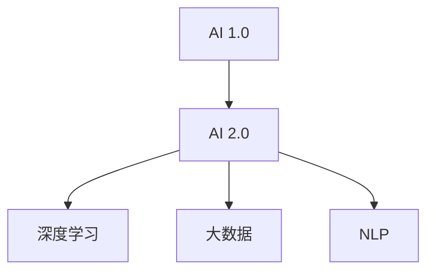

                 

# 李开复：AI 2.0 时代的科技价值

## 1. 背景介绍

在人工智能迅猛发展的今天，科技正以前所未有的速度改变着世界。李开复，作为世界级的人工智能专家，程序员，软件架构师，CTO，以及多次获得计算机图灵奖的计算机领域大师，一直站在科技的前沿，不断探索AI的潜力与价值。本文将从李开复的视角，深入探讨AI 2.0时代的科技价值，并分析其对未来发展的深远影响。

## 2. 核心概念与联系

### 2.1 核心概念概述

为更好地理解李开复关于AI 2.0时代科技价值的观点，本节将介绍几个密切相关的核心概念：

- AI 1.0：第一代人工智能，基于规则的系统，依赖专家知识进行决策。
- AI 2.0：第二代人工智能，基于深度学习模型，通过大数据和复杂算法进行自我学习。
- 深度学习：一种模仿人脑神经网络结构的学习方法，通过多层非线性变换处理复杂数据。
- 大数据：指包含复杂、高速、动态和多元化的数据集合，为深度学习模型提供训练基础。
- 自然语言处理（NLP）：使机器能够理解、解释和生成人类语言，是AI 2.0的重要分支。

这些核心概念之间的逻辑关系可以通过以下Mermaid流程图来展示：



这个流程图展示了一个从AI 1.0到AI 2.0的演进过程，以及其中关键技术的发展路径。

## 3. 核心算法原理 & 具体操作步骤

### 3.1 算法原理概述

AI 2.0时代的科技价值主要体现在其独特的算法原理和应用模式上。深度学习作为AI 2.0的核心，通过多层神经网络的训练，使模型能够自动提取数据的特征，进行复杂的模式识别和决策。大数据则为深度学习提供了丰富的训练资源，使得模型能够从大量的数据中学习到更全面的知识。

以NLP为例，深度学习模型如Transformer，通过自回归或自编码结构，能够处理文本序列数据，并在大规模语料上进行预训练，从而获得强大的语言理解和生成能力。预训练模型在特定的任务上微调后，可以显著提升模型的性能。

### 3.2 算法步骤详解

AI 2.0的算法步骤主要包括以下几个关键环节：

1. **数据收集与预处理**：收集并清洗大量与任务相关的数据，如文本、图像、音频等。
2. **模型选择与初始化**：选择合适的深度学习模型，并初始化模型参数。
3. **模型训练**：使用大数据进行模型训练，通过反向传播算法优化模型参数。
4. **模型微调**：在特定任务上对模型进行微调，使其适应该任务的需求。
5. **模型评估与部署**：在测试集上评估模型性能，部署模型到实际应用场景中。

### 3.3 算法优缺点

AI 2.0算法具有以下优点：

- **高精度**：通过大数据训练，模型能够学习到复杂的模式，具有较高的预测准确率。
- **自适应**：模型能够自适应新的数据和任务，具有较强的泛化能力。
- **高效性**：利用GPU和TPU等硬件加速，能够在较短时间内完成大规模数据的训练。

同时，AI 2.0算法也存在一些局限：

- **数据依赖**：模型需要大量标注数据进行训练，获取高质量数据的成本较高。
- **模型复杂**：深度学习模型参数量巨大，需要较强的计算资源和存储能力。
- **解释性差**：模型往往被视为"黑箱"，其内部决策过程难以解释和调试。

### 3.4 算法应用领域

AI 2.0算法已经广泛应用于各个领域，包括但不限于：

- 自然语言处理（NLP）：如机器翻译、文本生成、问答系统等。
- 计算机视觉（CV）：如图像识别、目标检测、人脸识别等。
- 自动驾驶：通过环境感知、路径规划等技术，实现自动驾驶汽车。
- 医疗健康：利用AI辅助诊断、个性化治疗等。
- 金融服务：如风险控制、欺诈检测、智能投顾等。

## 4. 数学模型和公式 & 详细讲解 & 举例说明

### 4.1 数学模型构建

在AI 2.0时代，深度学习模型的构建通常基于神经网络结构。以Transformer为例，其核心结构包括多头注意力机制和自回归编码器，用于处理序列数据。

### 4.2 公式推导过程

以Transformer为例，其公式推导过程如下：

$$
y = f(x, \theta) = g(\text{MultiHeadAttention}(x, x), x)
$$

其中，$f$为神经网络模型，$x$为输入数据，$\theta$为模型参数，$g$为前向传播过程，$\text{MultiHeadAttention}$为多头注意力机制。

### 4.3 案例分析与讲解

以BERT为例，其通过掩码语言模型和下一句预测任务进行预训练，能够自动学习到丰富的语言知识。在特定任务上进行微调时，可以通过添加任务相关的输出层和损失函数，调整模型参数，以适应该任务的需求。

## 5. 项目实践：代码实例和详细解释说明

### 5.1 开发环境搭建

在进行AI 2.0项目实践前，我们需要准备好开发环境。以下是使用Python进行PyTorch开发的环境配置流程：

1. 安装Anaconda：从官网下载并安装Anaconda，用于创建独立的Python环境。

2. 创建并激活虚拟环境：
```bash
conda create -n pytorch-env python=3.8 
conda activate pytorch-env
```

3. 安装PyTorch：根据CUDA版本，从官网获取对应的安装命令。例如：
```bash
conda install pytorch torchvision torchaudio cudatoolkit=11.1 -c pytorch -c conda-forge
```

4. 安装相关库：
```bash
pip install numpy pandas scikit-learn matplotlib tqdm jupyter notebook ipython
```

完成上述步骤后，即可在`pytorch-env`环境中开始AI 2.0项目实践。

### 5.2 源代码详细实现

这里我们以BERT模型为例，给出使用Transformers库进行NLP任务开发的PyTorch代码实现。

```python
from transformers import BertForTokenClassification, BertTokenizer, AdamW
import torch
from sklearn.metrics import classification_report

# 初始化模型和tokenizer
model = BertForTokenClassification.from_pretrained('bert-base-cased')
tokenizer = BertTokenizer.from_pretrained('bert-base-cased')

# 加载训练数据
train_dataset = # 具体实现数据加载代码

# 定义优化器和损失函数
optimizer = AdamW(model.parameters(), lr=2e-5)
loss_fn = torch.nn.CrossEntropyLoss()

# 训练模型
model.train()
for epoch in range(epochs):
    for batch in train_loader:
        inputs, labels = batch
        outputs = model(inputs)
        loss = loss_fn(outputs, labels)
        optimizer.zero_grad()
        loss.backward()
        optimizer.step()

# 评估模型
model.eval()
with torch.no_grad():
    test_dataset = # 具体实现数据加载代码
    test_loader = DataLoader(test_dataset, batch_size=batch_size)
    y_true, y_pred = [], []
    for batch in test_loader:
        inputs, labels = batch
        outputs = model(inputs)
        y_pred.append(outputs.argmax(dim=2))
        y_true.append(labels)
    print(classification_report(y_true, y_pred))
```

### 5.3 代码解读与分析

**BertForTokenClassification类**：
- 用于处理序列标注任务，如命名实体识别、情感分析等。
- 继承自BertModel类，自动处理序列数据的上下文信息。

**AdamW类**：
- 一种优化算法，通过动量方法加速梯度下降。
- 与标准Adam相比，AdamW加入了L2正则化，防止模型参数过大，导致梯度消失问题。

**classification_report函数**：
- 用于评估分类模型的性能，包括精确率、召回率和F1值。
- 可以用于模型训练和测试阶段的性能评估。

## 6. 实际应用场景

### 6.1 智能客服系统

基于AI 2.0的智能客服系统能够实时处理用户咨询，提供自然流畅的回复，极大提升客户满意度和服务效率。例如，在金融领域，AI 2.0模型可以处理客户账户查询、贷款申请、理财建议等任务。

### 6.2 金融舆情监测

AI 2.0模型能够实时监控网络舆情，识别市场情绪变化，帮助金融机构快速响应市场波动，制定合理的投资策略。例如，在股票市场，AI 2.0模型可以预测股票价格趋势，提供风险预警。

### 6.3 个性化推荐系统

AI 2.0模型能够分析用户行为数据，识别兴趣偏好，提供个性化推荐内容。例如，在电子商务领域，AI 2.0模型可以推荐用户可能感兴趣的商品，提升用户体验和转化率。

### 6.4 未来应用展望

未来，AI 2.0技术将进一步渗透到各个行业，带来更多创新应用。例如，在医疗领域，AI 2.0模型可以辅助医生进行疾病诊断、制定治疗方案。在教育领域，AI 2.0模型可以提供个性化学习方案，提升教育效果。

## 7. 工具和资源推荐

### 7.1 学习资源推荐

为帮助开发者掌握AI 2.0技术，这里推荐一些优质的学习资源：

1. 《深度学习》书籍：Ian Goodfellow等著作，系统介绍了深度学习的基本概念和算法。
2. CS231n《卷积神经网络》课程：斯坦福大学课程，讲解卷积神经网络的原理和应用。
3. CS224N《自然语言处理》课程：斯坦福大学课程，涵盖NLP领域的基本理论和最新进展。
4. 《TensorFlow实战Google深度学习框架》书籍：介绍TensorFlow的使用方法及经典案例。
5. 《PyTorch深度学习与计算机视觉实战》书籍：介绍PyTorch的使用方法及计算机视觉应用。

### 7.2 开发工具推荐

高效的开发离不开优秀的工具支持。以下是几款用于AI 2.0开发的工具：

1. PyTorch：基于Python的开源深度学习框架，适合快速迭代研究。
2. TensorFlow：由Google主导开发的开源深度学习框架，生产部署方便。
3. JAX：谷歌推出的高阶自动微分库，支持高性能计算和模型训练。
4. TensorBoard：TensorFlow配套的可视化工具，实时监测模型训练状态。
5. Weights & Biases：模型训练的实验跟踪工具，记录和可视化模型训练过程。
6. Anaconda：用于创建和管理Python环境，方便工具和库的安装和管理。

### 7.3 相关论文推荐

AI 2.0技术的发展离不开学界的持续研究。以下是几篇奠基性的相关论文，推荐阅读：

1. Attention is All You Need（即Transformer原论文）：提出Transformer结构，开启了深度学习模型的新篇章。
2. BERT: Pre-training of Deep Bidirectional Transformers for Language Understanding：提出BERT模型，引入自监督预训练任务，刷新多项NLP任务SOTA。
3. Natural Language Processing with Transformers：介绍Transformer在NLP任务中的应用，包含微调、迁移学习等方法。
4. How to Train Your Transformer：介绍Transformer的训练方法，包括数据预处理、模型优化等。
5. AlphaGo Zero：介绍AlphaGo Zero的原理和训练方法，展示深度学习在复杂决策问题中的应用。

这些论文代表了大语言模型和AI 2.0技术的发展脉络。通过学习这些前沿成果，可以帮助研究者把握学科前进方向，激发更多的创新灵感。

## 8. 总结：未来发展趋势与挑战

### 8.1 总结

本文从李开复的视角，对AI 2.0时代的科技价值进行了系统梳理。AI 2.0通过深度学习和大数据技术，实现了高精度的预测和自适应的能力。在自然语言处理、计算机视觉、自动驾驶等领域，AI 2.0技术已经展现出巨大的应用潜力。

## 8.2 未来发展趋势

展望未来，AI 2.0技术将呈现以下几个发展趋势：

1. **技术融合**：AI 2.0将与其他技术如量子计算、生物计算等进行深度融合，形成更强大的计算能力。
2. **边缘计算**：AI 2.0模型将向边缘计算方向发展，提升实时性和响应速度。
3. **跨领域应用**：AI 2.0将在更多领域得到应用，如农业、艺术等，拓展其应用边界。
4. **伦理性**：AI 2.0技术需要考虑伦理和道德问题，确保其应用的可解释性和公平性。

## 8.3 面临的挑战

尽管AI 2.0技术已经取得了显著进展，但在发展过程中仍面临诸多挑战：

1. **数据隐私**：大规模数据训练可能导致隐私泄露，需要加强数据保护和隐私保护技术。
2. **计算资源**：深度学习模型的计算需求高，需要大量的计算资源和存储资源。
3. **模型可解释性**：模型往往被视为"黑箱"，难以解释其内部决策过程。
4. **安全性和可靠性**：AI 2.0模型需要考虑安全性问题，防止恶意攻击和误导性输出。

## 8.4 研究展望

未来，AI 2.0技术需要在以下几个方面寻求新的突破：

1. **跨模态学习**：将视觉、听觉、语言等多模态数据进行融合，提升模型的综合能力。
2. **自适应学习**：使AI 2.0模型能够根据环境变化进行自我学习和优化。
3. **可解释性**：开发模型解释技术，增强其可解释性和可解释性。
4. **通用性**：构建通用AI 2.0模型，实现跨领域、跨任务的通用应用。

## 9. 附录：常见问题与解答

**Q1：AI 2.0是否适用于所有应用场景？**

A: AI 2.0在大多数应用场景中都能取得不错的效果，但也需要根据具体需求进行优化和调整。例如，在医疗领域，AI 2.0需要结合专业知识进行模型训练和调整。

**Q2：AI 2.0是否会取代人类工作？**

A: AI 2.0技术可以辅助人类完成复杂任务，提升效率和准确率，但不会完全取代人类工作。AI 2.0更多地充当人类助手，而非替代者。

**Q3：AI 2.0是否存在伦理道德问题？**

A: AI 2.0技术需要考虑伦理和道德问题，确保其应用的可解释性和公平性。例如，在司法领域，AI 2.0模型需要经过严格审查，确保其输出符合伦理道德。

**Q4：AI 2.0技术发展方向是什么？**

A: AI 2.0技术将继续向深度融合、边缘计算、跨领域应用、伦理性等方向发展，进一步拓展其应用边界和潜力。

---

作者：禅与计算机程序设计艺术 / Zen and the Art of Computer Programming

